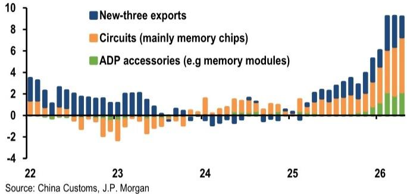
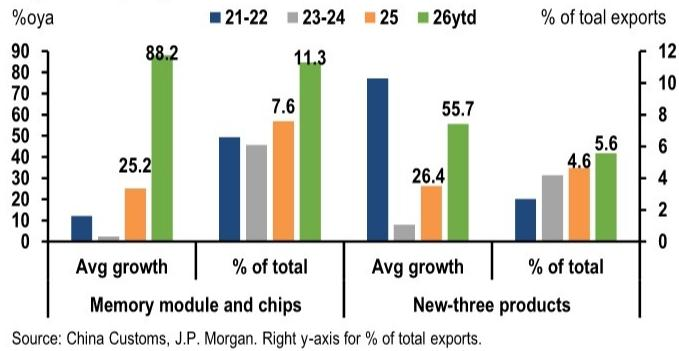
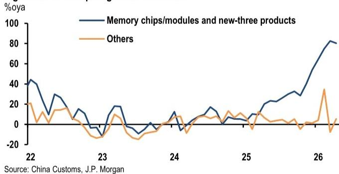
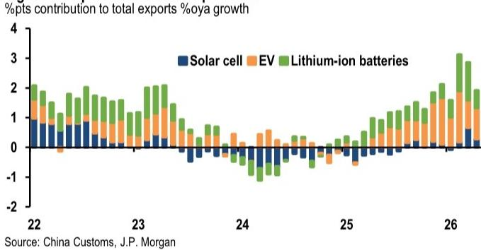
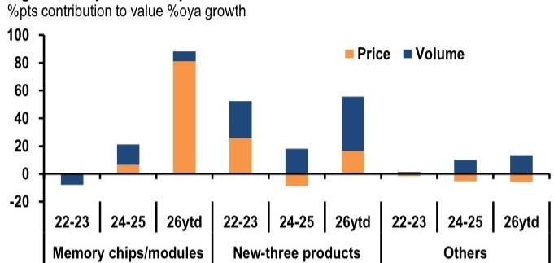
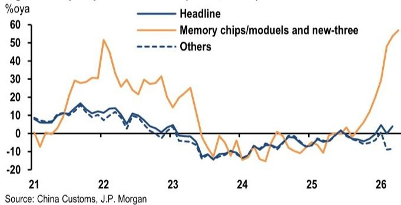
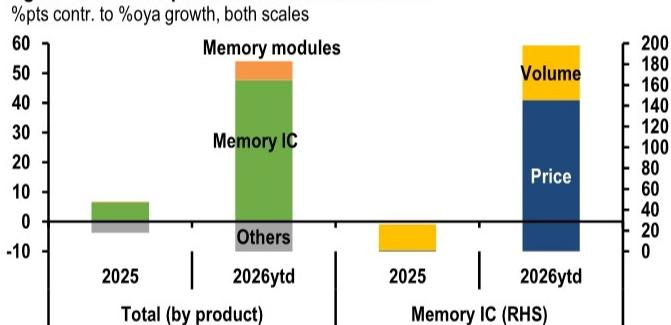
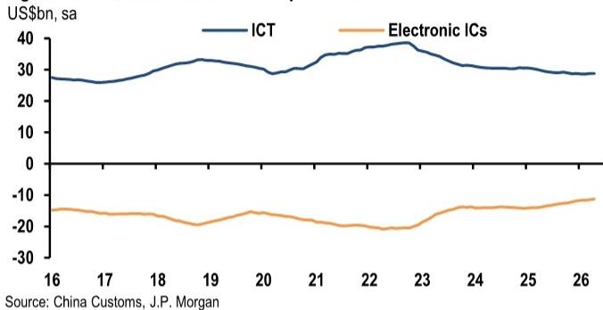
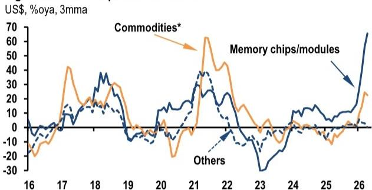
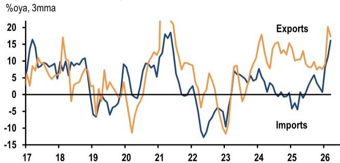

# China: Trade blows out, but composition matters

- Recent trade strength warrants outlook recalibration   
- Export strength is concentrated in memory ICs, EVs, solar, and batteries, driving 58% of total export gains   
- Imports are lifted more by AI supply-chain needs and commodity stockpiling, not domestic demand   
- Export prices for semis have surged, picked up modestly for EVs, solar, and batteries, but continue to deflate for the rest   
- Much depends on whether the trade truce with the US is extended and the impending new Section 301 tariffs

At the start of the year, we held a cautious view on China trade, expecting headwinds from rising trade barriers and stricter enforcement against transshipment. Setting aside the usual year-start seasonal distortions, the trade data for the first four months of the year has been much stronger than anticipated. It is strong enough to warrant a recalibration of our full-year export and import outlook.

The key questions are where that strength is concentrated, and how much of it reflects rising prices vs. volume. Export value growth has been disproportionately driven by AI-linked memory modules, legacy memory ICs, large batteries, EVs, and solar panels. But the spike in export values is distorted by a surge in semiconductor prices. On the import side, the rebound is tied more to a combination of AI-related demand and renewed commodity stockpiling and far less to domestic demand.

Together, these dynamics suggest that this year's trade strength is more sector- and price-sensitive than the broad, volume-driven story that supported net trade and GDP growth last year. i.e., the contribution to GDP growth and employment will be less.

# New drivers of export strength

Last year, the dominant narrative was China's cost advantage and export deflation improving competitiveness even as U.S. tariff uncertainties intensified and China lost U.S. market share. But this year's export outperformance reflects different forces, despite shipment disruptions to the Middle East. The decisive contributors are auto data processing (ADP) accessories and storage units (e.g. memory modules), integrated circuits (e.g. legacy memory chips), and the “new three” products (EVs, solar panels and lithium batteries).

Between January–April, exports in U.S. \$ terms rose 14.5% oya, and these three segments contributed 8.4% pts (or 58%) of the headline gain (Figure 1). AI-related memory modules and chips alone accounted for 12.4% of total exports in April (Figure 2).

Figure 1: New drivers of China exports %pts contribution to total exports (US\$) %oya growth   

bar_stacked

| Year | New-three exports | Circuits (mainly memory chips) | ADP accessories (e.g memory modules) |
|---|---|---|---|
| 22 | 3.5 | 1.0 | -0.5 |
| 23 | 1.8 | -1.5 | -0.5 |
| 24 | -0.5 | 1.5 | -0.5 |
| 25 | 0.5 | 1.0 | -0.5 |
| 26 | 9.0 | 7.0 | 2.0 |

Figure 2: Export growth of selected products   

bar

| Category | Metric | 21-22 (%) | 23-24 (%) | 25 (%) | 26ytd (%) |
|---|---|---|---|---|---|
| Memory module and chips | Avg growth | 10 | 2 | 25.2 | 88.2 |
| Memory module and chips | % of total | 49 | 47 | 7.6 | 11.3 |
| New-three products | Avg growth | 77 | 1 | 26.4 | 55.7 |
| New-three products | % of total | 20 | 3.5 | 4.6 | 5.6 |
Source: China Customs, JPM. Right y-axis for % of total exports.

Outside these three segments, export growth was relatively steady through 2025, then spiked in February on LNY-related front-loading, before easing in March and settling into mild growth in April (Figure 3).

Figure 3: China export growth breakdown   

line

| Year | Memory chips/modules and new-three products (%) | Others (%) |
|---|---|---|
| 22 | 45 | 20 |
| 23 | -5 | -10 |
| 24 | 10 | 5 |
| 25 | 5 | 0 |
| 26 | 85 | 35 |

# Middle East conflict: pains and gains

China's policymakers have often highlighted the post-pandemic shift in export composition from the traditional “old three” (clothing, home appliances, furniture) toward the “new three” (electric vehicles, lithium-ion batteries, solar products).

<table><tr><td>Tingting Ge (852) 2800-0143</td><td>Jiayi Li (852) 2800-5229</td></tr><tr><td>tingting.ge@JPM.com</td><td>jiayi.c.li@JPM.com</td></tr><tr><td>JPM Chase Bank, N.A., Hong Kong Branch</td><td>JPM Chase Bank, N.A., Hong Kong Branch</td></tr><tr><td>Feng Zhu (852) 2800 1745</td><td>Tongfang Yuan (852) 2800-0085</td></tr><tr><td>feng.zhu@JPM.com</td><td>tongfang.yuan@JPM.com</td></tr><tr><td>JPM Chase Bank, N.A., Hong Kong Branch</td><td>JPM Chase Bank, N.A., Hong Kong Branch</td></tr></table>

However, these new-energy exports have also encountered mounting pushback in key destination markets, ranging from allegations of state subsidies and unfair competition to concerns over overcapacity and dumping. Against a high base, growth in these categories cooled in 2H 2023 and 2024, turning into a net drag on overall export growth.

Geopolitical uncertainties and the energy shock crisis appear to have created an opportunity for Chinese new energy product manufacturers. Higher and more volatile oil prices improve the relative economics of electrification and accelerate energy-security-driven demand for alternatives, lifting overseas interest in EVs, solar panels, and lithium batteries. At the same time, China's scale and supply-chain depth in these products allow firms to respond quickly with competitive supply, turning solar panels, lithium batteries, and EVs into a more important source of export strength even as domestic auto sales have weakened. Exports of the “new three” products contributed 2.3% pts to the 14.5% oya ytd headline exports growth (Figure 4).

Figure 4: Exports of new-three products   

bar_stacked

%pts contribution to total exports %oya growth
| Year | Solar cell (%) | EV (%) | Lithium-ion batteries (%) |
|---|---|---|---|
| 22 | 0.9 | 0.5 | 1.3 |
| 23 | 0.4 | 0.7 | 1.3 |
| 24 | -0.3 | 0.3 | -0.8 |
| 25 | -0.2 | -0.3 | 0.3 |
| 26 | 0.6 | 0.8 | 2.9 |

# Price changes vary widely

Complicating the interpretation of recent export strength is the growing role of price effects in some of the new export drivers. Memory chips/modules stand out: ADP module unit prices in US\$ terms surged close to 200% oya (vs. 4.9% y/y in 2025), while IC prices rose 92.4% oya in April (vs. 6.9% y/y in 2025). Taken together, the primary driver of memory chip and module export growth has rotated from volume in 2025 to price in recent months (Figure 5). Their average price contribution to export value % oya growth rose to 85.2% pts in April (vs. 5.9% pts on average in 2025). Export prices for the three new products have also picked up this year, reversing the broad deflation seen over the prior two years, but in contrast to semiconductors, volumes appear to have done more of the heavy lifting.

<table><tr><td>Asia Pacific Economic Research China: Trade blows out, but composition matters 22 May 2026</td></tr></table>

Figure 5: Export decomposition   

bar_stacked

%pts contribution to value %oya growth
| Category | Timeframe | Value (%) |
| :--- | :--- | :--- |
| Memory chips/modules | 22-23 | -10 |
| Memory chips/modules | 24-25 | 8 |
| Memory chips/modules | 26ytd | 87 |
| New-three products | 22-23 | 25 |
| New-three products | 24-25 | -10 |
| New-three products | 26ytd | 15 |
| Others | 22-23 | 0 |
| Others | 24-25 | -5 |
| Others | 26ytd | -5 |
Volume (%pts contribution to value %oya growth)

Source: China Customs, JPM

AI/memory-linked exporters have benefited from surging memory chip prices, while new energy sectors have been supported by renewed demand amid energy-shock resilience considerations. Beyond the new export drivers, however, export prices (in US\$ terms) for other products remained in deflation as of March (Figure 6), even as PPI and headline export price annual rates turned positive. With CNY strengthening, especially in basket terms, and PPI rising more than expected in April, questions are emerging over whether China's export price competitiveness could begin to erode.

Figure 6: Export price breakdown (in US\$ terms)   

line

| Year | Headline | Memory chips/moduels and new-three | Others |
|------|----------|-------------------------------------|--------|
| 21   | ~5       | ~-10                                | ~5     |
| 22   | ~10      | ~50                                 | ~10    |
| 23   | ~0       | ~25                                 | ~0     |
| 24   | ~-10     | ~-10                                | ~-10   |
| 25   | ~-5      | ~-5                                 | ~-5    |
| 26   | ~0       | ~60                                 | ~-10   |

The external energy-shock-driven rise in producer prices raises input costs and increases pressure to pass these costs through to export prices. While China's export prices tend to co-move with PPI, the recent spike in PPI inflation appears to be more concentrated in upstream, labor-light raw materials, with limited transmission into mid-to-downstream sectors so far. Consumer goods PPI remained in deflation. The extent of pass-through also hinges on how persistent the energy shock proves to be.

That said, China's export competitiveness should remain underpinned by its structural cost advantages, namely supply-chain depth, scale efficiencies as a manufacturing hub, and an ecosystem supported by efficient logistics. The energy shock is also hitting economies unevenly: China's energy consumption mix and reserves have made energy-cost pass-through less complete than some of its peers. As a result, even if headline export price growth turns positive, we expect consumer goods, which account for nearly $20\%$ of China's exports, to continue to experience mild deflation, which could help underpin overall export competitiveness.

<table><tr><td>Tingting Ge (852) 2800-0143</td><td>Jiayi Li (852) 2800-5229</td></tr><tr><td>tingting.ge@JPM.com</td><td>jiayi.c.li@JPM.com</td></tr><tr><td>JPM Chase Bank, N.A., Hong Kong Branch</td><td>JPM Chase Bank, N.A., Hong Kong Branch</td></tr><tr><td>Feng Zhu (852) 2800 1745</td><td>Tongfang Yuan (852) 2800-0085</td></tr><tr><td>feng.zhu@JPM.com</td><td>tongfang.yuan@JPM.com</td></tr><tr><td>JPM Chase Bank, N.A., Hong Kong Branch</td><td>JPM Chase Bank, N.A., Hong Kong Branch</td></tr></table>

# Linking to the regional AI supply chain

As China's apparent demand for ADP memory chips and modules has risen, imports of related products have also jumped, primarily driven by prices. Memory module import prices surged $359\%$ oya in April, while import volumes, after expanding solidly through much of the past two years, have recently turned into a net drag. By source market, Korea stands out. Its shipments to China began to gain momentum late last year and have accelerated further recently, lifting the trend pace to $158\% 3\mathrm{m} / 3\mathrm{m}$ saar. A more granular breakdown suggests the strength was concentrated in memory ICs. Import values have been increasingly lifted by the price effect, although underlying volume momentum has also firmed (Figure 7).

Figure 7: China imports from Korea breakdown   

bar

%pts contr. to %oya growth, both scales
| Category | Year | Value (%) |
| :--- | :--- | :--- |
| Total (by product) | 2025 | -1 |
| Memory IC (b) | 2025ytd | 7 |
| Memory IC (b) | 2026ytd | 48 |
| Others | 2026ytd | -9 |
| Memory IC (RHS) | 2025 | -1 |
| Memory IC (RHS) | 2026ytd | 13 |
| Volume | 2025 | 1 |
| Volume | 2026ytd | 140 |
| Price | 2025 | 140 |
| Price | 2026ytd | 130 |

Source: China Customs, JPM

This highlights how current import/export momentum is tied to global semiconductor supply tightness and the memory price cycle. Debate has intensified over whether China is also benefiting from the AI upcycle as Korea and Taiwan. We see some evidence: parts of China's AI tech ecosystem have gained from the global AI upcycle, supporting capex expansion. China's legacy chip producers have capacity and cost advantages in mature nodes and have benefited from chip inflation amid strong demand and tight supply. Global demand has broadened as hyperscaler capex extends beyond data-center buildouts to upstream enablers and smaller-cap players, while cybersecurity and infrastructure upgrades are also underpinning chip demand.

That said, China's position in the AI hardware supply chain remains structurally different from Korea and Taiwan, key producers of high-end chips and advanced memory for AI data-center demand that is closely tied to US hyperscalers' capex. China remains a net importer of memory chips and modules, albeit with a narrowing deficit especially for ICs

(Figure 8), and is largely a price taker in that segment. This is more than offset by China's surplus in ICT trade. The AI tech sector's share of the overall economy is also relatively small.

Figure 8: Net trade of selected tech products   

line

| Year | ICT (US$bn, sa) | Electronic ICs (US$bn, sa) |
|---|---|---|
| 16 | 28 | -15 |
| 17 | 27 | -16 |
| 18 | 30 | -17 |
| 19 | 33 | -19 |
| 20 | 30 | -16 |
| 21 | 34 | -18 |
| 22 | 37 | -20 |
| 23 | 39 | -21 |
| 24 | 32 | -15 |
| 25 | 31 | -14 |
| 26 | 30 | -12 |
Source: China Customs, JPM

# Renewed commodity stockpiling

While the AI upcycle and chip inflation explain part of the import strength since late 2025, questions persist over whether this primarily signals a broader domestic-demand recovery. An additional, and underappreciated, driver is renewed commodity stockpiling. China's stockpiling accelerated in 2023 following the Russia–Ukraine conflict, with commodity import volumes reaching record highs that are difficult to explain by macro fundamentals or price effects (Figure 9).

Figure 9: China commodity import volume growth decomposition   

bar_line

| Date | Macro fundamentals (%) | Price effect (%) | Non-macro-linked (%) |
|---|---|---|---|
| 12 | 7 | 0 | 15 |
| 13 | 10 | 0 | 20 |
| 14 | 8 | 0 | 18 |
| 15 | 6 | 0 | -15 |
| 16 | 9 | 0 | 12 |
| 17 | 7 | 0 | 10 |
| 18 | 5 | 0 | 8 |
| 19 | 3 | 0 | -5 |
| 20 | 4 | 0 | 10 |
| 21 | 12 | 0 | 20 |
| 22 | 3 | -5 | -5 |
| 23 | 5 | 0 | 15 |
| 24 | 4 | 0 | 10 |
| 25 | 3 | 0 | -10 |
| 26 | 1 | -2 | 10 |
Source: China Customs, NBS, PBOC, JPM

More recently, heightened geopolitical uncertainty, particularly the Middle East conflict and the associated energy shock, has reinforced energy-security concerns, a theme highlighted by top policymakers at the April Politburo meeting. Stockpiling signals have been visible since 2H last year, even as FAI was collapsing, and appear to have intensified in recent months despite higher commodity prices.

That said, the import picture offers muted evidence of a broad-based domestic demand recovery. Outside of memory chips and modules, and a range of “stockpiling-prone” commodities (energy, minerals, chemicals, and metals), imports of other product categories have seen muted growth (Figure 10).

This composition points to demand that is still relatively narrow and policy-tilted: strength appears concentrated in high-end manufacturing supply chains, while more cyclical, consumption- and private-sector-driven import categories show limited momentum.

Figure 10: China imports breakdown   

line

| Year | Commodities* | Memory chips/modules | Others |
|------|--------------|------------------------|--------|
| 16   | -10          | -5                     | -5     |
| 17   | 40           | 10                     | 5      |
| 18   | 30           | 20                     | 10     |
| 19   | 0            | 0                      | 0      |
| 20   | -10          | -5                     | -5     |
| 21   | 60           | 40                     | 30     |
| 22   | 0            | 0                      | 0      |
| 23   | -30          | -10                    | -10    |
| 24   | 0            | 0                      | 0      |
| 25   | 0            | 0                      | 0      |
| 26   | 20           | 60                     | 20     |

Source: China Customs, JPM. \*include HS25-40, 68-83.

# "AI/energy winners"

Taken together, the recent trade impulse looks asymmetric: strength is concentrated in a narrow set of AI- and energy-transition-linked “winners”, while the broader economy remains exposed to higher oil and gas costs that could weigh on margins and activity (seen in April activity data) even as select export categories stay resilient. This backdrop is further complicated by lingering policy uncertainty, though the feared headwinds from rising trade barriers and stricter enforcement against transshipment have not yet materialized to derail broad export strength. US–China tariff risks remain, and there was no major breakthrough from the recent Trump-Xi summit or the extension of the 1-year truce. In addition, the U.S. could reimpose or extend new Section 301 tariffs soon. Global growth has also been more resilient than expected despite the energy shock, but pressures could still build if energy supply disruptions remain, keeping the external environment a swing factor for trade into 2H.

# Implications for growth and employment

The GDP implications are less clear-cut. Barring a sharp pullback, this year's nominal export growth could reach the high single digits (around $8\%$ in our latest forecast), roughly double our expectation at the start of the year $(3.5\% y / y)$ . Meanwhile, with imports strengthening, driven in part by renewed stockpiling and AI supply-chain inputs, full-year nominal import growth (around $13\%$ ) could outpace exports for the first time since 2021. Import volume growth has also been catching up with exports lately (Figure 11).

Figure 11: Trade volume growth   

line

| Year | Exports | Imports |
|------|---------|---------|
| 17   | ~5      | ~15     |
| 18   | ~10     | ~10     |
| 19   | ~-5     | ~-5     |
| 20   | ~-10    | ~-5     |
| 21   | ~20     | ~15     |
| 22   | ~-5     | ~-10    |
| 23   | ~-10    | ~-15    |
| 24   | ~15     | ~5      |
| 25   | ~10     | ~-5     |
| 26   | ~20     | ~15     |

Source: China Customs, JPM

Taken together, this could leave the net export contribution to economic growth smaller, more volatile, and more sensitive to relative price moves (chip prices, commodity prices, FX) and to shifts in the demand composition. Moreover, the current tailwinds are skewed toward labor-light, upstream, and tech-adjacent sectors (semiconductors, metals/chemicals, energy and related equipment), where price-led gains can lift trade values without generating large, immediate multipliers for employment and household income, implying limited spillover to consumption and private-sector activity even if the headline trade impulse remains firm.

The growth implication contrasts with Taiwan and Korea, where exposure to the AI upcycle is more direct, anchored in high-end logic and advanced memory that are closely tied to US hyperscaler capex, and where the tech sector carries a larger weight and higher value-added share in overall production and exports. By comparison, the tech share in China's industrial production is below $15\%$ (vs. $60\%$ for Taiwan), which mechanically limits how much an AI-driven upswing can translate into broad-based acceleration, even when specific export categories are booming in nominal terms.

Still, there is a credible path for today's AI-linked outperformance to broaden over the next few years, even if the transmission is likely to be gradual. The policy-backed push into high-end manufacturing, alongside upgrades in cybersecurity, data center infrastructure, and selective capex, can help nurture new export and growth engines over time, starting with mature-node chips and adjacent hardware ecosystems where China already has scale and cost advantages, and potentially extending up the semiconductor value chain. Further out, priorities such as “mother machine” equipment and humanoid robotics could deepen the pipeline of higher value-added exports by strengthening capabilities in precision manufacturing, automation, and embodied AI. The key distinction is timing and breadth: near-term gains remain concentrated, while evidence of a broader domestic-demand recovery is still limited in the import mix.

Analysts' Compensation: The research analysts responsible for the preparation of this report receive compensation based upon various factors, including the quality and accuracy of research, client feedback, competitive factors, and overall firm revenues.

# Other Disclosures

JPM is a marketing name for investment banking businesses of JPM Chase & Co. and its subsidiaries and affiliates worldwide.

UK MIFID FICC research unbundling exemption: UK clients should refer to UK MIFID Research Unbundling exemption for details of JPM's implementation of the FICC research exemption and guidance on relevant FICC research categorisation.

Any long form nomenclature for references to China; Hong Kong; Taiwan; and Macau within this research material are Mainland China; Hong Kong SAR (China); Taiwan (China); and Macau SAR (China).

JPM may, from time to time, write on issuers or securities targeted by economic or financial sanctions imposed or administered by the governmental authorities of the U.S., EU, UK or other relevant jurisdictions (Sanctioned Securities). Nothing in this report is intended to be read or construed as encouraging, facilitating, promoting or otherwise approving investment or dealing in such Sanctioned Securities. Clients should be aware of their own legal and compliance obligations when making investment decisions.

Any digital or crypto assets discussed in this research report are subject to a rapidly changing regulatory landscape. For relevant regulatory advisories on crypto assets, including bitcoin and ether, please see https://www.JPM.com/disclosures/cryptoasset-disclosure.

The author(s) of this research report may not be licensed to carry on regulated activities in your jurisdiction and, if not licensed, do not hold themselves out as being able to do so.

Exchange-Traded Funds (ETFs): JPM Securities LLC (“JPMS”) acts as authorized participant for substantially all U.S.-listed ETFs. To the extent that any ETFs are mentioned in this report, JPMS may earn commissions and transaction-based compensation in connection with the distribution of those ETF shares and may earn fees for performing other trade-related services, such as securities lending to short sellers of the ETF shares. JPMS may also perform services for the ETFs themselves, including acting as a broker or dealer to the ETFs. In addition, affiliates of JPMS may perform services for the ETFs, including trust, custodial, administration, lending, index calculation and/or maintenance and other services.

Changes to Interbank Offered Rates (IBORs) and other benchmark rates: Certain interest rate benchmarks are, or may in the future become, subject to ongoing international, national and other regulatory guidance, reform and proposals for reform. For more information, please consult: https://www.JPM.com/global/disclosures/interbank\_offered\_rates

Private Bank Clients: Where you are receiving research as a client of the private banking businesses offered by JPM Chase & Co. and its subsidiaries (“JPM Private Bank”), research is provided to you by JPM Private Bank and not by any other division of JPM, including, but not limited to, the JPM Corporate and Investment Bank and its Global Research division.

Legal entity responsible for the production and distribution of research: The legal entity identified below the name of the Reg AC Research Analyst who authored this material is the legal entity responsible for the production of this research. Where multiple Reg AC Research Analysts authored this material with different legal entities identified below their names, these legal entities are jointly responsible for the production of this research. Where more than one legal entity is listed under an analyst's name, the first legal entity is responsible for the production unless stated otherwise. Research Analysts from various JPM affiliates may have contributed to the production of this material but may not be licensed to carry out regulated activities in your jurisdiction (and do not hold themselves out as being able to do so). Unless otherwise stated below in the legal entity disclosures, this material has been distributed by the legal entity responsible for production, or where more than one legal entity is listed under the analyst's name, the first legal entity will be responsible for distribution. If you have any queries, please contact the relevant Research Analyst in your jurisdiction or the entity in your jurisdiction that has distributed this research material.

# Legal Entities Disclosures and Country-/Region-Specific Disclosures:

Argentina: JPM Chase Bank N.A Sucursal Buenos Aires is regulated by Banco Central de la República Argentina ("BCRA"- Central Bank of Argentina) and Comisión Nacional de Valores ("CNV"- Argentinian Securities Commission - ALYC y AN Integral N°51).

Australia: JPM Securities Australia Limited (“JPMSAL”) (ABN 61 003 245 234/AFS Licence No: 238066) is regulated by the Australian Securities and Investments Commission and is a Market Participant of ASX Limited, a Clearing and Settlement Participant of ASX Clear Pty Limited and a Clearing Participant of ASX Clear (Futures) Pty Limited. This material is issued and distributed in Australia by or on behalf of JPMSAL only to "wholesale clients" (as defined in section 761G of the Corporations Act 2001). A list of all financial products covered can be found by visiting https://www.jpmm.com/research/disclosures. JPM seeks to cover companies of relevance to the domestic and international investor base across all Global Industry Classification Standard (GICS) sectors, as well as across a range of market capitalisation sizes. If applicable, in the course of conducting public side due diligence on the subject company(ies), the Research Analyst team may at times perform such diligence through corporate engagements such as site visits, discussions with company representatives, management presentations, etc. Research issued by JPMSAL has been prepared in accordance with JPM Australia’s Research Independence Policy which can be found at the following link: JPM Australia - Research Independence Policy.

Brazil: Banco JPM S.A. is regulated by the Comissao de Valores Mobiliarios (CVM) and by the Central Bank of Brazil. Ombudsman

JPM: 0800-7700847 / 0800-7700810 (For Hearing Impaired) / ouvidoria.jp.morgan@jpmchase.com.

Canada: JPM Securities Canada Inc. is a registered investment dealer, regulated by the Canadian Investment Regulatory Organization and the Ontario Securities Commission and is the participating member on Canadian exchanges. This material is distributed in Canada by or on behalf of JPM Securities Canada Inc.

Chile: Inversiones JPM Limitada is an unregulated entity incorporated in Chile.

China: JPM Securities (China) Company Limited has been approved by CSRC to conduct the securities investment consultancy business.

Colombia: Banco JPM Colombia S.A. is supervised by the Superintendencia Financiera de Colombia (SFC). Any reference in this material to products or services offered abroad by entities other than the Bank in Colombia is included exclusively for descriptive purposes. Such references do not constitute, and should not be construed as, promotional activity or the provision of financial products or services within Colombian territory, as defined under applicable Colombian regulation.

Dubai International Financial Centre (DIFC): JPM Chase Bank, N.A., Dubai Branch is regulated by the Dubai Financial Services Authority (DFSA) and its registered address is Dubai International Financial Centre - The Gate, West Wing, Level 3 and 9 PO Box 506551, Dubai, UAE. This material has been distributed by JPM Chase Bank, N.A., Dubai Branch to persons regarded as professional clients or market counterparties as defined under the DFSA rules.

European Economic Area (EEA): Unless specified to the contrary, research is distributed in the EEA by JPM SE (“JPM SE”), which is authorised as a credit institution by the Federal Financial Supervisory Authority (Bundesanstalt für Finanzdienstleistungsaufsicht, BaFin) and jointly supervised by the BaFin, the German Central Bank (Deutsche Bundesbank) and the European Central Bank (ECB). JPM SE is a company headquartered in Frankfurt with registered address at TaunusTurm, Taunustor 1, Frankfurt am Main, 60310, Germany. The material has been distributed in the EEA to persons regarded as professional investors (or equivalent) pursuant to Art. 4 para. 1 no. 10 and Annex II of MiFID II and its respective implementation in their home jurisdictions (“EEA professional investors”). This material must not be acted on or relied on by persons who are not EEA professional investors. Any investment or investment activity to which this material relates is only available to EEA relevant persons and will be engaged in only with EEA relevant persons.

Hong Kong: JPM Securities (Asia Pacific) Limited (CE number AAJ321) is regulated by the Hong Kong Monetary Authority and the Securities and Futures Commission in Hong Kong, and JPM Broking (Hong Kong) Limited (CE number AAB027) is regulated by the Securities and Futures Commission in Hong Kong. JPM Chase Bank, N.A., Hong Kong Branch (CE Number AAL996) is regulated by the Hong Kong Monetary Authority and the Securities and Futures Commission, is organized under the laws of the United States with limited liability. Where the distribution of this material is a regulated activity in Hong Kong, the material is distributed in Hong Kong by or through JPM Securities (Asia Pacific) Limited and/or JPM Broking (Hong Kong) Limited.

India: JPM India Private Limited (Corporate Identity Number - U67120MH1992FTC068724), having its registered office at JPM Tower, Off. C.S.T. Road, Kalina, Santacruz - East, Mumbai – 400098, is registered with the Securities and Exchange Board of India (SEBI) as a 'Research Analyst' having registration number INH000001873. JPM India Private Limited is also registered with SEBI as a member of the National Stock Exchange of India Limited and the Bombay Stock Exchange Limited (SEBI Registration Number – INZ000239730) and as a Merchant Banker (SEBI Registration Number - MB/INM000002970). Telephone: 91-22-6157 3000, Facsimile: 91-22-6157 3990 and Website: http://www.jpmipl.com. JPM Chase Bank, N.A. - Mumbai Branch is licensed by the Reserve Bank of India (RBI) (Licence No. 53/Licence No. BY.4/94; SEBI - IN/CUS/014/ CDSL : IN-DP-CDSL-444-2008/ IN-DP-NSDL-285-2008/ INBI00000984/ INE231311239) as a Scheduled Commercial Bank in India, which is its primary license allowing it to carry on Banking business in India and other activities, which a Bank branch in India are permitted to undertake. For non-local research material, this material is not distributed in India by JPM India Private Limited. Compliance Officer: Ashutosh Sharma; ashutosh.j.sharma@jpmchase.com; +912261575002. Grievance Officer: Ramprasadh K, jpmipl.research.feedback@JPM.com; +912261573000. Registration granted by SEBI and certification from NISM in no way guarantee performance of the intermediary or provide any assurance of returns to investors. Please visit Terms and Conditions and Most Important Terms and Conditions (MITC). The annual Compliance audit report is available at http://www.jpmipl.com/#research.

Indonesia: PT JPM Sekuritas Indonesia is a member of the Indonesia Stock Exchange and is registered and supervised by the Otoritas Jasa Keuangan (OJK).

Korea: JPM Securities (Far East) Limited, Seoul Branch, is a member of the Korea Exchange (KRX). JPM Chase Bank, N.A., Seoul Branch, is licensed as a branch office of foreign bank (JPM Chase Bank, N.A.) in Korea. Both entities are regulated by the Financial Services Commission (FSC) and the Financial Supervisory Service (FSS). For non-macro research material, the material is distributed in Korea by or through JPM Securities (Far East) Limited, Seoul Branch.

Japan: JPM Securities Japan Co., Ltd. and JPM Chase Bank, N.A., Tokyo Branch are regulated by the Financial Services Agency in Japan.

Malaysia: This material is issued and distributed in Malaysia by JPM Securities (Malaysia) Sdn Bhd (18146-X), which is a Participating Organization of Bursa Malaysia Berhad and holds a Capital Markets Services License issued by the Securities Commission in Malaysia.

Mexico: JPM Casa de Bolsa, S.A. de C.V., JPM Grupo Financiero is member of the Mexican Stock Exchange (“Bolsa Mexicana de Valores”) and the Institutional Stock Exchange (“Bolsa Institucional de Valores”), and it is authorized to act as a broker dealer by the

National Banking and Securities Exchange Commission ("Comisión Nacional Bancaria y de Valores").

New Zealand: This material is issued and distributed by JPMSAL in New Zealand only to "wholesale clients" (as defined in the Financial Markets Conduct Act 2013). JPMSAL is registered as a Financial Service Provider under the Financial Service providers (Registration and Dispute Resolution) Act of 2008.

Philippines: JPM Securities Philippines Inc. is a Trading Participant of the Philippine Stock Exchange and a member of the Securities Clearing Corporation of the Philippines and the Securities Investor Protection Fund. It is regulated by the Securities and Exchange Commission.

Singapore: This material is issued and distributed in Singapore by or through JPM Securities Singapore Private Limited (JPMSS) [MDDI (P) 057/08/2025 and Co. Reg. No.: 199405335R], which is a member of the Singapore Exchange Securities Trading Limited, and/or JPM Chase Bank, N.A., Singapore branch (JPMCB Singapore), both of which are regulated by the Monetary Authority of Singapore. This material is issued and distributed in Singapore only to accredited investors, expert investors and institutional investors, as defined in Section 4A of the Securities and Futures Act, Cap. 289 (SFA). This material is not intended to be issued or distributed to any retail investors or any other investors that do not fall into the classes of “accredited investors,” “expert investors” or “institutional investors,” as defined under Section 4A of the SFA. Recipients of this material in Singapore are to contact JPMSS or JPMCB Singapore in respect of any matters arising from, or in connection with, the material.

South Africa: JPM Equities South Africa Proprietary Limited and JPM Chase Bank, N.A., Johannesburg Branch are members of the Johannesburg Securities Exchange and are regulated by the Financial Services Conduct Authority (FSCA).

Taiwan: JPM Securities (Taiwan) Limited is a participant of the Taiwan Stock Exchange (company-type) and regulated by the Taiwan Securities and Futures Bureau. Material relating to equity securities is issued and distributed in Taiwan by JPM Securities (Taiwan) Limited, subject to the license scope and the applicable laws and the regulations in Taiwan. To the extent that JPM Securities (Taiwan) Limited produces research materials on securities not listed on the Taiwan Stock Exchange or Taipei Exchange (“Non-Taiwan Listed Securities”), these materials shall not constitute securities recommendations for the purpose of applicable Taiwan regulations, and, for the avoidance of doubt, JPM Securities (Taiwan) Limited does not act as broker for Non-Taiwan Listed Securities. According to Paragraph 2, Article 7-1 of Operational Regulations Governing Securities Firms Recommending Trades in Securities to Customers (as amended or supplemented) and/or other applicable laws or regulations, please note that the recipient of this material is not permitted to engage in any activities in connection with the material that may give rise to conflicts of interests, unless otherwise disclosed in the “Important Disclosures” in this material.

Thailand: This material is issued and distributed in Thailand by JPM Securities (Thailand) Ltd., which is a member of the Stock Exchange of Thailand and is regulated by the Ministry of Finance and the Securities and Exchange Commission. The registered address is 548 One City Center Building, 50th Floor, Ploenchit Road, Lymphini, Pathum Wan, Bangkok 10330.

UK: Research is produced in the UK by JPM Securities plc (“JPMS plc”) which is a member of the London Stock Exchange and is authorised by the Prudential Regulation Authority and regulated by the Financial Conduct Authority and the Prudential Regulation Authority or JPM Markets Limited (“JPMML Ltd”) which is authorised and regulated by the Financial Conduct Authority. Unless specified to the contrary, this material is distributed in the UK by JPMS plc and is directed in the UK only to: (a) persons having professional experience in matters relating to investments falling within article 19(5) of the Financial Services and Markets Act 2000 (Financial Promotion) (Order) 2005 (“the FPO”); (b) persons outlined in article 49 of the FPO (high net worth companies, unincorporated associations or partnerships, the trustees of high value trusts, etc.); or (c) any persons to whom this communication may otherwise lawfully be made; all such persons being referred to as "UK relevant persons". This material must not be acted on or relied on by persons who are not UK relevant persons. Any investment or investment activity to which this material relates is only available to UK relevant persons and will be engaged in only with UK relevant persons. A description of JPM EMEA’s policy for prevention and avoidance of conflicts of interest related to the production of Research can be found at the following link: JPM EMEA - Research Independence Policy.

U.S.: JPM Securities LLC (“JPMS”) is a member of the NYSE, FINRA, SIPC, and the NFA. JPM Chase Bank, N.A. is a member of the FDIC. Material published by non-U.S. affiliates is distributed in the U.S. by JPMS who accepts responsibility for its content.

General: Additional information is available upon request. The information in this material has been obtained from sources believed to be reliable. While all reasonable care has been taken to ensure that the facts stated in this material are accurate and that the forecasts, opinions and expectations contained herein are fair and reasonable, JPM Chase & Co. or its affiliates and/or subsidiaries (collectively JPM) make no representations or warranties whatsoever to the completeness or accuracy of the material provided, except with respect to any disclosures relative to JPM and the Research Analyst's involvement with the issuer that is the subject of the material. Accordingly, no reliance should be placed on the accuracy, fairness or completeness of the information contained in this material. There may be certain discrepancies with data and/or limited content in this material as a result of calculations, adjustments, translations to different languages, and/or local regulatory restrictions, as applicable. These discrepancies should not impact the overall investment analysis, views and/or recommendations of the subject company(ies) that may be discussed in the material. Artificial intelligence tools may have been used in the preparation of this material, including assisting in data analysis, pattern recognition, and content drafting for research material. JPM accepts no liability whatsoever for any loss arising from any use of this material or its contents, and neither JPM nor any of its respective directors, officers or employees, shall be in any way responsible for the contents hereof, apart from the liabilities and responsibilities that may be imposed on them by the relevant regulatory authority in the jurisdiction in question, or the regulatory regime thereunder. Opinions, forecasts or projections contained in this material represent JPM's current opinions or judgment as of the date of the material only and are therefore subject to change without notice. Periodic updates may be provided on companies/industries based on company-specific developments or announcements, market

conditions or any other publicly available information. There can be no assurance that future results or events will be consistent with any such opinions, forecasts or projections, which represent only one possible outcome. Furthermore, such opinions, forecasts or projections are subject to certain risks, uncertainties and assumptions that have not been verified, and future actual results or events could differ materially. The value of, or income from, any investments referred to in this material may fluctuate and/or be affected by changes in exchange rates. All pricing is indicative as of the close of market for the securities discussed, unless otherwise stated. Past performance is not indicative of future results. Accordingly, investors may receive back less than originally invested. This material is not intended as an offer or solicitation for the purchase or sale of any financial instrument. The opinions and recommendations herein do not take into account individual client circumstances, objectives, or needs and are not intended as recommendations of particular securities, financial instruments or strategies to particular clients. This material may include views on structured securities, options, futures and other derivatives. These are complex instruments, may involve a high degree of risk and may be appropriate investments only for sophisticated investors who are capable of understanding and assuming the risks involved. The recipients of this material must make their own independent decisions regarding any securities or financial instruments mentioned herein and should seek advice from such independent financial, legal, tax or other adviser as they deem necessary. JPM may trade as a principal on the basis of the Research Analysts' views and research, and it may also engage in transactions for its own account or for its clients' accounts in a manner inconsistent with the views taken in this material, and JPM is under no obligation to ensure that such other communication is brought to the attention of any recipient of this material. Others within JPM, including Strategists, Sales staff and other Research Analysts, may take views that are inconsistent with those taken in this material. Employees of JPM not involved in the preparation of this material may have investments in the securities (or derivatives of such securities) mentioned in this material and may trade them in ways different from those discussed in this material. This material is not an advertisement for or marketing of any issuer, its products or services, or its securities in any jurisdiction.

Confidentiality and Security Notice: This transmission may contain information that is privileged, confidential, legally privileged, and/or exempt from disclosure under applicable law. If you are not the intended recipient, you are hereby notified that any disclosure, copying, distribution, or use of the information contained herein (including any reliance thereon) is STRICTLY PROHIBITED. Although this transmission and any attachments are believed to be free of any virus or other defect that might affect any computer system into which it is received and opened, it is the responsibility of the recipient to ensure that it is virus free and no responsibility is accepted by JPM Chase & Co., its subsidiaries and affiliates, as applicable, for any loss or damage arising in any way from its use. If you received this transmission in error, please immediately contact the sender and destroy the material in its entirety, whether in electronic or hard copy format. This message is subject to electronic monitoring: https://www.JPM.com/disclosures/email

MSCI: Certain information herein (“Information”) is reproduced by permission of MSCI Inc., its affiliates and information providers (“MSCI”) ©2026. No reproduction or dissemination of the Information is permitted without an appropriate license. MSCI MAKES NO EXPRESS OR IMPLIED WARRANTIES (INCLUDING MERCHANTABILITY OR FITNESS) AS TO THE INFORMATION AND DISCLAIMS ALL LIABILITY TO THE EXTENT PERMITTED BY LAW. No Information constitutes investment advice, except for any applicable Information from MSCI ESG Research. Subject also to msci.com/disclaimer

Sustainalytics: Certain information, data, analyses and opinions contained herein are reproduced by permission of Sustainalytics and: (1) includes the proprietary information of Sustainalytics; (2) may not be copied or redistributed except as specifically authorized; (3) do not constitute investment advice nor an endorsement of any product or project; (4) are provided solely for informational purposes; and (5) are not warranted to be complete, accurate or timely. Sustainalytics is not responsible for any trading decisions, damages or other losses related to it or its use. The use of the data is subject to conditions available at https://www.sustainalytics.com/legal-disclaimers. ©2026 Sustainalytics. All Rights Reserved.

"Other Disclosures" last revised May 16, 2026.

Copyright 2026 JPM Chase & Co. All rights reserved. This material or any portion hereof may not be reprinted, sold or redistributed without the written consent of JPM. It is strictly prohibited to use or share without prior written consent from JPM any research material received from JPM or an authorized third-party (“JPM Data”) in any third-party artificial intelligence (“AI”) systems or models when such JPM Data is accessible by a third-party.

Completed 22 May 2026 12:43 AM HKT

Disseminated 22 May 2026 12:43 AM HKT