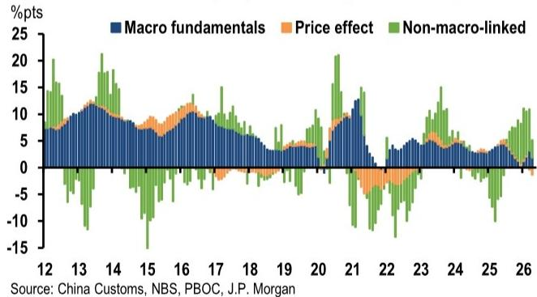
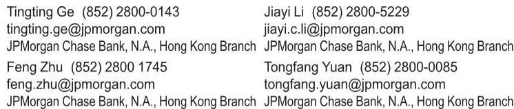

# China's Trade Strength Is More Narrow and Less Supportive of GDP Than the Headline Numbers Suggest

The headline export numbers from China for the first four months of the year look impressive: 14.5% year-on-year growth in U.S. dollar terms. At first glance, this appears to validate the narrative of a resilient Chinese manufacturing engine powering through trade barriers and geopolitical headwinds. But a closer look at the composition reveals a far more complicated story—one that should cause investors and policymakers to recalibrate their assumptions about what this trade strength actually means for the broader economy.

The surge is not broad-based. It is not volume-driven. And critically, it is not translating into the kind of GDP and employment support that last year's export cycle delivered. What we are witnessing is a trade boom concentrated in a narrow set of sectors—AI-linked memory chips, electric vehicles, solar panels, and batteries—where price effects, not output expansion, are doing most of the heavy lifting. Meanwhile, the rest of China's export basket continues to experience price deflation, and import strength reflects commodity stockpiling and AI supply-chain needs rather than a genuine recovery in domestic demand.

This asymmetry matters because it changes the calculus for anyone trying to forecast China's growth trajectory, assess corporate earnings exposure, or navigate the policy landscape. The question is no longer simply whether China's trade is strong or weak. It is whether the composition of that strength is durable, how much of it is real versus price-driven, and what it implies for the sectors and companies that are not part of the narrow winning cohort.

## The AI and Energy Transition Sectors Are Driving a Disproportionate Share of Export Gains, Leaving the Rest of the Economy Behind

The concentration of export strength is striking. Between January and April, just three categories—auto data processing accessories and storage units (primarily memory modules), integrated circuits (legacy memory chips), and the "new three" products (EVs, solar panels, and lithium batteries)—contributed 8.4 percentage points of the 14.5% headline export growth. That is 58% of the total gain coming from a small slice of the export basket.

Within this group, the AI-related segments are the standout performers. Memory modules and chips alone accounted for 12.4% of total exports in April, up from 7.6% in 2025. The growth rates are staggering: 88.2% year-on-year for memory modules and chips in the year to date, compared to 25.2% for the full year 2025. The "new three" products, while also strong at 55.7% year-on-year growth, are a smaller share of total exports at 5.6%.

What makes this concentration problematic is what it says about the rest of the economy. Outside these three segments, export growth has been relatively steady through 2025, then spiked in February on Lunar New Year-related front-loading, before easing in March and settling into mild growth in April. The pattern suggests that the broader manufacturing base is not experiencing a demand boom. It is muddling through, supported by temporary factors and the residual effects of earlier cost advantages, but not participating in the AI-driven surge.

The implication is clear: the sectors that are generating the headline numbers are precisely those least connected to the domestic consumption and employment cycles that policymakers are trying to stimulate. A memory chip factory in Shanghai does not create the same multiplier effect for jobs and local services as a furniture manufacturer in Guangdong employing thousands of workers. The growth is real, but it is narrow, and its benefits are concentrated in a small part of the economy.

## The Export Surge Is More About Price Than Volume, Making It Less Sustainable and Less Supportive of Employment

Perhaps the most important analytical distinction in the trade data is the growing role of price effects. This is not a volume-driven export boom of the kind that supported net trade and GDP growth last year. It is a price-driven surge, and that changes everything about how we should interpret it.

The memory chip and module segment is the clearest example. ADP module unit prices in U.S. dollar terms surged close to 200% year-on-year in April, compared to just 4.9% year-on-year in 2025. IC prices rose 92.4% year-on-year in April, versus 6.9% in 2025. The primary driver of memory chip and module export growth has rotated from volume in 2025 to price in recent months. The average price contribution to export value growth rose to 85.2 percentage points in April, compared to just 5.9 percentage points on average in 2025.

For the "new three" products, the picture is more mixed. Export prices have picked up this year, reversing the broad deflation seen over the prior two years, but volumes appear to have done more of the heavy lifting. This is a positive sign for these sectors, suggesting genuine demand growth rather than just price inflation.

The problem is what is happening everywhere else. Beyond memory chips, modules, and the new energy products, export prices for other products remained in deflation as of March. This is a critical detail. It means that the vast majority of China's exporters are still cutting prices to compete, even as the headline numbers look strong. The deflation in the rest of the export basket is being masked by the price surge in a few categories.

This has direct implications for corporate profitability and employment. Price-driven export growth does not require additional workers or factory capacity. It benefits the existing players who can capture the higher prices, but it does not generate the kind of broad-based economic activity that volume-driven growth creates. A furniture factory that is selling the same number of units at lower prices is not hiring more workers or investing in new capacity. The headline strength is an illusion for most of the economy.

## Import Composition Reveals That Domestic Demand Remains Weak, With Strength Concentrated in AI Supply Chains and Commodity Stockpiling

If the export data tells a story of narrow, price-driven strength, the import data tells an even more cautionary tale about the state of domestic demand. The import rebound is tied to a combination of AI-related demand and renewed commodity stockpiling, and it is far less connected to household consumption or private-sector investment.

Memory module import prices surged 359% year-on-year in April, while import volumes, after expanding solidly through much of the past two years, have recently turned into a net drag. By source market, South Korea stands out, with shipments to China accelerating to 158% on a three-month annualized basis, concentrated in memory ICs. This is not a story of Chinese consumers or businesses buying more. It is a story of China importing expensive chips to feed its AI supply chain.

The commodity stockpiling narrative is equally important. China's stockpiling accelerated following the Russia-Ukraine conflict, with commodity import volumes reaching record highs that are difficult to explain by macro fundamentals or price effects. More recently, heightened geopolitical uncertainty, particularly the Middle East conflict and the associated energy shock, has reinforced energy-security concerns. Stockpiling signals have been visible since the second half of last year, even as fixed asset investment was collapsing, and appear to have intensified in recent months despite higher commodity prices.

Outside of memory chips and modules, and a range of "stockpiling-prone" commodities such as energy, minerals, chemicals, and metals, imports of other product categories have seen muted growth. This composition points to demand that is still relatively narrow and policy-tilted. Strength is concentrated in high-end manufacturing supply chains, while more cyclical, consumption- and private-sector-driven import categories show limited momentum.

The implication is that the Chinese economy is not experiencing a broad-based recovery. It is experiencing a government-directed and AI-driven restructuring, where resources are being channeled into strategic sectors while the rest of the economy struggles. This is not the kind of demand that supports retail spending, housing, or small business activity. It is industrial policy in action, and its effects on the broader economy are limited.

## The Energy Shock Creates Both Opportunities and Risks, but the Net Effect on China's Trade Competitiveness Is Uncertain

The Middle East conflict and the associated energy shock have created a complex set of dynamics for China's trade position. On one hand, higher and more volatile oil prices improve the relative economics of electrification and accelerate energy-security-driven demand for alternatives, lifting overseas interest in EVs, solar panels, and lithium batteries. China's scale and supply-chain depth in these products allow firms to respond quickly with competitive supply, turning the "new three" into a more important source of export strength even as domestic auto sales have weakened.

On the other hand, the energy shock raises input costs for Chinese manufacturers. The external energy-shock-driven rise in producer prices increases pressure to pass these costs through to export prices. While China's export prices tend to co-move with PPI, the recent spike in PPI inflation appears to be more concentrated in upstream, labor-light raw materials, with limited transmission into mid-to-downstream sectors so far. Consumer goods PPI remained in deflation.

The extent of pass-through hinges on how persistent the energy shock proves to be. If energy prices remain elevated, Chinese manufacturers will eventually have to raise prices or accept margin compression. The competitive advantage that China has enjoyed from deflationary export prices could begin to erode, particularly as the renminbi strengthens in basket terms.

That said, China's export competitiveness should remain underpinned by its structural cost advantages: supply-chain depth, scale efficiencies as a manufacturing hub, and an ecosystem supported by efficient logistics. The energy shock is also hitting economies unevenly. China's energy consumption mix and reserves have made energy-cost pass-through less complete than some of its peers. As a result, even if headline export price growth turns positive, consumer goods, which account for nearly 20% of China's exports, are likely to continue experiencing mild deflation, which could help underpin overall export competitiveness.

The net effect of these competing forces is uncertain. The energy shock creates opportunities for China's new energy exporters, but it also creates risks for the broader manufacturing base. The key variable is the duration and severity of the energy disruption, which is inherently unpredictable.

## A Decision Framework for Investors: How to Assess Exposure to China's Trade Dynamics

For investors trying to navigate this complex environment, the report's analysis suggests a simple but powerful framework for assessing exposure to China's trade dynamics. It comes down to three questions.

First, is your exposure in the winning sectors or the rest? The AI-linked memory and chip segments and the new energy products are generating genuine export strength, but they are a small part of the overall economy. If your portfolio is concentrated in these sectors, the trade data is supportive. If it is in consumer goods, traditional manufacturing, or cyclical industries, the headline numbers are misleading.

Second, is your exposure price-driven or volume-driven? Price-driven growth is less sustainable and less supportive of employment and broader economic activity. If the companies you are invested in are benefiting from surging prices rather than expanding output, the risk is that the price cycle turns. Memory chip prices are notoriously cyclical, and the current surge is unlikely to persist indefinitely.

Third, is your exposure to domestic demand or external demand? The import data suggests that domestic demand remains weak outside of AI supply chains and commodity stockpiling. Companies that rely on Chinese consumers or private-sector investment are facing headwinds that the export numbers do not capture. The strength is in external demand for a narrow set of products, not in internal demand for goods and services.

This framework highlights a critical unresolved question that the report does not fully answer: how much of the current trade strength is cyclical versus structural? The AI-driven demand for memory chips is clearly structural, driven by the global buildout of data centers and AI infrastructure. But the price surge is cyclical, driven by supply tightness that will eventually ease as new capacity comes online. The new energy product demand is structural, driven by the energy transition, but it is also being amplified by the temporary energy shock, which could reverse if geopolitical tensions ease.

The answer to this question will determine whether the current trade strength is a sustainable trend or a temporary boost that will fade. It is the single most important analytical question for anyone trying to forecast China's trade trajectory, and the data available so far does not provide a definitive answer.

## The Full Report Offers the Charts and Granular Data That Make These Patterns Visible

The analysis presented here is based on a reading of a detailed research report that contains the charts, data tables, and decomposition analysis that make these patterns visible. The report breaks down export growth by category, separates price and volume effects, decomposes import growth by source and product, and provides the historical context necessary to interpret the current numbers.

Without access to the original charts, it is difficult to fully appreciate the magnitude of the concentration in export gains, the dramatic shift from volume to price in the memory segment, or the divergence between the winning sectors and the rest of the economy. The data is presented in a way that allows readers to see the patterns for themselves and draw their own conclusions.

The report also raises important questions that go beyond what can be addressed in this article. How will the impending Section 301 tariffs affect the composition of trade? Will the trade truce with the US be extended, and what happens if it is not? How persistent is the energy shock, and what does it mean for China's competitive position? These are the questions that the full report explores in greater depth, and they are critical for anyone trying to form a view on China's trade trajectory.

Join the community to read the full report and review the original charts.

*This article is for learning and discussion only and does not constitute investment advice.*

Personal reading notes and learning share only. Not investment advice.

