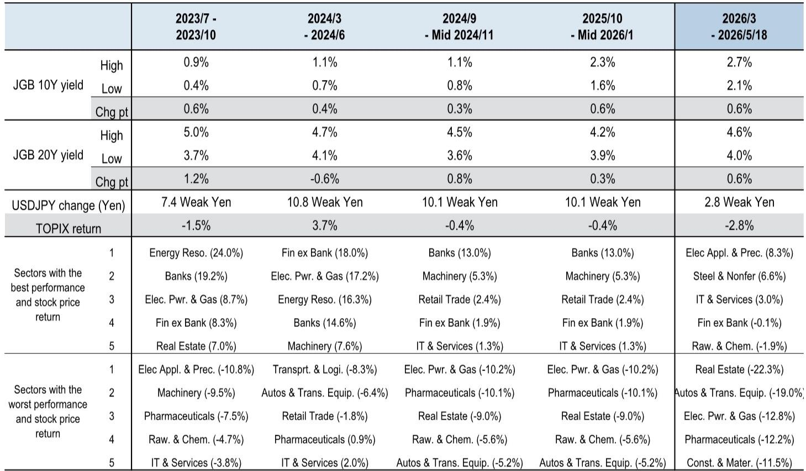
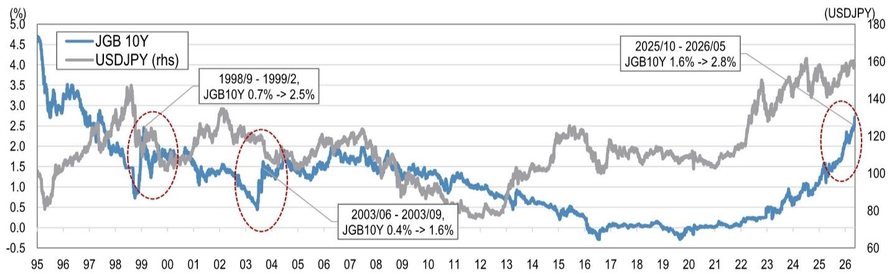
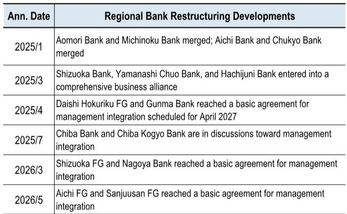

# Japanese Equities Can Survive a 3% Yield Environment, But the Real Test Is Whether the Rally Becomes a Two-Legged Story

The narrative around Japanese equities has shifted sharply. Last week, a rapid ascent in long-term yields triggered a sell-off in AI semiconductor stocks, raising the question of whether the market is about to break. The conventional wisdom is straightforward: rising rates hurt growth stocks, and Japan's AI-driven rally is vulnerable. That interpretation is too narrow. The correct framing is that Japan is entering a phase where a 10-year JGB yield of 3% is becoming a medium-term reality, and the equity market can maintain its uptrend without collapsing. The reason is not that rising yields are benign, but that the structure of the market has changed in three critical ways.

First, the risk of rapid yen appreciation has receded. Historically, rising Japanese yields triggered a vicious cycle: higher rates attracted capital, the yen strengthened, and export-oriented earnings were crushed. That dynamic is muted today because the yield rise is occurring alongside a weaker yen, not in opposition to it. Second, the regional financial system is more resilient than it was even two years ago, thanks to accelerated sector reorganization. Third, the investor base has shifted. Foreign investors retain significant leeway to increase allocations, and domestic households, sitting on JPY 2,200 trillion in financial assets, are gradually increasing their equity exposure. These three factors create a buffer that did not exist in previous tightening cycles.

The real strategic question is not whether the market survives a 3% yield. It is whether the market can sustain a rally that is increasingly dependent on two sectors -- financials and AI semiconductors -- that together account for roughly 20% of TOPIX market capitalization. If those two legs hold, the market advances. If one breaks, the entire structure becomes unstable. Understanding which leg is more fragile, and under what conditions, is the central analytical task for investors today.

## The Supplementary Budget Is a Distraction, Not a Catalyst for a Triple Sell-Off

The immediate trigger for last week's yield spike was a combination of persistently high oil prices and reports of the government's supplementary budget. The market interpreted the fiscal response as a signal that Japan is willing to run larger deficits to support final demand, which in turn pushed long-term yields higher. This is a rational reaction, but it is also overdone.

Let us be precise about the numbers. The supplementary budget, assuming a JPY 2-3 trillion increase in contingency funds, would lower the primary balance-to-GDP ratio by approximately 0.5 percentage points. Combined with a consumption tax cut for food, the impact would be roughly 1 percentage point. This would push back the achievement of a primary-balance surplus from FY2026 to FY2027-28. That is a delay, not a derailment. The debt trajectory remains manageable under reasonable growth assumptions. The more extreme scenario -- a JPY 50,000 cash handout proposed by the Democratic Party for the People -- would lower the ratio by an additional 1 percentage point or more, but the market is not seriously pricing that probability.

The risk that this triggers a triple sell-off -- bonds, yen, and equities simultaneously -- is low. The reason is structural. Japan's fiscal vulnerability is well known, and the market has been pricing in a gradual normalization of yields for months. The supplementary budget merely confirms the direction of travel; it does not introduce a new regime. What matters more is whether the government's medium-term fiscal strategy, including the Basic Policy and defense spending commitments, maintains credibility. That is a question for the second half of the year, not for this week.

## Financials Benefit from Rising Yields, But the AI Rally Depends on US Rates, Not Japan's

The sector-level implications of a 3% yield environment are not uniform. Financials have a relative advantage. Rising net interest margins, combined with a more consolidated regional banking system, create a clear earnings tailwind. This is the straightforward part of the argument. The more nuanced question is whether rising Japanese yields should cause investors to rotate out of AI semiconductors and into financials.

The answer is no, and the reason lies in the global supply chain. Japanese AI semiconductor stocks are not primarily driven by domestic yields. Their earnings are linked to global demand, US technology spending, and the trajectory of US long-term rates. If US 10-year yields remain broadly flat through year-end -- the base case from a global investment bank report -- then the AI rally can continue even as Japanese yields rise. The sustainability of the AI rally depends on US yields and AI-specific risks: power constraints, regulatory developments, and pricing dynamics. Japanese yields are a secondary factor.

This creates an interesting asymmetry. If US yields rise rapidly, the AI leg breaks, and the market becomes overly dependent on financials. That is a fragile state. If US yields stay contained, the two legs work in tandem, and the market can absorb higher Japanese rates without a correction. The critical variable is not the Bank of Japan's policy path. It is the US Treasury market.

## The Regional Financial System Is More Resilient, But "Resilient" Is Not "Invulnerable"

One of the report's most important contributions is its reassessment of the regional financial system's capacity to handle rising yields. The warning level for 10-year JGB yields was previously set at 3.0-3.5%, based on the vulnerability of regional banks to mark-to-market losses on their bond portfolios. That threshold remains largely unchanged, but the system's ability to operate within that range has improved.

Sector reorganization has accelerated. Consolidation among regional banks has reduced the number of weak institutions and improved capital ratios. The risk of a systemic event at 3% yields is lower than it would have been two years ago. However, "lower" is not "zero." The report explicitly warns that if yields rise too rapidly, the regional financial system could still face stress. The key word is "rapidly." A gradual move to 3% is manageable. A spike to 3.5% in a matter of weeks would test the system's resilience in ways that the current analysis does not fully quantify.

This is the section where the report leaves a meaningful open question. How much of the improvement in financial system resilience is structural versus cyclical? If the economy slows and credit costs rise, the buffer provided by higher net interest margins could be eroded. The report does not model that scenario in detail. Investors should ask themselves: what happens to regional bank earnings if the yield curve flattens and loan growth disappoints? The answer is not obvious, and it is worth reading the full report to examine the sensitivity analysis.

## A Decision Framework for Investors Navigating the 3% Yield Phase

Translating the report's analysis into actionable strategy requires a framework that accounts for the interaction between domestic and global factors. Here is a three-step decision framework for portfolio positioning.

Step one: assess the US yield trajectory. If US 10-year yields remain below 4.75% through year-end, the AI semiconductor leg is stable. If US yields break above 5%, the AI rally is at risk, and the portfolio should overweight financials and defensives. The report's year-end forecast for US 10-year yields is 4.55%, which supports the stable scenario.

Step two: evaluate the speed of Japanese yield adjustment. If the 10-year JGB yield rises gradually toward 3% over the next six months, financials benefit and the market absorbs the adjustment. If yields spike above 3% within weeks, the regional financial system becomes a source of risk, and investors should reduce exposure to real estate, electric power and gas, and air transportation -- the sectors most negatively impacted by rising yields.

Step three: monitor the yen. The report argues that the risk of rapid yen appreciation has receded, but this is conditional on the US yield environment. If US yields fall sharply while Japanese yields rise, the yen could strengthen quickly, compressing export earnings. That scenario is not the base case, but it is a tail risk that cannot be ignored.

This framework is not a prediction. It is a way to organize thinking around the variables that matter. The full report provides the data to calibrate each step, including the sensitivity of sector earnings to yield changes and the historical relationship between yield moves and equity performance.

## What the Report Does Not Fully Answer: The Fiscal Sustainability of the Consumption Tax Cut

The report addresses the fiscal impact of a consumption tax cut for food, estimating that it would lower the primary balance-to-GDP ratio by 0.6-0.8 percentage points per year. Combined with the supplementary budget, this pushes the primary-balance surplus target into FY2027-28. That is a manageable delay, but only if the government does not introduce additional stimulus measures.

The open question is whether a consumption tax cut, once implemented, can be reversed. Many governments have found that temporary tax cuts become permanent, especially when they target essentials like food. If the cut becomes structural, the fiscal arithmetic changes significantly. The debt-to-GDP trajectory, which the report shows declining under optimistic growth scenarios, would flatten or reverse. That would put upward pressure on long-term yields and reduce the government's fiscal space for future crises.

The report does not model a permanent tax cut scenario. It assumes the measures are temporary and that the government remains committed to fiscal consolidation over the medium term. That assumption is reasonable, but it is also the most important vulnerability in the analysis. Investors should ask themselves: what is the political probability that a consumption tax cut, once enacted, is never reversed? The answer to that question determines whether the 3% yield environment is a phase or a new equilibrium.

## Join the Community to Read the Full Report and Review the Original Charts

The analysis above synthesizes the report's core arguments and extends them into a decision framework, but it cannot capture the full depth of the data. The original report includes detailed charts on yield trends, fiscal impact scenarios, sector sensitivity analysis, and the historical relationship between yields and equity performance. These charts are essential for calibrating the framework and testing the assumptions.

The report also contains sector-level recommendations that go beyond the financials-versus-AI binary. It identifies which industries are most vulnerable to rising yields -- real estate, electric power and gas, and air transportation -- and explains why the negative impact is larger than the market currently prices. Understanding those sector dynamics is critical for risk management in a rising yield environment.

For investors who want to move beyond headlines and build a position that is resilient to multiple yield scenarios, the full report is the right starting point. The charts alone are worth the read.

*This article is for learning and discussion only and does not constitute investment advice.*

Personal reading notes and learning share only. Not investment advice.

