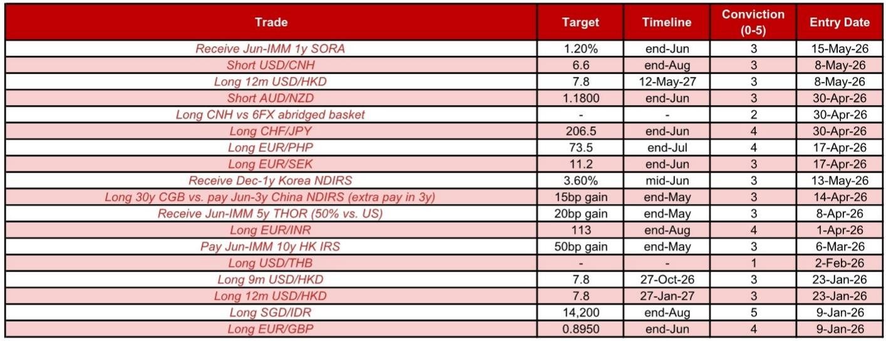

# 人民币走强的逻辑，市场可能低估了供给侧的支撑力

市场对人民币汇率的讨论，过去几个月几乎都集中在两个变量上：美元的强弱，以及中美关系的冷暖。这两个变量当然重要，但它们更像是“情绪开关”，而非“基本面引擎”。某外资投行最新发布的亚洲外汇策略报告，提出一个值得认真对待的判断：当前人民币的强势，根植于中国外部部门的结构性改善，包括持续的贸易顺差、企业结汇行为的韧性，以及地缘政治风险暴露度的不对称性。这些因素叠加在一起，意味着即使美元阶段性反弹，人民币的贬值空间也极为有限，而一旦外部环境改善，升值的弹性可能超出市场预期。

这份报告的核心推荐是做空美元/离岸人民币，目标价6.60，时间窗口是2026年8月底。推荐信心评级为3/5。这个评级本身就是一个信号——它不是那种“确定性极高”的交易，而是“逻辑清晰、但需要催化剂配合”的布局。真正值得关注的，不是这个交易本身，而是支撑这个交易的底层逻辑：中国的外部资产负债表，正在经历一轮市场尚未充分定价的再平衡。

以下是我们从这份报告中提炼出的五个关键洞察。

## 1. 美元走强时人民币抗跌，美元走弱时人民币弹性更高，这种不对称性正在被市场验证

报告给出了一个非常具体的数据：自2026年2月28日伊朗局势升级至5月21日，美元指数上涨了1.7%，而美元/离岸人民币反而下跌了0.9%。这意味着人民币在这一时期对美元实现了相对强势。更关键的是，报告量化了美元/离岸人民币对美元指数变动的敏感度：当美元指数上行时，离岸人民币的敏感度只有约28%；但当美元指数下行时，敏感度跃升至约62%。

这里有一个重要的含义。市场通常会把人民币视为“美元弱则涨、美元强则跌”的对称资产。但数据表明，人民币在美元走强时表现出显著的抗跌性，而在美元走弱时则能更充分地释放升值弹性。这种不对称性，本质上反映了中国在能源安全和贸易结构上的相对优势——中国是亚洲能源安全度最高的经济体之一，对霍尔木兹海峡的依赖度远低于日韩。这意味着，即使地缘政治风险推高美元，人民币也不会像其他亚洲货币那样承受同等的贬值压力。

所以呢？对于持有美元资产或需要管理人民币敞口的机构而言，简单的“看美元做人民币”策略可能需要修正。人民币的定价权，正在从外部美元周期，部分转移至内部基本面结构。

## 2. 企业结汇行为正在成为人民币的“隐形买方”，且这一力量仍有后劲

报告中最值得细读的部分，是2026年4月的净外汇贸易结算数据。4月净外汇贸易结算盈余为477亿美元，相当于经人民币结算调整后的贸易顺差的82.1%。虽然出口商结汇比率（即出口收入中汇回国内的比例）从一季度平均的55.8%下降至4月的50.1%，但进口商购汇需求比率保持稳定在48.3%。

这里需要特别注意两点。第一，82.1%的结算比率已经处于历史较高水平，说明企业结汇意愿依然强劲。第二，出口商结汇比率虽然有所下降，但绝对水平并不低，而且下降的主因可能是季节性因素，而非趋势逆转。报告判断，未来几个月出口商结汇活动将保持强劲，原因有两个：中国出口增长持续超预期（一季度净贸易顺差已达2470亿美元），以及市场对人民币升值的预期本身会激励企业加速结汇。

更值得关注的是报告提到的一个催化剂：中东局势进一步缓和，可能成为出口商加速结汇的显著触发因素。如果这一情景发生，企业结汇带来的美元供给将形成额外的升值压力。

所以呢？企业结汇行为不是一个被动变量，它本身会形成预期自我实现的循环——人民币升值预期越强，企业越倾向于结汇，而结汇又进一步推动人民币升值。市场如果只关注央行中间价或美元指数，可能会忽略这一内生的升值动能。

## 3. 中美关系改善的“溢价”尚未被完全定价，但资本流入已开始反应

报告提到了2026年5月的特朗普-习近平峰会，认为这次会议为未来几个月的中美关系创造了建设性的背景。一个直接可见的信号是，中国商务部确认了美国此前公布的约300亿美元商品关税减免细节，同时中国承诺不对美国新301条款关税进行报复——前提是这些关税不超过2025年10月吉隆坡贸易谈判达成的水平。

资本市场的反应是迅速的。报告追踪的中国主题股票ETF数据显示，5月13日至19日当周，外资净流入达18亿美元。其中5月18日（峰会结束后第一个交易日）单日净流入8.11亿美元。截至5月19日，5月累计外资净流入已达22亿美元。作为对比，上一次出现类似的月度大规模流入，是2025年2月和3月Deepseek-R1发布后，分别录得44亿和25亿美元流入。

这里需要指出的是，报告没有完全展开的一个问题是：这些资本流入的可持续性如何？Deepseek引发的流入持续了约两个月，而这次峰会驱动的流入目前只持续了不到一周。关键变量在于，关税减免的落地执行情况，以及后续中美在科技、金融领域的合作能否实质性推进。报告给出了一个建设性的框架，但尚未回答“这个框架能维持多久”。

所以呢？中美关系的边际改善，正在从“预期”转化为“资本流动”。但这一转化的可持续性，取决于政策执行层面的细节。对于关注中国资产的外资机构而言，当前是一个“逻辑成立、但仍需验证”的窗口期。

## 4. 人民币的估值低估是长期支撑，但市场对这一指标的解读可能存在分歧

报告指出，基于四种汇率估值模型，人民币平均低估了9.5%，其中经生产率调整的实际有效汇率低估幅度达到19.3%。这是一个相当显著的估值折价。

但这里需要谨慎。估值模型本身存在方法论差异，低估幅度也取决于选取的基准年份和调整因子。更重要的是，低估并不必然意味着立即升值——日元长期低估，但直到最近才出现趋势性反转。人民币的估值低估，更多是提供了一个“安全边际”：即使外部环境恶化，大幅贬值的空间有限；而一旦环境改善，升值动能会更充足。

报告没有深入讨论的是，人民币低估的根源是什么。是资本管制导致的定价扭曲，还是结构性因素（如生产率增长差异）的反映？如果是前者，那么资本账户开放的节奏将直接影响低估的修复路径；如果是后者，那么低估可能需要数年时间才能逐步收敛。这个问题，报告留下了探讨空间。

所以呢？估值低估是一个重要的“长期支撑”，但短期交易者不应将其视为立即交易的充分理由。它更适合作为资产配置的参考锚点，而非择时工具。

## 5. 报告尚未完全回答的关键问题：中间价“指导”与市场力量之间的博弈如何演变

报告提到，尽管美元指数在5月8日之后上涨了1.3%，但每日美元/人民币中间价反而平均下调了14个基点。5月21日的中间价报6.8349，创下2023年2月以来的新低。同时，模型误差（实际中间价减去模型预测）保持在平均+417个基点的水平，说明央行仍在通过中间价释放温和升值的信号。

但这里存在一个潜在的张力。如果美元继续走强，央行是否可能调整中间价的设定节奏？报告没有给出明确答案，只是指出“尽管存在官方限制，中间价仍在走低”。这个“官方限制”具体指什么？是窗口指导、还是对报价行的约束？如果中间价的走低是央行主动引导的结果，那么一旦外部环境变化，央行也可能主动调整方向。

对于交易者而言，这意味着当前的人民币升值路径，部分依赖于央行的政策意愿。如果央行认为升值过快可能冲击出口，或者希望保留政策空间应对未来不确定性，中间价的设定方向可能发生变化。这是报告推荐交易信心评级为3/5的重要原因：逻辑清晰，但政策变量不可忽视。

---

这份报告的价值，不在于给出了一个具体的交易目标，而在于它提供了一个分析人民币汇率的新框架：不再仅仅关注美元和美债收益率，而是将企业结汇、贸易结构、地缘政治暴露度和估值低估纳入一个统一的逻辑链条。这个链条指向一个核心结论——人民币的定价权，正在回归基本面。

但正如报告所暗示的，这一逻辑的验证，需要几个关键条件：中东局势的进一步缓和、中美关税减免的落地执行、以及企业结汇行为的持续。这些条件目前都在向有利方向发展，但尚未完全兑现。

欢迎来星球微信群里继续讨论：如果中东局势超预期缓和，人民币升值的弹性会有多大？央行的中间价策略在什么情况下可能转向？这些问题的答案，可能决定了当前交易的真正赔率。

Personal reading notes and learning share only. Not investment advice.

