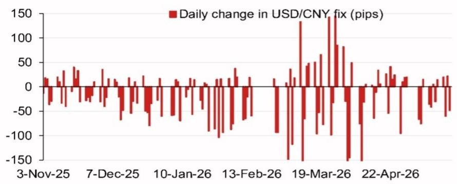
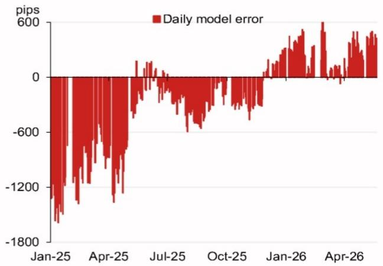

# 人民币中间价模型正在发出一个被市场低估的信号

当市场多数参与者还在争论中美利差、关税周期或资本流动方向时，一份来自某外资投行的最新USD/CNY定盘价模型，揭示了一个更直接、更短期的定价逻辑。这份报告的核心判断是：模型预测的中间价较前一日下降了370个基点，即便计入逆周期因子，降幅也达到211个基点。这不仅仅是数字的变动，而是对当前政策意图的一次量化解读。

为什么这个信号值得关注？因为中间价是人民币汇率定价的“锚”，而模型预测的偏离幅度，往往比实际定盘价更能反映政策层的容忍边界。当模型预测与实际定盘之间的误差持续扩大时，通常意味着市场定价与政策意图之间正在积累张力。这份报告恰好提供了这种张力的最新读数。

报告提供的核心新信号在于：它不仅仅给出了一个预测值，还拆解了不同货币对定盘价的贡献权重，以及模型误差的历史轨迹。这些数据合在一起，指向一个结论——当前人民币中间价的设定逻辑，正在从被动跟随市场转向主动管理预期。理解这一转变，对任何持有人民币资产或参与跨境交易的决策者而言，都不是可有可无的背景知识。

## 1. 模型预测的370个基点降幅，本质是“一篮子压力”的集中释放

这份模型的核心机制并不复杂：它通过追踪一篮子货币的隔夜变动，来预测第二天的人民币中间价。报告显示，模型预测值为6.7979，较前一日6.8349下降了370个基点。这个降幅本身已经足够显著，但更有价值的是其构成。

报告拆解了前四大贡献货币：俄罗斯卢布贡献了18个基点，欧元贡献了11个基点，韩元贡献了3.5个基点，而澳元则拖累了8个基点。这组数据揭示了两个关键事实。第一，人民币中间价的定价并非单纯盯住美元，而是对一篮子货币的综合反应。第二，在当前的全球宏观环境下，非美货币的波动正在通过这个传导机制，对人民币中间价产生不对称的影响。

卢布和欧元的贡献权重最大，这并非偶然。俄乌冲突后的能源贸易结算调整、欧元区自身的货币政策路径，都在通过这个篮子对人民币施加压力。这意味着，对于关注人民币汇率的读者而言，仅仅盯着中美关系或美联储是不够的，全球地缘政治和欧洲央行的动向，同样会通过这个“中间价传导机制”影响人民币定价。这层含义，市场目前还没有充分定价。

## 2. 逆周期因子正在被更“精细化”地使用，而非简单抑制贬值

报告不仅给出了模型预测，还计算了“含逆周期因子”的预测值：6.8138，较模型预测高出159个基点，但较前一日定盘仍下降211个基点。这个差异本身就是一种政策信号。

逆周期因子并非一个固定的调校器。它可以根据监管层的意图，在不同方向上施加影响。当前这个159个基点的正向调整，说明监管层在模型预测大幅偏向贬值方向时，选择了“部分对冲”而非“完全抵消”。这传递了一个微妙的信号：监管层允许人民币在可控范围内适度贬值，以缓冲外部压力，但同时不希望贬值速度过快，引发市场恐慌或资本外流。

这种“精细化”使用，与过去几年间逆周期因子要么完全开启、要么完全关闭的“开关式”操作形成了鲜明对比。它意味着监管层对汇率波动的容忍度在提高，但管理能力也在同步增强。对于投资者而言，这带来的启示是：未来人民币汇率的波动区间可能比过去更宽，但单边大幅贬值的尾部风险反而降低了。中间价的设定正在从“防守”转向“主动引导”。

## 3. 模型误差的历史轨迹显示，当前定价处于一个“偏离累积”阶段

报告中的模型误差图（Fig. 2）提供了另一个重要视角。从2025年初至今，每日模型误差（不含逆周期因子）的波动呈现出清晰的规律：2025年7月前后，误差接近于零，说明模型预测与实际定盘高度一致；但进入2026年后，误差显著扩大至600个基点以上。

误差的扩大，通常意味着模型没有完全捕捉到政策层的额外考量。当误差为正时，说明实际定盘比模型预测更“强”（即人民币更便宜）。当前误差在600个基点附近，处于历史相对高位。这告诉我们两件事：一是市场力量正在推动人民币向模型预测的方向移动；二是政策层通过逆周期因子等手段，在部分抵消这种力量，但并未完全扭转趋势。

这个“偏离累积”的状态，往往预示着后续政策的调整窗口。如果误差持续扩大，监管层可能面临两种选择：要么允许实际定盘向模型预测靠拢（即主动贬值），要么加大逆周期因子力度（即加强管控）。目前来看，报告暗示的是前一种可能性更大，因为逆周期因子的调整幅度（159个基点）远小于模型预测的变动（370个基点）。这意味着，政策层可能正在为更灵活的人民币汇率打开空间。

## 4. 2026年下半年的关键事件日历，为汇率走向提供了“检验节点”

报告附上了一份2026年下半年的重要事件日历，从7月的政治局会议，到11月的APEC会议，再到年底可能的中美领导人会晤。这些事件看似分散，但串联起来，它们构成了人民币汇率定价的“外部约束条件”。

7月的政治局会议通常涉及下半年经济工作部署，其对汇率的态度会直接影响逆周期因子的使用力度。11月的APEC会议在中国深圳举行，这是中国主场外交的重要场合，汇率稳定往往成为展示开放姿态的信号。而年底中美领导人会晤，则是决定贸易和关税走向的关键变量。

这些事件的时间分布，意味着下半年的汇率波动可能呈现“事件驱动”特征：在重大会议前，中间价可能倾向于稳定；而在会议结果明朗后，汇率可能根据政策信号出现方向性调整。对于资产管理者和企业财务官而言，这意味着不能简单用线性外推来判断下半年的汇率走势，而需要根据每个事件的进展动态调整头寸。报告没有展开讨论的是，这些事件之间的相互作用——例如，APEC会议上的贸易谈判进展，会如何影响年底中美领导人会晤的基调——这恰恰是完整报告中更值得深挖的部分。

## 5. 报告尚未完全回答的关键问题：模型误差的“阈值”在哪里？

尽管这份模型提供了清晰的预测框架和误差追踪，但它留下了一个核心未解问题：监管层对模型误差的容忍阈值是多少？误差达到多大，才会触发政策层的实质性干预？

从历史数据看，误差在0到600个基点之间波动，但报告并没有给出一个明确的“红线”。这并非报告的缺陷，而是汇率管理本身的特性——政策层不会事先公布自己的容忍边界。但正是这种不确定性，构成了当前市场定价中最值得博弈的变量。

如果误差进一步扩大至1000个基点，监管层会如何反应？是会加大逆周期因子力度，还是直接通过窗口指导限制交易区间？抑或，监管层会主动引导中间价向模型预测靠拢，从而实现一次“有管理的贬值”？不同的应对方式，对人民币资产定价和跨境资金流动的影响截然不同。

这个问题的答案，取决于监管层对“汇率弹性”与“汇率稳定”之间的权衡。如果经济下行压力加大，监管层可能更倾向于通过汇率贬值来缓冲出口压力，此时对误差的容忍度会提高。反之，如果资本外流压力加剧或外部政治压力上升，监管层可能重新收紧管控。报告提供了一个分析框架，但最终的判断需要结合更多的宏观数据和政治信号。

## 6. 观察人民币中间价的三个新维度：权重、误差与事件

基于上述分析，读者可以建立一个更实用的观察框架，而不是仅仅盯着中美利差或美元指数。

第一个维度是“权重结构”。关注每日模型预测中，卢布、欧元、韩元等货币的贡献变化。如果卢布权重持续上升，说明地缘政治因素正在通过能源贸易渠道影响人民币定价。如果欧元权重上升，则反映的是欧洲央行政策与美联储政策的分化。

第二个维度是“误差方向”。持续关注模型误差的绝对值是扩大还是收窄。如果误差从600个基点开始回落，说明模型预测与实际定盘的差距在缩小，市场定价与政策意图正在趋同，汇率可能进入一个相对稳定的阶段。反之，如果误差继续扩大，则意味着政策层与市场力量之间的博弈在加剧，汇率可能出现突发性调整。

第三个维度是“事件日历”。将7月政治局会议、11月APEC会议、年底中美会晤作为关键节点。在每个节点前，评估政策层的“稳定需求”是否上升，以及这种需求是否会改变逆周期因子的使用力度。例如，在APEC会议前，监管层可能更倾向于维持汇率稳定，以营造良好的国际氛围；而在会议后，如果贸易谈判取得进展，汇率弹性可能重新释放。

这三个维度合在一起，可以帮助读者在信息噪声中抓住人民币汇率定价的核心矛盾。它不是预测具体点位，而是提供一个判断“政策意图”与“市场力量”相对强弱的框架。这正是这份报告最宝贵的价值所在。

---

以上是对这份模型报告的初步解读。围绕“模型误差的阈值在哪里”这一未解问题，以及如何将权重、误差与事件日历组合成一个可操作的交易框架，在完整报告中还有更详细的案例拆解和情景分析。欢迎来星球微信群里继续讨论，我们会结合最新的定盘数据，持续跟踪这个模型信号的变化，并在关键事件节点前提供更具体的应对思路。

Personal reading notes and learning share only. Not investment advice.

