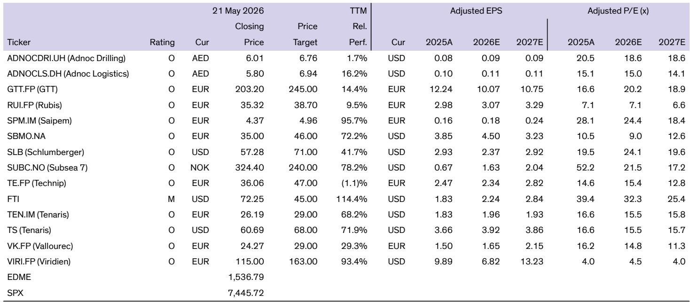
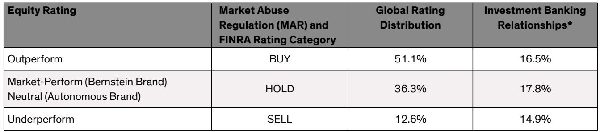
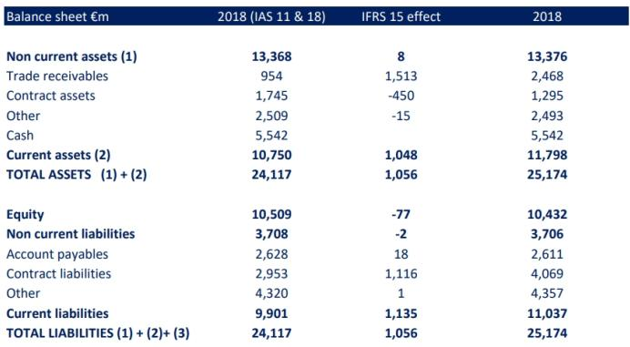

# IFRS 18 Will Not Transform Financial Analysis, But It Will Expose Which Companies Have Something to Hide

The arrival of a new accounting standard rarely generates excitement among serious investors. Most view such changes as compliance exercises—necessary but strategically neutral. The introduction of IFRS 18 in January 2027, however, deserves closer attention. This standard will not revolutionize how value is created, but it will fundamentally alter how value is displayed. And in the world of capital allocation, changes in display often precede changes in perception.

The core argument is this: IFRS 18 will create a new hierarchy of transparency across European-listed companies, and the winners will be those who have already structured their operations to thrive under greater scrutiny. The losers will be those who have relied on accounting ambiguity to manage market expectations. The standard's most consequential change is not the new income statement categories or the mandated subtotals. It is the requirement that cash flow statements must now be prepared using the indirect method, starting with operating profit rather than net income. This single provision will strip away a layer of managerial discretion that has quietly served as a competitive advantage for certain firms.

For decades, investors have complained that cash flow statements prepared under the direct method obscure the relationship between operating performance and cash generation. Companies that preferred the direct method could effectively blur the line between operational efficiency and financial engineering. IFRS 18 eliminates that option. Starting in 2027, every company will be forced to show the bridge between operating profit and cash flow from operations. The result will be a level of comparability that has been absent from European financial reporting since the adoption of IFRS itself.

This matters now because the macroeconomic environment is shifting. Interest rates are no longer at zero. Capital discipline is back in fashion. The ability to generate cash from operations, rather than from balance sheet management, is once again the primary metric by which management teams will be judged. IFRS 18 arrives at exactly the moment when investors need it most.

## The Mandated Indirect Method for Cash Flow Statements Will Be the Single Most Consequential Change for Investors

The indirect method is not new. Many companies already use it voluntarily. What changes in 2027 is that it becomes mandatory, and the classification of interest and dividends becomes standardized. Interest paid will now appear only in financing activities. Interest received and dividends received will appear only in investing activities. Dividends paid will appear only in financing activities.

This standardization eliminates a source of analytical noise that has frustrated cross-company comparisons for years. Under the current IAS 7, a company could classify interest paid as operating or financing, depending on its business model and its preferences. Two identical companies in the same industry could report meaningfully different operating cash flows simply because of how they classified interest. IFRS 18 ends this.

The practical implication is that investors will no longer need to make subjective adjustments to cash flow statements before comparing companies. The operating cash flow figure will become more uniform and more directly comparable. This might sound like a technical improvement, but it has real consequences. When operating cash flow becomes more standardized, the market's ability to identify outliers improves. Companies that have been masking weak operating cash generation through favorable classification choices will lose that cover.

For analysts, this is a gift. For CFOs who have benefited from the ambiguity, it is a constraint. The question every investor should ask now is whether their portfolio companies are prepared for this new level of scrutiny.

## The New Income Statement Structure Creates Five Categories, But the Real Insight Lies in What Remains Undefined

IFRS 18 introduces five mandatory categories for the income statement: operating, investing, financing, income tax, and discontinued operations. It also requires five subtotals, including operating profit and profit or loss before financing and income taxes. On the surface, this appears to be a significant step toward standardization.

The disappointment, however, is that the standard still does not define what constitutes a non-recurring item. This omission is not accidental. The IASB has deliberately sidestepped this issue, leaving it to companies to determine which items are recurring and which are not. The result is that while every company will now report operating profit under the same definition, the task of determining recurring operating profit remains firmly in the hands of analysts.

This creates an interesting dynamic. On one hand, the standardization of operating profit removes a source of confusion. On the other hand, it creates a false sense of comparability. Two companies may report the same operating profit under IFRS 18, but one may have included significant non-recurring gains while the other has not. The standard does not force them to disclose this distinction in a uniform way.

The implication is that the analytical burden has shifted rather than diminished. Investors will still need to dig into the notes, still need to understand each company's definition of recurring items, and still need to make their own adjustments. The difference is that the starting point for that analysis will be more consistent. The journey may be shorter, but it has not been eliminated.

This is where the most sophisticated investors will find their edge. Those who develop systematic frameworks for identifying and adjusting non-recurring items will be able to see through the standardized surface to the underlying economic reality. Those who rely solely on the reported operating profit will be misled.

## The Separation of Investing and Financing Categories Creates a Philosophical Question About What Constitutes an Investment

One of the more subtle changes in IFRS 18 is the separation of financial income from financial expenses. Under the previous standard, these were often grouped together in a single financial result. Under IFRS 18, financial income from cash investments is assigned to the investing category, while financial expenses from borrowings are assigned to the financing category.

This separation is logical from an accounting perspective, but it raises a philosophical question. Is financial income from excess cash truly an investment return in the same sense as rental income or capital gains from property? IFRS 18 says yes. Many CFOs would say no.

The practical consequence is that the new subtotal "profit before financing and income taxes" will combine income from cash investments with income from equity-accounted investees and other investment returns. This creates a category that mixes genuinely operational investment returns with purely financial returns from treasury management.

For companies with significant cash holdings, this could distort the picture. A company that has built a large cash reserve through years of strong operations will now show that cash's income as part of the investing category, alongside returns from its actual business investments. The distinction between operational success and financial prudence becomes blurred.

Investors will need to develop their own frameworks for separating these two sources of return. The standard will not do it for them. This is another area where analytical judgment will continue to matter more than regulatory mandates.

## Technip Energies' Relationship with IFRS 15 Demonstrates How Accounting Standards Can Be Used Strategically

The report uses Technip Energies as a case study to illustrate a broader point. When Technip Energies was still part of TechnipFMC, it effectively "fell in love" with IFRS 15, the revenue recognition standard introduced in 2018. The company used the standard's flexibility to maintain relative discretion over the composition of its net cash balance.

Under IFRS 15, contract assets and contract liabilities are accounting constructs that do not necessarily reflect operational reality. A contract asset arises when a contractor has more future rights than future obligations. A contract liability arises when obligations exceed rights. These are accounting definitions, not operational ones.

Technip Energies used this distinction to provide only broad indicators of its net cash position for years, without breaking down the components. When the company finally provided additional detail in November 2024, it revealed that net margins on contracts were higher than previously assumed and that a larger proportion of net cash was tied to trade receivables.

The lesson is not that Technip Energies was hiding something improper. The lesson is that accounting standards provide degrees of freedom, and sophisticated management teams use those degrees of freedom to manage market perception. The same will happen with IFRS 18. Some companies will embrace the new standard's transparency. Others will find ways to work within its boundaries to maintain their preferred level of disclosure.

The question for investors is not whether IFRS 18 eliminates managerial discretion. It does not. The question is whether it reduces it enough to make a meaningful difference in cross-company comparability. The answer is likely yes, but only for those who know where to look.

## What the Report Does Not Fully Answer: How Will Companies Adapt Their Disclosure Strategies in Response to IFRS 18?

The report provides a thorough analysis of IFRS 18's technical provisions and uses Technip Energies to illustrate how accounting standards can be used strategically. What it does not fully address is how the broader market will adapt.

Several open questions remain. Will companies increase their use of Management-defined Performance Measures to compensate for the loss of discretion in the cash flow statement? The standard requires MPMs to be disclosed transparently, but it does not prevent companies from emphasizing non-IFRS metrics in their external communications. There is a risk that the new standard simply shifts the locus of ambiguity from the cash flow statement to the earnings release.

Another unanswered question concerns the interaction between IFRS 18 and sector-specific reporting practices. Companies in capital-intensive industries, such as energy and infrastructure, have long used industry-specific metrics that do not map neatly onto the new categories. How will these companies adapt? Will they resist the new structure, or will they find creative ways to present their operations within the new framework?

The report also leaves open the question of enforcement. The IASB sets standards, but national regulators enforce them. Will there be variation in how strictly IFRS 18 is applied across different European jurisdictions? History suggests there will be. The question is whether that variation will be material enough to undermine the standard's comparability goals.

## A Decision Framework for Investors Preparing for IFRS 18

Investors should not wait until January 2027 to prepare. The following framework can help identify which portfolio companies are likely to benefit from the new standard and which are likely to face challenges.

First, assess the current level of cash flow transparency. Review how each portfolio company currently presents its cash flow statement. Does it use the direct or indirect method? How does it classify interest and dividends? Companies that already use the indirect method and follow conservative classification practices will face minimal disruption. Those that use the direct method or aggressive classification will need to adjust.

Second, evaluate the company's reliance on non-recurring items. IFRS 18 does not define non-recurring items, but it does require greater disaggregation in the notes. Companies that have historically used non-recurring items to smooth earnings will face greater scrutiny. The notes will provide more detail, making it harder to hide adjustments in aggregated line items.

Third, examine the company's net cash composition. The new standard will force greater transparency around the components of net cash, particularly for companies with significant contract assets and liabilities. Those that have maintained discretion over their cash composition will need to provide more detail. This could lead to surprises, either positive or negative, depending on what the detail reveals.

Fourth, consider the management team's attitude toward accounting standards. The Technip Energies case study shows that some management teams are sophisticated users of accounting standards. Others treat them as compliance exercises. The former group will adapt quickly and may even find ways to use IFRS 18 to their advantage. The latter group may struggle with the transition and could face negative market reactions if their disclosures reveal weaknesses that were previously obscured.

## Join the Community to Read the Full Report and Review the Original Charts

The analysis above draws on a detailed research report that includes original exhibits, historical data, and a deeper exploration of the Technip Energies case study. The full report provides a more granular examination of each provision of IFRS 18, including the aggregation and disaggregation rules, the balance sheet changes, and the implications for goodwill presentation. It also includes a forward-looking assessment of how the standard might affect valuation multiples and analyst coverage.

For those who want to understand not just what IFRS 18 says, but how it will change the competitive dynamics of financial analysis, the full report is essential reading. Join the community to read the full report and review the original charts.

*This article is for learning and discussion only and does not constitute investment advice.*

Personal reading notes and learning share only. Not investment advice.

