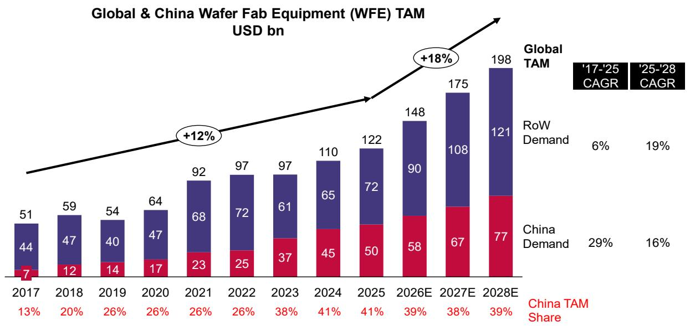
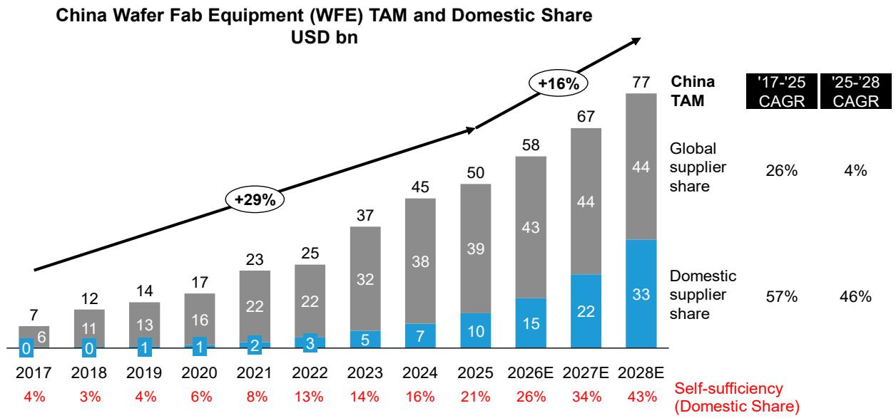
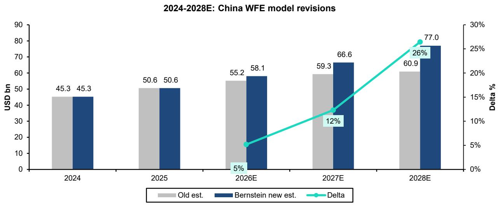
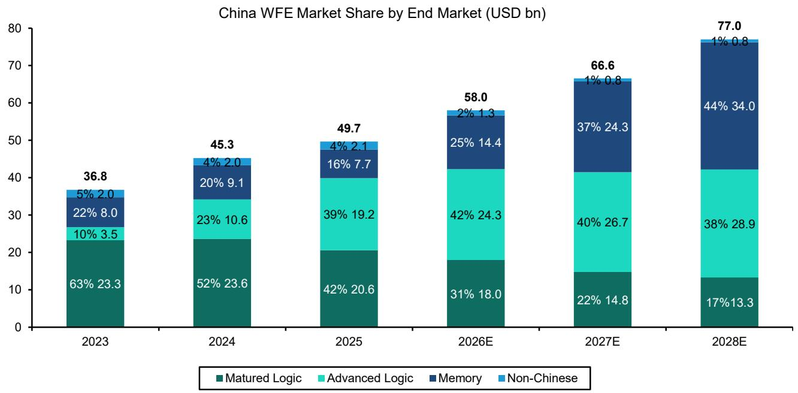
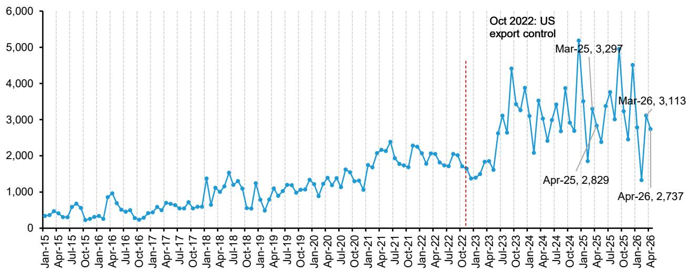
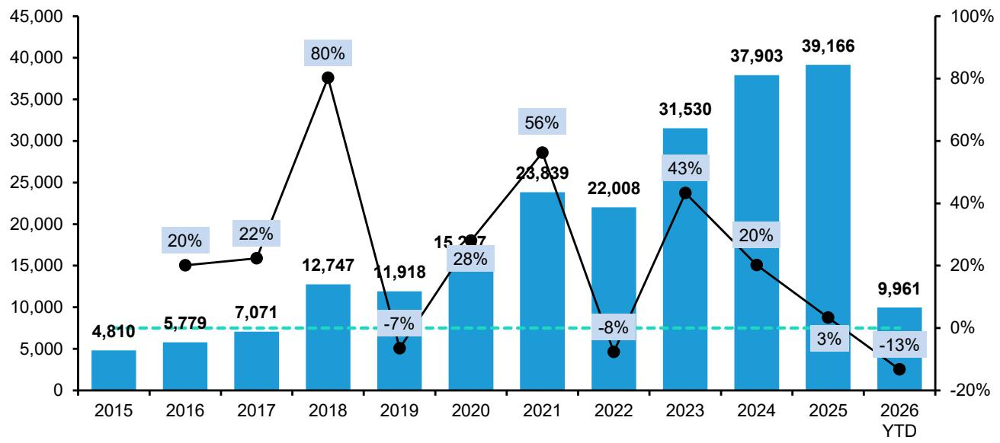
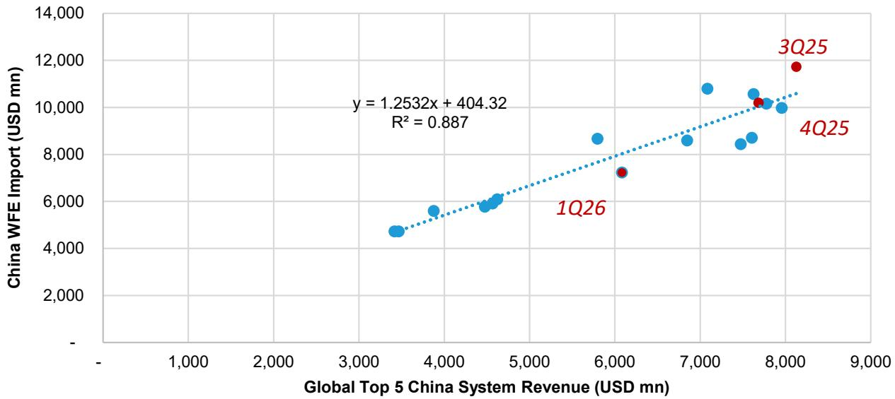

# China Semiconductors

# China Semicap: The surging memory capacity expansion

Qingyuan Lin, Ph.D.

+852 2123 2654

qingyuan.lin@bernsteinsg.com

Stacy A. Rasgon, Ph.D.

+1 213 559 5917

stacy.rasgon@bernsteinsg.com

David Dai, CFA

+852 2918 5704

david.dai@bernsteinsg.com

Zheng Cui

+852 2123 2694

zheng.cui@bernsteinsg.com

Francis Ma

+852 2123 2626

francis.ma@bernsteinsg.com

Alrick Shaw

+1 917 344 8454

alrick.shaw@bernsteinsg.com

Arpad von Nemes

+1 917 344 8461

arpad.vonnemes@bernsteinsg.com

Juho Hwang

+852 2123 2632

juho.hwang@bernsteinsg.com

Carmine Milano, CFA

+44 20 7762 1857

carmine.milano@bernsteinsg.com

We update our China WFE model in this call, (updated model here). From our channel check in the past quarter, Chinese memory IDMs have significantly sped up their capacity expansion plan for the next few years due to robust memory demand and ample available capital, we revised up memory capex in 2027/28 to reflect that change. Local equipment stocks might correct a little bit after a strong rally, but we believe the order growth is still much stronger than expected, creating more upsides for the next few months. Reiterate Outperform for AMEC, Piotech and NAURA.

China WFE is entering another phase of secular growth driven by AI & memory super cycle along with increasing localization. We now project China WFE spending to be USD 58/67/77bn in 2026-28, significantly revised up from previous 55/59/61bn, mainly due to stronger memory capex. This upward revision on demand mainly benefits local and non-US vendors, as both CXMT and YMTC are forced to switch away from US supply chain. We now expect both CXMT and YMTC to ramp up one new fab each in 2026 and another two new fabs each in 2027, with more to come in 2028 (although much less visibility on exact scale at this point). Given most Chinese vendors recognize revenue about 1 year after they receive the order, most of the memory capex upside will reflect in 2027/28 WFE demand. We believe the accelerated memory capacity expansion is driven by both stronger demand and increased available capital. The memory supercycle is creating a significant shortage in DRAM/NAND supply, making local customers a lot more willing to adopt local memory chips, especially for DRAM where the technology has been behind and adoption is lagging. On the other hand, the improved profitability allow CXMT and YMTC to generate tens of bn USD cash in 2026, together with the cash that will be raised through IPO they now both have ample capital to deploy for the capacity expansion. Note that Chinese memory players can ramp up new clear room just within one year compared to global players that need 2-3 years, allowing them to accelerate the capex spending much faster than global peers for the next two years.

AI could bring upside to our advanced logic projection. We didn't revise up our projection on logic capex for the next two years, but as the AI demand continues to grow and Nvidia continues to be banned by both Chinese and US government from shipping to China, we believe the advanced logic capacity expansion could further accelerate as well. At the same time, the demand for AI related peripheral chip also will boost the local foundries to continue to expand mature logic capacity. With limited visibility at this point, we project logic capex to be flattish throughout 2026-28, which we believe there is upside risk to our projection. The AI chip localization also indicates that China will need its own HBM and eSSD to power the local AI datacenters, which could further boosted China's demand on DRAM and NAND capacity and also brings upside to our memory projection.

Local vendors continue to take share from global peers, especially in DRAM in 2026.

Before 2025, the increased in localization ratio was mainly driven by advanced logic and NAND due to higher urgency, but in 2026 Matured logic localization is picking up as the performance of local tools improves, and in 2027 we expect DRAM to have a step change as they switch away from US vendors, continue to boost the localization ratio.

BERNSTEIN TICKER TABLE 

<table><tr><td colspan="3"></td><td rowspan="2">21 May 2026 Closing Price</td><td rowspan="2">Price Target</td><td rowspan="2">TTM Rel. Perf.</td><td colspan="4">Reported EPS</td><td colspan="3">Reported P/E (x)</td></tr><tr><td>Ticker</td><td>Rating</td><td>Cur</td><td>Cur</td><td>2025A</td><td>2026E</td><td>2027E</td><td>2025A</td><td>2026E</td><td>2027E</td></tr><tr><td>688012.CH (AMEC)</td><td>O</td><td>CNY</td><td>475.80</td><td>500.00</td><td>134.2%</td><td>CNY</td><td>3.40</td><td>4.95</td><td>7.18</td><td>139.9</td><td>96.2</td><td>66.2</td></tr><tr><td>002371.CH (NAURA)</td><td>O</td><td>CNY</td><td>662.99</td><td>680.00</td><td>74.9%</td><td>CNY</td><td>5.66</td><td>10.22</td><td>16.41</td><td>117.1</td><td>64.9</td><td>40.4</td></tr><tr><td>688072.CH (Piotech)</td><td>O</td><td>CNY</td><td>606.20</td><td>580.00</td><td>271.3%</td><td>CNY</td><td>3.32</td><td>8.12</td><td>12.40</td><td>182.6</td><td>74.6</td><td>48.9</td></tr><tr><td>AMAT (Applied Materials)</td><td>O</td><td>USD</td><td>427.36</td><td>525.00</td><td>138.3%</td><td>USD</td><td>9.42</td><td>12.17</td><td>15.56</td><td>45.4</td><td>35.1</td><td>27.5</td></tr><tr><td>LRCX (Lam Research)</td><td>O</td><td>USD</td><td>302.24</td><td>340.00</td><td>239.9%</td><td>USD</td><td>4.14</td><td>5.68</td><td>7.98</td><td>73.1</td><td>53.2</td><td>37.9</td></tr><tr><td>8035.JP (Tokyo Electron)</td><td>O</td><td>JPY</td><td>48,800</td><td>59,200</td><td>75.5%</td><td>JPY</td><td>1,250.88</td><td>1,504.14</td><td>1,848.77</td><td>39.0</td><td>32.4</td><td>26.4</td></tr><tr><td>7735.JP (Screen)</td><td>M</td><td>JPY</td><td>10,730</td><td>12,600</td><td>65.2%</td><td>JPY</td><td>486.61</td><td>572.60</td><td>662.24</td><td>22.1</td><td>18.7</td><td>16.2</td></tr><tr><td>6525.JP (Kokusai)</td><td>O</td><td>JPY</td><td>7,005.00</td><td>8,240.00</td><td>94.0%</td><td>JPY</td><td>128.63</td><td>200.23</td><td>274.61</td><td>54.5</td><td>35.0</td><td>25.5</td></tr><tr><td>6920.JP (Lasertec)</td><td>O</td><td>JPY</td><td>38,060</td><td>50,000</td><td>128.5%</td><td>JPY</td><td>937.82</td><td>893.18</td><td>976.61</td><td>40.6</td><td>42.6</td><td>39.0</td></tr><tr><td>ASML (ASML)</td><td>O</td><td>USD</td><td>1,592.00</td><td>1,971.00</td><td>90.8%</td><td>USD</td><td>27.95</td><td>36.96</td><td>53.13</td><td>49.0</td><td>37.1</td><td>25.8</td></tr><tr><td>ASML.NA (ASML)</td><td>O</td><td>EUR</td><td>1,345.20</td><td>1,700.00</td><td>90.4%</td><td>EUR</td><td>24.72</td><td>32.69</td><td>46.98</td><td>54.4</td><td>41.1</td><td>28.6</td></tr><tr><td>ASIAX</td><td></td><td></td><td>1,891.82</td><td></td><td></td><td></td><td></td><td></td><td></td><td></td><td></td><td></td></tr><tr><td>SPX</td><td></td><td></td><td>7,432.97</td><td></td><td></td><td></td><td></td><td></td><td></td><td></td><td></td><td></td></tr><tr><td>JPL</td><td></td><td></td><td>2,461.85</td><td></td><td></td><td></td><td></td><td></td><td></td><td></td><td></td><td></td></tr><tr><td>EDME</td><td></td><td></td><td>1,536.51</td><td></td><td></td><td></td><td></td><td></td><td></td><td></td><td></td><td></td></tr></table>

O - Outperform, M - Market-Perform, U - Underperform, NR - Not Rated, CS - Coverage Suspended   
AMAT, LRCX estimate is Adjusted EPS; AMAT, LRCX valuation is Adjusted P/E (x);   
Source: Bloomberg, Bernstein estimates and analysis.

# INVESTMENT IMPLICATIONS

NAURA (Outperform, CNY 680.00): As the domestic WFE leader, NAURA has the broadest product portfolio covering Deposition (PVD, CVD), Dry Etch (ICP), Thermo Processes, and Cleaning, as well as a more diverse client base covering leading logic, DRAM, NAND players, benefiting from the WFE domestic substitution in China with acceleration share gain.

AMEC (Outperform, CNY 500.00): Primarily focused on Dry Etch (CCP, ICP) with rapid expansion in Deposition (ALD, LPCVD, EPI), commonly perceived as the domestic WFE company with the best technology and widest global recognition, continue to benefit from the WFE domestic substitution in China with acceleration share gain.

Piotech (Outperform, CNY 580.00): Rising domestic WFE vendor primarily focused on Deposition (PECVD, HDPCVD, SACVD, ALD) with expansion in W2W and C2W hybrid bonding equipment for advanced packaging. Piotech has a strong track record of product innovation, which should allow it to benefit from the WFE domestic substitution in China with acceleration share gain.

Tokyo Electron (Outperform, ¥59,200): TEL is the #4 SPE supplier globally and the biggest Japanese SPE supplier with major presence in 6 product segments. It is expected to gain share and expand margins with competitive pricing after yen depreciation.

Kokusai (Outperform, ¥8,240.00): Batch ALD should see more adoption in advanced nodes especially GAA (gate-all-around). The biggest use of batch ALD is in NAND, and NAND capex recovery is accelerating.

Screen (Market-Perform, ¥12,600): Cleaning intensity is not increasing, and the market is competitive with both global rivals (TEL, Lam) and Chinese (ACMR, Naura). Potential upside from panel level packaging is worth watching.

AMAT (Outperform, \$525.00): We maintain a positive view on secular WFE growth and see a number of drivers for AMAT including SAM growth, an increasing services narrative, and capital return.

LRCX (Outperform, \$340.00): CY25 commentary seems supportive, and a NAND upgrade cycle may be starting.

ASML (Outperform, EUR 1,700.00): We adopt a conservative stance on ASML's growth profile relative to consensus and guidance. While ASML's technological leadership and the critical role of EUV lithography are clear, our revenue forecast for 2030 aligns with the lower end of ASML's guidance and is 20% below consensus, with lower assumptions for EUV and China.

# DETAILS

# REVISING UP CHINA WFE DEMAND

2025 closed as another strong year, ending up with nearly \$50bn, with \$39.2bn import (YoY+3%) & \$11bn domestic revenue (YoY +49%). We model slightly higher import in 2026 to \$43bn (slightly more positive than global incumbents have guided in their latest earnings call), meanwhile, we maintain the assumptions that domestic vendors will grow 36% in 2026 to \$15bn, driving the overall China WFE market growing 16% YoY to \$58bn.

Imports in 2026 still expected to be slightly higher than 2025 to around \$43bn in 2026. During the recent earnings season, we observed several global incumbents guiding down the proportion of revenue derived from China; however, this largely reflects strong momentum in overseas Advanced Logic and DRAM segments. In absolute dollar terms, China-related revenue is likely to be broadly flat, (which may sound less exciting but remember the prior year represented a record high). We note that management commentary primarily referred to the “China WFE market,” rather than their reported China revenue. Given their limited visibility into domestic Chinese players, we believe it is reasonable to assume that imports will remain flat at an elevated level, rather than inferring a slowdown in the overall market, which also incorporates domestic growth. Although YTD import -13% YoY, we are still positive on the outlook for 2H26.

Domestic players expected to grow 36% to \$15bn in 2026. We hold high confidence that Chinese domestic players will further grow, as their 2026 revenue should be largely in line with their 2025 order, and now we are looking at \$15bn domestic revenue for 2026. Import data may still be inflated & twisted given the potential stock up, but the rapid progress of local vendors at least reflect the compound effect of (1) fast capacity expansion & (2) fast domestic substitution.

Early visibility on 2027/2028 is significantly more positive than our previous projection. We significantly revised up our 2027 and 2028 China WFE market assumptions by \$7.3 billion and \$16.4 billion respectively. We also assume another flat import year in 2027/2028, but early order guidance of domestic players have shown that we may experience another 50%/50% YoY growth in 2027, reaching \$22/33bn, respectively. Together with \$44bn import, total China WFE market in 2027E/2028E could reach \$67bn/\$77bn. Per our channel checks, we still saw significant potential upside in all sectors even to these numbers, where advanced logic & DRAM could be even better than we expected.

Domestic vendors are still taking share from global players, and we expect this trend to be inevitable & irreversible. We rate NAURA, AMEC, and Piotech Outperform.

We revise up our China WFE market forecast in this call:

- China has gradually stepped out of the spotlight, as global wafer fabrication equipment (WFE) demand from 2026 onward is increasingly driven by overseas markets. We forecast RoW WFE to grow by 25%/20%/12% in 2026E/2027E/2028E, respectively. In contrast, China's WFE demand is projected to grow by 15%/15%/16% in 2026E/2027E/2028E, reflecting a high base effect. As a result, China's share of global WFE demand is expected to decline to 38%\~39% in 2026E to 2028E, down from a peak of 42% in 2025   
- That said, localization in China is expected to continue progressing. We assume that the revenue share of global suppliers remains broadly flat, stabilizing at approximately USD 43\~44 billion. Notably, this USD 44 billion includes both on-the-ground capacity expansion demand and potential inventory stockpiling (i.e., global equipment pre-purchase before local equipment move in as the lead time for global tools are uncertain). Revenue growth for domestic vendors reflects the combined impact of: (1) ongoing capacity expansion with stronger demand across all sectors, and (2) further increases in the localization ratio, which remains the primary driver of China's WFE growth. Consequently, we expect China's semiconductor equipment self-sufficiency ratio to rise to 26% in 2026E and 34% in 2027E and 43% in 2028E.

Exhibit 1 and Exhibit 2 summarize our China WFE demand/supply analysis.

EXHIBIT 1: Global WFE: China demand expected to be continue strong while non-China will grow stronger going forward   

bar

| Year   | China TAM Share | Global TAM |
|--------|-----------------|------------|
| 2017   | 7               | 44         |
| 2018   | 12              | 47         |
| 2019   | 14              | 40         |
| 2020   | 17              | 47         |
| 2021   | 23              | 68         |
| 2022   | 25              | 72         |
| 2023   | 37              | 61         |
| 2024   | 45              | 65         |
| 2025E  | 50              | 72         |
| 2026E  | 58              | 90         |
| 2027E  | 67              | 108        |
| 2028E  | 77              | 121        |

Source: Gartner, SEMI, Bernstein estimates and analysis

EXHIBIT 2: China WFE: Acceleration in domestic substitution continues, expect the self-sufficiency to reach 43% by 2028   
  
Source: Gartner, SEMI, Company reports, Bernstein estimates and analysis

A few highlights to the industry model update (Exhibit 3):

# From a supply side perspective:

- For 2025 China WFE market, our forecast is the same with previous forecast, only edged up a bit based on actual full year import data of \$39.2bn & kept our domestic revenue projection unchanged.   
- For 2026 China WFE market, we now forecast China WFE market to grow 15% to \$58bn. Now we are modeling slightly higher import, given most global players like Lam Research, KLA & Tokyo Electron (Exhibit 5) commenting China WFE to be

flattish YoY, but could end up stronger than they guided as usual, while ASML is guiding down their China revenue. Although it may sound less exciting, remember 2025 marked a record high import year at \$39.2bn, even flattish guidance makes China WFE to be another elevated year. We think global incumbents lack of visibility about the local vendors, hence it is fair to infer their guidance to import data. However, for domestic players, given their 2026 revenue has baked into 2025 new order guidance (mostly due to revenue recognition difference between domestic vendors vs. overseas vendors, where the former need almost 1 year from order to revenue while the latter just need 1\~2 quarters as long as the equipment leave the shore), the visibility for domestic vendors are pretty high. After recent channel check we now have more confidence to model aggregated domestic vendors' revenue to grow 36%, reaching \$15bn. All in all, we view China WFE market in 2026 will be another growth year, mainly driven by the growth of domestic vendors.

\- Early signals on 2027E/2028E is a lot more positive. We admit that we also have very limited visibility about how 2027E/2028E import will look like, but right now we are basically modeling flattish vs. 2026E, given Tokyo Electron's mgmt alluded that China might be flat in the following several years. On the flip side, domestic 2026 order guidance looks rather positive and may even accelerate, hence we now model 2027 domestic revenue YoY+47% to \$22bn and 2028E +50% to \$33bn. We view the next several years as an overwhelming upcycle for China WFE vendors.

# From a demand side perspective:

\- We revise up our assumptions on memory capex due to better than expected capacity expansion based on our channel check. We think next two years there will be massive expansion in domestic Advanced Logic & Memory to meet the surging demand of local AI. For our view on domestic Advanced logic & AI, please see our report here.

EXHIBIT 3: We revised up 2026E/2027E/2028E by \$2.9/\$7.3/\$16.4 bn   

bar_line

2024-2028E: China WFE model revisions
| Year | Old est. (USD bn) | Bernstein new est. (USD bn) | Delta (%) |
| :--- | :--- | :--- | :--- |
| 2024 | 45.3 | 45.3 | |
| 2025 | 50.6 | 50.6 | |
| 2026E | 55.2 | 58.1 | 5 |
| 2027E | 59.3 | 66.6 | 12 |
| 2028E | 60.9 | 77.0 | 26 |

Source: SEMI, company reports, Bernstein analysis and estimates

EXHIBIT 4: We revised up our numbers mostly due to stronger CapEx in memory   

bar_stacked

China WFE Market Share by End Market (USD bn)
| Year | Matured Logic (%) | Advanced Logic (%) | Memory (%) | Non-Chinese (%) |
| :--- | :--- | :--- | :--- | :--- |
| 2023 | 63 | 10 | 22 | 5 |
| 2024 | 52 | 23 | 9.1 | 4 |
| 2025 | 42 | 39 | 7.7 | 4 |
| 2026E | 31 | 42 | 14.4 | 2 |
| 2027E | 22 | 40 | 24.3 | 1 |
| 2028E | 17 | 38 | 34.0 | 1 |
36.8 (total) (USD bn)

Source: Company reports, Bernstein analysis and estimates

EXHIBIT 5: All five companies expect China WFE to be roughly flat YoY but China as a percentage of revenue to normalize lower in 2026 vs. the elevated 2024–2025 levels 

<table><tr><td>Company</td><td>Ticker</td><td>Lastest Comments on China WFE (CY2Q26 &amp; CY2026)</td></tr><tr><td>ASML</td><td>ASML.NV</td><td>ASML guided China to represent approximately 20% of total net sales in 2026, consistent with its current system backlog — a significant decline from 33% in 2025 and 41% in 2024.Management views the elevated 2024–2025 China sales levels as unsustainable, reflecting a normalization after fulfilling a substantial backlog.</td></tr><tr><td>Applied Materials</td><td>AMAT</td><td>In Q2 FY2026, China accounted for 24% of semiconductor systems plus AGS revenue, down from 30% of overall sales in Q1 FY2026, where revenue declined 7% year-over-year.For the full calendar year, Applied Materials expects its China business, along with its ICAPS business worldwide, to be flat to slightly higher — an improvement from the prior guidance of down year-over-year.Management expects China to be flat to slightly up for the calendar year, with ICAPS globally also guided to be flattish.</td></tr><tr><td>Lam Research</td><td>LRCX</td><td>China accounted for 34% of total revenue in Q3 FY2026, a slight decrease from 35% in Q2 FY2026, though it grew approximately $115 million quarter-over-quarter in absolute terms. Lam anticipates China revenue will decline in the June 2026 quarter from current levels.The company expects China&#x27;s percentage of total revenue to decrease over time as growth from global multinational customers outside China increases.</td></tr><tr><td>KLA</td><td>KLAC</td><td>China represented 24% of total revenue in Q3 FY2026, down from approximately 30% in Q2 FY2026, with minimal impact expected from additional US export bans.KLA&#x27;s view is that China WFE will grow at a slower rate than overall WFE, with spending levels in China remaining relatively flat over the last few years. Growth in China is expected to be more greenfield-focused rather than technology-upgrade driven. For CY2026, KLA models China&#x27;s contribution to revenue in the mid-to-high 20% range</td></tr><tr><td>Tokyo Electron</td><td>8035.JP</td><td>For FY2026 (ended March 2026), China represented 34.1% of total sales, declining to 26.8% in Q4 FY2026 — a 5 percentage point sequential drop — as leading-edge node spending grew faster than mature nodes.Management guided China&#x27;s share of revenue to be in the mid-30s for 2026, a normalization from the high-30s seen in the prior year.</td></tr></table>

Source: Company reports, Bernstein analysis

EXHIBIT 6: Apr 2026 WFE import was USD 2,737 mn, YoY -12% & MoM -3%   
Total WFE imports to China by month (USDmn)   

line

| Date       | Value  |
| ---------- | ------ |
| Apr-25     | 2,829  |
| Mar-25     | 3,297  |
| Mar-26     | 3,113  |
| Apr-26     | 2,737  |

Source: General Administration of Customs of the People's Republic of China, Bernstein analysis

EXHIBIT 7: Apr 2026 YTD import YoY -13%, mainly due to weak Lithography & Process Control import   
Total WFE imports to China by year   

bar_line

| Year | Value | Percentage (%) |
| :--- | :--- | :--- |
| 2015 | 4,810 | |
| 2016 | 5,779 | 20 |
| 2017 | 7,071 | 22 |
| 2018 | 12,747 | 80 |
| 2019 | 11,918 | -7 |
| 2020 | 15,217 | 28 |
| 2021 | 23,839 | 56 |
| 2022 | 22,008 | -8 |
| 2023 | 31,530 | 43 |
| 2024 | 37,903 | 20 |
| 2025 | 39,166 | 3 |
| 2026 YTD | 9,961 | -13 |

Source: General Administration of Customs of the People's Republic of China, Bernstein analysis

EXHIBIT 8: 1Q26 import data was below historical trendline. We suspect this is mostly due to the time windows difference between shipment & reveneu.   
Top 5 China Systems Rev. vs. Import Data (Calendar Quarter)   

scatter

| Quarter | Global Top 5 China System Revenue (USD mn) | China WFE Import (USD mn) |
| ------- | ------------------------------------------ | ------------------------ |
| 1Q26    | ~3,500                                     | ~4,800                   |
| 3Q25    | ~8,200                                     | ~11,800                  |
| 4Q25    | ~7,800                                     | ~10,200                  |

Source: Company reports, China Custom, Bernstein analysis and estimates

# DOMESTIC SUBSTITUTION CONTINUES TO ACCELERATE

We expect domestic WFE suppliers to benefit from domestic substitution and exhibit significantly higher growth than global players. Based on the trend of WFE orders we saw from major domestic vendors and recent technology breakthroughs in advanced logic/memory equipment, we now expect the self-sufficiency ratio to reach 26% by 2026, and continue to grow in 2027/2028.

Exhibit 2 shows our analysis of the domestic supply share in China's WFE market based on our bottom-up calculation of the top 5 global suppliers and top 11 Chinese listed WFE vendors' historical revenue and their high-level guidance:

\- In 2026, we project local vendors' revenue to grow at 43% YoY based on the order they received in 2025, we expect the localization ratio will reach 26%. The additional increase in localization ratio in 2025 is mainly supported by NAND, and in 2026 we expect the localization ratio in mature logic and DRAM to start to catch up given the strong order they received in these two segments in 2025. We previously expect the localization ratio to remain low for mature logic for some time due to limited competition, but the feedback from local vendors confirm that they are gaining share from global vendors as some new equipment they developed has reached a similar performance compared to global vendors, while they are able to lower the price by \~20% with lower costs. We expect the trend to continue with an additional 5-10% share gain in mature logic for the next few years as more and more equipment types reach performance parity. Note that we do see local equipment still showing some performance gap vs global leaders (in yield, uptime etc.), but for certain equipment the gap is closing very fast.

We believe there are three key drivers behind the WFE domestic substitution:

1. Local leading logic/memory fabs are forced to co-develop with local WFE vendors after the sanctions, and significantly increased the level of support they provided to local vendors. The U.S. sanctions on advanced-node WFE imports to China in Oct 2022 were the key tipping point. Before the sanctions, the fabs were only using domestic vendors as 'backups'. It was not 'economical' to support local vendors in developing advanced-node WFE, as the best strategy was to buy from global vendors so the fabs could quickly ramp up their process know-how. After the sanctions, supporting local vendors became the most 'economical' strategy, because if the fabs don't invest in the local vendors, they won't be able to get any equipment in the future for advanced-node capacity expansion. The transition was critical, as supporting local vendors changed from 'doing a favor to the local vendors' to 'driven by the fab's own interest'. As a result, local leading fabs opened a lot of processes that were previously not accessible to local vendors and significantly increased their R&D budget to support the verification and improvement of WFE from local vendors.

2. Co-development accelerated the improvement of local WFE vendors' tech capabilities and quickly increased their competitiveness. The co-development dynamics between the local fabs and domestic suppliers create a virtuous circle that accelerates the WFE domestic substitution. According to our channel checks, many types of domestic matured node WFE are already commercialized but still have small performance gaps compared to global leaders (yield, stability, etc.); running in more and more local fabs is quickly helping them to eliminate the gap. In addition, for those types of equipment that local WFE vendor only had prototypes, leading fabs allowed these WFE to be tested in production lines even at their early product development stages and provided customized feedback to help them improve the design and parameters. These allowed domestic vendors to be engaged in fast test-and-optimize cycles to quickly improve their competitiveness, which then attracted more and more small local fabs to become their customers.

3. Government subsidies incentivize fabs to adopt an increasingly higher localization ratio, and state-backed funds continue to support the WFE R&D investment. For example, Nexchip (688249.CH, not covered) explained that the government will provide certain subsidies if $>50\%$ of local equipment is used in 120nm or older nodes, or 25% in 40 & 28nm nodes (link). It seems that the threshold was set slightly higher than their current market share to boost domestic WFE adoption. In addition, the Big Fund continues to provide funding support for WFE R&D. The Big Fund Phase III was established in May 2024 and raised RMB 34.4bn, and we believe part of that will be used to support the rest of the bottleneck equipment that has smaller volumes and higher barriers, thus less ‘commercial’ if evaluated from a single equipment level. The government support mentioned would also help increase the rate of domestic substitution.

# GLOSSARY

EXHIBIT 9: Glossary of some semiconductor manufacturing techniques 

<table><tr><td>Abbreviation</td><td>Full name</td><td>Process</td><td>Detailed explanation</td></tr><tr><td>Semicap</td><td>Semiconductor Capital Equipment</td><td></td><td>Semicap refers to the broader category of equipment used in the semiconductor industry, including WFE, assembly and packaging equipment, and testing equipment</td></tr><tr><td>WFE</td><td>Wafer Fabrication Equipment</td><td></td><td>WFE is a subset of Semicap that specifically refers to the machines and tools used in the manufacturing process of semiconductor wafers, i.e., Front End of chip manufacturing (including part of advanced packaging where the equipment is also used to process wafers)</td></tr><tr><td>ICP-RIE</td><td>Inductively Coupled Plasma - Reactive Ion Etching</td><td>Dry etch</td><td>ICP-RIE uses a high-frequency electromagnetic field to generate a dense and highly reactive plasma remove material from a substrate</td></tr><tr><td>CCP-RIE</td><td>Capacitively Coupled Plasma - Reactive Ion Etching</td><td>Dry etch</td><td>CCP-RIE uses a radio frequency electric field to generate a plasma and remove material from a substrate</td></tr><tr><td>PVD</td><td>Physical Vapor Deposition</td><td>Deposition</td><td>PVD is a thin film deposition technique that involves the transfer of material from a source to a substrate in a vacuum environment</td></tr><tr><td>PECVD</td><td>Plasma-Enhanced Chemical Vapor Deposition</td><td>Deposition</td><td>PECVD is a thin film deposition technique that uses a plasma to enhance the chemical reactions between gases and a substrate to deposit a thin film on a substrate</td></tr><tr><td>LPCVD</td><td>Low Pressure Chemical Vapor Deposition</td><td>Deposition</td><td>LPCVD involves the reaction of gases at low pressure and high temperature to deposit a thin film on a substrate</td></tr><tr><td>SACVD</td><td>Sub-Atmospheric Pressure Chemical Vapor Deposition</td><td>Deposition</td><td>SACVD involves the reaction of gases at sub-atmospheric pressure and high temperature to deposit a thin film on a substrate</td></tr><tr><td>ALD</td><td>Atomic Layer Deposition</td><td>Deposition</td><td>ALD involves the sequential exposure of a substrate to alternating gas-phase precursors, resulting in a highly controlled and conformal deposition of thin films with atomic-scale precision</td></tr><tr><td>ACHM</td><td>Amorphous Carbon Hard Mask</td><td>Deposition</td><td>One of the advanced dielectric films deposited, which can provide good etch selectivity</td></tr><tr><td>UV Cure</td><td>Ultraviolet Cure</td><td>Deposition</td><td>UV cure is a process of curing or hardening a material using ultraviolet light, which triggers a chemical reaction that causes the material to harden or cure in a matter of seconds</td></tr><tr><td>HDP-CVD</td><td>High-Density Plasma Chemical Vapor Deposition</td><td>Deposition</td><td>HDP-CVD deposits a thin film on a substrate at relatively low temperature, which helps to minimize thermal stress on the substrate and reduce the risk of defects</td></tr><tr><td>CMP</td><td>Chemical Mechanical Planarization</td><td></td><td>CMP is a polishing process used in chip manufacturing to remove imperfections and create a smooth, flat surface on the semiconductor wafer after it has been processed with various layers of materials</td></tr></table>

Source: Encyclopedia of Integrated Circuit Industry, Bernstein analysis

# METHODOLOGY FOR SUPPLIER BOTTOM UP ANALYSIS

We have analyzed China's top 10 semiconductor equipment companies by adjusting their China and semicap revenue mix. We have calculated their combined China semicap revenue through a bottom-up approach. The top 10 Chinese semicap companies we have selected are AMEC, NAURA, Piotech, ACMR Shanghai, Kingsemi, PNC, Hwatsing Tech, Leadmicro Nano, Skyverse, and Wuhan Jingce (AMEC, NAURA, and Piotech are covered, rest not covered). We calculated the top 10 Chinese semicap companies' revenue in 2023 using their officially reported annual results. To estimate the revenue for 2024-26, we have used Wind or Bloomberg revenue consensus for listed and uncovered companies and adjusted it with our China semicap mix estimation. We have used our estimates for the revenue of private and covered companies. We have followed a similar methodology for the top 5 global semicap companies. The top 5 Global semicap companies are: ASML, Lam Research, Applied Materials, Tokyo Electron, KLA.

# I. REQUIRED DISCLOSURES

References to "Bernstein" or the "Firm" in these disclosures relate to the following entities: Bernstein Institutional Services LLC (April 1, 2024 onwards), Bernstein & Co., LLC (pre April 1, 2024), Bernstein Autonomous LLP, BSG France S.A. (April 1, 2024 onwards), Bernstein (Hong Kong) Limited 盛博香港有限公司, Bernstein (Canada) Limited, Bernstein (India) Private Limited (SEBI registration no. INH000006378), Bernstein (Singapore) Private Limited, Bernstein Japan KK (サンフォード・C・バーンスタイン株式会社) and analysts employed by SG Africa Technologies & Services to produce Bernstein under a Global Services Agreement in place between Bernstein and SG.

Bernstein is part of a joint venture between SG (SG) and AllianceBernstein, L.P. (AB). Unless specifically noted otherwise, for purposes of these disclosures, references to Bernstein's “affiliates” relate to both SG and AB and their respective affiliates.

# VALUATION METHODOLOGY

This research publication covers six or more companies. For valuation methodology and other company disclosures:

Please visit: https://bernstein-autonomous.bluematrix.com/sellside/Disclosures.action.

Or, you can also write to the Director of Compliance, Bernstein Institutional Services LLC, 245 Park Avenue, New York, NY 10167.

# RISKS

This research publication covers six or more companies. For risks and other company disclosures:

Please visit: https://bernstein-autonomous.bluematrix.com/sellside/Disclosures.action.

Or, you can also write to the Director of Compliance, Bernstein Institutional Services LLC, 245 Park Avenue, New York, NY 10167.

# RATINGS DEFINITIONS, BENCHMARKS AND DISTRIBUTION

# EQUITY RATINGS DEFINITIONS

# Bernstein brand

The Bernstein brand rates stocks based on forecasts of relative performance for the next 12 months versus the S&P 500 for stocks listed on the U.S. and Canadian exchanges, versus the Bloomberg Europe Developed Markets Large and Mid Cap Price Return Index EUR (EDME) for stocks listed on the European exchanges and emerging markets exchanges outside of the Asia Pacific region, versus the Bloomberg Japan Large and Mid Cap Price Return Index USD (JPL) for stocks listed on the Japanese exchanges, and versus the Bloomberg Asia ex-Japan Large and Mid Cap Price Return Index (ASIAX) for stocks listed on the Asian (ex-Japan) exchanges -unless otherwise specified.

The Bernstein brand has three categories of ratings:

- Outperform: Stock will outpace the market index by more than 15 pp   
• Market-Perform: Stock will perform in line with the market index to within +/-15 pp   
• Underperform: Stock will trail the performance of the market index by more than 15 pp

Coverage Suspended: Coverage of a company under the Bernstein brand has been suspended. Ratings and price targets are suspended temporarily, are no longer current, and should therefore not be relied upon.

Not Rated: A rating assigned when the stock cannot be accurately valued, or the performance of the company accurately predicted, at the present time. The covering analyst may continue to publish research reports on the company to update investors on events and developments.

Not Covered (NC) denotes companies that are not under coverage.

Bernstein brand stock ratings are based on a 12-month time horizon.

# Autonomous brand – common stocks

The Autonomous brand rates common stocks as indicated below. As our benchmarks we use the Bloomberg Europe 500 Banks And Financial Services Index (BEBANKS) and Bloomberg Europe Dev Mkt Financials Large and Mid Cap Price Ret Index EUR (EDMFI) index for developed European banks and Payments, the Bloomberg Europe 500 Insurance Index (BEINSUR) for European insurers, the S&P 500 and S&P Financials for US banks and Payments coverage, S5LIFE for US Insurance, the S&P Insurance Select Industry (SPSIINS) for US Non-Life Insurers coverage, and the Bloomberg Emerging Markets Financials Large, Mid and Small Cap Price Return Index (EMLSF) for emerging market banks and insurers and Payments. Ratings are stated relative to the sector (not the market).

The Autonomous brand has three categories of common stock ratings:

- Outperform (OP): Stock will outpace the relevant index by more than 10 pp   
- Neutral (N): Stock will perform in line with the market index to within +/-10 pp   
• Underperform (UP): Stock will trail the performance of the relevant index by more than 10 pp

Coverage Suspended: Coverage of a company under the Autonomous research brand has been suspended. Ratings and price targets are suspended temporarily, are no longer current, and should therefore not be relied upon.

Not Rated: A rating assigned when the stock cannot be accurately valued, or the performance of the company accurately predicted, at the present time. The covering analyst may continue to publish research reports on the company to update investors on events and developments.

Those denoted as ‘Feature’ (e.g., Feature Outperform FOP, Feature Under Outperform FUP) are our core ideas.

Not Covered (NC) denotes companies that are not under coverage.

Autonomous brand common stock ratings are based on a 12-month time horizon.

# Autonomous brand – preferred stocks

The Autonomous brand has three categories of preferred stock ratings:

- Outperform (OP): The total return of the preferred instrument is expected to outperform preferred securities of other issuers operating in similar sectors or rating categories over the next six months.   
- Neutral (N): The total return of the preferred instrument is expected to perform in line with preferred securities of other issuers operating in similar sectors or rating categories over the next six months.   
- Underperform (UP): The total return of the preferred instrument is expected to underperform preferred securities of other issuers operating in similar sectors or rating categories over the next six months.

Autonomous preferred stock ratings are based on a 6-month time horizon.

# AUTONOMOUS CREDIT RESEARCH

Where this report contains investment recommendations for credit instruments, as defined in article 3(1)(35) of the Market Abuse Regulation, the information below is presented to comply with its disclosure requirements.

The report may also include reference(s) to published opinions by other Autonomous or Bernstein analysts covering the equity securities of the issuer(s) referenced herein. Please note an investment recommendation for credit instruments published by the author(s) of this report may differ from the published view of the analyst covering equity securities for the issuer(s) contained in this report and vice versa.

# CREDIT RATINGS DEFINITIONS

The Autonomous brand has three categories of credit ratings:

\- Credit Outperform (C-OP): The total return of the Reference Credit Instrument is expected to outperform the credit spread of bonds of other issuers operating in similar sectors or rating categories over the next six months.

- Credit Neutral (C-N): The total return of the Reference Credit Instrument is expected to perform in line with the credit spread of bonds of other issuers operating in similar sectors or rating categories over the next six months.   
- Credit Underperform (C-UP): The total return of the Reference Credit Instrument is expected to underperform the credit spread of bonds of other issuers operating in similar sectors or rating categories over the next six months.

Autonomous credit ratings are based on a 6-month time horizon.

A list of all investment recommendations produced by the author(s) of this report alongside credit ratings history are available upon request.

It is at the sole discretion of the Firm as to when to initiate, update and cease research coverage. The Firm has established, maintains and relies on information barriers to control the flow of information contained in one or more areas (i.e. the private side) within the Firm, and into other areas, units, groups or affiliates (i.e. public side) of the Firm

DISTRIBUTION OF EQUITY RATINGS/INVESTMENT BANKING SERVICES 

<table><tr><td>Equity Rating</td><td>Market Abuse Regulation (MAR) and FINRA Rating Category</td><td>Global Rating Distribution</td><td>Investment Banking Relationships*</td></tr><tr><td>Outperform</td><td>BUY</td><td>51.1%</td><td>16.5%</td></tr><tr><td>Market-Perform (Bernstein Brand) Neutral (Autonomous Brand)</td><td>HOLD</td><td>36.3%</td><td>17.8%</td></tr><tr><td>Underperform</td><td>SELL</td><td>12.6%</td><td>14.9%</td></tr></table>

\* These figures represent the percentage of companies within each equity rating category for which affiliates of Bernstein have provided investment banking services within the previous 12 months.

As of March 31, 2026. All figures are updated quarterly.

Prior to April 1, 2024, Bernstein & Co., LLC. issued the ratings and price target information in the graph(s) below for the following companies: Applied Materials Inc and Lam Research Corp.

# PRICE CHARTS/ RATINGS AND PRICE TARGET HISTORY

This research publication covers six or more companies. For price chart and other company disclosures, please visit https://bernstein-autonomous.bluematrix.com/sellside/Disclosures.action or you can write to the Director of Compliance, Bernstein Institutional Services LLC, 245 Park Avenue, New York, NY 10167.

# CONFLICTS OF INTEREST

All statements in this report attributable to Gartner represent Bernstein's interpretation of data, research opinion or viewpoints published as part of a syndicated subscription service by Gartner, Inc., and have not been reviewed by Gartner. Each Gartner publication speaks as of its original publication date (and not as of the date of this report). The opinions expressed in Gartner publications are not representations of fact, and are subject to change without notice.

Stacy A. Rasgon maintains long positions in various crypto currencies.

Bernstein Autonomous LLP or BSG France SA, beneficially, has either a net long or short position of 0.5% or more of the total issued share capital of a class of common equity securities of the following MiFID eligible securities: Applied Materials Inc.

SG and/or its affiliates beneficially own 1% or more of a class of common equity securities of the following companies: Kokusai Electric Corp and Lasertec Corp.

Bernstein and/or affiliates have received compensation for non-investment banking securities-related products or services in the previous twelve months from the following clients: Screen Holdings Co Ltd.

Certain affiliates of Bernstein act as market maker or liquidity provider in the equities securities of: Applied Materials Inc, Lam Research Corp and ASML Holding NV.

Certain affiliates of Bernstein act as market maker or liquidity provider in the debt securities of: Screen Holdings Co Ltd.

# OTHER MATTERS

The legal entity(ies) employing the analyst(s) listed in this report, and their location, can be determined by the country code of their phone number, as follows:

+1 Bernstein Institutional Services LLC; New York, New York, USA

+44 Bernstein Autonomous LLP; London UK

+212 SG Africa Technologies & Services; Casablanca, Morocco

+33 BSG France S.A.; Paris, France

+34 BSG France S.A.; Madrid, Spain

+41 Bernstein Autonomous LLP; Geneva, Switzerland

+49 BSG France S.A.; Frankfurt, Germany

+91 Bernstein (India) Private Limited; Mumbai, India

+852 Bernstein (Hong Kong) Limited 盛博香港有限公司; Hong Kong, China

+65 Bernstein (Singapore) Private Limited; Singapore

+81 Bernstein Japan KK; Tokyo, Japan

Where this report has been prepared by research analyst(s) employed by a non-US affiliate, such analyst(s), is/are (unless otherwise expressly noted below) not registered as associated persons of Bernstein Institutional Services LLC or any other SEC-registered broker-dealer and are not licensed or qualified as research analysts with FINRA. Accordingly, such analyst(s) may not be subject to FINRA's restrictions regarding (among other things) communications by research analysts with a subject company, interactions between research analysts and investment banking personnel, participation by research analysts in solicitation and marketing activities relating to investment banking transactions, public appearances by research analysts, and trading securities held by a research analyst account.

Where this report has been prepared by research analyst(s) employed by SG Africa Technologies & Services (part of the SG group of companies), it has been prepared on behalf of a Bernstein company under a Global Services Agreement in place between Bernstein and SG.

# CERTIFICATION

Each research analyst listed in this report, who is primarily responsible for the preparation of the content of this report, certifies that all of the views expressed in this publication accurately reflect that analyst's personal views about any and all of the subject securities or issuers and that no part of that analyst's compensation was, is, or will be, directly or indirectly, related to the specific recommendations or views in this publication.

# II. ADDITIONAL GLOBAL CONFLICT DISCLOSURES

It is at the sole discretion of the Firm as to when to initiate, update and cease research coverage. The Firm has established, maintains and relies on information barriers to control the flow of information contained in one or more areas (i.e., the private side) within the Firm, and into other areas, units, groups or affiliates (i.e., public side) of the Firm.

# III. OTHER IMPORTANT INFORMATION AND DISCLOSURES

Separate branding is maintained for “Bernstein” and “Autonomous” research products.

\- Bernstein produces a number of different types of research products including, among others, fundamental analysis and quantitative analysis under both the “Autonomous” and “Bernstein” brands. Recommendations contained within one type of research product may differ from recommendations contained within other types of research products, whether as a result of differing time horizons, methodologies or otherwise. Furthermore, views or recommendations within a research product issued under one brand may differ from views or recommendations under the same type of research product issued under the other brand. The Research Ratings System for the two brands and other information related to those Rating Systems are included in the previous section.

\- Autonomous operates as a separate business unit within the following entities: Bernstein Institutional Services LLC, Bernstein Autonomous LLP, Bernstein (Hong Kong) Limited 盛博香港有限公司 and Bernstein (India) Private Limited. For information relating to “Autonomous” branded products (including certain Sales materials) please visit: www.autonomous.com. For information relating to Bernstein branded products please visit: www.bernsteinresearch.com.

Analysts are compensated based on aggregate contributions to the research franchise as measured by account penetration, productivity and proactivity of investment ideas. No analysts are compensated based on performance in, or contributions to, generating investment banking revenues.

This report has been produced by an independent analyst as defined in Article 3 (1)(34)(i) of EU 596/2014 Market Abuse Regulation (“MAR”) and the same article of MAR as it forms part of United Kingdom domestic law by virtue of the European Union (Withdrawal) Act 2018.

To our readers in the United States: Bernstein Institutional Services LLC, a broker-dealer registered with the U.S. Securities and Exchange Commission (“SEC”) and a member of the U.S. Financial Industry Regulatory Authority, Inc. (“FINRA”) is distributing this publication in the United States and accepts responsibility for its contents. Where this material contains an analysis of debt product(s), such material is intended only for institutional investors and is not subject to the US independence and disclosure standards applicable to debt research prepared for retail investors.

Bernstein Institutional Services LLC may act as principal for its own account or as agent for another person (including an affiliate) in sales or purchases of any security which is a subject of this report. This report does not purport to meet the objectives or needs of any specific individuals, entities or accounts.

To our readers in Canada: If this publication pertains to a Canadian domiciled company, it is being distributed in Canada by Bernstein (Canada) Limited, which is licensed and regulated by the Canadian Investment Regulatory Organization. If the publication pertains to a non-Canadian domiciled company, it is being distributed by Bernstein Institutional Services LLC, which is licensed and regulated by both the SEC and FINRA, into Canada under the International Dealers Exemption.

This document may not be passed onto any person in Canada unless that person qualifies as "permitted client" as defined in Section 1.1 of NI 31-103.

To our readers in Brazil: This report has been prepared by Bernstein Institutional Services LLC, and Banco BTG Pactual S.A. ("BTG") is responsible for the distribution of this report in Brazil.

To readers in the United Kingdom: This publication has been issued or approved for issue in the United Kingdom by Bernstein Autonomous LLP, authorised and regulated by the Financial Conduct Authority and located at 60 London Wall, London EC2M 5SH, +44 (0)20-7170-5000. Registered in England & Wales No OC343985.

This document is for distribution only to persons who (i) have professional experience in matters relating to investments falling within Article 19(5) of the Financial Services and Markets Act 2000 (Financial Promotion) Order 2005 (as amended, the “Financial Promotion Order”), (ii) are persons falling within Article 49(2)(a) to (d) (“high net worth companies, unincorporated associations, etc.”) of the Financial Promotion Order, (iii) are outside the United Kingdom, or (iv) are persons to whom an invitation or inducement to engage in investment activity (within the meaning of section 21 of the FSMA) in connection with the issue or sale of any securities may otherwise lawfully be communicated or caused to be communicated (all such persons together being referred to as “relevant persons”). This document is directed only at relevant persons and must not be acted on or relied on by persons who are not relevant persons. Any investment or investment activity to which this document relates is available only to relevant persons and will be engaged in only with relevant persons.

To our readers in the member states of the EEA: This publication is being distributed by BSG France SA, which is authorised and regulated by the Autorité de Contrôle Prudentiel et de Résolution (ACPR) and Autorité des Marchés Financiers (AMF).

To our readers in Hong Kong: This publication is being distributed in Hong Kong by Bernstein (Hong Kong) Limited 盛博香港有限公司, which is licensed and regulated by the Hong Kong Securities and Futures Commission (Central Entity No. AXC846) to carry out Type 4 (Advising on Securities) regulated activities and subject to the licensing conditions mentioned in the SFC Public Register (https://www.sfc.hk/publicregWeb/corp/AXC846/details)). This publication is solely for professional investors, as defined in the Securities and Futures Ordinance (Cap. 571). The purpose of this report is solely to provide an analysis of the issuers referred to in this report and is not intended for any purpose contrary to the laws of Hong Kong.

To our readers in Singapore: This publication is being distributed in Singapore by Bernstein (Singapore) Private Limited, only to accredited investors or institutional investors, as defined in the Securities and Futures Act 2001 of Singapore ("SFA"). Recipients in Singapore should contact Bernstein (Singapore) Private Limited in respect of matters arising from, or in connection with, this publication. Bernstein (Singapore) Private Limited is regulated by the Monetary Authority of Singapore and licensed under the SFA as a capital markets services licence holder for dealing in capital markets products that are securities and collective investment schemes and an exempt financial adviser for advising on, issuing and promulgating analyses and reports on securities. Bernstein (Singapore) Private Limited is registered in Singapore with Company Registration No. 20213710W and located at One Raffles Quay, #27-11 South Tower, Singapore 048583, +65-6230-4612.

To our readers in the People's Republic of China: The securities referred to in this document are not being offered or sold and may not be offered or sold, directly or indirectly, in the People's Republic of China (for such purposes, not including the Hong Kong and Macau Special Administrative Regions or Taiwan, the “PRC”) in contravention of any applicable laws of the PRC.

This document does not constitute an offer to sell or the solicitation of an offer to buy any securities in the PRC to any person to whom it is unlawful to make the offer or solicitation in the PRC.

We do not represent that this document may be lawfully distributed, or that any securities may be lawfully offered, in compliance with any applicable registration or other requirements in the PRC, or pursuant to an exemption available thereunder, or assume any responsibility for facilitating any such distribution or offering. In particular, no action has been taken by us which would permit a public offering of any securities or distribution of this document in the PRC. Accordingly, the securities are not being offered or sold within the PRC by means of this document or any other document. Neither this document nor any advertisement or other offering material may be distributed or published in the PRC, except under circumstances that will result in compliance with any applicable laws and regulations.

To our readers in Japan: This publication is being distributed in Japan by Bernstein Japan KK (サンフォード・C・バーンスタイン株式会社), which is registered in Japan as a Financial Instruments Business Operator with the Kanto Local Finance Bureau (registration number: The Director-General of Kanto Local Finance Bureau (FIBO) No.3387) and regulated by the Financial Services Agency. It is also a member of Japan Investment Advisers Association. This publication is solely for qualified institutional investors in Japan only, as defined in Article 2, paragraph (3), items (i) of the Financial Instruments and Exchange Act.

For the institutional client readers in Japan who have been granted access to the Bernstein website by Daiwa Group Inc. ("Daiwa"), your access to this document should not be construed as meaning that Bernstein is providing you with investment advice for any purposes. Whilst Bernstein has prepared this document, your relationship is, and will remain with, Daiwa, and Bernstein has neither any contractual relationship with you nor any obligations towards you.

To our readers in Australia: Bernstein (Hong Kong) Limited 盛博香港有限公司 is responsible for distributing research in Australia. It is regulated by the Securities and Exchange Commission under U.S. laws, by the Financial Conduct Authority under U.K. laws, which differs from Australian laws. Bernstein (Hong Kong) Limited 盛博香港有限公司 is exempt from the requirement to hold an Australian financial services license under the Corporations Act 2001 in respect of the provision of the following financial services to wholesale clients:

• providing financial product advice;   
• dealing in a financial product;   
- making a market for a financial product; and   
• providing a custodial or depository service.

To our readers in India: This publication is being distributed in India by Bernstein (India) Private Limited (SCB India) which is licensed and regulated by Securities and Exchange Board of India ("SEBI") as a research analyst entity under the SEBI (Research Analyst) Regulations, 2014, having registration no. INH000006378 and as a stock broker having registration no. INZ000213537. SCB India is currently engaged in the business of providing research and stock broking services. Please refer to www.bernsteinresearch.in for more information.

\- SCB India is a Private limited company incorporated under the Companies Act, 2013, on April 12, 2017 bearing corporate identification number U65999MH2017FTC293762, and registered office at Level 3A, 4th Floor, First International Financial Centre, Plot Nos C-54 and C-55, G Block, Near CBI Office, Bandra Kurla Complex, Bandra (East), Mumbai 400098, Maharashtra, India (Phone No: +91-22-68421401).

- For details of Associates (i.e., affiliates/group companies) of SCB India, kindly email MUM-BERNSTEIN-InCompliance@bernsteinsg.com.   
• SCB India does not have any disciplinary history as on the date of this report.   
- Except as noted above, SCB India and/or its Associates (i.e., affiliates/group companies), the Research Analysts authoring this report, and their relatives

• do not have any financial interest in the subject company   
• do not have actual/beneficial ownership of one percent or more in securities of the subject company;   
- is not engaged in any investment banking activities for Indian companies, as such;   
• have not managed or co-managed a public offering in the past twelve months for any Indian companies;

\- have not received any compensation for investment banking services or merchant banking services from the subject company in the past 12 months;

• have not received compensation for brokerage services from the subject company in the past twelve months;

\- have not received any compensation or other benefits from the subject company or third party related to the specific recommendations or views in this report; and

\- do not currently, but may in the future, act as a market maker in the financial instruments of the companies covered in the report.

\- do not have any conflict of interest in the subject company as of the date of this report.

- Except as noted above, the subject company has not been a client of SCB India during twelve months preceding the date of distribution of this research report. Neither SCB India nor its Associates (i.e., affiliates/group companies) have received compensation for products or services other than investment banking, merchant banking or brokerage services from the subject company in the past twelve months.   
- The principal research analyst(s) who prepared this report, members of the analysts' team, and members of their households are not an officer, director, employee or advisory board member of the companies covered in the report.   
- Our Compliance officer / Grievance officer is Ms. Rupal Talati, who can be reached at +91-22-68421451, or MUM-BERNSTEIN-InCompliance@bernsteinsg.com / Scbin-investorgrievance@bernsteinsg.com   
- The Research investor charter and Terms & Conditions of SCB India are available on its website and may be accessed at Bernstein (India) Private Limited (https://bernsteinresearch.in/) for your reference.   
- Disclaimer: Registration granted by SEBI, and certification from NISM, is in no way a guarantee of performance of the intermediary or provide any assurance of returns to investors. Investments in securities market are subject to market risks. Read all the related documents carefully before investing.

To our readers in Switzerland: This document is provided in Switzerland by or through Bernstein Autonomous LLP, and is provided only to qualified investors as defined in article 10 of the Swiss Collective Investment Scheme Act (“CISA”) and related provisions of the Collective Investment Scheme Ordinance and in strict compliance with applicable Swiss law and regulations. The products mentioned in this document may not be suitable for all types of investors. This document is based on the Directives on the Independence of Financial Research issued by the Swiss Bankers Association (SBA) in January 2008.

To our readers in the Middle East: Bernstein Autonomous LLP, DIFC branch has its principal office at Gate Village 06, DIFC, Dubai, UAE. Bernstein Autonomous LLP, DIFC branch is regulated by the Dubai Financial Services Authority (DFSA) with the registration number CL10040 and is provisioned for Arranging Deals in Investments and Advising on Financial Products. All communications and services are directed at Professional Clients and Market Counterparties only (as defined in the DFSA rulebook). Persons other than Professional Clients and Market Counterparties, such as Retail Clients, are not the intended recipients of our communications or services.

# LEGAL

All research publications are disseminated to our clients through posting on the firm's password protected websites, bernsteinresearch.com and autonomous.com. Certain, but not all, research publications are also made available to clients through third-party vendors or redistributed to clients through alternate electronic means as a convenience.

This publication has been published and distributed in accordance with the Firm's policy for management of conflicts of interest in investment research, a copy of which is available from Bernstein Institutional Services LLC, Director of Compliance, 245 Park Avenue, New York, NY 10167. Additional disclosures and information regarding Bernstein's business are available on our website www.bernsteinresearch.com.

The securities described herein may not be eligible for sale in all jurisdictions or to certain categories of investors where that permission profile is not consistent with the licenses held by the entities noted herein. This document is for distribution only as may be permitted by law. This publication is not directed to, or intended for distribution to or use by, any person or entity who is a citizen or resident of, or located in any locality, state, country or other jurisdiction where such distribution, publication, availability or use would be contrary to law or regulation or which would subject any of the entities referenced herein or any of their subsidiaries or affiliates to any registration or licensing requirement within such jurisdiction. This publication is based upon public sources we believe to be reliable, but no representation is made by us that the publication is accurate or complete. We do not undertake to advise you of any change in the reported information or in the opinions herein. This publication was prepared and issued by entity referred to herein for distribution to eligible counterparties or professional clients. This publication is not an offer to buy or sell any security, and it does not constitute investment, legal or tax advice. The investments referred to herein may not be suitable for you. Investors must make their own investment decisions in consultation with their professional advisors in light of their specific circumstances. The value of investments may fluctuate, and investments that are denominated in foreign currencies may fluctuate in value as a result of exposure to exchange rate movements. Information about past performance of an investment is not necessarily a guide to, indicator of, or assurance of, future performance.

This report is directed to and intended only for our clients who are “eligible counterparties”, “professional clients”, “institutional investors” and/or “professional investors” as defined by the aforementioned regulators, and must not be redistributed to retail clients as defined by the aforementioned regulators. Retail clients who receive this report should note that the services of the entities noted herein are not available to them and should not rely on the material herein to make an investment decision. The result of such act will not hold the entities noted herein liable for any loss thus incurred as the entities noted herein are not registered/authorised/licensed to deal with retail clients and will not enter into any contractual agreement/arrangement with retail clients. This report is provided subject to the terms and conditions of any agreement that the clients may have entered into with the entities noted herein. All research reports are disseminated on a simultaneous basis to eligible clients through electronic publication to our client portal.

The information in this report was prepared by Bernstein solely for the internal business use of our clients. Clients may store, display, analyze, reformat and print the information in this report for this limited use only. Clients may not copy, alter, create derivative works, resell, reverse engineer, commercially exploit, share or distribute any part of the information contained herein for any purpose without Bernstein's express written consent. These restrictions include extracting data or using the content to develop indices or other products. Further, you may not use this report, or any portion of this report, to train or finetune any third-party machine learning or artificial intelligence system, or as a prompt or input into any such system. You also may not, without Bernstein's express written consent, do any of the foregoing in connection with your own internal machine learning or artificial intelligence system.

Bernstein may use artificial intelligence tools in the preparation of its materials. Any such materials are reviewed by Bernstein's research analysts prior to publication.

This report has been prepared for information purposes only and is based on current public information that we consider reliable, but the entities noted herein do not warrant or represent (express or implied) as to the sources of information or data contained herein are accurate, complete, not misleading or as to its fitness for the purpose intended even though the entities noted herein rely on reputable or trustworthy data providers, it should not be relied upon as such. Opinions expressed are the author(s)' current opinions as of the date appearing on the material only and we do not undertake to advise you of any change in the reported information or in the opinions herein.

This publication was prepared and issued by the entity referred to herein for distribution to eligible counterparties or professional clients. The information in this report is intended for general circulation and does not constitute an offer to buy or sell any security, investment, legal or tax advice nor a personal recommendation, as defined by any of the aforementioned regulators. It does not take into account the particular investment objectives, financial situations, or needs of individual investors. The report has not been reviewed by any of the aforementioned regulators and does not represent any official recommendation from the aforementioned regulators. The investments referred to herein may not be suitable for you. Investors must make their own investment decisions in consultation with advice sought from a financial adviser regarding the suitability of the investment product, taking into account the specific investment objectives, financial situation or particular needs of any recipient of the recommendation, before the recipient

makes a commitment to purchase the investment product.

The analysis contained herein is based on numerous assumptions. Different assumptions could result in materially different results. The information in this report does not constitute, or form part of, any offer to sell or issue, or any offer to purchase or subscribe for shares, or to induce engage in any other investment activity. The value of any securities or financial instruments mentioned in this report may fluctuate subject to market conditions. Information about past performance of an investment is not necessarily a guide to, indicative of, or assurance of future performance. Estimates of future performance mentioned by the research analyst in this report are based on assumptions that may not be realized due to unforeseen factors like market volatility/fluctuation. In relation to securities or financial instruments denominated in a foreign currency other than the clients' home currency, movements in exchange rates will have an effect on the value, either favorable or unfavorable. Before acting on any recommendations in this report, recipients should consider the appropriateness of investing in the subject securities or financial instruments mentioned in this report and, if necessary, seek for independent professional advice.

The securities described herein may not be eligible for sale in all jurisdictions or to certain categories of investors where that permission profile is not consistent with the licenses held by the entities noted herein. This document is for distribution only as may be permitted by law. It is not directed to, or intended for distribution to or use by, any person or entity who is a citizen or resident of or located in any locality, state, country or other jurisdiction where such distribution, publication, availability or use would be contrary to law or regulation or would subject the entities noted herein to any regulation or licensing requirement within such jurisdiction.

Source: Bloomberg Index Services Limited. BLOOMBERG® is a trademark and service mark of Bloomberg Finance L.P. and its affiliates (collectively “Bloomberg”). Bloomberg or Bloomberg’s licensors own all proprietary rights in the Bloomberg Indices. Neither Bloomberg nor Bloomberg’s licensors approves or endorses this material, or guarantees the accuracy or completeness of any information herein, or makes any warranty, express or implied, as to the results to be obtained therefrom and, to the maximum extent allowed by law, neither shall have any liability or responsibility for injury or damages arising in connection therewith.

No part of this material may be reproduced, distributed or transmitted or otherwise made available without prior consent of the entities noted herein. Copyright Bernstein Institutional Services LLC Bernstein Autonomous LLP, BSG France S.A., Bernstein (Hong Kong) Limited 盛博香港有限公司, Bernstein (Canada) Limited, Bernstein (India) Private Limited (SEBI registration no. INH000006378), Bernstein (Singapore) Private Limited and Bernstein Japan KK (サンフォード・C・バーンスタイン株式会社). All rights reserved. The trademarks and service marks contained herein are the property of their respective owners. Any unauthorized use or disclosure is strictly prohibited. The entities noted herein may pursue legal action if the unauthorized use results in any defamation and/or reputational risk to the entities noted herein and research published under the Bernstein and Autonomous brands.