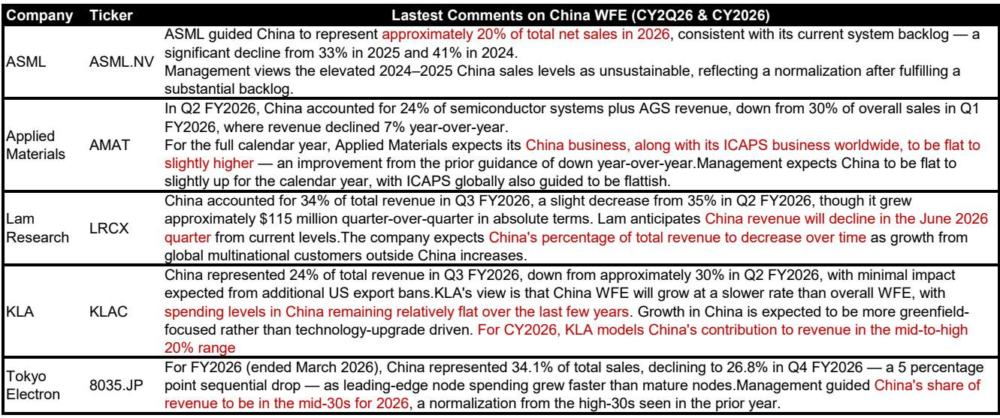
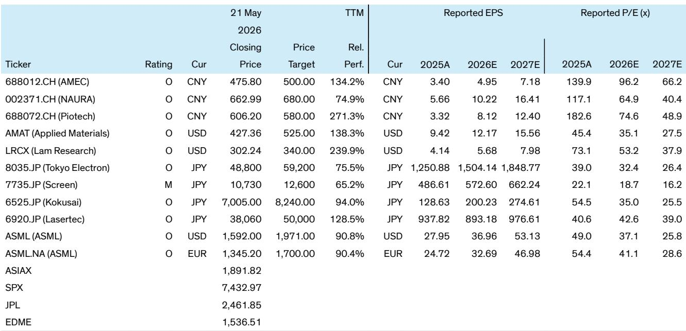

# 中国半导体设备市场正在经历的不是周期，而是供给侧的重新定价

过去几个月，市场对中国半导体设备板块的关注点主要集中在两个问题上：美国出口管制升级会带来多大冲击？以及，国内设备厂商的订单增长是否已经见顶？某外资投行最新发布的深度研报给出了一个与市场共识不同的判断——中国WFE（晶圆制造设备）市场正在进入一个由AI和存储器超级周期共同驱动的结构性增长阶段，而市场真正低估的，不是需求本身，而是中国本土设备商在供给端替代的速度和持续性。

这份研报的核心修正在于：将2026至2028年中国WFE市场规模预测分别上调至580亿、670亿和770亿美元，较此前预测累计上调超过260亿美元。上调的主要驱动力来自存储器领域的资本开支加速，而非此前市场预期的逻辑芯片扩产。这一调整背后，是两个正在发生但尚未被充分定价的结构性变化。

## 1. 存储器扩产正在成为中国WFE增长的新引擎，其速度和规模超出多数投资者预期

过去两年，中国WFE市场的增长主要由逻辑芯片领域的国产替代驱动。但根据该投行最新的渠道调研，中国存储器IDM厂商——主要是长鑫存储（CXMT）和长江存储（YMTC）——正在显著加快未来几年的产能扩张计划。具体而言，报告预计两家公司将在2026年各新增一座晶圆厂，2027年再各新增两座，2028年还有更多扩产计划。

这一判断的支撑逻辑值得仔细拆解。首先，AI驱动的存储器超级周期正在造成DRAM和NAND的供应短缺，这使得下游客户更愿意接受国产存储器芯片，尤其是在技术追赶较晚的DRAM领域。其次，两家存储器厂商的盈利能力改善，预计将在2026年各自产生数百亿人民币的经营现金流，叠加IPO募资，它们拥有充足的资本来支撑大规模扩产。第三，一个被市场低估的运营效率差异：中国存储器厂商从洁净室建设到设备搬入仅需约一年，而全球同行通常需要两到三年。这意味着，未来两年中国存储器厂商的资本开支节奏可以比全球竞争对手快得多。

对于投资者而言，这意味着中国WFE市场的需求结构正在发生根本性转变。存储器扩产对设备的需求强度高于逻辑芯片，且对国产设备的采购比例更高。因此，这一趋势的直接受益者将主要是本土设备商，而非美系供应商。

## 2. AI芯片本地化可能成为逻辑芯片扩产的潜在上行风险，但报告对此保持审慎

报告在逻辑芯片领域的预测相对保守，维持2026至2028年资本开支基本持平的基本假设。但研报同时明确指出，这一假设存在上行风险。原因有二：第一，英伟达受中美两国政策限制无法向中国出口高端AI芯片，这意味着中国必须依靠本土先进逻辑工艺来满足AI算力需求；第二，AI相关的周边芯片需求正在推动本土代工厂持续扩大成熟制程产能。

这里有一个关键但尚未完全回答的问题：中国先进逻辑芯片的扩产能否在技术上支撑AI芯片的本地化需求？报告没有给出明确答案，但这恰恰是投资者需要持续跟踪的核心变量。如果先进逻辑扩产超预期，将为中国WFE市场带来额外的增量需求，并可能进一步推高本土设备商的订单可见度。

## 3. 本土设备商的国产替代正在从“点到面”扩散，DRAM领域将是2027年的关键转折点

研报用数据清晰地勾勒了国产替代的演进路径：2025年之前，国产化率的提升主要由先进逻辑和NAND驱动，原因是这两个领域的替代紧迫性更高。2026年，随着本土设备性能改善，成熟逻辑领域的国产替代开始加速。而到2027年，DRAM领域将出现“阶跃式”变化——存储器厂商将大规模切换至非美系供应商。

这一判断的含义是，国产替代不是均匀推进的，而是在不同细分领域呈梯次爆发。对于设备厂商而言，产品组合能否覆盖DRAM、NAND和逻辑芯片三大领域的核心工艺，将决定其在此轮替代浪潮中的受益程度。报告对北方华创、中微公司和拓荆科技均给予“跑赢大盘”评级，正是基于它们的产品广度或技术深度能够受益于这一趋势。

## 4. 全球WFE需求正在分化，中国份额下降不意味着中国市场走弱

一个容易被误解的数据是：报告预测中国WFE占全球市场的份额将从2025年峰值的42%下降至2026至2028年的38%至39%。但这并不意味着中国市场的绝对规模在收缩。恰恰相反，中国WFE市场仍在以15%左右的年增速增长。份额下降的原因是全球其他地区的WFE需求正在以更快的速度复苏——海外先进逻辑和DRAM资本开支正在加速。

这一分化的本质是：中国WFE市场正在从“进口驱动”转向“本土驱动”。2025年中国WFE进口额为392亿美元，报告预计2026年将小幅上升至430亿美元左右，但此后将基本持平。而本土设备商的收入将从2025年的约110亿美元增长至2028年的330亿美元，自给率从约22%提升至43%。这意味着，未来中国WFE市场的增量几乎全部来自本土设备商，而非进口。

对于全球设备巨头而言，这意味着中国市场的“蛋糕”并没有变小，但分食的规则正在改变。那些无法绕过出口管制、无法在中国建立合规供应链的海外厂商，将逐步失去这一市场。

## 5. 报告尚未完全回答的关键问题：订单转化节奏、先进逻辑扩产不确定性、以及估值是否已反映预期

尽管这份研报提供了清晰的上行逻辑，但仍有几个关键变量需要持续验证。

第一个问题是订单到收入的转化节奏。报告指出，大多数中国设备商在收到订单后约一年才能确认收入，这意味着2027至2028年的WFE需求增量大部分来自当前的在手订单。但如果下游客户的扩产计划出现延迟或调整，收入确认节奏可能不及预期。

第二个问题是先进逻辑扩产的实际进展。报告对逻辑芯片的预测偏保守，但承认存在上行风险。这里的关键在于，中国能否在先进制程上实现量产突破，以及这一突破的时间点是否与AI芯片本地化需求相匹配。目前来看，这一变量的可见度仍然较低。

第三个问题是估值。报告提及，本土设备股在经历一轮强势上涨后可能会出现回调，但订单增长仍远强于预期，未来几个月仍有上行空间。然而，以2027年盈利预期计算，北方华创的市盈率约为40倍，中微公司约为66倍，拓荆科技约为49倍。这些估值是否已经充分反映了订单增长预期，还是仍有未被定价的上行空间，是投资者需要自行判断的问题。

## 6. 投资者的观察框架：从“国产替代率”转向“订单可见度与产品组合交叉验证”

基于报告的框架，投资者可以从三个维度构建自己的观察体系。

第一，跟踪本土设备商的在手订单增速，而非仅关注季度收入。由于收入确认存在约一年的滞后，在手订单才是领先指标。报告对2027至2028年本土设备商收入增长47%至50%的预测，能否兑现，取决于2026年的新签订单能否持续加速。

第二，关注产品组合是否覆盖存储器扩产的核心工艺。DRAM和NAND扩产对刻蚀、沉积、清洗等工艺设备的需求强度不同，且对国产设备的采购偏好也有差异。产品线越宽、覆盖核心工艺越多的厂商，受益确定性越高。

第三，持续跟踪先进逻辑扩产的边际信号。如果中国AI芯片本地化进程加速，将倒逼先进逻辑资本开支上调，这将为设备商带来额外的增量订单。这一变量的信号包括：本土代工厂的招标节奏、设备进口数据的变化、以及政策层面的支持力度。

这份研报的核心贡献，不在于给出具体的盈利预测或目标价，而在于帮助投资者重新理解中国WFE市场的增长逻辑——它正在从“政策驱动的国产替代”转向“AI与存储器周期驱动的结构性扩张”。这一转变意味着，市场此前基于周期框架对设备板块的定价，可能低估了其增长的持续性和斜率。

当然，任何预测都建立在特定假设之上。存储器扩产能否按计划推进、先进逻辑能否实现技术突破、以及全球贸易环境是否会出现新的变化，都将在未来一至两年内接受检验。这些正是需要持续跟踪和讨论的关键问题。

如果你对这份研报的完整数据、对比表格以及各细分领域的详细拆解感兴趣，欢迎来我们的星球微信群里继续讨论。我们会在群里分享原始研报的PDF版本，并定期组织对关键假设的跟踪复盘。

Personal reading notes and learning share only. Not investment advice.

