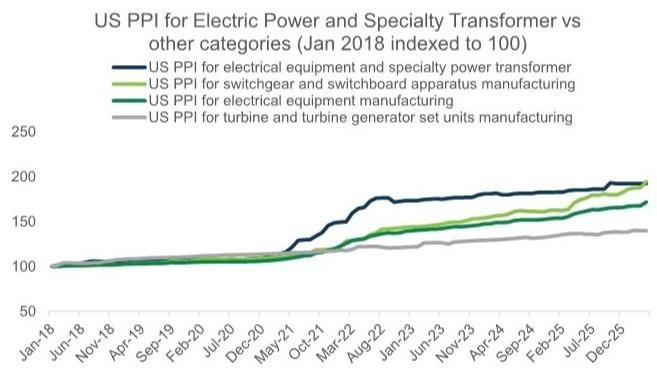
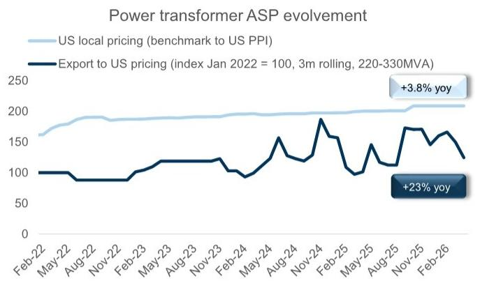
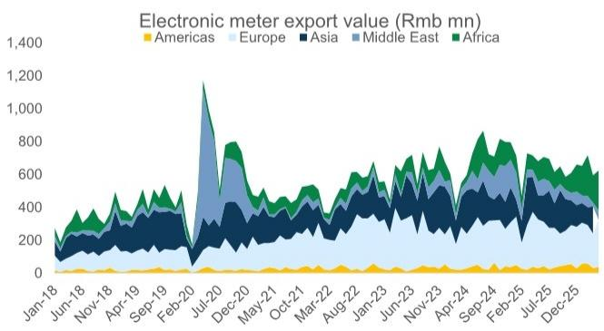

# 美国变压器缺口收窄的速度，比市场想象的要慢

全球电力设备市场正在经历一轮罕见的供需错配。当大多数投资者还在讨论“AI数据中心驱动需求”这一老生常谈的叙事时，一份来自某外资投行的最新出口追踪数据揭示了一个更微妙的信号：中国变压器出口增速在4月明显放缓，但开关柜出口却突然加速至77%的同比增长。这组看似矛盾的数据背后，隐藏着全球电网设备供应链正在发生的结构性重塑——美国本土产能扩张的速度，远不足以填补其巨大的供需缺口。

这份报告的核心判断是：美国电力变压器市场“需求-本地供给”的缺口，将从当前的72%逐步收窄至2028年的60%。这个数字意味着什么？即使考虑到所有已宣布的本地扩产计划，到2028年，美国市场仍有六成的变压器需求需要依赖进口。全球供应链的紧张状态，远未到可以松懈的时刻。

## 1. 中国出口增速放缓不是需求见顶，而是结构性换挡

4月中国变压器总出口额同比增长27%，较3月的56%明显回落。单看这个数字，很容易得出“需求降温”的结论。但深入拆解就会发现，这更像是出口结构的主动调整，而非需求的系统性下滑。

真正值得关注的是区域分化：非洲市场出口暴增681%，贡献了总出口的23%；北美市场增长66%，贡献了19%；亚洲市场增长38%，贡献了30%。而欧洲仅增长9%，中东和拉美则分别下滑26%和63%。这种剧烈的区域分化，说明中国变压器出口正在从“全面铺开”转向“重点突破”——资源正在向需求最紧迫、支付能力最强的市场集中。

对投资者而言，这意味着不能再用“中国变压器出口总量”这个单一指标来判断景气度。需要关注的是：哪些市场在持续增长，哪些市场的增长是由一次性项目驱动，以及不同市场的定价能力差异。非洲681%的增长背后，是基数效应还是长期趋势，这里仍需验证。

## 2. 开关柜出口的突然加速，揭示了比变压器更深的供应链焦虑

4月中国开关柜出口同比增长77%，而3月仅增长5%。这个从“个位数”到“接近翻倍”的跳跃，并非偶然。报告显示，美国开关柜PPI在4月同比上涨14%，而变压器PPI仅上涨3.8%。这说明开关柜的价格传导才刚刚开始，其供需紧张程度可能正在追赶甚至超过变压器。

背后的逻辑链条值得拆解：变压器是电网的“心脏”，而开关柜是“血管”。当变压器短缺问题被广泛讨论后，电网运营商开始加速采购配套的开关设备，以匹配新增的变压器容量。这种“补短板”式的采购行为，往往具有滞后性，但一旦启动，需求弹性更大、持续时间更长。

对于中国设备企业而言，这意味着产品组合的广度正在成为竞争优势。那些同时具备变压器和开关柜出口能力的企业，将受益于这种“配套采购”的溢出效应。而单一产品线企业，则可能面临订单波动的风险。

## 3. 美国本土产能扩张，尚不足以撼动中国供应商的地位

报告最核心的量化判断是：美国变压器“需求-本地供给”缺口将从72%收窄至60%。这个12个百分点的改善，听起来不错，但需要放在更大的背景下理解。72%的缺口意味着美国市场当前每100台变压器的需求中，只有28台能由本土产能满足。即使到2028年，这个数字也仅能提升到40台。

为什么本土产能扩张如此缓慢？核心原因有三：第一，变压器生产需要高度专业化的技术工人和长期积累的工艺经验，这不是建个工厂就能解决的；第二，关键原材料如取向硅钢（GOES）的供应链高度集中在少数国家，美国本土的原材料自给率有限；第三，电网设备认证周期长，新进入者从投产到获得客户认可通常需要2-3年。

这意味着，中国供应商在美国市场的“窗口期”远比市场预期的要长。但窗口期的长短，取决于中国企业在价格、交付和合规性上的综合竞争力。报告显示，220-330MVA段变压器对美出口价格在4月环比下降了14%，但过去三个月的滚动均价仍同比上涨23%。价格波动加剧，说明市场竞争正在升温，但尚未进入价格战阶段。

## 4. 原材料成本波动正在改变竞争格局，但方向并非单向

报告提供了两个关键原材料的价格走势：取向硅钢价格在2023年见顶后持续回落，而铜价在2025年四季度经历了一轮急涨后，于2026年3月出现拐点。这两种原材料的价格走势，对变压器企业的盈利能力有着截然不同的影响。

取向硅钢价格回落，对变压器制造商是明确的利好。作为变压器铁芯的核心材料，取向硅钢成本通常占变压器总成本的15%-20%。价格下行意味着成本压力缓解，利润空间改善。但铜价的大幅波动则更为复杂。铜是变压器线圈的主要材料，铜价急涨会推高在制品和库存的价值，但也可能挤压新订单的利润。

这里的关键变量在于：企业的采购策略和库存管理能力。那些能够通过远期合约锁定铜价、或者拥有较强议价能力向下游传导成本的企业，将在这种波动中占据优势。而那些依赖现货采购、缺乏定价权的企业，则可能面临利润被压缩的风险。报告对这一点的分析尚未完全展开，但这一维度对于评估具体公司的投资价值至关重要。

## 5. 报告尚未完全回答的关键问题：中国企业的定价权究竟能持续多久

尽管报告提供了详尽的出口数据和价格走势，但有一个问题始终悬而未决：中国变压器企业在海外市场的定价权，能持续多久？

当前的高价格，建立在两个前提之上：一是全球供给紧张，二是中国企业的交付能力和性价比优势。但这两个前提都在发生变化。一方面，美国本土产能正在缓慢扩张，其他新兴市场国家（如印度、越南）也在加速进入变压器出口领域。另一方面，中国国内电网投资周期可能进入平台期，部分产能可能转向出口市场，增加供给压力。

从报告数据中可以看到一些端倪：4月对美出口中，10-220MVA段的均价波动剧烈，说明这一市场竞争更加激烈、产品组合变化更快。而220-330MVA段虽然均价较高，但4月单月价格已出现下滑。这些信号是否意味着价格拐点临近？报告没有给出明确答案，但这是所有关注这一赛道的投资者必须持续追踪的核心问题。

## 6. 观察框架：三个维度判断中国电网设备企业的真实竞争力

基于报告的框架和数据，我们建议从以下三个维度来评估中国电网设备企业的投资价值：

第一，产品线的广度。那些同时覆盖变压器、开关柜、电子仪表等多元产品的企业，能够更好地捕捉不同细分市场的需求波动，同时通过“配套采购”获得更高的客户粘性。报告特别提到，开关柜出口的加速可能意味着这一逻辑正在兑现。

第二，海外市场的区域分布。过度集中于单一市场（如美国）的企业，面临更大的地缘政治风险和政策不确定性。而那些在非洲、亚洲等新兴市场也有布局的企业，则拥有更分散的风险敞口和更多元的增长引擎。

第三，成本传导能力。在原材料价格波动的背景下，企业能否将成本上涨有效传导给下游客户，是衡量其定价权的核心指标。这既取决于产品本身的稀缺性，也取决于客户关系的深度和长期合同的占比。

这三个维度，构成了一个初步的筛选框架。但每个维度的具体权重和验证指标，还需要结合更完整的报告数据和公司层面的财务分析来校准。

---

以上分析仅基于这份出口追踪报告的公开数据。报告中还包含了更详细的分电压等级出口数据、分地区定价趋势、以及具体公司的盈利预测和估值分析。这些信息对于判断个股的投资时机至关重要。

如果你想进一步讨论：美国变压器缺口的收窄速度是否可能比预期更快？中国企业的定价权拐点何时到来？或者想获取完整的原始报告图表和公司层面的财务模型，欢迎来星球微信群里继续交流。我们会在群内分享更完整的解读笔记和讨论纪要。

Personal reading notes and learning share only. Not investment advice.

