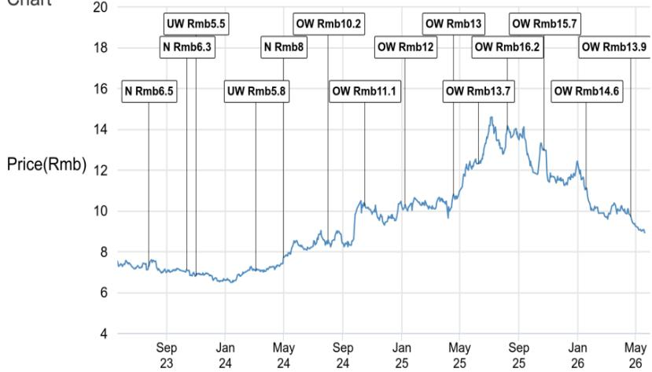
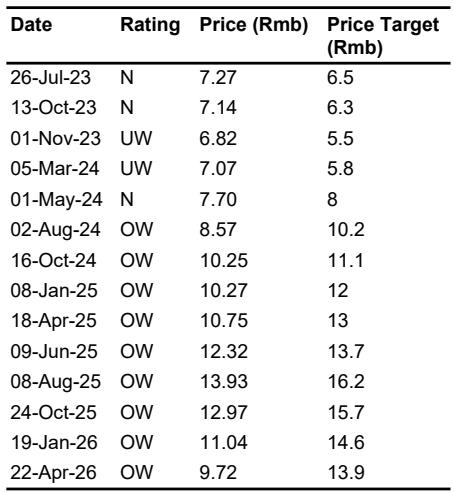
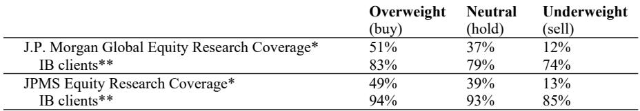

# 股份制银行的分化时刻：利润增速从1%到高单位数意味着什么

当市场还在争论银行净息差是否已经见底时，一份来自近期外资投行金融调研的研报揭示了一个更值得关注的信号：股份制银行正在经历一场根本性的业绩分化，而这种分化并非简单的“好银行”与“坏银行”的二分法，而是关于资产质量出清节奏、零售风险暴露阶段以及管理层战略执行力的三重检验。

这份研报的核心判断是：2026年将成为股份制银行利润增速差距拉大的一年。以某股份制银行为代表的银行已经敢于给出高单位数的利润增长指引，而另一家银行却坦承仍处于零售资产质量恶化的早期识别阶段。两者之间的差距，不是季度波动，而是结构性拐点的时差。

对于投资者和产业决策者而言，理解这种分化的底层逻辑，远比判断行业整体趋势更重要。因为当行业整体增速放缓时，个股的选择就变成了对管理层判断力和风险定价能力的赌注。

## 1. 利润增速的裂口：从1%到高单位数的背后是资产质量出清节奏的差异

2026年一季度，某股份制银行（以下称A银行）的利润增速仅为1%，但管理层给出的全年指引却是高单位数增长。表面上看，这是一个保守开局与乐观全年的矛盾组合。但研报揭示了一个关键细节：A银行在2025年一季度贡献了全年利润的35%，而2026年正在主动降低一季度利润占比，试图让利润分布更加均匀。

这种主动调节行为本身就是一个信号：管理层对全年利润增长有足够的信心，以至于愿意牺牲一季度的报表表现。信心来源是什么？研报提到，该银行的不良贷款生成率将同比下降，信用成本处于改善趋势，且其不良贷款覆盖率在2026年一季度已超过200%。资产质量“处于过去10年最好的水平”——这是管理层自己的判断。

与之形成鲜明对比的是另一家股份制银行（以下称B银行）。该银行管理层坦言“没有信心判断零售资产质量的拐点”，信用卡不良贷款生成率仍然高企且没有明显改善，个人经营贷款不良率在2026年一季度出现反弹。其不良贷款覆盖率仅为140%左右，而管理层的首要目标是将其提升至150%——这意味着利润将优先用于补充拨备，而非释放为增长。

这里的含义很清晰：A银行已经走完了资产质量出清的过程，可以开始释放利润；而B银行仍在出清的路上，利润增长必须让位于风险吸收。两家银行的利润增速差异，本质上是资产质量周期位置的差异。

## 2. 零售贷款需求的结构性塌陷：不是周期性问题，而是资产负债表行为的变化

所有调研银行都确认了一个共同趋势：零售贷款需求疲弱。但研报提供了一个更值得深思的角度——按揭贷款疲弱的真正原因可能不是公积金贷款竞争或交易量恢复不足，而是“首付比例上升（现金支付增加）”。

这个细节远比“需求不足”四个字更有洞察力。如果居民在购房时主动提高首付比例、减少借贷，这意味着居民资产负债表行为的根本性变化——去杠杆而非加杠杆。这种行为变化一旦形成惯性，即使利率下降、政策放松，也难以在短期内逆转。

这对于银行的零售战略意味着什么？那些仍然依赖零售贷款增长来驱动整体增长的银行，可能需要重新审视其增长假设。某股份制银行（以下称C银行）在2026年一季度实现了正零售贷款增长，被认为是行业中的少数，但其全年贷款增长预期仅为低单位数，且结构是“对公为主、零售为辅”。这实际上承认了一个现实：零售贷款已经不再是增长的主动力。

从投资角度看，那些对零售贷款依赖度高、且尚未完成零售资产质量出清的银行，面临的不仅是收入端压力，还有持续的信用成本拖累。而那些已经完成零售资产质量出清、且对公贷款能够支撑增长的银行，则处于相对有利的位置。

## 3. 净息差见底判断的分化：乐观共识背后的结构性差异

所有调研银行都对净息差前景表达了不同程度的乐观，但这种乐观背后的逻辑并不相同。

某股份制银行（以下称D银行）预计2026年全年净息差收缩仅为3-5个基点，远低于2025年的13个基点。另一家银行（以下称E银行）在2026年一季度实现了净息差环比改善2个基点，目标是全年保持稳定或温和改善。还有一家银行（以下称F银行）甚至表示，即使央行对称降息一次，其净息差仍有望同比回升。

这些乐观判断的共同前提是：资产端利率下降的速度已经放缓，而负债端成本仍有一定的压缩空间。但研报也暗示了一个潜在风险：净息差改善的可持续性取决于贷款定价能力和存款成本控制能力。那些对公贷款占比高、存款基础稳定的银行，在净息差管理上具有更强的主动权；而那些依赖同业负债、零售存款竞争激烈的银行，净息差的改善可能更加脆弱。

这里有一个尚未被充分讨论的问题：净息差的“见底”是否意味着“回升”？从研报中的数字来看，即使是最乐观的银行，其净息差目标也只是“稳定”或“温和改善”，而不是大幅反弹。这意味着净息差对利润增长的贡献将是有限的，利润增长的主要驱动力必须来自规模增长和信用成本下降。

## 4. 非利息收入的增长引擎正在切换：财富管理是下一个战场，但竞争格局尚未稳定

在贷款需求疲弱、净息差改善空间有限的背景下，非利息收入成为了利润增长的关键变量。所有调研银行都对手续费收入表达了乐观预期，但乐观的来源各不相同。

D银行的信心来自财富管理业务（理财产品代销、托管）。E银行的目标是手续费收入正增长，其中财富管理业务在2025年实现了12-14%的同比增长，但管理层也承认“竞争依然激烈”。F银行的增长驱动力来自财富管理、结算和托管费用。C银行在2026年一季度的手续费增长主要来自银保业务，并对财富管理业务的恢复持乐观态度，前提是其零售团队和产品货架重建完成。

这些表述暴露了一个共同问题：财富管理业务的增长仍然高度依赖渠道能力和产品供给，而非真正的投资顾问能力。这意味着，如果市场波动加大或监管政策变化，这些增长可能不具备可持续性。同时，研报也提到，债券承销业务的拖累正在因基数效应而减轻，但银行卡手续费仍然是拖累项。

更值得关注的是，C银行特别提到了投资收益的高基数问题——2025年二季度和三季度债券市场表现强劲，导致2026年同期投资收益面临同比压力，这将影响中间季度的营收增长。这个细节提醒我们，非利息收入的增长并不全是结构性的，其中相当一部分是市场环境驱动的周期性因素。

## 5. 报告尚未完全回答的关键问题：零售资产质量的拐点何时到来

尽管研报对不同银行的资产质量状况进行了详细描述，但有一个关键问题并未给出明确答案：零售资产质量的拐点何时到来？

B银行管理层明确表示“没有信心判断拐点”，而A银行虽然声称资产质量处于10年最佳水平，但其零售不良贷款仍然集中在按揭和信用卡领域——按揭不良生成率虽然已经见顶，但仍然处于高位。这意味着，即使是最乐观的银行，其零售资产质量的改善也尚未完全确认。

这个问题之所以关键，是因为它直接决定了利润增长的可持续性。如果零售资产质量的改善只是暂时的（例如因为核销力度加大而非根本性好转），那么利润增长的高单位数指引可能面临下调风险。反之，如果零售资产质量确实进入改善通道，那么这些银行的利润增长将获得更坚实的支撑。

研报提供了一些线索，但并未给出结论。例如，A银行表示信用卡不良生成率“明显下降并趋于稳定”，但这是否意味着趋势性改善？B银行表示个人经营贷款不良率在2026年一季度反弹，但“未超过2025年峰值”——这是否意味着风险可控？这些判断需要更多时间和数据来验证。

对于读者而言，这个未解问题正是进一步深入研究的切入点。零售资产质量的拐点判断，需要结合宏观经济走势、居民收入预期、就业市场状况等多个维度来综合评估。这份研报提供了银行层面的微观证据，但宏观层面的判断仍需更完整的分析框架。

## 6. 从这份研报中提炼的观察框架：如何判断一家银行是否真正走出困境

基于上述分析，我们可以提炼出一个评估股份制银行投资价值的四维框架：

第一，资产质量出清阶段。关键指标不是不良率本身，而是不良贷款生成率的趋势、不良贷款覆盖率的变化方向，以及管理层对资产质量拐点的判断是否自信。那些不良贷款生成率持续下降、覆盖率稳定或上升、管理层敢于给出明确拐点判断的银行，更有可能进入利润释放期。

第二，零售贷款风险暴露程度。需要关注信用卡、个人经营贷款、按揭贷款的不良生成率趋势，以及零售贷款在总贷款中的占比。零售资产质量的改善是结构性的还是周期性的，需要结合居民资产负债表行为来判断。

第三，净息差管理的主动权。关注存款成本控制能力、贷款定价能力，以及净息差改善的来源是资产端还是负债端。那些能够通过结构调整（增加贷款、减少票据）来稳定净息差的银行，具有更强的经营韧性。

第四，非利息收入的可持续性。需要区分手续费收入的增长是来自财富管理能力提升还是市场环境驱动，投资收益的波动是否可控。那些在财富管理领域建立了真正投顾能力的银行，将获得更稳定的非利息收入来源。

这个框架可以帮助投资者在行业整体增速放缓的背景下，识别出那些真正具备结构性优势的银行，而不是被短期的季度波动所误导。

---

这份研报提供的银行层面细节，为我们理解股份制银行的分化提供了宝贵的微观证据。但正如前文所述，关于零售资产质量拐点的判断、净息差改善的可持续性、以及财富管理竞争格局的演变，研报并未给出完整的答案。这些未解问题，恰恰是进一步深度研究的切入点。

如果你对这些问题的答案感兴趣，或者希望获得这份研报的完整图表和原始数据，欢迎来星球微信群里继续讨论。在那里，我们可以基于更多的数据和更完整的分析框架，一起探讨股份制银行的投资逻辑和风险点。

Personal reading notes and learning share only. Not investment advice.

