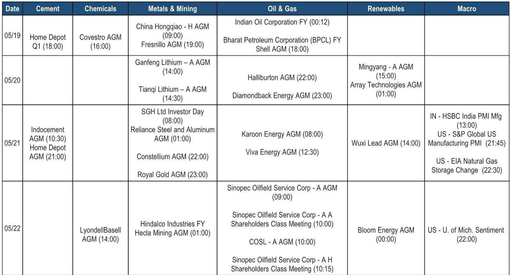

# 铝的供给侧拐点被低估，这才是大宗商品当前最被忽视的结构性机会

市场正在关注中国资产的整体重估，但一个更具体、更迫切的信号正在被宏观叙事淹没：铝的供需格局正在发生根本性转变，而大多数投资者仍将其视为周期波动。某外资投行在中国峰会第二日的交流中，从中国宏桥等核心企业获得的信息指向一个清晰的判断——铝价的上行并非短期情绪驱动，而是供给侧结构性收紧的必然结果。与此同时，铜钴市场的成本压力正在从“会不会短缺”转向“愿意付多高的溢价”，而印尼的反复政策扰动则让资源国风险重新成为定价因子。

这份报告的真正价值不在于罗列数据，而在于它揭示了三个相互独立但又共同指向“资源定价权正在从需求端向供给端转移”的底层逻辑。以下是我们提炼的核心洞察。

## 1. 铝的供需错配远比市场认知的更深，印尼产能释放的时间差是关键变量

市场对铝价的担忧主要集中在两点：一是中国45Mt产能天花板是否会被突破，二是印尼大规模新建产能是否会在短期内冲击全球供应。中国宏桥在峰会上的回应直接而有力——他们用自己耗时2.5年才在印尼建成1Mt氧化铝精炼厂的经验，质疑市场对“2年内投产2Mt电解铝”的乐观预期。电力配套的瓶颈不是靠规划文件能解决的。

更关键的是，LME库存已降至300kt的临界水平，其中约200kt为俄罗斯货源。中国出口月均550kt的规模，意味着国内库存的消耗速度将在1-2个月内对全球市场产生实质性影响。宏桥的判断是，铝价在未来12-18个月将维持高位甚至进一步上行，且目前尚未看到来自客户的需求破坏。

这意味着什么？市场当前对铝价的定价仍然隐含了“供应会很快跟上”的假设。但这个假设在缺乏电力基础设施和建设周期的约束下，很可能被证伪。对于持有铝相关资产的投资者而言，供给侧的确定性比需求侧的预测更有价值。

## 2. 铜钴市场的真正风险不是短缺，而是成本结构的永久性上移

CMOC的交流揭示了另一个容易被误解的问题。市场此前担忧刚果金出现硫酸或柴油短缺，但CMOC明确表示，区域内主要矿商都有自己的酸厂，库存足以支撑到三季度。柴油也不存在真正的短缺，只要愿意支付溢价就能获得供应。

但“没有短缺”不等于“没有压力”。硫酸在现金成本中的占比已从10%上升至20%，柴油成本占比也在上升。这是一个结构性的成本曲线抬升，而非临时性波动。同时，刚果金的税收政策正在收紧——当LME铜价超过11,500美元时，50%的暴利税将在2027年生效，而钴配额制度已经落地。

对于铜产业链而言，这意味着边际成本曲线正在变得陡峭。那些依赖外部硫酸供应或柴油采购的矿商，其成本优势将进一步收窄。而对于投资者而言，需要关注的不是“有没有矿”，而是“谁的矿在成本曲线上还具备竞争力”。

## 3. 印尼政策反复已从扰动升级为系统性风险，资源国溢价需要被重新定价

印尼的“最新震惊”是要求所有煤炭、棕榈油及铁合金（镍）出口必须通过一家中央国有企业实体进行，包括文件、销售协议、客户和支付流程。这不是一个孤立的政策调整，而是继配额削减、矿山没收、特许权使用费提高、出口关税之后的最新举措。

印尼股市（JCI）昨日下跌4%，年初至今已下跌34%。这个数字本身已经说明问题——市场正在将印尼风险溢价计入资产价格。但关键问题在于，这个风险溢价是否已经被充分定价？考虑到印尼是镍、铝土矿和煤炭的重要供应国，其政策不确定性对全球供应链的影响远不止于印尼本土企业的股价。

对于任何在印尼有直接或间接敞口的投资者，都需要重新审视其投资组合中的“国别风险”权重。这不是一个可以被分散化的微观风险，而是会通过成本传导和供应中断影响全球商品定价的系统性变量。

## 4. 化工行业的真正观察点不是PetroChina，而是Sinopec

报告中的一个细节值得特别关注：PetroChina的化工资本开支虽然仍在推进，但其乙烷原料优势使其始终能够盈利。真正需要警惕的是Sinopec——作为最大的增量产能贡献者，它已经在化工业务上连续亏损四年，且本次峰会并未安排交流。

这意味着什么？中国化工行业的产能出清可能比市场预期的更早到来。当最大的玩家持续亏损，而资本开支仍在高位时，行业利润率的修复可能需要通过更剧烈的竞争来实现。对于化工品价格和下游成本而言，这是一个需要持续跟踪的变量。

报告本身也提供了一个关键数据点：某外资投行预计2026年中国化工资本开支同比下降10%。如果这一判断成立，那么化工行业的供应拐点可能正在临近，但在此之前，亏损和产能过剩仍是主旋律。

## 5. 报告尚未完全回答的关键问题：地缘政治风险如何影响资产定价

报告提到了两个值得深入探讨但未完全展开的问题。一是Zijin和Allied Gold在马里的困境——9名中国员工被绑架，以及Zijin尚未获得NDRC对收购的批准。这不仅仅是单个公司的运营风险，而是中国海外矿业投资在特定司法辖区面临的安全与政治环境恶化的缩影。二是刚果金近期对美国友好的政策立场，可能限制中资企业在当地的进一步扩张。

这些问题的共性在于，它们都指向一个正在发生的趋势：资源国的政策制定正在从“吸引外资”转向“重新分配收益”。对于矿业公司而言，这意味着未来的资本配置决策需要将更高的政治风险溢价纳入考量。而对于投资者而言，这意味着传统的估值模型可能需要引入新的风险因子。

报告没有完全回答的是：这种风险溢价应该如何量化？它对不同矿商的差异化影响有多大？这些问题的答案，可能需要结合更完整的公司层面数据和国别风险分析才能得出。

---

以上是我们从某外资投行中国峰会第二日交流中提炼的核心判断。铝的供给侧拐点、铜钴的成本结构变化、印尼的政策系统性风险，以及化工行业的产能出清节奏，构成了当前大宗商品市场最值得关注的四条主线。但每条主线背后都有尚未完全解答的问题——比如印尼电解铝产能的真实投产时间表、刚果金税收政策的执行力度、以及Sinopec化工业务的亏损能否在资本开支缩减前得到缓解。

这些问题的深入讨论，以及报告中提到的完整图表和公司层面数据，我们会在星球微信群里继续展开。欢迎感兴趣的朋友加入，一起追踪这些关键变量的变化，而不是等到市场已经定价完毕才后知后觉。

Personal reading notes and learning share only. Not investment advice.

