# Energy | North America

# Refreshing Estimates & Revisiting Sensitivities

We refresh ests for 1Q, latest '26 guides and oil price strip as of 5/20. Our '26 oil prod'n for oil E&Ps +0.6% on avg with most spending plans unchanged. We see post-conflict value and would opportunistically add exposure to Majors & high-quality E&Ps on de-escalation pullbacks.

# Key Takeaways

With 1Q results, most left '26 activity & spending unchanged (except for FANG, COP, PR), some slightly raised volume guides at similar capex due to efficiencies.   
FY26 oil prod'n for oil E&Ps rises by 0.6% on average (near consensus). Guidance implies \~40 kb/d exit-exit US shale growth for E&Ps (\~180 kb/d incl. majors).   
We estimate a median 2026 FCF yield of 15% for our oil E&P coverage at latest strip (full-year average \~\$88 WTI) and 9% for gas E&Ps (\~\$3.67 HH).   
Oil producers are pricing in long-run WTI of \~\$70, \~16% below the 12-month strip. Gas E&Ps reflect \~\$3.50 Henry Hub, near the forward curve.   
We retain our preference for Majors (most upside for XOM) and E&Ps with positive rate of change (DVN, PR, CHRD & CVE).

Capital discipline holds despite higher prices. As we highlighted last week (see Higher Oil, Flat Activity - Recapping 1Q), 1Q earnings brought generally constructive operational updates, with most operators keeping 2026 activity plans unchanged despite higher prices (except for FANG, COP, & to a lesser degree PR). Some also modestly raised production outlooks with no change to spending, citing efficiency gains. Despite strong results and ongoing disruption in oil markets, the group is down \~3% month-to-date. While there is a wide range of near-term outcomes, including potential downside risk with a formal peace deal, fully restoring production and replenishing inventories will take time, likely supporting prices well beyond the end of the conflict. We would opportunistically add exposure to Majors & high-quality E&Ps with positive rate of change on de-escalation pullbacks.

Refreshing estimates. With this note, we refresh estimates for 1Q results and updated 2026 guidance. Full-year production for oil E&Ps in our coverage moves \~0.6% higher on average (near consensus), while capex is roughly unchanged (near consensus). In addition, we are refreshing our price deck to reflect the oil & gas strip as of May 20, bringing our assumed FY 2026 WTI price to \~\$88, up from \~\$79 prior. Higher crude prices drive an 18% average increase in our '26 FCF estimates, while our refreshed 2026 EBITDA estimates are 10% above consensus. Intrinsically, oil E&Ps reflect \~\$70 long-run WTI, below the 12-month strip. Gas stocks are pricing in \~\$3.50 Henry Hub, near the 12-month forward price.

MS & CO. LLC

# Devin McDermott

Equity Analyst and Commodities Strategist

Devin.McDermott@morganstanley.com +1 212 761-1125

# Joe Laetsch, CFA

Equity Analyst

Joe.Laetsch@morganstanley.com +1 212 761-8804

# Svetlana Do

Research Associate

Svetlana.DO@morganstanley.com +1 212 761-2409

# Helen Lin

Research Associate

Helen.Lin@morganstanley.com +1 212 761-0766

# Justin W Latran, CFA

Research Associate

Justin.Latran@morganstanley.com +1 212 761-2869

# Jacqueline M Kenny

Research Associate

Jacqueline.Kenny@morganstanley.com +1 212 761-2253

EXPLORATION & PRODUCTION 

<table><tr><td>North America Industry View</td><td>In-Line</td></tr><tr><td>INTEGRATED OIL</td><td></td></tr><tr><td>North America Industry View</td><td>Attractive</td></tr></table>

See our price target changes in Exhibit 12

MS does and seeks to do business with companies covered in MS. As a result, investors should be aware that the firm may have a conflict of interest that could affect the objectivity of MS. Investors should consider MS as only a single factor in making their investment decision.

For analyst certification and other important disclosures, refer to the Disclosure Section, located at the end of this report.

\- With this update, we incorporate the DVN/CTRA merger, which closed on May 7. The company expects to issue combined full-year guidance in mid-June. We remain Overweight on DVN and increase our price target to \$66/sh (36% upside).

See Estimate Revisions for key model changes vs. pre-1Q earnings estimates for each company.

Exhibit 1: Looking ahead to 2027, oil E&Ps offer a median FCF yield of 12% at strip (\~\$75 WTI). US Majors and Canadian oil sands producers sit closer to 8%

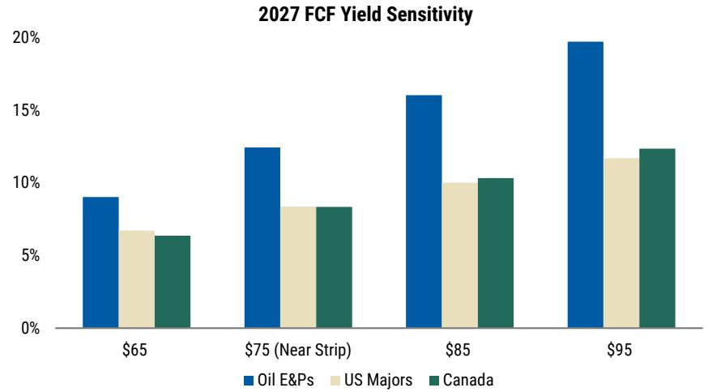

bar

2027 FCF Yield Sensitivity
| Price Point | Oil E&Ps (%) | US Majors (%) | Canada (%) |
| :--- | :--- | :--- | :--- |
| $65 | 9.0 | 6.7 | 6.3 |
| $75 (Near Strip) | 12.5 | 8.4 | 8.3 |
| $85 | 16.0 | 10.0 | 10.3 |
| $95 | 19.8 | 11.7 | 12.3 |

Source: FactSet, MS estimates

# Key Charts – Estimates & Valuation

Exhibit 2: Since the start of the Iran conflict, E&Ps have risen 7%, underperforming the broader market by \~1%   
Performance   
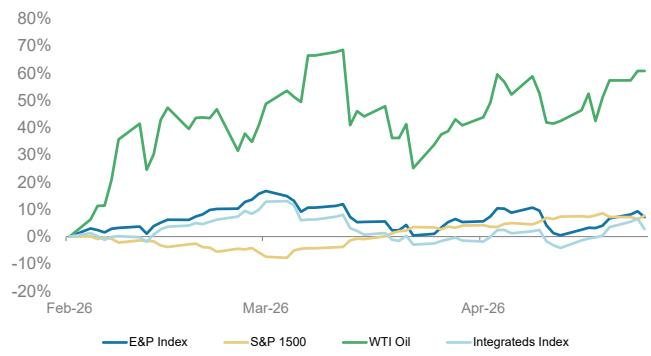

line

| Date   | E&P Index | S&P 1500 | WTI Oil | Integrateds Index |
|--------|-----------|----------|---------|-------------------|
| Feb-26 | ~0%       | ~0%      | ~0%     | ~0%               |
| Mar-26 | ~15%      | ~-5%     | ~70%    | ~10%              |
| Apr-26 | ~5%       | ~5%      | ~60%    | ~5%               |

Source: FactSet, MS

Exhibit 4: The median FCF yield for our oil coverage is 12% at \~\$88 WTI (near FY26 avg implied by bal-year strip). This would move by \~2% for every \$10 change in oil. CHRD, NOG & APA all screen particularly well across a range of prices   
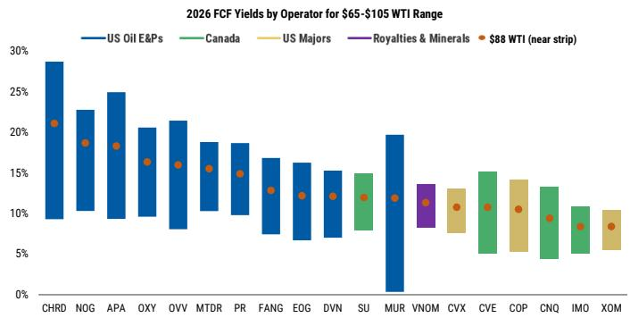

bar

| Operator | US Oil E&P's | Canada | US Majors | Royalties & Minerals | $88 WTI (near strip) |
| -------- | ------------ | ------ | --------- | --------------------- | -------------------- |
| CHRD     | 29%          | -      | -         | -                     | 21%                  |
| NOG      | 23%          | -      | -         | -                     | 19%                  |
| APA      | 25%          | -      | -         | -                     | 18%                  |
| OXY      | 20%          | -      | -         | -                     | 17%                  |
| OVV      | 21%          | -      | -         | -                     | 16%                  |
| MTDR     | 19%          | -      | -         | -                     | 15%                  |
| PR       | 19%          | -      | -         | -                     | 14%                  |
| FANG     | 17%          | -      | -         | -                     | 13%                  |
| EOG      | 16%          | -      | -         | -                     | 12%                  |
| DVN      | 15%          | -      | -         | -                     | 12%                  |
| SU       | 15%          | -      | -         | -                     | 12%                  |
| MUR      | 20%          | -      | -         | -                     | 12%                  |
| VNOM     | -            | -      | -         | 13%                   | 11%                  |
| CVX      | -            | -      | -         | 13%                   | 11%                  |
| CVE      | -            | 15%    | -         | -                     | 11%                  |
| COP      | -            | -      | 14%       | -                     | 10%                  |
| CNQ      | -            | 13%    | -         | -                     | 9%                   |
| IMO      | -            | 11%    | -         | -                     | 8%                   |
| XOM      | -            | -      | 6%        | -                     | 8%                   |

Source: FactSet, MS estimates. Y-axis is cut off at 30%.

Exhibit 3: We estimate consensus is currently pricing in \~\$80 WTI based on 2026 EBITDAX estimates, lower than the full-year average of \$88 implied by the latest strip   
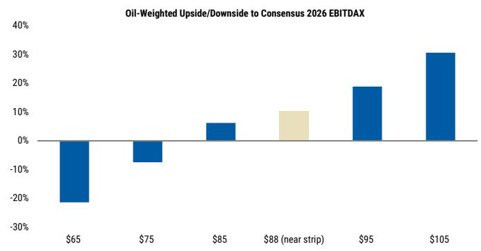

bar

Oil-Weighted Upside/Downside to Consensus 2026 EBITDAX
| Price ($) | Change (%) |
|---|---|
| $65 | -20 |
| $75 | -5 |
| $85 | 5 |
| $88 (near strip) | 10 |
| $95 | 18 |
| $105 | 30 |

Source: FactSet, MS

Exhibit 5: At prices near strip, we see about 10% upside to FY26 consensus EBITDA, rising to 30% at \$105. We also see significant upside to estimates for the US majors, supported by strong downstream margins   
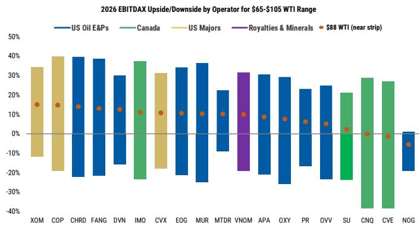  
Source: FactSet, MS estimates

Exhibit 6: Our 2026 oil production estimates are moving $\sim 0.3\%$ higher on average (+0.6% for oil E&Ps) as some producers modestly raised '26 oil guides   
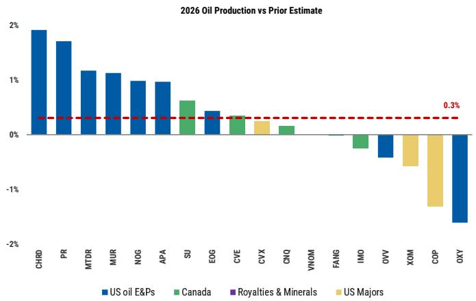

bar

2026 Oil Production vs Prior Estimate
| Company | 2026 Oil Production vs Prior Estimate (%) |
| :--- | :--- |
| CHRD | 1.9 |
| PR | 1.7 |
| MTDR | 1.15 |
| MUR | 1.1 |
| NOG | 0.95 |
| APA | 0.95 |
| SU | 0.55 |
| EOG | 0.35 |
| CVE | 0.25 |
| CVX | 0.15 |
| CNQ | 0.1 |
| VNOM | -0.05 |
| FANG | -0.05 |
| IMO | -0.2 |
| OVV | -0.4 |
| XOM | -0.6 |
| COP | -1.3 |
| OXY | -1.8 |
0.3% (dashed line) indicated by red dashed line.

Source: FactSet, Visible Alpha, MS estimates. Prior refers to pre-earnings estimates. Oil production is oil & condensate for OVV. CVX & XOM oil production includes NGLs. DVN is not shown as we incorporated merger with CTRA.

Exhibit 8: Our 2026 capex estimates remain roughly unchanged on average as most operators maintained their activity plans...   
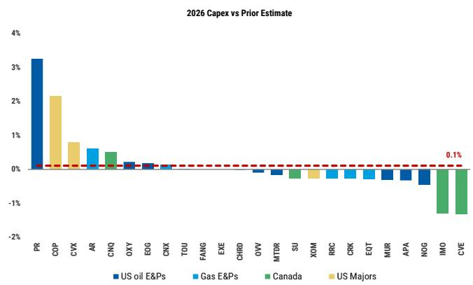

bar

| Category | US oil E&Ps | Gas E&Ps | Canada | US Majors |
| -------- | ----------- | -------- | ------ | --------- |
| PR       | 3.2%        | -        | -      | 2.1%      |
| COP      | -           | -        | -      | -         |
| CVX      | -           | -        | -      | 0.8%      |
| AR       | -           | 0.6%     | -      | -         |
| CNQ      | -           | -        | 0.4%   | -         |
| OXY      | 0.1%        | -        | -      | -         |
| EDG      | 0.1%        | -        | -      | -         |
| CNX      | -           | -        | -      | -         |
| TOU      | -           | -        | -      | -         |
| FANG     | -           | -        | -      | -         |
| EXE      | -           | -        | -      | -         |
| CHRD     | -           | -        | -      | -         |
| OVV      | -           | -        | -      | -         |
| MTDR     | -           | -        | -0.2%  | -         |
| SU       | -           | -        | -0.3%  | -         |
| XOM      | -           | -        | -0.4%  | -0.2%     |
| RRC      | -           | -        | -0.5%  | -         |
| CRK      | -           | -        | -0.6%  | -         |
| EQT      | -           | -        | -0.7%  | -         |
| MUR      | -           | -        | -0.8%  | -         |
| APA      | -           | -        | -0.9%  | -         |
| NOG      | -0.5%       | -        | -1.0%  | -         |
| IMO      | -           | -        | -1.8%  | -         |
| CYE      | -           | -        | -1.8%  | 0.1%      |

Source: FactSet, Visible Alpha, MS estimates. Prior refers to pre-earnings estimates. Oil production is oil & condensate for OVV. CVX & XOM oil production includes NGLs. DVN is not shown as we incorporated merger with CTRA.

Exhibit 7: MSe roughly in line with consensus on average   
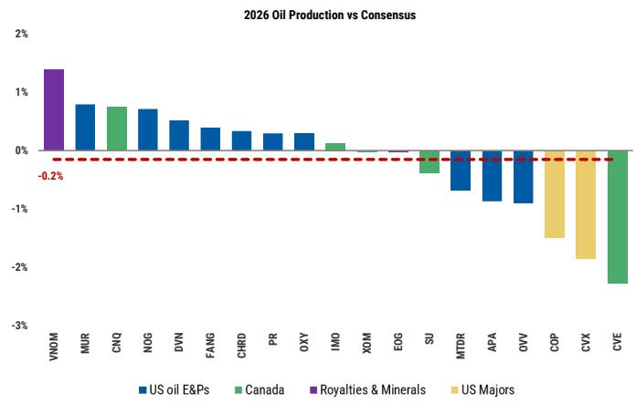

bar

| Ticker | US oil E&Ps | Canada | Royalties & Minerals | US Majors |
| ------ | ----------- | ------ | -------------------- | --------- |
| VNOM   |             |        | 1.4%                 |           |
| MUR    | 0.8%        |        |                      |           |
| CNQ    |             | 0.8%   |                      |           |
| NOG    | 0.7%        |        |                      |           |
| DVN    | 0.5%        |        |                      |           |
| FANG   | 0.4%        |        |                      |           |
| CHRD   | 0.3%        |        |                      |           |
| PR     | 0.3%        |        |                      |           |
| OXY    | 0.3%        |        |                      |           |
| IMO    |             | 0.1%   |                      |           |
| XOM    |             |        |                      |           |
| EOG    |             |        |                      |           |
| SU     |             | -0.5%  |                      |           |
| MTDR   | -0.7%       |        |                      |           |
| APA    | -0.9%       |        |                      |           |
| OVV    | -0.8%       |        |                      |           |
| COP    |             |        |                      | -1.5%     |
| CVX    |             |        |                      | -1.8%     |
| CVE    |             | -2.5%  |                      | -2.5%     |

Source: FactSet, Visible Alpha, MS estimates. Oil production is oil & condensate for OVV. XOM oil production includes NGLs.

Exhibit 9: ... with MSe \~1% above consensus on average   
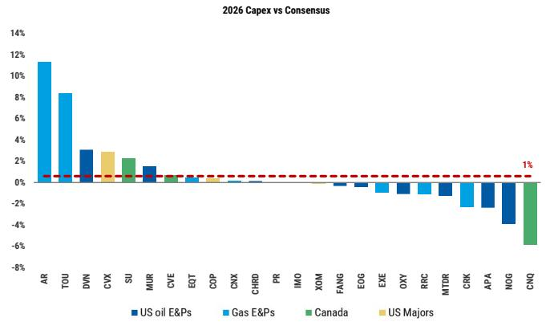

bar

| Ticker | US oil E&Ps | Gas E&Ps | Canada | US Majors |
| ------ | ----------- | -------- | ------ | --------- |
| AR     |             |          |        |           |
| TOU    |             | 8.5%     |        |           |
| DVN    | 3.0%        |          |        |           |
| CYX    |             |          |        | 3.0%      |
| SU     |             |          |        |           |
| MUR    | 1.5%        |          |        |           |
| CVE    |             |          |        |           |
| EQT    |             |          |        |           |
| COP    |             |          |        |           |
| CNX    |             |          |        |           |
| CHRD   |             |          |        |           |
| PR     |             |          |        |           |
| IMO    |             |          |        |           |
| XOM    |             |          |        |           |
| FANG   |             |          |        |           |
| EOG    |             |          |        |           |
| EXE    |             |          |        |           |
| OXY    |             |          |        |           |
| RRC    |             |          |        |           |
| MTDR   |             |          |        |           |
| CRK    |             |          |        |           |
| APA    |             |          |        |           |
| NOG    |             |          |        |           |
| CNQ    |             |          | -6.0%  | 1%        |

Source: FactSet, Visible Alpha, MS estimates. Oil production is oil & condensate for OVV. XOM oil production includes NGLs.

Exhibit 10: The E&P sector reflects long-term WTI price of \~\$70, \~16% below 12-month strip prices of \~\$83   
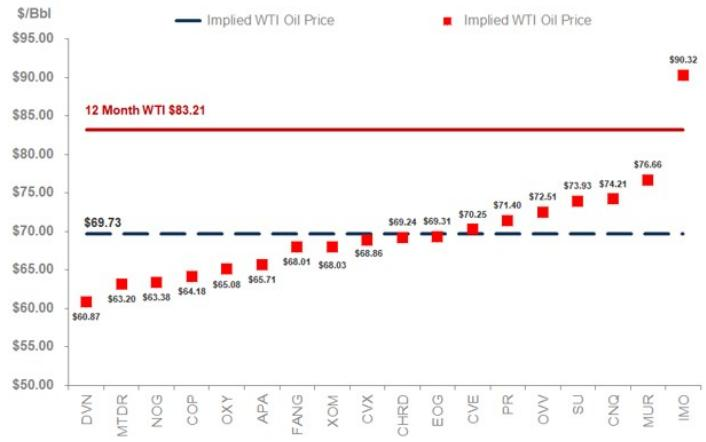

bar_line

| Ticker | Implied WTI Oil Price ($/Bbl) | Implied WTI Oil Price ($/Bbl) |
| :--- | :--- | :--- |
| DVN | 69.73 | 60.87 |
| MTDR | 69.73 | 63.20 |
| NOG | 69.73 | 63.38 |
| COP | 69.73 | 64.18 |
| OXY | 69.73 | 65.08 |
| APA | 69.73 | 65.71 |
| FANG | 69.73 | 68.01 |
| XOM | 69.73 | 68.03 |
| CVX | 69.73 | 68.86 |
| CHRD | 69.73 | 69.24 |
| EOG | 69.73 | 69.31 |
| CVE | 69.73 | 70.25 |
| PR | 69.73 | 71.40 |
| OVV | 69.73 | 72.51 |
| SU | 69.73 | 73.93 |
| CNQ | 69.73 | 74.21 |
| MUR | 69.73 | 76.66 |
| IMO | 69.73 | 90.32 |
12 Month WTI $83.21

Source: Bloomberg, MS. Note: intraday prices as of 5.20.2026.

Exhibit 11: Gas E&Ps reflect a median Henry Hub price of \~\$3.50, \~3% above 12-month future prices   
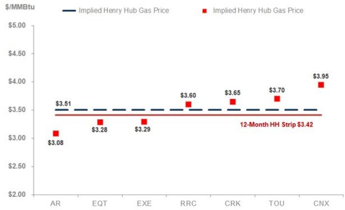

bar_line

| Entity | Implied Henry Hub Gas Price ($/MMBtu) | Implied Henry Hub Gas Price ($/MMBtu) |
| :--- | :--- | :--- |
| AR | 3.51 | 3.08 |
| EQT | 3.51 | 3.28 |
| EXE | 3.51 | 3.29 |
| RRC | 3.51 | 3.60 |
| CRK | 3.51 | 3.65 |
| TOU | 3.51 | 3.70 |
| CNX | 3.51 | 3.95 |
12-Month HH Strip $3.42

Source: Bloomberg, MS. Note: intraday prices as of 5.20.2026.

# Price Target Changes

Exhibit 12: Price Target Changes 

<table><tr><td>Company</td><td>Ticker</td><td>New PT</td><td>Old PT</td><td> $\Delta (\%)$ </td><td>New Rating</td><td>Old Rating</td><td>PT% Upside</td></tr><tr><td colspan="8">US Majors</td></tr><tr><td>Chevron Corp.</td><td>CVX</td><td>214</td><td>212</td><td>1%</td><td>OW</td><td>OW</td><td>12%</td></tr><tr><td>Exxon Mobil Corporation</td><td>XOM</td><td>171</td><td>171</td><td>0%</td><td>OW</td><td>OW</td><td>9%</td></tr><tr><td>Integrateds Median</td><td></td><td></td><td></td><td>0%</td><td></td><td></td><td>11%</td></tr><tr><td colspan="8">Canadian Integrateds (CAD unless noted)</td></tr><tr><td>Canadian Natural Resources Ltd</td><td>CNQ</td><td>67</td><td>66</td><td>2%</td><td>EW</td><td>EW</td><td>(0%)</td></tr><tr><td>Cenovus Energy Inc</td><td>CVE</td><td>43</td><td>41</td><td>5%</td><td>OW</td><td>OW</td><td>3%</td></tr><tr><td>Imperial Oil Ltd</td><td>IMO</td><td>141</td><td>140</td><td>1%</td><td>EW</td><td>EW</td><td>(23%)</td></tr><tr><td>Suncor Energy Inc</td><td>SU</td><td>93</td><td>92</td><td>1%</td><td>EW</td><td>EW</td><td>(0%)</td></tr><tr><td>Canadian Integrateds Median</td><td></td><td></td><td></td><td>1%</td><td></td><td></td><td>(0%)</td></tr><tr><td colspan="8">Oil E&amp;Ps</td></tr><tr><td>APA Corp.</td><td>APA</td><td>44</td><td>43</td><td>2%</td><td>UW</td><td>UW</td><td>12%</td></tr><tr><td>Chord Energy Corp.</td><td>CHRD</td><td>175</td><td>168</td><td>4%</td><td>OW</td><td>OW</td><td>20%</td></tr><tr><td>ConocoPhillips</td><td>COP</td><td>153</td><td>149</td><td>3%</td><td>OW</td><td>OW</td><td>25%</td></tr><tr><td>Devon Energy Corp.</td><td>DVN</td><td>66</td><td>59</td><td>12%</td><td>OW</td><td>OW</td><td>36%</td></tr><tr><td>Diamondback Energy, Inc.</td><td>FANG</td><td>229</td><td>224</td><td>2%</td><td>OW</td><td>OW</td><td>12%</td></tr><tr><td>EOG Resources Inc.</td><td>EOG</td><td>160</td><td>155</td><td>3%</td><td>EW</td><td>EW</td><td>13%</td></tr><tr><td>Matador Resources Co.</td><td>MTDR</td><td>75</td><td>73</td><td>3%</td><td>EW</td><td>EW</td><td>26%</td></tr><tr><td>Murphy Oil Corp.</td><td>MUR</td><td>37</td><td>37</td><td>0%</td><td>UW</td><td>UW</td><td>(5%)</td></tr><tr><td>Northern Oil and Gas, Inc.</td><td>NOG</td><td>29</td><td>28</td><td>4%</td><td>UW</td><td>UW</td><td>20%</td></tr><tr><td>Occidental Petroleum Corp.</td><td>OXY</td><td>74</td><td>73</td><td>1%</td><td>EW</td><td>EW</td><td>26%</td></tr><tr><td>Ovintiv Inc.</td><td>OVV</td><td>68</td><td>68</td><td>0%</td><td>EW</td><td>EW</td><td>14%</td></tr><tr><td>Permian Resources Corp.</td><td>PR</td><td>25</td><td>25</td><td>0%</td><td>OW</td><td>OW</td><td>20%</td></tr><tr><td>Oil E&amp;Ps Median</td><td></td><td></td><td></td><td>3%</td><td></td><td></td><td>20%</td></tr><tr><td colspan="8">Gas E&amp;Ps</td></tr><tr><td>Antero Resources Corp.</td><td>AR</td><td>56</td><td>56</td><td>0%</td><td>OW</td><td>OW</td><td>47%</td></tr><tr><td>CNX Resources Corp.</td><td>CNX</td><td>34</td><td>34</td><td>0%</td><td>UW</td><td>UW</td><td>(7%)</td></tr><tr><td>Comstock Resources Inc.</td><td>CRK</td><td>18</td><td>19</td><td>(5%)</td><td>EW</td><td>EW</td><td>26%</td></tr><tr><td>EQT Corp.</td><td>EQT</td><td>74</td><td>74</td><td>0%</td><td>OW</td><td>OW</td><td>28%</td></tr><tr><td>Expand Energy Corp.</td><td>EXE</td><td>139</td><td>141</td><td>(1%)</td><td>OW</td><td>OW</td><td>41%</td></tr><tr><td>Range Resources Corp.</td><td>RRC</td><td>50</td><td>49</td><td>2%</td><td>EW</td><td>EW</td><td>19%</td></tr><tr><td>Tourmaline Oil Corp.</td><td>TOU</td><td>70</td><td>70</td><td>0%</td><td>EW</td><td>EW</td><td>4%</td></tr><tr><td>Gas E&amp;Ps Median</td><td></td><td></td><td></td><td>0%</td><td></td><td></td><td>22%</td></tr><tr><td colspan="8">Royalties &amp; Minerals</td></tr><tr><td>Viper Energy, Inc.</td><td>VNOM</td><td>49</td><td>49</td><td>0%</td><td>OW</td><td>OW</td><td>3%</td></tr><tr><td>Total Coverage Median</td><td></td><td></td><td></td><td>1%</td><td></td><td></td><td>19%</td></tr></table>

Source: FactSet, MS estimates

Exhibit13: Total Coverage Bull/Bear/Base Upside & Downside   
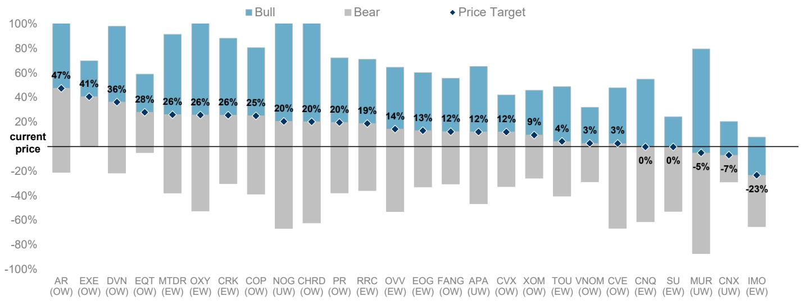

bar_line

| Ticker | Price Target (%) | Bull (%) | Bear (%) |
| :--- | :--- | :--- | :--- |
| AR (OW) | 47 | 50 | -20 |
| EXE (OW) | 41 | 60 | -25 |
| DVN (OW) | 36 | 65 | -25 |
| EQT (OW) | 28 | 55 | -15 |
| MTDR (EW) | 26 | 65 | -35 |
| OXY (EW) | 26 | 75 | -50 |
| CRK (EW) | 26 | 60 | -30 |
| COP (OW) | 25 | 60 | -35 |
| NOG (UW) | 20 | 80 | -65 |
| CHRD (OW) | 20 | 80 | -65 |
| PR (OW) | 20 | 60 | -35 |
| RRC (EW) | 19 | 55 | -35 |
| OVV (EW) | 14 | 60 | -50 |
| EOG (EW) | 13 | 55 | -35 |
| FANG (OW) | 12 | 55 | -35 |
| APA (UW) | 12 | 60 | -45 |
| CVX (OW) | 12 | 40 | -30 |
| XOM (OW) | 9 | 45 | -25 |
| TOU (EW) | 4 | 45 | -35 |
| VNOM (OW) | 3 | 30 | -25 |
| CVE (OW) | 3 | 45 | -65 |
| CNQ (EW) | 0 | 50 | -60 |
| SU (EW) | 0 | 25 | -50 |
| MUR (UW) | -5 | 80 | -85 |
| CNX (UW) | -7 | 20 | -25 |
| IMO (EW) | -23 | 10 | -65 |
Price Target

Source: FactSet, MS estimates

# Price Deck

Exhibit 14: MS Price Deck (Based on 5/20/2026 Strip) 

<table><tr><td>MS Model Assumptions</td><td>2Q26E</td><td>3Q26E</td><td>4Q26E</td><td>2026E</td><td>2027E</td><td>2028E+</td></tr><tr><td>Brent ($/Bbl)</td><td>112.00</td><td>103.12</td><td>92.71</td><td>97.26</td><td>76.05</td><td>75.00</td></tr><tr><td>WTI ($/Bbl)</td><td>100.00</td><td>95.00</td><td>85.00</td><td>88.24</td><td>70.00</td><td>70.00</td></tr><tr><td>Henry Hub ($/MMBtu)</td><td>2.85</td><td>3.20</td><td>3.60</td><td>3.67</td><td>3.80</td><td>3.75</td></tr><tr><td>Mont Belvieu NGL ($/Bbl)</td><td>33.56</td><td>33.70</td><td>32.62</td><td>31.65</td><td>28.26</td><td>28.04</td></tr><tr><td>GC 321 Brent ($/Bbl)</td><td>24.66</td><td>23.20</td><td>20.59</td><td>21.19</td><td>14.20</td><td>14.20</td></tr></table>

<table><tr><td>Prior MS Assumptions</td><td>2Q26E</td><td>3Q26E</td><td>4Q26E</td><td>2026E</td><td>2027E</td><td>2028E+</td></tr><tr><td>Brent ($/Bbl)</td><td>98.93</td><td>86.30</td><td>82.11</td><td>87.10</td><td>76.05</td><td>75.00</td></tr><tr><td>WTI ($/Bbl)</td><td>88.04</td><td>80.57</td><td>76.15</td><td>79.39</td><td>70.00</td><td>70.00</td></tr><tr><td>Henry Hub ($/MMBtu)</td><td>3.00</td><td>3.40</td><td>4.00</td><td>3.86</td><td>3.80</td><td>3.75</td></tr><tr><td>Mont Belvieu NGL ($/Bbl)</td><td>33.89</td><td>32.04</td><td>31.59</td><td>31.06</td><td>28.26</td><td>28.04</td></tr><tr><td>GC 321 Brent ($/Bbl)</td><td>24.66</td><td>23.20</td><td>20.59</td><td>21.19</td><td>14.20</td><td>14.20</td></tr></table>

<table><tr><td>% Change</td><td>2Q26E</td><td>3Q26E</td><td>4Q26E</td><td>2026E</td><td>2027E</td><td>2028E+</td></tr><tr><td>Brent ($/Bbl)</td><td>13%</td><td>19%</td><td>13%</td><td>12%</td><td>0%</td><td>0%</td></tr><tr><td>WTI ($/Bbl)</td><td>14%</td><td>18%</td><td>12%</td><td>11%</td><td>0%</td><td>0%</td></tr><tr><td>Henry Hub ($/MMBtu)</td><td>-5%</td><td>-6%</td><td>-10%</td><td>-5%</td><td>0%</td><td>0%</td></tr><tr><td>Mont Belvieu NGL ($/Bbl)</td><td>-1%</td><td>5%</td><td>3%</td><td>2%</td><td>0%</td><td>0%</td></tr><tr><td>GC 321 Brent ($/Bbl)</td><td>0%</td><td>0%</td><td>0%</td><td>0%</td><td>0%</td><td>0%</td></tr></table>

Source: Bloomberg, FactSet, MS estimates

# Estimate Revisions

# APA

- Our 2Q oil production estimate moves to 212 kb/d from 219 kb/d (guidance: 212 kb/d), while total volumes fall to 406 kboe/d from 443 kboe/d (guidance: 405 kboe/d), aligning with new guidance that includes \~35 kboe/d of US curtailments.   
- FY26 adjusted oil and total production are roughly unchanged (+1% on average vs MSe prior), as we had already assumed lower Egypt volumes due to PSC impacts from higher prices. FY26 capex remains \~\$2.1 B.   
- Before any changes to benchmark prices in our price deck, our 2026 FCF estimate decreases by \~10% to just over \$2.1 B on higher 2026 cash tax guidance. Including the latest strip, our FCF increases to \$2.6 B, +10% vs our prior estimate.   
- For 2027, reported oil production moves 2% lower versus our prior estimate, reflecting sequential declines in Egypt oil volumes from 2Q26 levels. FY27 capex is now \~\$2.18 B (-4% vs MSe prior), as we assume US spending stays around \$1.3 B (vs \~\$1.39 B prior), flattish with 2026 levels.   
- Model changes decrease our PT by \$1 to \$42/sh. Including the latest oil deck, our PT moves to \$44.

Exhibit 15: APA Estimate Revisions 

<table><tr><td colspan="20">Estimate Revisions: APA Corp. (APA)</td></tr><tr><td rowspan="2">APA (UW,PT $44)</td><td colspan="5">2Q26E</td><td colspan="5">3Q26E</td><td colspan="5">2026E</td><td colspan="4">2027E</td></tr><tr><td>Prior</td><td>New</td><td>% Change</td><td>Cons.</td><td>New vs. Cons</td><td>Prior</td><td>New</td><td>% Change</td><td>Cons.</td><td>New vs. Cons</td><td>Prior</td><td>New</td><td>% Change</td><td>Cons.</td><td>New vs. Cons</td><td>Prior</td><td>New</td><td>% Change</td><td>Cons.</td></tr><tr><td>Production</td><td></td><td></td><td></td><td></td><td></td><td></td><td></td><td></td><td></td><td></td><td></td><td></td><td></td><td></td><td></td><td></td><td></td><td></td><td></td></tr><tr><td>Oil (kb/d)</td><td>219</td><td>212</td><td>-3%</td><td>215</td><td>-1%</td><td>213</td><td>217</td><td>2%</td><td>216.69</td><td>0%</td><td>217</td><td>219</td><td>1%</td><td>221</td><td>-1%</td><td>213</td><td>209</td><td>-2%</td><td>218</td></tr><tr><td>Gas (MMcf/d)</td><td>904</td><td>755</td><td>-16%</td><td>798</td><td>-5%</td><td>863</td><td>854</td><td>-1%</td><td>873</td><td>-2%</td><td>861</td><td>824</td><td>-4%</td><td>845</td><td>-3%</td><td>895</td><td>871</td><td>-3%</td><td>908</td></tr><tr><td>Total (kboe/d)</td><td>443</td><td>406</td><td>-8%</td><td>421</td><td>-4%</td><td>429</td><td>436</td><td>2%</td><td>438</td><td>0%</td><td>432</td><td>430</td><td>0%</td><td>435</td><td>-1%</td><td>436</td><td>432</td><td>-1%</td><td>441</td></tr><tr><td>Regional Production</td><td></td><td></td><td></td><td></td><td></td><td></td><td></td><td></td><td></td><td></td><td></td><td></td><td></td><td></td><td></td><td></td><td></td><td></td><td></td></tr><tr><td>US (kboe/d)</td><td>277</td><td>254</td><td>-8%</td><td></td><td></td><td>270</td><td>281</td><td>4%</td><td></td><td></td><td>267</td><td>270</td><td>1%</td><td></td><td></td><td>275</td><td>280</td><td>2%</td><td></td></tr><tr><td>North Sea (kboe/d)</td><td>25</td><td>21</td><td>-14%</td><td></td><td></td><td>22</td><td>24</td><td>7%</td><td></td><td></td><td>24</td><td>24</td><td>2%</td><td></td><td></td><td>20</td><td>20</td><td>2%</td><td></td></tr><tr><td>Egypt (kboe/d)</td><td>141</td><td>130</td><td>-8%</td><td></td><td></td><td>137</td><td>131</td><td>-4%</td><td></td><td></td><td>141</td><td>136</td><td>-3%</td><td></td><td></td><td>141</td><td>132</td><td>-7%</td><td></td></tr><tr><td>EBITDAX ($MM)</td><td>1,894</td><td>1,958</td><td>3%</td><td>1,818</td><td>8%</td><td>1,632</td><td>1,806</td><td>11%</td><td>1,565</td><td>15%</td><td>6,483</td><td>6,927</td><td>7%</td><td>6,259</td><td>11%</td><td>5,281</td><td>4,919</td><td>-7%</td><td>5,274</td></tr><tr><td>EPS ($)</td><td>2.07</td><td>2.22</td><td>7%</td><td>2.01</td><td>11%</td><td>1.67</td><td>1.84</td><td>10%</td><td>1.50</td><td>23%</td><td>6.26</td><td>6.83</td><td>9%</td><td>5.92</td><td>15%</td><td>4.11</td><td>3.34</td><td>-19%</td><td>4.18</td></tr><tr><td>CFPS ($)</td><td>4.48</td><td>4.42</td><td>-1%</td><td>4.19</td><td>5%</td><td>4.07</td><td>4.16</td><td>2%</td><td>3.58</td><td>16%</td><td>15.82</td><td>15.71</td><td>-1%</td><td>14.39</td><td>9%</td><td>13.54</td><td>11.99</td><td>-11%</td><td>12.35</td></tr><tr><td>Capex ($MM)</td><td>517</td><td>576</td><td>11%</td><td>554</td><td>4%</td><td>556</td><td>500</td><td>-10%</td><td>522</td><td>-4%</td><td>2,114</td><td>2,107</td><td>0%</td><td>2,158</td><td>-2%</td><td>2,261</td><td>2,177</td><td>-4%</td><td>2,231</td></tr><tr><td>FCF ($MM)</td><td>796</td><td>781</td><td>-2%</td><td>711</td><td>10%</td><td>587</td><td>749</td><td>28%</td><td>594</td><td>26%</td><td>2,355</td><td>2,602</td><td>10%</td><td>2,561</td><td>2%</td><td>1,255</td><td>1,193</td><td>-5%</td><td>1,816</td></tr></table>

Source: FactSet, MS estimates

# AR

- AR held its 2026 production guidance flat at 4.1 Bcfe with cadence unchanged (4.1 Bcfe in 2Q and 4.2 Bcfe average production in 2H26). Management maintains flexibility to grow volumes to \~4.5 Bcfe in 2027.   
- Capex is similarly unchanged and AR expects \$1 B of D&C spend with \$100 MM of land spend. We continue to model execution on AR's growth plan (adding \~\$200 MM of D&C above guidance) as the company discussed its plans to drill DUCs and make a decision on completion later this year. We assume \$60 - 80 MM of drilling costs split between 2Q and 3Q with the remainder of completion spend in 4Q, although this could be deferred to 2027 if conditions warrant.

Exhibit 16: AR Estimate Revisions 

<table><tr><td colspan="20">Estimate Revisions: Antero Resources Corp. (AR)</td></tr><tr><td rowspan="2">AR (OW,PT $56)</td><td colspan="5">2Q26E</td><td colspan="5">3Q26E</td><td colspan="5">2026E</td><td colspan="4">2027E</td></tr><tr><td>Prior</td><td>New</td><td>% Change</td><td>Cons.</td><td>New vs. Cons</td><td>Prior</td><td>New</td><td>% Change</td><td>Cons.</td><td>New vs. Cons</td><td>Prior</td><td>New</td><td>% Change</td><td>Cons.</td><td>New vs. Cons</td><td>Prior</td><td>New</td><td>% Change</td><td>Cons.</td></tr><tr><td>Production</td><td></td><td></td><td></td><td></td><td></td><td></td><td></td><td></td><td></td><td></td><td></td><td></td><td></td><td></td><td></td><td></td><td></td><td></td><td></td></tr><tr><td>Gas (MMcf/d)</td><td>2842</td><td>2,838</td><td>0%</td><td>2,844</td><td>-0.2%</td><td>2,852</td><td>2,826</td><td>-1%</td><td>2,903</td><td>-2.7%</td><td>2,782</td><td>2,775</td><td>0%</td><td>2,825</td><td>-1.7%</td><td>2,933</td><td>2,914</td><td>-1%</td><td>3,062</td></tr><tr><td>NGL (kb/d)</td><td>201</td><td>203</td><td>1%</td><td>206</td><td>-1.6%</td><td>220</td><td>222</td><td>1%</td><td>208</td><td>6.3%</td><td>211</td><td>212</td><td>1%</td><td>206</td><td>3.1%</td><td>248</td><td>249</td><td>0%</td><td>217</td></tr><tr><td>Oil (kb/d)</td><td>10</td><td>10</td><td>7%</td><td>9</td><td>18.6%</td><td>11</td><td>11</td><td>6%</td><td>9</td><td>30.4%</td><td>10</td><td>11</td><td>6%</td><td>9</td><td>22.1%</td><td>14</td><td>14</td><td>5%</td><td>10</td></tr><tr><td>Total (MMcfe/d)</td><td>4,106</td><td>4,114</td><td>0%</td><td>4,132</td><td>-0.4%</td><td>4,238</td><td>4,224</td><td>0%</td><td>4,206</td><td>0.4%</td><td>4,106</td><td>4,113</td><td>0%</td><td>4,115</td><td>-0.1%</td><td>4,503</td><td>4,495</td><td>0%</td><td>4,416</td></tr><tr><td>EBITDAX ($MM)</td><td>630</td><td>594</td><td>-6%</td><td>628</td><td>-5%</td><td>738</td><td>749</td><td>1%</td><td>696</td><td>8%</td><td>2,959</td><td>2,873</td><td>-3%</td><td>2,839</td><td>1%</td><td>3,286</td><td>3,299</td><td>0%</td><td>2,986</td></tr><tr><td>EPS ($)</td><td>0.87</td><td>0.77</td><td>-12%</td><td>0.89</td><td>-14%</td><td>1.14</td><td>1.13</td><td>0%</td><td>1.05</td><td>8%</td><td>4.69</td><td>4.33</td><td>-8%</td><td>4.41</td><td>-2%</td><td>5.43</td><td>5.28</td><td>-3%</td><td>4.73</td></tr><tr><td>CFPS ($)</td><td>2.03</td><td>1.75</td><td>-14%</td><td>1.85</td><td>-5%</td><td>2.34</td><td>2.24</td><td>-4%</td><td>2.09</td><td>8%</td><td>9.30</td><td>9.22</td><td>-1%</td><td>8.52</td><td>8%</td><td>10.66</td><td>10.20</td><td>-4%</td><td>9.19</td></tr><tr><td>Capex</td><td></td><td></td><td></td><td></td><td></td><td></td><td></td><td></td><td></td><td></td><td></td><td></td><td></td><td></td><td></td><td></td><td></td><td></td><td></td></tr><tr><td>D&amp;C Capex ($MM)</td><td>316</td><td>316</td><td>0%</td><td></td><td></td><td>281</td><td>281</td><td>0%</td><td></td><td></td><td>1,177</td><td>1,185</td><td>1%</td><td></td><td></td><td>1,186</td><td>1,186</td><td>0%</td><td></td></tr><tr><td>Land Capex ($MM)</td><td>25</td><td>25</td><td>0%</td><td></td><td></td><td>25</td><td>25</td><td>0%</td><td></td><td></td><td>100</td><td>100</td><td>0%</td><td></td><td></td><td>100</td><td>100</td><td>0%</td><td></td></tr><tr><td>Total ($MM)</td><td>341</td><td>341</td><td>0%</td><td>287</td><td>19%</td><td>306</td><td>306</td><td>0%</td><td>319</td><td>-4%</td><td>1,277</td><td>1,285</td><td>1%</td><td>1154</td><td>11%</td><td>1,286</td><td>1,286</td><td>0%</td><td>1218</td></tr><tr><td>FCF ($MM)</td><td>279</td><td>205</td><td>-26%</td><td>267</td><td>-23%</td><td>400</td><td>395</td><td>-1%</td><td>300</td><td>32%</td><td>1,548</td><td>1,589</td><td>3%</td><td>1,523</td><td>4%</td><td>1,795</td><td>1,788</td><td>0%</td><td>1,747</td></tr></table>

Source: FactSet, MS estimates

# CHRD

- To align with the 2Q guide, our oil production increases from 155 kb/d to 164 kb/d (guidance 162.5 - 165.5 kb/d), while capex is rising +8% to \$426 MM (guidance \$410 - \$440 MM). We forecast 3Q oil volumes to hold roughly flat with 2Q (3Q MSe 165 kb/d vs 167 kb/d prior) before declining in 4Q (MSe unchanged at 159 kb/d), with capex stepping down sequentially throughout 2H26. The 2H26 production and capex cadence is in line with company expectations.   
- CHRD raised FY26 production guidance by 2 kb/d to 160 - 162 kb/d (new MSe of 161.5 kb/d vs 158 kb/d prior) while maintaining capex midpoint at \$1.4 B, reflecting strong 1Q execution, base-production optimization, and faster cycle times.   
- Before any changes to benchmark prices in our price deck, our forecasted 2026 FCF is rising \~13% to \~\$1.45 B driven by higher oil volumes and stronger oil realizations, as CHRD raised FY26 guidance for WTI premium to $(0.50) - \$0.50$ from $(1.50) - (2.50)$ . Including the latest strip, our FCF increases to \~\$1.7 B.   
- In 2027, we forecast flat y/y oil production of 162 kb/d (MSe prior 159 kb/d), with capex near the 2026 level of \~\$1.4 B (+3% vs MSe prior).   
- PT increases from \$168/sh to \$175/sh, reflecting our updated oil price deck.

Exhibit 17: CHRD Estimate Revisions 

<table><tr><td colspan="20">Estimate Revisions: Chord Energy Corp. (CHRD)</td></tr><tr><td rowspan="2">CHRD (OW,PT $175)</td><td colspan="5">2Q26E</td><td colspan="5">3Q26E</td><td colspan="5">2026E</td><td colspan="4">2027E</td></tr><tr><td>Prior</td><td>New</td><td>% Change</td><td>Cons.</td><td>New vs. Cons</td><td>Prior</td><td>New</td><td>% Change</td><td>Cons.</td><td>New vs. Cons</td><td>Prior</td><td>New</td><td>% Change</td><td>Cons.</td><td>New vs. Cons</td><td>Prior</td><td>New</td><td>% Change</td><td>Cons.</td></tr><tr><td>Production</td><td></td><td></td><td></td><td></td><td></td><td></td><td></td><td></td><td></td><td></td><td></td><td></td><td></td><td></td><td></td><td></td><td></td><td></td><td></td></tr><tr><td>Oil (kb/d)</td><td>155</td><td>164</td><td>6%</td><td>163</td><td>0.9%</td><td>167</td><td>165</td><td>-1%</td><td>164</td><td>0.6%</td><td>158</td><td>162</td><td>2%</td><td>161</td><td>0.3%</td><td>159</td><td>162</td><td>1%</td><td>161</td></tr><tr><td>Gas (MMcf/d)</td><td>400</td><td>410</td><td>3%</td><td>408</td><td>0.6%</td><td>418</td><td>409</td><td>-2%</td><td>409</td><td>0.1%</td><td>409</td><td>408</td><td>0%</td><td>409</td><td>-0.1%</td><td>428</td><td>405</td><td>-5%</td><td>417</td></tr><tr><td>Total (kboe/d)</td><td>274</td><td>282</td><td>3%</td><td>282</td><td>-0.2%</td><td>290</td><td>282</td><td>-3%</td><td>283</td><td>-0.4%</td><td>279</td><td>278</td><td>-1%</td><td>280</td><td>-0.7%</td><td>285</td><td>276</td><td>-3%</td><td>281</td></tr><tr><td>EBITDAX ($MM)</td><td>815</td><td>1,011</td><td>24%</td><td>805</td><td>26%</td><td>793</td><td>974</td><td>23%</td><td>814</td><td>20%</td><td>2,976</td><td>3,529</td><td>19%</td><td>3,110</td><td>13%</td><td>2,607</td><td>2,617</td><td>0%</td><td>2,763</td></tr><tr><td>EPS ($)</td><td>5.63</td><td>8.27</td><td>47%</td><td>6.11</td><td>35%</td><td>4.95</td><td>7.71</td><td>56%</td><td>5.38</td><td>43%</td><td>18.35</td><td>26.90</td><td>47%</td><td>20.21</td><td>33%</td><td>15.53</td><td>16.96</td><td>9%</td><td>16.11</td></tr><tr><td>CFPS ($)</td><td>12.88</td><td>15.92</td><td>24%</td><td>14.26</td><td>12%</td><td>12.97</td><td>15.47</td><td>19%</td><td>13.48</td><td>15%</td><td>49.29</td><td>57.61</td><td>17%</td><td>51.37</td><td>12%</td><td>47.29</td><td>49.77</td><td>5%</td><td>47.21</td></tr><tr><td>Capex ($MM)</td><td>395</td><td>426</td><td>8%</td><td>415</td><td>3%</td><td>388</td><td>372</td><td>-4%</td><td>363</td><td>3%</td><td>1,401</td><td>1,401</td><td>0%</td><td>1,404</td><td>0%</td><td>1,358</td><td>1,402</td><td>3%</td><td>1,405</td></tr><tr><td>FCF ($MM)</td><td>323</td><td>465</td><td>44%</td><td>343</td><td>35%</td><td>324</td><td>484</td><td>50%</td><td>373</td><td>30%</td><td>1,286</td><td>1,749</td><td>36%</td><td>1,437</td><td>22%</td><td>975</td><td>1,019</td><td>4%</td><td>1,156</td></tr></table>

Source: FactSet, MS estimates

# CNQ

\- Our FY26 total production and capex estimates are roughly unchanged and in line with guidance of 1,615-1,665 kboe/d and C\$6,115 MM (ex-Peace River acquisition

cost).

\- Before our increase to 2026 oil price assumptions, our '26 EPS moved down 9% reflecting 1Q26 earnings coming in \~35% below our estimates due to large non-operating expenses (share-based compensation and unrealized losses on FX and risk management).

Exhibit 18: CNQ Estimate Revisions 

<table><tr><td colspan="20">Estimate Revisions: Canadian Natural Resources Ltd (CNQ)</td><td></td></tr><tr><td rowspan="2">CNQ (EW,PT $67)</td><td colspan="5">2Q26E</td><td colspan="5">3Q26E</td><td colspan="5">2026E</td><td colspan="5">2027E</td></tr><tr><td>Prior</td><td>New</td><td>% Change</td><td>Cons.</td><td>New vs. Cons</td><td>Prior</td><td>New</td><td>% Change</td><td>Cons.</td><td>New vs. Cons</td><td>Prior</td><td>New</td><td>% Change</td><td>Cons.</td><td>New vs. Cons</td><td>Prior</td><td>New</td><td>% Change</td><td>Cons.</td><td>New vs. Cons</td></tr><tr><td>Production</td><td></td><td></td><td></td><td></td><td></td><td></td><td></td><td></td><td></td><td></td><td></td><td></td><td></td><td></td><td></td><td></td><td></td><td></td><td></td><td></td></tr><tr><td>Liquids (kb/d)</td><td>1,225</td><td>1,242</td><td>1%</td><td>1,202</td><td>3.3%</td><td>1,162</td><td>1,161</td><td>0%</td><td>1,162</td><td>-0.1%</td><td>1207</td><td>1,209</td><td>0%</td><td>1,200</td><td>0.7%</td><td>1244</td><td>1,246</td><td>0%</td><td>1,223</td><td>1.9%</td></tr><tr><td>Gas (MMcf/d)</td><td>2,618</td><td>2,649</td><td>1%</td><td>2,591</td><td>2.3%</td><td>2,570</td><td>2,594</td><td>1%</td><td>2,589</td><td>0.2%</td><td>2,587</td><td>2,614</td><td>1%</td><td>2,611</td><td>0.1%</td><td>2,608</td><td>2,626</td><td>1%</td><td>2,656</td><td>-1.2%</td></tr><tr><td>Total (kboe/d)</td><td>1,662</td><td>1,683</td><td>1%</td><td>1,644</td><td>2.4%</td><td>1,590</td><td>1,593</td><td>0%</td><td>1,603</td><td>-0.6%</td><td>1638</td><td>1,645</td><td>0%</td><td>1,623</td><td>1.3%</td><td>1678</td><td>1,684</td><td>0%</td><td>1,653</td><td>1.9%</td></tr><tr><td>EBITDAX ($MM)</td><td>6,708</td><td>7,513</td><td>12%</td><td>7,458</td><td>1%</td><td>5,648</td><td>6,765</td><td>20%</td><td>6,153</td><td>10%</td><td>22,989</td><td>24,420</td><td>6%</td><td>24,351</td><td>0%</td><td>21,175</td><td>21,091</td><td>0%</td><td>21,698</td><td>-3%</td></tr><tr><td>EPS ($)</td><td>1.65</td><td>1.93</td><td>17%</td><td>1.92</td><td>0%</td><td>1.35</td><td>1.77</td><td>31%</td><td>1.51</td><td>17%</td><td>5.29</td><td>5.80</td><td>10%</td><td>6.13</td><td>-5%</td><td>4.76</td><td>4.72</td><td>-1%</td><td>4.96</td><td>-5%</td></tr><tr><td>CFPS ($)</td><td>2.64</td><td>2.93</td><td>11%</td><td>2.89</td><td>1%</td><td>2.32</td><td>2.73</td><td>18%</td><td>2.44</td><td>12%</td><td>9.24</td><td>10.25</td><td>11%</td><td>9.79</td><td>5%</td><td>8.89</td><td>8.84</td><td>-1%</td><td>9.22</td><td>-4%</td></tr><tr><td>Capex ($MM)</td><td>1,473</td><td>1,549</td><td>5%</td><td>1,701</td><td>-9%</td><td>1,827</td><td>1,877</td><td>3%</td><td>1,600</td><td>17%</td><td>6,110</td><td>6,141</td><td>1%</td><td>6,524</td><td>-6%</td><td>5,807</td><td>5,737</td><td>-1%</td><td>6,349</td><td>-10%</td></tr><tr><td>FCF ($MM)</td><td>3,997</td><td>4,536</td><td>13%</td><td>3,295</td><td>38%</td><td>2,924</td><td>3,722</td><td>27%</td><td>2,712</td><td>37%</td><td>12,897</td><td>14,998</td><td>16%</td><td>11,615</td><td>29%</td><td>11,847</td><td>11,790</td><td>0%</td><td>10,242</td><td>15%</td></tr></table>

Source: FactSet, MS estimates

# CNX

- CNX maintained its 2026 production range of 605 - 620 Bcfe as it continues to execute on its maintenance production plan. Management expects production to be roughly ratable from quarter-to-quarter this year.   
- Capex guidance was unchanged with 1Q results at \$556 - 586 MM and management continues to expect spending weighted towards 1H.   
- On the call, management discussed opportunities in the Utica and expects to continue developing this program. Current messaging suggests a more fulsome update on the play towards year-end. CNX sees a constructive picture for longer-term in-basin demand growth and is participating in RFPs (request for proposals) for gas supply.

Exhibit 19: CNX Estimate Revisions 

<table><tr><td colspan="20">Estimate Revisions: CNX Resources Corp. (CNX)</td><td></td></tr><tr><td rowspan="2">CNX (UW,PT $34)</td><td colspan="5">2Q26E</td><td colspan="5">3Q26E</td><td colspan="5">2026E</td><td colspan="5">2027E</td></tr><tr><td>Prior</td><td>New</td><td>% Change</td><td>Cons.</td><td>New vs. Cons</td><td>Prior</td><td>New</td><td>% Change</td><td>Cons.</td><td>New vs. Cons</td><td>Prior</td><td>New</td><td>% Change</td><td>Cons.</td><td>New vs. Cons</td><td>Prior</td><td>New</td><td>% Change</td><td>Cons.</td><td>New vs. Cons</td></tr><tr><td>Production</td><td></td><td></td><td></td><td></td><td></td><td></td><td></td><td></td><td></td><td></td><td></td><td></td><td></td><td></td><td></td><td></td><td></td><td></td><td></td><td></td></tr><tr><td>Gas (Mmcfe/d)</td><td>1,559</td><td>1,556</td><td>0%</td><td>1,546</td><td>0.7%</td><td>1,547</td><td>1,536</td><td>-1%</td><td>1,542</td><td>-0.3%</td><td>1,546</td><td>1,538</td><td>-1%</td><td>1,537</td><td>0.0%</td><td>1,627</td><td>1,560</td><td>-4%</td><td>1,546</td><td>0.9%</td></tr><tr><td>NGLs (kb/d)</td><td>22</td><td>23</td><td>4%</td><td>22</td><td>6.4%</td><td>21</td><td>22</td><td>4%</td><td>21</td><td>5.2%</td><td>22</td><td>23</td><td>4%</td><td>21</td><td>5.1%</td><td>18</td><td>19</td><td>4%</td><td>19</td><td>0.0%</td></tr><tr><td>Oil (kb/d)</td><td>1</td><td>1</td><td>1%</td><td>1</td><td>16.5%</td><td>1</td><td>1</td><td>2%</td><td>1</td><td>21.3%</td><td>1</td><td>1</td><td>1%</td><td>1</td><td>2.9%</td><td>1</td><td>1</td><td>-4%</td><td>0</td><td>50.2%</td></tr><tr><td>Total (Mmcfe/d)</td><td>1,695</td><td>1,698</td><td>0%</td><td>1,695</td><td>0.2%</td><td>1,677</td><td>1,672</td><td>0%</td><td>1,686</td><td>-0.8%</td><td>1,680</td><td>1,677</td><td>0%</td><td>1,684</td><td>-0.4%</td><td>1,741</td><td>1,679</td><td>-4%</td><td>1,678</td><td>0.0%</td></tr><tr><td>EBITDAX ($MM)</td><td>272</td><td>263</td><td>-3%</td><td>301</td><td>-13%</td><td>275</td><td>272</td><td>-1%</td><td>297</td><td>-8%</td><td>1,246</td><td>1,226</td><td>-2%</td><td>1,315</td><td>-7%</td><td>1,570</td><td>1,456</td><td>-7%</td><td>1,505</td><td>-3%</td></tr><tr><td>EPS ($)</td><td>0.33</td><td>0.20</td><td>-39%</td><td>0.58</td><td>-66%</td><td>0.35</td><td>0.24</td><td>-32%</td><td>0.59</td><td>-60%</td><td>2.11</td><td>1.97</td><td>-7%</td><td>3.11</td><td>-37%</td><td>3.87</td><td>2.99</td><td>-23%</td><td>4.19</td><td>-28%</td></tr><tr><td>CFPS ($)</td><td>1.35</td><td>1.16</td><td>-14%</td><td>1.73</td><td>-33%</td><td>1.38</td><td>1.18</td><td>-15%</td><td>1.75</td><td>-33%</td><td>6.47</td><td>5.40</td><td>-17%</td><td>7.25</td><td>-25%</td><td>8.43</td><td>7.36</td><td>-13%</td><td>9.12</td><td>-19%</td></tr><tr><td>Capex ($MM)</td><td>164</td><td>141</td><td>-14%</td><td>166</td><td>-15%</td><td>117</td><td>129</td><td>10%</td><td>121</td><td>7%</td><td>568</td><td>569</td><td>0%</td><td>568</td><td>0%</td><td>630</td><td>569</td><td>-10%</td><td>587</td><td>-3%</td></tr><tr><td>FCF ($MM)</td><td>49</td><td>51</td><td>4%</td><td>91</td><td>-44%</td><td>98</td><td>71</td><td>-28%</td><td>133</td><td>-47%</td><td>447</td><td>324</td><td>-28%</td><td>521</td><td>-38%</td><td>615</td><td>614</td><td>0%</td><td>768</td><td>-20%</td></tr></table>

Source: FactSet, MS estimates

# COP

- We previously published estimate revisions on 5/1 for the 1Q earnings release (see here):   
- Increased FY26 capex by \~\$260 MM to the midpoint of COP's revised guidance range of \$12.0-\$12.5 B (from \$12 B prior) due to higher Permian activity.

• Decreased 2Q total production by 2% to 2,221 kboe/d mostly driven by 24 kboe/d less volumes from Qatar as COP excluded all volumes from the country (80 kboe/d implied run rate) from quarterly guidance (2,185-2,215 kboe/d). Our FY26 estimate is unchanged and in line with COP's revised guidance range of 2,295-2,325 kboe/d.

Exhibit 20: COP Estimate Revisions (prior refers to pre-earnings estimates) 

<table><tr><td colspan="20">Estimate Revisions: ConocoPhillips (COP)</td><td></td></tr><tr><td rowspan="2">COP (OW,PT $153)</td><td colspan="5">2Q26E</td><td colspan="5">3Q26E</td><td colspan="5">2026E</td><td colspan="5">2027E</td></tr><tr><td>Prior</td><td>New</td><td>% Change</td><td>Cons.</td><td>New vs. Cons</td><td>Prior</td><td>New</td><td>% Change</td><td>Cons.</td><td>New vs. Cons</td><td>Prior</td><td>New</td><td>% Change</td><td>Cons.</td><td>New vs. Cons</td><td>Prior</td><td>New</td><td>% Change</td><td>Cons.</td><td>New vs. Cons</td></tr><tr><td>Production</td><td></td><td></td><td></td><td></td><td></td><td></td><td></td><td></td><td></td><td></td><td></td><td></td><td></td><td></td><td></td><td></td><td></td><td></td><td></td><td></td></tr><tr><td>Oil (kb/d)</td><td>1,237</td><td>1,194</td><td>-3%</td><td>1,187</td><td>0.6%</td><td>1,225</td><td>1,207</td><td>-1%</td><td>1,207</td><td>0.0%</td><td>1239</td><td>1,223</td><td>-1%</td><td>1,205</td><td>1.5%</td><td>1267</td><td>1,264</td><td>0%</td><td>1,243</td><td>1.7%</td></tr><tr><td>Gas (MMcf/d)</td><td>3,727</td><td>3,698</td><td>-1%</td><td>3,633</td><td>1.8%</td><td>4,077</td><td>4,138</td><td>2%</td><td>4,061</td><td>1.9%</td><td>3,946</td><td>3,981</td><td>1%</td><td>3,948</td><td>0.8%</td><td>4,174</td><td>4,229</td><td>1%</td><td>4,285</td><td>-1.3%</td></tr><tr><td>Total (kboe/d)</td><td>2,274</td><td>2,221</td><td>-2%</td><td>2,233</td><td>-0.5%</td><td>2,320</td><td>2,311</td><td>0%</td><td>2,334</td><td>-1.0%</td><td>2312</td><td>2,302</td><td>0%</td><td>2,309</td><td>-0.3%</td><td>2385</td><td>2,394</td><td>0%</td><td>2,414</td><td>-0.9%</td></tr><tr><td>Regional Production</td><td></td><td></td><td></td><td></td><td></td><td></td><td></td><td></td><td></td><td></td><td></td><td></td><td></td><td></td><td></td><td></td><td></td><td></td><td></td><td></td></tr><tr><td>US (kboe/d)</td><td>1,668</td><td>1,657</td><td>-1%</td><td></td><td></td><td>1,668</td><td>1,657</td><td>-1%</td><td></td><td></td><td>1,669</td><td>1,669</td><td>0%</td><td></td><td></td><td>1,707</td><td>1,707</td><td>0%</td><td></td><td></td></tr><tr><td>International (kboe/d)</td><td>606</td><td>564</td><td>-7%</td><td></td><td></td><td>651</td><td>654</td><td>0%</td><td></td><td></td><td>643</td><td>633</td><td>-2%</td><td></td><td></td><td>678</td><td>686</td><td>1%</td><td></td><td></td></tr><tr><td>EBITDAX ($MM)</td><td>8,939</td><td>9,739</td><td>9%</td><td>8,592</td><td>13%</td><td>8,640</td><td>10,141</td><td>17%</td><td>8,204</td><td>24%</td><td>32,602</td><td>35,944</td><td>10%</td><td>31,218</td><td>15%</td><td>30,325</td><td>30,702</td><td>1%</td><td>29,234</td><td>5%</td></tr><tr><td>EPS ($)</td><td>3.09</td><td>3.55</td><td>15%</td><td>2.82</td><td>26%</td><td>2.95</td><td>3.80</td><td>29%</td><td>2.57</td><td>48%</td><td>10.37</td><td>12.46</td><td>20%</td><td>9.75</td><td>28%</td><td>9.68</td><td>9.81</td><td>1%</td><td>8.84</td><td>11%</td></tr><tr><td>CFPS ($)</td><td>5.74</td><td>6.30</td><td>10%</td><td>5.54</td><td>14%</td><td>5.70</td><td>6.51</td><td>14%</td><td>5.35</td><td>22%</td><td>21.25</td><td>23.39</td><td>10%</td><td>20.35</td><td>15%</td><td>21.33</td><td>21.67</td><td>2%</td><td>20.26</td><td>7%</td></tr><tr><td>Capex ($MM)</td><td>2,966</td><td>2,964</td><td>0%</td><td>3,029</td><td>-2%</td><td>2,920</td><td>3,138</td><td>7%</td><td>3,067</td><td>2%</td><td>11,959</td><td>12,217</td><td>2%</td><td>12,168</td><td>0%</td><td>12,027</td><td>12,038</td><td>0%</td><td>12,149</td><td>-1%</td></tr><tr><td>FCF ($MM)</td><td>3,947</td><td>4,666</td><td>18%</td><td>3,544</td><td>32%</td><td>3,855</td><td>4,628</td><td>20%</td><td>3,296</td><td>40%</td><td>13,471</td><td>15,871</td><td>18%</td><td>12,211</td><td>30%</td><td>12,444</td><td>12,667</td><td>2%</td><td>11,779</td><td>8%</td></tr></table>

Source: FactSet, MS estimates

# CRK

- Despite soft 1Q results, CRK maintained production guidance for 1,250 - 1,400 MMcfe/d of volume this year. We continue to model the company returning to 1H24 levels by 4Q (\~1.5 Bcfe/d) with a ramp throughout 2026, but are in the lower half of the full-year production range.   
- Capex guidance for \$1,400 - 1,500 MM was unchanged with 1Q earnings and CRK continues to expect 5 rigs in the Legacy Haynesville and 4 in the Western Haynesville.   
- PT from \$19/sh to \$18/sh, reflecting our updated gas price deck.

Exhibit 21: CRK Estimate Revisions 

<table><tr><td colspan="20">Estimate Revisions: Comstock Resources Inc. (CRK)</td><td></td></tr><tr><td rowspan="2">CRK (EW,PT $18)</td><td colspan="5">2Q26E</td><td colspan="5">3Q26E</td><td colspan="5">2026E</td><td colspan="5">2027E</td></tr><tr><td>Prior</td><td>New</td><td>% Change</td><td>Cons.</td><td>New vs. Cons</td><td>Prior</td><td>New</td><td>% Change</td><td>Cons.</td><td>New vs. Cons</td><td>Prior</td><td>New</td><td>% Change</td><td>Cons.</td><td>New vs. Cons</td><td>Prior</td><td>New</td><td>% Change</td><td>Cons.</td><td>New vs. Cons</td></tr><tr><td>Production</td><td></td><td></td><td></td><td></td><td></td><td></td><td></td><td></td><td></td><td></td><td></td><td></td><td></td><td></td><td></td><td></td><td></td><td></td><td></td><td></td></tr><tr><td>Gas (Mmcfe/d)</td><td>1,219</td><td>1,212</td><td>-1%</td><td>1,222</td><td>-0.8%</td><td>1,402</td><td>1,370</td><td>-2%</td><td>1,370</td><td>0.0%</td><td>1,311</td><td>1,300</td><td>-1%</td><td>1,294</td><td>0.4%</td><td>1,575</td><td>1,572</td><td>0%</td><td>1,630</td><td>-3.6%</td></tr><tr><td>Oil (kb/d)</td><td>0</td><td>0</td><td>292%</td><td>0</td><td>81.0%</td><td>0</td><td>0</td><td>271%</td><td>0</td><td>74.8%</td><td>0</td><td>0</td><td>277%</td><td>0</td><td>55.1%</td><td>0</td><td>0</td><td>248%</td><td>0</td><td>35.0%</td></tr><tr><td>Total (Mmcfe/d)</td><td>1,219</td><td>1,213</td><td>0%</td><td>1,222</td><td>-0.7%</td><td>1,402</td><td>1,371</td><td>-2%</td><td>1,374</td><td>-0.2%</td><td>1,312</td><td>1,300</td><td>-1%</td><td>1,298</td><td>0.2%</td><td>1,575</td><td>1,573</td><td>0%</td><td>1,640</td><td>-4.1%</td></tr><tr><td>EBITDAX ($MM)</td><td>255</td><td>234</td><td>-8%</td><td>239</td><td>-2%</td><td>315</td><td>289</td><td>-8%</td><td>306</td><td>-5%</td><td>1,294</td><td>1,129</td><td>-13%</td><td>1,168</td><td>-3%</td><td>1,612</td><td>1,547</td><td>-4%</td><td>1,571</td><td>-2%</td></tr><tr><td>EPS ($)</td><td>0.09</td><td>0.05</td><td>-41%</td><td>0.06</td><td>-11%</td><td>0.18</td><td>0.14</td><td>-21%</td><td>0.13</td><td>6%</td><td>0.94</td><td>0.61</td><td>-36%</td><td>0.62</td><td>-2%</td><td>1.44</td><td>1.37</td><td>-5%</td><td>1.12</td><td>23%</td></tr><tr><td>CFPS ($)</td><td>0.66</td><td>0.61</td><td>-7%</td><td>0.61</td><td>0%</td><td>0.86</td><td>0.80</td><td>-7%</td><td>0.80</td><td>1%</td><td>3.56</td><td>3.38</td><td>-5%</td><td>3.07</td><td>10%</td><td>4.59</td><td>4.57</td><td>0%</td><td>4.29</td><td>6%</td></tr><tr><td>Capex ($MM)</td><td>352</td><td>366</td><td>4%</td><td>365</td><td>0%</td><td>374</td><td>377</td><td>1%</td><td>393</td><td>-4%</td><td>1,467</td><td>1,463</td><td>0%</td><td>1,497</td><td>-2%</td><td>1,455</td><td>1,458</td><td>0%</td><td>1,478</td><td>-1%</td></tr><tr><td>FCF ($MM)</td><td>(155)</td><td>(185)</td><td>19%</td><td>(178)</td><td>4%</td><td>(118)</td><td>(141)</td><td>20%</td><td>(166)</td><td>-15%</td><td>(406)</td><td>(471)</td><td>16%</td><td>(563)</td><td>-16%</td><td>(89)</td><td>(113)</td><td>28%</td><td>(135)</td><td>-16%</td></tr></table>

Source: FactSet, MS estimates

# CVE

- Reduced buyback allocation in 2Q by C\$260 MM to C\$600 MM, consistent with management comments of cash allocation having a bias towards deleveraging in the current price environment.   
- Excluding the increase in our 2026 price deck, our FY26 FCF estimate moves 9% higher mostly due to CVE reporting 1Q cash flow roughly C\$500 MM higher than our prior estimate.

- Management expects delivery of West White Rose in late 3Q vs prior messaging of late 2Q. As a result, we slightly push back first oil of the project, driving \~4 k/bd lower production to Atlantic volumes in 2H26. Our FY26 Atlantic production of 21 kb/d is still within the guidance range of 20-25 kb/d.   
• PT from C\$41/sh to C\$43/sh.

Exhibit 22: CVE Estimate Revisions 

<table><tr><td colspan="21">Estimate Revisions: Cenovus Energy Inc (CVE)</td></tr><tr><td rowspan="2">CVE (OW,PT $43)</td><td colspan="5">2Q26E</td><td colspan="5">3Q26E</td><td colspan="5">2026E</td><td colspan="5">2027E</td></tr><tr><td>Prior</td><td>New</td><td>% Change</td><td>Cons.</td><td>New vs. Cons</td><td>Prior</td><td>New</td><td>% Change</td><td>Cons.</td><td>New vs. Cons</td><td>Prior</td><td>New</td><td>% Change</td><td>Cons.</td><td>New vs. Cons</td><td>Prior</td><td>New</td><td>% Change</td><td>Cons.</td><td>New vs. Cons</td></tr><tr><td>Production</td><td></td><td></td><td></td><td></td><td></td><td></td><td></td><td></td><td></td><td></td><td></td><td></td><td></td><td></td><td></td><td></td><td></td><td></td><td></td><td></td></tr><tr><td>Oil (kb/d)</td><td>777</td><td>782</td><td>1%</td><td>770</td><td>1.5%</td><td>785</td><td>786</td><td>0%</td><td>822</td><td>-4.4%</td><td>793</td><td>795</td><td>0%</td><td>814</td><td>-2.3%</td><td>854</td><td>853</td><td>0%</td><td>860</td><td>-0.8%</td></tr><tr><td>Gas (MMcf/d)</td><td>870</td><td>858</td><td>-1%</td><td>844</td><td>1.6%</td><td>875</td><td>864</td><td>-1%</td><td>838</td><td>3.0%</td><td>873</td><td>861</td><td>-1%</td><td>848</td><td>1.5%</td><td>847</td><td>842</td><td>-1%</td><td>834</td><td>1.0%</td></tr><tr><td>Total (kboe/d)</td><td>950</td><td>958</td><td>1%</td><td>955</td><td>0.3%</td><td>959</td><td>963</td><td>0%</td><td>961</td><td>0.2%</td><td>966</td><td>972</td><td>1%</td><td>972</td><td>0.0%</td><td>1023</td><td>1,025</td><td>0%</td><td>1,019</td><td>0.6%</td></tr><tr><td>Downstream</td><td></td><td></td><td></td><td></td><td></td><td></td><td></td><td></td><td></td><td></td><td></td><td></td><td></td><td></td><td></td><td></td><td></td><td></td><td></td><td></td></tr><tr><td>Canada Throughput (kb/d)</td><td>97</td><td>97</td><td>0%</td><td></td><td></td><td>112</td><td>112</td><td>0%</td><td></td><td></td><td>109</td><td>109</td><td>1%</td><td></td><td></td><td>120</td><td>120</td><td>0%</td><td></td><td></td></tr><tr><td>US Throughput (kb/d)</td><td>358</td><td>361</td><td>1%</td><td></td><td></td><td>314</td><td>314</td><td>0%</td><td></td><td></td><td>332</td><td>332</td><td>0%</td><td></td><td></td><td>339</td><td>339</td><td>0%</td><td></td><td></td></tr><tr><td>EBITDAX ($MM)</td><td>4,245</td><td>4,670</td><td>10%</td><td>5,212</td><td>-10%</td><td>3,860</td><td>4,522</td><td>17%</td><td>4,197</td><td>8%</td><td>14,992</td><td>16,812</td><td>12%</td><td>16,982</td><td>-1%</td><td>13,666</td><td>13,785</td><td>1%</td><td>14,424</td><td>-4%</td></tr><tr><td>EPS ($)</td><td>1.10</td><td>1.24</td><td>13%</td><td>1.50</td><td>-17%</td><td>0.95</td><td>1.20</td><td>26%</td><td>1.13</td><td>6%</td><td>3.56</td><td>4.18</td><td>17%</td><td>4.42</td><td>-5%</td><td>3.05</td><td>3.04</td><td>0%</td><td>3.53</td><td>-14%</td></tr><tr><td>CFPS ($)</td><td>1.85</td><td>2.00</td><td>8%</td><td>2.39</td><td>-16%</td><td>1.72</td><td>1.97</td><td>15%</td><td>1.97</td><td>0%</td><td>6.65</td><td>7.50</td><td>13%</td><td>7.79</td><td>-4%</td><td>6.40</td><td>6.52</td><td>2%</td><td>7.14</td><td>-9%</td></tr><tr><td>Capex (C$MM)</td><td>1,280</td><td>1,287</td><td>1%</td><td>1,304</td><td>-1%</td><td>1,329</td><td>1,337</td><td>1%</td><td>1,362</td><td>-2%</td><td>5,179</td><td>5,111</td><td>-1%</td><td>5,074</td><td>1%</td><td>4,875</td><td>4,877</td><td>0%</td><td>5,025</td><td>-3%</td></tr><tr><td>FCF ($MM)</td><td>2,201</td><td>2,460</td><td>12%</td><td>3,343</td><td>-26%</td><td>1,865</td><td>2,308</td><td>24%</td><td>2,406</td><td>-4%</td><td>7,244</td><td>8,795</td><td>21%</td><td>9,542</td><td>-8%</td><td>6,553</td><td>6,669</td><td>2%</td><td>7,800</td><td>-14%</td></tr></table>

Source: FactSet, MS estimates

# CVX

\- We previously published estimate revisions on 5/4 for the 1Q earnings release (see here):

• We increased equity affiliate distributions in 2Q (consistent with \$2.5 B guidance) and assumed higher payouts in 2H26 due to higher oil prices. The total impact is a \~\$1 B uplift to our cash flow estimates and a \~3% increase in FY26 FCF (excluding commodity price assumptions), relative to our prior forecast.   
- Total 1Q incremental timing effects came in at \~\$2.9 B, \$300 MM lower than our estimate. As a result, we lowered total timing effect reversals by this amount for the remainder of year (no net impact to FY26 estimates).   
- Decreased 2Q26 International refining utilization by 19% to \~80% in 2Q26 (in line with guidance), lowering our total throughput by 7% to 1,554 kb/d.

Exhibit 23: CVX Estimate Revisions (prior refers to pre-earnings estimates) 

<table><tr><td colspan="21">Estimate Revisions: Chevron Corp. (CVX)</td></tr><tr><td rowspan="2">CVX (OW,PT $214)</td><td colspan="5">2Q26E</td><td colspan="5">3Q26E</td><td colspan="5">2026E</td><td colspan="5">2027E</td></tr><tr><td>Prior</td><td>New</td><td>% Change</td><td>Cons.</td><td>New vs. Cons</td><td>Prior</td><td>New</td><td>% Change</td><td>Cons.</td><td>New vs. Cons</td><td>Prior</td><td>New</td><td>% Change</td><td>Cons.</td><td>New vs. Cons</td><td>Prior</td><td>New</td><td>% Change</td><td>Cons.</td><td>New vs. Cons</td></tr><tr><td>Production</td><td></td><td></td><td></td><td></td><td></td><td></td><td></td><td></td><td></td><td></td><td></td><td></td><td></td><td></td><td></td><td></td><td></td><td></td><td></td><td></td></tr><tr><td>Liquids (kb/d)</td><td>2,539</td><td>2,539</td><td>0%</td><td>2,609</td><td>-2.7%</td><td>2,554</td><td>2,568</td><td>1%</td><td>2,639</td><td>-2.7%</td><td>2,533</td><td>2,539</td><td>0%</td><td>2,587</td><td>-1.8%</td><td>2,598</td><td>2,632</td><td>1%</td><td>2,684</td><td>-1.9%</td></tr><tr><td>Gas (MMcf/d)</td><td>8985</td><td>8,753</td><td>-3%</td><td>8,554</td><td>2.3%</td><td>9,165</td><td>8,866</td><td>-3%</td><td>8,622</td><td>2.8%</td><td>8,989</td><td>8,756</td><td>-3%</td><td>8,577</td><td>2.1%</td><td>9,127</td><td>8,828</td><td>-3%</td><td>8,695</td><td>1.5%</td></tr><tr><td>Total (kboe/d)</td><td>4,037</td><td>3,998</td><td>-1%</td><td>4,012</td><td>-0.3%</td><td>4,082</td><td>4,046</td><td>-1%</td><td>4,080</td><td>-0.8%</td><td>4,032</td><td>3,999</td><td>-1%</td><td>4,015</td><td>-0.4%</td><td>4,120</td><td>4,103</td><td>0%</td><td>4,144</td><td>-1.0%</td></tr><tr><td>Regional Production</td><td></td><td></td><td></td><td></td><td></td><td></td><td></td><td></td><td></td><td></td><td></td><td></td><td></td><td></td><td></td><td></td><td></td><td></td><td></td><td></td></tr><tr><td>Permian (kboe/d)</td><td>1,048</td><td>1,050</td><td>0%</td><td></td><td></td><td>1,039</td><td>1,034</td><td>0%</td><td></td><td></td><td>1,031</td><td>1,039</td><td>1%</td><td></td><td></td><td>1,031</td><td>1,033</td><td>0%</td><td></td><td></td></tr><tr><td>US (kboe/d)</td><td>2,048</td><td>2,048</td><td>0%</td><td></td><td></td><td>2,038</td><td>2,032</td><td>0%</td><td></td><td></td><td>2,028</td><td>2,034</td><td>0%</td><td></td><td></td><td>2,060</td><td>2,061</td><td>0%</td><td></td><td></td></tr><tr><td>International (kboe/d)</td><td>1,989</td><td>1,950</td><td>-2%</td><td></td><td></td><td>2,043</td><td>2,014</td><td>-1%</td><td></td><td></td><td>2,003</td><td>1,965</td><td>-2%</td><td></td><td></td><td>2,059</td><td>2,043</td><td>-1%</td><td></td><td></td></tr><tr><td>EBITDAX ($MM)</td><td>21,582</td><td>23,461</td><td>9%</td><td>19,555</td><td>20%</td><td>18,021</td><td>20,085</td><td>11%</td><td>17,504</td><td>15%</td><td>64,303</td><td>71,265</td><td>11%</td><td>64,092</td><td>11%</td><td>57,006</td><td>56,587</td><td>-1%</td><td>57,831</td><td>-2%</td></tr><tr><td>EPS ($)</td><td>5.67</td><td>6.36</td><td>12%</td><td>4.77</td><td>33%</td><td>4.05</td><td>4.82</td><td>19%</td><td>4.11</td><td>17%</td><td>14.03</td><td>16.71</td><td>19%</td><td>13.47</td><td>24%</td><td>11.56</td><td>11.40</td><td>-1%</td><td>11.95</td><td>-5%</td></tr><tr><td>CFPS ($)</td><td>8.74</td><td>9.60</td><td>10%</td><td>8.25</td><td>16%</td><td>7.56</td><td>8.11</td><td>7%</td><td>7.56</td><td>7%</td><td>26.55</td><td>28.79</td><td>8%</td><td>26.67</td><td>8%</td><td>25.39</td><td>25.15</td><td>-1%</td><td>26.74</td><td>-6%</td></tr><tr><td>Capex ($MM)</td><td>4,614</td><td>4,774</td><td>3%</td><td>4,556</td><td>5%</td><td>4,668</td><td>4,866</td><td>4%</td><td>4,626</td><td>5%</td><td>18,522</td><td>18,670</td><td>1%</td><td>18,147</td><td>3%</td><td>19,593</td><td>19,572</td><td>0%</td><td>19,024</td><td>3%</td></tr><tr><td>FCF ($MM)</td><td>12,562</td><td>14,325</td><td>14%</td><td>11,745</td><td>22%</td><td>10,997</td><td>12,149</td><td>10%</td><td>10,387</td><td>17%</td><td>35,249</td><td>40,274</td><td>14%</td><td>32,184</td><td>25%</td><td>27,598</td><td>28,522</td><td>3%</td><td>30,325</td><td>-6%</td></tr></table>

Source: FactSet, MS estimates

# DVN

- With this update, we incorporate the CTRA merger, which closed on May 7. For 2026, we assume \~2% combined oil production growth based on DVN standalone maintenance program and \~5% annual growth for CTRA.   
- We assume full \~\$1 B synergies by 2027, including \~\$350 MM from capital optimization, \$350 MM from operating margin improvements, and \$300 MM from lower corporate costs.   
- On cash tax, we model a blended rate (MSe \~18% in 2026) of CTRA (20-25%) and DVN (15-17%) standalone cash tax rates.

Exhibit 24: DVN Estimate Revisions 

<table><tr><td colspan="20">Estimate Revisions: Devon Energy Corp. (DVN)</td></tr><tr><td rowspan="2">DVN (OW, PT $66)</td><td colspan="5">2Q26E</td><td colspan="5">3Q26E</td><td colspan="5">2026E</td><td colspan="4">2027E</td></tr><tr><td>Prior</td><td>New</td><td>% Change</td><td>Cons.</td><td>New vs. Cons</td><td>Prior</td><td>New</td><td>% Change</td><td>Cons.</td><td>New vs. Cons</td><td>Prior</td><td>New</td><td>% Change</td><td>Cons.</td><td>New vs. Cons</td><td>Prior</td><td>New</td><td>% Change</td><td>Cons.</td></tr><tr><td>Production</td><td></td><td></td><td></td><td></td><td></td><td></td><td></td><td></td><td></td><td></td><td></td><td></td><td></td><td></td><td></td><td></td><td></td><td></td><td></td></tr><tr><td>Oil (kb/d)</td><td>388</td><td>499</td><td>29%</td><td>497</td><td>0.4%</td><td>391</td><td>558</td><td>43%</td><td>557</td><td>0.1%</td><td>389</td><td>501</td><td>29%</td><td>499</td><td>0.5%</td><td>386</td><td>571</td><td>48%</td><td>563</td></tr><tr><td>Gas (MMcf/d)</td><td>1,377</td><td>3,206</td><td>133%</td><td>3,233</td><td>-0.9%</td><td>1,389</td><td>4,358</td><td>214%</td><td>4,326</td><td>0.7%</td><td>1,382</td><td>3,346</td><td>142%</td><td>3,301</td><td>1.4%</td><td>1,404</td><td>4,483</td><td>219%</td><td>4,368</td></tr><tr><td>Total (kboe/d)</td><td>847</td><td>1,336</td><td>58%</td><td>1,347</td><td>-0.8%</td><td>853</td><td>1,637</td><td>92%</td><td>1,625</td><td>0.8%</td><td>850</td><td>1,367</td><td>61%</td><td>1,352</td><td>1.1%</td><td>848</td><td>1,682</td><td>98%</td><td>1,641</td></tr><tr><td>EBITDAX ($MM)</td><td>2,475</td><td>3,268</td><td>32%</td><td>3,152</td><td>4%</td><td>2,406</td><td>3,759</td><td>56%</td><td>3,568</td><td>5%</td><td>9,087</td><td>13,383</td><td>47%</td><td>11,884</td><td>13%</td><td>8,206</td><td>14,842</td><td>81%</td><td>14,650</td></tr><tr><td>EPS ($)</td><td>1.81</td><td>1.41</td><td>-22%</td><td>1.56</td><td>-10%</td><td>1.72</td><td>1.19</td><td>-31%</td><td>1.40</td><td>-15%</td><td>6.24</td><td>4.80</td><td>-23%</td><td>5.50</td><td>-13%</td><td>5.38</td><td>5.71</td><td>6%</td><td>5.39</td></tr><tr><td>CFPS ($)</td><td>3.73</td><td>3.23</td><td>-13%</td><td>3.53</td><td>-9%</td><td>3.67</td><td>2.92</td><td>-20%</td><td>3.25</td><td>-10%</td><td>13.82</td><td>12.08</td><td>-13%</td><td>13.00</td><td>-7%</td><td>12.87</td><td>12.00</td><td>-7%</td><td>12.86</td></tr><tr><td>Capex ($MM)</td><td>893</td><td>1,207</td><td>35%</td><td>1,167</td><td>3%</td><td>903</td><td>1,393</td><td>54%</td><td>1,371</td><td>2%</td><td>3,603</td><td>4,853</td><td>35%</td><td>4,708</td><td>3%</td><td>3,624</td><td>5,680</td><td>57%</td><td>5,321</td></tr><tr><td>FCF ($MM)</td><td>1,409</td><td>1,665</td><td>18%</td><td>1,552</td><td>7%</td><td>1,342</td><td>1,961</td><td>46%</td><td>1,922</td><td>2%</td><td>4,863</td><td>6,768</td><td>39%</td><td>6,356</td><td>6%</td><td>4,010</td><td>7,230</td><td>80%</td><td>7,388</td></tr></table>

Source: FactSet, MS estimates

# EOG

- Our 2Q oil production estimate is decreasing from 551 kb/d to 549 kb/d and capex is rising \~3% to \$1,628 MM to align with guidance. In 2H, we forecast average oil volumes of \~550 kb/d (vs 545 kb/d prior) with a slightly lower gas production relative to prior estimate (though still increasing throughout 2026), as EOG is reallocating some gas spend from Dorado to oilier assets in the back half of the year.   
- In 2027, our oil production is unchanged at 553 kb/d while gas volumes increase slightly (<2% vs prior estimate) driven by assumed higher Utica activity.   
- We forecast broadly unchanged capex of \~\$6.5 B in 2026 and \~\$6.6 B in 2027.   
- On shareholder returns, we now assume \~70% of 2026 FCF is returned via base dividends and buybacks (vs 95% FCF prior), as EOG signaled a more measured buybacks payouts in the current price environment.   
- PT increases from \$155/sh to \$160/sh, reflecting our updated oil price deck.

Exhibit 25: EOG Estimate Revisions 

<table><tr><td colspan="20">Estimate Revisions: EOG Resources Inc. (EOG)</td></tr><tr><td rowspan="2">EOG (EW,PT $160)</td><td colspan="5">2Q26E</td><td colspan="5">3Q26E</td><td colspan="5">2026E</td><td colspan="4">2027E</td></tr><tr><td>Prior</td><td>New</td><td>% Change</td><td>Cons.</td><td>New vs. Cons</td><td>Prior</td><td>New</td><td>% Change</td><td>Cons.</td><td>New vs. Cons</td><td>Prior</td><td>New</td><td>% Change</td><td>Cons.</td><td>New vs. Cons</td><td>Prior</td><td>New</td><td>% Change</td><td>Cons.</td></tr><tr><td>Production</td><td></td><td></td><td></td><td></td><td></td><td></td><td></td><td></td><td></td><td></td><td></td><td></td><td></td><td></td><td></td><td></td><td></td><td></td><td></td></tr><tr><td>Oil (kb/d)</td><td>551</td><td>549</td><td>0%</td><td>548</td><td>0.2%</td><td>538</td><td>549</td><td>2%</td><td>549</td><td>-0.1%</td><td>547</td><td>549</td><td>0%</td><td>549</td><td>0.0%</td><td>553</td><td>553</td><td>0%</td><td>557</td></tr><tr><td>Gas (MMcf/d)</td><td>3,095</td><td>3,077</td><td>-1%</td><td>3,070</td><td>0.2%</td><td>3,141</td><td>3,122</td><td>-1%</td><td>3,113</td><td>0.3%</td><td>3,109</td><td>3,096</td><td>0%</td><td>3,086</td><td>0.3%</td><td>3,228</td><td>3,296</td><td>2%</td><td>3,268</td></tr><tr><td>Total (kboe/d)</td><td>1,400</td><td>1,395</td><td>0%</td><td>1,396</td><td>-0.1%</td><td>1,390</td><td>1,404</td><td>1%</td><td>1,406</td><td>-0.2%</td><td>1,397</td><td>1,399</td><td>0%</td><td>1,401</td><td>-0.1%</td><td>1,419</td><td>1,445</td><td>2%</td><td>1,447</td></tr><tr><td>EBITDAX ($MM)</td><td>4,865</td><td>5,149</td><td>6%</td><td>4,605</td><td>12%</td><td>4,248</td><td>5,114</td><td>20%</td><td>4,248</td><td>20%</td><td>16,975</td><td>18,701</td><td>10%</td><td>16,538</td><td>13%</td><td>14,969</td><td>14,894</td><td>-1%</td><td>15,078</td></tr><tr><td>EPS ($)</td><td>4.94</td><td>5.39</td><td>9%</td><td>4.71</td><td>15%</td><td>4.08</td><td>5.35</td><td>31%</td><td>4.14</td><td>29%</td><td>16.25</td><td>19.18</td><td>18%</td><td>15.88</td><td>21%</td><td>13.64</td><td>13.54</td><td>-1%</td><td>14.30</td></tr><tr><td>CFPS ($)</td><td>7.71</td><td>8.15</td><td>6%</td><td>7.69</td><td>6%</td><td>6.89</td><td>8.26</td><td>20%</td><td>7.03</td><td>17%</td><td>27.31</td><td>29.95</td><td>10%</td><td>27.33</td><td>10%</td><td>24.84</td><td>24.87</td><td>0%</td><td>26.29</td></tr><tr><td>Capex ($MM)</td><td>1,583</td><td>1,628</td><td>3%</td><td>1,621</td><td>0%</td><td>1,610</td><td>1,625</td><td>1%</td><td>1,631</td><td>0%</td><td>6,503</td><td>6,514</td><td>0%</td><td>6,536</td><td>0%</td><td>6,562</td><td>6,576</td><td>0%</td><td>6,674</td></tr><tr><td>FCF ($MM)</td><td>2,536</td><td>2,689</td><td>6%</td><td>2,225</td><td>21%</td><td>2,032</td><td>2,705</td><td>33%</td><td>1,881</td><td>44%</td><td>8,029</td><td>9,271</td><td>15%</td><td>7,529</td><td>23%</td><td>6,415</td><td>6,308</td><td>-2%</td><td>6,606</td></tr></table>

Source: FactSet, MS estimates

# EQT

• We published estimate revisions on 4/22 subsequent to 1Q26 earnings (see here):   
• EQT initiated 2Q production guidance of 570 - 620 Bcfe which includes 10-15 Bcfe of strategic curtailments. Capex of \$735 - 830 MM includes \$525 - 595 MM of maintenance spending with the remainder tied to strategic growth.   
- EQT reiterated its 2026 guidance ranges for 2,275 - 2,375 Bcfe of production and \$2,650 - 2,850 MM of capex – implying a sequential step-down for both vs. 2Q peak levels. We believe the implied 2H26 production guide appears conservative and model the high end of the range accordingly.   
• Data center and LNG strategy were topical on the earnings call. EQT sees 6-7 Bcf/d of in-basin demand growth by 2030 and has LNG offtake agreements starting up in 2030-31 that effectively link 10-15% of EQT's total production to international pricing.

Exhibit 26: EQT Estimate Revisions (prior refers to pre-earnings estimates) 

<table><tr><td colspan="20">Estimate Revisions: EQT Corp. (EQT)</td><td></td></tr><tr><td rowspan="2">EQT (OW,PT $74)</td><td colspan="5">2Q26E</td><td colspan="5">3Q26E</td><td colspan="5">2026E</td><td colspan="5">2027E</td></tr><tr><td>Prior</td><td>New</td><td>% Change</td><td>Cons.</td><td>New vs. Cons</td><td>Prior</td><td>New</td><td>% Change</td><td>Cons.</td><td>New vs. Cons</td><td>Prior</td><td>New</td><td>% Change</td><td>Cons.</td><td>New vs. Cons</td><td>Prior</td><td>New</td><td>% Change</td><td>Cons.</td><td>New vs. Cons</td></tr><tr><td>Production</td><td></td><td></td><td></td><td></td><td></td><td></td><td></td><td></td><td></td><td></td><td></td><td></td><td></td><td></td><td></td><td></td><td></td><td></td><td></td><td></td></tr><tr><td>Gas (Mmcfe/d)</td><td>6,120</td><td>6,338</td><td>4%</td><td>6,246</td><td>1.5%</td><td>5,997</td><td>5,988</td><td>0%</td><td>6,096</td><td>-1.8%</td><td>6,117</td><td>6,111</td><td>0%</td><td>6,224</td><td>-1.8%</td><td>6,131</td><td>6,145</td><td>2%</td><td>6,274</td><td>-2.1%</td></tr><tr><td>NGLs (kb/d)</td><td>59</td><td>61</td><td>4%</td><td>53</td><td>14.1%</td><td>58</td><td>59</td><td>2%</td><td>51</td><td>16.2%</td><td>59</td><td>60</td><td>2%</td><td>54</td><td>11.4%</td><td>62</td><td>60</td><td>-4%</td><td>51</td><td>16.7%</td></tr><tr><td>Oil (kb/d)</td><td>7</td><td>7</td><td>-6%</td><td>6</td><td>24.3%</td><td>8</td><td>8</td><td>-2%</td><td>5</td><td>41.4%</td><td>8</td><td>7</td><td>-8%</td><td>5</td><td>28.2%</td><td>10</td><td>9</td><td>-7%</td><td>5</td><td>71.9%</td></tr><tr><td>Total (Mmcfe/d)</td><td>6,515</td><td>6,746</td><td>4%</td><td>6,604</td><td>2.1%</td><td>6,391</td><td>6,390</td><td>0%</td><td>6,456</td><td>-1.0%</td><td>6,514</td><td>6,513</td><td>0%</td><td>6,579</td><td>-1.0%</td><td>6,565</td><td>6,561</td><td>0%</td><td>6,628</td><td>-1.0%</td></tr><tr><td>EBITDAX ($MM)</td><td>1,203</td><td>1,124</td><td>-7%</td><td>1,232</td><td>-9%</td><td>1,333</td><td>1,239</td><td>-7%</td><td>1,352</td><td>-8%</td><td>6,738</td><td>6,623</td><td>-2%</td><td>6,919</td><td>-4%</td><td>7,057</td><td>6,948</td><td>-2%</td><td>7,118</td><td>-2%</td></tr><tr><td>EPS ($)</td><td>0.48</td><td>0.38</td><td>-21%</td><td>0.56</td><td>-32%</td><td>0.64</td><td>0.54</td><td>-14%</td><td>0.73</td><td>-26%</td><td>4.22</td><td>4.15</td><td>-2%</td><td>4.85</td><td>-14%</td><td>4.75</td><td>4.67</td><td>-2%</td><td>4.77</td><td>-2%</td></tr><tr><td>CFPS ($)</td><td>1.99</td><td>1.90</td><td>-5%</td><td>1.75</td><td>8%</td><td>2.13</td><td>2.05</td><td>-4%</td><td>1.98</td><td>3%</td><td>10.26</td><td>10.45</td><td>2%</td><td>10.22</td><td>2%</td><td>9.83</td><td>9.86</td><td>0%</td><td>9.82</td><td>0%</td></tr><tr><td>Capex ($MM)</td><td>700</td><td>783</td><td>12%</td><td>757</td><td>3%</td><td>697</td><td>668</td><td>-4%</td><td>675</td><td>-1%</td><td>2,744</td><td>2,737</td><td>0%</td><td>2,723</td><td>0%</td><td>2,744</td><td>2,765</td><td>1%</td><td>2,768</td><td>0%</td></tr><tr><td>FCF ($MM)</td><td>552</td><td>411</td><td>-25%</td><td>344</td><td>20%</td><td>644</td><td>620</td><td>-4%</td><td>502</td><td>24%</td><td>3,705</td><td>3,843</td><td>4%</td><td>3,655</td><td>5%</td><td>3,381</td><td>3,387</td><td>0%</td><td>3,550</td><td>-5%</td></tr></table>

Source: FactSet, MS estimates

# EXE

• We published estimate revisions on 5/1 subsequent to 1Q26 earnings (see here):   
• 2026 production and capex estimates are largely unchanged as EXE reiterated plans to produce \~7.5 Bcf/d with \~\$2.85 B capex. We continue to model 1H production <7.5 Bcf/d and 2H output above that level.   
- Increased 2Q capex by 16% to align with guidance of \$770-\$845 MM, the high point of the year. EXE shifted some activity to 2Q due to weather-related deferral, higher leasehold acquisition as well as a seasonal pick-up in workover activity.

Exhibit 27: EXE Estimate Revisions (prior refers to pre-earnings estimates) 

<table><tr><td colspan="20">Estimate Revisions: Expand Energy Corp. (EXE)</td><td></td></tr><tr><td rowspan="2">EXE (OW, PT $139)</td><td colspan="5">2Q26E</td><td colspan="5">3Q26E</td><td colspan="5">2026E</td><td colspan="5">2027E</td></tr><tr><td>Prior</td><td>New</td><td>% Change</td><td>Cons.</td><td>New vs. Cons</td><td>Prior</td><td>New</td><td>% Change</td><td>Cons.</td><td>New vs. Cons</td><td>Prior</td><td>New</td><td>% Change</td><td>Cons.</td><td>New vs. Cons</td><td>Prior</td><td>New</td><td>% Change</td><td>Cons.</td><td>New vs. Cons</td></tr><tr><td>Production</td><td></td><td></td><td></td><td></td><td></td><td></td><td></td><td></td><td></td><td></td><td></td><td></td><td></td><td></td><td></td><td></td><td></td><td></td><td></td><td></td></tr><tr><td>Gas (Mmcfe/d)</td><td>6,857</td><td>6,888</td><td>0%</td><td>6,896</td><td>-0.1%</td><td>6,848</td><td>6,950</td><td>1%</td><td>6,947</td><td>0.0%</td><td>6,905</td><td>6,952</td><td>1%</td><td>6,937</td><td>0.2%</td><td>7,014</td><td>7,085</td><td>1%</td><td>7,060</td><td>0.4%</td></tr><tr><td>NGLs (kb/d)</td><td>90</td><td>74</td><td>-17%</td><td>80</td><td>-7.0%</td><td>89</td><td>75</td><td>-16%</td><td>82</td><td>-8.6%</td><td>90</td><td>75</td><td>-17%</td><td>80</td><td>-5.9%</td><td>90</td><td>79</td><td>-13%</td><td>86</td><td>-8.7%</td></tr><tr><td>Oil (kb/d)</td><td>15</td><td>19</td><td>31%</td><td>16</td><td>21.9%</td><td>15</td><td>19</td><td>28%</td><td>17</td><td>14.0%</td><td>15</td><td>18</td><td>20%</td><td>16</td><td>9.8%</td><td>13</td><td>16</td><td>24%</td><td>18</td><td>-8.0%</td></tr><tr><td>Total (Mmcfe/d)</td><td>7,446</td><td>7,465</td><td>0%</td><td>7,467</td><td>0.0%</td><td>7,453</td><td>7,523</td><td>1%</td><td>7,536</td><td>-0.2%</td><td>7,502</td><td>7,508</td><td>0%</td><td>7,509</td><td>0.0%</td><td>7,631</td><td>7,633</td><td>0%</td><td>7,693</td><td>-0.8%</td></tr><tr><td>EBITDAX ($MM)</td><td>1,160</td><td>1,200</td><td>3%</td><td>1,162</td><td>3%</td><td>1,310</td><td>1,355</td><td>3%</td><td>1,254</td><td>8%</td><td>6,115</td><td>6,038</td><td>-1%</td><td>5,979</td><td>1%</td><td>6,132</td><td>6,107</td><td>0%</td><td>6,076</td><td>1%</td></tr><tr><td>EPS ($)</td><td>1.11</td><td>1.26</td><td>14%</td><td>1.17</td><td>8%</td><td>1.58</td><td>1.73</td><td>10%</td><td>1.45</td><td>20%</td><td>9.10</td><td>9.07</td><td>0%</td><td>8.97</td><td>1%</td><td>9.14</td><td>9.23</td><td>1%</td><td>9.33</td><td>-1%</td></tr><tr><td>CFPS ($)</td><td>4.75</td><td>4.78</td><td>1%</td><td>4.64</td><td>3%</td><td>5.27</td><td>5.32</td><td>1%</td><td>5.02</td><td>6%</td><td>23.82</td><td>24.06</td><td>1%</td><td>24.21</td><td>-1%</td><td>24.02</td><td>24.13</td><td>0%</td><td>24.21</td><td>0%</td></tr><tr><td>Capex ($MM)</td><td>694</td><td>807</td><td>16%</td><td>790</td><td>2%</td><td>697</td><td>647</td><td>-7%</td><td>681</td><td>-5%</td><td>2,816</td><td>2,826</td><td>0%</td><td>2,852</td><td>-1%</td><td>2,855</td><td>2,851</td><td>0%</td><td>2,924</td><td>-3%</td></tr><tr><td>FCF ($MM)</td><td>450</td><td>338</td><td>-25%</td><td>366</td><td>-8%</td><td>567</td><td>623</td><td>10%</td><td>533</td><td>17%</td><td>2,910</td><td>2,931</td><td>1%</td><td>3,029</td><td>-3%</td><td>2,851</td><td>2,829</td><td>-1%</td><td>2,964</td><td>-5%</td></tr></table>

Source: FactSet, MS estimates

# FANG

• We published estimate revisions on 5/6 subsequent to 1Q26 earnings (see here):   
• Our 2Q-4Q production estimate remains roughly unchanged, as our forecasts already reflected DUC draws. We estimate 2026 oil production of 525 kb/d, about +2% vs prior MSe (including stronger 1Q actuals).   
• We continue to estimate capex at \~\$3.9 B in both 2026 and 2027.   
• We now assume no buybacks in 2Q with share repurchases resuming at 20% FCF payout in 2H26 (vs \~65% FCF prior), rising to 50% FCF in 2027+.

\- PT increases from \$224/sh to \$229/sh, reflecting our updated oil price deck.

Exhibit 28: FANG Estimate Revisions (prior refers to pre-earnings estimates) 

<table><tr><td colspan="20">Estimate Revisions: Diamondback Energy, Inc. (FANG)</td></tr><tr><td rowspan="2">FANG (OW,PT $229)</td><td colspan="5">2Q26E</td><td colspan="5">3Q26E</td><td colspan="5">2026E</td><td colspan="4">2027E</td></tr><tr><td>Prior</td><td>New</td><td>% Change</td><td>Cons.</td><td>New vs. Cons</td><td>Prior</td><td>New</td><td>% Change</td><td>Cons.</td><td>New vs. Cons</td><td>Prior</td><td>New</td><td>% Change</td><td>Cons.</td><td>New vs. Cons</td><td>Prior</td><td>New</td><td>% Change</td><td>Cons.</td></tr><tr><td>Production</td><td></td><td></td><td></td><td></td><td></td><td></td><td></td><td></td><td></td><td></td><td></td><td></td><td></td><td></td><td></td><td></td><td></td><td></td><td></td></tr><tr><td>Oil (kb/d)</td><td>518</td><td>521</td><td>1%</td><td>521</td><td>0.1%</td><td>521</td><td>525</td><td>1%</td><td>524</td><td>0.3%</td><td>517</td><td>525</td><td>2%</td><td>522</td><td>0.5%</td><td>524</td><td>535</td><td>2%</td><td>530</td></tr><tr><td>Gas (MMcf/d)</td><td>1,288</td><td>1,299</td><td>1%</td><td>1,315</td><td>-1.2%</td><td>1,290</td><td>1,299</td><td>1%</td><td>1,326</td><td>-2.1%</td><td>1,289</td><td>1,303</td><td>1%</td><td>1,327</td><td>-1.8%</td><td>1,282</td><td>1,298</td><td>1%</td><td>1,372</td></tr><tr><td>Total (kboe/d)</td><td>966</td><td>975</td><td>1%</td><td>974</td><td>0.0%</td><td>970</td><td>979</td><td>1%</td><td>982</td><td>-0.3%</td><td>966</td><td>980</td><td>2%</td><td>981</td><td>0.0%</td><td>973</td><td>990</td><td>2%</td><td>997</td></tr><tr><td>EBITDAX ($MM)</td><td>3,595</td><td>4,001</td><td>11%</td><td>3,445</td><td>16%</td><td>3,260</td><td>3,908</td><td>20%</td><td>3,185</td><td>23%</td><td>13,014</td><td>14,590</td><td>12%</td><td>12,636</td><td>15%</td><td>11,774</td><td>11,961</td><td>2%</td><td>11,894</td></tr><tr><td>EPS ($)</td><td>5.40</td><td>6.50</td><td>20%</td><td>5.64</td><td>15%</td><td>4.52</td><td>6.08</td><td>35%</td><td>4.79</td><td>27%</td><td>18.02</td><td>21.49</td><td>19%</td><td>18.80</td><td>14%</td><td>15.48</td><td>14.90</td><td>-4%</td><td>17.05</td></tr><tr><td>CFPS ($)</td><td>11.13</td><td>12.02</td><td>8%</td><td>11.03</td><td>9%</td><td>10.37</td><td>11.75</td><td>13%</td><td>10.43</td><td>13%</td><td>40.43</td><td>44.21</td><td>9%</td><td>41.05</td><td>8%</td><td>39.46</td><td>37.74</td><td>-4%</td><td>38.95</td></tr><tr><td>Capex ($MM)</td><td>956</td><td>980</td><td>2%</td><td>977</td><td>0%</td><td>1,010</td><td>997</td><td>-1%</td><td>991</td><td>1%</td><td>3,889</td><td>3,899</td><td>0%</td><td>3,906</td><td>0%</td><td>3,911</td><td>3,917</td><td>0%</td><td>3,931</td></tr><tr><td>FCF ($MM)</td><td>1,833</td><td>2,122</td><td>16%</td><td>2,006</td><td>6%</td><td>1,524</td><td>2,007</td><td>32%</td><td>1,839</td><td>9%</td><td>6,111</td><td>7,444</td><td>22%</td><td>6,936</td><td>7%</td><td>5,149</td><td>5,446</td><td>6%</td><td>6,438</td></tr></table>

Source: FactSet, MS estimates

# IMO

- Following unplanned downtime at Syncrude in 1Q, we shifted the planned turnaround (4 kb/d annualized impact) at the plant from 2Q to 3Q, consistent with management messaging. We forecast FY26 Syncrude production at the bottom end of the asset's guidance range of 78-82 kb/d.   
- We increase gross refining margin per barrel 14% to C\$57.25 reflecting higher market capture assumptions after strong historical performance relative to our estimates. This change more than offsets the large 1Q cash flow miss vs our prior forecasts (transitory unfavorable deferred tax impacts) before our commodity price refresh for 2026.   
- FY26 refining throughput decreased by 2% to 394 kb/d, in line with the bottom end of the guidance range (395-405 kb/d) due to lower-than-expected 1Q throughput at Strathcona stemming from the aforementioned Syncrude downtime in the quarter.

Exhibit 29: IMO Estimate Revisions 

<table><tr><td colspan="20">Estimate Revisions: Imperial Oil Ltd (IMO)</td></tr><tr><td rowspan="2">IMO (EW,PT $141)</td><td colspan="5">2Q26E</td><td colspan="5">3Q26E</td><td colspan="5">2026E</td><td colspan="4">2027E</td></tr><tr><td>Prior</td><td>New</td><td>% Change</td><td>Cons.</td><td>New vs. Cons</td><td>Prior</td><td>New</td><td>% Change</td><td>Cons.</td><td>New vs. Cons</td><td>Prior</td><td>New</td><td>% Change</td><td>Cons.</td><td>New vs. Cons</td><td>Prior</td><td>New</td><td>% Change</td><td>Cons.</td></tr><tr><td>Production</td><td></td><td></td><td></td><td></td><td></td><td></td><td></td><td></td><td></td><td></td><td></td><td></td><td></td><td></td><td></td><td></td><td></td><td></td><td></td></tr><tr><td>Oil (kb/d)</td><td>415</td><td>425</td><td>2%</td><td>427</td><td>-0.5%</td><td>460</td><td>451</td><td>-2%</td><td>449</td><td>0.6%</td><td>441</td><td>440</td><td>0%</td><td>440</td><td>0.1%</td><td>459</td><td>459</td><td>0%</td><td>454</td></tr><tr><td>Gas (MMcf/d)</td><td>32</td><td>25</td><td>-22%</td><td>28</td><td>-11.9%</td><td>32</td><td>25</td><td>-22%</td><td>28</td><td>-9.5%</td><td>32</td><td>25</td><td>-22%</td><td>25</td><td>-0.7%</td><td>32</td><td>25</td><td>-22%</td><td>27</td></tr><tr><td>Total (kboe/d)</td><td>420</td><td>429</td><td>2%</td><td>435</td><td>-1.5%</td><td>465</td><td>456</td><td>-2%</td><td>460</td><td>-0.9%</td><td>447</td><td>444</td><td>0%</td><td>446</td><td>-0.3%</td><td>464</td><td>463</td><td>0%</td><td>461</td></tr><tr><td>Downstream</td><td></td><td></td><td></td><td></td><td></td><td></td><td></td><td></td><td></td><td></td><td></td><td></td><td></td><td></td><td></td><td></td><td></td><td></td><td></td></tr><tr><td>Throughput (kb/d)</td><td>355</td><td>355</td><td>0%</td><td></td><td></td><td>416</td><td>416</td><td>0%</td><td></td><td></td><td>401</td><td>394</td><td>-2%</td><td></td><td></td><td>403</td><td>401</td><td>-1%</td><td></td></tr><tr><td>Gross Refining Margin ($/bbl)</td><td>54.76</td><td>63.04</td><td>15%</td><td></td><td></td><td>55.66</td><td>63.00</td><td>13%</td><td></td><td></td><td>50.42</td><td>59.45</td><td>18%</td><td></td><td></td><td>38.94</td><td>38.94</td><td>0%</td><td></td></tr><tr><td>EBITDAX ($MM)</td><td>2,930</td><td>3,438</td><td>17%</td><td>3,379</td><td>2%</td><td>3,293</td><td>3,886</td><td>18%</td><td>3,073</td><td>26%</td><td>10,959</td><td>12,251</td><td>12%</td><td>11,010</td><td>11%</td><td>9,393</td><td>9,301</td><td>-1%</td><td>9,122</td></tr><tr><td>EPS ($)</td><td>3.77</td><td>4.54</td><td>20%</td><td>4.10</td><td>11%</td><td>4.29</td><td>5.25</td><td>22%</td><td>3.74</td><td>40%</td><td>13.81</td><td>15.86</td><td>15%</td><td>12.69</td><td>25%</td><td>11.77</td><td>11.60</td><td>-1%</td><td>11.01</td></tr><tr><td>CFPS ($)</td><td>4.85</td><td>5.83</td><td>20%</td><td>5.52</td><td>6%</td><td>5.53</td><td>6.67</td><td>20%</td><td>5.61</td><td>19%</td><td>18.54</td><td>20.65</td><td>11%</td><td>18.40</td><td>12%</td><td>16.92</td><td>16.73</td><td>-1%</td><td>16.53</td></tr><tr><td>Capex ($MM)</td><td>498</td><td>506</td><td>2%</td><td>524</td><td>-3%</td><td>548</td><td>539</td><td>-1%</td><td>535</td><td>1%</td><td>2,105</td><td>2,078</td><td>-1%</td><td>2,080</td><td>0%</td><td>1,817</td><td>1,812</td><td>0%</td><td>1,884</td></tr><tr><td>FCF ($MM)</td><td>1,848</td><td>2,322</td><td>26%</td><td>2,354</td><td>-1%</td><td>2,095</td><td>2,653</td><td>27%</td><td>2,565</td><td>3%</td><td>6,746</td><td>7,809</td><td>16%</td><td>6,452</td><td>21%</td><td>5,856</td><td>5,795</td><td>-1%</td><td>5,676</td></tr></table>

Source: FactSet, MS estimates

# MTDR

- We are increasing our estimate for 2Q oil production from 123 kb/d to 124 kb/d (guidance 123 - 125 kb/d), while total volumes decrease by 2% to 210 kboe/d, reflecting 10 kboe/d of expected curtailments during the quarter. 2Q capex estimate is moving <1% lower to \$448 MM to align with the guidance (\$430 - 460 MM).   
- Our oil volume estimates increase to 126 kb/d in both 3Q (vs 124 kb/d prior) and 4Q (vs 123 kb/d prior), while average quarterly capex in 2H remains broadly unchanged at \~\$314 MM, below the 2Q guidance range, consistent with company expectations.   
- MTDR raised its 2026 oil outlook (to 123 – 125 kb/d from 122 – 124 kb/d) but maintained capex guide (\$1.45 – \$1.55B), reflecting efficiency gains.   
- Before any changes to benchmark prices in our price deck, our 2026 free cash flow (FCF) decreases 5% vs prior MSe as we now forecast lower FY26 hedged gas realizations (\$1.94/mcf now vs \$3.00/mcf before), as MTDR guided to a \$4-5/mcf discount to Henry Hub bidweek in 2Q. Including the latest oil strip, our FCF increases to \$1.15 B, +20% vs our prior estimate.   
- In 2027, our FCF increases 8% to \$942 MM driven by higher oil production (MSe from 125 kb/d to 126 kb/d) and lower capex (\~\$1.51 B vs \$1.54 B prior), reflecting 2026 efficiencies.   
- PT increases from \$73/sh to \$75/sh, reflecting our updated oil price deck.

Exhibit 30: MTDR Estimate Revisions 

<table><tr><td colspan="20">Estimate Revisions: Matador Resources Co. (MTDR)</td></tr><tr><td rowspan="2">MTDR (EW,PT $75)</td><td colspan="5">2Q26E</td><td colspan="5">3Q26E</td><td colspan="5">2026E</td><td colspan="4">2027E</td></tr><tr><td>Prior</td><td>New</td><td>% Change</td><td>Cons.</td><td>New vs. Cons</td><td>Prior</td><td>New</td><td>% Change</td><td>Cons.</td><td>New vs. Cons</td><td>Prior</td><td>New</td><td>% Change</td><td>Cons.</td><td>New vs. Cons</td><td>Prior</td><td>New</td><td>% Change</td><td>Cons.</td></tr><tr><td>Production</td><td></td><td></td><td></td><td></td><td></td><td></td><td></td><td></td><td></td><td></td><td></td><td></td><td></td><td></td><td></td><td></td><td></td><td></td><td></td></tr><tr><td>Oil (kb/d)</td><td>123</td><td>124</td><td>1%</td><td>125</td><td>-0.6%</td><td>124</td><td>126</td><td>1%</td><td>127</td><td>-0.6%</td><td>123</td><td>124</td><td>1%</td><td>125</td><td>-0.6%</td><td>125</td><td>126</td><td>1%</td><td>129</td></tr><tr><td>Gas (MMcf/d)</td><td>542</td><td>517</td><td>-5%</td><td>525</td><td>-1.4%</td><td>548</td><td>559</td><td>2%</td><td>542</td><td>3.2%</td><td>538</td><td>540</td><td>0%</td><td>535</td><td>1.0%</td><td>562</td><td>566</td><td>1%</td><td>557</td></tr><tr><td>Total (kboe/d)</td><td>213</td><td>210</td><td>-2%</td><td>212</td><td>-0.9%</td><td>216</td><td>220</td><td>2%</td><td>218</td><td>0.9%</td><td>212</td><td>214</td><td>1%</td><td>214</td><td>0.1%</td><td>219</td><td>221</td><td>1%</td><td>223</td></tr><tr><td>EBITDAX ($MM)</td><td>730</td><td>758</td><td>4%</td><td>649</td><td>17%</td><td>678</td><td>764</td><td>13%</td><td>688</td><td>11%</td><td>2,644</td><td>2,837</td><td>7%</td><td>2,554</td><td>11%</td><td>2,608</td><td>2,652</td><td>2%</td><td>2,802</td></tr><tr><td>EPS ($)</td><td>2.28</td><td>2.52</td><td>10%</td><td>2.01</td><td>25%</td><td>1.94</td><td>2.48</td><td>28%</td><td>1.89</td><td>31%</td><td>7.50</td><td>8.83</td><td>18%</td><td>7.28</td><td>21%</td><td>7.11</td><td>7.53</td><td>6%</td><td>8.37</td></tr><tr><td>CFPS ($)</td><td>5.38</td><td>5.68</td><td>6%</td><td>4.95</td><td>15%</td><td>5.10</td><td>5.81</td><td>14%</td><td>5.09</td><td>14%</td><td>19.87</td><td>21.39</td><td>8%</td><td>19.59</td><td>9%</td><td>19.41</td><td>19.73</td><td>2%</td><td>21.20</td></tr><tr><td>Capex ($MM)</td><td>450</td><td>448</td><td>-1%</td><td>435</td><td>3%</td><td>341</td><td>322</td><td>-6%</td><td>337</td><td>-5%</td><td>1,506</td><td>1,503</td><td>0%</td><td>1,522</td><td>-1%</td><td>1,539</td><td>1,508</td><td>-2%</td><td>1,544</td></tr><tr><td>FCF ($MM)</td><td>218</td><td>258</td><td>18%</td><td>181</td><td>42%</td><td>293</td><td>399</td><td>36%</td><td>301</td><td>32%</td><td>963</td><td>1,154</td><td>20%</td><td>933</td><td>24%</td><td>873</td><td>942</td><td>8%</td><td>1,149</td></tr></table>

Source: FactSet, MS estimates

# MUR

- Our 2Q oil volumes increase from 81 kb/d to 86 kb/d (guidance \~86 kb/d) driven by 1Q production outperformance in Eagle Ford and Gulf of America (GoA). Our 2Q capex is increasing +17% vs MSe prior to \$390 MM to align with the new guidance (\$350 – \$430MM), reflecting a heavier 1H onshore D&C program and exploration/appraisal spend in Vietnam and Côte d'Ivoire.   
- We lower our oil production estimate by \~2 kb/d to 85 kb/d in 3Q and by \~1 kb/d to 90 kb/d in 4Q. The 4Q volumes still imply +5% q/q growth, as the reversal of assumed storm downtime and the Chinook #8 well start-up more than offset onshore production declines, with no 4Q wells planned in Eagle Ford, Kaybob Duvernay, or Tupper Montney.   
- For FY26, our oil production is increasing by 1% to 87 kb/d at unchanged capex of \~\$1.25 B.   
- Our 2027 oil production estimate is decreasing by 5% to 93 kb/d as we assume a smoother production ramp from the Lac Da Vang development in Vietnam expected to come online in 4Q26.   
- We also assume that MUR's LOE (lease operating expense) remains in the \$10-12/boe range going forward as 1Q26 was below typical range temporarily due to in-year cost phasing.   
- As a result, our 2027 free cash flow (FCF) is moving lower relative to prior estimate.

Exhibit 31: MUR Estimate Revisions 

<table><tr><td colspan="20">Estimate Revisions: Murphy Oil Corp. (MUR)</td></tr><tr><td rowspan="2">MUR (UW,PT $37)</td><td colspan="5">2Q26E</td><td colspan="5">3Q26E</td><td colspan="5">2026E</td><td colspan="4">2027E</td></tr><tr><td>Prior</td><td>New</td><td>% Change</td><td>Cons.</td><td>New vs. Cons</td><td>Prior</td><td>New</td><td>% Change</td><td>Cons.</td><td>New vs. Cons</td><td>Prior</td><td>New</td><td>% Change</td><td>Cons.</td><td>New vs. Cons</td><td>Prior</td><td>New</td><td>% Change</td><td>Cons.</td></tr><tr><td>Production</td><td></td><td></td><td></td><td></td><td></td><td></td><td></td><td></td><td></td><td></td><td></td><td></td><td></td><td></td><td></td><td></td><td></td><td></td><td></td></tr><tr><td>Oil (kb/d)</td><td>81</td><td>86</td><td>6%</td><td>85</td><td>1.3%</td><td>88</td><td>85</td><td>-3%</td><td>83</td><td>2.2%</td><td>86</td><td>87</td><td>1%</td><td>86</td><td>0.8%</td><td>97</td><td>93</td><td>-5%</td><td>92</td></tr><tr><td>Gas (MMcf/d)</td><td>424</td><td>419</td><td>-1%</td><td>420</td><td>-0.2%</td><td>477</td><td>456</td><td>-4%</td><td>467</td><td>-2.4%</td><td>458</td><td>449</td><td>-2%</td><td>455</td><td>-1.3%</td><td>479</td><td>483</td><td>1%</td><td>475</td></tr><tr><td>Total (kboe/d)</td><td>162</td><td>166</td><td>2%</td><td>166</td><td>0.0%</td><td>177</td><td>171</td><td>-3%</td><td>174</td><td>-1.5%</td><td>173</td><td>173</td><td>0%</td><td>173</td><td>-0.1%</td><td>186</td><td>185</td><td>-1%</td><td>183</td></tr><tr><td>Regional Production</td><td></td><td></td><td></td><td></td><td></td><td></td><td></td><td></td><td></td><td></td><td></td><td></td><td></td><td></td><td></td><td></td><td></td><td></td><td></td></tr><tr><td>US (kboe/d)</td><td>37</td><td>39</td><td>6%</td><td></td><td></td><td>38</td><td>41</td><td>7%</td><td></td><td></td><td>37</td><td>39</td><td>6%</td><td></td><td></td><td>31</td><td>35</td><td>12%</td><td></td></tr><tr><td>Gulf of Mexico (kboe/d)</td><td>54</td><td>56</td><td>4%</td><td></td><td></td><td>59</td><td>53</td><td>-10%</td><td></td><td></td><td>58</td><td>58</td><td>0%</td><td></td><td></td><td>63</td><td>64</td><td>2%</td><td></td></tr><tr><td>Canada (kboe/d)</td><td>71</td><td>71</td><td>0%</td><td></td><td></td><td>80</td><td>77</td><td>-4%</td><td></td><td></td><td>76</td><td>75</td><td>-2%</td><td></td><td></td><td>80</td><td>78</td><td>-3%</td><td></td></tr><tr><td>EBITDAX ($MM)</td><td>520</td><td>638</td><td>23%</td><td>574</td><td>11%</td><td>505</td><td>595</td><td>18%</td><td>503</td><td>18%</td><td>2,006</td><td>2,276</td><td>13%</td><td>2,041</td><td>12%</td><td>2,003</td><td>1,880</td><td>-6%</td><td>1,930</td></tr><tr><td>EPS ($)</td><td>1.18</td><td>1.28</td><td>8%</td><td>1.17</td><td>9%</td><td>1.14</td><td>1.39</td><td>21%</td><td>0.97</td><td>43%</td><td>4.00</td><td>4.30</td><td>8%</td><td>3.44</td><td>25%</td><td>4.68</td><td>3.27</td><td>-30%</td><td>3.34</td></tr><tr><td>CFPS ($)</td><td>2.93</td><td>3.45</td><td>18%</td><td>3.83</td><td>-10%</td><td>3.21</td><td>3.61</td><td>13%</td><td>3.38</td><td>7%</td><td>12.10</td><td>13.77</td><td>14%</td><td>13.42</td><td>3%</td><td>13.29</td><td>12.12</td><td>-9%</td><td>12.64</td></tr><tr><td>Capex ($MM)</td><td>334</td><td>390</td><td>17%</td><td>380</td><td>3%</td><td>292</td><td>228</td><td>-22%</td><td>226</td><td>1%</td><td>1,254</td><td>1,251</td><td>0%</td><td>1,232</td><td>2%</td><td>1,184</td><td>1,186</td><td>0%</td><td>1,229</td></tr><tr><td>FCF ($MM)</td><td>89</td><td>107</td><td>21%</td><td>160</td><td>-33%</td><td>169</td><td>286</td><td>69%</td><td>271</td><td>5%</td><td>478</td><td>711</td><td>49%</td><td>656</td><td>8%</td><td>619</td><td>455</td><td>-26%</td><td>552</td></tr></table>

Source: FactSet, MS estimates

# NOG

- With earnings, NOG reiterated its two guidance ranges for low and high commodity prices. We assume oil production of 73 MMbbl/d in 2Q and 3Q (vs 1Q of 74) with an uptick in 4Q to 75 as AFE (authorization for expenditure) elections and production decisions made near term will impact volumes into 4Q and 2027.   
- We continue to model spending between low and high guidance cases and assume the high end of the low range of guidance for 2Q-3Q with the quarterly midpoint of the high range for 4Q.   
- We expect NOG to collapse its guidance ranges once greater visibility is gained into production cadence and spending needs.

\- PT from \$28/sh to \$29/sh, reflecting our updated oil price deck.

Exhibit 32: NOG Estimate Revisions 

<table><tr><td colspan="20">Estimate Revisions: Northern Oil and Gas, Inc (NOG)</td><td></td></tr><tr><td rowspan="2">NOG (UW,PT $29)</td><td colspan="5">2Q26E</td><td colspan="5">3Q26E</td><td colspan="5">2026E</td><td colspan="5">2027E</td></tr><tr><td>Prior</td><td>New</td><td>% Change</td><td>Cons.</td><td>New vs. Cons</td><td>Prior</td><td>New</td><td>% Change</td><td>Cons.</td><td>New vs. Cons</td><td>Prior</td><td>New</td><td>% Change</td><td>Cons.</td><td>New vs. Cons</td><td>Prior</td><td>New</td><td>% Change</td><td>Cons.</td><td>New vs. Cons</td></tr><tr><td>Production</td><td></td><td></td><td></td><td></td><td></td><td></td><td></td><td></td><td></td><td></td><td></td><td></td><td></td><td></td><td></td><td></td><td></td><td></td><td></td><td></td></tr><tr><td>Oil (kb/d)</td><td>72</td><td>73</td><td>1%</td><td>73</td><td>-0.1%</td><td>72</td><td>73</td><td>1%</td><td>73</td><td>-0.6%</td><td>73</td><td>74</td><td>1%</td><td>73</td><td>0.7%</td><td>74</td><td>75</td><td>1%</td><td>75</td><td>0.3%</td></tr><tr><td>Gas (MMcf/d)</td><td>456</td><td>460</td><td>1%</td><td>515</td><td>-10.7%</td><td>444</td><td>423</td><td>-5%</td><td>514</td><td>-17.8%</td><td>444</td><td>440</td><td>-1%</td><td>514</td><td>-14.4%</td><td>451</td><td>429</td><td>-5%</td><td>539</td><td>-20.3%</td></tr><tr><td>Total (kboe/d)</td><td>149</td><td>150</td><td>1%</td><td>147</td><td>2.1%</td><td>146</td><td>143</td><td>-2%</td><td>147</td><td>-2.4%</td><td>147</td><td>147</td><td>0%</td><td>147</td><td>0.2%</td><td>149</td><td>146</td><td>-2%</td><td>152</td><td>-3.8%</td></tr><tr><td>EBITDAX ($MM)</td><td>356</td><td>376</td><td>6%</td><td>410</td><td>-8%</td><td>366</td><td>385</td><td>5%</td><td>415</td><td>-7%</td><td>1,470</td><td>1,503</td><td>2%</td><td>1,589</td><td>-5%</td><td>1,527</td><td>1,518</td><td>-1%</td><td>1,605</td><td>-5%</td></tr><tr><td>EPS ($)</td><td>0.72</td><td>0.90</td><td>24%</td><td>0.89</td><td>1%</td><td>0.82</td><td>1.03</td><td>25%</td><td>0.92</td><td>12%</td><td>3.39</td><td>3.81</td><td>13%</td><td>3.62</td><td>5%</td><td>3.66</td><td>3.89</td><td>6%</td><td>3.77</td><td>3%</td></tr><tr><td>CFPS ($)</td><td>2.96</td><td>3.16</td><td>7%</td><td>3.20</td><td>-1%</td><td>3.05</td><td>3.23</td><td>6%</td><td>3.28</td><td>-2%</td><td>12.42</td><td>13.09</td><td>5%</td><td>12.88</td><td>2%</td><td>12.43</td><td>12.99</td><td>4%</td><td>13.38</td><td>-3%</td></tr><tr><td>Capex ($MM)</td><td>262</td><td>283</td><td>8%</td><td>292</td><td>-3%</td><td>194</td><td>176</td><td>-9%</td><td>200</td><td>-12%</td><td>933</td><td>929</td><td>0%</td><td>966</td><td>-4%</td><td>999</td><td>993</td><td>-1%</td><td>1,064</td><td>-7%</td></tr><tr><td>FCF ($MM)</td><td>53</td><td>56</td><td>6%</td><td>33</td><td>72%</td><td>131</td><td>171</td><td>31%</td><td>129</td><td>33%</td><td>365</td><td>453</td><td>24%</td><td>346</td><td>31%</td><td>316</td><td>393</td><td>24%</td><td>313</td><td>26%</td></tr></table>

Source: FactSet, MS estimates

# OVV

- Lowered 2Q oil & condensate production by 3% to align with guidance of 200-205 kb/d, reflecting Montney plant turnarounds and higher condensate royalty rates.   
- Increased 2Q capex by 4%, in line with guidance of \$550-\$600 MM.

Exhibit 33: OVV Estimate Revisions 

<table><tr><td colspan="20">Estimate Revisions: Ovintiv Inc (OVV)</td></tr><tr><td rowspan="2">OVV (EW, PT $68)</td><td colspan="5">2Q26E</td><td colspan="5">3Q26E</td><td colspan="5">2026E</td><td colspan="4">2027E</td></tr><tr><td>Prior</td><td>New</td><td>% Change</td><td>Cons.</td><td>New vs. Cons</td><td>Prior</td><td>New</td><td>% Change</td><td>Cons.</td><td>New vs. Cons</td><td>Prior</td><td>New</td><td>% Change</td><td>Cons.</td><td>New vs. Cons</td><td>Prior</td><td>New</td><td>% Change</td><td>Cons.</td></tr><tr><td>Production</td><td></td><td></td><td></td><td></td><td></td><td></td><td></td><td></td><td></td><td></td><td></td><td></td><td></td><td></td><td></td><td></td><td></td><td></td><td></td></tr><tr><td>Oil &amp; Condensate (kb/d)</td><td>210</td><td>204</td><td>-3%</td><td>204</td><td>-0.2%</td><td>201</td><td>202</td><td>0%</td><td>205</td><td>-1.7%</td><td>210</td><td>209</td><td>0%</td><td>210</td><td>-0.8%</td><td>208</td><td>210</td><td>1%</td><td>210</td></tr><tr><td>Liquids (kb/d)</td><td>297</td><td>288</td><td>-3%</td><td>229</td><td>26.2%</td><td>284</td><td>284</td><td>0%</td><td>228</td><td>24.2%</td><td>298</td><td>296</td><td>-1%</td><td>237</td><td>24.7%</td><td>291</td><td>292</td><td>1%</td><td>230</td></tr><tr><td>Gas (MMcf/d)</td><td>2,017</td><td>1,982</td><td>-2%</td><td>2,037</td><td>-2.7%</td><td>1,932</td><td>1,931</td><td>0%</td><td>2,054</td><td>-6.0%</td><td>1,996</td><td>1,995</td><td>0%</td><td>2,074</td><td>-3.8%</td><td>1,893</td><td>1,930</td><td>2%</td><td>2,098</td></tr><tr><td>Total (kboe/d)</td><td>633</td><td>619</td><td>-2%</td><td>623</td><td>-0.6%</td><td>606</td><td>605</td><td>0%</td><td>627</td><td>-3.4%</td><td>630</td><td>628</td><td>0%</td><td>639</td><td>-1.7%</td><td>606</td><td>614</td><td>1%</td><td>686</td></tr><tr><td>EBITDAX ($MM)</td><td>1,313</td><td>1,357</td><td>3%</td><td>1,301</td><td>4%</td><td>1,175</td><td>1,329</td><td>13%</td><td>1,262</td><td>5%</td><td>5,052</td><td>5,428</td><td>7%</td><td>5,143</td><td>6%</td><td>4,566</td><td>4,662</td><td>2%</td><td>4,907</td></tr><tr><td>EPS ($)</td><td>1.91</td><td>2.14</td><td>12%</td><td>2.08</td><td>3%</td><td>1.66</td><td>2.15</td><td>30%</td><td>1.97</td><td>9%</td><td>7.40</td><td>8.55</td><td>15%</td><td>8.00</td><td>7%</td><td>6.75</td><td>7.29</td><td>8%</td><td>7.78</td></tr><tr><td>CFPS ($)</td><td>3.75</td><td>4.38</td><td>17%</td><td>4.26</td><td>3%</td><td>3.47</td><td>4.42</td><td>27%</td><td>4.20</td><td>5%</td><td>15.24</td><td>17.95</td><td>18%</td><td>17.22</td><td>4%</td><td>14.42</td><td>17.44</td><td>21%</td><td>17.12</td></tr><tr><td>Capex ($MM)</td><td>551</td><td>576</td><td>4%</td><td>567</td><td>2%</td><td>557</td><td>582</td><td>4%</td><td>560</td><td>4%</td><td>2,294</td><td>2,292</td><td>0%</td><td>2,217</td><td>3%</td><td>2,227</td><td>2,292</td><td>3%</td><td>2,263</td></tr><tr><td>FCF ($MM)</td><td>616</td><td>642</td><td>4%</td><td>551</td><td>16%</td><td>501</td><td>617</td><td>23%</td><td>521</td><td>18%</td><td>2,222</td><td>2,562</td><td>15%</td><td>2,365</td><td>8%</td><td>1,865</td><td>2,046</td><td>10%</td><td>2,075</td></tr></table>

Source: FactSet, MS estimates

# OXY

- Our 2Q and 2026 oil production fall slightly, driven by Permian EOR portfolio optimization (-12 kboe/d) and international PSC impacts and Middle East disruptions (-12 kboe/d) in 2026.   
- Increased 2Q capex by 3% to \~\$1.6 B, consistent with company messaging of higher spending q/q with front-weighted activity.   
- Increased 2027 capex by 1% to \~\$5.9 B, reflecting management comment of flattish US onshore, higher Gulf of America & Exploration, and lower LCV spend.

Exhibit 34: OXY Estimate Revisions 

<table><tr><td colspan="21">Estimate Revisions: Occidental Petroleum Corp. (OXY)</td></tr><tr><td rowspan="2">OXY (EW, PT $74)</td><td colspan="5">2Q26E</td><td colspan="5">3Q26E</td><td colspan="5">2026E</td><td colspan="5">2027E</td></tr><tr><td>Prior</td><td>New</td><td>% Change</td><td>Cons.</td><td>New vs. Cons</td><td>Prior</td><td>New</td><td>% Change</td><td>Cons.</td><td>New vs. Cons</td><td>Prior</td><td>New</td><td>% Change</td><td>Cons.</td><td>New vs. Cons</td><td>Prior</td><td>New</td><td>% Change</td><td>Cons.</td><td>New vs. Cons</td></tr><tr><td>Production</td><td></td><td></td><td></td><td></td><td></td><td></td><td></td><td></td><td></td><td></td><td></td><td></td><td></td><td></td><td></td><td></td><td></td><td></td><td></td><td></td></tr><tr><td>Oil (kb/d)</td><td>712</td><td>697</td><td>-2%</td><td>708</td><td>-2%</td><td>738</td><td>715</td><td>-3%</td><td>718</td><td>0%</td><td>730</td><td>718</td><td>-2%</td><td>716</td><td>0%</td><td>754</td><td>744</td><td>-1%</td><td>733</td><td>2%</td></tr><tr><td>Gas (MMcf/d)</td><td>2,291</td><td>2,296</td><td>0%</td><td>2,256</td><td>2%</td><td>2,331</td><td>2,309</td><td>-1%</td><td>2,295</td><td>1%</td><td>2,321</td><td>2,310</td><td>0%</td><td>2,295</td><td>1%</td><td>2,315</td><td>2,330</td><td>1%</td><td>2,333</td><td>0%</td></tr><tr><td>Total (kboe/d)</td><td>1,418</td><td>1,407</td><td>-1%</td><td>1,402</td><td>0%</td><td>1,454</td><td>1,426</td><td>-2%</td><td>1,423</td><td>0%</td><td>1,443</td><td>1,431</td><td>-1%</td><td>1,421</td><td>1%</td><td>1,470</td><td>1,457</td><td>-1%</td><td>1,454</td><td>0%</td></tr><tr><td>Regional Production</td><td></td><td></td><td></td><td></td><td></td><td></td><td></td><td></td><td></td><td></td><td></td><td></td><td></td><td></td><td></td><td></td><td></td><td></td><td></td><td></td></tr><tr><td>Permian (kboe/d)</td><td>803</td><td>796</td><td>-1%</td><td></td><td></td><td>823</td><td>806</td><td>-2%</td><td></td><td></td><td>812</td><td>802</td><td>-1%</td><td></td><td></td><td>837</td><td>807</td><td>-4%</td><td></td><td></td></tr><tr><td>Rockies &amp; Other (kboe/d)</td><td>266</td><td>279</td><td>5%</td><td></td><td></td><td>267</td><td>283</td><td>6%</td><td></td><td></td><td>268</td><td>282</td><td>5%</td><td></td><td></td><td>258</td><td>286</td><td>11%</td><td></td><td></td></tr><tr><td>Gulf of America (kboe/d)</td><td>135</td><td>134</td><td>0%</td><td></td><td></td><td>131</td><td>127</td><td>-2%</td><td></td><td></td><td>133</td><td>133</td><td>1%</td><td></td><td></td><td>130</td><td>127</td><td>-2%</td><td></td><td></td></tr><tr><td>US (kboe/d)</td><td>1,203</td><td>1,210</td><td>1%</td><td></td><td></td><td>1,221</td><td>1,217</td><td>0%</td><td></td><td></td><td>1,212</td><td>1,218</td><td>0%</td><td></td><td></td><td>1,225</td><td>1,219</td><td>0%</td><td></td><td></td></tr><tr><td>International (kboe/d)</td><td>214</td><td>197</td><td>-8%</td><td></td><td></td><td>233</td><td>209</td><td>-10%</td><td></td><td></td><td>231</td><td>214</td><td>-7%</td><td></td><td></td><td>245</td><td>238</td><td>-3%</td><td></td><td></td></tr><tr><td>Midsteam pre-tax income ($MM)</td><td>88</td><td>439</td><td>NM</td><td></td><td></td><td>58</td><td>-21</td><td>NM</td><td></td><td></td><td>399</td><td>999</td><td>NM</td><td></td><td></td><td>500</td><td>473</td><td>-5%</td><td></td><td></td></tr><tr><td>EBITDAX ($MM)</td><td>4,444</td><td>5,084</td><td>14%</td><td>4,534</td><td>12%</td><td>4,270</td><td>4,699</td><td>10%</td><td>4,113</td><td>14%</td><td>16,194</td><td>17,070</td><td>5%</td><td>15,954</td><td>7%</td><td>15,112</td><td>13,813</td><td>-9%</td><td>14,512</td><td>-5%</td></tr><tr><td>EPS ($)</td><td>1.59</td><td>2.23</td><td>40%</td><td>1.68</td><td>32%</td><td>1.41</td><td>1.88</td><td>33%</td><td>1.35</td><td>40%</td><td>5.13</td><td>6.86</td><td>34%</td><td>4.76</td><td>44%</td><td>4.42</td><td>3.55</td><td>-20%</td><td>3.57</td><td>0%</td></tr><tr><td>CFPS ($)</td><td>3.77</td><td>4.37</td><td>16%</td><td>3.77</td><td>16%</td><td>3.64</td><td>4.13</td><td>14%</td><td>3.48</td><td>19%</td><td>13.91</td><td>15.87</td><td>14%</td><td>14.10</td><td>13%</td><td>12.92</td><td>11.86</td><td>-8%</td><td>12.59</td><td>-6%</td></tr><tr><td>Capex ($MM)</td><td>1,577</td><td>1,622</td><td>3%</td><td>1,493</td><td>9%</td><td>1,316</td><td>1,256</td><td>-5%</td><td>1,413</td><td>-11%</td><td>5,725</td><td>5,738</td><td>0%</td><td>5,800</td><td>-1%</td><td>5,840</td><td>5,911</td><td>1%</td><td>5,933</td><td>0%</td></tr><tr><td>FCF ($MM)</td><td>2,053</td><td>2,636</td><td>28%</td><td>2,384</td><td>11%</td><td>2,183</td><td>2,758</td><td>26%</td><td>2,017</td><td>37%</td><td>7,616</td><td>9,636</td><td>27%</td><td>7,474</td><td>29%</td><td>6,508</td><td>5,430</td><td>-17%</td><td>7,427</td><td>-27%</td></tr></table>

Source: FactSet, MS estimates

# PR

- Increased 2Q and 2026 oil production by 2% to align with guidance (FY 190-195 kb/d oil), driven by increased workovers, acceleration of completions and reduced down time.   
- Increased 2Q and 2026 capex by 5% and 3%, respectively, reflecting management messaging of upper half of the full-year range.

Exhibit 35: PR Estimate Revisions 

<table><tr><td colspan="20">Estimate Revisions: Permian Resources Corp. (PR)</td></tr><tr><td rowspan="2">PR (OW, PT $25)</td><td colspan="5">2Q26E</td><td colspan="5">3Q26E</td><td colspan="5">2026E</td><td colspan="4">2027E</td></tr><tr><td>Prior</td><td>New</td><td>% Change</td><td>Cons.</td><td>New vs. Cons</td><td>Prior</td><td>New</td><td>% Change</td><td>Cons.</td><td>New vs. Cons</td><td>Prior</td><td>New</td><td>% Change</td><td>Cons.</td><td>New vs. Cons</td><td>Prior</td><td>New</td><td>% Change</td><td>Cons.</td></tr><tr><td>Production</td><td></td><td></td><td></td><td></td><td></td><td></td><td></td><td></td><td></td><td></td><td></td><td></td><td></td><td></td><td></td><td></td><td></td><td></td><td></td></tr><tr><td>Oil (kb/d)</td><td>191</td><td>195</td><td>2%</td><td>193</td><td>1.0%</td><td>192</td><td>195</td><td>2%</td><td>194</td><td>0.3%</td><td>191</td><td>194</td><td>2%</td><td>194</td><td>0.3%</td><td>194</td><td>197</td><td>2%</td><td>199</td></tr><tr><td>Gas (MMcf/d)</td><td>709</td><td>697</td><td>-2%</td><td>710</td><td>-1.8%</td><td>712</td><td>691</td><td>-3%</td><td>722</td><td>-4.3%</td><td>710</td><td>695</td><td>-2%</td><td>718</td><td>-3.2%</td><td>725</td><td>689</td><td>-5%</td><td>753</td></tr><tr><td>Total (kboe/d)</td><td>415</td><td>413</td><td>0%</td><td>415</td><td>-0.3%</td><td>416</td><td>412</td><td>-1%</td><td>420</td><td>-2.0%</td><td>415</td><td>412</td><td>-1%</td><td>418</td><td>-1.5%</td><td>422</td><td>413</td><td>-2%</td><td>434</td></tr><tr><td>EBITDAX ($MM)</td><td>1,184</td><td>1,259</td><td>6%</td><td>1,186</td><td>6%</td><td>1,259</td><td>1,379</td><td>10%</td><td>1,211</td><td>14%</td><td>4,816</td><td>4,944</td><td>3%</td><td>4,651</td><td>6%</td><td>4,937</td><td>4,930</td><td>0%</td><td>4,852</td></tr><tr><td>EPS ($)</td><td>0.44</td><td>0.52</td><td>18%</td><td>0.50</td><td>4%</td><td>0.51</td><td>0.62</td><td>23%</td><td>0.51</td><td>23%</td><td>1.84</td><td>1.72</td><td>-6%</td><td>1.68</td><td>3%</td><td>2.00</td><td>2.03</td><td>2%</td><td>2.07</td></tr><tr><td>CFPS ($)</td><td>1.26</td><td>1.36</td><td>8%</td><td>1.30</td><td>5%</td><td>1.34</td><td>1.47</td><td>10%</td><td>1.33</td><td>10%</td><td>5.13</td><td>5.35</td><td>4%</td><td>5.12</td><td>4%</td><td>4.95</td><td>5.14</td><td>4%</td><td>5.32</td></tr><tr><td>Capex ($MM)</td><td>461</td><td>486</td><td>5%</td><td>481</td><td>1%</td><td>461</td><td>474</td><td>3%</td><td>475</td><td>0%</td><td>1,841</td><td>1,901</td><td>3%</td><td>1,902</td><td>0%</td><td>1,904</td><td>1,910</td><td>0%</td><td>1,939</td></tr><tr><td>FCF ($MM)</td><td>589</td><td>669</td><td>14%</td><td>603</td><td>11%</td><td>657</td><td>782</td><td>19%</td><td>649</td><td>20%</td><td>2,448</td><td>2,655</td><td>8%</td><td>2,430</td><td>9%</td><td>2,237</td><td>2,475</td><td>11%</td><td>2,631</td></tr></table>

Source: FactSet, MS estimates

# RRC

• We published estimate revisions on 4/22 subsequent to 1Q26 earnings (see here):   
- Increased 2Q and 3Q capex by \~4% on average, due to the addition of a spot completion crew to work through drilled but uncompleted (DUC) inventory (\~65-70% liquids rich).   
• Our 2026 production and capex estimates are largely unchanged. We continue to model back-half-weighted volume tied to new processing capacity and utilization of DUCs.   
• 2026 FCF estimate is rising driven by better NGL realizations (\~\$2/bbl premium to Mont Belvieu vs \~\$1.13/bbl prior).

Exhibit 36: RRC Estimate Revisions (prior refers to pre-earnings estimates) 

<table><tr><td colspan="20">Estimate Revisions: Range Resources Corp. (RRC)</td></tr><tr><td rowspan="2">RRC (EW,PT $50)</td><td colspan="5">2Q26E</td><td colspan="5">3Q26E</td><td colspan="5">2026E</td><td colspan="4">2027E</td></tr><tr><td>Prior</td><td>New</td><td>% Change</td><td>Cons.</td><td>New vs. Cons</td><td>Prior</td><td>New</td><td>% Change</td><td>Cons.</td><td>New vs. Cons</td><td>Prior</td><td>New</td><td>% Change</td><td>Cons.</td><td>New vs. Cons</td><td>Prior</td><td>New</td><td>% Change</td><td>Cons.</td></tr><tr><td>Production</td><td></td><td></td><td></td><td></td><td></td><td></td><td></td><td></td><td></td><td></td><td></td><td></td><td></td><td></td><td></td><td></td><td></td><td></td><td></td></tr><tr><td>Gas (MMcf/d)</td><td>1,542</td><td>1,507</td><td>-2%</td><td>1,562</td><td>-3.5%</td><td>1,633</td><td>1,632</td><td>0%</td><td>1,671</td><td>-2.3%</td><td>1,614</td><td>1,598</td><td>-1%</td><td>1,617</td><td>-1.2%</td><td>1,750</td><td>1,763</td><td>1%</td><td>1,769</td></tr><tr><td>Liquids (kb/d)</td><td>118</td><td>129</td><td>9%</td><td>121</td><td>6.2%</td><td>130</td><td>135</td><td>4%</td><td>130</td><td>3.2%</td><td>126</td><td>129</td><td>2%</td><td>126</td><td>2.1%</td><td>145</td><td>139</td><td>-4%</td><td>142</td></tr><tr><td>Total (MMcfe/d)</td><td>2,252</td><td>2,280</td><td>1%</td><td>2,297</td><td>-0.7%</td><td>2,412</td><td>2,439</td><td>1%</td><td>2,453</td><td>-0.5%</td><td>2,371</td><td>2,372</td><td>0%</td><td>2,373</td><td>0.0%</td><td>2,619</td><td>2,597</td><td>-1%</td><td>2,615</td></tr><tr><td>EBITDAX ($MM)</td><td>326</td><td>322</td><td>-1%</td><td>340</td><td>-5%</td><td>405</td><td>406</td><td>0%</td><td>388</td><td>5%</td><td>1,793</td><td>1,778</td><td>-1%</td><td>1,773</td><td>0%</td><td>1,846</td><td>1,867</td><td>1%</td><td>1,854</td></tr><tr><td>EPS ($)</td><td>0.59</td><td>0.59</td><td>0%</td><td>0.72</td><td>-17%</td><td>0.84</td><td>0.85</td><td>1%</td><td>0.88</td><td>-3%</td><td>4.00</td><td>4.08</td><td>2%</td><td>4.28</td><td>-5%</td><td>4.15</td><td>4.11</td><td>-1%</td><td>4.57</td></tr><tr><td>CFPS ($)</td><td>1.28</td><td>1.25</td><td>-3%</td><td>1.32</td><td>-5%</td><td>1.57</td><td>1.54</td><td>-2%</td><td>1.57</td><td>-2%</td><td>6.86</td><td>6.89</td><td>0%</td><td>7.14</td><td>-4%</td><td>7.07</td><td>6.96</td><td>-2%</td><td>7.61</td></tr><tr><td>Capex ($MM)</td><td>174</td><td>184</td><td>6%</td><td>181</td><td>2%</td><td>180</td><td>182</td><td>2%</td><td>186</td><td>-2%</td><td>680</td><td>678</td><td>0%</td><td>685</td><td>-1%</td><td>665</td><td>656</td><td>-1%</td><td>687</td></tr><tr><td>FCF ($MM)</td><td>127</td><td>111</td><td>-12%</td><td>153</td><td>-27%</td><td>186</td><td>181</td><td>-3%</td><td>186</td><td>-3%</td><td>922</td><td>945</td><td>2%</td><td>1,028</td><td>-8%</td><td>913</td><td>958</td><td>5%</td><td>1,110</td></tr></table>

Source: FactSet, MS estimates

# SU

- Shifted roughly 30 kb/d of oil volumes from 3Q to 2Q reflecting the postponement of the planned turnaround at Syncrude (35 kb/d negative impact to bitumen and 30 kb/d impact to SCO and diesel production). We now forecast Syncrude production at the low end of the '26 guidance range of 200-210 kb/d. Our FY26 total production is roughly unchanged.   
- Added \$1 B operating working capital tailwind in 2Q following a \$1.6 B headwind in 1Q from the strong positive move in commodity pricing in March (a lot of this has already been released according to management).

Exhibit 37: SU Estimate Revisions 

<table><tr><td colspan="20">Estimate Revisions: Suncor Energy Inc (SU)</td></tr><tr><td rowspan="2">SU (EW,PT $93)</td><td colspan="5">2Q26E</td><td colspan="5">3Q26E</td><td colspan="5">2026E</td><td colspan="4">2027E</td></tr><tr><td>Prior</td><td>New</td><td>% Change</td><td>Cons.</td><td>New vs. Cons</td><td>Prior</td><td>New</td><td>% Change</td><td>Cons.</td><td>New vs. Cons</td><td>Prior</td><td>New</td><td>% Change</td><td>Cons.</td><td>New vs. Cons</td><td>Prior</td><td>New</td><td>% Change</td><td>Cons.</td></tr><tr><td>Production</td><td></td><td></td><td></td><td></td><td></td><td></td><td></td><td></td><td></td><td></td><td></td><td></td><td></td><td></td><td></td><td></td><td></td><td></td><td></td></tr><tr><td>Bitumen (kb/d)</td><td>221</td><td>234</td><td>6%</td><td></td><td></td><td>286</td><td>279</td><td>-3%</td><td></td><td></td><td>265</td><td>266</td><td>1%</td><td></td><td></td><td>316</td><td>316</td><td>0%</td><td></td></tr><tr><td>Synthetic (kb/d)</td><td>488</td><td>506</td><td>4%</td><td></td><td></td><td>548</td><td>531</td><td>-3%</td><td></td><td></td><td>530</td><td>531</td><td>0%</td><td></td><td></td><td>522</td><td>522</td><td>0%</td><td></td></tr><tr><td>Oil (kb/d)</td><td>64</td><td>66</td><td>4%</td><td></td><td></td><td>64</td><td>63</td><td>-1%</td><td></td><td></td><td>64</td><td>67</td><td>4%</td><td></td><td></td><td>74</td><td>75</td><td>1%</td><td></td></tr><tr><td>Total (kb/d)</td><td>773</td><td>806</td><td>4%</td><td>811</td><td>-0.6%</td><td>898</td><td>873</td><td>-3%</td><td>868</td><td>0.6%</td><td>859</td><td>864</td><td>1%</td><td>866</td><td>-0.2%</td><td>911</td><td>912</td><td>0%</td><td>902</td></tr><tr><td>Downstream</td><td></td><td></td><td></td><td></td><td></td><td></td><td></td><td></td><td></td><td></td><td></td><td></td><td></td><td></td><td></td><td></td><td></td><td></td><td></td></tr><tr><td>Throughput (kboe/d)</td><td>472</td><td>460</td><td>-3%</td><td></td><td></td><td>453</td><td>453</td><td>0%</td><td></td><td></td><td>471</td><td>475</td><td>1%</td><td></td><td></td><td>475</td><td>478</td><td>1%</td><td></td></tr><tr><td>Refining Net Margin ($/bbl)</td><td>44.75</td><td>48.24</td><td>8%</td><td></td><td></td><td>42.43</td><td>44.94</td><td>6%</td><td></td><td></td><td>39.66</td><td>44.80</td><td>13%</td><td></td><td></td><td>29.79</td><td>30.58</td><td>3%</td><td></td></tr><tr><td>EBITDAX ($MM)</td><td>5,588</td><td>6,679</td><td>20%</td><td>5,978</td><td>12%</td><td>5,540</td><td>6,459</td><td>17%</td><td>5,282</td><td>22%</td><td>21,258</td><td>23,996</td><td>13%</td><td>23,430</td><td>2%</td><td>16,780</td><td>16,898</td><td>1%</td><td>18,073</td></tr><tr><td>EPS ($)</td><td>2.38</td><td>3.10</td><td>30%</td><td>2.67</td><td>16%</td><td>2.24</td><td>2.91</td><td>30%</td><td>2.32</td><td>26%</td><td>8.51</td><td>10.23</td><td>20%</td><td>8.64</td><td>18%</td><td>5.82</td><td>5.96</td><td>3%</td><td>6.98</td></tr><tr><td>CFPS ($)</td><td>3.93</td><td>4.57</td><td>16%</td><td>4.37</td><td>5%</td><td>4.01</td><td>4.50</td><td>12%</td><td>3.95</td><td>14%</td><td>14.92</td><td>16.56</td><td>11%</td><td>15.23</td><td>9%</td><td>13.01</td><td>12.41</td><td>-5%</td><td>13.88</td></tr><tr><td>Capex ($MM)</td><td>1,593</td><td>1,645</td><td>3%</td><td>1,571</td><td>5%</td><td>1,538</td><td>1,548</td><td>1%</td><td>1,452</td><td>7%</td><td>5,707</td><td>5,692</td><td>0%</td><td>5,566</td><td>2%</td><td>5,628</td><td>5,645</td><td>0%</td><td>5,628</td></tr><tr><td>FCF ($MM)</td><td>2,966</td><td>3,708</td><td>25%</td><td>3,296</td><td>13%</td><td>3,036</td><td>3,667</td><td>21%</td><td>3,037</td><td>21%</td><td>11,438</td><td>13,559</td><td>19%</td><td>11,193</td><td>21%</td><td>8,170</td><td>8,105</td><td>-1%</td><td>9,796</td></tr></table>

Source: FactSet, MS estimates

# TOU

- Our 2026 and 2027 production and capex estimates are largely unchanged as TOU reiterated its multi-year growth plan.   
- We lowered 2Q production by 1% to align with guidance of \~600 kboe/d. We continue to model similar levels in 3Q and peak in 4Q driven by higher activity and the expected completion of the Aitken project.

Exhibit 38: TOU Estimate Revisions 

<table><tr><td colspan="20">Estimate Revisions: Tourmaline Oil Corp. (TOU)</td><td></td></tr><tr><td rowspan="2">TOU (EW,PT $70)</td><td colspan="5">2Q26E</td><td colspan="5">3Q26E</td><td colspan="5">2026E</td><td colspan="5">2027E</td></tr><tr><td>Prior</td><td>New</td><td>% Change</td><td>Cons.</td><td>New vs. Cons</td><td>Prior</td><td>New</td><td>% Change</td><td>Cons.</td><td>New vs. Cons</td><td>Prior</td><td>New</td><td>% Change</td><td>Cons.</td><td>New vs. Cons</td><td>Prior</td><td>New</td><td>% Change</td><td>Cons.</td><td>New vs. Cons</td></tr><tr><td>Production</td><td></td><td></td><td></td><td></td><td></td><td></td><td></td><td></td><td></td><td></td><td></td><td></td><td></td><td></td><td></td><td></td><td></td><td></td><td></td><td></td></tr><tr><td>Gas (Mmcfe/d)</td><td>2,944</td><td>2,947</td><td>0%</td><td>2,893</td><td>1.9%</td><td>2,907</td><td>2,965</td><td>2%</td><td>2,961</td><td>0.1%</td><td>3,025</td><td>3,058</td><td>1%</td><td>3,019</td><td>1.3%</td><td>3,262</td><td>3,289</td><td>1%</td><td>3,226</td><td>1.9%</td></tr><tr><td>Liquids (kb/d)</td><td>117</td><td>110</td><td>-6%</td><td>100</td><td>10.5%</td><td>115</td><td>112</td><td>-3%</td><td>104</td><td>7.3%</td><td>127</td><td>122</td><td>-4%</td><td>99</td><td>23.5%</td><td>132</td><td>128</td><td>-3%</td><td>107</td><td>19.9%</td></tr><tr><td>Total (kboe/d)</td><td>607</td><td>601</td><td>-1%</td><td>607</td><td>-1.0%</td><td>599</td><td>606</td><td>1%</td><td>620</td><td>-2.3%</td><td>631</td><td>632</td><td>0%</td><td>633</td><td>-0.1%</td><td>675</td><td>676</td><td>0%</td><td>674</td><td>0.3%</td></tr><tr><td>EBITDAX ($MM)</td><td>1,036</td><td>1,042</td><td>1%</td><td>957</td><td>9%</td><td>900</td><td>1,045</td><td>16%</td><td>1,056</td><td>-1%</td><td>3,971</td><td>4,180</td><td>5%</td><td>4,209</td><td>-1%</td><td>4,551</td><td>4,465</td><td>-2%</td><td>4,480</td><td>0%</td></tr><tr><td>EPS ($)</td><td>1.19</td><td>1.21</td><td>1%</td><td>1.14</td><td>6%</td><td>0.93</td><td>1.20</td><td>29%</td><td>1.31</td><td>-8%</td><td>4.29</td><td>6.07</td><td>41%</td><td>4.91</td><td>24%</td><td>5.20</td><td>5.00</td><td>-4%</td><td>5.31</td><td>-6%</td></tr><tr><td>CFPS ($)</td><td>2.52</td><td>2.55</td><td>1%</td><td>2.29</td><td>11%</td><td>2.26</td><td>2.56</td><td>13%</td><td>2.41</td><td>6%</td><td>9.75</td><td>10.21</td><td>5%</td><td>9.63</td><td>6%</td><td>11.11</td><td>10.84</td><td>-2%</td><td>10.60</td><td>2%</td></tr><tr><td>Capex ($MM)</td><td>507</td><td>504</td><td>-1%</td><td>627</td><td>-20%</td><td>668</td><td>685</td><td>3%</td><td>680</td><td>1%</td><td>2,649</td><td>2,649</td><td>0%</td><td>2,443</td><td>8%</td><td>2,856</td><td>2,849</td><td>0%</td><td>2,878</td><td>-1%</td></tr><tr><td>FCF ($MM)</td><td>474</td><td>489</td><td>3%</td><td>225</td><td>117%</td><td>210</td><td>311</td><td>48%</td><td>225</td><td>38%</td><td>1,143</td><td>1,328</td><td>16%</td><td>911</td><td>46%</td><td>1,469</td><td>1,371</td><td>-7%</td><td>1,153</td><td>19%</td></tr></table>

Source: FactSet, MS estimates

# VNOM

• We published estimate revisions on 5/6 subsequent to 1Q26 earnings (see here):

- We increase our 2Q oil production estimate by $1\%$ to 65 kb/d to align with VNOM's 2Q guide of 64 – 65 kb/d.   
VNOM raised standalone FY26 net oil production guidance by 2% at midpoint to 64.5 – 66.5 kb/d, driven primarily by FANG's acceleration of near-term activity. We also incorporate a pending Riverbend acquisition, expected to close in early 3Q26, which should add 4 kboe/d of production (2 kb/d for oil) over the next 12 months, or +1 kb/d to VNOM's standalone FY26 oil guide. As a result, our oil volumes rise to 67 kb/d (+5% vs MSe prior) in 2026 and to 72 kb/d (+11% vs MSe prior) in 2027.

Exhibit 39: VNOM Estimate Revisions (prior refers to pre-earnings estimates) 

<table><tr><td colspan="20">Estimate Revisions: Viper Energy, Inc. (VNOM)</td></tr><tr><td rowspan="2">VNOM (OW,PT $49)</td><td colspan="5">2Q26E</td><td colspan="5">3Q26E</td><td colspan="5">2026E</td><td colspan="4">2027E</td></tr><tr><td>Prior</td><td>New</td><td>% Change</td><td>Cons.</td><td>New vs. Cons</td><td>Prior</td><td>New</td><td>% Change</td><td>Cons.</td><td>New vs. Cons</td><td>Prior</td><td>New</td><td>% Change</td><td>Cons.</td><td>New vs. Cons</td><td>Prior</td><td>New</td><td>% Change</td><td>Cons.</td></tr><tr><td>Production</td><td></td><td></td><td></td><td></td><td></td><td></td><td></td><td></td><td></td><td></td><td></td><td></td><td></td><td></td><td></td><td></td><td></td><td></td><td></td></tr><tr><td>Oil (kb/d)</td><td>64</td><td>65</td><td>1%</td><td>65</td><td>0.2%</td><td>64</td><td>68</td><td>7%</td><td>68</td><td>1.1%</td><td>64</td><td>67</td><td>5%</td><td>66</td><td>1.5%</td><td>64</td><td>72</td><td>11%</td><td>69</td></tr><tr><td>Gas (MMcf/d)</td><td>189</td><td>187</td><td>-1%</td><td>190</td><td>-1.8%</td><td>189</td><td>191</td><td>1%</td><td>200</td><td>-4.6%</td><td>188</td><td>192</td><td>2%</td><td>199</td><td>-3.6%</td><td>189</td><td>194</td><td>3%</td><td>208</td></tr><tr><td>Total (kboe/d)</td><td>128</td><td>126</td><td>-1%</td><td>126</td><td>-0.2%</td><td>128</td><td>131</td><td>2%</td><td>132</td><td>-0.9%</td><td>127</td><td>130</td><td>2%</td><td>131</td><td>-0.6%</td><td>128</td><td>135</td><td>6%</td><td>136</td></tr><tr><td>EBITDAX ($MM)</td><td>520</td><td>563</td><td>8%</td><td>541</td><td>4%</td><td>502</td><td>595</td><td>18%</td><td>525</td><td>13%</td><td>1,981</td><td>2,207</td><td>11%</td><td>2,002</td><td>10%</td><td>1,823</td><td>1,959</td><td>7%</td><td>2,014</td></tr><tr><td>EPS ($)</td><td>0.60</td><td>0.72</td><td>21%</td><td>0.67</td><td>8%</td><td>0.55</td><td>0.76</td><td>38%</td><td>0.58</td><td>33%</td><td>2.15</td><td>2.75</td><td>28%</td><td>2.40</td><td>14%</td><td>1.88</td><td>2.16</td><td>15%</td><td>2.27</td></tr><tr><td>CFPS ($)</td><td>1.19</td><td>1.25</td><td>5%</td><td>1.33</td><td>-6%</td><td>1.16</td><td>1.32</td><td>14%</td><td>1.24</td><td>6%</td><td>4.54</td><td>4.94</td><td>9%</td><td>5.14</td><td>-4%</td><td>4.34</td><td>4.69</td><td>8%</td><td>5.25</td></tr><tr><td>FCF ($MM)</td><td>460</td><td>490</td><td>7%</td><td>450</td><td>9%</td><td>445</td><td>519</td><td>17%</td><td>434</td><td>20%</td><td>1,747</td><td>1,921</td><td>10%</td><td>1,810</td><td>6%</td><td>1,637</td><td>1,774</td><td>8%</td><td>1,803</td></tr></table>

Source: FactSet, MS estimates

# XOM

\- We previously published estimate revisions on 5/4 subsequent to XOM's 1Q earnings release (see here):

- Lowered 2Q production by 6% to the midpoint of XOM's guidance range (4.1-4.3 mboe/d), driven by exclusion of UAE and Qatar volumes, a \~320 kboe/d combined impact vs our prior estimate. For the full year vs our prior forecast, this impact is partially offset by a quicker recovery time from the Strait reopening and from higher estimated US base volumes.   
• Decreased the positive timing effect reversal for the remainder of the year in the Energy Products segment by \~\$500 MM, as 1Q negative timing effects came in at \~\$3.4 B vs our previous estimate of \~\$3.9 B. We assume a 75%/25% international/US split for 1Q Energy Products timing effects, and that these

impacts fully reverse across 2Q and 3Q.

- Increased equity affiliate distributions for the remainder of the year by C\$500 MM, reflecting higher assumed payouts from higher oil prices.   
- Added \$2 B working capital headwind in 2Q for seasonal cash tax payments per XOM.

Exhibit 40: XOM Estimate Revisions (prior refers to pre-earnings estimates) 

<table><tr><td colspan="20">Estimate Revisions: Exxon Mobil Corporation (XOM)</td><td></td></tr><tr><td rowspan="2">XOM (OW,PT $171)</td><td colspan="5">2Q26E</td><td colspan="5">3Q26E</td><td colspan="5">2026E</td><td colspan="5">2027E</td></tr><tr><td>Prior</td><td>New</td><td>% Change</td><td>Cons.</td><td>New vs. Cons</td><td>Prior</td><td>New</td><td>% Change</td><td>Cons.</td><td>New vs. Cons</td><td>Prior</td><td>New</td><td>% Change</td><td>Cons.</td><td>New vs. Cons</td><td>Prior</td><td>New</td><td>% Change</td><td>Cons.</td><td>New vs. Cons</td></tr><tr><td>Production</td><td></td><td></td><td></td><td></td><td></td><td></td><td></td><td></td><td></td><td></td><td></td><td></td><td></td><td></td><td></td><td></td><td></td><td></td><td></td><td></td></tr><tr><td>Liquids (kb/d)</td><td>3,287</td><td>3,134</td><td>-5%</td><td>3,270</td><td>-4.2%</td><td>3,508</td><td>3,477</td><td>-1%</td><td>3,458</td><td>0.5%</td><td>3,410</td><td>3,390</td><td>-1%</td><td>3,391</td><td>0.0%</td><td>3,590</td><td>3,644</td><td>2%</td><td>3,726</td><td>-2.2%</td></tr><tr><td>Gas (MMcf/d)</td><td>7,012</td><td>6,296</td><td>-10%</td><td>6,521</td><td>-3.4%</td><td>8,014</td><td>7,824</td><td>-2%</td><td>7,494</td><td>4.4%</td><td>7,725</td><td>7,530</td><td>-3%</td><td>7,583</td><td>-0.7%</td><td>8,133</td><td>8,158</td><td>0%</td><td>8,364</td><td>-2.5%</td></tr><tr><td>Total (kboe/d)</td><td>4,455</td><td>4,183</td><td>-6%</td><td>4,399</td><td>-4.9%</td><td>4,843</td><td>4,781</td><td>-1%</td><td>4,750</td><td>0.6%</td><td>4,697</td><td>4,645</td><td>-1%</td><td>4,702</td><td>-1.2%</td><td>4,945</td><td>5,004</td><td>1%</td><td>5,108</td><td>-2.0%</td></tr><tr><td>Regional Production</td><td></td><td></td><td></td><td></td><td></td><td></td><td></td><td></td><td></td><td></td><td></td><td></td><td></td><td></td><td></td><td></td><td></td><td></td><td></td><td></td></tr><tr><td>Permian (kboe/d)</td><td>1,798</td><td>1,798</td><td>0%</td><td></td><td></td><td>1,872</td><td>1,872</td><td>0%</td><td></td><td></td><td>1,816</td><td>1,816</td><td>0%</td><td></td><td></td><td>1,992</td><td>1,992</td><td>0%</td><td></td><td></td></tr><tr><td>International (kboe/d)</td><td>2,265</td><td>1,897</td><td>-16%</td><td></td><td></td><td>2,594</td><td>2,442</td><td>-6%</td><td></td><td></td><td>2,496</td><td>2,352</td><td>-6%</td><td></td><td></td><td>2,618</td><td>2,614</td><td>0%</td><td></td><td></td></tr><tr><td>EBITDAX ($MM)</td><td>32,732</td><td>30,604</td><td>-7%</td><td>27,053</td><td>13%</td><td>27,292</td><td>32,516</td><td>19%</td><td>25,424</td><td>28%</td><td>97,378</td><td>105,083</td><td>8%</td><td>91,371</td><td>15%</td><td>90,779</td><td>90,807</td><td>0%</td><td>88,194</td><td>3%</td></tr><tr><td>EPS ($)</td><td>4.61</td><td>4.23</td><td>-8%</td><td>3.50</td><td>21%</td><td>3.53</td><td>4.43</td><td>26%</td><td>3.17</td><td>40%</td><td>11.79</td><td>12.92</td><td>10%</td><td>10.51</td><td>23%</td><td>11.08</td><td>10.69</td><td>-4%</td><td>10.17</td><td>5%</td></tr><tr><td>CFPS ($)</td><td>6.48</td><td>6.21</td><td>-4%</td><td>5.20</td><td>19%</td><td>5.48</td><td>6.45</td><td>18%</td><td>4.78</td><td>35%</td><td>19.51</td><td>20.59</td><td>6%</td><td>17.10</td><td>20%</td><td>19.24</td><td>18.80</td><td>-2%</td><td>17.53</td><td>7%</td></tr><tr><td>Capex ($MM)</td><td>7,058</td><td>7,088</td><td>0%</td><td>6,792</td><td>4%</td><td>7,006</td><td>6,923</td><td>-1%</td><td>6,920</td><td>0%</td><td>28,030</td><td>27,957</td><td>0%</td><td>27,987</td><td>0%</td><td>28,833</td><td>28,736</td><td>0%</td><td>29,582</td><td>-3%</td></tr><tr><td>FCF ($MM)</td><td>19,803</td><td>18,795</td><td>-5%</td><td>15,097</td><td>24%</td><td>15,472</td><td>19,769</td><td>28%</td><td>13,986</td><td>41%</td><td>52,422</td><td>58,069</td><td>11%</td><td>44,590</td><td>30%</td><td>47,041</td><td>47,352</td><td>1%</td><td>44,579</td><td>6%</td></tr></table>

Source: FactSet, MS estimates

# 2026 Guidance and Shareholder Returns

Exhibit 41: Gas E&Ps and Integrateds kept '26 production guidance unchanged (ex Middle East Impacts), while some US oil E&Ps increased it marginally 

<table><tr><td></td><td>Prior 2026 Guidance</td><td>New 2026 Guidance</td><td>% Change</td><td>2026 Consensus</td></tr><tr><td colspan="5">Oil E&amp;Ps</td></tr><tr><td>APA</td><td>436 kboe/d(adj. oil 180 kb/d)</td><td>431 kboe/d(adj. oil 179 kb/d)</td><td>-1%(adj. oil -1%)</td><td>435 kboe/d</td></tr><tr><td>COP</td><td>2,330 - 2,360 kboe/d(oil 1235 - 1251 kb/d)</td><td>2,295 - 2,325 kboe/d(oil 1216 - 1232 kb/d)</td><td>-1%(oil -2%)</td><td>2,309 kboe/d</td></tr><tr><td>CHRD</td><td>273.7 - 280.3 kboe/d(oil 157 - 161 kb/d)</td><td>276.4 - 280.3 kboe/d(oil 160 - 162 kb/d)</td><td>0.5%(oil +1%)</td><td>280 kboe/d</td></tr><tr><td>DVN</td><td>835 - 855 kboe/d(oil 385 - 391 kb/d)</td><td>n/a</td><td>n/a</td><td>1,352 kboe/d</td></tr><tr><td>EOG</td><td>1,373.1 - 1,418.2 kboe/d(oil 544 - 549 kb/d)</td><td>1,373.7 - 1,418.7 kboe/d(oil 546 - 551 kb/d)</td><td>0%(oil +0.4%)</td><td>1,401 kboe/d</td></tr><tr><td>FANG</td><td>926 - 962 kboe/d(oil 500 - 510 kb/d)</td><td>972+ kboe/d(oil 520+ kb/d)</td><td>+3%(oil +3%)</td><td>981 kboe/d</td></tr><tr><td>OVV</td><td>620 - 645 kboe/d(oil &amp; condensate 205 - 212 kb/d)</td><td>620 - 645 kboe/d(oil &amp; condensate 205 - 212 kb/d)</td><td>0%(oil &amp; condensate 0%)</td><td>oil &amp; condensate211 kb/d</td></tr><tr><td>OXY</td><td>1,420 - 1,480 kboe/d(oil 717 - 747 kb/d)</td><td>1,410 - 1,460 kboe/d(oil 712-737 kb/d)</td><td>-1%(oil -1%)</td><td>1,421 kboe/d</td></tr><tr><td>PR</td><td>400 - 430 kboe/d(oil 186 - 192 kb/d)</td><td>400 - 430 kboe/d(oil 190 - 195 kb/d)</td><td>0%(oil +2%)</td><td>418 kboe/d</td></tr><tr><td>MTDR</td><td>209.5 - 215 kboe/d(oil 122 - 124 kb/d)</td><td>210.5 - 216 kboe/d(oil 123 - 125 kb/d)</td><td>+0.5%(oil +1%)</td><td>214 kboe/d</td></tr><tr><td>MUR</td><td>167 - 175 kboe/d(oil 81 - 89 kb/d)</td><td>167 - 175 kboe/d(oil 86 kb/d)</td><td>0%(oil 0%)</td><td>173 kboe/d</td></tr><tr><td>NOG</td><td>139 - 148 kboe/d*(oil 68 - 76 kb/d)*</td><td>139 - 148 kboe/d*(oil 68 - 76 kb/d)*</td><td>0%</td><td>147 kboe/d</td></tr><tr><td colspan="5">Gas E&amp;Ps</td></tr><tr><td>AR</td><td>4.1 Bcfe/d</td><td>4.1 Bcfe/d</td><td>0%</td><td>4.12 Bcfe/d</td></tr><tr><td>CNX</td><td>605 - 620 Bcfe</td><td>605 - 620 Bcfe</td><td>0%</td><td>616 Bcfe</td></tr><tr><td>CRK</td><td>1,250 - 1,400 Mmcfe/d</td><td>1,250 - 1,400 Mmcfe/d</td><td>0%</td><td>1,298 Mmcfe/d</td></tr><tr><td>EQT</td><td>2,275 - 2,375 Bcfe</td><td>2,275 - 2,375 Bcfe</td><td>0%</td><td>2,408 Bcfe</td></tr><tr><td>RRC</td><td>2.35 - 2.4 Bcfe/d</td><td>2.35 - 2.4 Bcfe/d</td><td>0%</td><td>2.37 Bcfe/d</td></tr><tr><td>EXE</td><td>7.4 - 7.6 Bcfe/d</td><td>7.4 - 7.6 Bcfe/d</td><td>0%</td><td>7.51 Bcfe/d</td></tr><tr><td>TOU</td><td>620 - 640 kboe/d</td><td>620 - 640 kboe/d</td><td>0%</td><td>633 kboe/d</td></tr><tr><td colspan="5">Integrateds</td></tr><tr><td>CNQ</td><td>1,615 - 1,665 kboe/d</td><td>1,615 - 1,665 kboe/d</td><td>0%</td><td>1,623 kboe/d</td></tr><tr><td>CVE</td><td>945 - 985 kboe/d</td><td>945 - 985 kboe/d</td><td>0%</td><td>972 kboe/d</td></tr><tr><td>CVX</td><td>3,980 - 4,100 kboe/d</td><td>3,980 - 4,100 kboe/d</td><td>0%</td><td>4,015 kboe/d</td></tr><tr><td>IMO</td><td>441 - 460 kboe/d</td><td>441 - 460 kboe/d</td><td>0%</td><td>446 kboe/d</td></tr><tr><td>SU</td><td>840 - 870 kboe/d</td><td>840 - 870 kboe/d</td><td>0%</td><td>866 kboe/d</td></tr><tr><td>XOM</td><td>~4,900 kboe/d</td><td>~4,900 kboe/d</td><td>0%</td><td>4,702 kboe/d</td></tr><tr><td colspan="5">Royalties &amp; Minerals</td></tr><tr><td>VNOM</td><td>120 - 132 kboe/d(oil 61 - 67 kb/d)</td><td>126 - 130 kboe/d(oil 64.5 - 66.5 kb/d)</td><td>+2%(oil +2%)</td><td>131 kboe/d</td></tr></table>

Source: Company data, Visible Alpha, FactSet, Bloomberg, MS. Note: COP's new 2026 oil guidance applies the prior oil split of \~53% to the new total production guidance range. NOG guidance range is made up of the lower end of "Low Activity" guide and higher end of "High Activity" guide.

Exhibit 42: COP and FANG raised 2026 capex guidance, while PR messaged the upper half of the prior range. Others generally left spending plans unchanged 

<table><tr><td></td><td>Prior 2026 Guidance</td><td>New 2026 Guidance</td><td>% Change</td><td>2026 Consensus</td></tr><tr><td colspan="5">E&amp;Ps</td></tr><tr><td>APA</td><td>$2.1 B</td><td>$2.1 B</td><td>0%</td><td>$2.2 B</td></tr><tr><td>COP</td><td>~$12 B</td><td>$12.0-12.5 B</td><td>2%</td><td>$12 B</td></tr><tr><td>CHRD</td><td>$1,350 - $1,450 MM</td><td>$1,355 - $1,445 MM</td><td>0%</td><td>$1,404 MM</td></tr><tr><td>DVN</td><td>$3.5 - $3.7 B</td><td>n/a</td><td>n/a</td><td>$4.7 B</td></tr><tr><td>EOG</td><td>$6.3 - 6.7 B</td><td>$6.3 - 6.7 B</td><td>0%</td><td>$6.5 B</td></tr><tr><td>FANG</td><td>$3.6 - $3.9 B</td><td>~$3.9 B</td><td>4%</td><td>$4.1 B</td></tr><tr><td>OVV</td><td>$2.25 - $2.35 B</td><td>$2.25 - $2.35 B</td><td>0%</td><td>$2.3 B</td></tr><tr><td>OXY</td><td>$5.5 - $5.9 B</td><td>$5.5 - $5.9 B</td><td>0%</td><td>$5.8 B</td></tr><tr><td>PR</td><td>$1.75 - $1.95 B</td><td>$1.85 - $1.95 B</td><td>3%</td><td>$1.9 B</td></tr><tr><td>MTDR</td><td>$1.45 - $1.55 B</td><td>$1.45 - $1.55 B</td><td>0%</td><td>$1.5 B</td></tr><tr><td>MUR</td><td>$1,200 - $1,300 MM</td><td>$1,200 - $1,300 MM</td><td>0%</td><td>$1,232 MM</td></tr><tr><td>NOG</td><td>$850 - 1,100 MM</td><td>$850 - 1,100 MM</td><td>0%</td><td>$966 MM</td></tr><tr><td colspan="5">Gas E&amp;Ps</td></tr><tr><td>AR</td><td>$1,100 MM</td><td>$1,100 MM</td><td>0%</td><td>$1154 MM</td></tr><tr><td>CNX</td><td>$556 - $586 MM</td><td>$556 - $586 MM</td><td>0%</td><td>$568 MM</td></tr><tr><td>CRK</td><td>$1.4 - $1.5 B</td><td>$1.4 - $1.5 B</td><td>0%</td><td>$1,497 MM</td></tr><tr><td>EQT</td><td>$2.65 - 2.85 B</td><td>$2.65 - 2.85 B</td><td>0%</td><td>$2.7 B</td></tr><tr><td>RRC</td><td>$650 - $700 MM</td><td>$650 - $700 MM</td><td>0%</td><td>$685 MM</td></tr><tr><td>EXE</td><td>$2.75 - 2.95 B</td><td>$2.75 - 2.95 B</td><td>0%</td><td>$2.9 B</td></tr><tr><td>TOU</td><td>C$2.65 B</td><td>C$2.65 B</td><td>0%</td><td>C$2.44 B</td></tr><tr><td colspan="5">Integrateds</td></tr><tr><td>CNQ</td><td>C$6.88 B</td><td>C$6.88 B</td><td>0%</td><td>C$6.5 B</td></tr><tr><td>CVE</td><td>C$5.0 - C$5.3 B</td><td>C$5.0 - C$5.3 B</td><td>0%</td><td>C$5.1 B</td></tr><tr><td>CVX</td><td>$18 - $19 B</td><td>$18 - $19 B</td><td>0%</td><td>N/A</td></tr><tr><td>IMO</td><td>C$2.0 - C$2.2 B</td><td>C$2.0 - C$2.2 B</td><td>0%</td><td>C$2.08 B</td></tr><tr><td>SU</td><td>C$5.6 - C$5.8 B</td><td>C$5.6 - C$5.8 B</td><td>0%</td><td>C$5.6 B</td></tr><tr><td>XOM</td><td>$27 - $29 B</td><td>$27 - $29 B</td><td>0%</td><td>N/A</td></tr></table>

Source: Company data, Visible Alpha, FactSet, Bloomberg, MS. NOG guidance range is made up of the lower end of "Low Activity" guide and higher end of "High Activity" guide. EQT guide includes maintenance + growth spend.

Exhibit 43: DVN increased quarterly dividend and authorized a new share buyback program post CTRA merger close. FANG raised dividend by 5% and is pivoting away from formulaic capital returns 

<table><tr><td></td><td>Prior Base Dividend</td><td>New Base Dividend</td><td>Shareholder Returns</td><td>Debt Reduction</td></tr><tr><td colspan="5">E&amp;Ps</td></tr><tr><td>AR</td><td>-</td><td>-</td><td>Maintaining opportunistic approach to shareholder returns with flexibility between debt reduction, buybacks, and accretive transactions.</td><td>Expects the HG acquisition to be fully paid off in early 2027.</td></tr><tr><td>APA</td><td>$0.25/sh</td><td>$0.25/sh</td><td>Didn&#x27;t repurchase any shares in 1Q26. Committed to return at least 60% FCF through buybacks and dividends. APA has remaining authorization to repurchase up to 21.9 MM shares as of YE25.</td><td>Net debt target $3 B (~$4.1 B as of 3/31)</td></tr><tr><td>CHRD</td><td>$1.30/sh</td><td>$1.30/sh</td><td>In 1Q, repurchased $70.7 MM of shares at an average price of $126.53/sh. CHRD&#x27;s leverage-based capital return framework calls for 50%+ FCF returned via base dividends and opportunistic buybacks at &lt;1.0x leverage (currently), 75%+ FCF at &lt;0.5x, and the base dividend at &gt;1.0x.</td><td>Targets sub-1.0x in normalized price environment (~0.4x as of 3/31).</td></tr><tr><td>CNX</td><td>-</td><td>-</td><td>Repurchased 1.4 MM shares at an average cost of $37.23/sh for a total cost of $54 MM. In 2Q so far, CNX has repurchased an additional 0.5 MM shares for $19 MM at an average price of $38.75/sh.</td><td>Refinanced 2029 senior notes during 1Q and replaced with 8-year 5.875% senior notes due in 2034. Expect settlement of remaining convertible notes to deliver 12.4 MM net shares</td></tr><tr><td>CRK</td><td>-</td><td>-</td><td>Suspended dividend in 2024 to preserve cash flow. We assume CRK restarts dividend in 2027.</td><td>Net debt/LTM EBITDAX of 2.9x (up from 2.6x as of 4Q25 earnings) as CRK works to fund its production growth ramp.</td></tr><tr><td>COP</td><td>$0.84/sh</td><td>$0.84/sh</td><td>Plans to return ~45% of CFO to shareholders.</td><td></td></tr><tr><td>DVN</td><td>$0.24/sh</td><td>$0.32/sh</td><td>New dividend $0.32/sh payable on June 30, 2026. DVN expects to evaluate growing its dividend on an annual cadence. Board approved a new share repurchase authorization of $8 B, expiring on June 30, 2029.</td><td>0.9x pro forma net-debt-to EBITDAX post CTRA merger (standalone 0.9x as of March 31, 2026)</td></tr><tr><td>FANG</td><td>$1.05/sh</td><td>$1.10/sh</td><td>In 1Q, repurchased 3.3 MM of shares at an average price of $167.61/sh, including 3.0 MM shares for $509 MM from SGF FANG Holdings LP. ~$2.1 B remains on authorization as of 5/1/26. The company plans to remove the formulaic return of capital commitment (at least 50% adj. FCF via buybacks and dividends) in order to optimize capital allocation flexibility through the cycle.</td><td>Near-term goal is to reduce net debt to $10 B (I$13.9 B of consolidated net debt as of 03/31). Long-term leverage goal of $6-8 B.</td></tr><tr><td>EOG</td><td>$1.02/sh</td><td>$1.02/sh</td><td>In 1Q, repurchased $402 MM of shares at an average price of $125/sh with $2.9 B remaining on authorization as of 3/31. Total 1Q payout of ~63% FCF. Committed to return at least 70% of annual FCF via growing regular dividend and opportunistic buybacks and special dividends.</td><td>Targets &lt;1.0x debt-to-EBITDA at ~$45/bbl WTI and $2.50/mcf HH.</td></tr><tr><td>EXE</td><td>$0.575/sh</td><td>$0.575/sh</td><td>Opportunistic share buybacks with excess FCF</td><td>&gt;$1 B for net debt reduction in 2026 (repaid $1.3 B gross debt in April)</td></tr><tr><td>EQT</td><td>$0.165/sh</td><td>$0.165/sh</td><td>Management expects to engage in opportunistic buybacks and will look to grow the dividend annually.</td><td>Ended 1Q26 with $6 B of total debt and just under $5.7 B of net debt, approaching its $5 B maximum long-term debt target.</td></tr><tr><td>MTDR</td><td>$0.375/sh</td><td>$0.375/sh</td><td>In 1Q, repurchased $0.7 MM of shares at an avg price of $39.92/sh. Has ~$343 MM remaining on share repurchase authorization as of 03/31.</td><td>No formal target, net debt/EBITDA ~1.2x as of 03/31</td></tr><tr><td>MUR</td><td>$0.35/sh</td><td>$0.35/sh</td><td>MUR didn&#x27;t repurchase any shares in 1Q, $550 M remained under the share repurchase authorization as of 03/31. Targets to return at least 50% of adj. FCF through share buybacks and potential dividend increases.</td><td>Targeting a long-term debt of $1.0 B (gross debt of $1.55 B as of 03/31).</td></tr><tr><td>NOG</td><td>$0.45/sh</td><td>$0.45/sh</td><td>$0.45/sh quarterly dividend paid. Issued 8,288,289 shares of common stock during 1Q for $227.9 MM.</td><td>1Q26 Net debt / Adj. EBITDA of 1.65x. Maintaining LT leverage target at or near 1.0x net debt/EBITDA. NOG has no debt maturities until 2029.</td></tr><tr><td>OXY</td><td>$0.26/sh</td><td>$0.26/sh</td><td>Opportunistic buybacks with a focus on building cash ahead of the preferred equity redemption in August 2029</td><td>Reduced debt to ~$13.3 B as of May 5 (target $10 B)</td></tr><tr><td>OVV</td><td>$0.30/sh</td><td>$0.30/sh</td><td>Returning 50%-75%+ of FCF to shareholders via base dividend and buybacks in 2026. Long-term target 50-100% of FCF. $3 B share buyback program in place.</td><td>~$4 B net debt target (&lt;$3.3 B at the end of April)</td></tr><tr><td>PR</td><td>$0.16/sh</td><td>$0.16/sh</td><td>Pegs dividend growth against the S&amp;P 500, opportunistic buybacks during downturns or periods of clear market dislocations (~$926 MM remaining under authorization)</td><td>0.5-1.0x net debt/EBITDAX target (0.8x at March 31)</td></tr><tr><td>RRC</td><td>$0.10/sh</td><td>$0.10/sh</td><td>Favor buybacks while slowly and steadily growing the dividend</td><td>Maintain &lt;1x Debt/EBITDAX at $3 NYMEX (0.5x as of 1Q26)</td></tr><tr><td>TOU</td><td>C$0.50/sh</td><td>C$0.50/sh</td><td>Special dividends in times of sustained strong commodity prices or defensive buybacks in times of market turmoil. Larger buybacks at the end of the decade.</td><td>C$1.75 B net debt target (~C$1.49 B as of March 31)</td></tr><tr><td colspan="5">Integrateds</td></tr><tr><td>CNQ</td><td>C$0.63/sh</td><td>C$0.63/sh</td><td>As of the 1Q26 earnings release (May 7th), CNQ&#x27;s net debt is now below C$16 B. The company will now allocate 75% of FCF to shareholders through share buybacks (up from 60%). When net debt reaches C$13 B, CNQ will allocate 100% of FCF to buybacks.</td><td>Targeting C$13 B net debt (C$16.15 B at 1Q26)</td></tr><tr><td>CVE</td><td>C$0.20/sh</td><td>C$0.22/sh</td><td>Returns ~50% of excess free funds flow (EFF) when net debt is &gt;C$6 B. On the 1Q26 call, management said there would be a bias towards debt reduction in the short-term as a result of the current price environment. When net debt is between C$4 and C$6 B, CVE will return 75% of EFFF. This allocation will move to 100% when net debt reaches C$4 B.</td><td>Targeting net debt floor of C$4 B. Net debt as of 1Q26 is C$8.06 B.</td></tr><tr><td>CVX</td><td>$1.78/sh</td><td>$1.78/sh</td><td>Expects 2Q buybacks of $2.5 - $3.0 B, in-line with 1Q guidance. CVX aims to repurchase $10 - $20 B of shares within a Brent oil price range of $60 - $80.</td><td>Targets 20-25% net debt ratio through the cycle. With 1Q26 results, CVX reported net debt to CFFO of 1.3X</td></tr><tr><td>IMO</td><td>C$0.87/sh</td><td>C$0.87/sh</td><td>Returns surplus cash through NCIB and SIB. Intends to renew NCIB in June.</td><td></td></tr><tr><td>SU</td><td>C$0.60/sh</td><td>C$0.60/sh</td><td>Allocating 100% of excess funds flow to shareholder returns. With the Investor Day event at the end of March, SU guided to C$350 MM of monthly share repurchases from April 1st through the end of 2026.</td><td>Has goal to maintain a 1X net debt to AFFO ratio (at US$50 WTI), equating to ~C$10 B of net debt. As of 1Q26, net debt stood at ~C$6.8 B.</td></tr><tr><td>XOM</td><td>$1.03/sh</td><td>$1.03/sh</td><td>Expects ~$20 B of annual buybacks in 2026.</td><td>Targets 20-25% debt-to-cap.</td></tr><tr><td colspan="5">Royalties &amp; Minerals</td></tr><tr><td>VNOM</td><td>$0.38/sh</td><td>$0.38/sh</td><td>Committed to return at least 75% of cash available for distribution to Class A shareholders via growing base dividend, variable dividend, and opportunistic share repurchases. Once net debt is at or below $1.5 B, expects to return up to 100% of cash available for distribution.</td><td>Targeting $1.5 B net debt ($1.6 B as of 3/31). Upon closing the Riverbend acquisition (expected in early 3Q), VNOM&#x27;s pro-forma net debt would sit at ~$1.8 B.</td></tr></table>

Source: Company data, MS

# Performance & Key Industry Metrics

Exhibit 44: WoW Energy Sub-sector Performance   
WoW Performance   
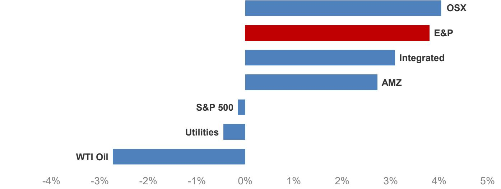

bar

| Category     | Value  |
| ------------ | ------ |
| OSX          | 4%     |
| E&P          | 3.8%   |
| Integrated   | 3%     |
| AMZ          | 2.7%   |
| S&P 500      | -0.1%  |
| Utilities    | -0.3%  |
| WTI Oil      | -2.5%  |

Source: Bloomberg, FactSet, MS

Exhibit 45: YTD Energy Sub-sector Performance   
YTD Performance   
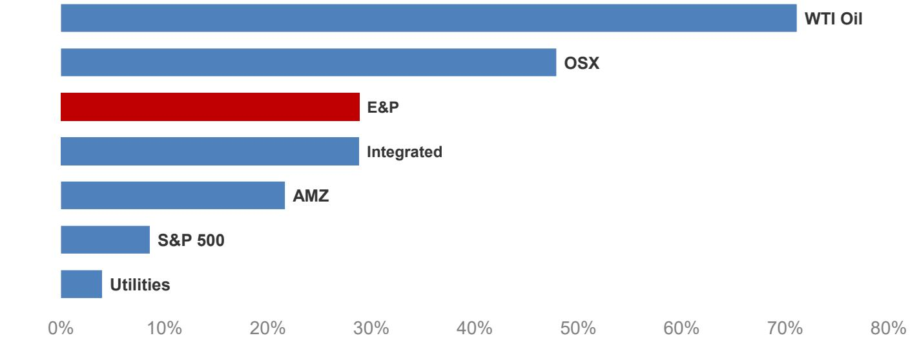

bar

| Category     | Value |
| ------------ | ----- |
| WTI Oil      | 70%   |
| OSX          | 48%   |
| E&P          | 29%   |
| Integrated   | 29%   |
| AMZ          | 21%   |
| S&P 500      | 9%    |
| Utilities    | 4%    |

Source: Bloomberg, FactSet, MS

Exhibit 46: Best & Worst E&P WoW Performance   
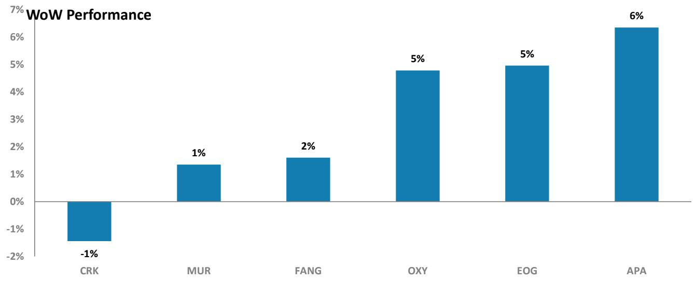

bar

WoW Performance
| Company | WoW Performance (%) |
| :--- | :--- |
| CRK | -1 |
| MUR | 1 |
| FANG | 2 |
| OXY | 5 |
| EOG | 5 |
| APA | 6 |

Source: FactSet, MS

Exhibit 47: WoW Performance by E&P Sub-sector   
WoW Performance   
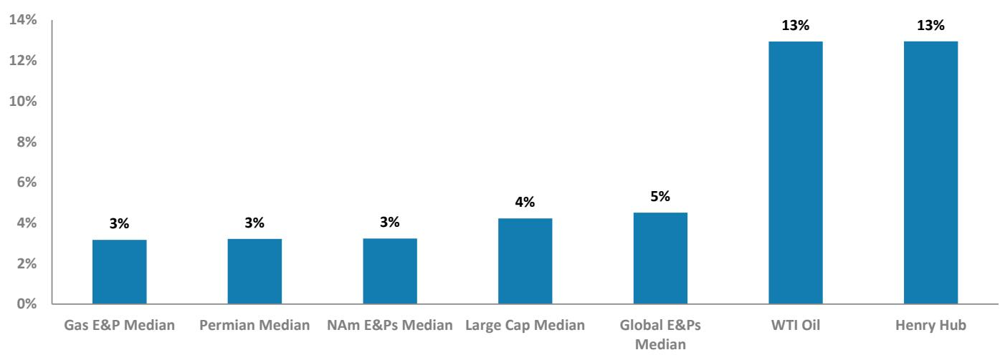

bar

| Category | Value (%) |
| :--- | :--- |
| Gas E&P Median | 3 |
| Permian Median | 3 |
| NAm E&Ps Median | 3 |
| Large Cap Median | 4 |
| Global E&Ps Median | 5 |
| WTI Oil | 13 |
| Henry Hub | 13 |

Source: FactSet, MS

Exhibit 48: NAV implied oil prices in our coverage now sit $\sim 16\%$ below the 12-month strip price   
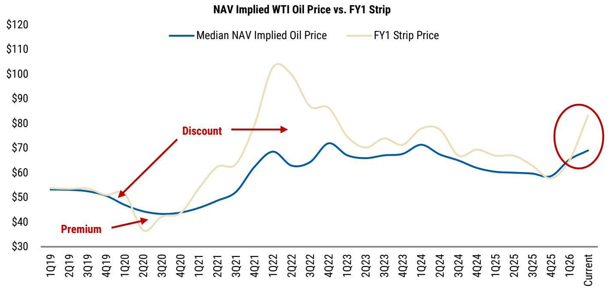

line

| Quarter | Median NAV Implied Oil Price | FY1 Strip Price |
|---------|------------------------------|-----------------|
| 1Q19    | $53                          | $54             |
| 2Q19    | $52                          | $53             |
| 3Q19    | $51                          | $52             |
| 4Q19    | $48                          | $50             |
| 1Q20    | $45                          | $40             |
| 2Q20    | $43                          | $35             |
| 3Q20    | $44                          | $40             |
| 4Q20    | $45                          | $45             |
| 1Q21    | $48                          | $55             |
| 2Q21    | $52                          | $65             |
| 3Q21    | $58                          | $75             |
| 4Q21    | $65                          | $90             |
| 1Q22    | $70                          | $105            |
| 2Q22    | $68                          | $100            |
| 3Q22    | $65                          | $90             |
| 4Q22    | $70                          | $85             |
| 1Q23    | $68                          | $80             |
| 2Q23    | $67                          | $75             |
| 3Q23    | $68                          | $78             |
| 4Q23    | $70                          | $80             |
| 1Q24    | $72                          | $85             |
| 2Q24    | $70                          | $80             |
| 3Q24    | $68                          | $75             |
| 4Q24    | $65                          | $70             |
| 1Q25    | $63                          | $68             |
| 2Q25    | $60                          | $65             |
| 3Q25    | $58                          | $60             |
| 4Q25    | $57                          | $58             |
| 1Q26    | $60                          | $65             |
| Current | $68                          | $80             |

Source: Company reports, Bloomberg, MS estimates

Exhibit 49: Our oil coverage has an average of $\sim 20\%$ of 2026 production hedged   
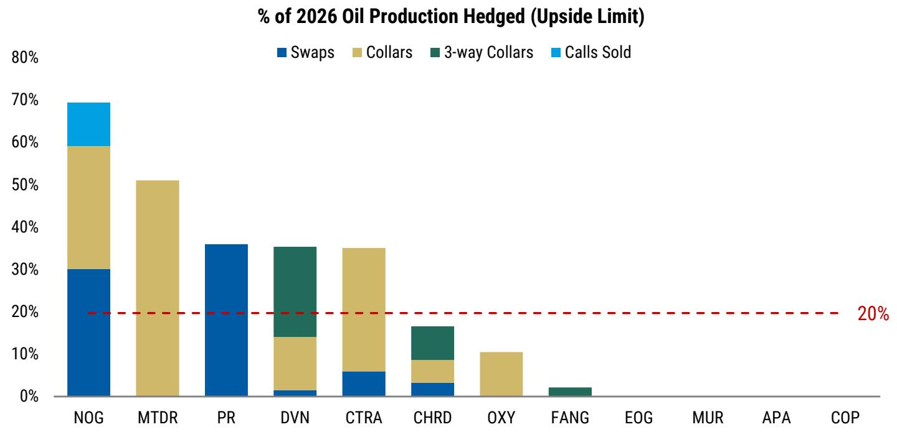

bar_stacked

% of 2026 Oil Production Hedged (Upside Limit)
| Company | Swaps (%) | Collars (%) | 3-way Collars (%) | Calls Sold (%) |
| :--- | :--- | :--- | :--- | :--- |
| NOG | 30 | 41 | 0 | 10 |
| MTDR | 0 | 51 | 0 | 0 |
| PR | 36 | 0 | 0 | 0 |
| DVN | 1 | 17 | 23 | 0 |
| CTRA | 6 | 28 | 0 | 0 |
| CHRD | 3 | 5 | 9 | 0 |
| OXY | 0 | 10 | 0 | 0 |
| FANG | 0 | 0 | 2 | 0 |
| EOG | 0 | 0 | 0 | 0 |
| MUR | 0 | 0 | 0 | 0 |
| APA | 0 | 0 | 0 | 0 |
| COP | 0 | 0 | 0 | 0 |

Source: Company data, MS estimates

Exhibit 50: Gas E&Ps have hedged \~53% of estimated 2026 production on average   
% of 2026 Gas Production Hedged (Upside Limit)   
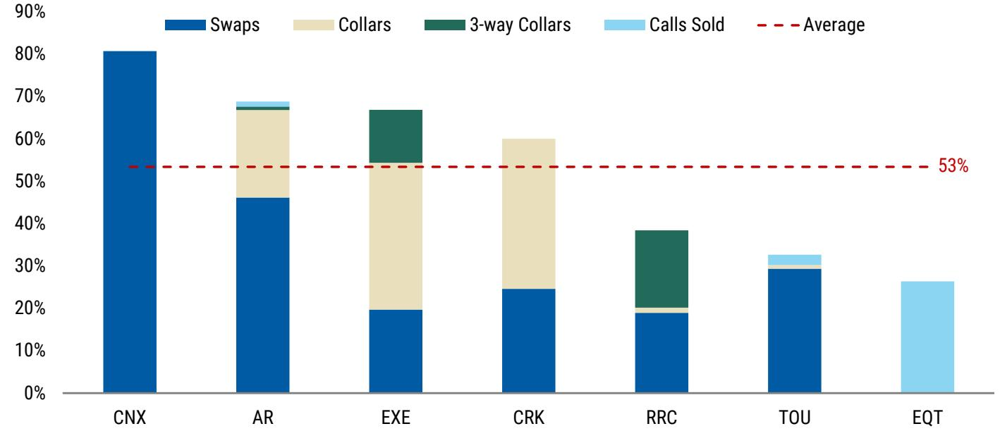

bar_stacked

| Category | Swaps (%) | Collars (%) | 3-way Collars (%) | Calls Sold (%) |
| :--- | :--- | :--- | :--- | :--- |
| CNX | 81 | 0 | 0 | 0 |
| AR | 46 | 20 | 2 | 1 |
| EXE | 19.5 | 47.5 | 10.5 | 0 |
| CRK | 24.5 | 36.5 | 0 | 0 |
| RRC | 18.5 | 2 | 17.5 | 0 |
| TOU | 29.5 | 0.5 | 1.5 | 0 |
| EQT | 0 | 0 | 0 | 26.5 |
The chart includes a red dashed line labeled 'Average' at 53% for comparison. The legend indicates four categories: Swaps (blue), Collars (beige), 3-way Collars (green), and Calls Sold (light blue). The values are estimated based on the stacked bars summing to 100% per category.

Source: Company data, MS estimates

Exhibit 51: At our price deck of \~\$88 WTI in 2026, we forecast a median realized price of \~\$85/bbl for our oil coverage. EOG, MUR, and APA have the highest realized prices due to limited hedges and/or geographic mix   
2026 Realized WTI Price Net of Hedges (\$/bbl)   
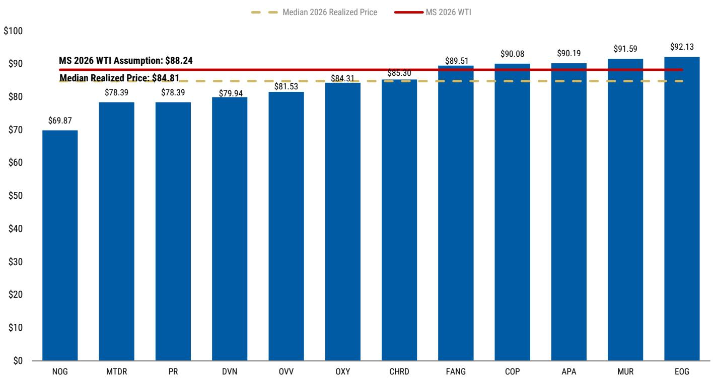

bar

| Company | Median Realized Price ($) | MS 2026 WTI ($) |
| :--- | :--- | :--- |
| NOG | 69.87 | 88.24 |
| MTDR | 78.39 | 88.24 |
| PR | 78.39 | 88.24 |
| DVN | 79.94 | 88.24 |
| OVV | 81.53 | 88.24 |
| OXY | 84.31 | 88.24 |
| CHRD | 85.30 | 88.24 |
| FANG | 89.51 | 88.24 |
| COP | 90.08 | 88.24 |
| APA | 90.19 | 88.24 |
| MUR | 91.59 | 88.24 |
| EOG | 92.13 | 88.24 |
Median Realized Price: $84.81; Median 2026 WTI Assumption: $88.24

Source: Company reports, MS estimates

# Sensitivities Summary

Exhibit 52: FCF yield sensitivities 

<table><tr><td rowspan="2">Company</td><td rowspan="2">Ticker</td><td colspan="5">2026E FCF/Equity yield (Pre-Div)</td><td colspan="5">2027E FCF/Equity yield (Pre-Div)</td></tr><tr><td>$65 WTI</td><td>$75 WTI</td><td>$85 WTI</td><td>$95 WTI</td><td>$105 WTI</td><td>$65 WTI</td><td>$75 WTI</td><td>$85 WTI</td><td>$95 WTI</td><td>$105 WTI</td></tr><tr><td colspan="12">US Majors</td></tr><tr><td>Chevron Corp.</td><td>CVX</td><td>8%</td><td>9%</td><td>10%</td><td>12%</td><td>13%</td><td>7%</td><td>8%</td><td>10%</td><td>12%</td><td>13%</td></tr><tr><td>Exxon Mobil Corporation</td><td>XOM</td><td>6%</td><td>7%</td><td>8%</td><td>9%</td><td>10%</td><td>6%</td><td>8%</td><td>9%</td><td>10%</td><td>11%</td></tr><tr><td>US Majors Median</td><td></td><td>7%</td><td>8%</td><td>9%</td><td>10%</td><td>12%</td><td>6%</td><td>8%</td><td>9%</td><td>11%</td><td>12%</td></tr><tr><td colspan="12">Canada</td></tr><tr><td>Canadian Natural Resources Ltd</td><td>CNQ</td><td>4%</td><td>7%</td><td>9%</td><td>11%</td><td>13%</td><td>7%</td><td>9%</td><td>11%</td><td>13%</td><td>15%</td></tr><tr><td>Cenovus Energy Inc</td><td>CVE</td><td>5%</td><td>8%</td><td>10%</td><td>13%</td><td>15%</td><td>7%</td><td>9%</td><td>12%</td><td>15%</td><td>18%</td></tr><tr><td>Imperial Oil Ltd</td><td>IMO</td><td>5%</td><td>7%</td><td>8%</td><td>9%</td><td>11%</td><td>6%</td><td>7%</td><td>8%</td><td>9%</td><td>11%</td></tr><tr><td>Suncor Energy Inc</td><td>SU</td><td>8%</td><td>10%</td><td>11%</td><td>13%</td><td>15%</td><td>6%</td><td>8%</td><td>10%</td><td>12%</td><td>13%</td></tr><tr><td>Canada Median</td><td></td><td>5%</td><td>7%</td><td>9%</td><td>12%</td><td>14%</td><td>6%</td><td>8%</td><td>10%</td><td>12%</td><td>14%</td></tr><tr><td colspan="12">Oil E&amp;Ps</td></tr><tr><td>APA Corp.</td><td>APA</td><td>9%</td><td>13%</td><td>17%</td><td>21%</td><td>25%</td><td>7%</td><td>11%</td><td>14%</td><td>18%</td><td>22%</td></tr><tr><td>Chord Energy Corp.</td><td>CHRD</td><td>9%</td><td>15%</td><td>20%</td><td>24%</td><td>29%</td><td>10%</td><td>16%</td><td>21%</td><td>26%</td><td>31%</td></tr><tr><td>ConocoPhillips</td><td>COP</td><td>5%</td><td>8%</td><td>10%</td><td>12%</td><td>14%</td><td>7%</td><td>9%</td><td>12%</td><td>14%</td><td>16%</td></tr><tr><td>Devon Energy Corp.</td><td>DVN</td><td>7%</td><td>9%</td><td>12%</td><td>13%</td><td>15%</td><td>11%</td><td>14%</td><td>17%</td><td>20%</td><td>23%</td></tr><tr><td>Diamondback Energy, Inc.</td><td>FANG</td><td>7%</td><td>10%</td><td>12%</td><td>14%</td><td>17%</td><td>8%</td><td>11%</td><td>13%</td><td>15%</td><td>17%</td></tr><tr><td>EOG Resources Inc.</td><td>EOG</td><td>7%</td><td>9%</td><td>11%</td><td>14%</td><td>16%</td><td>7%</td><td>10%</td><td>12%</td><td>14%</td><td>17%</td></tr><tr><td>Matador Resources Co.</td><td>MTDR</td><td>10%</td><td>13%</td><td>15%</td><td>17%</td><td>19%</td><td>10%</td><td>15%</td><td>19%</td><td>23%</td><td>27%</td></tr><tr><td>Murphy Oil Corp.</td><td>MUR</td><td>0%</td><td>5%</td><td>11%</td><td>15%</td><td>20%</td><td>6%</td><td>10%</td><td>15%</td><td>19%</td><td>24%</td></tr><tr><td>Northern Oil and Gas, Inc</td><td>NOG</td><td>10%</td><td>14%</td><td>18%</td><td>20%</td><td>23%</td><td>11%</td><td>21%</td><td>30%</td><td>36%</td><td>43%</td></tr><tr><td>Occidental Petroleum Corp.</td><td>OXY</td><td>10%</td><td>13%</td><td>16%</td><td>18%</td><td>21%</td><td>7%</td><td>11%</td><td>14%</td><td>17%</td><td>21%</td></tr><tr><td>Ovintiv Inc</td><td>OVV</td><td>8%</td><td>12%</td><td>15%</td><td>18%</td><td>21%</td><td>10%</td><td>15%</td><td>19%</td><td>23%</td><td>27%</td></tr><tr><td>Permian Resources Corp.</td><td>PR</td><td>10%</td><td>12%</td><td>14%</td><td>16%</td><td>19%</td><td>13%</td><td>16%</td><td>19%</td><td>22%</td><td>25%</td></tr><tr><td>Oil E&amp;Ps Median</td><td></td><td>9%</td><td>12%</td><td>15%</td><td>17%</td><td>19%</td><td>9%</td><td>12%</td><td>16%</td><td>20%</td><td>23%</td></tr><tr><td colspan="12">Royalties &amp; Minerals</td></tr><tr><td>Viper Energy, Inc.</td><td>VNOM</td><td>8%</td><td>10%</td><td>11%</td><td>12%</td><td>14%</td><td>10%</td><td>11%</td><td>13%</td><td>14%</td><td>15%</td></tr></table>

Source: FactSet, MS estimates

Exhibit 53: MSe EBITDAX vs consensus 

<table><tr><td rowspan="2">Company</td><td rowspan="2">Ticker</td><td colspan="5">2026E EBITDAX vs consensus</td><td colspan="5">2027E EBITDAX vs consensus</td></tr><tr><td>$65 WTI</td><td>$75 WTI</td><td>$85 WTI</td><td>$95 WTI</td><td>$105 WTI</td><td>$65 WTI</td><td>$75 WTI</td><td>$85 WTI</td><td>$95 WTI</td><td>$105 WTI</td></tr><tr><td colspan="12">US Majors</td></tr><tr><td>Chevron Corp.</td><td>CVX</td><td>-18%</td><td>-5%</td><td>7%</td><td>19%</td><td>31%</td><td>-9%</td><td>5%</td><td>19%</td><td>33%</td><td>47%</td></tr><tr><td>Exxon Mobil Corporation</td><td>XOM</td><td>-12%</td><td>0%</td><td>12%</td><td>23%</td><td>35%</td><td>-3%</td><td>10%</td><td>22%</td><td>35%</td><td>48%</td></tr><tr><td>US Majors Median</td><td></td><td>-15%</td><td>-3%</td><td>9%</td><td>21%</td><td>33%</td><td>-6%</td><td>7%</td><td>20%</td><td>34%</td><td>47%</td></tr><tr><td colspan="12">Canada</td></tr><tr><td>Canadian Natural Resources Ltd</td><td>CNQ</td><td>-38%</td><td>-22%</td><td>-5%</td><td>12%</td><td>29%</td><td>-12%</td><td>6%</td><td>25%</td><td>44%</td><td>63%</td></tr><tr><td>Cenovus Energy Inc</td><td>CVE</td><td>-38%</td><td>-22%</td><td>-6%</td><td>10%</td><td>27%</td><td>-15%</td><td>5%</td><td>24%</td><td>44%</td><td>64%</td></tr><tr><td>Imperial Oil Ltd</td><td>IMO</td><td>-23%</td><td>-8%</td><td>6%</td><td>22%</td><td>37%</td><td>-7%</td><td>10%</td><td>27%</td><td>45%</td><td>62%</td></tr><tr><td>Suncor Energy Inc</td><td>SU</td><td>-24%</td><td>-12%</td><td>-1%</td><td>10%</td><td>21%</td><td>-14%</td><td>0%</td><td>15%</td><td>29%</td><td>44%</td></tr><tr><td>Canada Median</td><td></td><td>-31%</td><td>-17%</td><td>-3%</td><td>11%</td><td>28%</td><td>-13%</td><td>5%</td><td>24%</td><td>44%</td><td>63%</td></tr><tr><td colspan="12">Oil E&amp;Ps</td></tr><tr><td>APA Corp.</td><td>APA</td><td>-21%</td><td>-8%</td><td>5%</td><td>18%</td><td>31%</td><td>-14%</td><td>1%</td><td>16%</td><td>30%</td><td>45%</td></tr><tr><td>Chord Energy Corp.</td><td>CHRD</td><td>-22%</td><td>-6%</td><td>10%</td><td>25%</td><td>40%</td><td>-14%</td><td>5%</td><td>24%</td><td>42%</td><td>61%</td></tr><tr><td>ConocoPhillips</td><td>COP</td><td>-19%</td><td>-4%</td><td>10%</td><td>25%</td><td>40%</td><td>-5%</td><td>13%</td><td>30%</td><td>47%</td><td>64%</td></tr><tr><td>Devon Energy Corp.</td><td>DVN</td><td>-16%</td><td>-3%</td><td>10%</td><td>20%</td><td>30%</td><td>-8%</td><td>7%</td><td>21%</td><td>34%</td><td>48%</td></tr><tr><td>Diamondback Energy, Inc.</td><td>FANG</td><td>-22%</td><td>-7%</td><td>9%</td><td>24%</td><td>39%</td><td>-8%</td><td>8%</td><td>25%</td><td>41%</td><td>58%</td></tr><tr><td>EOG Resources Inc.</td><td>EOG</td><td>-21%</td><td>-7%</td><td>6%</td><td>20%</td><td>34%</td><td>-10%</td><td>5%</td><td>21%</td><td>36%</td><td>52%</td></tr><tr><td>Matador Resources Co.</td><td>MTDR</td><td>-9%</td><td>0%</td><td>8%</td><td>15%</td><td>22%</td><td>-14%</td><td>0%</td><td>15%</td><td>28%</td><td>42%</td></tr><tr><td>Murphy Oil Corp.</td><td>MUR</td><td>-25%</td><td>-10%</td><td>6%</td><td>21%</td><td>36%</td><td>-12%</td><td>6%</td><td>24%</td><td>41%</td><td>59%</td></tr><tr><td>Northern Oil and Gas, Inc</td><td>NOG</td><td>-19%</td><td>-13%</td><td>-7%</td><td>-3%</td><td>1%</td><td>-13%</td><td>1%</td><td>15%</td><td>29%</td><td>42%</td></tr><tr><td>Occidental Petroleum Corp.</td><td>OXY</td><td>-26%</td><td>-11%</td><td>4%</td><td>17%</td><td>29%</td><td>-14%</td><td>4%</td><td>22%</td><td>39%</td><td>56%</td></tr><tr><td>Ovintiv Inc</td><td>OVV</td><td>-23%</td><td>-11%</td><td>2%</td><td>13%</td><td>25%</td><td>-15%</td><td>2%</td><td>18%</td><td>34%</td><td>50%</td></tr><tr><td>Permian Resources Corp.</td><td>PR</td><td>-17%</td><td>-7%</td><td>3%</td><td>13%</td><td>23%</td><td>-5%</td><td>9%</td><td>23%</td><td>37%</td><td>52%</td></tr><tr><td>Oil E&amp;Ps Median</td><td></td><td>-21%</td><td>-7%</td><td>6%</td><td>19%</td><td>30%</td><td>-12%</td><td>5%</td><td>21%</td><td>37%</td><td>52%</td></tr><tr><td colspan="12">Royalties &amp; Minerals</td></tr><tr><td>Viper Energy, Inc.</td><td>VNOM</td><td>-19%</td><td>-6%</td><td>6%</td><td>19%</td><td>32%</td><td>-9%</td><td>4%</td><td>17%</td><td>31%</td><td>44%</td></tr></table>

Source: FactSet, MS estimates

# Comps

Exhibit 54: Comp Sheet 

<table><tr><td colspan="4">Commodity Benchmark Prices</td></tr><tr><td></td><td>2026E</td><td>2027E</td><td>2028E</td></tr><tr><td>WTI Cushing Oil ($/Bbl)</td><td>88.19</td><td>70.00</td><td>70.00</td></tr><tr><td>WCS ($/Bbl)</td><td>67.66</td><td>55.62</td><td>55.00</td></tr><tr><td>Brent Oil ($/Bbl)</td><td>97.26</td><td>76.05</td><td>75.00</td></tr><tr><td>US Henry Hub ($/MMBtu)</td><td>3.66</td><td>3.80</td><td>3.75</td></tr><tr><td>Mont Belvieu NGL ($/Bbl)</td><td>31.65</td><td>28.26</td><td>28.04</td></tr><tr><td>GC 321 Brent ($/Bbl)</td><td>21.19</td><td>14.20</td><td>14.20</td></tr></table>

<table><tr><td rowspan="2">Company</td><td rowspan="2">Ticker</td><td rowspan="2">Rating</td><td rowspan="2">Price 5/20/26</td><td rowspan="2">Market Cap ($MM)</td><td rowspan="2">Price Target</td><td rowspan="2">PT Upside</td><td colspan="3">EV/EBITDAX</td><td colspan="3">EV/ Debt-Adjusted Cash Flow</td><td colspan="3">FCF yield (Pre-Div)</td><td colspan="3">Total Yield (Dividends + Buybacks)</td><td colspan="3">Net Debt/ EBITDAX</td><td colspan="3">Prod Growth YoY</td></tr><tr><td>2026E</td><td>2027E</td><td>2028E</td><td>2026E</td><td>2027E</td><td>2028E</td><td>2026E</td><td>2027E</td><td>2028E</td><td>2026E</td><td>2027E</td><td>2028E</td><td>2026E</td><td>2027E</td><td>2028E</td><td>2026E</td><td>2027E</td><td>2028E</td></tr><tr><td colspan="25">US Majors</td></tr><tr><td>Chevron Corp.</td><td>CVX</td><td>OW</td><td>$191.33</td><td>372,335</td><td>$214</td><td>12%</td><td>5.8x</td><td>7.1x</td><td>6.7x</td><td>7.2x</td><td>8.3x</td><td>7.8x</td><td>11%</td><td>8%</td><td>8%</td><td>7%</td><td>8%</td><td>8%</td><td>0.3x</td><td>0.4x</td><td>0.4x</td><td>7%</td><td>3%</td><td>-0%</td></tr><tr><td>Exxon Mobil Corporation</td><td>XOM</td><td>OW</td><td>$156.28</td><td>669,660</td><td>$171</td><td>9%</td><td>6.5x</td><td>7.2x</td><td>6.6x</td><td>7.9x</td><td>8.6x</td><td>7.9x</td><td>8%</td><td>7%</td><td>7%</td><td>6%</td><td>6%</td><td>5%</td><td>0.1x</td><td>0.0x</td><td>-0.1x</td><td>-2%</td><td>8%</td><td>3%</td></tr><tr><td>US Majors Median</td><td></td><td></td><td></td><td></td><td></td><td>11%</td><td>6.2x</td><td>7.2x</td><td>6.6x</td><td>7.6x</td><td>8.4x</td><td>7.8x</td><td>10%</td><td>7%</td><td>8%</td><td>6%</td><td>7%</td><td>7%</td><td>0.2x</td><td>0.2x</td><td>0.2x</td><td>3%</td><td>5%</td><td>2%</td></tr><tr><td colspan="25">Canada</td></tr><tr><td>Canadian Natural Resources Ltd</td><td>CNQ</td><td>EW</td><td>C$67.11</td><td>C$140,528</td><td>C$67</td><td>-0%</td><td>6.2x</td><td>6.9x</td><td>6.7x</td><td>7.0x</td><td>8.0x</td><td>7.8x</td><td>9%</td><td>8%</td><td>8%</td><td>8%</td><td>7%</td><td>8%</td><td>0.6x</td><td>0.6x</td><td>0.6x</td><td>5%</td><td>2%</td><td>-1%</td></tr><tr><td>Cenovus Energy Inc</td><td>CVE</td><td>OW</td><td>C$41.93</td><td>C$81,205</td><td>C$43</td><td>3%</td><td>4.9x</td><td>5.6x</td><td>5.0x</td><td>5.7x</td><td>6.5x</td><td>5.7x</td><td>11%</td><td>8%</td><td>9%</td><td>6%</td><td>7%</td><td>9%</td><td>0.3x</td><td>0.2x</td><td>0.2x</td><td>17%</td><td>5%</td><td>5%</td></tr><tr><td>Imperial Oil Ltd</td><td>IMO</td><td>EW</td><td>C$183.85</td><td>C$92,863</td><td>C$141</td><td>-23%</td><td>7.2x</td><td>9.1x</td><td>8.2x</td><td>8.9x</td><td>11.1x</td><td>10.0x</td><td>8%</td><td>6%</td><td>6%</td><td>6%</td><td>6%</td><td>5%</td><td>0.1x</td><td>0.1x</td><td>0.0x</td><td>2%</td><td>4%</td><td>1%</td></tr><tr><td>Suncor Energy Inc</td><td>SU</td><td>EW</td><td>C$93.30</td><td>C$113,080</td><td>C$93</td><td>-0%</td><td>4.6x</td><td>6.2x</td><td>5.3x</td><td>5.5x</td><td>7.3x</td><td>6.3x</td><td>12%</td><td>7%</td><td>8%</td><td>6%</td><td>7%</td><td>8%</td><td>0.0x</td><td>0.0x</td><td>0.0x</td><td>0%</td><td>6%</td><td>6%</td></tr><tr><td>Canada Median</td><td></td><td></td><td></td><td></td><td></td><td>-0%</td><td>5.6x</td><td>6.6x</td><td>6.0x</td><td>6.4x</td><td>7.6x</td><td>7.0x</td><td>10%</td><td>7%</td><td>8%</td><td>6%</td><td>7%</td><td>8%</td><td>0.2x</td><td>0.2x</td><td>0.1x</td><td>3%</td><td>5%</td><td>3%</td></tr><tr><td colspan="25">Oil E&amp;Ps</td></tr><tr><td>APA Corp.</td><td>APA</td><td>UW</td><td>$39.32</td><td>13,919</td><td>$44</td><td>12%</td><td>2.5x</td><td>3.3x</td><td>3.1x</td><td>3.0x</td><td>3.8x</td><td>3.6x</td><td>18%</td><td>9%</td><td>9%</td><td>4%</td><td>5%</td><td>6%</td><td>0.3x</td><td>0.3x</td><td>0.2x</td><td>-7%</td><td>0%</td><td>4%</td></tr><tr><td>Chord Energy Corp.</td><td>CHRD</td><td>OW</td><td>$145.55</td><td>8,263</td><td>$175</td><td>20%</td><td>2.4x</td><td>2.8x</td><td>2.5x</td><td>2.5x</td><td>2.9x</td><td>2.7x</td><td>21%</td><td>12%</td><td>12%</td><td>15%</td><td>9%</td><td>9%</td><td>0.1x</td><td>0.1x</td><td>0.0x</td><td>0%</td><td>-1%</td><td>0%</td></tr><tr><td>ConocoPhillips</td><td>COP</td><td>OW</td><td>$122.36</td><td>149,886</td><td>$153</td><td>25%</td><td>4.5x</td><td>4.9x</td><td>4.5x</td><td>5.6x</td><td>6.0x</td><td>5.4x</td><td>11%</td><td>8%</td><td>9%</td><td>8%</td><td>7%</td><td>7%</td><td>0.4x</td><td>0.4x</td><td>0.3x</td><td>-3%</td><td>4%</td><td>2%</td></tr><tr><td>Devon Energy Corp.</td><td>DVN</td><td>OW</td><td>$48.46</td><td>55,777</td><td>$66</td><td>36%</td><td>4.4x</td><td>3.5x</td><td>3.1x</td><td>4.8x</td><td>4.0x</td><td>3.4x</td><td>12%</td><td>13%</td><td>14%</td><td>5%</td><td>9%</td><td>11%</td><td>0.3x</td><td>0.1x</td><td>0.0x</td><td>63%</td><td>23%</td><td>1%</td></tr><tr><td>Diamondback Energy, Inc.</td><td>FANG</td><td>OW</td><td>$204.33</td><td>57,783</td><td>$229</td><td>12%</td><td>5.0x</td><td>5.7x</td><td>5.3x</td><td>5.7x</td><td>6.5x</td><td>6.1x</td><td>13%</td><td>9%</td><td>9%</td><td>4%</td><td>6%</td><td>5%</td><td>0.6x</td><td>0.6x</td><td>0.4x</td><td>6%</td><td>1%</td><td>1%</td></tr><tr><td>EOG Resources Inc.</td><td>EOG</td><td>EW</td><td>$141.63</td><td>75,772</td><td>$160</td><td>13%</td><td>4.1x</td><td>5.0x</td><td>5.1x</td><td>4.8x</td><td>5.7x</td><td>5.7x</td><td>12%</td><td>8%</td><td>8%</td><td>9%</td><td>8%</td><td>8%</td><td>0.1x</td><td>0.1x</td><td>0.1x</td><td>14%</td><td>3%</td><td>3%</td></tr><tr><td>Matador Resources Co.</td><td>MTDR</td><td>EW</td><td>$59.52</td><td>7,396</td><td>$75</td><td>26%</td><td>3.6x</td><td>3.7x</td><td>3.4x</td><td>3.9x</td><td>4.0x</td><td>3.6x</td><td>16%</td><td>13%</td><td>13%</td><td>3%</td><td>3%</td><td>3%</td><td>0.8x</td><td>0.7x</td><td>0.4x</td><td>3%</td><td>3%</td><td>2%</td></tr><tr><td>Murphy Oil Corp.</td><td>MUR</td><td>UW</td><td>$38.98</td><td>5,628</td><td>$37</td><td>-5%</td><td>2.9x</td><td>3.3x</td><td>3.3x</td><td>3.2x</td><td>3.6x</td><td>3.6x</td><td>12%</td><td>8%</td><td>7%</td><td>9%</td><td>6%</td><td>5%</td><td>0.4x</td><td>0.4x</td><td>0.4x</td><td>-5%</td><td>7%</td><td>3%</td></tr><tr><td>Northern Oil and Gas, Inc</td><td>NOG</td><td>UW</td><td>$24.07</td><td>2,414</td><td>$29</td><td>20%</td><td>3.3x</td><td>3.1x</td><td>3.0x</td><td>4.0x</td><td>3.8x</td><td>3.6x</td><td>19%</td><td>16%</td><td>17%</td><td>8%</td><td>8%</td><td>8%</td><td>1.6x</td><td>1.4x</td><td>1.3x</td><td>9%</td><td>-0%</td><td>0%</td></tr><tr><td>Occidental Petroleum Corp.</td><td>OXY</td><td>EW</td><td>$58.87</td><td>59,276</td><td>$74</td><td>26%</td><td>4.3x</td><td>5.0x</td><td>4.5x</td><td>4.5x</td><td>5.7x</td><td>5.2x</td><td>16%</td><td>9%</td><td>10%</td><td>2%</td><td>2%</td><td>2%</td><td>0.7x</td><td>0.6x</td><td>0.3x</td><td>-0%</td><td>2%</td><td>3%</td></tr><tr><td>Ovintiv Inc</td><td>OVV</td><td>EW</td><td>$59.53</td><td>15,966</td><td>$68</td><td>14%</td><td>3.6x</td><td>4.0x</td><td>3.8x</td><td>3.8x</td><td>4.0x</td><td>4.2x</td><td>16%</td><td>13%</td><td>10%</td><td>17%</td><td>11%</td><td>9%</td><td>0.6x</td><td>0.8x</td><td>0.9x</td><td>2%</td><td>-2%</td><td>0%</td></tr><tr><td>Permian Resources Corp.</td><td>PR</td><td>OW</td><td>$20.89</td><td>17,805</td><td>$25</td><td>20%</td><td>4.0x</td><td>3.6x</td><td>3.3x</td><td>4.5x</td><td>4.3x</td><td>4.1x</td><td>15%</td><td>14%</td><td>12%</td><td>3%</td><td>3%</td><td>3%</td><td>0.3x</td><td>-0.1x</td><td>-0.4x</td><td>5%</td><td>0%</td><td>1%</td></tr><tr><td>Oil E&amp;Ps Median</td><td></td><td></td><td></td><td></td><td></td><td>20%</td><td>3.8x</td><td>3.6x</td><td>3.3x</td><td>4.3x</td><td>4.0x</td><td>3.9x</td><td>15%</td><td>11%</td><td>10%</td><td>6%</td><td>6%</td><td>6%</td><td>0.4x</td><td>0.4x</td><td>0.3x</td><td>3%</td><td>1%</td><td>1%</td></tr><tr><td colspan="25">Gas E&amp;Ps</td></tr><tr><td>Antero Resources Corp.</td><td>AR</td><td>OW</td><td>$37.98</td><td>11,828</td><td>$56</td><td>47%</td><td>4.8x</td><td>3.7x</td><td>3.2x</td><td>5.2x</td><td>4.3x</td><td>4.1x</td><td>13%</td><td>15%</td><td>13%</td><td>1%</td><td>5%</td><td>4%</td><td>0.6x</td><td>0.2x</td><td>-0.1x</td><td>19%</td><td>9%</td><td>4%</td></tr><tr><td>CNX Resources Corp.</td><td>CNX</td><td>UW</td><td>$36.53</td><td>5,855</td><td>$34</td><td>-7%</td><td>6.2x</td><td>5.1x</td><td>4.8x</td><td>8.5x</td><td>6.3x</td><td>6.4x</td><td>6%</td><td>10%</td><td>9%</td><td>4%</td><td>5%</td><td>3%</td><td>1.3x</td><td>1.1x</td><td>1.0x</td><td>-3%</td><td>0%</td><td>0%</td></tr><tr><td>Comstock Resources Inc.</td><td>CRK</td><td>EW</td><td>$14.34</td><td>4,177</td><td>$18</td><td>26%</td><td>7.0x</td><td>5.2x</td><td>4.7x</td><td>7.9x</td><td>5.9x</td><td>5.5x</td><td>-11%</td><td>-3%</td><td>-2%</td><td>0%</td><td>0%</td><td>1%</td><td>3.0x</td><td>2.2x</td><td>2.1x</td><td>5%</td><td>21%</td><td>13%</td></tr><tr><td>EQT Corp.</td><td>EQT</td><td>OW</td><td>$57.83</td><td>36,387</td><td>$74</td><td>28%</td><td>6.7x</td><td>6.0x</td><td>4.9x</td><td>6.6x</td><td>6.7x</td><td>5.5x</td><td>11%</td><td>9%</td><td>12%</td><td>1%</td><td>3%</td><td>3%</td><td>0.6x</td><td>0.3x</td><td>-0.2x</td><td>-0%</td><td>1%</td><td>5%</td></tr><tr><td>Expand Energy Corp.</td><td>EXE</td><td>OW</td><td>$98.85</td><td>23,799</td><td>$139</td><td>41%</td><td>4.2x</td><td>3.8x</td><td>3.5x</td><td>4.3x</td><td>4.0x</td><td>3.7x</td><td>12%</td><td>12%</td><td>11%</td><td>4%</td><td>4%</td><td>7%</td><td>0.3x</td><td>0.0x</td><td>-0.2x</td><td>5%</td><td>2%</td><td>1%</td></tr><tr><td>Range Resources Corp.</td><td>RRC</td><td>EW</td><td>$42.08</td><td>9,948</td><td>$50</td><td>19%</td><td>5.8x</td><td>5.1x</td><td>4.9x</td><td>6.2x</td><td>5.6x</td><td>5.9x</td><td>9%</td><td>10%</td><td>8%</td><td>2%</td><td>3%</td><td>6%</td><td>0.2x</td><td>-0.1x</td><td>-0.2x</td><td>6%</td><td>9%</td><td>2%</td></tr><tr><td>Tourmaline Oil Corp.</td><td>TOU</td><td>EW</td><td>C$67.15</td><td>C$26,930</td><td>C$70</td><td>4%</td><td>6.3x</td><td>5.9x</td><td>5.0x</td><td>6.5x</td><td>6.2x</td><td>5.2x</td><td>5%</td><td>5%</td><td>8%</td><td>5%</td><td>5%</td><td>5%</td><td>0.2x</td><td>0.2x</td><td>0.0x</td><td>-1%</td><td>7%</td><td>5%</td></tr><tr><td>Gas E&amp;Ps Median</td><td></td><td></td><td></td><td></td><td></td><td>26%</td><td>6.2x</td><td>5.1x</td><td>4.8x</td><td>6.5x</td><td>5.9x</td><td>5.5x</td><td>9%</td><td>10%</td><td>9%</td><td>2%</td><td>4%</td><td>4%</td><td>0.6x</td><td>0.2x</td><td>-0.1x</td><td>5%</td><td>7%</td><td>4%</td></tr><tr><td colspan="25">Royalties &amp; Minerals</td></tr><tr><td>Viper Energy, Inc.</td><td>VNOM</td><td>OW</td><td>$47.70</td><td>16,913</td><td>$49</td><td>3%</td><td>10.5x</td><td>11.5x</td><td>10.3x</td><td>11.6x</td><td>12.1x</td><td>10.7x</td><td>11%</td><td>10%</td><td>11%</td><td>9%</td><td>12%</td><td>12%</td><td>0.5x</td><td>0.7x</td><td>0.7x</td><td>36%</td><td>4%</td><td>6%</td></tr><tr><td>Total Coverage Median</td><td></td><td></td><td></td><td></td><td></td><td>14%</td><td>4.7x</td><td>5.1x</td><td>4.7x</td><td>5.5x</td><td>5.8x</td><td>5.4x</td><td>12%</td><td>9%</td><td>9%</td><td>5%</td><td>6%</td><td>6%</td><td>0.4x</td><td>0.3x</td><td>0.2x</td><td>4%</td><td>3%</td><td>2%</td></tr></table>

Source: FactSet, MS estimates

# EPS & Comps Tables

Exhibit 55: EPS Estimates 

<table><tr><td rowspan="3">Company</td><td rowspan="3">Ticker</td><td rowspan="3">Rating</td><td colspan="9">EPS</td></tr><tr><td colspan="3">MS</td><td colspan="3">Consensus</td><td colspan="3">MS vs. Street</td></tr><tr><td>2026E</td><td>2027E</td><td>2028E</td><td>2026E</td><td>2027E</td><td>2028E</td><td>2026E</td><td>2027E</td><td>2028E</td></tr><tr><td colspan="12">US Majors</td></tr><tr><td>Chevron Corp.</td><td>CVX</td><td>OW</td><td>16.71</td><td>11.40</td><td>12.67</td><td>13.47</td><td>11.95</td><td>12.29</td><td>24%</td><td>-5%</td><td>3%</td></tr><tr><td>Exxon Mobil Corporation</td><td>XOM</td><td>OW</td><td>12.92</td><td>10.69</td><td>11.83</td><td>10.51</td><td>10.17</td><td>10.81</td><td>23%</td><td>5%</td><td>9%</td></tr><tr><td>US Majors Median</td><td></td><td></td><td>14.81</td><td>11.04</td><td>12.25</td><td>11.99</td><td>11.06</td><td>11.55</td><td>23%</td><td>0%</td><td>6%</td></tr><tr><td colspan="12">Canada</td></tr><tr><td>Canadian Natural Resources Ltd</td><td>CNQ</td><td>EW</td><td>5.80</td><td>4.72</td><td>4.81</td><td>6.13</td><td>4.96</td><td>4.93</td><td>-5%</td><td>-5%</td><td>-2%</td></tr><tr><td>Cenovus Energy Inc</td><td>CVE</td><td>OW</td><td>4.18</td><td>3.04</td><td>3.55</td><td>4.42</td><td>3.53</td><td>3.92</td><td>-5%</td><td>-14%</td><td>-9%</td></tr><tr><td>Imperial Oil Ltd</td><td>IMO</td><td>EW</td><td>15.86</td><td>11.60</td><td>12.76</td><td>12.69</td><td>11.01</td><td>10.95</td><td>25%</td><td>5%</td><td>17%</td></tr><tr><td>Suncor Energy Inc</td><td>SU</td><td>EW</td><td>10.23</td><td>5.96</td><td>7.28</td><td>8.64</td><td>6.98</td><td>8.05</td><td>18%</td><td>-15%</td><td>-10%</td></tr><tr><td>Canada Median</td><td></td><td></td><td>8.02</td><td>5.34</td><td>6.04</td><td>7.38</td><td>5.97</td><td>6.49</td><td>7%</td><td>-9%</td><td>-6%</td></tr><tr><td colspan="12">Oil E&amp;Ps</td></tr><tr><td>APA Corp.</td><td>APA</td><td>UW</td><td>6.83</td><td>3.34</td><td>3.46</td><td>6.05</td><td>4.16</td><td>4.78</td><td>13%</td><td>-20%</td><td>-28%</td></tr><tr><td>Chord Energy Corp.</td><td>CHRD</td><td>OW</td><td>26.90</td><td>16.96</td><td>18.26</td><td>20.21</td><td>16.11</td><td>16.24</td><td>33%</td><td>5%</td><td>12%</td></tr><tr><td>ConocoPhillips</td><td>COP</td><td>OW</td><td>12.46</td><td>9.81</td><td>10.86</td><td>9.75</td><td>8.84</td><td>9.09</td><td>28%</td><td>11%</td><td>19%</td></tr><tr><td>Devon Energy Corp.</td><td>DVN</td><td>OW</td><td>4.80</td><td>5.71</td><td>6.39</td><td>5.50</td><td>5.39</td><td>5.86</td><td>-13%</td><td>6%</td><td>9%</td></tr><tr><td>Diamondback Energy, Inc.</td><td>FANG</td><td>OW</td><td>21.49</td><td>14.90</td><td>14.98</td><td>19.43</td><td>17.20</td><td>17.77</td><td>11%</td><td>-13%</td><td>-16%</td></tr><tr><td>EOG Resources Inc.</td><td>EOG</td><td>EW</td><td>19.18</td><td>13.54</td><td>13.06</td><td>16.28</td><td>14.43</td><td>14.87</td><td>18%</td><td>-6%</td><td>-12%</td></tr><tr><td>Matador Resources Co.</td><td>MTDR</td><td>EW</td><td>8.83</td><td>7.53</td><td>7.62</td><td>7.27</td><td>8.35</td><td>8.28</td><td>21%</td><td>-10%</td><td>-8%</td></tr><tr><td>Murphy Oil Corp.</td><td>MUR</td><td>UW</td><td>4.30</td><td>3.27</td><td>3.06</td><td>3.53</td><td>3.37</td><td>3.91</td><td>22%</td><td>-3%</td><td>-22%</td></tr><tr><td>Northern Oil and Gas, Inc</td><td>NOG</td><td>UW</td><td>3.81</td><td>3.89</td><td>4.04</td><td>3.62</td><td>3.77</td><td>3.90</td><td>5%</td><td>3%</td><td>4%</td></tr><tr><td>Occidental Petroleum Corp.</td><td>OXY</td><td>EW</td><td>6.86</td><td>3.55</td><td>3.67</td><td>4.78</td><td>3.58</td><td>3.98</td><td>44%</td><td>-1%</td><td>-8%</td></tr><tr><td>Ovintiv Inc</td><td>OVV</td><td>EW</td><td>8.55</td><td>7.29</td><td>7.94</td><td>8.00</td><td>7.78</td><td>8.45</td><td>7%</td><td>-6%</td><td>-6%</td></tr><tr><td>Permian Resources Corp.</td><td>PR</td><td>OW</td><td>1.72</td><td>2.03</td><td>2.07</td><td>1.68</td><td>2.07</td><td>2.12</td><td>3%</td><td>-2%</td><td>-2%</td></tr><tr><td>Oil E&amp;Ps Median</td><td></td><td></td><td>7.70</td><td>6.50</td><td>7.01</td><td>6.66</td><td>6.58</td><td>7.07</td><td>15%</td><td>-2%</td><td>-7%</td></tr><tr><td colspan="12">Gas E&amp;Ps</td></tr><tr><td>Antero Resources Corp.</td><td>AR</td><td>OW</td><td>4.33</td><td>5.28</td><td>5.67</td><td>4.41</td><td>4.73</td><td>5.29</td><td>-2%</td><td>11%</td><td>7%</td></tr><tr><td>CNX Resources Corp.</td><td>CNX</td><td>UW</td><td>1.97</td><td>2.99</td><td>3.37</td><td>3.11</td><td>4.19</td><td>4.61</td><td>-37%</td><td>-28%</td><td>-27%</td></tr><tr><td>Comstock Resources Inc.</td><td>CRK</td><td>EW</td><td>0.61</td><td>1.37</td><td>1.58</td><td>0.62</td><td>1.12</td><td>1.50</td><td>-2%</td><td>23%</td><td>5%</td></tr><tr><td>EQT Corp.</td><td>EQT</td><td>OW</td><td>4.15</td><td>4.67</td><td>5.59</td><td>4.85</td><td>4.77</td><td>5.53</td><td>-14%</td><td>-2%</td><td>1%</td></tr><tr><td>Expand Energy Corp.</td><td>EXE</td><td>OW</td><td>9.07</td><td>9.23</td><td>9.29</td><td>8.97</td><td>9.33</td><td>9.75</td><td>1%</td><td>-1%</td><td>-5%</td></tr><tr><td>Range Resources Corp.</td><td>RRC</td><td>EW</td><td>4.08</td><td>4.11</td><td>3.85</td><td>4.28</td><td>4.57</td><td>4.87</td><td>-5%</td><td>-10%</td><td>-21%</td></tr><tr><td>Tourmaline Oil Corp.</td><td>TOU</td><td>EW</td><td>6.07</td><td>5.00</td><td>6.35</td><td>4.91</td><td>5.31</td><td>5.35</td><td>24%</td><td>-6%</td><td>19%</td></tr><tr><td>Gas E&amp;Ps Median</td><td></td><td></td><td>4.15</td><td>4.67</td><td>5.59</td><td>4.41</td><td>4.73</td><td>5.29</td><td>-2%</td><td>-2%</td><td>1%</td></tr><tr><td colspan="12">Royalties &amp; Minerals</td></tr><tr><td>Viper Energy, Inc.</td><td>VNOM</td><td>OW</td><td>2.75</td><td>2.16</td><td>2.35</td><td>2.40</td><td>2.27</td><td>2.34</td><td>14%</td><td>-5%</td><td>0%</td></tr><tr><td>Total Coverage Median</td><td></td><td></td><td>6.45</td><td>5.14</td><td>6.01</td><td>5.78</td><td>5.13</td><td>5.44</td><td>12%</td><td>-4%</td><td>-2%</td></tr></table>

Source: FactSet, MS estimates; Ratings: OW = Overweight, EW = Equal-weight, UW = Underweight, N-R = Not-Rated. ++ Rating, price target and estimates for this company have been removed from consideration in this report because, under applicable law and/or MS policy, MS may be precluded from issuing such information with respect to this company at this time.

Exhibit 56: Production 

<table><tr><td rowspan="2">Company</td><td rowspan="2">Ticker</td><td colspan="3">Oil Production (MBbld)</td><td colspan="3">Oil Production (MBbld)</td><td colspan="3">Oil Production (MBbld)</td><td colspan="3">Production (MBoed)</td><td colspan="3">Production (MBoed)</td><td colspan="3">Production (MBoed)</td></tr><tr><td>2026E</td><td>MS 2027E</td><td>2028E</td><td>2026E</td><td>2027E</td><td>2028E</td><td>2026E</td><td>MS vs. Street 2027E</td><td>2028E</td><td>2026E</td><td>MS 2027E</td><td>2028E</td><td>2026E</td><td>Consensus 2027E</td><td>2028E</td><td>2026E</td><td>MS vs. Street 2027E</td><td>2028E</td></tr><tr><td colspan="20">US Majors</td></tr><tr><td>Chevron Corp.</td><td>CVX</td><td>2,539</td><td>2,632</td><td>2,633</td><td>2,587</td><td>2,684</td><td>2,704</td><td>-2%</td><td>-2%</td><td>-3%</td><td>3,999</td><td>4,103</td><td>4,096</td><td>4,015</td><td>4,144</td><td>4,146</td><td>-0%</td><td>-1%</td><td>-1%</td></tr><tr><td>Exxon Mobil Corporation</td><td>XOM</td><td>3,390</td><td>3,644</td><td>3,761</td><td>3,391</td><td>3,726</td><td>3,819</td><td>-0%</td><td>-2%</td><td>-2%</td><td>4,645</td><td>5,004</td><td>5,167</td><td>4,702</td><td>5,108</td><td>5,241</td><td>-1%</td><td>-2%</td><td>-1%</td></tr><tr><td>US Majors Median</td><td></td><td>2,965</td><td>3,138</td><td>3,197</td><td>2,989</td><td>3,205</td><td>3,262</td><td>-1%</td><td>-2%</td><td>-2%</td><td>4,322</td><td>4,554</td><td>4,632</td><td>4,358</td><td>4,626</td><td>4,694</td><td>-1%</td><td>-2%</td><td>-1%</td></tr><tr><td colspan="20">Canada</td></tr><tr><td>Canadian Natural Resources Ltd</td><td>CNQ</td><td>1,209</td><td>1,246</td><td>1,233</td><td>1,200</td><td>1,223</td><td>1,143</td><td>1%</td><td>2%</td><td>8%</td><td>1,645</td><td>1,684</td><td>1,673</td><td>1,623</td><td>1,653</td><td>1,651</td><td>1%</td><td>2%</td><td>1%</td></tr><tr><td>Cenovus Energy Inc</td><td>CVE</td><td>795</td><td>853</td><td>903</td><td>814</td><td>860</td><td>898</td><td>-2%</td><td>-1%</td><td>1%</td><td>972</td><td>1,025</td><td>1,075</td><td>972</td><td>1,019</td><td>1,062</td><td>-0%</td><td>1%</td><td>1%</td></tr><tr><td>Imperial Oil Ltd</td><td>IMO</td><td>440</td><td>459</td><td>464</td><td>440</td><td>454</td><td>453</td><td>0%</td><td>1%</td><td>2%</td><td>444</td><td>463</td><td>468</td><td>446</td><td>461</td><td>464</td><td>-0%</td><td>0%</td><td>1%</td></tr><tr><td>Suncor Energy Inc</td><td>SU</td><td>864</td><td>912</td><td>965</td><td>868</td><td>906</td><td>963</td><td>-0%</td><td>1%</td><td>0%</td><td>864</td><td>912</td><td>965</td><td>866</td><td>902</td><td>948</td><td>-0%</td><td>1%</td><td>2%</td></tr><tr><td>Canada Median</td><td></td><td>830</td><td>882</td><td>934</td><td>841</td><td>883</td><td>930</td><td>-0%</td><td>1%</td><td>1%</td><td>918</td><td>969</td><td>1,020</td><td>919</td><td>960</td><td>1,005</td><td>-0%</td><td>1%</td><td>1%</td></tr><tr><td colspan="20">Oil E&amp;Ps</td></tr><tr><td>APA Corp.</td><td>APA</td><td>219</td><td>209</td><td>219</td><td>221</td><td>218</td><td>234</td><td>-1%</td><td>-4%</td><td>-6%</td><td>430</td><td>432</td><td>448</td><td>435</td><td>441</td><td>458</td><td>-1%</td><td>-2%</td><td>-2%</td></tr><tr><td>Chord Energy Corp.</td><td>CHRD</td><td>162</td><td>162</td><td>162</td><td>161</td><td>161</td><td>162</td><td>0%</td><td>0%</td><td>0%</td><td>278</td><td>276</td><td>277</td><td>280</td><td>281</td><td>283</td><td>-1%</td><td>-2%</td><td>-2%</td></tr><tr><td>ConocoPhillips</td><td>COP</td><td>1,223</td><td>1,264</td><td>1,282</td><td>1,296</td><td>1,325</td><td>-</td><td>-6%</td><td>-5%</td><td>NM</td><td>2,302</td><td>2,394</td><td>2,431</td><td>2,309</td><td>2,414</td><td>2,481</td><td>-0%</td><td>-1%</td><td>-2%</td></tr><tr><td>Devon Energy Corp.</td><td>DVN</td><td>501</td><td>571</td><td>577</td><td>499</td><td>563</td><td>567</td><td>1%</td><td>1%</td><td>2%</td><td>1,367</td><td>1,682</td><td>1,700</td><td>1,352</td><td>1,641</td><td>1,625</td><td>1%</td><td>3%</td><td>5%</td></tr><tr><td>Diamondback Energy, Inc.</td><td>FANG</td><td>525</td><td>535</td><td>541</td><td>523</td><td>531</td><td>540</td><td>0%</td><td>1%</td><td>0%</td><td>980</td><td>990</td><td>1,000</td><td>981</td><td>999</td><td>1,011</td><td>-0%</td><td>-1%</td><td>-1%</td></tr><tr><td>EOG Resources Inc.</td><td>EOG</td><td>549</td><td>553</td><td>561</td><td>549</td><td>557</td><td>563</td><td>-0%</td><td>-1%</td><td>-0%</td><td>1,399</td><td>1,445</td><td>1,491</td><td>1,401</td><td>1,448</td><td>1,485</td><td>-0%</td><td>-0%</td><td>0%</td></tr><tr><td>Matador Resources Co.</td><td>MTDR</td><td>124</td><td>126</td><td>128</td><td>125</td><td>129</td><td>134</td><td>-1%</td><td>-2%</td><td>-5%</td><td>214</td><td>221</td><td>224</td><td>214</td><td>223</td><td>230</td><td>0%</td><td>-1%</td><td>-3%</td></tr><tr><td>Murphy Oil Corp.</td><td>MUR</td><td>87</td><td>93</td><td>93</td><td>86</td><td>91</td><td>97</td><td>1%</td><td>2%</td><td>-5%</td><td>173</td><td>185</td><td>190</td><td>173</td><td>183</td><td>193</td><td>-0%</td><td>1%</td><td>-1%</td></tr><tr><td>Northern Oil and Gas, Inc</td><td>NOG</td><td>74</td><td>75</td><td>75</td><td>73</td><td>75</td><td>77</td><td>1%</td><td>0%</td><td>-2%</td><td>147</td><td>146</td><td>146</td><td>147</td><td>152</td><td>160</td><td>0%</td><td>-4%</td><td>-8%</td></tr><tr><td>Occidental Petroleum Corp.</td><td>OXY</td><td>718</td><td>744</td><td>781</td><td>716</td><td>733</td><td>741</td><td>0%</td><td>2%</td><td>5%</td><td>1,431</td><td>1,457</td><td>1,499</td><td>1,421</td><td>1,454</td><td>1,459</td><td>1%</td><td>0%</td><td>3%</td></tr><tr><td>Ovintiv Inc</td><td>OVV</td><td>209</td><td>210</td><td>213</td><td>211</td><td>210</td><td>214</td><td>-1%</td><td>-0%</td><td>-0%</td><td>628</td><td>614</td><td>615</td><td>639</td><td>638</td><td>647</td><td>-2%</td><td>-4%</td><td>-5%</td></tr><tr><td>Permian Resources Corp.</td><td>PR</td><td>194</td><td>197</td><td>199</td><td>194</td><td>199</td><td>204</td><td>0%</td><td>-1%</td><td>-2%</td><td>412</td><td>413</td><td>418</td><td>418</td><td>434</td><td>446</td><td>-1%</td><td>-5%</td><td>-6%</td></tr><tr><td>Oil E&amp;Ps Median</td><td></td><td>214</td><td>209</td><td>216</td><td>216</td><td>214</td><td>209</td><td>0%</td><td>0%</td><td>-0%</td><td>529</td><td>523</td><td>532</td><td>537</td><td>540</td><td>552</td><td>-0%</td><td>-1%</td><td>-2%</td></tr><tr><td colspan="20">Gas-Weighted Resource Plays</td></tr><tr><td>Antero Resources Corp.</td><td>AR</td><td>11</td><td>14</td><td>16</td><td>9</td><td>10</td><td>11</td><td>22%</td><td>50%</td><td>42%</td><td>685</td><td>749</td><td>782</td><td>686</td><td>736</td><td>754</td><td>-0%</td><td>2%</td><td>4%</td></tr><tr><td>CNX Resources Corp.</td><td>CNX</td><td>1</td><td>1</td><td>1</td><td>1</td><td>0</td><td>0</td><td>3%</td><td>50%</td><td>53%</td><td>279</td><td>280</td><td>280</td><td>281</td><td>280</td><td>284</td><td>-0%</td><td>0%</td><td>-1%</td></tr><tr><td>Comstock Resources Inc.</td><td>CRK</td><td>0</td><td>0</td><td>0</td><td>0</td><td>0</td><td>0</td><td>55%</td><td>35%</td><td>91%</td><td>217</td><td>262</td><td>295</td><td>216</td><td>273</td><td>324</td><td>0%</td><td>-4%</td><td>-9%</td></tr><tr><td>EQT Corp.</td><td>EQT</td><td>7</td><td>9</td><td>11</td><td>5</td><td>5</td><td>5</td><td>28%</td><td>72%</td><td>101%</td><td>1,085</td><td>1,094</td><td>1,146</td><td>1,096</td><td>1,105</td><td>1,133</td><td>-1%</td><td>-1%</td><td>1%</td></tr><tr><td>Expand Energy Corp.</td><td>EXE</td><td>18</td><td>16</td><td>15</td><td>16</td><td>18</td><td>19</td><td>10%</td><td>-8%</td><td>-20%</td><td>1,251</td><td>1,272</td><td>1,291</td><td>1,251</td><td>1,282</td><td>1,300</td><td>-0%</td><td>-1%</td><td>-1%</td></tr><tr><td>Range Resources Corp.</td><td>RRC</td><td>10</td><td>9</td><td>8</td><td>8</td><td>9</td><td>9</td><td>19%</td><td>-0%</td><td>-11%</td><td>395</td><td>433</td><td>441</td><td>396</td><td>436</td><td>447</td><td>-0%</td><td>-1%</td><td>-1%</td></tr><tr><td>Tourmaline Oil Corp.</td><td>TOU</td><td>122</td><td>128</td><td>135</td><td>127</td><td>N/A</td><td>N/A</td><td>-4%</td><td>-5%</td><td>-5%</td><td>632</td><td>676</td><td>710</td><td>633</td><td>674</td><td>717</td><td>-0%</td><td>0%</td><td>-1%</td></tr><tr><td>Gas E&amp;Ps Median</td><td></td><td>10</td><td>9</td><td>11</td><td>8</td><td>7</td><td>7</td><td>19%</td><td>35%</td><td>42%</td><td>632</td><td>676</td><td>710</td><td>633</td><td>674</td><td>717</td><td>-0%</td><td>-1%</td><td>-1%</td></tr><tr><td colspan="20">Royalties &amp; Minerals</td></tr><tr><td>Viper Energy, Inc.</td><td>VNOM</td><td>67</td><td>72</td><td>76</td><td>66</td><td>69</td><td>71</td><td>1%</td><td>4%</td><td>7%</td><td>130</td><td>135</td><td>143</td><td>131</td><td>136</td><td>139</td><td>-1%</td><td>-1%</td><td>3%</td></tr><tr><td>Total Coverage Median</td><td></td><td>202</td><td>203</td><td>206</td><td>202</td><td>210</td><td>204</td><td>0%</td><td>0%</td><td>0%</td><td>659</td><td>713</td><td>746</td><td>662</td><td>705</td><td>735</td><td>-0%</td><td>-1%</td><td>-1%</td></tr></table>

Source: FactSet, MS estimates; Ratings: OW = Overweight, EW = Equal-weight, UW = Underweight, N-R = Not-Rated. ++ Rating, price target and estimates for this company have been removed from consideration in this report because, under applicable law and/or MS policy, MS may be precluded from issuing such information with respect to this company at this time. Oil production shown as liquids production for CVX, OVV, TOU and XOM.

Exhibit 57: Capex 

<table><tr><td colspan="12">Capex ($MM)</td></tr><tr><td rowspan="2">Company</td><td rowspan="2">Ticker</td><td rowspan="2">Rating</td><td colspan="3">MS</td><td colspan="3">Consensus</td><td colspan="3">MS vs. Street</td></tr><tr><td>2026E</td><td>2027E</td><td>2028E</td><td>2026E</td><td>2027E</td><td>2028E</td><td>2026E</td><td>2027E</td><td>2028E</td></tr><tr><td colspan="12">US Majors</td></tr><tr><td>Chevron Corp.</td><td>CVX</td><td>OW</td><td>18,670</td><td>19,572</td><td>19,618</td><td>18,147</td><td>19,024</td><td>19,037</td><td>3%</td><td>3%</td><td>3%</td></tr><tr><td>Exxon Mobil Corporation</td><td>XOM</td><td>OW</td><td>27,957</td><td>28,736</td><td>29,414</td><td>27,987</td><td>29,582</td><td>29,732</td><td>-0%</td><td>-3%</td><td>-1%</td></tr><tr><td>US Majors Median</td><td></td><td></td><td>23,313</td><td>24,154</td><td>24,516</td><td>23,067</td><td>24,303</td><td>24,384</td><td>1%</td><td>0%</td><td>1%</td></tr><tr><td colspan="12">Canada</td></tr><tr><td>Canadian Natural Resources Ltd</td><td>CNQ</td><td>EW</td><td>6,141</td><td>5,737</td><td>5,882</td><td>6,524</td><td>6,349</td><td>6,287</td><td>-6%</td><td>-10%</td><td>-6%</td></tr><tr><td>Cenovus Energy Inc</td><td>CVE</td><td>OW</td><td>5,111</td><td>4,877</td><td>4,713</td><td>5,074</td><td>5,025</td><td>4,749</td><td>1%</td><td>-3%</td><td>-1%</td></tr><tr><td>Imperial Oil Ltd</td><td>IMO</td><td>EW</td><td>2,078</td><td>1,812</td><td>1,839</td><td>2,080</td><td>1,884</td><td>1,796</td><td>-0%</td><td>-4%</td><td>2%</td></tr><tr><td>Suncor Energy Inc</td><td>SU</td><td>EW</td><td>5,692</td><td>5,645</td><td>5,679</td><td>5,566</td><td>5,628</td><td>5,673</td><td>2%</td><td>0%</td><td>0%</td></tr><tr><td>Canada Median</td><td></td><td></td><td>5,401</td><td>5,261</td><td>5,196</td><td>5,320</td><td>5,327</td><td>5,211</td><td>0%</td><td>-3%</td><td>-0%</td></tr><tr><td colspan="12">Oil E&amp;Ps</td></tr><tr><td>APA Corp.</td><td>APA</td><td>UW</td><td>2,107</td><td>2,177</td><td>2,088</td><td>2,158</td><td>2,231</td><td>2,288</td><td>-2%</td><td>-2%</td><td>-9%</td></tr><tr><td>Chord Energy Corp.</td><td>CHRD</td><td>OW</td><td>1,406</td><td>1,407</td><td>1,407</td><td>1,404</td><td>1,405</td><td>1,402</td><td>0%</td><td>0%</td><td>0%</td></tr><tr><td>ConocoPhillips</td><td>COP</td><td>OW</td><td>12,217</td><td>12,038</td><td>11,802</td><td>12,180</td><td>12,155</td><td>12,121</td><td>0%</td><td>-1%</td><td>-3%</td></tr><tr><td>Devon Energy Corp.</td><td>DVN</td><td>OW</td><td>4,853</td><td>5,680</td><td>5,660</td><td>4,708</td><td>5,321</td><td>5,468</td><td>3%</td><td>7%</td><td>4%</td></tr><tr><td>Diamondback Energy, Inc.</td><td>FANG</td><td>OW</td><td>3,899</td><td>3,917</td><td>3,938</td><td>3,912</td><td>3,952</td><td>4,036</td><td>-0%</td><td>-1%</td><td>-2%</td></tr><tr><td>EOG Resources Inc.</td><td>EOG</td><td>EW</td><td>6,514</td><td>6,576</td><td>6,672</td><td>6,543</td><td>6,690</td><td>6,795</td><td>-0%</td><td>-2%</td><td>-2%</td></tr><tr><td>Matador Resources Co.</td><td>MTDR</td><td>EW</td><td>1,503</td><td>1,508</td><td>1,496</td><td>1,522</td><td>1,545</td><td>1,552</td><td>-1%</td><td>-2%</td><td>-4%</td></tr><tr><td>Murphy Oil Corp.</td><td>MUR</td><td>UW</td><td>1,251</td><td>1,186</td><td>1,163</td><td>1,232</td><td>1,229</td><td>1,170</td><td>2%</td><td>-3%</td><td>-1%</td></tr><tr><td>Northern Oil and Gas, Inc</td><td>NOG</td><td>UW</td><td>929</td><td>993</td><td>993</td><td>966</td><td>1,064</td><td>1,108</td><td>-4%</td><td>-7%</td><td>-10%</td></tr><tr><td>Occidental Petroleum Corp.</td><td>OXY</td><td>EW</td><td>5,738</td><td>5,911</td><td>5,822</td><td>5,800</td><td>5,933</td><td>5,984</td><td>-1%</td><td>-0%</td><td>-3%</td></tr><tr><td>Ovintiv Inc</td><td>OVV</td><td>EW</td><td>2,292</td><td>2,292</td><td>2,258</td><td>2,217</td><td>2,263</td><td>2,285</td><td>3%</td><td>1%</td><td>-1%</td></tr><tr><td>Permian Resources Corp.</td><td>PR</td><td>OW</td><td>1,901</td><td>1,910</td><td>1,925</td><td>1,902</td><td>1,939</td><td>1,975</td><td>-0%</td><td>-1%</td><td>-3%</td></tr><tr><td>Oil E&amp;Ps Median</td><td></td><td></td><td>2,200</td><td>2,234</td><td>2,173</td><td>2,187</td><td>2,247</td><td>2,287</td><td>-0%</td><td>-1%</td><td>-2%</td></tr><tr><td colspan="12">Gas-Weighted Resource Plays</td></tr><tr><td>Antero Resources Corp.</td><td>AR</td><td>OW</td><td>1,285</td><td>1,286</td><td>1,286</td><td>1,154</td><td>1,218</td><td>1,219</td><td>11%</td><td>6%</td><td>5%</td></tr><tr><td>CNX Resources Corp.</td><td>CNX</td><td>UW</td><td>569</td><td>569</td><td>571</td><td>568</td><td>587</td><td>580</td><td>0%</td><td>-3%</td><td>-2%</td></tr><tr><td>Comstock Resources Inc.</td><td>CRK</td><td>EW</td><td>1,463</td><td>1,458</td><td>1,562</td><td>1,497</td><td>1,478</td><td>1,504</td><td>-2%</td><td>-1%</td><td>4%</td></tr><tr><td>EQT Corp.</td><td>EQT</td><td>OW</td><td>2,737</td><td>2,765</td><td>2,399</td><td>2,723</td><td>2,768</td><td>2,899</td><td>0%</td><td>-0%</td><td>-17%</td></tr><tr><td>Expand Energy Corp.</td><td>EXE</td><td>OW</td><td>2,826</td><td>2,851</td><td>2,909</td><td>2,852</td><td>2,924</td><td>3,050</td><td>-1%</td><td>-3%</td><td>-5%</td></tr><tr><td>Range Resources Corp.</td><td>RRC</td><td>EW</td><td>678</td><td>656</td><td>619</td><td>685</td><td>687</td><td>647</td><td>-1%</td><td>-5%</td><td>-4%</td></tr><tr><td>Tourmaline Oil Corp.</td><td>TOU</td><td>EW</td><td>2,649</td><td>2,849</td><td>2,859</td><td>2,443</td><td>2,878</td><td>2,898</td><td>8%</td><td>-1%</td><td>-1%</td></tr><tr><td>Gas E&amp;Ps Median</td><td></td><td></td><td>1,463</td><td>1,458</td><td>1,562</td><td>1,497</td><td>1,478</td><td>1,504</td><td>0%</td><td>-1%</td><td>-2%</td></tr><tr><td colspan="12">Royalties &amp; Minerals</td></tr><tr><td>Viper Energy, Inc.</td><td>VNOM</td><td>OW</td><td>-</td><td>-</td><td>-</td><td>(29)</td><td>-</td><td>-</td><td>NM</td><td>NM</td><td>NM</td></tr><tr><td>Total Coverage Median</td><td></td><td></td><td>2,649</td><td>2,765</td><td>2,399</td><td>2,443</td><td>2,768</td><td>2,898</td><td>-0%</td><td>-1%</td><td>-2%</td></tr></table>

Source: FactSet, MS estimates; Ratings: OW = Overweight, EW = Equal-weight, UW = Underweight, N-R = Not-Rated. ++ Rating, price target and estimates for this company have been removed from consideration in this report because, under applicable law and/or MS policy, MS may be precluded from issuing such information with respect to this company at this time.

# Risk Reward – Canadian Natural Resources Ltd (CNQ.TO)

High quality company at a premium valuation

# PRICE TARGET C\$67.00

Base case of C\$67/share which is a 50/50 blend of 1) a target multiple of 7.5x 2027e EV/DACF (C\$72/share) and 2) our discounted cash flow value of C\$62/share (with a WACC of 7.4% and terminal EV/EBITDA multiple of 5.7x).

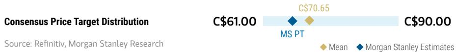

bar_line

| Consensus Price Target Distribution | Mean    | MS Estimates |
| ----------------------------------- | ------- | ------------------------ |
| C$61.00                             |         |                          |
| C$70.65                             |         |                          |
| C$90.00                             |         |                          |

RISK REWARD CHART AND OPTIONS IMPLIED PROBABILITIES (12M)   
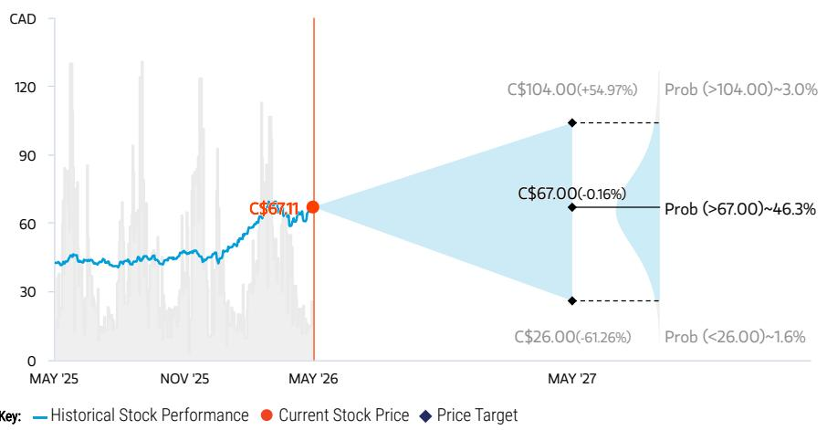

line

| Date       | Historical Stock Performance | Current Stock Price | Price Target |
| ---------- | ----------------------------- | ------------------- | ------------ |
| MAY '25    | ~40                           | -                   | -            |
| NOV '25    | ~45                           | -                   | -            |
| MAY '26    | C$67.11                       | -                   | -            |
| MAY '27    | -                             | C$67.00 (-0.16%)    | C$104.00 (+54.97%) |
| MAY '27    | -                             | Prob (>104.00)     | Prob (>104.00)   |
| MAY '27    | -                             | Prob (>67.00)      | Prob (>67.00)    |
| MAY '27    | -                             | Prob (<26.00)      | C$26.00 (-61.26%) |

Source: Refinitiv, MS, MS Institutional Equities Division. The probabilities of our Bull, Base, and Bear case scenarios playing out were estimated with implied volatility data from the options market as of 20 May 2026. All figures are approximate risk-neutral probabilities of the stock reaching beyond the scenario price in either three-months' or one-years' time. View explanation of Options Probabilities methodology here

# EQUAL-WEIGHT THESIS

■ High quality company at a premium valuation. CNQ has the most leverage to higher oil prices in our Canadian coverage and is a low-cost producer. CNQ trades at 8% FCF, slightly higher than the peer average (7%), while EV/DACF is roughly in-line.   
■ Net debt reduction progression, accelerating shareholder returns. After reaching C\$16 B of net debt as of the 1Q26 earnings release, CNQ will now return 75% of FCF to shareholders (up from 60%). We forecast '27 total shareholder yield of 7%, in-line with the peer average.

Consensus Rating Distribution   
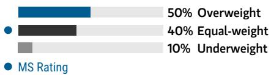

bar

| Category       | Value |
| -------------- | ----- |
| Overweight     | 50%   |
| Equal-weight   | 40%   |
| Underweight    | 10%   |

Source: Refinitiv, MS

# Risk Reward Themes

Self-help: Positive

View descriptions of Risk Rewards Themes here

# BULL CASE

# 9.6x 2027e DACF of C\$24 B

Bull case of C\$104/sh which is a 50/50 blend of 1) a target multiple of 8.0x 2027e EV/DACF (C\$113/share) and 2) our discounted cash flow value of C\$95/share (with a WACC of 7.7% and terminal EV/EBITDA multiple of 6.5x). Assumes long-term (2027+) prices of US\$95.00 Brent, US\$4.25 HH, refining cracks increase \~10%, carbon prices flat from 2022-2030.

# C\$104.00

# BASE CASE

# 8.6x 2027e DACF.

Base case of C\$67/sh which is a 50/50 blend of 1) a target multiple of 7.5x 2027e EV/DACF (C\$72/share) and 2) our discounted cash flow value of C\$62/share (with a WACC of 7.4% and terminal EV/EBITDA multiple of 5.7x). Assumes long-term (2027+) prices of US\$75.00 Brent, US\$3.75 HH, WTI-WCS of US\$15, carbon prices increase C\$15/tonne per year through 2030.

# C\$67.00

# BEAR CASE

# C\$26.00

# 6.4x 2027e DACF of C\$11 B

Bear case of C\$18/sh which is a 50/50 blend of 1) a target multiple of 7.5x 2027e EV/DACF (C\$24/share) and 2) our discounted cash flow value of C\$13/share (with a WACC of 7.7% and terminal EV/EBITDA multiple of 3.1x). Assumes long-term (2027+) prices of US\$50.00 Brent, US\$3.25 HH, refining cracks decline \~10%, carbon price increases by C\$30/tonne per year through 2030.

# Risk Reward – Canadian Natural Resources Ltd (CNQ.TO)

KEY EARNINGS INPUTS 

<table><tr><td>Drivers</td><td>2025</td><td>2026e</td><td>2027e</td><td>2028e</td></tr><tr><td>Total Production (Mboe/d)</td><td>1,571</td><td>1,645</td><td>1,684</td><td>1,673</td></tr><tr><td>Downstream Throughput (Mbbl/d)</td><td>19</td><td>24</td><td>24</td><td>24</td></tr><tr><td>Total Capex (C$MM) (C$)</td><td>6,579</td><td>6,851</td><td>5,737</td><td>5,882</td></tr></table>

# INVESTMENT DRIVERS

• Leadership in carbon capture   
- Highest leverage to rising oil prices among peers   
- Lowest-cost Canadian upstream producer

# GLOBAL REVENUE EXPOSURE

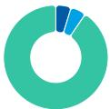

0-10% MEA   
0-10% UK   
90-100% North America

Source: MS Estimate View explanation of regional hierarchies here

# MS ALPHA MODELS

3/5

MOST

3 Month

Horizon

Source: Refinitiv, FactSet, MS; 1 is the highest favored Quintile and 5 is the least favored Quintile

# RISKS TO PT/RATING

# RISKS TO UPSIDE

• Crude prices are higher than expected   
• Material narrowing of WTI-WCS differentials

# RISKS TO DOWNSIDE

• Commodities prices materially decline   
- Exposed to higher volatility to crude prices relative to peers due to lack of downstream   
• Capital cost inflation and execution risk, and geopolitical risks

# OWNERSHIP POSITIONING

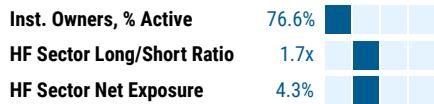

bar

| Category | Value |
| -------- | ----- |
| Inst. Owners, % Active | 76.6% |
| HF Sector Long/Short Ratio | 1.7x |
| HF Sector Net Exposure | 4.3% |

Refinitiv; MSPB Content. Includes certain hedge fund exposures held with MSPB. Information may be inconsistent with or may not reflect broader market trends. Long/Short Ratio = Long Exposure / Short exposure. Sector % of Total Net Exposure = (For a particular sector: Long Exposure - Short Exposure) / (Across all sectors: Long Exposure – Short Exposure).

# MS ESTIMATES VS. CONSENSUS

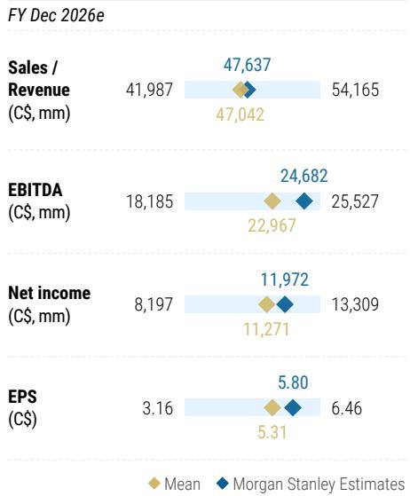

bar_line

FY Dec 2026e
| Metric | FY Dec 2026e (Mean) | FY Dec 2026e (MS Estimates) |
| :--- | :--- | :--- |
| Sales / Revenue (C$, mm) | 41,987 | 47,637 |
| EBITDA (C$, mm) | 18,185 | 24,682 |
| Net income (C$, mm) | 8,197 | 11,972 |
| EPS (C$) | 3.16 | 5.80 |
| Sales / Revenue (C$, mm) | 41,987 | 47,042 |
| EBITDA (C$, mm) | 18,185 | 22,967 |
| Net income (C$, mm) | 8,197 | 11,271 |
| EPS (C$) | 3.16 | 5.31 |
| Sales / Revenue (C$, mm) | 54,165 | 47,637 |
| EBITDA (C$, mm) | 25,527 | 24,682 |
| Net income (C$, mm) | 13,309 | 11,972 |
| EPS (C$) | 6.46 | 5.80 |

Source: Refinitiv, MS

# Risk Reward – ConocoPhillips (COP.N)

High quality, low cost portfolio underpins attractive FCF and return of cash

# PRICE TARGET \$153.00

Base case of \$153/share, which is a 50/50 blend of 1) a target multiple of 6.0x 2027e EV/EBITDA (\$151/share) and 2) our NAV of \$155/share (with a WACC of 8.7%).

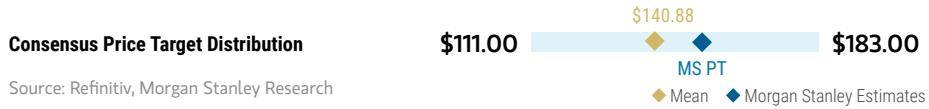

bar_line

| Consensus Price Target Distribution | Value    |
| ----------------------------------- | -------- |
| Mean                                | $140.88  |
| MS Estimates             | $183.00  |
Source: Refinitiv, MS

RISK REWARD CHART AND OPTIONS IMPLIED PROBABILITIES (12M)   
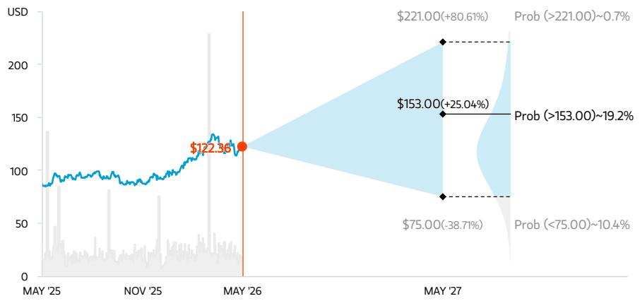

line

| Date     | Value    |
| -------- | -------- |
| MAY '26  | $122.36  |
| MAY '27  | $75.00   |
| MAY '27  | $153.00  |
| MAY '27  | $221.00  |
| MAY '27  | Prob (>221.00) ~0.7% |
| MAY '27  | Prob (>153.00) ~19.2% |
| MAY '27  | Prob (<75.00) ~10.4% |

Key: — Historical Stock Performance ● Current Stock Price ◆ Price Target   
Source: Refinitiv, MS, MS Institutional Equities Division. The probabilities of our Bull, Base, and Bear case scenarios playing out were estimated with implied volatility data from the options market as of 20 May 2026. All figures are approximate risk-neutral probabilities of the stock reaching beyond the scenario price in either three-months' or one-years' time. View explanation of Options Probabilities methodology here

# OVERWEIGHT THESIS

■ COP checks all the boxes for sustained outperformance: excellent management, disciplined investment, and consistent return of cash coupled with a high quality, low cost portfolio that can deliver an attractive combination of FCF and shareholder returns.   
■ Strong growth ahead. Delivery of long term projects (Alaska, Qatar, and Port Arthur LNG) underpin an impressive FCF CAGR of 14% through the rest of the decade.   
■ Resilient to lower commodity prices. COP's strong cash balance provides financial flexibility and resiliency to lower prices while its unhedged exposure allows for upside participation.

Consensus Rating Distribution   
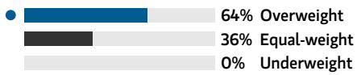

bar

| Category | Value (%) |
|---|---|
| Overweight | 64 |
| Equal-weight | 36 |
| Underweight | 0 |

MS Rating   
Source: Refinitiv, MS

# Risk Reward Themes

Self-help: Positive

View descriptions of Risk Rewards Themes here

# BULL CASE

# \$221.00

# BASE CASE

# \$153.00

# BEAR CASE

# \$75.00

# 7.3x 2027e EV/EBITDA of \$40 B

Bull Price deck: WTI \$90.00, Brent \$95.00, HH \$4.25. Bull case of \$221/share, which is a 50/50 blend of 1) a target multiple of 6.0x 2027e EV/EBITDA (\$216/share) and 2) our NAV of \$226/share.

# 6.8x 2027e EV/EBITDA of \$31 B

Long-term (2027+) Base Price deck: WTI \$70.00, Brent \$75.00, HH \$3.75. Base case of \$153/share, which is a 50/50 blend of 1) a target multiple of 6.0x 2027e EV/EBITDA (\$151/share) and 2) our NAV of \$155/share (with a WACC of 8.7%).

# 5.5x 2027e EV/EBITDA of \$20 B

Bear Price deck: WTI \$50.00, Brent \$55.00, HH \$3.25. Bear case of \$75/share, which is a 50/50 blend of 1) a target multiple of 6.0x 2027e EV/EBITDA (\$86/share) and 2) our NAV of \$63/share.

# Risk Reward – ConocoPhillips (COP.N)

KEY EARNINGS INPUTS 

<table><tr><td>Drivers</td><td>2025</td><td>2026e</td><td>2027e</td><td>2028e</td></tr><tr><td>Oil Production (Mbbl/d)</td><td>1,279</td><td>1,223</td><td>1,264</td><td>1,282</td></tr><tr><td>Total Production (Mboe/d)</td><td>2,375</td><td>2,302</td><td>2,394</td><td>2,431</td></tr><tr><td>Realized Oil Price ($)</td><td>65.73</td><td>90.08</td><td>71.61</td><td>71.26</td></tr><tr><td>Realized Gas Price ($)</td><td>4.33</td><td>4.90</td><td>5.12</td><td>5.16</td></tr><tr><td>EBITDA Margin per Boe ($)</td><td>29.34</td><td>42.36</td><td>34.73</td><td>35.13</td></tr></table>

# INVESTMENT DRIVERS

- Commodity prices   
- Capex   
- Capital efficiency   
- Return of cash   
• Major capital project execution including Alaska and North America unconventionals

# GLOBAL REVENUE EXPOSURE

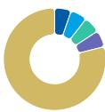  
0-10%   
APAC, ex Japan, Mainland China and India   
0-10%   
Europe ex UK   
0-10%   
MEA   
0-10%   
Mainland China   
70-80°   
North America

Source: MS Estimate View explanation of regional hierarchies here

# MS ALPHA MODELS

1/5 BEST

24 Month Horizon

2/5 MOST

3 Month Horizon

Source: Refinitiv, FactSet, MS; 1 is the highest favored Quintile and 5 is the least favored Quintile

# RISKS TO PT/RATING

# RISKS TO UPSIDE

• Higher commodity prices   
• Upside to Alaska resource discovery   
• Better well performance in Lower 48

# RISKS TO DOWNSIDE

- Lower commodity prices   
- Cost inflation   
- Alaska discovery has less potential resources than expected   
• Federal acreage exposure in Alaska   
- Worse than expected well results in the Eagle Ford, Permian, and Bakken

# OWNERSHIP POSITIONING

Inst. Owners, % Active

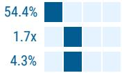

HF Sector Long/Short Ratio

HF Sector Net Exposure

1.7x

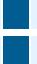

Refinitiv; MSPB Content. Includes certain hedge fund exposures held with MSPB. Information may be inconsistent with or may not reflect broader market trends. Long/Short Ratio = Long Exposure / Short exposure. Sector % of Total Net Exposure = (For a particular sector: Long Exposure - Short Exposure) / (Across all sectors: Long Exposure – Short Exposure).

# MS ESTIMATES VS. CONSENSUS

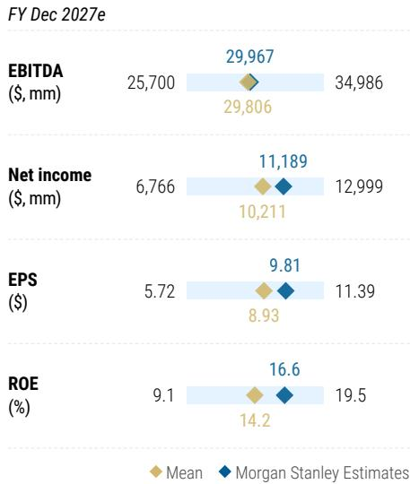

bar_line

FY Dec 2027e
| Metric | Mean ($) | MS Estimates ($) |
| :--- | :--- | :--- |
| EBITDA ($, mm) | 25,700 | 29,967 |
| Net income ($, mm) | 6,766 | 11,189 |
| EPS ($) | 5.72 | 9.81 |
| ROE (%) | 9.1 | 16.6 |
| (Note: The values for the diamond series are estimated based on the provided code) | 29,806 | 34,986 |
| (Note: The diamond series is estimated based on the provided code) | 10,211 | 12,999 |
| (Note: The diamond series is estimated based on the provided code) | 8.93 | 11.39 |
| (Note: The diamond series is estimated based on the provided code) | 14.2 | 19.5 |

Source: Refinitiv, MS

# Risk Reward – Cenovus Energy (CVE.TO)

Integration upside & execution on debt paydown

# PRICE TARGET C\$43.00

Base case of C\$43/share which is a 50/50 blend of 1) a target multiple of 6.5x 2027e EV/DACF (C\$42/share) and 2) our discounted cash flow value of C\$44/share (with a WACC of 9.3% and terminal EV/EBITDA multiple of 5.2x).

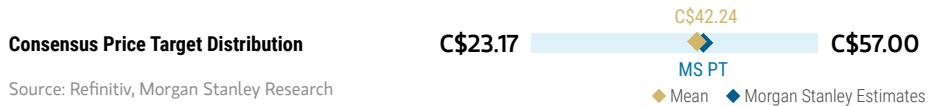

bar_line

| Consensus Price Target Distribution | Value    |
| ----------------------------------- | -------- |
| C$23.17                             | 23.17    |
| C$42.24                             | 42.24    |
| C$57.00                             | 57.00    |

RISK REWARD CHART AND OPTIONS IMPLIED PROBABILITIES (12M)   
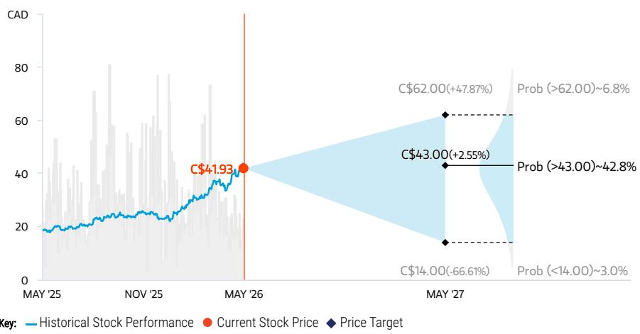

line

| Date       | Historical Stock Performance | Current Stock Price | Price Target |
| ---------- | ----------------------------- | ------------------- | ------------ |
| MAY '25    | ~20                           | -                   | -            |
| NOV '25    | ~25                           | -                   | -            |
| MAY '26    | ~41.93                        | -                   | -            |
| MAY '27    | -                             | C$43.00              | C$14.00      |
| MAY '27    | -                             | +43.00              | +62.00       |
| MAY '27    | -                             | +47.87%             | Prob (-14.00)|
| MAY '27    | -                             | +2.55%              | Prob (>43.00)|
| MAY '27    | -                             | ~42.8%              | Prob (>62.00)|
| MAY '27    | -                             | ~6.8%               | Prob (>62.00)|
| MAY '27    | -                             | ~-                  | Prob (<14.00)|

Source: Refinitiv, MS, MS Institutional Equities Division. The probabilities of our Bull, Base, and Bear case scenarios playing out were estimated with implied volatility data from the options market as of 20 May 2026. All figures are approximate risk-neutral probabilities of the stock reaching beyond the scenario price in either three-months' or one-years' time. View explanation of Options Probabilities methodology here

# OVERWEIGHT THESIS

- Attractive valuation. Stock underperformed Canadian peers by \~12% since the start of 2024, tied in part to weak refining performance. With a leading in-situ production portfolio, CVE screens cheap with an EV/DACF of 6.5x in '27, lower than their Canadian peer average of 8.8x.   
■ FCF inflection. Delivery and ramp-up of CVE's large slate of upstream projects drives 11% FCF yield in 2026 (vs 10% from peers), and 8% in 2027 (7% from peers).

Consensus Rating Distribution   
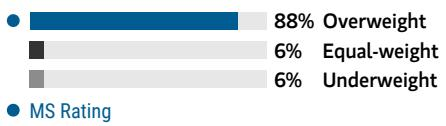

bar

| Category | Value (%) |
|---|---|
| Overweight | 88 |
| Equal-weight | 6 |
| Underweight | 6 |
MS Rating

Source: Refinitiv, MS

# Risk Reward Themes

Self-help: Positive

View descriptions of Risk Rewards Themes here

# BULL CASE

# 7.7x 2027e DACF of C\$15.9 B

Bull case of C\$62/sh which is a 50/50 blend of 1) a target multiple of 6.0x 2027e EV/DACF (C\$57/share) and 2) our discounted cash flow value of C\$67/share (with a WACC of 9.3% and terminal EV/EBITDA multiple of 5.9x). Assumes long-term (2027+) prices of US\$95.00 Brent, US\$4.25 HH, refining cracks increase \~10%, carbon prices flat from 2022-2030.

# C\$62.00

# BASE CASE

# 7.4x 2027e DACF

Base case of C\$43/share which is a 50/50 blend of 1) a target multiple of 6.5x 2027e EV/DACF (C\$42/share) and 2) our discounted cash flow value of C\$44/share (with a WACC of 9.3% and terminal EV/EBITDA multiple of 5.2x). Assumes long-term (2027+) prices of US\$75.00 Brent, US\$3.75 HH, WTI-WCS of US\$15, carbon prices increase C\$15/tonne per year through 2030.

# C\$43.00

# BEAR CASE

# C\$14.00

# 5.1x 2027e DACF of C\$6.7 B

Bear case of C\$14/sh which is a 50/50 blend of 1) a target multiple of 6.0x 2027e EV/DACF (C\$17/share) and 2) our discounted cash flow value of C\$11/share (with a WACC of 9.3% and terminal EV/EBITDA multiple of 2.1x). Assumes long-term (2027+) prices of US\$55.00 Brent, US\$3.25 HH, refining cracks decline \~10%, carbon price increases by C\$30/tonne per year through 2030.

# Risk Reward – Cenovus Energy (CVE.TO)

KEY EARNINGS INPUTS 

<table><tr><td>Drivers</td><td>2025</td><td>2026e</td><td>2027e</td><td>2028e</td></tr><tr><td>Total Production (Mboe/d)</td><td>834</td><td>972</td><td>1,025</td><td>1,075</td></tr><tr><td>Downstream Throughput (Mbbl/d)</td><td>629</td><td>441</td><td>459</td><td>462</td></tr><tr><td>Total Capex (C$MM) (C$)</td><td>4,907</td><td>5,111</td><td>4,877</td><td>4,713</td></tr></table>

# INVESTMENT DRIVERS

• Integration of Husky Energy

# GLOBAL REVENUE EXPOSURE

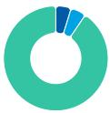

0-10% APAC, ex Japan, Mainland China and India   
0-10% Mainland China   
90-100% North America

Source: MS Estimate View explanation of regional hierarchies here

# MS ALPHA MODELS

5/5

MOST

3 Month

Horizon

Source: Refinitiv, FactSet, MS; 1 is the highest favored Quintile and 5 is the least favored Quintile

# RISKS TO PT/RATING

# RISKS TO UPSIDE

• Crude prices are higher than expected   
• Execution on debt paydown allows for increased shareholder returns   
- Potential for physical integration between Foster Creek and Christina Lake with Lloydminster   
- Renewables expansion

# RISKS TO DOWNSIDE

• Commodity prices decline materially   
- Anticipated pipelines fail to come online, causing widening of WTI-WCS differential   
- Downstream margin expansion fails to materialize

# OWNERSHIP POSITIONING

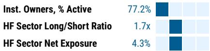

bar

| Category                  | Value  |
| ------------------------- | ------ |
| Inst. Owners, % Active    | 77.2%  |
| HF Sector Long/Short Ratio | 1.7x   |
| HF Sector Net Exposure    | 4.3%   |

Refinitiv; MSPB Content. Includes certain hedge fund exposures held with MSPB. Information may be inconsistent with or may not reflect broader market trends. Long/Short Ratio = Long Exposure / Short exposure. Sector % of Total Net Exposure = (For a particular sector: Long Exposure - Short Exposure) / (Across all sectors: Long Exposure – Short Exposure).

# MS ESTIMATES VS. CONSENSUS

FY Dec 2027e

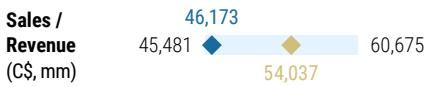

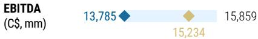

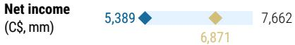

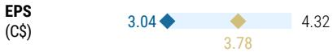

◆ Mean ◆ MS Estimates

Source: Refinitiv, MS

# Risk Reward – Imperial Oil Ltd (IMO.TO)

Competitive downstream but premium valuation priced in

# PRICE TARGET C\$141.00

Base case of C\$141/share which is a 50/50 blend of 1) a target multiple of 9.0x 2027e EV/DACF (C\$150/share) and 2) our discounted cash flow value of C\$132/share (with a WACC of 8.5% and terminal EV/EBITDA multiple of 6.8x).

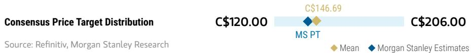

bar_line

| Consensus Price Target Distribution | Mean    | MS Estimates |
| ----------------------------------- | ------- | ------------------------ |
| C$120.00                            |         |                          |
| C$146.69                            |         |                          |
| C$206.00                            |         |                          |
Source: Refinitiv, MS

RISK REWARD CHART AND OPTIONS IMPLIED PROBABILITIES (12M)   
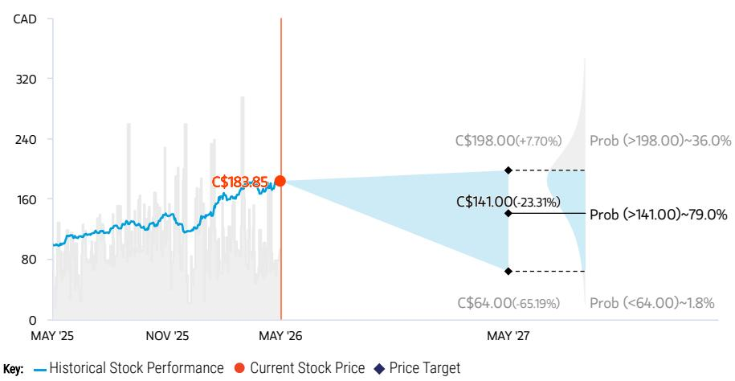

line

| Date     | Historical Stock Performance | Current Stock Price | Price Target |
| -------- | ----------------------------- | ------------------- | ------------ |
| MAY '25  | ~80                           | -                   | -            |
| NOV '25  | ~100                          | -                   | -            |
| MAY '26  | ~160                          | C$183.85            | -            |
| MAY '27  | -                             | -                   | C$64.00      |
| MAY '27  | -                             | -                   | C$141.00     |
| MAY '27  | -                             | -                   | C$198.00     |
| MAY '27  | -                             | -                   | Prob(>198.00)~36.0% |
| MAY '27  | -                             | -                   | Prob(>141.00)~79.0% |
| MAY '27  | -                             | -                   | Prob(<64.00)~1.8% |

Source: Refinitiv, MS, MS Institutional Equities Division. The probabilities of our Bull, Base, and Bear case scenarios playing out were estimated with implied volatility data from the options market as of 20 May 2026. All figures are approximate risk-neutral probabilities of the stock reaching beyond the scenario price in either three-months' or one-years' time. View explanation of Options Probabilities methodology here

# EQUAL-WEIGHT THESIS

A peer-leading balance sheet and strong downstream assets (3 refineries spanning eastern and western Canada) should allow the company to continue its strong cash flow generation. However, we note high capex in 2026-29 (\~C\$1.9 B) limits FCF upside. Additionally, the stock trades at a premium vs Canadian peers, which we think fairly prices in the advantaged balance sheet and downstream assets on a relative basis.

■ IMO is still in the early stages of its new energies investment, but we note the renewable diesel facility at Strathcona (20 Mbbl/d capacity) provides leverage to the upside.

■ IMO trades at a 2027 EV/DACF of 11.1X, well above the peer average of 7.3X.

Consensus Rating Distribution   
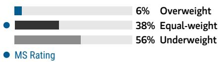

bar

| Category     | Value |
| ------------ | ----- |
| Overweight   | 6%    |
| Equal-weight | 38%   |
| Underweight  | 56%   |

Source: Refinitiv, MS

# BULL CASE

# 9.8x 2027e DACF of C\$10.2 B

Bull case of C\$198/sh which is a 50/50 blend of 1) a target multiple of 8.5x 2027e EV/DACF (C\$198/share) and 2) our discounted cash flow value of C\$197/share (with a WACC of 8.5% and terminal EV/EBITDA multiple of 7.3x). Assumes long-term (2027+) prices of US\$95 Brent, US\$4.25 HH, refining cracks increase \~10%, carbon prices flat from 2024-2030.

# C\$198.00

# BASE CASE

# 9.3x 2027e DACF

Base case of C\$141/share which is a 50/50 blend of 1) a target multiple of 9.0x 2027e EV/DACF (C\$150/share) and 2) our discounted cash flow value of C\$132share (with a WACC of 8.5% and terminal EV/EBITDA multiple of 6.8x). Assumes long-term (2027+) prices of US\$75.00 Brent, US\$3.75 HH, WTI-WCS of US\$15, carbon prices increase C\$15/tonne per year through 2030.

# C\$141.00

# BEAR CASE

# C\$64.00

# 7.6x 2027e DACF of C\$4.5 B

Bear case of C\$64/sh which is a 50/50 blend of 1) a target multiple of 8.5x 2027e EV/DACF (C\$71/share) and 2) our discounted cash flow value of C\$57/share (with a WACC of 8.5% and terminal EV/EBITDA multiple of 5.0x). Assumes long-term (2027+) prices of US\$55 Brent, US\$3.25 HH, refining cracks decline \~10%, carbon price increases by C\$30/tonne per year through 2030.

# Risk Reward – Imperial Oil Ltd (IMO.TO)

KEY EARNINGS INPUTS 

<table><tr><td>Drivers</td><td>2025</td><td>2026e</td><td>2027e</td><td>2028e</td></tr><tr><td>Total Production (Mboe/d)</td><td>438</td><td>444</td><td>463</td><td>468</td></tr><tr><td>Downstream Throughput (Mbbl/d)</td><td>402</td><td>394</td><td>401</td><td>401</td></tr><tr><td>Total Capex (C$MM) (C$)</td><td>2,027</td><td>2,078</td><td>1,812</td><td>1,839</td></tr></table>

# INVESTMENT DRIVERS

- Integrated model   
• Strong balance sheet   
- Commitment to cost reduction via reliability enhancements

# GLOBAL REVENUE EXPOSURE

100%

North America

Source: MS Estimate View explanation of regional hierarchies here

# MS ALPHA MODELS

4/5 MOST

3 Month Horizon

Source: Refinitiv, FactSet, MS; 1 is the highest favored Quintile and 5 is the least favored Quintile

# RISKS TO PT/RATING

# RISKS TO UPSIDE

• Crude prices are higher than expected   
• Stronger than expected downstream margins   
• NCIB acceleration and potential SIB

# RISKS TO DOWNSIDE

• Commodity prices decline materially   
• Material widening of WTI-WCS differentials   
• Outspending capex guidance

# OWNERSHIP POSITIONING

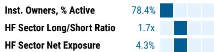

bar

| Category                  | Value  |
| ------------------------- | ------ |
| Inst. Owners, % Active    | 78.4%  |
| HF Sector Long/Short Ratio | 1.7x   |
| HF Sector Net Exposure    | 4.3%   |

Refinitiv; MSPB Content. Includes certain hedge fund exposures held with MSPB. Information may be inconsistent with or may not reflect broader market trends. Long/Short Ratio = Long Exposure / Short exposure. Sector % of Total Net Exposure = (For a particular sector: Long Exposure - Short Exposure) / (Across all sectors: Long Exposure – Short Exposure).

# MS ESTIMATES VS. CONSENSUS

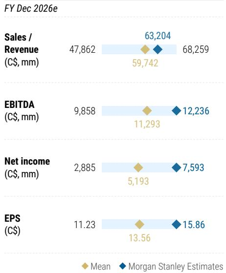

bar_line

FY Dec 2026e
| Metric | Mean (C$, mm) | MS Estimates (C$, mm) |
| :--- | :--- | :--- |
| Sales / Revenue | 47,862 | 63,204 |
| EBITDA | 9,858 | 12,236 |
| Net income | 2,885 | 7,593 |
| EPS | 11.23 | 15.86 |

Source: Refinitiv, MS

# Risk Reward – Chevron Corporation (CVX.N)

Strong acquisition in HES with attractive rate of change into 2026.

# PRICE TARGET \$214.00

Base case of \$214/share which is a 50/50 blend of 1) a target multiple of 9.0x 2027e EV/DACF (\$225/share) and 2) our discounted cash flow value of \$203/share (with a WACC of 8.1% and terminal EV/EBITDA multiple of 6.2x).

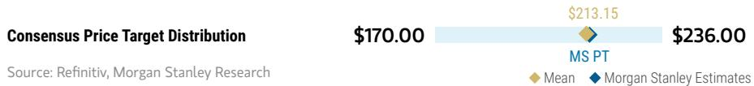

bar_line

| Category | Value    |
| -------- | -------- |
| MS PT    | $213.15  |
| MS Estimates | $236.00  |
| Mean     | $170.00  |

RISK REWARD CHART AND OPTIONS IMPLIED PROBABILITIES (12M)   
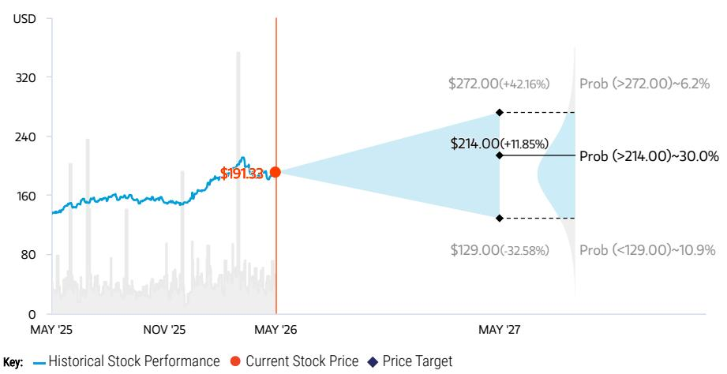  
Source: Refinitiv, MS, MS Institutional Equities Division. The probabilities of our Bull, Base, and Bear case scenarios playing out were estimated with implied volatility data from the options market as of 20 May 2026. All figures are approximate risk-neutral probabilities of the stock reaching beyond the scenario price in either three-months' or one-years' time. View explanation of Options Probabilities methodology here

# OVERWEIGHT THESIS

■ HES strengthens outlook. Through its acquisition of HES, CVX gains exposure to rising high margin volumes in Guyana, driving a 1.5% bump in the company's oil production CAGR for the remainder of the decade.   
■ Strong rate of change into 2026. By 2026, CVX expects \$12.5 B of FCF uplift from TCO, GoA, Permian, cost cutting initiatives, and HES. This leads to a FCF yield of 11% in '26 (at \$88 WTI).   
■ Durable FCF growth. With its '25 Investor Day, CVX highlighted a >10% FCF CAGR through 2030 underpinned by a low-risk, high-confidence set of investment opportunities.

Consensus Rating Distribution   
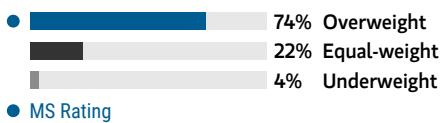

bar

| Category | Value (%) |
|---|---|
| Overweight | 74 |
| Equal-weight | 22 |
| Underweight | 4 |
MS Rating

Source: Refinitiv, MS

# Risk Reward Themes

Self-help: Positive

View descriptions of Risk Rewards Themes here

# BULL CASE

# \$272.00

# BASE CASE

# \$214.00

# BEAR CASE

# \$129.00

# 9.5x 2027e EV/DACF of \$60.5 B

Bull case of \$272 is based on a 50/50 blend of 1) a target multiple of 8.5x 2026e EV/DACF (\$276/share) and 2) our discounted cash flow value of \$269/share. Scenario assumes \$90.00 WTI, \$95 Brent, \$4.25 Henry Hub, and refining margins increase \~10%.

# 9.3x 2027e EV/DACF.

Base case of \$214/sh which is a 50/50 blend of 1) a target multiple of 9.0x 2027e EV/DACF (\$225/share) and 2) our discounted cash flow value of \$203/share (with a WACC of 8.1% and terminal EV/EBITDA multiple of 6.2x). Scenario assumes long-term (2027+) \$70.00 WTI, \$70 Brent, \$3.75 Henry Hub.

# 8.1x 2027e EV/DACF of \$35.6 B

Bear case of \$129 is based on a 50/50 blend of 1) a target multiple of 8.5x 2027e EV/DACF (\$135/share) and 2) our discounted cash flow value of \$123/share. Scenario assumes \$50.00 WTI, \$55 Brent, \$3.25 Henry Hub, and refining margins decline \~10%.

# Risk Reward – Chevron Corporation (CVX.N)

KEY EARNINGS INPUTS 

<table><tr><td>Drivers</td><td>2025</td><td>2026e</td><td>2027e</td><td>2028e</td></tr><tr><td>Oil Production (Mbbl/d)</td><td>1,827</td><td>2,004</td><td>2,093</td><td>2,094</td></tr><tr><td>Total Production (Mboe/d)</td><td>3,722</td><td>3,999</td><td>4,103</td><td>4,096</td></tr><tr><td>Realized Oil Price ($)</td><td>62.68</td><td>86.23</td><td>67.16</td><td>66.87</td></tr><tr><td>Realized Gas Price ($)</td><td>5.22</td><td>6.28</td><td>5.68</td><td>5.67</td></tr><tr><td>EBITDA Margin per Boe ($)</td><td>30.48</td><td>47.96</td><td>36.75</td><td>37.53</td></tr></table>

# INVESTMENT DRIVERS

- Return of cash   
- Capex   
- Capital efficiency   
- Commodity prices including oil & gas, LNG, crack spreads, and chemicals margins   
• Major capital projects including Tengiz and unconventionals in the Permian, Canada, and Argentina

# GLOBAL REVENUE EXPOSURE

0-10% Latin America
0-10% Mainland China
0-10% UK
10-20% MEA
30-40% APAC, ex Japan, Mainland China and India
40-50% North America

Source: MS Estimate View explanation of regional hierarchies here

# MS ALPHA MODELS

1/5 BEST

24 Month Horizon

5/5
MOST

3 Month Horizon

Source: Refinitiv, FactSet, MS; 1 is the highest favored Quintile and 5 is the least favored Quintile

# RISKS TO PT/RATING

# RISKS TO UPSIDE

- Higher commodity prices, including liquefied natural gas (LNG)   
• Outperformance of Guyana development   
- Addressing long term growth questions through M&A or exploration program   
- Permian well performance improvements

# RISKS TO DOWNSIDE

• Lower commodity prices   
- TCO concession agreement is not renewed early next decade   
- Long-term upstream growth lags peers   
- Geopolitical risk

# OWNERSHIP POSITIONING

<table><tr><td>Inst. Owners, % Active</td><td>45.3%</td><td colspan="3"></td></tr><tr><td>HF Sector Long/Short Ratio</td><td>1.7x</td><td colspan="3"></td></tr><tr><td>HF Sector Net Exposure</td><td>4.3%</td><td colspan="3"></td></tr></table>

Refinitiv; MSPB Content. Includes certain hedge fund exposures held with MSPB. Information may be inconsistent with or may not reflect broader market trends. Long/Short Ratio = Long Exposure / Short exposure. Sector % of Total Net Exposure = (For a particular sector: Long Exposure - Short Exposure) / (Across all sectors: Long Exposure – Short Exposure).

# MS ESTIMATES VS. CONSENSUS

<table><tr><td colspan="3">FY Dec 2027e</td></tr><tr><td rowspan="2">EBITDA ($, mm)</td><td rowspan="2">44,522</td><td>55,038</td></tr><tr><td>58,383</td></tr><tr><td rowspan="2">Net income ($, mm)</td><td rowspan="2">15,558</td><td>21,798</td></tr><tr><td>23,011</td></tr><tr><td rowspan="2">EPS ($)</td><td rowspan="2">8.29</td><td>11.40</td></tr><tr><td>12.14</td></tr><tr><td rowspan="2">ROE (%)</td><td rowspan="2">7.6</td><td>11.2</td></tr><tr><td>11.9</td></tr></table>

Source: Refinitiv, MS

# Risk Reward – Suncor Energy Inc (SU.TO)

Solid FCF unlock and asset integration at fair valuation.

# PRICE TARGET C\$93.00

Base case of C\$93/share which is a 50/50 blend of 1) a target multiple of 7.5x 2027e EV/DACF (C\$96/share) and 2) our discounted cash flow value of C\$89/share (with a WACC of 8.8% and terminal EV/EBITDA multiple of 5.3x).

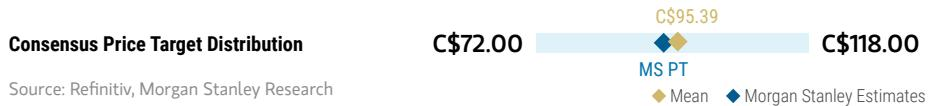

bar_line

| Category | Value    |
| -------- | -------- |
| C$72.00  | C$95.39  |
| C$118.00 |          |

RISK REWARD CHART AND OPTIONS IMPLIED PROBABILITIES (12M)   
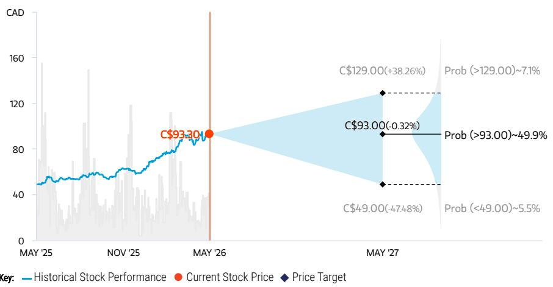

line

| Date       | Historical Stock Performance | Current Stock Price | Price Target |
| ---------- | ----------------------------- | ------------------- | ------------ |
| MAY '25    | ~45                           | -                   | -            |
| NOV '25    | ~50                           | -                   | -            |
| MAY '26    | ~85                           | $93.30              | -            |
| MAY '27    | -                             | $129.00(+38.26%)   | $129.00~+7.1% |
|         | -                             | $93.00(-0.32%)     | $93.00~+49.9% |
|         | -                             | $49.00(-47.48%)    | $49.00~+5.5% |

Source: Refinitiv, MS, MS Institutional Equities Division. The probabilities of our Bull, Base, and Bear case scenarios playing out were estimated with implied volatility data from the options market as of 20 May 2026. All figures are approximate risk-neutral probabilities of the stock reaching beyond the scenario price in either three-months' or one-years' time. View explanation of Options Probabilities methodology here

# EQUAL-WEIGHT THESIS

Valuation. Since the start of 2024, SU has outperformed Canadian peers \~25% on the back of a series of strong quarterly results, and higher shareholder returns. We now estimate '27 FCF yield of \~7%, in-line with the peer average.   
■ More growth and visibility. The '26 investor day outlined C\$2 B of FFF growth (at \$65 WTI) through 2028 and a \$5 dollar reduction in WTI breakeven. SU also provided visibility to long term bitumen supply options into next decade.   
■ Shareholder returns. SU trades at a 7% 2027E total shareholder return yield, higher than the peer average of 6%.

Consensus Rating Distribution   
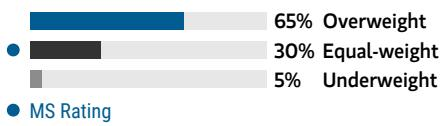

bar

| Category       | Value |
| -------------- | ----- |
| Overweight     | 65%   |
| Equal-weight   | 30%   |
| Underweight    | 5%    |
| MS Rating      |       |

Source: Refinitiv, MS

# Risk Reward Themes

Self-help: Positive

View descriptions of Risk Rewards Themes here

# BULL CASE

# C\$129.00

# 8.9x 2027e DACF of C\$18.4 B

Bull case of C\$129/sh which is a 50/50 blend of 1) a target multiple of 7.5x 2027e EV/DACF (C\$135/share) and 2) our discounted cash flow value of C\$122/share (with a WACC of 8.8% and terminal EV/EBITDA multiple of 6.0x). Assumes long-term (2027+) prices of US\$95.0 Brent, US\$4.25 HH, refining cracks increase \~10%, carbon prices flat from 2022-2030.

# BASE CASE

# 8.3x 2027e DACF.

Base case of C\$93/share which is a 50/50 blend of 1) a target multiple of 7.5x 2027e EV/DACF (C\$196/share) and 2) our discounted cash flow value of C\$89/share (with a WACC of 8.8% and terminal EV/EBITDA multiple of 5.4x). Assumes long-term (2027+) prices of US\$75.00 Brent, US\$3.75 HH, WTI-WCS of US\$15, carbon prices increase C\$15/tonne per year through 2030.

# C\$93.00

# BEAR CASE

# C\$49.00

# 7.2x 2027e DACF of C\$9.6 B

Bear case of C\$49/sh which is a 50/50 blend of 1) a target multiple of 7.5x 2027e EV/DACF (C\$60/share) and 2) our discounted cash flow value of C\$37/share (with a WACC of 8.8% and terminal EV/EBITDA multiple of 3.6x). Assumes long-term (2027+) prices of US\$55.00 Brent, US\$3.25 HH, refining cracks decline \~10%, carbon price increases by C\$30/tonne per year through 2030.

# Risk Reward – Suncor Energy Inc (SU.TO)

KEY EARNINGS INPUTS 

<table><tr><td>Drivers</td><td>2025</td><td>2026e</td><td>2027e</td><td>2028e</td></tr><tr><td>Total Production (Mboe/d)</td><td>860</td><td>864</td><td>912</td><td>965</td></tr><tr><td>Downstream Throughput (Mbbl/d)</td><td>480</td><td>475</td><td>478</td><td>478</td></tr><tr><td>Total Capex (C$MM) (C$)</td><td>5,658</td><td>5,692</td><td>5,645</td><td>5,679</td></tr></table>

# INVESTMENT DRIVERS

- Integrated model   
- Well-developed cash return and capital allocation strategy   
- Peer-leading renewables expansion plan; allocating \~10% of annual budget on investments advancing low-carbon energy offerings

# GLOBAL REVENUE EXPOSURE

100%

North America

Source: MS Estimate View explanation of regional hierarchies here

# MS ALPHA MODELS

3/5

MOST

3 Month

Horizon

Source: Refinitiv, FactSet, MS; 1 is the highest favored Quintile and 5 is the least favored Quintile

# RISKS TO PT/RATING

# RISKS TO UPSIDE

• Crude prices are higher than expected   
- Increasing cash returns   
• Further expansion into renewables   
- Accelerated achievement of breakeven reduction

# RISKS TO DOWNSIDE

• Commodity prices decline materially   
- Downstream margins narrow   
• Capital cost inflation, execution risk on renewables projects, and geopolitical risks

# OWNERSHIP POSITIONING

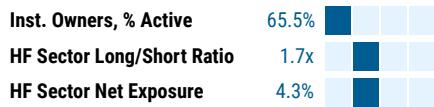

bar

| Category | Value |
| -------- | ----- |
| Inst. Owners, % Active | 65.5% |
| HF Sector Long/Short Ratio | 1.7x |
| HF Sector Net Exposure | 4.3% |

Refinitiv; MSPB Content. Includes certain hedge fund exposures held with MSPB. Information may be inconsistent with or may not reflect broader market trends. Long/Short Ratio = Long Exposure / Short exposure. Sector % of Total Net Exposure = (For a particular sector: Long Exposure - Short Exposure) / (Across all sectors: Long Exposure – Short Exposure).

# MS ESTIMATES VS. CONSENSUS

FY Dec 2026e

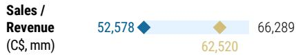

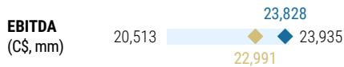

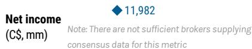

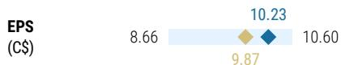

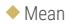

♦ MS Estimates

Source: Refinitiv, MS

# Risk Reward – Diamondback Energy Inc (FANG.O)

Low cost of supply supporting high FCF yield and deleveraging

# PRICE TARGET \$229.00

Base case of \$229/share, which is a 50/50 blend of 1) a target multiple of 6.0x consolidated 2027e EV/EBITDA (\$229/share) and 2) our NAV of \$230/share.

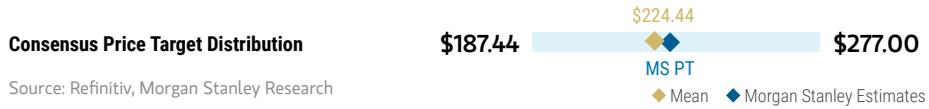

bar_line

| Consensus Price Target Distribution | Value    |
| ----------------------------------- | -------- |
| MS PT                               | $224.44  |
| MS PT                               | $187.44  |
| MS Estimates             | $277.00  |

RISK REWARD CHART AND OPTIONS IMPLIED PROBABILITIES (12M)   
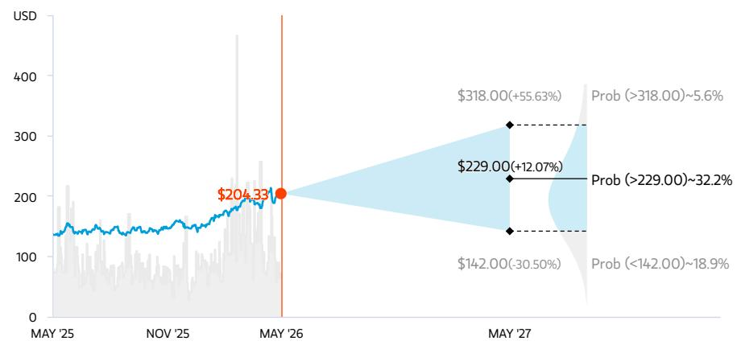

line

| Date     | Value    |
| -------- | -------- |
| MAY '25  | $204.33  |
| MAY '26  | $318.00  |
| MAY '27  | $142.00  |
| Prob (>318.00) ~5.6% | $318.00  |
| Prob (>229.00) ~32.2% | $229.00  |
| Prob (<142.00) ~18.9% | $142.00  |

Key: — Historical Stock Performance ● Current Stock Price ◆ Price Target   
Source: Refinitiv, MS, MS Institutional Equities Division. The probabilities of our Bull, Base, and Bear case scenarios playing out were estimated with implied volatility data from the options market as of 20 May 2026. All figures are approximate risk-neutral probabilities of the stock reaching beyond the scenario price in either three-months' or one-years' time. View explanation of Options Probabilities methodology here

# OVERWEIGHT THESIS

- Low cost of supply relative to peers.
FANG's 2026 FCF breakeven price of \~\$39 (post-base dividend), one of the lowest in our coverage, fortifying FANG as one of the lowest-cost producers in the Permian.   
■ Strong FCF generation through the cycle. We estimate FANG's FCF yield of \~13% in '26 at \~\$88 WTI, above peers' median, driven by strong capital efficiency gains, Endeavor synergies trending ahead of plan, and FCF accretion from the Double Eagle acquisition.   
■ Focus on lower leverage and strong shareholder returns. While FANG's consolidated net debt is expected to increase post the Double Eagle deal and VNOM/Sitio merger, we expect net debt to fall <\$10 B by YE26 at prices near strip.

Consensus Rating Distribution   
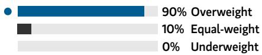

bar

| Category | Value (%) |
|---|---|
| Overweight | 90 |
| Equal-weight | 10 |
| Underweight | 0 |

MS Rating   
Source: Refinitiv, MS

# BULL CASE

# 6.8x 2027 EV/EBITDA

Long-term (2027+) Bull Price deck: WTI \$90, HH \$4.25. Bull case of \$318/share, which is a 50/50 blend of 1) a target multiple of 6.0x consolidated 2027e EV/EBITDA (\$331/share) and 2) our NAV of \$305/share. This blended \$318/share bull case equates to 6.8x 2027 EV/EBITDAX.

# \$318.00

# BASE CASE

# \$229.00

# 7.2x 2027 EV/EBITDA

Long-term (2027+) Base Price deck: WTI \$70, HH \$3.75. Base case of \$229/share, which is a 50/50 blend of 1) a target multiple of 6.0x consolidated 2027e EV/EBITDA (\$229/share) and 2) our NAV of \$230/share. This blended \$229/share base case equates to 7.2x 2027 EV/EBITDAX.

# BEAR CASE

# \$142.00

# 8.3x 2027 EV/EBITDA

Long-term (2027+) Bear Price deck: WTI \$50, HH \$3.25. Bear case of \$142/share, which is a 50/50 blend of 1) a target multiple of 6.0x consolidated 2027e EV/EBITDA (\$129/share) and 2) our NAV of \$155/share. This blended \$142/share bear case equates to 8.3x 2027 EV/EBITDAX.

# Risk Reward – Diamondback Energy Inc (FANG.O)

KEY EARNINGS INPUTS 

<table><tr><td>Drivers</td><td>2025</td><td>2026e</td><td>2027e</td><td>2028e</td></tr><tr><td>Oil Production (MBbl/d)</td><td>497</td><td>525</td><td>535</td><td>541</td></tr><tr><td>Total Production (MBoe/d)</td><td>921</td><td>980</td><td>990</td><td>1,000</td></tr><tr><td>Realized Oil Price ($/Bbl)</td><td>63.14</td><td>89.51</td><td>69.33</td><td>68.54</td></tr><tr><td>Realized Gas Price ($/Mcf)</td><td>1.84</td><td>0.02</td><td>2.31</td><td>2.24</td></tr><tr><td>EBITDAX Margin ($/Boe)</td><td>30.56</td><td>40.78</td><td>33.09</td><td>32.70</td></tr></table>

# INVESTMENT DRIVERS

- Cost efficiencies in drilling & completing wells   
- Increasing return of cash to shareholders   
• Capital discipline in higher oil price scenarios

# GLOBAL REVENUE EXPOSURE

100%

North America

Source: MS Estimate View explanation of regional hierarchies here

# MS ALPHA MODELS

1/5 BEST

24 Month Horizon

1/5
MOST

3 Month Horizon

Source: Refinitiv, FactSet, MS; 1 is the highest favored Quintile and 5 is the least favored Quintile

# RISKS TO PT/RATING

# RISKS TO UPSIDE

• Reduction of operating and development costs   
- Improvements to well productivity

# RISKS TO DOWNSIDE

- Increased leverage   
- Poor execution

# OWNERSHIP POSITIONING

<table><tr><td>Inst. Owners, % Active</td><td>49.9%</td><td colspan="4"></td></tr><tr><td>HF Sector Long/Short Ratio</td><td>1.7x</td><td colspan="4"></td></tr><tr><td>HF Sector Net Exposure</td><td>4.3%</td><td colspan="4"></td></tr></table>

Refinitiv; MSPB Content. Includes certain hedge fund exposures held with MSPB. Information may be inconsistent with or may not reflect broader market trends. Long/Short Ratio = Long Exposure / Short exposure. Sector % of Total Net Exposure = (For a particular sector: Long Exposure - Short Exposure) / (Across all sectors: Long Exposure – Short Exposure).

# MS ESTIMATES VS. CONSENSUS

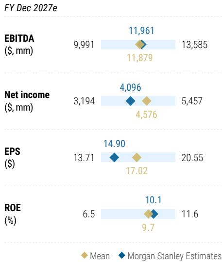

bar_line

FY Dec 2027e
| Metric | Mean ($) | MS Estimates ($) |
| :--- | :--- | :--- |
| EBITDA ($, mm) | 9,991 | 11,879 |
| Net income ($, mm) | 3,194 | 4,096 |
| EPS ($) | 13.71 | 14.90 |
| ROE (%) | 6.5 | 10.1 |
| (Note: The chart displays a single bar for the 'Mean' and 'MS Estimates' series in the top section of the table).)

Source: Refinitiv, MS

# Risk Reward – EOG Resources Inc (EOG.N)

Capital efficiency supports resilient through-the-cycle free cash flow

# PRICE TARGET \$160.00

Base case of \$160/share, which is a 50/50 blend of 1) a target multiple of 6.0x 2027e EV/EBITDA (\$169/sh) and 2) our NAV of \$150/sh.

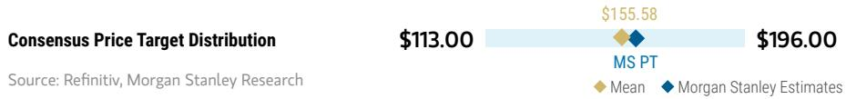

bar_line

| Category | Value    |
| -------- | -------- |
| MS PT    | $155.58  |
| MS PT    | $196.00  |

RISK REWARD CHART AND OPTIONS IMPLIED PROBABILITIES (12M)   
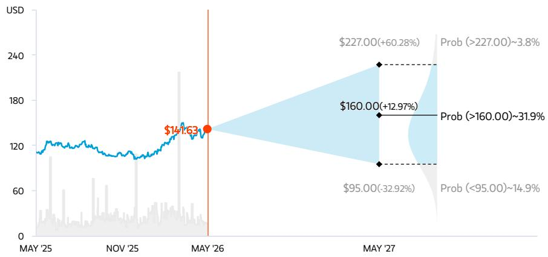

line

| Date     | Value    |
| -------- | -------- |
| MAY '25  | $141.63  |
| MAY '26  | $227.00  |
| MAY '27  | $160.00  |
| MAY '27  | $95.00   |

Key: — Historical Stock Performance ● Current Stock Price ◆ Price Target   
Source: Refinitiv, MS, MS Institutional Equities Division. The probabilities of our Bull, Base, and Bear case scenarios playing out were estimated with implied volatility data from the options market as of 20 May 2026. All figures are approximate risk-neutral probabilities of the stock reaching beyond the scenario price in either three-months' or one-years' time. View explanation of Options Probabilities methodology here

# EQUAL-WEIGHT THESIS

■ We believe more execution and data is still needed to prove that the Utica can stand alongside other "foundational" plays like the Eagle Ford & Delaware.   
In the current uncertain market backdrop, we expect the company to remain a defensive staple within the sector due to its scale, strong balance sheet, and higher gas exposure relative to large cap peers.

Consensus Rating Distribution   
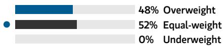

bar

| Category | Value (%) |
|---|---|
| Overweight | 48 |
| Equal-weight | 52 |
| Underweight | 0 |

MS Rating   
Source: Refinitiv, MS

# BULL CASE

# \$227.00

# BASE CASE

# \$160.00

# BEAR CASE

# \$95.00

# 6.2 2027e EV/EBITDA

Long-term (2027+) Bull Price Deck: WTI: \$90, HH \$4.25. Bull case of \$227/sh, which is a 50/50 blend of 1) a target multiple of 6.0x 2027e EV/EBITDA (\$232/sh) and 2) our NAV of \$222/sh. This blended \$227/sh bull case equates to 6.2x 2027e EV/EBITDA.

# 5.9x 2027e EV/EBITDA

Long-term (2027+) Base Price Deck: WTI: \$70, HH \$3.75. Base case of \$160/sh, which is a 50/50 blend of 1) a target multiple of 6.0x 2027e EV/EBITDA (\$169/sh) and 2) our NAV of \$150/sh. This blended \$160/sh base case equates to 5.9x 2027e EV/EBITDA.

# 5.4x 2027e EV/EBITDA

Long-term (2027+) Bear Price Deck: WTI: \$50, HH \$3.25. Bear case of \$95/sh, which is a 50/50 blend of 1) a target multiple of 6.0x 2027e EV/EBITDA (\$109/sh) and 2) our NAV of \$81/sh. This blended \$95/sh bear case equates to 5.4x 2027e EV/EBITDA.

# Risk Reward – EOG Resources Inc (EOG.N)

KEY EARNINGS INPUTS 

<table><tr><td>Drivers</td><td>2025</td><td>2026e</td><td>2027e</td><td>2028e</td></tr><tr><td>Oil Production (MBbl/d)</td><td>522</td><td>549</td><td>553</td><td>561</td></tr><tr><td>Total Production (MBoe/d)</td><td>1,232</td><td>1,399</td><td>1,445</td><td>1,491</td></tr><tr><td>Realized Oil Price ($/Bbl)</td><td>65.62</td><td>92.13</td><td>72.66</td><td>71.36</td></tr><tr><td>Realized Gas Price ($/Mcf)</td><td>3.02</td><td>3.46</td><td>3.71</td><td>3.33</td></tr><tr><td>EBITDAX Margin ($/Boe)</td><td>26.67</td><td>36.61</td><td>28.25</td><td>26.70</td></tr></table>

# INVESTMENT DRIVERS

- Commodity prices   
- Pace of additions to premium inventory count   
- "Premium" drilling program with wells generating $>30\%$ returns at \$40 WTI

# GLOBAL REVENUE EXPOSURE

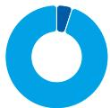

0-10% Latin America   
90-100% North America

Source: MS Estimate View explanation of regional hierarchies here

MS ALPHA MODELS 

<table><tr><td>3/5BEST</td><td>24 MonthHorizon</td><td>2/5MOST</td><td>3 MonthHorizon</td></tr></table>

Source: Refinitiv, FactSet, MS; 1 is the highest favored Quintile and 5 is the least favored Quintile

# RISKS TO PT/RATING

# RISKS TO UPSIDE

- Faster than anticipated reductions in well costs   
- Announcement of new premium play   
- Announcement of accelerated dividend growth or stock repurchase program

# RISKS TO DOWNSIDE

- Fewer than expected additions to premium inventory   
- Premium locations do not perform as expected   
- Restrictions to operating on Federal acreage

OWNERSHIP POSITIONING 

<table><tr><td>Inst. Owners, % Active</td><td>54.9%</td><td colspan="3"></td></tr><tr><td>HF Sector Long/Short Ratio</td><td>1.7x</td><td colspan="3"></td></tr><tr><td>HF Sector Net Exposure</td><td>4.3%</td><td colspan="3"></td></tr></table>

Refinitiv; MSPB Content. Includes certain hedge fund exposures held with MSPB. Information may be inconsistent with or may not reflect broader market trends. Long/Short Ratio = Long Exposure / Short exposure. Sector % of Total Net Exposure = (For a particular sector: Long Exposure - Short Exposure) / (Across all sectors: Long Exposure – Short Exposure).

MS ESTIMATES VS. CONSENSUS 

<table><tr><td colspan="3">FY Dec 2027e</td></tr><tr><td rowspan="2">EBITDA ($, mm)</td><td rowspan="2">13,735</td><td>14,702</td></tr><tr><td>15,423</td></tr><tr><td rowspan="2">Net income ($, mm)</td><td rowspan="2">6,575</td><td>7,013</td></tr><tr><td>7,610</td></tr><tr><td rowspan="2">EPS ($)</td><td rowspan="2">12.75</td><td>13.54</td></tr><tr><td>14.88</td></tr><tr><td rowspan="2">ROE (%)</td><td>20.9</td><td>20.9</td></tr><tr><td>22.4</td><td>23.2</td></tr></table>

Source: Refinitiv, MS

# Risk Reward – Viper Energy Inc (VNOM.O)

Strong oil production growth with no drilling and completion capex risk.

# PRICE TARGET \$49.00

Base case of \$49/share which is a 50/50 blend of 1) a target multiple of 9.5x 2027e EV/EBITDA (\$47/share) and 2) our discounted cash flow value of \$51/share (with a WACC of 8.0% and terminal EV/EBITDA multiple of 5.6x).

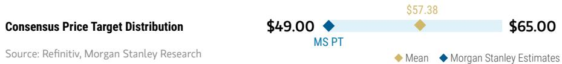

bar_line

| Category | Value   |
| -------- | ------- |
| Mean     | $49.00  |
| MS Estimates | $57.38  |
| Total    | $65.00  |

RISK REWARD CHART   
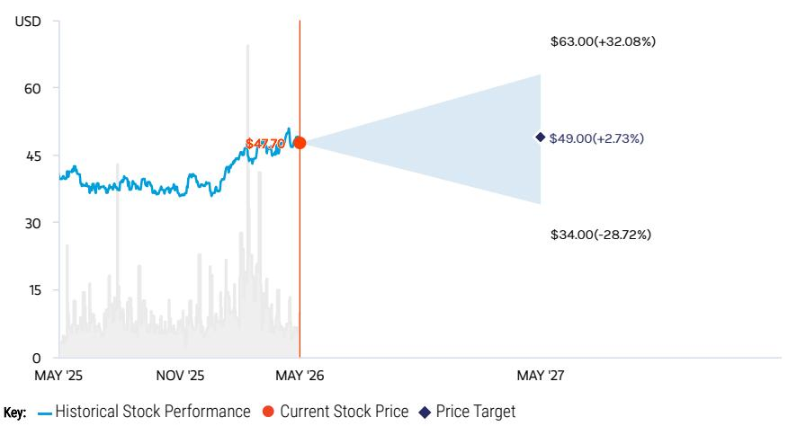

line

| Date     | Historical Stock Performance | Current Stock Price | Price Target |
| -------- | ---------------------------- | ------------------- | ------------ |
| MAY '25  | ~40                          | -                   | -            |
| NOV '25  | ~35                          | -                   | -            |
| MAY '26  | $47.70                       | $47.70              | -            |
| MAY '27  | -                            | $49.00 (+2.73%)    | $34.00 (-28.72%) |

Source: Refinitiv, MS

# OVERWEIGHT THESIS

■ We estimate VNOM to trade in-line with oil E&Ps on 2027 FCF yield (10% for VNOM vs 11% for oil E&Ps) and shareholder returns (12% yield for VNOM vs 6% for oil E&Ps).   
■ Above average multi-year growth outlook at no D&C capex risk. VNOM offers a superior oil production growth relative to oil E&Ps at zero drilling and completion (D&C) capital requirement. We estimate the proforma CAGR for oil per debt adjusted share of 11% in 2025-28 for VNOM vs 8% for oil E&Ps.   
■ Superior EBITDA margins. Viper generated one of the highest 2026 EBITDA margins among mineral peers due to its lower cost structure and oil-weighted production mix.

Consensus Rating Distribution   
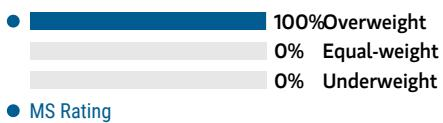

bar

| Category     | Value  |
| ------------ | ------ |
| Overweight   | 100%   |
| Equal-weight | 0%     |
| Underweight  | 0%     |

Source: Refinitiv, MS

# BULL CASE

# \$63.00

# BASE CASE

# \$49.00

# BEAR CASE

# \$34.00

# 4.9x 2027e EV/EBITDA

Bull case of \$63 is based on a 50/50 blend of 1) a target multiple of 9.5x 2027e EV/EBITDA (\$62/share) and 2) our discounted cash flow value of \$64/share. Scenario assumes \$90.00 WTI, \$4.25 Henry Hub.

# 5.1x 2027e EV/EBITDA

Base case of \$49/share which is a 50/50 blend of 1) a target multiple of 9.5x 2027e EV/EBITDA (\$47/share) and 2) our discounted cash flow value of \$51/share. Scenario assumes long-term (2027+) \$70.00 WTI, \$3.75 Henry Hub.

# 5.3x 2027e EV/EBITDA

Bear case of \$34 is based on a 50/50 blend of 1) a target multiple of 9.5x 2027e EV/EBITDA (\$32/share) and 2) our discounted cash flow value of \$37/share. Scenario assumes \$50.00 WTI, \$3.25 Henry Hub.

# Risk Reward – Viper Energy Inc (VNOM.O)

KEY EARNINGS INPUTS 

<table><tr><td>Drivers</td><td>2025</td><td>2026e</td><td>2027e</td><td>2028e</td></tr><tr><td>Total Production (Mboe/d) (mm)</td><td>95.1</td><td>129.8</td><td>135.2</td><td>143.1</td></tr><tr><td>Gas Production (MMcf/d) (mm)</td><td>142</td><td>192</td><td>194</td><td>205</td></tr><tr><td>Realized Oil Price ($)</td><td>63.27</td><td>88.00</td><td>69.50</td><td>69.50</td></tr><tr><td>Realized Gas Price ($)</td><td>1.92</td><td>0.39</td><td>2.07</td><td>2.24</td></tr><tr><td>EBITDAX Margin per Boe ($)</td><td>36.29</td><td>46.58</td><td>39.70</td><td>40.08</td></tr></table>

# INVESTMENT DRIVERS

- Commodity prices   
• Production growth   
- Return of capital   
- Deleveraging

# GLOBAL REVENUE EXPOSURE

100%

North America

Source: MS Estimate View explanation of regional hierarchies here

# MS ALPHA MODELS

2/5

BEST

24 Month

Horizon

2/5

MOST

3 Month

Horizon

Source: Refinitiv, FactSet, MS; 1 is the highest favored Quintile and 5 is the least favored Quintile

# RISKS TO PT/RATING

# RISKS TO UPSIDE

• Higher commodity prices   
- Increased operator drilling leading to higher production volumes   
- Heightened M&A activity accretive to key financial metrics

# RISKS TO DOWNSIDE

• Lower commodity prices   
• Production and M&A activity slows   
• Production shifts by operational partners

# OWNERSHIP POSITIONING

<table><tr><td>Inst. Owners, % Active</td><td>67.8%</td><td></td><td></td><td></td></tr><tr><td>HF Sector Long/Short Ratio</td><td>1.7x</td><td></td><td></td><td></td></tr><tr><td>HF Sector Net Exposure</td><td>4.3%</td><td></td><td></td><td></td></tr></table>

Refinitiv; MSPB Content. Includes certain hedge fund exposures held with MSPB. Information may be inconsistent with or may not reflect broader market trends. Long/Short Ratio = Long Exposure / Short exposure. Sector % of Total Net Exposure = (For a particular sector: Long Exposure - Short Exposure) / (Across all sectors: Long Exposure – Short Exposure).

# MS ESTIMATES VS. CONSENSUS

FY Dec 2026e

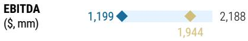

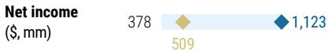

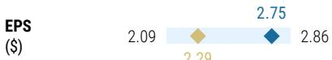

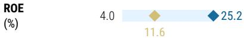

Mean

♦ MS Estimates

Source: Refinitiv, MS

# Risk Reward – APA Corp (APA.O)

Reflects discovered Suriname value, but more exploration is needed.

# PRICE TARGET \$44.00

Base case of \$44 is based on a target multiple of 3.0x EV/EBITDAX $38$ and NAV of \$50.

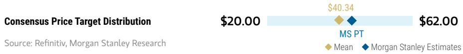

bar_line

| Category | Value   |
| -------- | ------- |
| MS PT    | $40.34  |
| Mean     | $20.00  |
| MS Estimates | $62.00  |

RISK REWARD CHART AND OPTIONS IMPLIED PROBABILITIES (12M)   
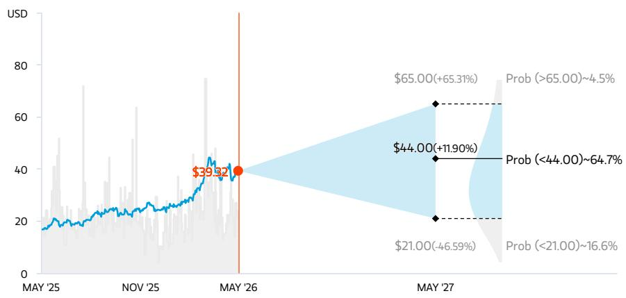

line

| Date       | Price    | Probability Range |
| ---------- | -------- | ------------------ |
| MAY '25    | $39.32   | -                  |
| MAY '27    | $65.00   | +65.31%            |
| MAY '27    | $44.00   | +11.90%            |
| MAY '27    | $21.00   | -46.59%            |
| MAY '27    | $65.00   | ~4.5%              |
| MAY '27    | $65.00   | ~4.5%              |
| MAY '27    | $65.00   | ~4.5%              |
| MAY '27    | $65.00   | ~4.5%              |
| MAY '27    | $65.00   | ~4.5%              |
| MAY '27    | $65,000  | ~4.5%              |
| MAY '27    | $65,000  | ~4.5%              |
| MAY '27    | $65,000  | ~4.5%              |
| MAY '27    | $65,000  | ~4.5%              |
| MAY '27    | $65,000  | ~4.5%              |

Key: — Historical Stock Performance ● Current Stock Price ◆ Price Target   
Source: Refinitiv, MS, MS Institutional Equities Division. The probabilities of our Bull, Base, and Bear case scenarios playing out were estimated with implied volatility data from the options market as of 20 May 2026. All figures are approximate risk-neutral probabilities of the stock reaching beyond the scenario price in either three-months' or one-years' time. View explanation of Options Probabilities methodology here

# UNDERWEIGHT THESIS

■ Further upside hinges upon successful de-risking of future Suriname developments. While Suriname reached its first FID, we believe more extensive exploration and appraisal work is required to de-risk future potential phases.   
■ Challenges in operational assets. APA plans to cease operations in the North Sea (due to unfavorable regulatory regime & high taxes) well ahead of the original timeline. In addition, we continue to see a challenged long-term outlook for gas-rich Alpine High.   
■ Targeting \$450 MM in annual cost savings by YE26 in capital, LOE, and overhead. While this is a positive development, investors need to see clear progress toward these goals before giving credit to stronger FCF

Consensus Rating Distribution   
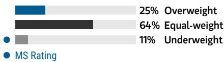

bar

| Category     | Value |
| ------------ | ----- |
| Overweight   | 25%   |
| Equal-weight | 64%   |
| Underweight  | 11%   |

Source: Refinitiv, MS

# BULL CASE

\$65.00

# BASE CASE

\$44.00

# BEAR CASE

\$21.00

# 3.5x 2027e EV/EBITDAX of \$7.0 B

Long term (2028+) bull case price deck: WTI \$90, HH \$4.25. Price target is 50/50 2027e E&P target multiple of 2.5x EV/EBITDAX (\$54) and NAV of \$75.

# 3.5x 2027e E&P EV/EBITDAX of \$4.9 B

Long-term (2028+) base case price deck: WTI \$70, HH \$3.75. Price target is 50/50 2027e E&P target multiple of 3.0x EV/EBITDAX (\$38) and NAV of \$50.

# 3x 2027e EV/EBITDAX of \$3.6 B

Long term (2028+) bear case price deck: WTI \$50, HH \$3.25. Price target is 50/50 2027e E&P target multiple of 2.5x EV/EBITDAX (\$17) and NAV of \$26.

# Risk Reward – APA Corp (APA.O)

KEY EARNINGS INPUTS 

<table><tr><td>Drivers</td><td>2025</td><td>2026e</td><td>2027e</td><td>2028e</td></tr><tr><td>Oil Production (Mbbl/d)</td><td>237</td><td>219</td><td>209</td><td>219</td></tr><tr><td>Total Production (Mboe/d)</td><td>464</td><td>430</td><td>432</td><td>448</td></tr><tr><td>Realized Oil Price ($)</td><td>66.89</td><td>90.19</td><td>72.03</td><td>68.50</td></tr><tr><td>Realized Gas Price ($)</td><td>2.35</td><td>1.64</td><td>3.54</td><td>3.53</td></tr><tr><td>EBITDA Margin per Boe ($)</td><td>30.30</td><td>44.16</td><td>31.20</td><td>28.95</td></tr></table>

# INVESTMENT DRIVERS

- Commodity prices.   
- Suriname exploration well results.   
- Capital efficiency.

# GLOBAL REVENUE EXPOSURE

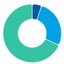

0-10% UK   
20-30% MEA   
60-70% North America

Source: MS Estimate View explanation of regional hierarchies here

MS ALPHA MODELS 

<table><tr><td>2/5BEST</td><td>24 MonthHorizon</td><td>1/5MOST</td><td>3 MonthHorizon</td></tr></table>

Source: Refinitiv, FactSet, MS; 1 is the highest favored Quintile and 5 is the least favored Quintile

# RISKS TO PT/RATING

# RISKS TO UPSIDE

• Higher commodity prices.   
- De-risking of offshore Suriname resource through successful exploration.   
• Service cost deflation.

# RISKS TO DOWNSIDE

• Lower commodity prices.   
- Suriname exploration well results: dry holes or low value gas resource.   
• Service cost inflation.

OWNERSHIP POSITIONING 

<table><tr><td>Inst. Owners, % Active</td><td>45.4%</td><td colspan="4"></td></tr><tr><td>HF Sector Long/Short Ratio</td><td>1.7x</td><td colspan="4"></td></tr><tr><td>HF Sector Net Exposure</td><td>4.3%</td><td colspan="4"></td></tr></table>

Refinitiv; MSPB Content. Includes certain hedge fund exposures held with MSPB. Information may be inconsistent with or may not reflect broader market trends. Long/Short Ratio = Long Exposure / Short exposure. Sector % of Total Net Exposure = (For a particular sector: Long Exposure - Short Exposure) / (Across all sectors: Long Exposure – Short Exposure).

MS ESTIMATES VS. CONSENSUS 

<table><tr><td colspan="3">FY Dec 2027e</td></tr><tr><td rowspan="2">EBITDA ($, mm)</td><td rowspan="2">4,264</td><td>4,765</td></tr><tr><td>5,246</td></tr><tr><td rowspan="2">Net income ($, mm)</td><td rowspan="2">937</td><td>1,142</td></tr><tr><td>1,401</td></tr><tr><td rowspan="2">EPS ($)</td><td rowspan="2">2.03</td><td>3.34</td></tr><tr><td>4.23</td></tr><tr><td rowspan="2">ROE (%)</td><td rowspan="2">11.0</td><td>14.4</td></tr><tr><td>17.2</td></tr></table>

Source: Refinitiv, MS

# Risk Reward – Matador Resources Co (MTDR.N)

Focused Delaware growth supports strong FCF with modest shareholder returns

# PRICE TARGET \$75.00

Price target is a 50/50 blend of 1) a target multiple of 4.0x 2027e EV/EBITDAX (\$71/sh) and 2) our NAV of \$80/sh.

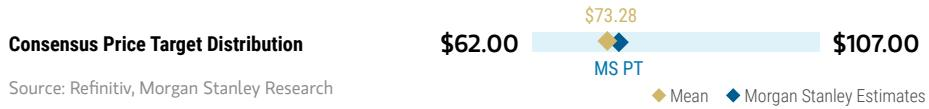

bar_line

| Consensus Price Target Distribution | Value    |
| ----------------------------------- | -------- |
| Mean                                | $62.00   |
| MS Estimates             | $107.00  |

RISK REWARD CHART AND OPTIONS IMPLIED PROBABILITIES (12M)   
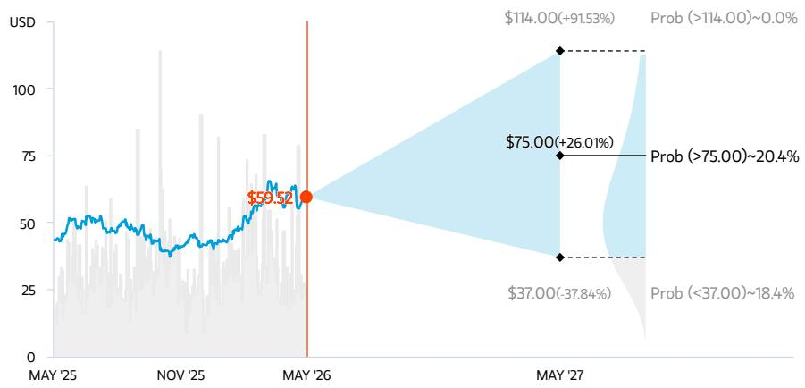

line

| Date     | Value   | Probability Change |
| -------- | ------- | ------------------- |
| MAY '26  | $59.52  | -                   |
| MAY '27  | $114.00 | +91.53%             |
| MAY '27  | $75.00  | +26.01%             |
| MAY '27  | $37.00  | -37.84%             |
| MAY '27  | Prob (>114.00) | ~0.0%          |
| MAY '27  | Prob (>75.00) | ~20.4%            |
| MAY '27  | Prob (<37.00) | ~18.4%            |

Key: — Historical Stock Performance ● Current Stock Price ◆ Price Target   
Source: Refinitiv, MS, MS Institutional Equities Division. The probabilities of our Bull, Base, and Bear case scenarios playing out were estimated with implied volatility data from the options market as of 20 May 2026. All figures are approximate risk-neutral probabilities of the stock reaching beyond the scenario price in either three-months' or one-years' time. View explanation of Options Probabilities methodology here

# EQUAL-WEIGHT THESIS

■ Integrated midstream operations provide a competitive advantage. Besides providing MTDR with flow assurance, San Mateo Midstream JV (MTDR 51% stake) services third-party customers and generates positive cash flow. We estimate San Mateo to add \~\$10/sh of value to MTDR's NAV.   
■ Modest shareholder returns at in-line valuation. We estimate MTDR to trade in-line w/ peers on '26 EV/EBITDAX and offer a \~3% return yield in '26 vs 6% for peers.

Consensus Rating Distribution   
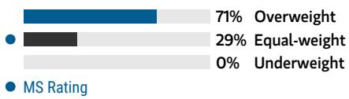

bar

| Category      | Value |
| ------------- | ----- |
| Overweight    | 71%   |
| Equal-weight  | 29%   |
| Underweight   | 0%    |

Source: Refinitiv, MS

# BULL CASE

# \$114.00

# 4.3x 2027e EV/EBITDAX

Long-term (2028+) Bull Price Deck: WTI \$90, HH \$4.25. Price target is a 50/50 blend of 1) a target multiple of 4.0x 2027e EV/EBITDAX (\$106/sh) and 2) our NAV of \$123/sh.

# BASE CASE

# 4.2x 2027e EV/EBITDAX

Long-term (2028+) Base Price Deck: WTI \$70, HH \$3.75. Price target is a 50/50 blend of 1) a target multiple of 4.0x 2027e EV/EBITDAX (\$71/sh) and 2) our NAV of \$80/sh.

# \$75.00

# BEAR CASE

# \$37.00

# 4.0x 2027e EV/EBITDAX

Long-term (2028+) Bear Price Deck: WTI \$50, HH \$3.25. Price target is a 50/50 blend of 1) a target multiple of 4.0x 2027e EV/EBITDAX (\$37/sh) and 2) our NAV of \$36/sh.

# Risk Reward – Matador Resources Co (MTDR.N)

KEY EARNINGS INPUTS 

<table><tr><td>Drivers</td><td>2025</td><td>2026e</td><td>2027e</td><td>2028e</td></tr><tr><td>Oil Production (MBbl/d)</td><td>120</td><td>124</td><td>126</td><td>128</td></tr><tr><td>Total Production (MBoe/d)</td><td>207</td><td>214</td><td>221</td><td>224</td></tr><tr><td>Realized Oil Price ($/Bbl)</td><td>65.00</td><td>78.39</td><td>70.00</td><td>70.00</td></tr><tr><td>Realized Gas Price ($/Mcf)</td><td>2.20</td><td>1.94</td><td>3.16</td><td>3.12</td></tr><tr><td>EBITDAX Margin ($/Boe)</td><td>30.36</td><td>36.30</td><td>32.94</td><td>32.68</td></tr></table>

# INVESTMENT DRIVERS

- Commodity prices   
- Capex   
- Capital efficiency   
- Return of cash   
- Well performance   
• Midstream assets performance

# GLOBAL REVENUE EXPOSURE

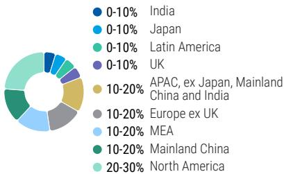

pie

| Region | Percentage (%) |
| :--- | :--- |
| India | 0-10 |
| Japan | 0-10 |
| Latin America | 0-10 |
| UK | 0-10 |
| APAC, ex Japan, Mainland China and India | 10-20 |
| Europe ex UK | 10-20 |
| MEA | 10-20 |
| Mainland China | 10-20 |
| North America | 20-30 |

Source: MS Estimate View explanation of regional hierarchies here

# MS ALPHA MODELS

5/5 BEST

24 Month Horizon

1/5 MOST

3 Month Horizon

Source: Refinitiv, FactSet, MS; 1 is the highest favored Quintile and 5 is the least favored Quintile

# RISKS TO PT/RATING

# RISKS TO UPSIDE

• Higher commodity prices   
• Better well performance   
• Service cost deflation   
• M&A activity accretive to key financial metrics   
• Accelerated return of cash through buybacks

# RISKS TO DOWNSIDE

- Poor execution   
• Lower commodity prices   
• Service cost inflation   
• Declining well performance

# OWNERSHIP POSITIONING

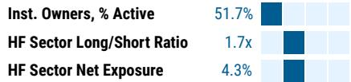

bar

| Category | Value |
| -------- | ----- |
| Inst. Owners, % Active | 51.7% |
| HF Sector Long/Short Ratio | 1.7x |
| HF Sector Net Exposure | 4.3% |

Refinitiv; MSPB Content. Includes certain hedge fund exposures held with MSPB. Information may be inconsistent with or may not reflect broader market trends. Long/Short Ratio = Long Exposure / Short exposure. Sector % of Total Net Exposure = (For a particular sector: Long Exposure - Short Exposure) / (Across all sectors: Long Exposure – Short Exposure).

# MS ESTIMATES VS. CONSENSUS

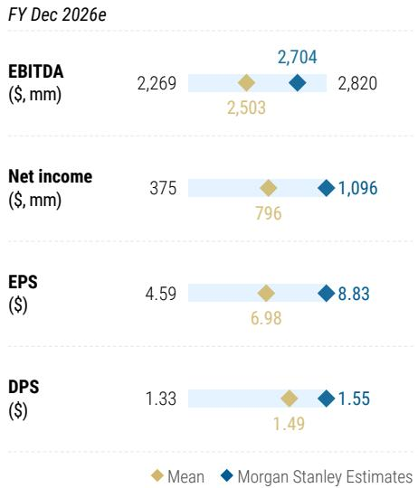

bar_line

FY Dec 2026e
| Metric | Mean ($) | MS Estimates ($) |
| :--- | :--- | :--- |
| EBITDA ($, mm) | 2,269 | 2,704 |
| Net income ($, mm) | 375 | 1,096 |
| EPS ($) | 4.59 | 8.83 |
| DPS ($) | 1.33 | 1.55 |

Source: Refinitiv, MS

# Risk Reward – Comstock Resources Inc. (CRK.N)

Exposure to LNG fairway but Western Haynesville economics still unclear

# PRICE TARGET \$18.00

Long-term (2028+) base case price deck: WTI \$65, HH \$3.75. Base case of \$18/share is a 50/50 blend of 1) 6x 2027e E&P EV/EBITDA of \$20/sh and 2) net asset value (NAV) of \$17/sh (10.2% discount rate).

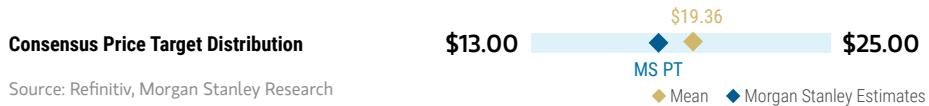

bar_line

| Category | Value   |
| -------- | ------- |
| MS PT    | $13.00  |
| MS Estimates | $25.00  |
| Mean     | $19.36  |

RISK REWARD CHART   
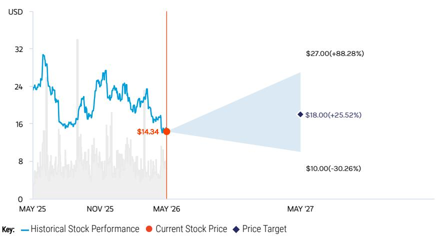

line

| Date     | Historical Stock Performance | Current Stock Price | Price Target |
| -------- | ----------------------------- | ------------------- | ------------ |
| MAY '26  | $14.34                        | -                   | -            |
| MAY '27  | -                             | $18.00              | $18.00       |
| MAY '27  | -                             | $27.00              | $27.00       |

Source: Refinitiv, MS

# EQUAL-WEIGHT THESIS

■ Exposure to Haynesville and Bossier shale regions in LA and TX provide access to growing LNG fairway.   
■ Exploratory Western Haynesville opportunity offers long-term growth, but economics and productivity remain unclear.   
- Jerry Jones, owner of the Dallas Cowboys Football Team, holds majority stake in CRK (71%).   
■ While FCF/equity improves from -5% in '26 to -1% in '28, CRK lags peers.

Consensus Rating Distribution   
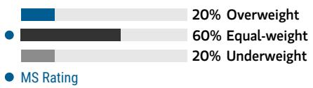

bar

| Category       | Value |
| -------------- | ----- |
| Overweight     | 20%   |
| Equal-weight   | 60%   |
| Underweight    | 20%   |

Source: Refinitiv, MS

# BULL CASE

# 2.7x 2027e EBITDA

Long-term (2027+) bull case price deck: WTI \$90, HH \$4.25. Bull case of \$27/share is a 50/50 blend of 1) 6.0x 2027e E&P EV/EBITDA of \$27/sh and 2) net asset value (NAV) of \$28/sh.

# \$27.00

# BASE CASE

# \$18.00

# 1.3x 2027e EBITDAX

Long-term (2028+) base case price deck: WTI \$70, HH \$3.75. Base case of \$18/share is a 50/50 blend of 1) 6.0x 2027e E&P EV/EBITDA of \$20/sh and 2) net asset value (NAV) of \$17/sh (10.2% discount rate).

# BEAR CASE

# \$10.00

# -0.6x 2027e EBITDA

Long-term (2028+) bear case price deck: WTI \$50, HH \$3.25. Bear case of \$10/share is a 50/50 blend of 1) 6.0x 2027e E&P EV/EBITDA of \$14/sh and 2) net asset value (NAV) of \$6/sh.

# Risk Reward – Comstock Resources Inc. (CRK.N)

KEY EARNINGS INPUTS 

<table><tr><td>Drivers</td><td>2025</td><td>2026e</td><td>2027e</td><td>2028e</td></tr><tr><td>Gas Production (MMcf/d)</td><td>1,234</td><td>1,300</td><td>1,572</td><td>1,771</td></tr><tr><td>Total Production (Mboe/d)</td><td>206</td><td>217</td><td>262</td><td>295</td></tr><tr><td>Realized Oil Price ($)</td><td>61.92</td><td>68.91</td><td>50.67</td><td>50.67</td></tr><tr><td>Realized Gas Price ($)</td><td>3.21</td><td>3.25</td><td>3.54</td><td>3.49</td></tr><tr><td>EBITDAX Margin per Boe ($, mm)</td><td>20.10</td><td>17.14</td><td>16.16</td><td>15.94</td></tr></table>

# INVESTMENT DRIVERS

- Commodity prices   
- Capex & capital efficiency   
• Western Haynesville performance

# GLOBAL REVENUE EXPOSURE

100%

North America

Source: MS Estimate View explanation of regional hierarchies here

MS ALPHA MODELS 

<table><tr><td>5/5BEST</td><td>24 MonthHorizon</td><td>3/5MOST</td><td>3 MonthHorizon</td></tr></table>

Source: Refinitiv, FactSet, MS; 1 is the highest favored Quintile and 5 is the least favored Quintile

# RISKS TO PT/RATING

# RISKS TO UPSIDE

• Higher commodity prices   
- Execution on Western Haynesville exploratory play   
• Capex and production efficiencies   
• Service cost deflation

# RISKS TO DOWNSIDE

• Lower commodity prices   
- Declining productivity   
- Western Haynesville does not materialize as planned

OWNERSHIP POSITIONING 

<table><tr><td>Inst. Owners, % Active</td><td>48%</td><td colspan="4"></td></tr><tr><td>HF Sector Long/Short Ratio</td><td>1.7x</td><td colspan="4"></td></tr><tr><td>HF Sector Net Exposure</td><td>4.3%</td><td colspan="4"></td></tr></table>

Refinitiv; MSPB Content. Includes certain hedge fund exposures held with MSPB. Information may be inconsistent with or may not reflect broader market trends. Long/Short Ratio = Long Exposure / Short exposure. Sector % of Total Net Exposure = (For a particular sector: Long Exposure - Short Exposure) / (Across all sectors: Long Exposure – Short Exposure).

MS ESTIMATES VS. CONSENSUS 

<table><tr><td colspan="3">FY Dec 2026e</td></tr><tr><td rowspan="2">EBITDA ($, mm)</td><td>1,066</td><td>1,114</td></tr><tr><td>1,223</td><td>1,343</td></tr><tr><td rowspan="2">Net income ($, mm)</td><td>125</td><td>178</td></tr><tr><td>232</td><td>298</td></tr><tr><td rowspan="2">EPS ($)</td><td>0.28</td><td>0.61</td></tr><tr><td>0.74</td><td>1.01</td></tr><tr><td>ROE (%)</td><td colspan="2">6.7</td></tr></table>

Source: Refinitiv, MS

# Risk Reward – Northern Oil & Gas Inc. (NOG.N)

Acquisition-driven growth with less operational clarity vs peers

# PRICE TARGET \$29.00

Long-term (2028+) base case price deck: WTI \$70, HH \$3.75. Base case of \$29/sh is a 50/50 blend of 1) 3.25x 2027e EV/EBITDA of \$26/sh and 2) net asset value of \$33 (7.3% discount rate).

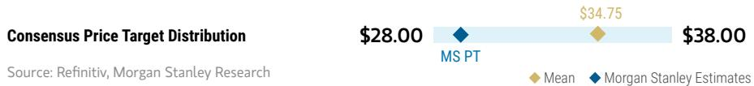

bar_line

| Consensus Price Target Distribution | Mean    | MS Estimates |
| ----------------------------------- | ------- | ------------------------ |
| $28.00                              | $34.75  | $38.00                  |

RISK REWARD CHART   
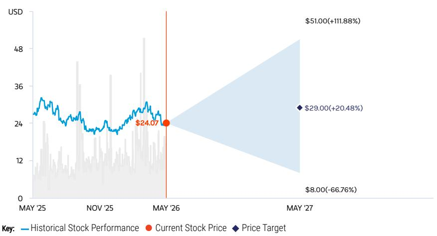

line

| Date     | Historical Stock Performance | Current Stock Price | Price Target |
| -------- | ----------------------------- | ------------------- | ------------ |
| MAY '25  | ~$36                          | -                   | -            |
| NOV '25  | ~$24                          | -                   | -            |
| MAY '26  | $24.07                        | $24.07              | -            |
| MAY '27  | -                             | $29.00              | $51.00       |

Source: Refinitiv, MS

# UNDERWEIGHT THESIS

■ Unique business model of non-operated oil & gas positions differs vs peers as NOG has interests in the Permian, Williston, Appalachian, and Uinta regions.   
■ Consistently raised dividends under a program initiated in 2021 and increased authorization in early 2025, but moderated growth expected.   
■ We see risk of further non-operated activity reductions in the event oil prices move lower.   
■ NOG has a lower FCF yield than peers in 2026 with higher leverage (1.6x vs oil median of 0.4x).

Consensus Rating Distribution   
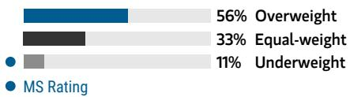

bar

| Category     | Value |
| ------------ | ----- |
| Overweight   | 56%   |
| Equal-weight | 33%   |
| Underweight  | 11%   |

Source: Refinitiv, MS

# BULL CASE

# 1.6x 2027e EBITDA

Long-term (2028+) bull case price deck: WTI \$90, HH \$4.25. Bull case is a 50/50 blend of 1) 3.25x 2027e EV/EBITDA of \$45/sh and 2) net asset value of \$56 (7.3% discount rate).

# \$51.00

# BASE CASE

# \$29.00

# 0.5x 2027e EBITDA

Long-term (2028+) base case price deck: WTI \$70, HH \$3.75. Base case of \$29/sh is a 50/50 blend of 1) 3.25x 2027e EV/EBITDA of \$26/sh and 2) net asset value of \$33 (7.3% discount rate).

# BEAR CASE

# \$8.00

# -1.9x 2027e EBITDA

Long-term (2028+) bear case price deck: WTI \$50, HH \$3.25. Bear case of \$8/sh is a 50/50 blend of 1) 3.25x 2027e EV/EBITDA of \$5/sh and 2) net asset value of \$10 (7.3% discount rate).

# Risk Reward – Northern Oil & Gas Inc. (NOG.N)

KEY EARNINGS INPUTS 

<table><tr><td>Drivers</td><td>2025</td><td>2026e</td><td>2027e</td><td>2028e</td></tr><tr><td>Gas Production (MMcf/d)</td><td>356</td><td>440</td><td>429</td><td>429</td></tr><tr><td>Total Production (Mboe/d)</td><td>135</td><td>147</td><td>146</td><td>146</td></tr><tr><td>Realized Oil Price ($)</td><td>64.79</td><td>70.10</td><td>65.13</td><td>65.15</td></tr><tr><td>Realized Gas Price ($)</td><td>3.33</td><td>2.64</td><td>3.20</td><td>3.31</td></tr><tr><td>EBITDAX Margin per Boe ($, mm)</td><td>21.52</td><td>13.11</td><td>28.41</td><td>28.79</td></tr></table>

# INVESTMENT DRIVERS

- Commodity prices   
- Capex, capital efficiency, and production activity of operating partners   
- Ability to execute on accretive M&A deals in key basins

# GLOBAL REVENUE EXPOSURE

100%

North America

Source: MS Estimate View explanation of regional hierarchies here

# MS ALPHA MODELS

1/5 BEST

24 Month Horizon

1/5
MOST

3 Month Horizon

Source: Refinitiv, FactSet, MS; 1 is the highest favored Quintile and 5 is the least favored Quintile

# RISKS TO PT/RATING

# RISKS TO UPSIDE

• Higher commodity prices   
- Heighted M&A activity accretive to key financial metrics   
- Operator service cost deflation (via AFEs)

# RISKS TO DOWNSIDE

• Lower commodity prices   
- Operator service cost inflation (via AFEs)   
• Production and M&A activity slows   
• Production shifts by operational partners

# OWNERSHIP POSITIONING

Inst. Owners, % Active

HF Sector Long/Short Ratio
HF Sector Net Exposure

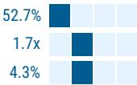

Refinitiv; MSPB Content. Includes certain hedge fund exposures held with MSPB. Information may be inconsistent with or may not reflect broader market trends. Long/Short Ratio = Long Exposure / Short exposure. Sector % of Total Net Exposure = (For a particular sector: Long Exposure - Short Exposure) / (Across all sectors: Long Exposure – Short Exposure).

# MS ESTIMATES VS. CONSENSUS

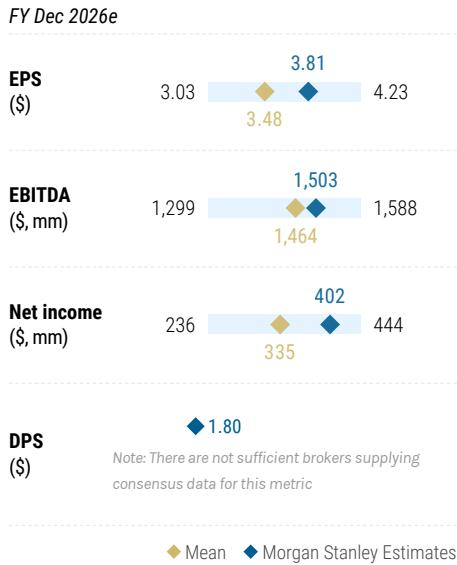

bar_line

| Metric         | Mean  | MS Estimates |
| -------------- | ----- | ------------------------ |
| EPS ($)        | 3.03  | 3.48                     |
| EBITDA ($, mm) | 1,299 | 1,464                    |
| Net income ($, mm) | 236   | 335                      |
| DPS ($)        |       | 1.80                     |

Source: Refinitiv, MS

# Risk Reward – Devon Energy Corp (DVN.N)

Merger to create a premier shale operator, upside from business optimization

# PRICE TARGET \$66.00

Price target of \$66/sh is a 50/50 blend of 1) a target multiple of 5x 2027e EV/EBITDAX (\$68/sh) and 2) our NAV of \$64/sh.

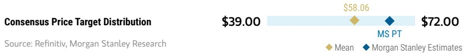

bar_line

| Category | Value   |
| -------- | ------- |
| Mean     | $39.00  |
| MS Estimates | $72.00  |

RISK REWARD CHART AND OPTIONS IMPLIED PROBABILITIES (12M)   
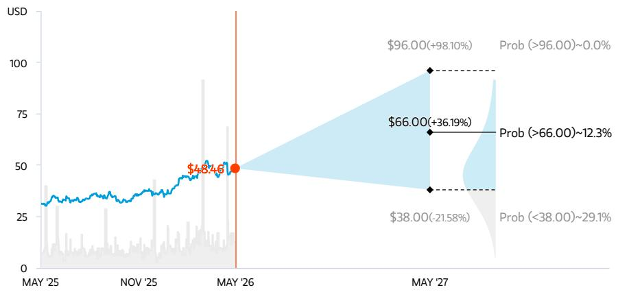

line

| Date     | Price   | Probability Range |
| -------- | ------- | ----------------- |
| MAY '25  | $48.46  | -                 |
| MAY '26  | $48.46  | -                 |
| MAY '27  | $96.00  | +98.10%           |
| MAY '27  | $66.00  | +36.19%           |
| MAY '27  | $38.00  | -21.58%           |
| MAY '27  | $38.00  | -29.1%            |

Key: — Historical Stock Performance ● Current Stock Price ◆ Price Target   
Source: Refinitiv, MS, MS Institutional Equities Division. The probabilities of our Bull, Base, and Bear case scenarios playing out were estimated with implied volatility data from the options market as of 20 May 2026. All figures are approximate risk-neutral probabilities of the stock reaching beyond the scenario price in either three-months' or one-years' time. View explanation of Options Probabilities methodology here

# OVERWEIGHT THESIS

\- Pending merger with CTRA would create the second largest US independent E&P by total volume and is \~17% accretion to FCF/sh for DVN at \$60 WTI and \$3.75 HH.
- DNV is on track to deliver the full \$1 B business optimization FCF uplift with the upcoming \$1 B term loan maturing September '26, ahead of schedule and offers attractive non-commodity linked rate of change.

\- At \$70 WTI, we estimate DVN offers a 13% FCF yield d in 2027, above the oil E&P median of 11% and large-cap peers of 9%, respectively.

Consensus Rating Distribution   
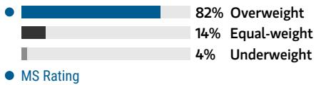

bar

| Category | Value (%) |
|---|---|
| Overweight | 82 |
| Equal-weight | 14 |
| Underweight | 4 |
| MS Rating | |

Source: Refinitiv, MS

# Risk Reward Themes

Self-help: Positive

View descriptions of Risk Rewards Themes here

# BULL CASE

# \$96.00

# 6.1x 2027e EV/EBITDAX of \$15.4 B

Long-term (2028+) Bull Price Deck: WTI \$96, HH \$4.25. Bull case is a 50/50 blend of 1) a target multiple of 5x 2027e EV/EBITDAX (\$95/sh) and 2) our NAV of \$97/sh.

# BASE CASE

# \$66.00

# 5x 2027e EV/EBITDAX of \$13.4 B

Long-term (2028+) Base Price Deck: WTI \$70, HH \$3.75. Base case is a 50/50 blend of 1) a target multiple of 5x 2026e EV/EBITDAX (\$68/sh) and 2) our NAV of \$64/sh.

# BEAR CASE

# \$38.00

# 3.6x 2027e EV/EBITDAX of \$11.4 B

Long-term (2028+) Bear Price Deck: WTI \$50, HH \$3.25. Bear case is a 50/50 blend of 1) a target multiple of 5x 2026e EV/EBITDAX (\$43/sh) and 2) our NAV of \$33/sh.

# Risk Reward – Devon Energy Corp (DVN.N)

KEY EARNINGS INPUTS 

<table><tr><td>Drivers</td><td>2025</td><td>2026e</td><td>2027e</td><td>2028e</td></tr><tr><td>Oil Production (Mbbl/d)</td><td>389</td><td>501</td><td>571</td><td>577</td></tr><tr><td>Total Production (Mboe/d)</td><td>840</td><td>1,367</td><td>1,682</td><td>1,700</td></tr><tr><td>Realized Oil Price ($)</td><td>63.91</td><td>79.94</td><td>68.59</td><td>68.60</td></tr><tr><td>Realized Gas Price ($)</td><td>1.79</td><td>1.73</td><td>2.28</td><td>2.29</td></tr><tr><td>EBITDAX Margin per Boe ($)</td><td>24.50</td><td>26.83</td><td>24.18</td><td>24.26</td></tr></table>

# INVESTMENT DRIVERS

- Commodity prices   
• Capex and capital efficiency   
• Delaware Basin oil production   
- Return of cash

# GLOBAL REVENUE EXPOSURE

100%

North America

Source: MS Estimate View explanation of regional hierarchies here

MS ALPHA MODELS 

<table><tr><td>1/5BEST</td><td>24 MonthHorizon</td><td>2/5MOST</td><td>3 MonthHorizon</td></tr></table>

Source: Refinitiv, FactSet, MS; 1 is the highest favored Quintile and 5 is the least favored Quintile

# RISKS TO PT/RATING

# RISKS TO UPSIDE

- Delivering the \$1 B merger synergies target by YE27   
- Raise \$1 B merger synergies target or pull forward timeline   
• Better than expected well results   
• Higher commodity prices   
• Service cost deflation

# RISKS TO DOWNSIDE

- Not delivering the \$1 B merger synergies target by YE27   
- Worse than expected well results   
• Lower commodity prices   
• Service cost inflation

OWNERSHIP POSITIONING 

<table><tr><td>Inst. Owners, % Active</td><td>41.6%</td><td></td><td></td><td></td></tr><tr><td>HF Sector Long/Short Ratio</td><td>1.7x</td><td></td><td></td><td></td></tr><tr><td>HF Sector Net Exposure</td><td>4.3%</td><td></td><td></td><td></td></tr></table>

Refinitiv; MSPB Content. Includes certain hedge fund exposures held with MSPB. Information may be inconsistent with or may not reflect broader market trends. Long/Short Ratio = Long Exposure / Short exposure. Sector % of Total Net Exposure = (For a particular sector: Long Exposure - Short Exposure) / (Across all sectors: Long Exposure – Short Exposure).

MS ESTIMATES VS. CONSENSUS 

<table><tr><td colspan="3">FY Dec 2027e</td></tr><tr><td>EBITDA ($, mm)</td><td>6,472</td><td>13,057</td></tr><tr><td>Net income ($, mm)</td><td>1,461</td><td>5,412</td></tr><tr><td>EPS ($)</td><td>2.50</td><td>5.27</td></tr><tr><td>ROE (%)</td><td>8.5</td><td>15.8</td></tr></table>

Source: Refinitiv, MS

# Risk Reward – Occidental Petroleum Corp (OXY.N)

In-line valuation but leverage is above peers

# PRICE TARGET \$74.00

Long-term (2028+) base case price deck: WTI \$70, HH \$3.25. Base case is a 50/50 blend of (1) target multiple of 5.5x EV/EBTIDA (\$78/sh) and (2) net asset value (NAV) of \$71/sh.

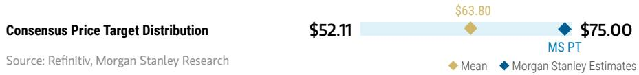

bar_line

| Consensus Price Target Distribution | Mean   | MS Estimates |
| ----------------------------------- | ------ | ------------------------ |
| $52.11                              | $63.80 |                          |
| $75.00                              |        | $75.00                   |

RISK REWARD CHART AND OPTIONS IMPLIED PROBABILITIES (12M)   
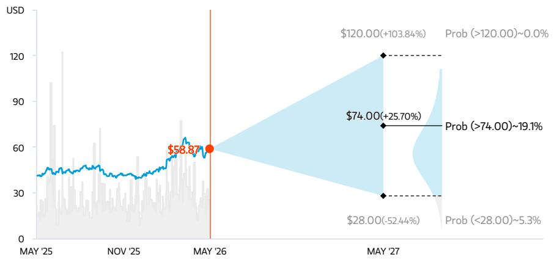

line

| Date     | Value   | Probability Range |
| -------- | ------- | ----------------- |
| MAY '25  |         |                   |
| NOV '25  |         |                   |
| MAY '26  | $58.87  |                   |
| MAY '27  |         | $120.00 (+103.84%) |
| MAY '27  |         | $74.00 (+25.70%)    |
| MAY '27  |         | $28.00 (-52.44%)    |
| MAY '27  |         | Prob (<28.00)~5.3%  |

Key: — Historical Stock Performance ● Current Stock Price ◆ Price Target   
Source: Refinitiv, MS, MS Institutional Equities Division. The probabilities of our Bull, Base, and Bear case scenarios playing out were estimated with implied volatility data from the options market as of 20 May 2026. All figures are approximate risk-neutral probabilities of the stock reaching beyond the scenario price in either three-months' or one-years' time. View explanation of Options Probabilities methodology here

# EQUAL-WEIGHT THESIS

■ OXY is differentiated by its high quality assets and LT growth potential through Low Carbon Ventures. That said, FCF/Equity is modestly below oil E&P average.

\- OxyChem sale supports balance sheet, but reduces FCF. The transaction is dilutive to our 2026-27 FCF/sh estimates, but accelerates debt reduction (0.5x lower pro-forma leverage) and pulls forward shareholder returns.

■ Free option on low carbon growth. OXY a leader in Direct Air Capture and has been active in helping hyperscalers decarbonize, including a recent 500,000 tonne deal with Microsoft. The stock reflects zero value for its low carbon business.

Consensus Rating Distribution   
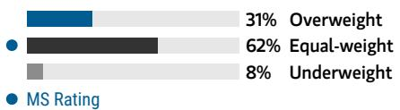

bar

| Category     | Value |
| ------------ | ----- |
| Overweight   | 31%   |
| Equal-weight | 62%   |
| Underweight  | 8%    |

Source: Refinitiv, MS

# Risk Reward Themes

Self-help: Positive
Technology Diffusion: Positive

View descriptions of Risk Rewards Themes here

# BULL CASE \$120.00

# 5.7x 2027e EBITDAX of \$20.1 B (incl. WES dists.)

Long-term (2028+) bull case price deck: WTI \$90, HH \$4.25. Price target is a 50/50 blend of (1) target multiple of 5.5x EV/EBTIDA (\$133/sh) and (2) net asset value (NAV) of \$107/sh.

# BASE CASE \$74.00

# 5.2x 2027e EBITDAX of \$14.6 B (incl. WES dists.)

Long-term (2028+) base case price deck: WTI \$70, HH \$3.25. Price target is a 50/50 blend of (1) target multiple of 5.5x EV/EBTIDA (\$78/sh) and (2) net asset value (NAV) of \$71/sh.

# BEAR CASE \$28.00

# 4.1x 2027e EBITDAX of \$8.9 B (incl. WES dists.)

Long-term (2028+) bear case price deck: WTI \$50, HH \$3.25. Price target is a 50/50 blend of (1) target multiple of 5.5x EV/EBTIDA (\$33/sh) and (2) net asset value (NAV) of \$24/sh.

# Risk Reward – Occidental Petroleum Corp (OXY.N)

KEY EARNINGS INPUTS 

<table><tr><td>Drivers</td><td>2025</td><td>2026e</td><td>2027e</td><td>2028e</td></tr><tr><td>Oil Production (Mbbl/d)</td><td>729</td><td>718</td><td>744</td><td>781</td></tr><tr><td>Total Production (Mboe/d)</td><td>1,435</td><td>1,431</td><td>1,457</td><td>1,499</td></tr><tr><td>Realized Oil Price ($)</td><td>64.59</td><td>84.31</td><td>69.24</td><td>69.10</td></tr><tr><td>Realized Gas Price ($)</td><td>1.65</td><td>1.31</td><td>2.43</td><td>2.39</td></tr><tr><td>EBITDA Margin per Boe ($)</td><td>21.97</td><td>32.69</td><td>25.97</td><td>26.05</td></tr></table>

# INVESTMENT DRIVERS

- Commodity prices.   
- Asst sale proceeds to reduce leverage.   
- Capital efficiency.

# GLOBAL REVENUE EXPOSURE

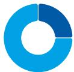

20-30% MEA   
70-80% North America

Source: MS Estimate View explanation of regional hierarchies here

MS ALPHA MODELS 

<table><tr><td>1/5BEST</td><td>24 MonthHorizon</td><td>3/5MOST</td><td>3 MonthHorizon</td></tr></table>

Source: Refinitiv, FactSet, MS; 1 is the highest favored Quintile and 5 is the least favored Quintile

# RISKS TO PT/RATING

# RISKS TO UPSIDE

• Higher commodity prices.   
• Service cost deflation.   
• Redeems preferred equity   
- Resumes share repurchase program

# RISKS TO DOWNSIDE

• Lower commodity prices.   
• Service cost inflation.   
• Regulatory risk in Colorado and global geopolitical risk.

OWNERSHIP POSITIONING 

<table><tr><td>Inst. Owners, % Active</td><td>43.6%</td><td colspan="3"></td></tr><tr><td>HF Sector Long/Short Ratio</td><td>1.7x</td><td colspan="3"></td></tr><tr><td>HF Sector Net Exposure</td><td>4.3%</td><td colspan="3"></td></tr></table>

Refinitiv; MSPB Content. Includes certain hedge fund exposures held with MSPB. Information may be inconsistent with or may not reflect broader market trends. Long/Short Ratio = Long Exposure / Short exposure. Sector % of Total Net Exposure = (For a particular sector: Long Exposure - Short Exposure) / (Across all sectors: Long Exposure – Short Exposure).

MS ESTIMATES VS. CONSENSUS 

<table><tr><td colspan="3">FY Dec 2027e</td></tr><tr><td rowspan="2">EBITDA ($, mm)</td><td rowspan="2">12,823</td><td>13,522</td></tr><tr><td>14,518</td></tr><tr><td rowspan="2">Net income ($, mm)</td><td rowspan="2">2,475</td><td>3,590</td></tr><tr><td>3,999</td></tr><tr><td rowspan="2">EPS ($)</td><td rowspan="2">2.38</td><td>3.55</td></tr><tr><td>3.83</td></tr><tr><td rowspan="2">ROE (%)</td><td rowspan="2">2.4</td><td>10.1</td></tr><tr><td>9.5</td></tr></table>

Source: Refinitiv, MS

# Risk Reward – Range Resources Corp. (RRC.N)

In-line valuation and capital efficient growth

# PRICE TARGET \$50.00

Price target is a 50/50 blend of 1) a target multiple of 6.5x 2027e EV/EBITDA (\$53/sh) and 2) our NAV of \$46/sh.

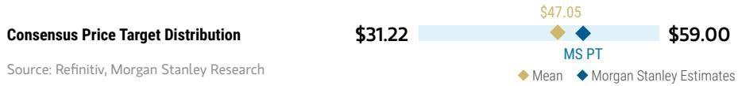

bar_line

| Category | Value   |
| -------- | ------- |
| Mean     | $31.22  |
| MS PT    | $47.05  |
| MS Estimates | $59.00  |

RISK REWARD CHART AND OPTIONS IMPLIED PROBABILITIES (12M)   
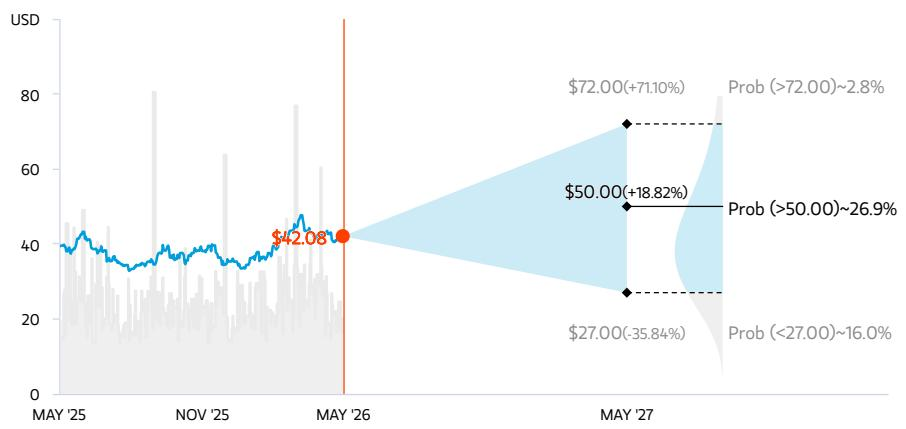

line

| Date     | Value   | Probability Change |
| -------- | ------- | ------------------ |
| MAY '25  |         |                    |
| NOV '25  |         |                    |
| MAY '26  | $42.08  | -                  |
| MAY '27  |         | $72.00(+71.10%)    |
| MAY '27  |         | $50.00(+18.82%)    |
| MAY '27  |         | $27.00(-35.84%)    |
| MAY '27  |         | Prob (>72.00)~2.8%  |
| MAY '27  |         | Prob (>50.00)~26.9% |

Key: — Historical Stock Performance ● Current Stock Price ◆ Price Target   
Source: Refinitiv, MS, MS Institutional Equities Division. The probabilities of our Bull, Base, and Bear case scenarios playing out were estimated with implied volatility data from the options market as of 20 May 2026. All figures are approximate risk-neutral probabilities of the stock reaching beyond the scenario price in either three-months' or one-years' time. View explanation of Options Probabilities methodology here

# EQUAL-WEIGHT THESIS

In-line valuation and capital efficient growth. RRC offers a 2026 FCF yield of 9%, in line with the peer median, with above-average growth over the next few years.   
■ Access to export markets supports premium NGL realizations. The company has realized a >\$1.50/bbl premium to Mont Belvieu over the last few years, a trend we expect to continue.   
■ Shareholder returns near peers. RRC offers a total return yield of \~2%, near the peer median. The company has an opportunistic approach to share buybacks and has low leverage.

Consensus Rating Distribution   
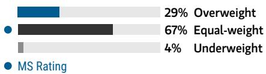

bar

| Category     | Value |
| ------------ | ----- |
| Overweight   | 29%   |
| Equal-weight | 67%   |
| Underweight  | 4%    |

Source: Refinitiv, MS

# BULL CASE

# \$72.00

# 6.4x 2027e EV/EBITDAX of \$2.5 B

Long term (2028+) Bull Price Deck: WTI \$90, HH \$4.25. Price target is a 50/50 blend of 1) a target multiple of 6.5x 2027e EV/EBITDA (\$74/sh) and 2) our NAV of \$71/sh.

# BASE CASE

# \$50.00

# 6x 2027e EV/EBITDAX of \$1.9 B

Long term (2028+) Base Price Deck: WTI \$70, HH \$3.75. Price target is a 50/50 blend of 1) a target multiple of 6.5x 2027e EV/EBITDA (\$53/sh) and 2) our NAV of \$46/sh.

# BEAR CASE

# \$27.00

# 5.2x 2027e EV/EBITDAX of \$1.3 B

Long term (2028+) Bear Price Deck: WTI \$50, HH \$3.25. Price target is a 50/50 blend of 1) a target multiple of 6.5x 2027e EV/EBITDA (\$34/sh) and 2) our NAV of \$20/sh.

# Risk Reward – Range Resources Corp. (RRC.N)

KEY EARNINGS INPUTS 

<table><tr><td>Drivers</td><td>2025</td><td>2026e</td><td>2027e</td><td>2028e</td></tr><tr><td>Gas Production (MMcf/d)</td><td>1,537</td><td>1,598</td><td>1,763</td><td>1,774</td></tr><tr><td>Total Production (MMcfe/d)</td><td>2,236</td><td>2,372</td><td>2,597</td><td>2,648</td></tr><tr><td>Realized Gas Price ($)</td><td>3.29</td><td>3.37</td><td>3.46</td><td>3.36</td></tr><tr><td>EBITDAX Margin per Bcfe ($)</td><td>1.76</td><td>2.05</td><td>1.97</td><td>1.89</td></tr></table>

# INVESTMENT DRIVERS

- Commodity prices   
- Capital efficiency   
- Liquids production

# GLOBAL REVENUE EXPOSURE

100%

North America

Source: MS Estimate View explanation of regional hierarchies here

MS ALPHA MODELS 

<table><tr><td>4/5BEST</td><td>24 MonthHorizon</td><td>2/5MOST</td><td>3 MonthHorizon</td></tr></table>

Source: Refinitiv, FactSet, MS; 1 is the highest favored Quintile and 5 is the least favored Quintile

# RISKS TO PT/RATING

# RISKS TO UPSIDE

• Higher commodity prices   
• Service cost deflation   
- Better than expected appraisal well results and well costs

# RISKS TO DOWNSIDE

• Lower commodity prices   
• Service cost inflation

OWNERSHIP POSITIONING 

<table><tr><td>Inst. Owners, % Active</td><td>61.8%</td><td></td><td></td><td></td></tr><tr><td>HF Sector Long/Short Ratio</td><td>1.7x</td><td></td><td></td><td></td></tr><tr><td>HF Sector Net Exposure</td><td>4.3%</td><td></td><td></td><td></td></tr></table>

Refinitiv; MSPB Content. Includes certain hedge fund exposures held with MSPB. Information may be inconsistent with or may not reflect broader market trends. Long/Short Ratio = Long Exposure / Short exposure. Sector % of Total Net Exposure = (For a particular sector: Long Exposure - Short Exposure) / (Across all sectors: Long Exposure – Short Exposure).

MS ESTIMATES VS. CONSENSUS 

<table><tr><td colspan="3">FY Dec 2027e</td></tr><tr><td rowspan="2">EBITDA ($, mm)</td><td rowspan="2">1,493</td><td>1,791</td></tr><tr><td>1,860</td></tr><tr><td rowspan="2">Net income ($, mm)</td><td rowspan="2">856</td><td>953</td></tr><tr><td>1,095</td></tr><tr><td rowspan="2">EPS ($)</td><td rowspan="2">3.15</td><td>4.11</td></tr><tr><td>4.49</td></tr><tr><td rowspan="2">ROE (%)</td><td rowspan="2">16.5</td><td>18.8</td></tr><tr><td>19.9</td></tr></table>

Source: Refinitiv, MS

# Risk Reward – Expand Energy Corp (EXE.O)

Attractive FCF growth from rising prices and efficiency gains in 2026

# PRICE TARGET \$139.00

Price target is a 50/50 blend of 1) a target multiple of 5.5x 2027e EV/EBITDA (\$135/sh) and 2) our NAV of \$143/sh.

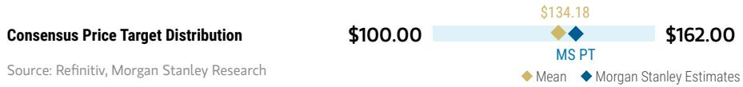

bar_line

| Category | Value    |
| -------- | -------- |
| MS PT    | $134.18  |
| MS PT    | $162.00  |

RISK REWARD CHART   
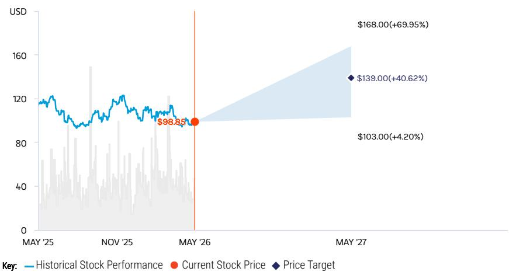

line

| Date     | Historical Stock Performance | Current Stock Price | Price Target |
| -------- | ----------------------------- | ------------------- | ------------ |
| MAY '26  | $98.85                        | $98.85              | -            |
| MAY '27  | -                             | $139.00             | $168.00      |

Source: Refinitiv, MS

# OVERWEIGHT THESIS

■ EXE is the largest independent natural gas producer in the US, well positioned to answer the call on the next growth cycle of gas supported by a diverse transportation portfolio and direct access to the Gulf Coast LNG corridor. Marketing & commercial segment could drive incremental value longer term.   
■ Rate of change from synergies realization. EXE offers attractive FCF growth from rising prices and volumes in 2026. We estimate a 12% FCF yield in 2026, above peer median of 9%.   
■ Capital returns framework designed to return cash and reduce net debt. We estimate a total return yield of 6% in 2026, above the gas E&P median of 4%.

Consensus Rating Distribution   
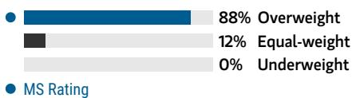

bar

| Category      | Value |
| ------------- | ----- |
| Overweight    | 88%   |
| Equal-weight  | 12%   |
| Underweight   | 0%    |

Source: Refinitiv, MS

# BULL CASE

# \$168.00

# BASE CASE

# \$139.00

# BEAR CASE

# \$103.00

# 5.1x 2027e EV/EBITDA of \$7.4 B

Long term (2028+) Bull Price Deck: WTI \$90, HH \$4.25. Price target is a 50/50 blend of 1) a target multiple of 5.5x 2027e EV/EBITDA (\$179/sh) and 2) our NAV of \$157/sh.

# 5.3x 2027e EV/EBITDA of \$6.1 B

Long term (2028+) Base Price Deck: WTI \$70, HH \$3.75. Price target is a 50/50 blend of 1) a target multiple of 5.5x 2027e EV/EBITDA (\$135/sh) and 2) our NAV of \$143/sh.

# 5x 2027e EV/EBITDA of \$5.1 B

Long term (2028+) Base Price Deck: WTI \$50, HH \$3.75. Price target is a 50/50 blend of 1) a target multiple of 5.5x 2027e EV/EBITDA (\$114/sh) and 2) our NAV of \$93/sh.

# Risk Reward – Expand Energy Corp (EXE.O)

KEY EARNINGS INPUTS 

<table><tr><td>Drivers</td><td>2025</td><td>2026e</td><td>2027e</td><td>2028e</td></tr><tr><td>Oil Production (Mbbl/d)</td><td>13</td><td>18</td><td>16</td><td>15</td></tr><tr><td>Total Production (Mboe/d)</td><td>1,189</td><td>1,251</td><td>1,272</td><td>1,291</td></tr><tr><td>Realized Oil Price ($)</td><td>55.63</td><td>77.28</td><td>60.80</td><td>60.80</td></tr><tr><td>Realized Gas Price ($)</td><td>3.16</td><td>3.39</td><td>3.48</td><td>3.43</td></tr><tr><td>EBITDA Margin per Boe ($)</td><td>11.52</td><td>13.15</td><td>13.10</td><td>12.85</td></tr></table>

# INVESTMENT DRIVERS

- Commodity prices   
• Production and capex   
- Return of cash

GLOBAL REVENUE EXPOSURE   
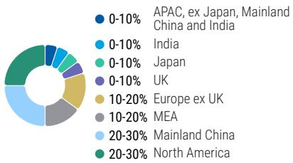

pie

| Region | Percentage (%) |
| :--- | :--- |
| APAC, ex Japan, Mainland China and India | 0-10 |
| India | 0-10 |
| Japan | 0-10 |
| UK | 0-10 |
| Europe ex UK | 10-20 |
| MEA | 10-20 |
| Mainland China | 20-30 |
| North America | 20-30 |

Source: MS Estimate View explanation of regional hierarchies here

MS ALPHA MODELS 

<table><tr><td>1/5BEST</td><td>24 MonthHorizon</td><td>3/5MOST</td><td>3 MonthHorizon</td></tr></table>

Source: Refinitiv, FactSet, MS; 1 is the highest favored Quintile and 5 is the least favored Quintile

# RISKS TO PT/RATING

# RISKS TO UPSIDE

• Higher natural gas prices   
- Better than expected well costs and well performance

# RISKS TO DOWNSIDE

• Lower natural gas prices   
- Worse than expected well costs and well performance

OWNERSHIP POSITIONING   
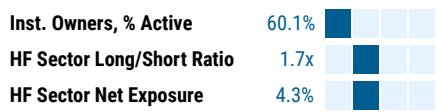

bar

| Category                     | Value  |
| ---------------------------- | ------ |
| Inst. Owners, % Active       | 60.1%  |
| HF Sector Long/Short Ratio   | 1.7x   |
| HF Sector Net Exposure        | 4.3%   |

Refinitiv; MSPB Content. Includes certain hedge fund exposures held with MSPB. Information may be inconsistent with or may not reflect broader market trends. Long/Short Ratio = Long Exposure / Short exposure. Sector % of Total Net Exposure = (For a particular sector: Long Exposure - Short Exposure) / (Across all sectors: Long Exposure – Short Exposure).

MS ESTIMATES VS. CONSENSUS   
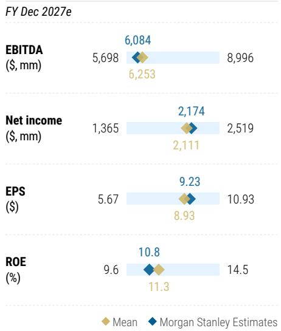

bar_line

FY Dec 2027e
| Metric | Mean ($) | MS Estimates ($) |
| :--- | :--- | :--- |
| EBITDA ($, mm) | 5,698 | 6,084 |
| Net income ($, mm) | 1,365 | 2,174 |
| EPS ($) | 5.67 | 9.23 |
| ROE (%) | 9.6 | 10.8 |
| Period Ending Dec 2027e | 14.5 | 11.3 |
| FY Dec 2027e: EBITDA (mm) | 5,698 | 6,253 |
| FY Dec 2027e: Net income (mm) | 1,365 | 2,111 |
| FY Dec 2027e: EPS ($) | 5.67 | 8.93 |
| FY Dec 2027e: ROE (%) | 9.6 | 11.3 |
| FY Dec 2027e: EBITDA ($, mm) | 8,996 | 6,084 |
| FY Dec 2027e: Net income ($, mm) | 2,519 | 2,174 |
| FY Dec 2027e: EPS ($) | 10.93 | 9.23 |
| FY Dec 2027e: ROE (%) | 14.5 | 10.8 |

Source: Refinitiv, MS

# Risk Reward – Chord Energy Corporation (CHRD.O)

Durable FCF generation and outsized shareholder returns at discount vs peers

# PRICE TARGET \$175.00

Base case of \$175/sh, which is a 50/50 blend of 1) a target multiple of 3.5x 2027e EV/EBITDA (\$187/sh) and 2) our NAV of \$162/sh.

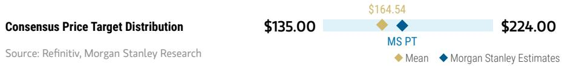

bar_line

| Category             | Value    |
| -------------------- | -------- |
| MS PT                | $164.54  |
| MS PT                | $224.00  |

RISK REWARD CHART   
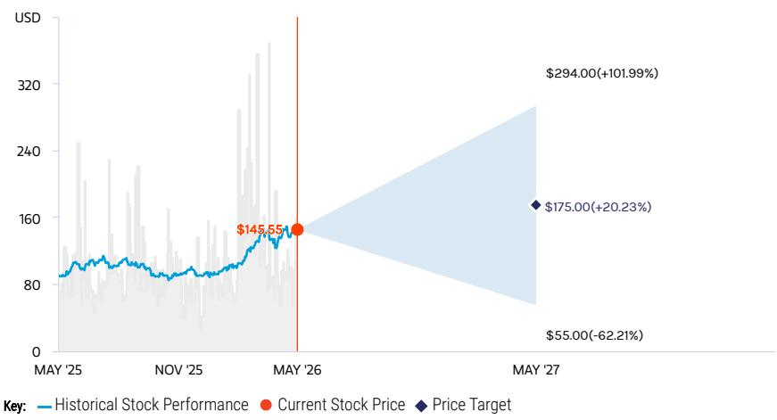

line

| Date     | Historical Stock Performance | Current Stock Price | Price Target |
| -------- | ---------------------------- | ------------------- | ------------ |
| MAY '26  | $145.55                      | -                   | -            |
| MAY '27  | -                            | $294.00(+101.99%)   | $175.00(+20.23%) |

Source: Refinitiv, MS

# OVERWEIGHT THESIS

■ Enhanced scale in the Bakken at attractive valuation. We estimate CHRD trades at a discount to its peers on '26 EV/EBITDAX.   
- CHRD offers strong FCF generation across a range of oil prices and at \$88 WTI, we see a 21% FCF yield (oil E&P average of 15%) and 15% shareholder return yield (peer average of 6%).   
We expect CHRD to continue realizing capital efficiency gains and see a positive rate-of-change on its longer lateral program. For 2026, CHRD expects 80% of its planned wells to be 3- to 4-mile laterals (vs. \~45% last year).   
■ While CHRD's net leverage ticked up post the XTO Bakken acquisition, we estimate it returns below 0.5x by YE26 at \$88 WTI.

Consensus Rating Distribution   
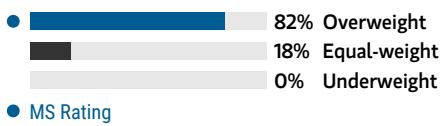

bar

| Category | Value (%) |
|---|---|
| Overweight | 82 |
| Equal-weight | 18 |
| Underweight | 0 |
| MS Rating | - |

Source: Refinitiv, MS

# BULL CASE

# 4.5x 2027e EV/EBITDAX

Long-term (2028+) Bull Price Deck: WTI \$90, HH \$4.25 Bull case of \$294/sh is a 50/50 blend of 1) a target multiple of 3.5x 2027e EV/EBITDAX (\$285/sh) and 2) our NAV of \$303/sh.

# \$294.00

# BASE CASE

# \$175.00

# 3.9x 2027e EV/EBITDAX

Long-term (2028+) Base Price Deck: WTI \$70, HH \$3.75. Base case of \$175/sh, which is a 50/50 blend of 1) a target multiple of 3.5x 2027e EV/EBITDA (\$187/sh) and 2) our NAV of \$162/sh.

# BEAR CASE

# \$55.00

# 2.6x 2027e EV/EBITDAX

Long-term (2028+) Bear Price Deck: WTI \$50, HH \$3.25. Bear case of \$55/sh is a 50/50 blend of 1) a target multiple of 3.5x 2027e EV/EBITDAX (\$89/sh) and 2) our NAV of \$21/sh.

# Risk Reward – Chord Energy Corporation (CHRD.O)

KEY EARNINGS INPUTS 

<table><tr><td>Drivers</td><td>2025</td><td>2026e</td><td>2027e</td><td>2028e</td></tr><tr><td>Oil Production (Mbbl/d)</td><td>155</td><td>162</td><td>162</td><td>162</td></tr><tr><td>Total Production (Mboe/d)</td><td>277</td><td>278</td><td>276</td><td>277</td></tr><tr><td>Realized Oil Price ($)</td><td>63.62</td><td>85.30</td><td>68.19</td><td>68.25</td></tr><tr><td>Realized Gas Price ($)</td><td>1.51</td><td>1.55</td><td>1.83</td><td>1.76</td></tr><tr><td>EBITDA Margin per Boe ($)</td><td>16.43</td><td>34.68</td><td>25.91</td><td>25.95</td></tr></table>

# INVESTMENT DRIVERS

- Commodity prices   
• Capex & Capital efficiency   
• Incremental well cost savings   
- Three-mile lateral inventory expansion from \~40% currently

# GLOBAL REVENUE EXPOSURE

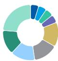

0-10% India   
0-10% Japan   
0-10% Latin America   
0-10% UK   
10-20% APAC, ex Japan, Mainland China and India   
10-20% Europe ex UK   
10-20% MEA   
10-20% Mainland China   
20-30% North America

Source: MS Estimate View explanation of regional hierarchies here

# MS ALPHA MODELS

2/5 BEST

24 Month Horizon

1/5
MOST

3 Month Horizon

Source: Refinitiv, FactSet, MS; 1 is the highest favored Quintile and 5 is the least favored Quintile

# RISKS TO PT/RATING

# RISKS TO UPSIDE

- Higher commodity prices and improved differentials.   
- Improved well performance.   
- Higher than expected % of the three-mile lateral inventory in the Bakken   
- Better than expected well results and economics of the 4-mile laterals

# RISKS TO DOWNSIDE

- Lower commodity prices and wider differentials.   
- Worse than expected well performance.   
- Increased leverage

# OWNERSHIP POSITIONING

<table><tr><td>Inst. Owners, % Active</td><td>56.6%</td><td colspan="2"></td></tr><tr><td>HF Sector Long/Short Ratio</td><td>1.7x</td><td colspan="2"></td></tr><tr><td>HF Sector Net Exposure</td><td>4.3%</td><td colspan="2"></td></tr></table>

Refinitiv; MSPB Content. Includes certain hedge fund exposures held with MSPB. Information may be inconsistent with or may not reflect broader market trends. Long/Short Ratio = Long Exposure / Short exposure. Sector % of Total Net Exposure = (For a particular sector: Long Exposure - Short Exposure) / (Across all sectors: Long Exposure – Short Exposure).

# MS ESTIMATES VS. CONSENSUS

<table><tr><td colspan="3">FY Dec 2027e</td></tr><tr><td rowspan="2">EBITDA ($, mm)</td><td rowspan="2">2,207</td><td>2,607</td></tr><tr><td>2,716</td></tr><tr><td rowspan="2">Net income ($, mm)</td><td rowspan="2">428</td><td>827</td></tr><tr><td>764</td></tr><tr><td rowspan="2">EPS ($)</td><td rowspan="2">3.52</td><td>14.18</td></tr><tr><td>16.96</td></tr><tr><td rowspan="2">ROE (%)</td><td>9.3</td><td>9.5</td></tr><tr><td>10.5</td><td>12.1</td></tr></table>

Source: Refinitiv, MS

# Risk Reward Reference links

1. View explanation of Options Probabilities methodology -   
Options\_Probabilities\_Exhibit\_Link.pdf   
2. View descriptions of Risk Rewards Themes - RR\_Themes\_Exhibit\_Link.pdf   
3. View explanation of regional hierarchies - GEG\_Exhibit\_Link.pdf   
4. View explanation of Theme/Exposure methodology -   
ESG\_Sustainable\_Solutions\_External\_Link.pdf   
5. View explanation of HERS methodology - ESG\_HERS\_External\_Link.pdf

# Disclosure Section

The information and opinions in MS were prepared by MS & Co. LLC, and/or MS C.T.V.M. S.A., and/or MS Mexico, Casa de Bolsa, S.A. de C.V., and/or MS Canada Limited. As used in this disclosure section, "MS" includes MS & Co. LLC, MS C.T.V.M. S.A., MS Mexico, Casa de Bolsa, S.A. de C.V., MS Canada Limited and their affiliates as necessary.

For important disclosures, stock price charts and equity rating histories regarding companies that are the subject of this report, please see the MS Disclosure Website at www.morganstanley.com/eqr/disclosures/webapp/generalresearch, or contact your investment representative or MS at 1585 Broadway, (Attention: Research Management), New York, NY, 10036 USA.

For valuation methodology and risks associated with any recommendation, rating or price target referenced in this research report, please contact the Client Support Team as follows: US/Canada +1 800 303-2495; Hong Kong +852 2848-5999; Latin America +1 718 754-5444 (U.S.); London +44 (0)20-7425-8169; Singapore +65 6834-6860; Sydney +61 (0)2-9770-1505; Tokyo +81 (0)3-6836-9000. Alternatively you may contact your investment representative or MS at 1585 Broadway, (Attention: Research Management), New York, NY 10036 USA.

# Analyst Certification

The following analysts hereby certify that their views about the companies and their securities discussed in this report are accurately expressed and that they have not received and will not receive direct or indirect compensation in exchange for expressing specific recommendations or views in this report: Jacqueline M Kenny; Joe Laetsch, CFA; Helen Lin; Devin McDermott.

# Global Research Conflict Management Policy

MS has been published in accordance with our conflict management policy, which is available at www.morganstanley.com/institutional/research/conflictpolicies. A Portuguese version of the policy can be found at www.morganstanley.com.br

# Important Regulatory Disclosures on Subject Companies

The analyst or strategist (or a household member) identified below owns the following securities (or related derivatives): Devin McDermott - Exxon Mobil Corporation(common or preferred stock).

As of April 30, 2026, MS beneficially owned 1% or more of a class of common equity securities of the following companies covered in MS: Antero Resources Corp, APA Corp, Chevron Corporation, Chord Energy Corporation, CNX Resources Corp, ConocoPhillips, Devon Energy Corp, Diamondback Energy Inc, EOG Resources Inc, EQT Corp., Expand Energy Corp, Exxon Mobil Corporation, Matador Resources Co, Murphy Oil Corporation, Northern Oil & Gas Inc., Occidental Petroleum Corp, Permian Resources Corp, Range Resources Corp., Tourmaline Oil Corp..

Within the last 12 months, MS managed or co-managed a public offering (or 144A offering) of securities of Chevron Corporation, CNX Resources Corp, Diamondback Energy Inc, EOG Resources Inc, Murphy Oil Corporation, Northern Oil & Gas Inc., Permian Resources Corp, Viper Energy Inc.

Within the last 12 months, MS has received compensation for investment banking services from Chevron Corporation, CNX Resources Corp, Devon Energy Corp, Diamondback Energy Inc, EOG Resources Inc, Expand Energy Corp, Murphy Oil Corporation, Northern Oil & Gas Inc., Permian Resources Corp, Viper Energy Inc.

In the next 3 months, MS expects to receive or intends to seek compensation for investment banking services from Antero Resources Corp, APA Corp, Cenovus Energy, Chevron Corporation, Chord Energy Corporation, CNX Resources Corp, Comstock Resources Inc., ConocoPhillips, Devon Energy Corp, Diamondback Energy Inc, EOG Resources Inc, EQT Corp., Expand Energy Corp, Exxon Mobil Corporation, Matador Resources Co, Murphy Oil Corporation, Northern Oil & Gas Inc., Occidental Petroleum Corp, Permian Resources Corp, Range Resources Corp., Suncor Energy Inc, Tourmaline Oil Corp., Viper Energy Inc.

Within the last 12 months, MS has received compensation for products and services other than investment banking services from Antero Resources Corp, APA Corp, Cenovus Energy, Chevron Corporation, CNX Resources Corp, Comstock Resources Inc., ConocoPhillips, Devon Energy Corp, Diamondback Energy Inc, EOG Resources Inc, EQT Corp., Expand Energy Corp, Exxon Mobil Corporation, Northern Oil & Gas Inc., Occidental Petroleum Corp, Ovintiv Inc, Permian Resources Corp, Range Resources Corp., Suncor Energy Inc, Tourmaline Oil Corp..

Within the last 12 months, MS has provided or is providing investment banking services to, or has an investment banking client relationship with, the following company: Antero Resources Corp, APA Corp, Cenovus Energy, Chevron Corporation, Chord Energy Corporation, CNX Resources Corp, Comstock Resources Inc., ConocoPhillips, Devon Energy Corp, Diamondback Energy Inc, EOG Resources Inc, EQT Corp., Expand Energy Corp, Exxon Mobil Corporation, Matador Resources Co, Murphy Oil Corporation, Northern Oil & Gas Inc., Occidental Petroleum Corp, Permian Resources Corp, Range Resources Corp., Suncor Energy Inc, Tourmaline Oil Corp., Viper Energy Inc.

Within the last 12 months, MS has either provided or is providing non-investment banking, securities-related services to and/or in the past has entered into an agreement to provide services or has a client relationship with the following company: Antero Resources Corp, APA Corp, Canadian Natural Resources Ltd, Cenovus Energy, Chevron Corporation, Chord Energy Corporation, CNX Resources Corp, Comstock Resources Inc., ConocoPhillips, Devon Energy Corp, Diamondback Energy Inc, EOG Resources Inc, EQT Corp., Expand Energy Corp, Exxon Mobil Corporation, Northern Oil & Gas Inc., Occidental Petroleum Corp, Ovintiv Inc, Permian Resources Corp, Range Resources Corp., Suncor Energy Inc, Tourmaline Oil Corp..

An employee, director or consultant of MS is a director of Occidental Petroleum Corp. This person is not a research analyst or a member of a research analyst's household. MS & Co. LLC makes a market in the securities of Chord Energy Corporation, CNX Resources Corp, Comstock Resources Inc., Matador Resources Co, Murphy Oil Corporation. The equity research analysts or strategists principally responsible for the preparation of MS have received compensation based upon various factors, including quality of research, investor client feedback, stock picking, competitive factors, firm revenues and overall investment banking revenues. Equity Research analysts' or strategists' compensation is not linked to investment banking or capital markets transactions performed by MS or the profitability or revenues of particular trading desks.

MS and its affiliates do business that relates to companies/instruments covered in MS, including market making, providing liquidity, fund management, commercial banking, extension of credit, investment services and investment banking. MS sells to and buys from customers the securities/instruments of companies covered in MS on a principal basis. MS may have a position in the debt of the Company or instruments discussed in this report. MS trades or may trade as principal in the debt securities (or in related derivatives) that are the subject of the debt research report.

Certain disclosures listed above are also for compliance with applicable regulations in non-US jurisdictions.

# STOCK RATINGS

MS uses a relative rating system using terms such as Overweight, Equal-weight, Not-Rated or Underweight (see definitions below). MS does not assign ratings of Buy, Hold or Sell to the stocks we cover. Overweight, Equal-weight, Not-Rated and Underweight are not the equivalent of buy, hold and sell. Investors should carefully read the definitions of all ratings used in MS. In addition, since MS contains more complete information concerning the analyst's views, investors should carefully read MS, in its entirety, and not infer the contents from the rating alone. In any case, ratings (or research) should not be used or relied upon as investment advice. An investor's decision to buy or sell a stock should depend on individual circumstances (such as the investor's existing holdings) and other considerations.

# Global Stock Ratings Distribution

(as of April 30, 2026)

The Stock Ratings described below apply to MS's Fundamental Equity Research and do not apply to Debt Research produced by the Firm.

For disclosure purposes only (in accordance with FINRA requirements), we include the category headings of Buy, Hold, and Sell alongside our ratings of Overweight, Equal-weight, Not-Rated and Underweight. MS does not assign ratings of Buy, Hold or Sell to the stocks we cover. Overweight, Equal-weight, Not-Rated and Underweight are not the equivalent of buy, hold, and sell but represent recommended relative weightings (see definitions below). To satisfy regulatory requirements, we correspond Overweight, our most positive stock rating, with a buy recommendation; we correspond Equal-weight and Not-Rated to hold and Underweight to sell recommendations, respectively.

<table><tr><td></td><td colspan="2">Coverage Universe</td><td colspan="3">Investment Banking Clients (IBC)</td><td colspan="2">Other Material Investment ServicesClients (MISC)</td></tr><tr><td>Stock RatingCategory</td><td>Count</td><td>% of Total</td><td>Count</td><td>% of Total IBC</td><td>% of RatingCategory</td><td>Count</td><td>% of Total OtherMISC</td></tr><tr><td>Overweight/Buy</td><td>1546</td><td>42%</td><td>467</td><td>51%</td><td>30%</td><td>709</td><td>44%</td></tr><tr><td>Equal-weight/Hold</td><td>1568</td><td>43%</td><td>358</td><td>39%</td><td>23%</td><td>715</td><td>44%</td></tr><tr><td>Not-Rated/Hold</td><td>4</td><td>0%</td><td>0</td><td>0%</td><td>0%</td><td>1</td><td>0%</td></tr><tr><td>Underweight/Sell</td><td>555</td><td>15%</td><td>84</td><td>9%</td><td>15%</td><td>202</td><td>12%</td></tr><tr><td>Total</td><td>3,673</td><td></td><td>909</td><td></td><td></td><td>1627</td><td></td></tr></table>

Data include common stock and ADRs currently assigned ratings. Investment Banking Clients are companies from whom MS received investment banking compensation in the last 12 months. Due to rounding off of decimals, the percentages provided in the "% of total" column may not add up to exactly 100 percent.

# Analyst Stock Ratings

Overweight (O). The stock's total return is expected to exceed the average total return of the analyst's industry (or industry team's) coverage universe, on a risk-adjusted basis, over the next 12-18 months.

Equal-weight (E). The stock's total return is expected to be in line with the average total return of the analyst's industry (or industry team's) coverage universe, on a risk-adjusted basis, over the next 12-18 months.

Not-Rated (NR). Currently the analyst does not have adequate conviction about the stock's total return relative to the average total return of the analyst's industry (or industry team's) coverage universe, on a risk-adjusted basis, over the next 12-18 months.

Underweight (U). The stock's total return is expected to be below the average total return of the analyst's industry (or industry team's) coverage universe, on a risk-adjusted basis, over the next 12-18 months.

Unless otherwise specified, the time frame for price targets included in MS is 12 to 18 months.

# Analyst Industry Views

Attractive (A): The analyst expects the performance of his or her industry coverage universe over the next 12-18 months to be attractive vs. the relevant broad market benchmark, as indicated below.

In-Line (I): The analyst expects the performance of his or her industry coverage universe over the next 12-18 months to be in line with the relevant broad market benchmark, as indicated below. Cautious (C): The analyst views the performance of his or her industry coverage universe over the next 12-18 months with caution vs. the relevant broad market benchmark, as indicated below. Benchmarks for each region are as follows: North America - S&P 500; Latin America - relevant MSCI country index or MSCI Latin America Index; Europe - MSCI Europe; Japan - TOPIX; Asia - relevant MSCI country index or MSCI sub-regional index or MSCI AC Asia Pacific ex Japan Index.

# Important Disclosures for MS Smith Barney LLC Customers

Important disclosures regarding any material conflict of interest that can reasonably be expected to have influenced MS Smith Barney LLC's choice of a third-party research provider or the subject company of a third-party research report, are available on the MS Wealth Management disclosure website at www.morganstanley.com/online/researchdisclosures.

For MS specific disclosures, you may refer to https://www.morganstanley.com/eqr/disclosures/webapp/generalresearch.

Each MS report is reviewed and approved on behalf of MS Smith Barney LLC. This review and approval is conducted by the same person who reviews the research report on behalf of MS. This could create a conflict of interest.

# Other Important Disclosures

MS policy is to update research reports as and when the Research Analyst and Research Management deem appropriate, based on developments with the issuer, the sector, or the market that may have a material impact on the research views or opinions stated therein. In addition, certain Research publications are intended to be updated on a regular periodic basis (weekly/monthly/quarterly/annual) and will ordinarily be updated with that frequency, unless the Research Analyst and Research Management determine that a different publication schedule is appropriate based on current conditions.

MS is not acting as a municipal advisor and the opinions or views contained herein are not intended to be, and do not constitute, advice within the meaning of Section 975 of the Dodd-Frank Wall Street Reform and Consumer Protection Act.

MS produces an equity research product called a "Tactical Idea." Views contained in a "Tactical Idea" on a particular stock may be contrary to the recommendations or views expressed in research on the same stock. This may be the result of differing time horizons, methodologies, market events, or other factors. For all research available on a particular stock, please contact your sales representative or go to Matrix at http://www.morganstanley.com/matrix.

MS is provided to our clients through our proprietary research portal on Matrix and also distributed electronically by MS to clients. Certain, but not all, MS products are also made available to clients through third-party vendors or redistributed to clients through alternate electronic means as a convenience. For access to all available MS, please contact your sales representative or go to Matrix at http://www.morganstanley.com/matrix.

Any access and/or use of MS is subject to MS's Terms of Use (http://www.morganstanley.com/terms.html). By accessing and/or using MS, you are indicating that you have read and agree to be bound by our Terms of Use (http://www.morganstanley.com/terms.html). In addition you consent to MS processing your personal data and using cookies in accordance with our Privacy Policy and our Global Cookies Policy (http://www.morganstanley.com/privacy\_pledge.html), including for the purposes of setting your preferences and to collect readership data so that we can deliver better and more personalized service and products to you. To find out more information about how MS processes personal data, how we use cookies and how to reject cookies see our Privacy Policy and our Global Cookies Policy (http://www.morganstanley.com/privacy\_pledge.html). Please use the provided link to review the Terms and Conditions and Most Important Terms and Conditions for MS India Company Private Limited (https://www.morganstanley.com/assets/pdfs/about-us-global-offices/india/Terms\_and\_conditions.pdf) and the following link to review the audit report (https://ny.matrix.ms.com/eqr/research/webapp/researchdocs/MSICPL\_Morgan\_Stanley\_Research\_Audit\_Report.pdf).

If you do not agree to our Terms of Use and/or if you do not wish to provide your consent to MS processing your personal data or using cookies please do not access our research. MS does not provide individually tailored investment advice. MS has been prepared without regard to the circumstances and objectives of those who receive it. MS recommends that investors independently evaluate particular investments and strategies, and encourages investors to seek the advice of a financial adviser. The appropriateness of an investment or strategy will depend on an investor's circumstances and objectives. The securities, instruments, or strategies discussed in MS may not be suitable for all investors, and certain investors may not be eligible to purchase or participate in some or all of them. MS is not an offer to buy or sell or the solicitation of an offer to buy or sell any security/instrument or to participate in any particular trading strategy. The value of and income from your investments may vary because of changes in interest rates, foreign exchange rates, default rates, prepayment rates, securities/instruments prices, market indexes, operational or financial conditions of companies or other factors. There may be time limitations on the exercise of options or other rights in securities/instruments transactions. Past performance is not necessarily a guide to future performance. Estimates of future performance are based on assumptions that may not be realized. If provided, and unless otherwise stated, the closing price on the cover page is that of the primary exchange for the subject company's securities/instruments.

The fixed income research analysts, strategists or economists principally responsible for the preparation of MS have received compensation based upon various factors, including quality, accuracy and value of research, firm profitability or revenues (which include fixed income trading and capital markets profitability or revenues), client feedback and competitive factors. Fixed Income Research analysts', strategists' or economists' compensation is not linked to investment banking or capital markets transactions performed by MS or the profitability or revenues of particular trading desks.

The "Important Regulatory Disclosures on Subject Companies" section in MS lists all companies mentioned where MS owns 1% or more of a class of common equity securities of the companies. For all other companies mentioned in MS, MS may have an investment of less than 1% in securities/instruments or derivatives of securities/instruments of companies and may trade them in ways different from those discussed in MS. Employees of MS not involved in the preparation of MS may have investments in securities/instruments or derivatives of securities/instruments of companies mentioned and may trade them in ways different from those discussed in MS. Derivatives may be issued by MS or associated persons.

With the exception of information regarding MS, MS is based on public information. MS makes every effort to use reliable, comprehensive information, but we make no representation that it is accurate or complete. We have no obligation to tell you when opinions or information in MS change apart from when we intend to discontinue equity research coverage of a subject company. Facts and views presented in MS have not been reviewed by, and may not reflect information known to, professionals in other MS business areas, including investment banking personnel.

MS personnel may participate in company events such as site visits and are generally prohibited from accepting payment by the company of associated expenses unless pre-approved by authorized members of Research management.

MS may make investment decisions that are inconsistent with the recommendations or views in this report.

To our readers based in Taiwan or trading in Taiwan securities/instruments: Information on securities/instruments that trade in Taiwan is distributed by MS Taiwan Limited ("MSTL"). Such information is for your reference only. The reader should independently evaluate the investment risks and is solely responsible for their investment decisions. MS may not be distributed to the public media or quoted or used by the public media without the express written consent of MS. Any non-customer reader within the scope of Article 7-1 of the Taiwan Stock Exchange Recommendation Regulations accessing and/or receiving MS is not permitted to provide MS to any third party (including but not limited to related parties, affiliated companies and any other third parties) or engage in any activities regarding MS which may create or give the appearance of creating a conflict of interest. Information on securities/instruments that do not trade in Taiwan is for informational purposes only and is not to be construed as a recommendation or a solicitation to trade in such securities/instruments. MSTL may not execute transactions for clients in these securities/instruments.

MS is not incorporated under PRC law and the research in relation to this report is conducted outside the PRC. MS does not constitute an offer to sell or the solicitation of an offer to buy any securities in the PRC. PRC investors shall have the relevant qualifications to invest in such securities and shall be responsible for obtaining all relevant approvals, licenses, verifications and/or registrations from the relevant governmental authorities themselves. Neither this report nor any part of it is intended as, or shall constitute, provision of any consultancy or advisory service of securities investment as defined under PRC law. Such information is provided for your reference only.

MS is disseminated in Brazil by MS C.T.V.M. S.A. located at Av. Brigadeiro Faria Lima, 3600, 6th floor, São Paulo - SP, Brazil; and is regulated by the Comissão de Valores Mobiliários; in Mexico by MS México, Casa de Bolsa, S.A. de C.V which is regulated by Comision Nacional Bancaria y de Valores. Paseo de los Tamarindos 90, Torre 1, Col. Bosques de las Lomas Floor 29, 05120 Mexico City; in Japan by MS MUFG Securities Co., Ltd. and, for Commodities related research reports only, MS Capital Group Japan Co., Ltd; in Hong Kong by MS Asia Limited (which accepts responsibility for its contents) and by MS Bank Asia Limited; in Singapore by MS Asia (Singapore) Pte. (Registration number 199206298Z) and/or MS Asia (Singapore) Securities Pte Ltd (Registration number 200008434H), regulated by the Monetary Authority of Singapore (which accepts legal responsibility for its contents and should be contacted with respect to any matters arising from, or in connection with, MS) and by MS Bank Asia Limited, Singapore Branch (Registration number T14FC0118); in Australia to "wholesale clients" within the meaning of the Australian Corporations Act by MS Australia Limited A.B.N. 67 003 734 576, holder of Australian financial services license No. 233742, which accepts responsibility for its contents; in Australia to "wholesale clients" and "retail clients" within the meaning of the Australian Corporations Act by MS Wealth Management Australia Pty Ltd (A.B.N. 19 009 14-5 555, holder of Australian financial services license No. 240813, which accepts responsibility for its contents; in Korea by MS & Co International plc, Seoul Branch; in India by MS India Company Private Limited having Corporate Identification No (CIN) U22990MH1998PTC115305, regulated by the Securities and Exchange Board of India ("SEBI") and holder of licenses as a Research Analyst (SEBI Registration No. INH000001105); Stock Broker (SEBI Stock Broker Registration No. INZ000244438), Merchant Banker (SEBI Registration No. INM000011203), and depository participant with National Securities Depository Limited (SEBI Registration No. IN-DP-NSDL-567-2021) having registered office at Altimus, Level 39 & 40, Pandurang Budhkar Marg, Worli, Mumbai 400018, India; Telephone no. +91-22-61181000; Compliance Officer Details: Mr. Tejarshi Hardas, Tel. No.: +91-22-61181000 or Email: tejarshi.hardas@morganstanley.com; Grievance officer details: Mr. Tejarshi Hardas, Tel. No.: +91-22-61181000 or Email: msic-compliance@morganstanley.com. MS India Company Private Limited (MSICPL) may use AI tools in providing research services.

All recommendations contained herein are made by the duly qualified research analysts; in Canada by MS Canada Limited; in Germany and the European Economic Area where required by MS Europe S.E., authorised and regulated by Bundesanstalt fuer Finanzdienstleistungsaufsicht (BaFin) under the reference number 149169; in the US by MS & Co. LLC, which accepts responsibility for its contents. MS & Co. International plc, authorized by the Prudential Regulation Authority and regulated by the Financial Conduct Authority and the Prudential Regulation Authority, disseminates in the UK research that it has prepared, and research which has been prepared by any of its affiliates, only to persons who (i) are investment professionals falling within Article 19(5) of the Financial Services and Markets Act 2000 (Financial Promotion) Order 2005 (as amended, the "Order"); (ii) are persons who are high net worth entities falling within Article 49(2)(a) to (d) of the Order; or (iii) are persons to whom an invitation or inducement to engage in investment activity (within the meaning of section 21 of the Financial Services and Markets Act 2000, as amended) may otherwise lawfully be communicated or caused to be communicated. RMB MS Proprietary Limited is a member of the JSE Limited and A2X (Pty) Ltd. RMB MS Proprietary Limited is a joint venture owned equally by MS International Holdings Inc. and RMB Investment Advisory (Proprietary) Limited, which is wholly owned by FirstRand Limited. The information in MS is being disseminated by MS Saudi Arabia, regulated by the Capital Market Authority in the Kingdom of Saudi Arabia, and is directed at Sophisticated investors only.

The information in MS is being communicated by MS & Co. International plc (DIFC Branch), regulated by the Dubai Financial Services Authority (the DFSA) or by MS & Co. International plc (ADGM Branch), regulated by the Financial Services Regulatory Authority Abu Dhabi (the FSRA), and is directed at Professional Clients only, as defined by the DFSA or the FSRA, respectively. The financial products or financial services to which this research relates will only be made available to a customer who we are satisfied meets the regulatory criteria of a Professional Client. A distribution of the different MS Research ratings or recommendations, in percentage terms for Investments in each sector covered, is available upon request from your sales representative.

The information in MS is being communicated by MS & Co. International plc (QFC Branch), regulated by the Qatar Financial Centre Regulatory Authority (the QFCRA), and is directed at business customers and market counterparties only and is not intended for Retail Customers as defined by the QFCRA.

As required by the Capital Markets Board of Turkey, investment information, comments and recommendations stated here, are not within the scope of investment advisory activity. Investment advisory service is provided exclusively to persons based on their risk and income preferences by the authorized firms. Comments and recommendations stated here are general in nature. These opinions may not fit to your financial status, risk and return preferences. For this reason, to make an investment decision by relying solely to this information stated here may not bring about outcomes that fit your expectations.

The trademarks and service marks contained in MS are the property of their respective owners. Third-party data providers make no warranties or representations relating to the accuracy, completeness, or timeliness of the data they provide and shall not have liability for any damages relating to such data. The Global Industry Classification Standard (GICS) was developed by and is the exclusive property of MSCI and S&P.

MS, or any portion thereof may not be reprinted, sold or redistributed without the written consent of MS.

Indicators and trackers referenced in MS may not be used as, or treated as, a benchmark under Regulation EU 2016/1011, or any other similar framework.

The issuers and/or fixed income products recommended or discussed in certain fixed income research reports may not be continuously followed. Accordingly, investors should regard those fixed income research reports as providing stand-alone analysis and should not expect continuing analysis or additional reports relating to such issuers and/or individual fixed income products. MS may hold, from time to time, material financial and commercial interests regarding the company subject to the Research report.

Registration granted by SEBI and certification from the National Institute of Securities Markets (NISM) in no way guarantee performance of the intermediary or provide any assurance of returns to investors. Investment in securities market are subject to market risks. Read all the related documents carefully before investing.

INDUSTRY COVERAGE: Exploration & Production 

<table><tr><td>COMPANY (TICKER)</td><td>RATING (AS OF)</td><td>PRICE* (05/20/2026)</td></tr><tr><td colspan="3">Devin McDermott</td></tr><tr><td>Antero Resources Corp (AR.N)</td><td>O (04/17/2024)</td><td>$37.98</td></tr><tr><td>APA Corp (APA.O)</td><td>U (04/15/2024)</td><td>$39.32</td></tr><tr><td>Chord Energy Corporation (CHRD.O)</td><td>O (03/27/2026)</td><td>$145.55</td></tr><tr><td>CNX Resources Corp (CNX.N)</td><td>U (01/10/2025)</td><td>$36.53</td></tr><tr><td>Comstock Resources Inc. (CRK.N)</td><td>E (01/10/2025)</td><td>$14.34</td></tr><tr><td>ConocoPhillips (COP.N)</td><td>O (12/16/2024)</td><td>$122.36</td></tr><tr><td>Devon Energy Corp (DVN.N)</td><td>O (12/11/2023)</td><td>$48.46</td></tr><tr><td>Diamondback Energy Inc (FANG.O)</td><td>O (12/11/2020)</td><td>$204.33</td></tr><tr><td>EOG Resources Inc (EOG.N)</td><td>E (12/11/2023)</td><td>$141.63</td></tr><tr><td>EQT Corp. (EQT.N)</td><td>O (11/18/2021)</td><td>$57.83</td></tr><tr><td>Expand Energy Corp (EXE.O)</td><td>O (01/10/2025)</td><td>$98.85</td></tr><tr><td>Matador Resources Co (MTDR.N)</td><td>E (01/10/2025)</td><td>$59.52</td></tr><tr><td>Murphy Oil Corporation (MUR.N)</td><td>U (01/22/2025)</td><td>$38.98</td></tr><tr><td>Northern Oil &amp; Gas Inc. (NOG.N)</td><td>U (08/18/2025)</td><td>$24.07</td></tr><tr><td>Occidental Petroleum Corp (OXY.N)</td><td>E (08/18/2025)</td><td>$58.87</td></tr><tr><td>Ovintiv Inc (OVV.N)</td><td>E (03/27/2026)</td><td>$59.53</td></tr><tr><td>Permian Resources Corp (PR.N)</td><td>O (01/10/2025)</td><td>$20.89</td></tr><tr><td>Range Resources Corp. (RRC.N)</td><td>E (03/26/2025)</td><td>$42.08</td></tr><tr><td>Tourmaline Oil Corp. (TOU.TO)</td><td>E (01/10/2025)</td><td>C$67.15</td></tr><tr><td>Viper Energy Inc (VNOM.O)</td><td>O (08/18/2025)</td><td>$47.70</td></tr></table>

Stock Ratings are subject to change. Please see latest research for each company.

\* Historical prices are not split adjusted.

INDUSTRY COVERAGE: Integrated Energy 

<table><tr><td>COMPANY (TICKER)</td><td>RATING (AS OF)</td><td>PRICE* (05/20/2026)</td></tr><tr><td colspan="3">Devin McDermott</td></tr><tr><td>Canadian Natural Resources Ltd (CNQ.TO)</td><td>E (10/07/2021)</td><td>C$67.11</td></tr><tr><td>Cenovus Energy (CVE.TO)</td><td>O (10/07/2021)</td><td>C$41.93</td></tr><tr><td>Chevron Corporation (CVX.N)</td><td>O (08/04/2025)</td><td>$191.33</td></tr><tr><td>Exxon Mobil Corporation (XOM.N)</td><td>O (05/14/2024)</td><td>$156.28</td></tr><tr><td>Imperial Oil Ltd (IMO.TO)</td><td>E (10/07/2021)</td><td>C$183.85</td></tr><tr><td>Suncor Energy Inc (SU.TO)</td><td>E (12/16/2024)</td><td>C$93.30</td></tr></table>

Stock Ratings are subject to change. Please see latest research for each company.   
\* Historical prices are not split adjusted.

© 2026 MS