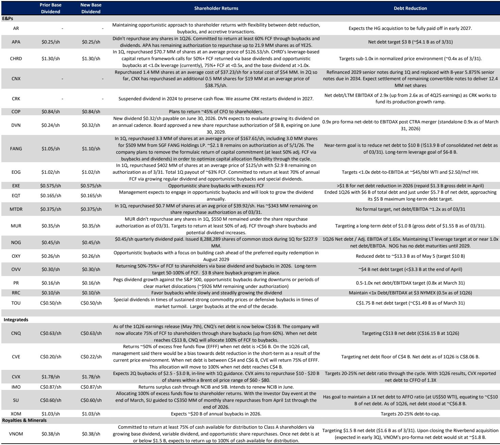
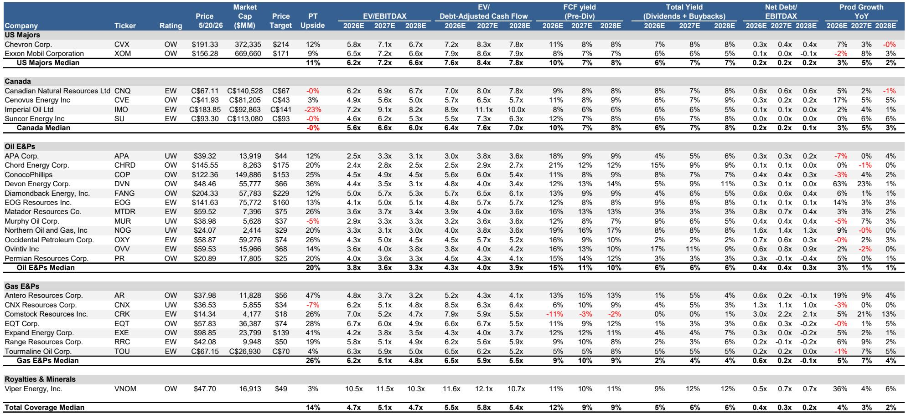
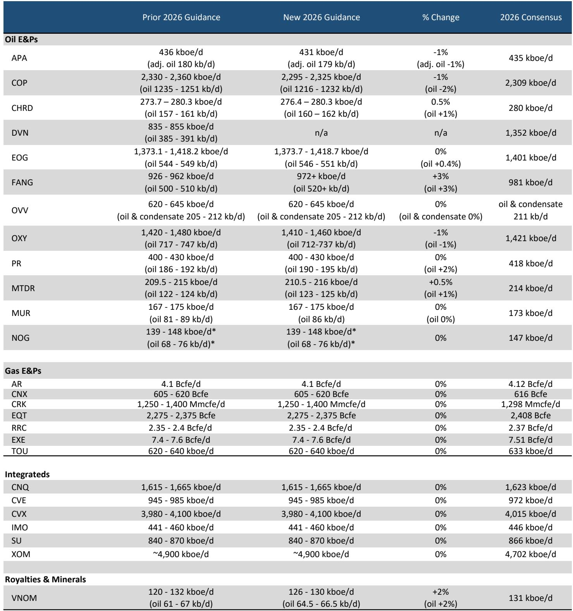

# 市场真正低估的不是油价，而是供给纪律的持续性

这份来自某外资投行的北美能源研报，在5月下旬更新了覆盖公司的盈利预测和估值敏感性。表面看，它只是在1Q业绩和最新油价曲线基础上做了一次常规调整。但仔细读下来，真正值得关注的不是油价本身涨了多少，而是整个供给端正在发生一个被低估的结构性变化：即便油价上涨，美国页岩油生产商依然选择维持资本纪律，而不是像过去那样加速增产。

这个信号，比油价数字重要得多。

报告覆盖的美国石油E&P公司，2026年产量指引平均仅上调0.6%，资本开支几乎不变。在WTI已经站上88美元的背景下，这种克制不是偶然的。它是过去几年行业反复教训后形成的集体理性，也是当前能源股估值折价的根本原因——市场在用70美元的长期油价给这些公司定价，而不是用88美元的现货。

这种折价，既是风险，也是机会。

## 1. 产量只增长0.6%，资本开支纹丝不动，这才是最硬的供给纪律

报告最核心的数据点，藏在产量和资本开支的修订表格里。

覆盖的美国石油E&P公司，2026年产量指引平均上调0.6%。这个数字本身并不惊人，但结合油价背景看，就非常说明问题：1Q业绩发布以来，WTI现货价格已经从年初的70美元区间攀升至接近90美元，而几乎所有运营商都表示2026年活动计划不变。只有FANG、COP和PR少数几家公司做了调整，而且幅度非常有限。

与此同时，资本开支估算几乎没有任何变化。报告中的Exhibit 8显示，绝大多数公司的2026年capex修订幅度在正负1%以内，中位数接近零。这意味着，油价上涨带来的额外现金流，并没有被重新投入钻探活动，而是流向了股东回报。

这就是过去两年市场一直在期待的“资本纪律”，现在它变成了现实。而且，它不是靠管理层口头承诺维持的，而是被1Q业绩和2026年指引数据验证过的。

对于投资者而言，这意味着：当前能源股的盈利弹性，将更多地体现在自由现金流和股东回报上，而不是产量增长上。这是估值体系重建的前提条件。

## 2. 88美元的油价只给了10%的EBITDA上修空间，但市场定价隐含的折价更深

报告更新了油价假设，将2026年全年WTI均价从79美元上调至88美元，对应最新的远月曲线。基于这个新的价格假设，分析师估算2026年自由现金流平均上升18%，EBITDA估算比市场共识高出10%。

但真正有意思的是Exhibit 3和Exhibit 5揭示的定价错位。

Exhibit 3显示，基于当前市场共识的2026年EBITDAX估算，隐含的WTI价格大约在80美元，比88美元的远月均价低了近10%。Exhibit 5进一步说明，如果油价真的维持在88美元，那么2026年EBITDA比共识有10%的上行空间；如果油价涨到105美元，这个上行空间会扩大到30%。

换句话说，市场共识还没有充分反映当前的油价曲线。这不是一个小的误差，而是一个系统性的低估。报告的分析师在Exhibit 7中确认，他们的估算平均比共识高出约1%，但这个数字掩盖了个股之间的巨大差异。

这种定价错位，意味着如果油价维持在当前水平，未来几个季度盈利修正的方向大概率是向上的。对于关注盈利动量的投资者来说，这是一个重要的观察窗口。

## 3. 市场用70美元的长期油价定价，与现货价格之间隔着16%的认知鸿沟

这是整份报告最值得反复思考的一张图——Exhibit 10。

报告通过估值反推，计算了覆盖的石油E&P公司当前股价所隐含的长期WTI价格。结果中位数大约是70美元，比12个月远期曲线（约83美元）低了16%。个别公司如DVN和MTDR，隐含油价甚至只有60-63美元。

这不是市场在“悲观”，而是市场在“贴现”。投资者对长期油价的预期，天然低于现货价格，因为远期曲线本身就处于贴水状态。但16%的折价幅度，已经超出了单纯曲线贴水的解释范围。它反映的是市场对“油价能否维持高位”的深度怀疑，背后是对地缘政治溢价消退、OPEC+增产、以及需求增长放缓的担忧。

但这种定价，恰恰为价值投资者提供了安全边际。如果市场已经按照70美元的油价给资产定价，那么只要实际油价高于这个水平，这些公司就会持续产生超额回报。报告给出的2026年自由现金流收益率中位数是15%（基于88美元WTI），如果油价跌到65美元，这个收益率仍然有9%。

换句话说，当前估值已经为油价下行预留了相当大的缓冲空间。而一旦油价维持高位，回报弹性就会非常可观。

## 4. 报告没有完全回答的问题：和平协议落地后，油价能撑多久？

这份报告最引人深思的地方，不是它说了什么，而是它没有说透什么。

报告明确提到了一个关键风险：“尽管短期内结果范围广泛，包括正式和平协议带来的潜在下行风险，但完全恢复生产和补充库存需要时间，可能会在冲突结束后很长一段时间内支撑价格。”

这句话逻辑正确，但没有量化。冲突结束后的“很长一段时间”到底是多久？6个月？12个月？还是18个月？伊朗的产量恢复速度、OPEC+的应对策略、以及美国页岩油在更高油价下的增产响应，这些变量都会影响最终结果。

报告没有给出具体的路径分析。它只是指出了方向，但没有提供时间表和概率分布。对于投资者来说，这意味着：当前的投资决策必须建立在对“油价回落速度”的假设上，而这个假设恰恰是最大的不确定性来源。

另一个未被充分讨论的问题是：如果油价真的回落，哪些公司的成本结构能够支撑更低的盈亏平衡点？报告提到了CHRD、NOG和APA在多个油价情景下都表现良好，但并没有深入分析它们的成本优势来源——是地质条件、运营效率、还是财务杠杆？这些细节，在完整报告中应该有更详细的拆解。

## 5. 一个观察框架：用“油价折价率”和“自由现金流弹性”筛选标的

基于这份报告的数据，可以建立一个简单的筛选框架。

第一个维度是“油价折价率”，即当前股价隐含的长期油价与远月曲线的差距。折价率越大，说明市场定价越保守，潜在上行空间越大。从Exhibit 10来看，DVN、MTDR、NOG的隐含油价最低，折价幅度最大；而MUR、CNQ、IMO的隐含油价已经接近或超过远月曲线，折价空间有限。

第二个维度是“自由现金流弹性”，即每10美元油价变动对自由现金流收益率的影响。Exhibit 4显示，CHRD、NOG、APA在不同油价情景下的自由现金流收益率都处于较高水平，说明它们的成本结构更具韧性。而XOM、CVX等一体化公司的弹性相对较低，但估值也更稳定。

第三个维度是“产量增长动量”。报告将“正增长率变化”作为选股标准之一，推荐了DVN、PR、CHRD和CVE。这些公司要么通过效率提升实现了低成本增产，要么通过并购扩大了资源基础。在资本纪律的大背景下，能够实现有机增长的公司，应该获得估值溢价。

这个框架并不完美，但它提供了一个系统性的思考起点。完整报告中应该有更多的敏感性分析和情景对比，可以帮助投资者进一步校准自己的判断。

---

以上讨论，只是这份研报解析内容的冰山一角。关于地缘冲突结束后的油价路径、不同公司的成本曲线细节、以及2027年自由现金流收益率的进一步下移，报告中都有更详尽的数据和模型推演。欢迎来星球微信群里继续讨论，我们可以一起拆解这些未解问题，并分享完整的原始图表和敏感性分析。

Personal reading notes and learning share only. Not investment advice.

