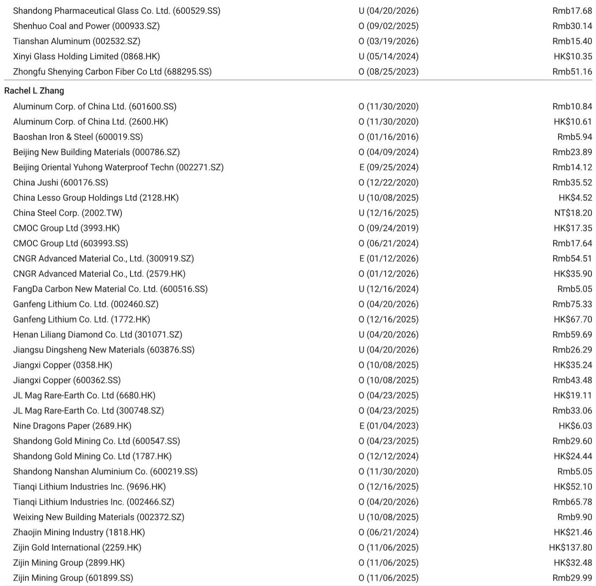
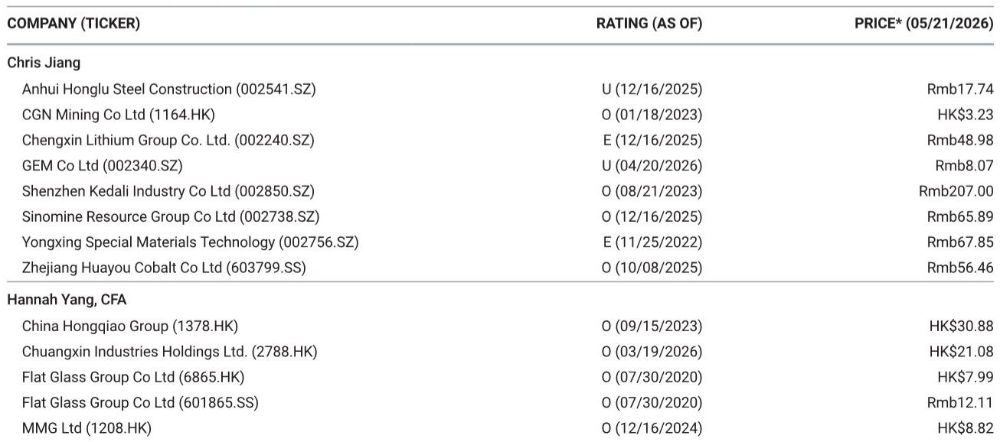
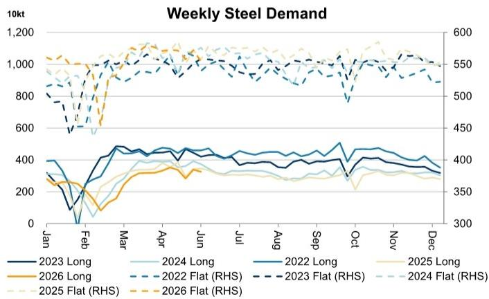

# 市场真正低估的不是需求，而是供给侧的再定价

过去几周，中国钢铁市场出现了一个看似矛盾的信号：钢材表观消费量环比回落，但钢厂产量却在增加，库存从贸易商向钢厂端转移。如果你只看需求侧，很容易得出“行业仍在探底”的结论。但某外资投行最新一期周报揭示了一个更值得关注的叙事：市场正在经历的，不是需求的二次探底，而是供给侧的再定价。

这份报告的核心判断并不复杂，但它的含义远比表面数字深远。当长材表观消费环比下降3.8%、扁平材下降3.1%的同时，长材产量却环比增长了7.5%，电炉开工率也小幅回升。这不是供需失衡的简单重复，而是行业结构正在发生一次静默的重组。理解这个重组，比争论需求何时见底更重要。

为什么现在要关注这件事？因为过去三年，中国钢铁行业的每一次价格波动都被归结为“需求不行”。但这一次，需求侧的变化已经不再是唯一的解释变量。供给侧的调整方式、库存的分布结构、以及不同工艺路线的成本曲线，正在共同塑造一个新的定价框架。这个框架一旦确立，将直接影响未来12-18个月钢铁股的估值逻辑。

报告中最值得注意的信号，不是需求的下滑幅度，而是供给端正在发生的几件“小事”：电炉利用率在上升、钢厂库存开始累积、而贸易商库存却在下降。这三件事放在一起，指向一个被多数人忽略的结论——行业正在从“被动去库存”转向“主动补库存”的前夜。但这个过程并不平坦，它伴随着利润的重新分配和竞争格局的洗牌。

## 1. 产量与消费背离的背后，是钢厂正在主动调整产品结构

本周数据中最引人注目的矛盾在于：长材表观消费环比下降3.8%，但长材产量却环比增长7.5%。这不是统计口径的误差，而是钢厂正在主动调整产品结构的明确信号。

报告显示，长材的库存周转正在加速，但方向是从贸易商向钢厂转移。贸易商库存环比下降2.7%，而钢厂库存环比上升3.0%。这意味着什么？贸易商在主动压降库存，而钢厂却在被动或主动地承接这部分库存压力。这种库存转移的实质，是定价权正在从贸易环节向生产环节回归。

从历史经验看，当贸易商库存下降而钢厂库存上升时，往往是行业触底前的典型特征。但这一次的不同之处在于，扁平材的产量环比仅微增0.1%，几乎持平，而消费降幅却达到3.1%。这说明钢厂并非盲目增产，而是在有选择地扩大长材的供给。长材主要用于建筑和基建领域，扁平材则更多对应制造业。两个品种的产量分化，暗示钢厂对下游需求的判断已经出现结构性分化：建筑端的“底部”可能比市场预期的更近，而制造业端的“顶部”可能已经出现。

对于投资者而言，这意味着不能再用“钢铁行业”这个笼统的概念来做判断。长材和扁平材的供需逻辑正在脱钩，未来两者的价格走势和盈利弹性将出现显著分化。关注长材占比高的企业，可能比关注综合型钢企更有意义。

## 2. 电炉利用率回升是成本曲线重构的前奏，而非需求回暖的信号

报告中的另一个关键数据是电炉利用率环比上升0.8个百分点至60.8%，同比更是高出4.2个百分点。这个数字在传统框架下往往被解读为需求回暖，但这一次，它更可能反映的是成本曲线的变化。

电炉的原料以废钢为主，而高炉以铁矿石和焦炭为主。当铁矿石价格维持高位、而废钢价格相对疲软时，电炉的经济性就会改善。报告显示，铁矿石港口库存维持在1.55亿吨的高位，环比持平，但钢厂端铁矿石库存环比增长2.6%，日均产量微增0.4%。这说明钢厂正在主动补充原料库存，但并未大幅提高高炉开工率——247家钢厂的整体利用率仅微增0.2个百分点至89.7%。

这组数据合在一起意味着：钢厂正在用“多用电炉、少用高炉”的方式来应对成本压力。电炉的灵活性更高、启动成本更低，更适合在当前需求不确定的环境下作为边际调节产能。如果这种趋势持续，电炉产能的利用率将成为判断行业供给弹性的新指标，而不再是高炉利用率。

对行业竞争格局的含义是：拥有废钢资源和电炉产能的企业，将在未来的成本竞争中占据更有利的位置。而那些高度依赖进口铁矿石的高炉企业，将面临更大的成本波动风险。这是供给侧结构变化的第一个微观信号。

## 3. 铁矿石发货量激增正在为下一轮价格博弈埋下伏笔

报告显示，5月11日至17日期间，澳大利亚和巴西的铁矿石合计发货量环比增加424万吨，其中巴西贡献了316万吨的增量，澳大利亚增加了108万吨。这是一个值得警惕的信号。

巴西发货量的激增，通常意味着淡水河谷等矿商正在加速弥补此前因天气或物流原因造成的发货缺口。而澳大利亚的发货量也在持续恢复。如果这种发货节奏维持下去，未来4-6周中国港口的铁矿石到港量将显著增加。

结合当前港口库存已经处于1.55亿吨的高位，以及钢厂补库意愿并不强烈（日均产量仅微增0.4%），铁矿石的供需平衡正在向宽松方向移动。报告对此没有给出明确的判断，但逻辑链条是清晰的：供给增加、库存高位、需求平稳，铁矿石价格的支撑正在松动。

这对钢铁行业的利润意味着什么？如果铁矿石价格出现回落，而钢材价格保持相对稳定，那么钢厂的吨钢利润将迎来修复。但这里存在一个关键假设：钢材价格能否在需求疲软的环境下保持稳定。如果铁矿石价格下跌的同时，钢材价格也同步下跌，那么利润修复的逻辑就不成立。报告没有完全回答这个问题，但这正是需要持续跟踪的核心变量。

## 4. 报告尚未回答的关键问题：库存转移能否持续，以及谁来承担最终风险

尽管数据提供了丰富的信号，但报告至少有两个关键问题没有完全展开。

第一，贸易商库存下降而钢厂库存上升的趋势能否持续。如果贸易商持续压降库存，而钢厂被迫承接更多库存，那么钢厂的资金压力和库存减值风险将上升。报告显示贸易商库存同比下降17.3%，而钢厂库存同比下降1.9%，这说明贸易商已经在主动去库存，但钢厂是否愿意或能够继续承接，取决于它们的现金流状况和对未来需求的判断。

第二，电炉利用率回升的可持续性。如果废钢价格跟随铁矿石价格下跌，电炉的经济性优势可能迅速消失。报告没有提供废钢价格的走势数据，也没有讨论电炉产能的边际成本曲线。这意味着电炉利用率回升到底是结构性变化还是短期套利行为，目前仍无法判断。

这两个未解问题，恰恰是决定未来6个月行业走向的关键。如果库存转移是短期行为，那么行业将重新回到“贸易商去库-钢厂被动累库-价格承压”的老路；如果电炉利用率回升是结构性的，那么行业供给侧的弹性将显著增加，价格波动区间将被压缩。

## 5. 一个更实用的观察框架：从“总量逻辑”转向“三层过滤”

基于这份报告，我们建议读者建立一个新的观察框架，替代传统的“看产量、看库存、看价格”的三段式分析。新的框架可以概括为“三层过滤”：

第一层是品种过滤。不再笼统地看“钢铁需求”，而是分别跟踪长材和扁平材的表观消费、产量和库存。两者的分化趋势已经出现，未来只会更加明显。关注品种结构的变化，远比关注总量变化更有价值。

第二层是工艺过滤。将高炉和电炉的开工率分开看，并结合废钢和铁矿石的价差来判断成本曲线的移动方向。电炉的边际成本正在成为行业供给弹性的新锚点，忽视这一点将导致对价格波动的误判。

第三层是库存分布过滤。不再只看总库存，而是关注库存是在贸易商手中还是在钢厂手中。库存的分布结构决定了定价权和风险承担的主体。贸易商去库、钢厂累库的阶段，往往是行业触底的前兆，但也是利润压缩最剧烈的时期。

这个框架的实用价值在于，它可以帮助投资者在数据发布的第一时间做出判断，而不是等到价格信号出来之后再后知后觉。比如，如果下周数据出现“长材消费回升、电炉利用率继续上升、贸易商库存企稳”的组合，那么行业底部可能已经确认；反之，如果出现“扁平材消费加速下滑、高炉利用率下降、钢厂库存继续上升”的组合，那么行业可能还有最后一跌。

这些未解的问题和观察框架，正是我们希望在后续讨论中继续深化的方向。报告本身提供了扎实的数据基础，但真正的投资判断需要对这些信号进行持续追踪和交叉验证。欢迎来星球微信群里继续讨论，我们会围绕这些关键变量做周度跟踪，并在关键拐点出现时第一时间分享我们的判断。

Personal reading notes and learning share only. Not investment advice.

