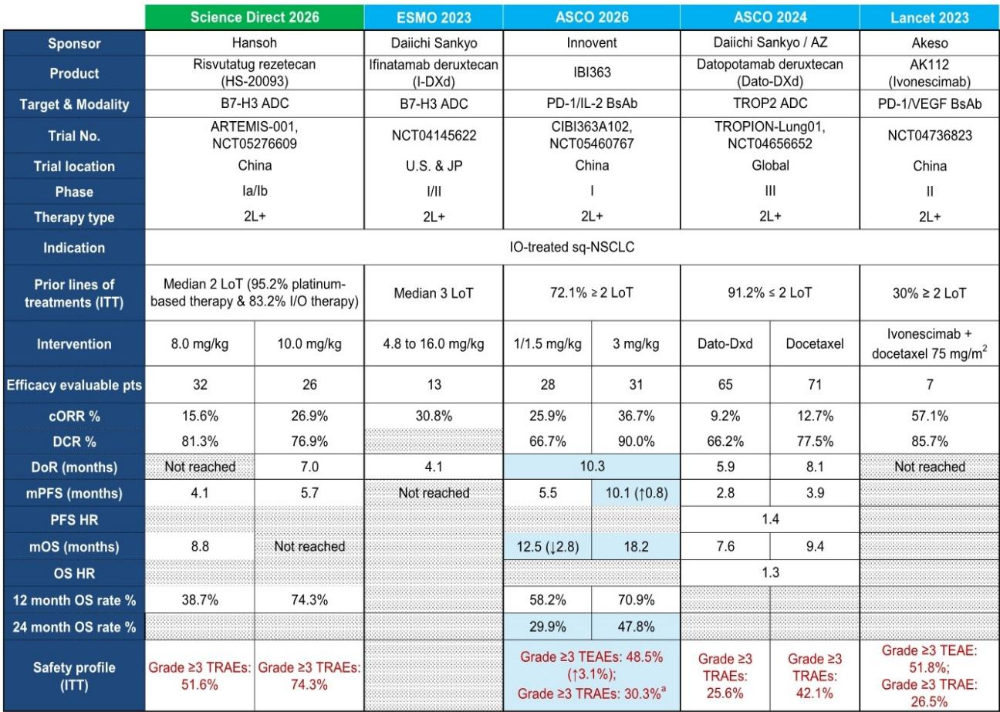
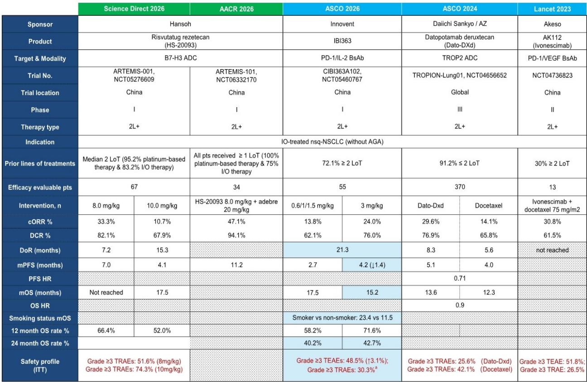
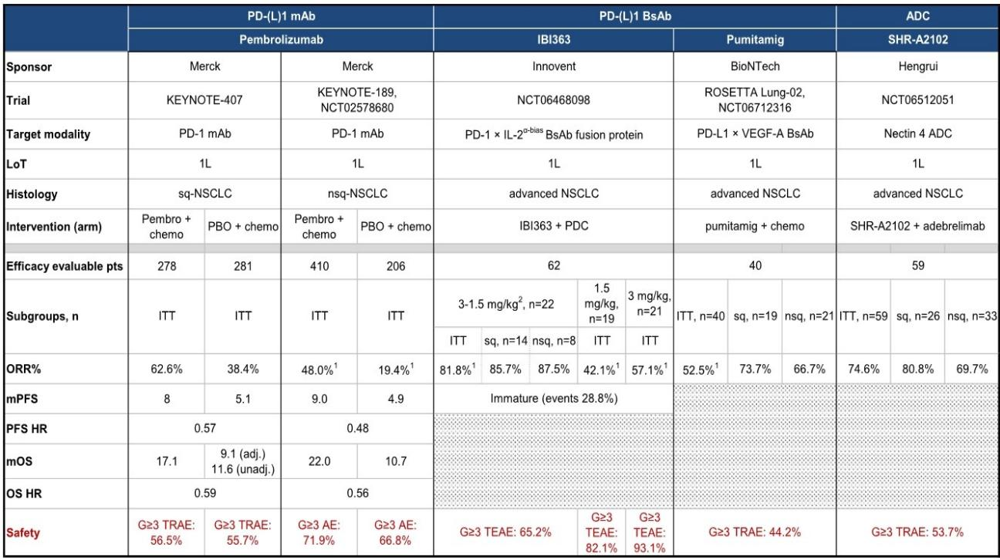

# 中国创新药在ASCO 2026的真正信号：Keytruda的“最佳助推器”已经出现，但I/O 2.0的赢家尚未确定

每年ASCO（美国临床肿瘤学会）的摘要发布，都会引发一轮对中国创新药企临床数据的密集解读。今年的第一波非小细胞肺癌（NSCLC）数据，表面上呈现的是几家公司的各自突破，但将它们放在同一张竞争格局图上，一个更清晰的判断浮现出来：**市场正在讨论的“谁能替代Keytruda”可能是一个错误的问题，真正值得追问的是“谁能成为Keytruda的最佳搭档”。**

某外资投行最新发布的研报，通过对ASCO 2026首批摘要的梳理，给出了一个既克制又富有穿透力的框架。它没有陷入对中国Biotech的简单吹捧，而是将数据放在历史对照中，揭示了两个核心信号：第一，科伦博泰的Sac-TMT联合Keytruda在1L PD-L1阳性NSCLC中展现的数据，可能是目前所见最强的“Keytruda增强剂”；第二，信达生物的IBI363在后线治疗中提供了有希望的生存信号，但其在1L的野心仍需等待全球III期临床的验证。

以下是我们基于这份研报的解读与推导。

## 1. 科伦博泰的OptiTROP-Lung05：PFS HR 0.35意味着什么，以及它为什么不是“Keytruda杀手”

研报的核心看点集中在科伦博泰的III期OptiTROP-Lung05试验。在1L PD-L1阳性NSCLC患者中，Sac-TMT联合Keytruda对比Keytruda单药，中位无进展生存期（mPFS）在10.5个月的中位随访时仍未达到，而对照组为5.7个月，风险比（HR）为0.35。总生存期（OS）数据尚未成熟，但HR为0.55。

这些数字单独看已经很亮眼，但研报通过横向对比赋予了它们更深的含义。在同样的患者群体中，Keytruda单药的mPFS通常在5-6个月，AK112单药为11个月，Keytruda联合化疗为8-11个月，Keytruda联合其他TROP2 ADC为9-13个月。而Sac-TMT联合Keytruda的mPFS，通过简单推算（5.7个月/0.35）大约在16个月以上，且此前的II期OptiTROP-Lung01试验（Sac-TMT联合PD-L1）也曾报告mPFS为15.4个月。

这意味着，科伦博泰的数据并非孤立的统计显著，而是在同类疗法中建立了一个新的疗效基准。研报特别指出，亚组分析显示，Sac-TMT联合疗法在PD-L1表达为1-49%的患者中表现优于PD-L1高表达（TPS≥50%）的患者，且在非鳞癌患者中优于鳞癌患者。这两个亚组恰好是更大的患者群体，这为未来的市场渗透提供了更广阔的空间。

但这里需要区分一个关键概念：Sac-TMT是Keytruda的“助推器”，而非“替代者”。研报的措辞非常精准：“如果我们问什么能替代Keytruda（即所谓的I/O 2.0），结论尚无定论。如果我们问什么能成为Keytruda的最佳助推器——Sac-TMT看起来最有希望。” 这意味着，在可预见的未来，Keytruda作为标准疗法的地位并未被颠覆，但联合疗法的格局正在被重新定义。对于投资者而言，这暗示着Sac-TMT的商业化价值更多体现在与现有标准疗法的协同上，而非颠覆性的单药替代。

## 2. 信达生物IBI363的后线数据：样本量限制下的信号，以及24个月OS率的真正意义

信达生物的IBI363在2L+ I/O治疗失败的NSCLC中提供了更新数据。研报的基调是谨慎的：样本量（每个治疗组20-30人）限制了绝对生存数据的解读能力。当前最佳的中位OS为17.5个月（低剂量组，非鳞癌）和18.2个月（3mg组，鳞癌），而标准的多西他赛化疗通常只能提供9-12个月的OS。

研报认为，更可靠的衡量指标可能是24个月OS率：40-50%的患者仍然存活，而多西他赛组通常只有15-20%。这一差距是显著的，但需要强调的是，早期临床数据往往因患者筛选、单中心偏倚等因素而出现“虚高”，后续扩大样本或随机对照试验可能使数据回归均值。因此，24个月OS率提供了“存在真实信号”的证据，但远未到确认疗效的程度。

另一个值得关注的细节是，在鳞癌患者中，IBI363的3mg组实现了18.2个月的中位OS，且24个月OS率为47.8%。考虑到鳞癌患者在后线治疗中的预后通常更差，这一数据如果能在更大样本中复现，将具有较高的临床价值。

但研报也点出了悬而未决的问题：IBI363的mPFS数据在本次更新中出现了调整（非鳞癌3mg组从5.6个月降至4.2个月，鳞癌3mg组从9.3个月升至10.1个月），这种波动本身也印证了样本量不足带来的不稳定性。对于投资者而言，IBI363在后线的潜力是真实的，但它需要更成熟的数据来证明自己不是“昙花一现”。

## 3. 1L NSCLC的战场：IBI363的高ORR与信达的“豪赌”

如果说后线数据是“有希望的信号”，那么信达在1L NSCLC的布局则是一场“豪赌”。本次ASCO，信达公布了IBI363联合化疗在1L NSCLC（所有PD-L1表达水平）的PoC（概念验证）研究结果。虽然只有ORR（客观缓解率）数据，但一个高到低剂量方案（首周期3 mg/kg IBI363+化疗，后续1.5 mg/kg Q3W+化疗）给出了81.8%的ORR，这是所有类似试验中的最高值。

研报同时指出，信达已经宣布启动该PoC研究的第二部分：一项随机头对头研究，比较3→1.5 mg/kg IBI363+化疗 vs. Keytruda+化疗作为1L晚期NSCLC的治疗方案。这是一个极具进攻性的策略——直接挑战当前的金标准。

但这里的关键变量在于合作伙伴武田（Takeda）。研报明确写道：“信达在1L的野心急切地等待着来自合作伙伴武田的验证——全球III期临床的启动。” 这意味着，信达自身的中国数据只能提供初步信号，而全球注册路径和商业化前景，完全取决于武田的决策和执行力。如果武田推迟或调整全球III期计划，信达的1L故事将面临根本性动摇。

从竞争格局看，IBI363的ORR数据虽然亮眼，但1L NSCLC的战场已经拥挤不堪：Keytruda+化疗是标准，AK112（依沃西单抗）正在挑战，而科伦博泰的Sac-TMT+Keytruda在PD-L1阳性人群中表现出色。IBI363需要证明的不仅是ORR的优越性，更是长期生存获益和安全性上的差异化。目前，安全性数据（Grade≥3 TEAE为48.5%）尚在可接受范围，但并未显著优于竞品。

## 4. 报告尚未完全回答的关键问题：全球III期启动时间表与定价权的博弈

这份研报虽然提供了清晰的竞争格局分析，但留下了几个尚未完全回答的关键问题，这些恰恰是未来12-18个月投资者需要密切跟踪的。

第一，科伦博泰的Sac-TMT全球III期路径何时清晰？研报指出科伦博泰“更接近终点线”，但全球注册策略、合作伙伴选择（或是否独立推进）尚未明确。考虑到Sac-TMT联合Keytruda的数据已经如此强劲，Merck是否有动力将其纳入自己的联合疗法组合？这涉及到复杂的商业博弈。

第二，信达的IBI363全球III期何时由武田启动？这是信达1L故事能否成立的核心。武田作为一家全球药企，其临床开发决策受到自身管线组合、财务资源、以及对中国数据的信任度等多重因素影响。目前没有任何公开信息可以判断武田的时间表，这构成了信达最大的不确定性。

第三，这些数据对定价权的含义是什么？如果Sac-TMT成为Keytruda的“最佳助推器”，那么科伦博泰在谈判中的议价能力将取决于其专利保护、生产壁垒以及临床数据的独特性。而信达如果成功证明IBI363可以替代Keytruda，其定价权将完全不同。但反过来，如果数据只是“还不错”而非“颠覆性”，那么中国Biotech在全球价值链中仍将扮演“成本更低的合作伙伴”角色，而非定价者。

## 5. 投资者的观察框架：区分“数据信号”与“商业信号”

基于上述分析，我们可以提炼出一个简单的观察框架，帮助决策者区分哪些是已经确认的信号，哪些是仍需验证的假设。

**已经确认的强信号：** 科伦博泰的Sac-TMT在1L PD-L1阳性NSCLC中，联合Keytruda的疗效数据（特别是PFS HR 0.35和OS HR 0.55的早期趋势）是目前同类疗法中最强的。这构成了一个明确的投资锚点，但需要关注的是数据成熟度较低（中位随访仅10.5个月），OS数据尚未成熟，长期随访可能带来HR的漂移。

**有希望但需验证的信号：** 信达IBI363在后线NSCLC的24个月OS率（40-50%）显著优于历史对照，但样本量小、数据波动大。1L的ORR数据（81.8%）令人印象深刻，但缺乏PFS和OS数据，且全球III期启动时间未知。

**未被回答的关键变量：** 全球III期的时间表、合作伙伴的意愿、以及最终商业化阶段的定价权博弈。这些变量无法从临床数据本身推导，需要跟踪公司公告、监管沟通和行业动态。

对于高净值读者和产业决策者而言，这份研报的核心价值不在于给出“买哪只股票”的结论，而在于提供了一个思考框架：**在创新药投资中，临床数据的“统计显著性”只是第一步，真正决定长期价值的，是这些数据能否转化为商业上的“议价权”——即你的产品在标准疗法面前，是不可或缺的搭档，还是可被替代的选项。** 科伦博泰目前看起来更接近前者，而信达的答案，还在路上。

---

这些未解问题——全球III期启动时间、合作伙伴的真实意愿、长期OS数据的稳定性——恰恰是完整研报中通过更详尽的图表、历史数据对比和情景分析所深入探讨的。欢迎来星球微信群里继续讨论，我们将结合更多原始图表和交叉验证，拆解这些关键假设背后的逻辑与风险。

Personal reading notes and learning share only. Not investment advice.

