# Korea Internet and European Food Delivery

# Korea Food Delivery: A stable duopoly with fragile fault lines


Min-Joo Kang

+852 2123 2644

minjoo.kang@bernsteinsg.com


Robin Zhu

+852 2123 2659

robin.zhu@bernsteinsg.com


Annick Maas

+44 20 7676 6683

annick.maas@bernsteinsg.com


William Woods

+44 20 7676 6806

william.woods@bernsteinsg.com


Christophe Cherblanc

+41 582 723 540

christophe.cherblanc@bernsteinsg.com


Charles Gou

+852 2123 2618

charles.gou@bernsteinsg.com


Hyrum Caesar

+81 3 6777 6979

hyrum.caesar@bernsteinsg.com


Christopher Pancur

+44 20 7676 7280

christopher.pancur@bernsteinsg.com

Baemin and Coupang Eats are pivoting from bleeding rider subsidy-driven land grab to disciplined monetization, prioritizing paid features and higher-margin ads over blanket discounts. As a result, Korea's food delivery market is stabilizing. However, the structure is not fully locked in - regulatory pressure on Coupang and any strategic move around Baemin's ownership could still meaningfully reshape competitive dynamics across both delivery and broader commerce.

GTV share stabilizing after rider subsidy war. Baemin and Coupang Eats' GTV split has settled at roughly 65:35 since January 2026, following the Coupang data leakage incident. As Coupang shifts its strategic focus back to product commerce, pricing discipline has returned: rider incentives have normalized to 2K - 4K KRW per order from peak levels of 4K - 10K. At the same time, support via Wow membership - once a key lever supporting per-order economics - has been scaled back, weakening the subsidy-led share push for Eats. In response, Coupang Eats is accelerating its transition into ads, building a performance marketing engine and tapping its broader commerce ecosystem to grow sponsored listings.

Next leg of growth: Quick commerce. With structural constraints outside Seoul, weaker per-order economics, and fading subsidy tailwinds, Coupang is turning to quick commerce as its next growth driver. Baemin, an early mover since COVID, already generates about $15\%$ of revenue (c.780Bn KRW) from quick commerce per filings. Coupang is now ramping up with 24-hour delivery in partnership with CVS operators (Link). Looking ahead, partnerships across food delivery and product commerce platforms could become a key lever in capturing the next wave of quick commerce growth.

Government vouchers favor Baemin. A nationwide fuel relief program (KRW 3.7tn distributed as vouchers, as of May 21) is set to lift demand for Baemin. Because vouchers can be used for in-person payments, Baemin stands to benefit disproportionately in May till August. Crucially, these subsidies apply to Baemin but not Coupang Eats, setting up a near-term GTV share tailwind.

KFTC overhang as key downside risk. The main downside risk for Coupang is regulatory. Coupang's Wow membership - a core driver of retention and cross-sell - is under scrutiny for potential anti-competitive bundling across services. Outcomes could range from fines to forced unbundling or pricing restrictions, undermining ecosystem synergies. Coupang may preempt this with a workaround, such as free Eats delivery for non-Wow users (Link).

Naver seeking partnership? Competitive intensity is picking up, with multiple local media signaling a potential shift in the landscape. In a May 19 filing, Naver said it is “reviewing various options to strengthen competitiveness” in response to reports of a possible Baemin acquisition, while noting “nothing has been decided.” (Link). With around KRW 8tn in net cash, Naver has ample firepower to accelerate strategy, and we expect Naver to create a credible path to narrow Coupang’s moat, particularly in fast shipping and cross-selling. From the perspective of DHER, the group is currently undergoing a strategic review which should result in the disposal of some assets. From the perspective of the Korean Food Delivery market should a strategic optionality around Baemin ever be considered, investors may naturally look to ecosystem players with strong cross-selling capabilities.

BERNSTEIN TICKER TABLE 

<table><tr><td colspan="3"></td><td>21 May 2026 Closing</td><td>Price</td><td>TTM Rel.</td><td colspan="4">Adjusted EPS</td><td colspan="3">Adjusted P/E (x)</td></tr><tr><td>Ticker</td><td>Rating</td><td>Cur</td><td>Price</td><td>Target</td><td>Perf.</td><td>Cur</td><td>2025A</td><td>2026E</td><td>2027E</td><td>2025A</td><td>2026E</td><td>2027E</td></tr><tr><td>CPNG (Coupang)</td><td>U</td><td>USD</td><td>15.73</td><td>15.00</td><td>(69.9)%</td><td>USD</td><td>0.10</td><td>(0.13)</td><td>0.30</td><td>158.7</td><td>(122.5)</td><td>52.6</td></tr><tr><td>035420.KS (Naver)</td><td>O</td><td>KRW</td><td>199,200</td><td>290,000</td><td>(31.5)%</td><td>KRW</td><td>13,065</td><td>12,745</td><td>14,815</td><td>15.2</td><td>15.6</td><td>13.4</td></tr><tr><td>DHER.GR (Delivery Hero)</td><td>O</td><td>EUR</td><td>33.06</td><td>28.00</td><td>16.3%</td><td>EUR</td><td>(2.62)</td><td>(2.90)</td><td>(2.52)</td><td>0.9</td><td>0.8</td><td>0.8</td></tr><tr><td>SPX</td><td></td><td></td><td>7,445.72</td><td></td><td></td><td></td><td></td><td></td><td></td><td></td><td></td><td></td></tr><tr><td>ASIAX</td><td></td><td></td><td>1,924.46</td><td></td><td></td><td></td><td></td><td></td><td></td><td></td><td></td><td></td></tr><tr><td>EDME</td><td></td><td></td><td>1,536.79</td><td></td><td></td><td></td><td></td><td></td><td></td><td></td><td></td><td></td></tr></table>

O - Outperform, M - Market-Perform, U - Underperform, NR - Not Rated, CS - Coverage Suspended   
DHER.GR valuation is EV/Sales (x);   
Source: Bloomberg, Bernstein estimates and analysis.

# INVESTMENT IMPLICATIONS

We have an Underperform rating on Coupang and Outperform rating on Naver. We reiterate our core industry thesis that competition dictates margins. Competitive intensity is rising, with e-commerce players increasingly pursuing partnerships to strengthen their ecosystems, lock in users, and build a frequency-driven flywheel. Any such partnerships have the potential to reshape both the e-commerce and food delivery markets in Korea.

We have an Outperform rating on DHER.

# VALUATION COMPS TABLE

EXHIBIT 1: Asia Internet: valuation summary 

<table><tr><td></td><td>Rating</td><td>Price target</td><td>Last price</td><td>Crncy</td><td>Market cap (US$mn)</td><td>2026E</td><td>PE 2027E</td><td>2028E</td><td>2026E</td><td>EV/sales 2027E</td><td>2028E</td></tr><tr><td colspan="12">China Internet coverage</td></tr><tr><td>Tencent</td><td>O</td><td>780</td><td>455.20</td><td>HKD</td><td>529,869</td><td>13.4x</td><td>11.6x</td><td>10.1x</td><td>4.4x</td><td>3.8x</td><td>3.4x</td></tr><tr><td>PDD</td><td>M</td><td>132</td><td>98.15</td><td>USD</td><td>139,706</td><td>8.2x</td><td>7.4x</td><td>6.6x</td><td>0.9x</td><td>0.6x</td><td>0.4x</td></tr><tr><td>Meituan</td><td>M</td><td>85</td><td>82.85</td><td>HKD</td><td>65,308</td><td>n.a.</td><td>23.6x</td><td>12.4x</td><td>1.0x</td><td>0.9x</td><td>0.7x</td></tr><tr><td>NetEase</td><td>O</td><td>150</td><td>116.82</td><td>USD</td><td>74,546</td><td>13.5x</td><td>12.1x</td><td>11.2x</td><td>3.2x</td><td>2.8x</td><td>2.6x</td></tr><tr><td>Boss Zhipin</td><td>M</td><td>16.5</td><td>14.07</td><td>USD</td><td>6,802</td><td>11.4x</td><td>9.7x</td><td>8.6x</td><td>2.5x</td><td>1.9x</td><td>1.4x</td></tr><tr><td>JD</td><td>O</td><td>40</td><td>32.46</td><td>USD</td><td>44,335</td><td>10.5x</td><td>7.7x</td><td>5.8x</td><td>0.2x</td><td>0.2x</td><td>0.2x</td></tr><tr><td>Alibaba</td><td>O</td><td>180</td><td>134.47</td><td>USD</td><td>322,612</td><td>31.1x</td><td>21.8x</td><td>19.2x</td><td>2.2x</td><td>2.0x</td><td>1.8x</td></tr><tr><td colspan="12">China Internet other</td></tr><tr><td>Kuaishou</td><td></td><td></td><td>47.68</td><td>HKD</td><td>26,401</td><td>10.6x</td><td>9.3x</td><td>8.3x</td><td>1.1x</td><td>1.0x</td><td>1.0x</td></tr><tr><td>Bilibili</td><td></td><td></td><td>18.30</td><td>USD</td><td>7,778</td><td>17.8x</td><td>14.0x</td><td>10.8x</td><td>1.2x</td><td>1.1x</td><td>1.0x</td></tr><tr><td>TME</td><td></td><td></td><td>9.15</td><td>USD</td><td>15,203</td><td>9.6x</td><td>8.7x</td><td>8.0x</td><td>2.0x</td><td>1.8x</td><td>1.7x</td></tr><tr><td>iQiyi</td><td></td><td></td><td>1.10</td><td>USD</td><td>1,062</td><td>193.9x</td><td>5.8x</td><td>3.5x</td><td>0.6x</td><td>0.5x</td><td>0.5x</td></tr><tr><td>Baidu</td><td></td><td></td><td>135.22</td><td>USD</td><td>46,009</td><td>17.0x</td><td>14.8x</td><td>12.1x</td><td>1.5x</td><td>1.4x</td><td>1.3x</td></tr><tr><td>VIPshop</td><td></td><td></td><td>14.22</td><td>USD</td><td>6,829</td><td>5.5x</td><td>5.2x</td><td>5.0x</td><td>0.3x</td><td>0.3x</td><td>0.2x</td></tr><tr><td>Tencent Music</td><td></td><td></td><td>9.15</td><td>USD</td><td>15,203</td><td>9.6x</td><td>8.7x</td><td>8.0x</td><td>2.0x</td><td>1.8x</td><td>1.7x</td></tr><tr><td>Trip.com</td><td></td><td></td><td>48.56</td><td>USD</td><td>30,578</td><td>11.9x</td><td>10.5x</td><td>9.2x</td><td>2.4x</td><td>2.1x</td><td>1.9x</td></tr><tr><td>KE Holdings</td><td></td><td></td><td>18.07</td><td>USD</td><td>21,094</td><td>21.6x</td><td>18.5x</td><td>17.6x</td><td>1.3x</td><td>1.2x</td><td>1.1x</td></tr><tr><td colspan="12">Asian Internet</td></tr><tr><td>Naver</td><td>O</td><td>290,000</td><td>192,400</td><td>KRW</td><td>20,161</td><td>15.1x</td><td>13.0x</td><td>11.3x</td><td>1.4x</td><td>1.1x</td><td>0.9x</td></tr><tr><td>Kakao</td><td>O</td><td>80,000</td><td>40,250</td><td>KRW</td><td>11,875</td><td>26.5x</td><td>21.7x</td><td>16.6x</td><td>1.4x</td><td>1.1x</td><td>0.9x</td></tr><tr><td>Hybe</td><td>O</td><td>400,000</td><td>228,000</td><td>KRW</td><td>6,564</td><td>22.4x</td><td>19.6x</td><td>17.2x</td><td>1.9x</td><td>1.9x</td><td>1.8x</td></tr><tr><td>Coupang</td><td>U</td><td>15</td><td>15.62</td><td>USD</td><td>28,039</td><td>-121.7x</td><td>52.2x</td><td>31.1x</td><td>0.6x</td><td>0.6x</td><td>0.5x</td></tr><tr><td>Sea Ltd.</td><td></td><td></td><td>86.55</td><td>USD</td><td>53,011</td><td>24.0x</td><td>17.6x</td><td>14.1x</td><td>1.5x</td><td>1.3x</td><td>1.1x</td></tr><tr><td>Grab</td><td></td><td></td><td>3.51</td><td>USD</td><td>14,393</td><td>34.8x</td><td>22.9x</td><td>16.9x</td><td>2.5x</td><td>2.0x</td><td>1.7x</td></tr><tr><td colspan="12">US Internet</td></tr><tr><td>Amazon</td><td></td><td></td><td>265.01</td><td>USD</td><td>2,850,742</td><td>25.7x</td><td>22.7x</td><td>18.3x</td><td>3.6x</td><td>3.1x</td><td>2.8x</td></tr><tr><td>Alphabet</td><td></td><td></td><td>388.91</td><td>USD</td><td>4,688,479</td><td>27.0x</td><td>25.5x</td><td>21.2x</td><td>11.0x</td><td>9.2x</td><td>7.7x</td></tr><tr><td>Meta</td><td></td><td></td><td>605.06</td><td>USD</td><td>1,535,898</td><td>17.5x</td><td>15.8x</td><td>13.1x</td><td>6.1x</td><td>5.1x</td><td>4.4x</td></tr><tr><td>Netflix</td><td></td><td></td><td>88.09</td><td>USD</td><td>370,929</td><td>24.7x</td><td>22.8x</td><td>19.2x</td><td>7.3x</td><td>6.5x</td><td>5.9x</td></tr><tr><td>Uber</td><td></td><td></td><td>74.60</td><td>USD</td><td>151,856</td><td>22.5x</td><td>16.6x</td><td>13.6x</td><td>2.7x</td><td>2.4x</td><td>2.1x</td></tr><tr><td>Spotify</td><td></td><td></td><td>433.32</td><td>USD</td><td>89,191</td><td>29.0x</td><td>23.7x</td><td>19.7x</td><td>3.5x</td><td>3.1x</td><td>2.7x</td></tr><tr><td>DoorDash</td><td></td><td></td><td>160.73</td><td>USD</td><td>70,033</td><td>32.9x</td><td>23.8x</td><td>18.0x</td><td>3.8x</td><td>3.2x</td><td>2.7x</td></tr></table>

Pricing date May 20, 2026. The valuation multiples of our China and Asian Internet coverage are based on Bernstein estimates; the other companies shown reflect Bloomberg consensus estimates.   
Source: Corporate reports, Bloomberg, Bernstein estimates and analysis.

# DETAILS

EXHIBIT 2: Korea's food delivery market is stabilizing, but regulatory risks around Coupang and any shift in Baemin's ownership could still reshape competition.   
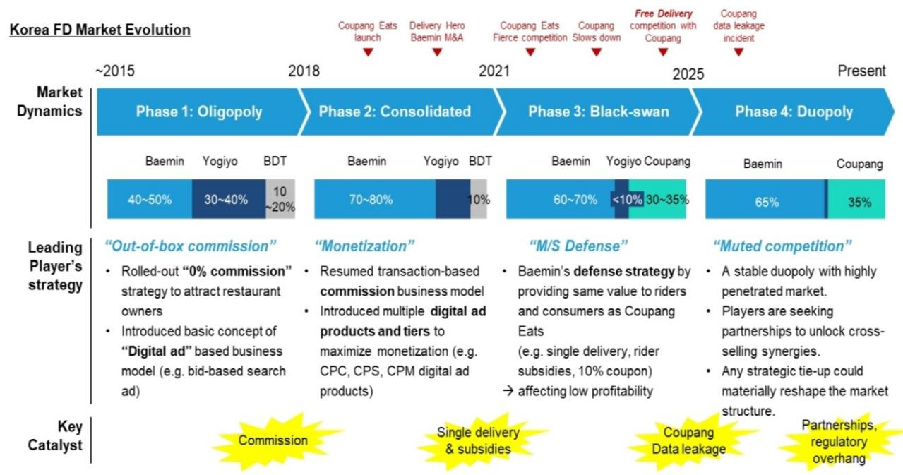

<details>
<summary>line</summary>

Korea FD Market Evolution
| Period | Market Dynamics | Phase 1: Oligopoly (%) | Phase 2: Consolidated (%) | Phase 3: Black-swan (%) | Phase 4: Duopoly (%) |
|---|---|---|---|---|---|
| ~2015 | Baemin | 40~50% | Baemin | 70~80% | 60~70% |
| 2018 | Yogiyo | 30~40% | Yogiyo | 10~20% | Yogiyo Coupang |
| 2021 | BDT | 40~50% | Baemin | 10% | <10% |
| 2025 | Baemin | 65% | Baemin | 35% | Free Delivery competition with Coupang |
| Present | Baemin | 65% | Baemin | 35% | Free Delivery competition with Coupang |
| 2021 | Fierce competition | 70~80% | Baemin | 10% | BDT |
| 2025 | Slows down | 60~70% | Baemin | 30~35% | BDT |
| 2021 | Delivery Hero Baemin M&A | 40~50% | Baemin | 70~80% | Yogiyo Coupang |
| 2025 | Buyout Energy Eats launch | 40~50% | Baemin | 60~70% | Yogiyo Coupang |
| 2021 | Free Delivery competition with Coupang | 60~70% | Baemin | 30~35% | BDT |
| 2025 | Buyout Data leakage incident | 65% | Baemin | 35% | BDT |
| Key Catalyst: Key Catalyst
| Commission: Key Catalyst
| Single delivery & subsidies: Key Catalyst
| Coupang Data leakage: Key Catalyst
| Partnerships, regulatory overhang: Key Catalyst
</details>

Note 1. Delivery Hero acquisition of Baemin confirmed in Dec 2019 and completed in Mar 2021.   
Note 2. Delivery Hero required to sell Yogiyo by Fair Trade Commission in Dec 2020 and completed divestiture in Oct 2021. Source: Corporate reports, Expert interview, Wiseapp, Bernstein analysis.

EXHIBIT 3: Intense rider subsidy competition has compressed per-order profitability in Korea's food delivery market from 2023.   
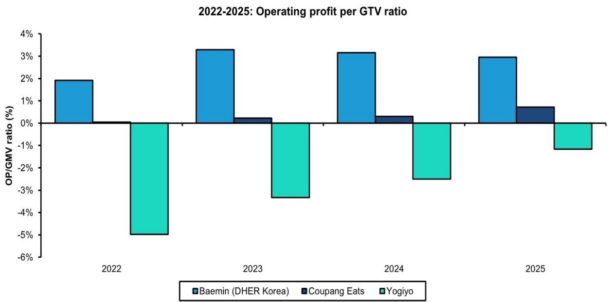

<details>
<summary>bar</summary>

2022-2025: Operating profit per GTV ratio
| Year | Baemin (DHER Korea) (%) | Coupang Eats (%) | Yogiyo (%) |
|---|---|---|---|
| 2022 | 1.9 | -0.1 | -5.3 |
| 2023 | 3.3 | 0.2 | -3.4 |
| 2024 | 3.1 | 0.3 | -2.6 |
| 2025 | 2.9 | 0.7 | -1.2 |
</details>

Source: Corporate reports, DART, Wiseapp, Bernstein analysis.

EXHIBIT 4: Coupang Eats' subsidy-driven share gains are fading as support from Wow membership - once key to per-order economics - is scaled back.   
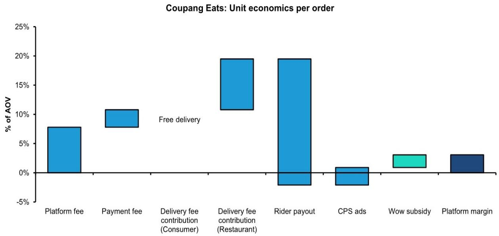

<details>
<summary>bar</summary>

Coupang Eats: Unit economics per order
| Category | % of AOV (%) |
|---|---|
| Platform fee | 7.8 |
| Payment fee | 10.6 |
| Delivery fee contribution (Consumer) | 19.5 |
| Delivery fee contribution (Restaurant) | 10.8 |
| Rider payout | -2.3 |
| CPS ads | -1.4 |
| Wow subsidy | 2.8 |
| Platform margin | 3.1 |
Free delivery
</details>

Source: Corporate reports, Bernstein estimates and analysis.

EXHIBIT 5: The food delivery market in Korea looks increasingly stable post Coupang data leakage incident in November 2025.   
  
Source: Wiseapp, Bernstein analysis.

EXHIBIT 6: Baemin's revenue growth rate has been decelerated...   
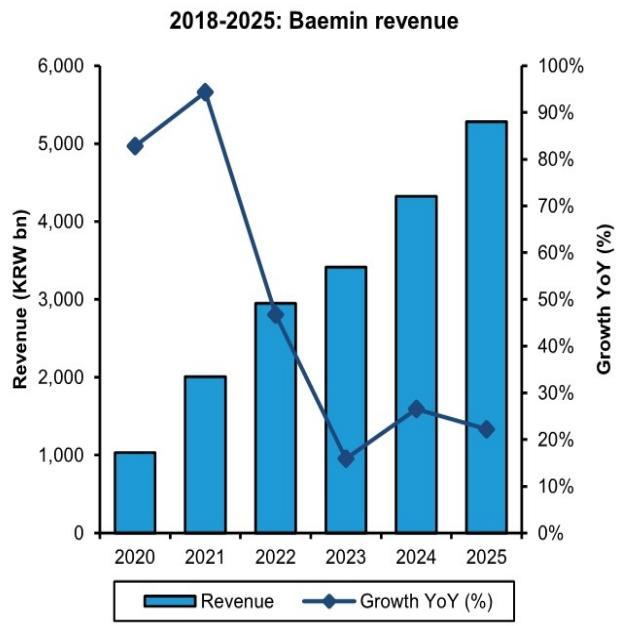

<details>
<summary>bar_line</summary>

2018-2025: Baemin revenue
| Year | Revenue (KRW bn) | Growth YoY (%) |
| :--- | :--- | :--- |
| 2020 | 1050 | 83 |
| 2021 | 2000 | 96 |
| 2022 | 2950 | 47 |
| 2023 | 3450 | 17 |
| 2024 | 4350 | 27 |
| 2025 | 5250 | 23 |
</details>

Source: Corporate reports, DART, Bernstein analysis.

EXHIBIT 7: ... Baemin margin has been under pressure with the Coupang competition.   
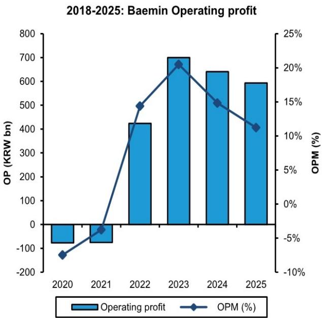

<details>
<summary>bar_line</summary>

2018-2025: Baemin Operating profit
| Year | Operating profit (KRW bn) | OPM (%) |
| :--- | :--- | :--- |
| 2020 | -70 | -8.5 |
| 2021 | -60 | -3.5 |
| 2022 | 425 | 14.5 |
| 2023 | 700 | 21.0 |
| 2024 | 645 | 15.0 |
| 2025 | 590 | 11.5 |
</details>

Source: Corporate reports, DART, Bernstein analysis.

EXHIBIT 8: Baemin, an early mover since COVID, already generates about 15% of revenue from quick commerce.   
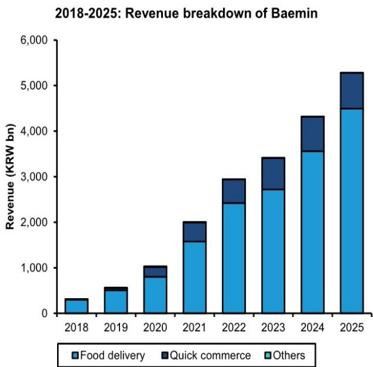

<details>
<summary>bar_stacked</summary>

2018-2025: Revenue breakdown of Baemin
| Year | Food delivery (KRW bn) | Quick commerce (KRW bn) | Others (KRW bn) |
|---|---|---|---|
| 2018 | 300 | 0 | 0 |
| 2019 | 500 | 100 | 0 |
| 2020 | 800 | 200 | 0 |
| 2021 | 1600 | 400 | 0 |
| 2022 | 2400 | 600 | 0 |
| 2023 | 2700 | 800 | 0 |
| 2024 | 3500 | 900 | 0 |
| 2025 | 4500 | 1100 | 0 |
</details>

Source: Corporate reports, DART, Bernstein analysis.

EXHIBIT 9: We see potential for quick commerce to regain growth momentum as the focus of food delivery shifts.   
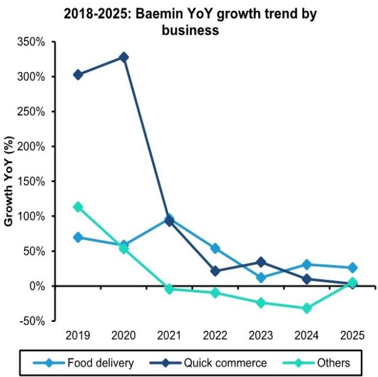

<details>
<summary>line</summary>

2018-2025: Baemin YoY growth trend by business
| Year | Food delivery (%) | Quick commerce (%) | Others (%) |
|---|---|---|---|
| 2019 | 70 | 300 | 115 |
| 2020 | 60 | 330 | 55 |
| 2021 | 95 | 95 | -5 |
| 2022 | 55 | 25 | -10 |
| 2023 | 15 | 35 | -25 |
| 2024 | 30 | 10 | -30 |
| 2025 | 25 | 5 | 5 |
</details>

Source: Corporate reports, DART, Bernstein analysis.

EXHIBIT 10: Coupang Eats has gained revenue momentum by capturing incremental share from Baemin.   
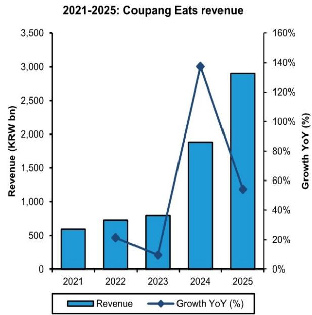

<details>
<summary>bar_line</summary>

2021-2025: Coupang Eats revenue
| Year | Revenue (KRW bn) | Growth YoY (%) |
|---|---|---|
| 2021 | 600 | - |
| 2022 | 730 | 24 |
| 2023 | 800 | 11 |
| 2024 | 1900 | 140 |
| 2025 | 2900 | 56 |
</details>

EXHIBIT 11: Coupang Eats' margins improved in 2025, supported by a period of subdued competition.   
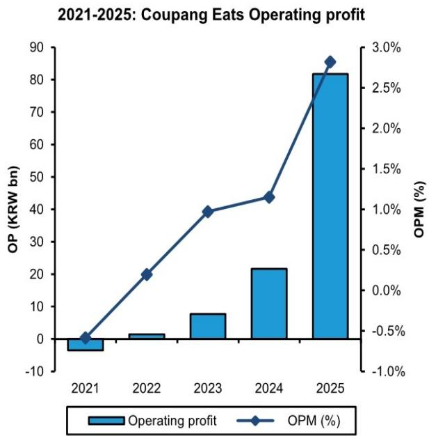

<details>
<summary>bar_line</summary>

2021-2025: Coupang Eats Operating profit
| Year | Operating profit (KRW bn) | OPM (%) |
|---|---|---|
| 2021 | -3 | -0.7 |
| 2022 | 1.5 | 0.2 |
| 2023 | 8 | 0.9 |
| 2024 | 22 | 1.3 |
| 2025 | 82 | 2.8 |
</details>

Source: Corporate reports, DART, Bernstein analysis.   
Source: Corporate reports, DART, Bernstein analysis.

EXHIBIT 12: Looking ahead, partnerships across food delivery and product commerce platforms could become a key lever in capturing the next wave of quick commerce growth.   
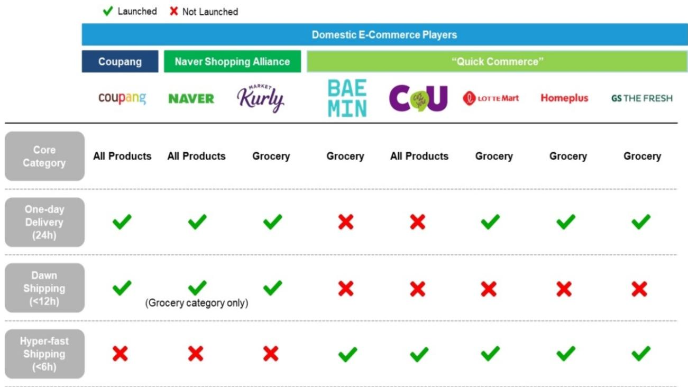

<details>
<summary>other</summary>

Domestic E-Commerce Players
| Category | Product Type | All Products | Grocery | Grocery | All Products | Grocery | Grocery | Grocery |
| :--- | :--- | :--- | :--- | :--- | :--- | :--- | :--- | :--- |
| Core Category | Coupang | Naver Shopping Alliance | Market Kurly | BAEMIN | COU | LOTTE Mart | Homeplus | GS THE FRESH |
| One-day Delivery (24h) | ✓ | ✓ | ✓ | ✗ | ✗ | ✓ | ✓ | ✓ |
| Dawn Shipping (<12h) | ✓ (Grocery category only) | ✓ | ✓ | ✗ | ✗ | ✗ | ✗ | ✗ |
| Hyper-fast Shipping (<6h) | ✗ | ✗ | ✗ | ✓ | ✓ | ✓ | ✓ | ✓ |
</details>

Source: Company Websites, Bernstein analysis.

EXHIBIT 13: The Korean FTC's designation of founder Bom Kim as the "same person" for Coupang, announced on April 29, 2026   
Coupang's shareholding structure   
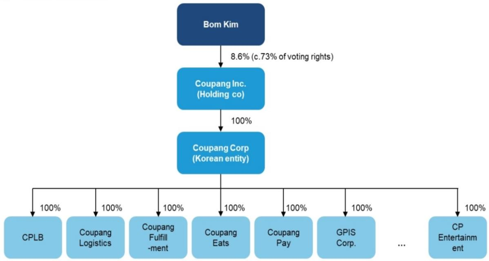

<details>
<summary>flowchart</summary>

```mermaid
graph TD
    A["Bom Kim"] -->|8.6% (c.73% of voting rights)| B["Coupang Inc. (Holding co)"]
    B -->|100%| C["Coupang Corp (Korean entity)"]
    C -->|100%| D["CPLB"]
    C -->|100%| E["Coupang Logistics"]
    C -->|100%| F["Coupang Fulfill -ment"]
    C -->|100%| G["Coupang Eats"]
    C -->|100%| H["Coupang Pay"]
    C -->|100%| I["GPIS Corp."]
    I --> J["..."]
    I --> K["CP Entertainment"]
```
</details>

Source: KFTC, Bernstein analysis.

EXHIBIT 14: The ongoing KFTC investigation into Coupang's Wow membership bundling, especially the tie between core Product Commerce and Coupang Eats, is a central regulatory swing factor.   
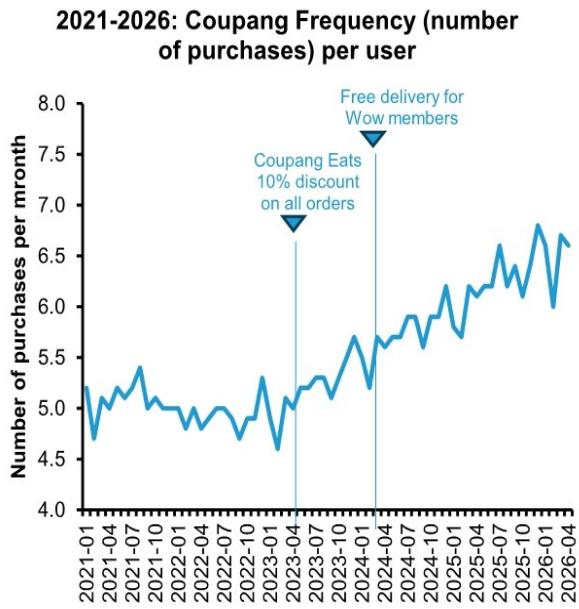

<details>
<summary>line</summary>

| Date       | Number of purchases per month |
| ---------- | ----------------------------- |
| 2023-04    | 7.0                           |
| 2024-04    | 6.5                           |
</details>

Source: Wiseapp, Bernstein analysis.

EXHIBIT 15: Coupang's FTC investigation regarding its Wow membership bundling remains ongoing. 

<table><tr><td>Case/ Issue Type</td><td>Overview/ Allegation</td><td>Government reaction/ KFTC decision</td><td>Coupang Status</td></tr><tr><td>Massive data breach &amp; consumer protection issues (Late 2025-present)</td><td>Leak of personal information from 33 million customer account, raising concern on consumer data protection obligations in e-commerce with KFTC authority implicated under Act on Consumer Protection in E-Commerce</td><td>Government formed an interagency task force; KFTC has authority to investigate and can order temporary suspension of the company&#x27;s operations under e-commerce consider protection law, but still considering prerequisites and has not announced a final sanction.</td><td>Coupang has acknowledged the breach; is cooperating with regulators and a task force.</td></tr><tr><td>Algorithm manipulation &amp; PB self-preferencing (2024-present)</td><td>Alleged manipulation of search rankings to favor Coupang private label (PB) and 1P products over 3P products.</td><td>KFTC imposed a record fine, 140 bn KRW, ordered cessation of PB favoritism and fake review activities.</td><td>Coupang appealed the fine and correction order in court; has not fully implemented required fixes pending litigation outcome.</td></tr><tr><td>Wow membership bundling (2023-present)</td><td>Investigation into whether Coupang Rocket Delivery, Coupang Eats food delivery and Coupang Play OTT streaming into a single Wow membership fee constitutes abuse of market power or illegal tying that may foreclose competitors&#x27; services.</td><td>KFTC has conducted an on-site investigation at Coupang HQ and is examining application of abuse-of-dominance or tying provisions; the case is being reviewed alongside other digital platform consent-oder cases, but no fine or formal corrective order announced yet.</td><td>Coupang continues to operate Wow membership.Any structural or pricing changes will depend on the KFTC&#x27;s decision or consent-order style resolution.</td></tr></table>

Source: Corporate reports, Bernstein analysis.

# I. REQUIRED DISCLOSURES

References to "Bernstein" or the "Firm" in these disclosures relate to the following entities: Bernstein Institutional Services LLC (April 1, 2024 onwards), Bernstein & Co., LLC (pre April 1, 2024), Bernstein Autonomous LLP, BSG France S.A. (April 1, 2024 onwards), Bernstein (Hong Kong) Limited 盛博香港有限公司, Bernstein (Canada) Limited, Bernstein (India) Private Limited (SEBI registration no. INH000006378), Bernstein (Singapore) Private Limited, Bernstein Japan KK (サンフォード・C・バーンスタイン株式会社) and analysts employed by SG Africa Technologies & Services to produce Bernstein under a Global Services Agreement in place between Bernstein and SG.

Bernstein is part of a joint venture between SG (SG) and AllianceBernstein, L.P. (AB). Unless specifically noted otherwise, for purposes of these disclosures, references to Bernstein's "affiliates" relate to both SG and AB and their respective affiliates.

# VALUATION METHODOLOGY

# Coupang Inc

We have valued Coupang at a price target of USD 15 based on a DCF valuation method, implying one year forward PER of 45x (Q2 2027-Q1 2028). (DCF assumptions: WACC=12%, Terminal growth rate: 2%; Risk-Free Rate of Return (Rf) = 3.6%, Market Risk Premium (Rm - Rf) = 17%, Beta = 0.5)

# Naver Corporation

We have valued Naver at a price target of KRW 290,000 based on a DCF valuation method, implying one year forward PER of 19x (Q2 2027-Q1 2028). (DCF assumptions: WACC=12%, Terminal growth rate: 2%; Risk-Free Rate of Return (Rf) = 3.6%, Market Risk Premium (Rm - Rf) = 17%, Beta = 0.5)

# Delivery Hero SE

Our PT of €28 is based on a multiple SOTP. We do a valuation by brand. For talabat we use the market value, for other brands we generally use the price paid and apply discounts to reflect mostly the share price decline experienced since the acquisition but also brand specific discounts. For Woowa, we are using the implicit talabat multiple with a 25% discount due to recent operational challenges.

# RISKS

# Coupang Inc

Upside risk: Stronger-than-expected top-line growth; end of investment cycle in overseas markets and market share gains; resolution of regulatory risk overhang issues.

# Naver Corporation

Downside risk: Weaker-than-expected e-commerce GMV growth; faster-than-expected user engagement decline in the search domain; additional investment in non-core business; government disapproval of the stock swap with Dunamu.

# Delivery Hero SE

Downside risk: 1) competitive pressures could mean market share losses and need for marketing spend, 2) cost inflation in absence of revenue growth, rider 3) regulation becoming stricter could harm the logistics side of the business, 4) too many promotions could harm the group's profitability whereas not enough may mean a loss of clients.

# RATINGS DEFINITIONS, BENCHMARKS AND DISTRIBUTION

# EQUITY RATINGS DEFINITIONS

# Bernstein brand

The Bernstein brand rates stocks based on forecasts of relative performance for the next 12 months versus the S&P 500 for stocks listed on the U.S. and Canadian exchanges, versus the Bloomberg Europe Developed Markets Large and Mid Cap Price Return Index EUR (EDME) for stocks listed on the European exchanges and emerging markets exchanges outside of the Asia Pacific region, versus the Bloomberg Japan Large and Mid Cap Price Return Index USD (JPL) for stocks listed on the Japanese exchanges, and versus the Bloomberg Asia ex-Japan Large and Mid Cap Price Return Index (ASIAX) for stocks listed on the Asian (ex-Japan) exchanges -unless otherwise specified.

The Bernstein brand has three categories of ratings:

- Outperform: Stock will outpace the market index by more than 15 pp   
- Market-Perform: Stock will perform in line with the market index to within +/-15 pp   
- Underperform: Stock will trail the performance of the market index by more than 15 pp

Coverage Suspended: Coverage of a company under the Bernstein brand has been suspended. Ratings and price targets are suspended temporarily, are no longer current, and should therefore not be relied upon.

Not Rated: A rating assigned when the stock cannot be accurately valued, or the performance of the company accurately predicted, at the present time. The covering analyst may continue to publish research reports on the company to update investors on events and developments.

Not Covered (NC) denotes companies that are not under coverage.

Bernstein brand stock ratings are based on a 12-month time horizon.

# Autonomous brand – common stocks

The Autonomous brand rates common stocks as indicated below. As our benchmarks we use the Bloomberg Europe 500 Banks And Financial Services Index (BEBANKS) and Bloomberg Europe Dev Mkt Financials Large and Mid Cap Price Ret Index EUR (EDMFI) index for developed European banks and Payments, the Bloomberg Europe 500 Insurance Index (BEINSUR) for European insurers, the S&P 500 and S&P Financials for US banks and Payments coverage, S5LIFE for US Insurance, the S&P Insurance Select Industry (SPSIINS) for US Non-Life Insurers coverage, and the Bloomberg Emerging Markets Financials Large, Mid and Small Cap Price Return Index (EMLSF) for emerging market banks and insurers and Payments. Ratings are stated relative to the sector (not the market).

The Autonomous brand has three categories of common stock ratings:

- Outperform (OP): Stock will outpace the relevant index by more than 10 pp   
- Neutral (N): Stock will perform in line with the market index to within +/-10 pp   
- Underperform (UP): Stock will trail the performance of the relevant index by more than 10 pp

Coverage Suspended: Coverage of a company under the Autonomous research brand has been suspended. Ratings and price targets are suspended temporarily, are no longer current, and should therefore not be relied upon.

Not Rated: A rating assigned when the stock cannot be accurately valued, or the performance of the company accurately predicted, at the present time. The covering analyst may continue to publish research reports on the company to update investors on events and developments.

Those denoted as 'Feature' (e.g., Feature Outperform FOP, Feature Under Outperform FUP) are our core ideas.

Not Covered (NC) denotes companies that are not under coverage.

Autonomous brand common stock ratings are based on a 12-month time horizon.

# Autonomous brand – preferred stocks

The Autonomous brand has three categories of preferred stock ratings:

- Outperform (OP): The total return of the preferred instrument is expected to outperform preferred securities of other issuers operating in similar sectors or rating categories over the next six months.   
- Neutral (N): The total return of the preferred instrument is expected to perform in line with preferred securities of other issuers operating in similar sectors or rating categories over the next six months.   
- Underperform (UP): The total return of the preferred instrument is expected to underperform preferred securities of other issuers operating in similar sectors or rating categories over the next six months.

Autonomous preferred stock ratings are based on a 6-month time horizon.

# AUTONOMOUS CREDIT RESEARCH

Where this report contains investment recommendations for credit instruments, as defined in article 3(1)(35) of the Market Abuse Regulation, the information below is presented to comply with its disclosure requirements.

The report may also include reference(s) to published opinions by other Autonomous or Bernstein analysts covering the equity securities of the issuer(s) referenced herein. Please note an investment recommendation for credit instruments published by the author(s) of this report may differ from the published view of the analyst covering equity securities for the issuer(s) contained in this report and vice versa.

# CREDIT RATINGS DEFINITIONS

The Autonomous brand has three categories of credit ratings:

- Credit Outperform (C-OP): The total return of the Reference Credit Instrument is expected to outperform the credit spread of bonds of other issuers operating in similar sectors or rating categories over the next six months.   
- Credit Neutral (C-N): The total return of the Reference Credit Instrument is expected to perform in line with the credit spread of bonds of other issuers operating in similar sectors or rating categories over the next six months.   
- Credit Underperform (C-UP): The total return of the Reference Credit Instrument is expected to underperform the credit spread of bonds of other issuers operating in similar sectors or rating categories over the next six months.

Autonomous credit ratings are based on a 6-month time horizon.

A list of all investment recommendations produced by the author(s) of this report alongside credit ratings history are available upon request.

It is at the sole discretion of the Firm as to when to initiate, update and cease research coverage. The Firm has established, maintains and relies on information barriers to control the flow of information contained in one or more areas (i.e. the private side) within the Firm, and into other areas, units, groups or affiliates (i.e. public side) of the Firm

DISTRIBUTION OF EQUITY RATINGS/INVESTMENT BANKING SERVICES 

<table><tr><td>Equity Rating</td><td>Market Abuse Regulation (MAR) and FINRA Rating Category</td><td>Global Rating Distribution</td><td>Investment Banking Relationships*</td></tr><tr><td>Outperform</td><td>BUY</td><td>51.1%</td><td>16.5%</td></tr><tr><td>Market-Perform (Bernstein Brand) Neutral (Autonomous Brand)</td><td>HOLD</td><td>36.3%</td><td>17.8%</td></tr><tr><td>Underperform</td><td>SELL</td><td>12.6%</td><td>14.9%</td></tr></table>

\* These figures represent the percentage of companies within each equity rating category for which affiliates of Bernstein have provided investment banking services within the previous 12 months.

As of March 31, 2026. All figures are updated quarterly.

# PRICE CHARTS / RATINGS AND PRICE TARGET HISTORY

Coupang Inc (CPNG) Rating History for Bernstein as of 05/21/2026   
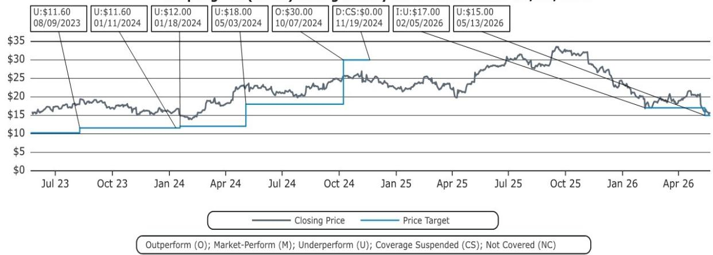

<details>
<summary>line</summary>

| Date       | Closing Price | Price Target |
| ---------- | ------------- | ------------ |
| 08/09/2023 | $11.60        | $11.60       |
| 01/11/2024 | $11.60        | $11.60       |
| 01/18/2024 | $12.00        | $12.00       |
| 05/03/2024 | $18.00        | $18.00       |
| 10/07/2024 | $30.00        | $30.00       |
| 11/19/2024 | $0.00         | $0.00        |
| 02/05/2026 | $17.00        | $17.00       |
| 05/13/2026 | $15.00        | $15.00       |
</details>

Naver Corporation (035420.KS) Rating History for Bernstein as of 05/21/2026   
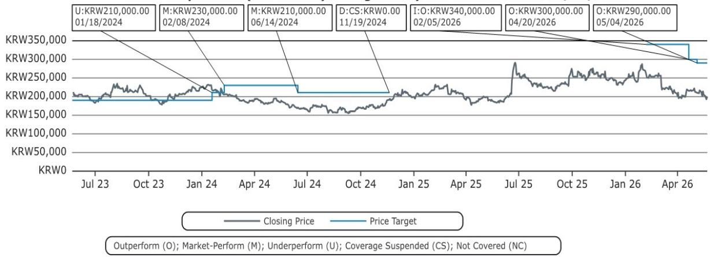

<details>
<summary>line</summary>

| Date       | Closing Price | Price Target |
|------------|---------------|--------------|
| 01/18/2024 | KRW210,000.00 | KRW210,000.00 |
| 02/08/2024 | KRW230,000.00 | KRW230,000.00 |
| 06/14/2024 | KRW210,000.00 | KRW210,000.00 |
| 11/19/2024 | KRW0.00        | KRW0.00       |
| 02/05/2026 | KRW340,000.00 | KRW340,000.00 |
| 04/20/2026 | KRW300,000.00 | KRW300,000.00 |
| 05/04/2026 | KRW290,000.00 | KRW290,000.00 |
</details>

Delivery Hero SE (DHER.GR) Rating History for Bernstein as of 05/21/2026   
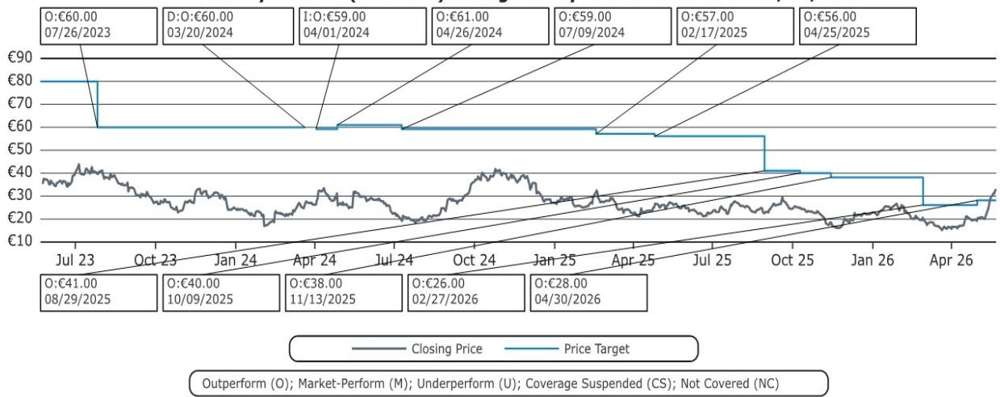

<details>
<summary>line</summary>

| Date       | Closing Price | Price Target |
|------------|---------------|--------------|
| 07/26/2023 | €60.00        | €80.00       |
| 03/20/2024 | €60.00        | €60.00       |
| 04/01/2024 | €59.00        | €60.00       |
| 04/26/2024 | €61.00        | €60.00       |
| 07/09/2024 | €59.00        | €60.00       |
| 02/17/2025 | €57.00        | €60.00       |
| 04/25/2025 | €56.00        | €60.00       |
| 08/29/2025 | €41.00        | €41.00       |
| 10/09/2025 | €40.00        | €41.00       |
| 11/13/2025 | €38.00        | €41.00       |
| 02/27/2026 | €26.00        | €41.00       |
| 04/30/2026 | €28.00        | €41.00       |
</details>

All price target and closing price data in the chart(s) above are denominated in the currency noted in the Ticker Table of this report.

# CONFLICTS OF INTEREST

SG and/or its affiliates beneficially own 1% or more of a class of common equity securities of the following company: Delivery Hero SE.

Certain affiliates of Bernstein act as market maker or liquidity provider in the equities securities of: Delivery Hero SE.

# OTHER MATTERS

The legal entity(ies) employing the analyst(s) listed in this report, and their location, can be determined by the country code of their phone number, as follows:

+1 Bernstein Institutional Services LLC; New York, New York, USA

+44 Bernstein Autonomous LLP; London UK

+212 SG Africa Technologies & Services; Casablanca, Morocco

+33 BSG France S.A.; Paris, France

+34 BSG France S.A.; Madrid, Spain

+41 Bernstein Autonomous LLP; Geneva, Switzerland

+49 BSG France S.A.; Frankfurt, Germany

+91 Bernstein (India) Private Limited; Mumbai, India

+852 Bernstein (Hong Kong) Limited 盛博香港有限公司; Hong Kong, China

+65 Bernstein (Singapore) Private Limited; Singapore

+81 Bernstein Japan KK; Tokyo, Japan

Where this report has been prepared by research analyst(s) employed by a non-US affiliate, such analyst(s), is/are (unless otherwise expressly noted below) not registered as associated persons of Bernstein Institutional Services LLC or any other SEC-registered broker-dealer and are not licensed or qualified as research analysts with FINRA. Accordingly, such analyst(s) may not be subject to FINRA's restrictions regarding (among other things) communications by research analysts with a subject company, interactions between research analysts and investment banking personnel, participation by research analysts in solicitation and marketing activities relating to investment banking transactions, public appearances by research analysts, and trading securities held by a research analyst account.

Where this report has been prepared by research analyst(s) employed by SG Africa Technologies & Services (part of the SG group of companies), it has been prepared on behalf of a Bernstein company under a Global Services Agreement in place between Bernstein and SG.

# CERTIFICATION

Each research analyst listed in this report, who is primarily responsible for the preparation of the content of this report, certifies that all of the views expressed in this publication accurately reflect that analyst's personal views about any and all of the subject securities or issuers and that no part of that analyst's compensation was, is, or will be, directly or indirectly, related to the specific recommendations or views in this publication.

# II. ADDITIONAL GLOBAL CONFLICT DISCLOSURES

It is at the sole discretion of the Firm as to when to initiate, update and cease research coverage. The Firm has established, maintains and relies on information barriers to control the flow of information contained in one or more areas (i.e., the private side) within the Firm, and into other areas, units, groups or affiliates (i.e., public side) of the Firm.

# III. OTHER IMPORTANT INFORMATION AND DISCLOSURES

Separate branding is maintained for "Bernstein" and "Autonomous" research products.

\- Bernstein produces a number of different types of research products including, among others, fundamental analysis and quantitative analysis under both the “Autonomous” and “Bernstein” brands. Recommendations contained within one type of research product may differ from recommendations contained within other types of research products, whether as a result of differing time horizons, methodologies or otherwise. Furthermore, views or recommendations within a research product issued under one brand may differ from views or recommendations under the same type of research product issued under the other brand. The Research Ratings System for the two brands and other information related to those Rating Systems are included

in the previous section.

\- Autonomous operates as a separate business unit within the following entities: Bernstein Institutional Services LLC, Bernstein Autonomous LLP, Bernstein (Hong Kong) Limited 盛博香港有限公司 and Bernstein (India) Private Limited. For information relating to “Autonomous” branded products (including certain Sales materials) please visit: www.autonomous.com. For information relating to Bernstein branded products please visit: www.bernsteinresearch.com.

Analysts are compensated based on aggregate contributions to the research franchise as measured by account penetration, productivity and proactivity of investment ideas. No analysts are compensated based on performance in, or contributions to, generating investment banking revenues.

This report has been produced by an independent analyst as defined in Article 3 (1)(34)(i) of EU 596/2014 Market Abuse Regulation (“MAR”) and the same article of MAR as it forms part of United Kingdom domestic law by virtue of the European Union (Withdrawal) Act 2018.

To our readers in the United States: Bernstein Institutional Services LLC, a broker-dealer registered with the U.S. Securities and Exchange Commission ("SEC") and a member of the U.S. Financial Industry Regulatory Authority, Inc. ("FINRA") is distributing this publication in the United States and accepts responsibility for its contents. Where this material contains an analysis of debt product(s), such material is intended only for institutional investors and is not subject to the US independence and disclosure standards applicable to debt research prepared for retail investors.

Bernstein Institutional Services LLC may act as principal for its own account or as agent for another person (including an affiliate) in sales or purchases of any security which is a subject of this report. This report does not purport to meet the objectives or needs of any specific individuals, entities or accounts.

To our readers in Canada: If this publication pertains to a Canadian domiciled company, it is being distributed in Canada by Bernstein (Canada) Limited, which is licensed and regulated by the Canadian Investment Regulatory Organization. If the publication pertains to a non-Canadian domiciled company, it is being distributed by Bernstein Institutional Services LLC, which is licensed and regulated by both the SEC and FINRA, into Canada under the International Dealers Exemption.

This document may not be passed onto any person in Canada unless that person qualifies as "permitted client" as defined in Section 1.1 of NI 31-103.

To our readers in Brazil: This report has been prepared by Bernstein Institutional Services LLC, and Banco BTG Pactual S.A. ("BTG") is responsible for the distribution of this report in Brazil.

To readers in the United Kingdom: This publication has been issued or approved for issue in the United Kingdom by Bernstein Autonomous LLP, authorised and regulated by the Financial Conduct Authority and located at 60 London Wall, London EC2M 5SH, +44 (0)20-7170-5000. Registered in England & Wales No OC343985.

This document is for distribution only to persons who (i) have professional experience in matters relating to investments falling within Article 19(5) of the Financial Services and Markets Act 2000 (Financial Promotion) Order 2005 (as amended, the “Financial Promotion Order”), (ii) are persons falling within Article 49(2)(a) to (d) (“high net worth companies, unincorporated associations, etc.”) of the Financial Promotion Order, (iii) are outside the United Kingdom, or (iv) are persons to whom an invitation or inducement to engage in investment activity (within the meaning of section 21 of the FSMA) in connection with the issue or sale of any securities may otherwise lawfully be communicated or caused to be communicated (all such persons together being referred to as “relevant persons”). This document is directed only at relevant persons and must not be acted on or relied on by persons who are not relevant persons. Any investment or investment activity to which this document relates is available only to relevant persons and will be engaged in only with relevant persons.

To our readers in the member states of the EEA: This publication is being distributed by BSG France SA, which is authorised and regulated by the Autorité de Contrôle Prudentiel et de Résolution (ACPR) and Autorité des Marchés Financiers (AMF).

To our readers in Hong Kong: This publication is being distributed in Hong Kong by Bernstein (Hong Kong) Limited 盛博香港有限公司, which is licensed and regulated by the Hong Kong Securities and Futures Commission (Central Entity No. AXC846) to carry out Type 4 (Advising on Securities) regulated activities and subject to the licensing conditions mentioned in the SFC Public Register (https://www.sfc.hk/publicregWeb/corp/AXC846/details)). This publication is solely for professional investors, as defined in the Securities and Futures Ordinance (Cap. 571). The purpose of this report is solely to provide an analysis of the issuers referred to in this report and is not intended for any purpose contrary to the laws of Hong Kong.

To our readers in Singapore: This publication is being distributed in Singapore by Bernstein (Singapore) Private Limited, only to accredited investors or institutional investors, as defined in the Securities and Futures Act 2001 of Singapore ("SFA"). Recipients in Singapore should contact Bernstein (Singapore) Private Limited in respect of matters arising from, or in connection with, this publication. Bernstein (Singapore) Private Limited is regulated by the Monetary Authority of Singapore and licensed under the SFA as a capital markets services licence holder for dealing in capital markets products that are securities and collective investment schemes and an exempt financial adviser for advising on, issuing and promulgating analyses and reports on securities. Bernstein (Singapore) Private Limited is registered in Singapore with Company Registration No. 20213710W and located at One Raffles Quay, #27-11 South Tower, Singapore 048583, +65-6230-4612.

To our readers in the People's Republic of China: The securities referred to in this document are not being offered or sold and may not be offered or sold, directly or indirectly, in the People's Republic of China (for such purposes, not including the Hong Kong and Macau Special Administrative Regions or Taiwan, the "PRC") in contravention of any applicable laws of the PRC.

This document does not constitute an offer to sell or the solicitation of an offer to buy any securities in the PRC to any person to whom it is unlawful to make the offer or solicitation in the PRC.

We do not represent that this document may be lawfully distributed, or that any securities may be lawfully offered, in compliance with any applicable registration or other requirements in the PRC, or pursuant to an exemption available thereunder, or assume any responsibility for facilitating any such distribution or offering. In particular, no action has been taken by us which would permit a public offering of any securities or distribution of this document in the PRC. Accordingly, the securities are not being offered or sold within the PRC by means of this document or any other document. Neither this document nor any advertisement or other offering material may be distributed or published in the PRC, except under circumstances that will result in compliance with any applicable laws and regulations.

To our readers in Japan: This publication is being distributed in Japan by Bernstein Japan KK (サンフォード・C・バーンスタイン株式会社), which is registered in Japan as a Financial Instruments Business Operator with the Kanto Local Finance Bureau (registration number: The Director-General of Kanto Local Finance Bureau (FIBO) No.3387) and regulated by the Financial Services Agency. It is also a member of Japan Investment Advisers Association. This publication is solely for qualified institutional investors in Japan only, as defined in Article 2, paragraph (3), items (i) of the Financial Instruments and Exchange Act.

For the institutional client readers in Japan who have been granted access to the Bernstein website by Daiwa Group Inc. ("Daiwa"), your access to this document should not be construed as meaning that Bernstein is providing you with investment advice for any purposes. Whilst Bernstein has prepared this document, your relationship is, and will remain with, Daiwa, and Bernstein has neither any contractual relationship with you nor any obligations towards you.

To our readers in Australia: Bernstein (Hong Kong) Limited 盛博香港有限公司 is responsible for distributing research in Australia. It is regulated by the Securities and Exchange Commission under U.S. laws, by the Financial Conduct Authority under U.K. laws, which differs from Australian laws. Bernstein (Hong Kong) Limited 盛博香港有限公司 is exempt from the requirement to hold an Australian financial services license under the Corporations Act 2001 in respect of the provision of the following financial services to wholesale clients:

• providing financial product advice;   
• dealing in a financial product;   
• making a market for a financial product; and   
• providing a custodial or depository service.

To our readers in India: This publication is being distributed in India by Bernstein (India) Private Limited (SCB India) which is licensed and regulated by Securities and Exchange Board of India ("SEBI") as a research analyst entity under the SEBI (Research Analyst) Regulations, 2014, having registration no. INH000006378 and as a stock broker having registration no. INZ000213537. SCB India is currently engaged in the business of providing research and stock broking services. Please refer to www.bernsteinresearch.in for more information.

\- SCB India is a Private limited company incorporated under the Companies Act, 2013, on April 12, 2017 bearing corporate identification number U65999MH2017FTC293762, and registered office at Level 3A, 4th Floor, First International Financial Centre, Plot Nos C-54 and C-55, G Block, Near CBI Office, Bandra Kurla Complex, Bandra (East), Mumbai 400098, Maharashtra, India (Phone No: +91-22-68421401).

\- For details of Associates (i.e., affiliates/group companies) of SCB India, kindly email MUM-BERNSTEIN-InCompliance@bernsteinsg.com.

• SCB India does not have any disciplinary history as on the date of this report.

\- Except as noted above, SCB India and/or its Associates (i.e., affiliates/group companies), the Research Analysts authoring this report, and their relatives

• do not have any financial interest in the subject company

\- do not have actual/beneficial ownership of one percent or more in securities of the subject company;

\- is not engaged in any investment banking activities for Indian companies, as such;

• have not managed or co-managed a public offering in the past twelve months for any Indian companies;

\- have not received any compensation for investment banking services or merchant banking services from the subject company in the past 12 months;

• have not received compensation for brokerage services from the subject company in the past twelve months;

\- have not received any compensation or other benefits from the subject company or third party related to the specific recommendations or views in this report; and

\- do not currently, but may in the future, act as a market maker in the financial instruments of the companies covered in the report.

\- do not have any conflict of interest in the subject company as of the date of this report.

\- Except as noted above, the subject company has not been a client of SCB India during twelve months preceding the date of distribution of this research report. Neither SCB India nor its Associates (i.e., affiliates/group companies) have received compensation for products or services other than investment banking, merchant banking or brokerage services from the subject company in the past twelve months.

\- The principal research analyst(s) who prepared this report, members of the analysts' team, and members of their households are not an officer, director, employee or advisory board member of the companies covered in the report.

\- Our Compliance officer / Grievance officer is Ms. Rupal Talati, who can be reached at +91-22-68421451, or MUM-BERNSTEIN-InCompliance@bernsteinsg.com / Scbin-investorgrievance@bernsteinsg.com

\- The Research investor charter and Terms & Conditions of SCB India are available on its website and may be accessed at Bernstein (India) Private Limited (https://bernsteinresearch.in/) for your reference.

\- Disclaimer: Registration granted by SEBI, and certification from NISM, is in no way a guarantee of performance of the intermediary or provide any assurance of returns to investors. Investments in securities market are subject to market risks. Read all the related documents carefully before investing.

To our readers in Switzerland: This document is provided in Switzerland by or through Bernstein Autonomous LLP, and is provided only to qualified investors as defined in article 10 of the Swiss Collective Investment Scheme Act (“CISA”) and related provisions of the Collective Investment Scheme Ordinance and in strict compliance with applicable Swiss law and regulations. The products mentioned in this document may not be suitable for all types of investors. This document is based on the Directives on the Independence of Financial Research issued by the Swiss Bankers Association (SBA) in January 2008.

To our readers in the Middle East: Bernstein Autonomous LLP, DIFC branch has its principal office at Gate Village 06, DIFC, Dubai, UAE. Bernstein Autonomous LLP, DIFC branch is regulated by the Dubai Financial Services Authority (DFSA) with the registration number CL10040 and is provisioned for Arranging Deals in Investments and Advising on Financial Products. All communications and services are directed at Professional Clients and Market Counterparties only (as defined in the DFSA rulebook). Persons other than Professional Clients and Market Counterparties, such as Retail Clients, are not the intended recipients of our communications or services.

# LEGAL

All research publications are disseminated to our clients through posting on the firm's password protected websites, bernsteinresearch.com and autonomous.com. Certain, but not all, research publications are also made available to clients through third-party vendors or redistributed to clients through alternate electronic means as a convenience.

This publication has been published and distributed in accordance with the Firm's policy for management of conflicts of interest in investment research, a copy of which is available from Bernstein Institutional Services LLC, Director of Compliance, 245 Park Avenue, New York, NY 10167. Additional disclosures and information regarding Bernstein's business are available on our website www.bernsteinresearch.com.

The securities described herein may not be eligible for sale in all jurisdictions or to certain categories of investors where that permission profile is not consistent with the licenses held by the entities noted herein. This document is for distribution only as may be permitted by law. This publication is not directed to, or intended for distribution to or use by, any person or entity who is a citizen or resident of, or located in any locality, state, country or other jurisdiction where such distribution, publication, availability or use would be contrary to law or regulation or which would subject any of the entities referenced herein or any of their subsidiaries or affiliates to any registration or licensing requirement within such jurisdiction. This publication is based upon public sources we believe to be reliable, but no representation is made by us that the publication is accurate or complete. We do not undertake to advise you of any change in the reported information or in the opinions herein. This publication was prepared and issued by entity referred to herein for distribution to eligible counterparties or professional clients. This publication is not an offer to buy or sell any security, and it does not constitute investment, legal or tax advice. The investments referred to herein may not be suitable for you. Investors must make their own investment decisions in consultation with their professional advisors in light of their specific circumstances. The value of investments may fluctuate, and investments that are denominated in foreign currencies may fluctuate in value as a result of exposure to exchange rate movements. Information about past performance of an investment is not necessarily a guide to, indicator of, or assurance of, future performance.

This report is directed to and intended only for our clients who are “eligible counterparties”, “professional clients”, “institutional investors” and/or “professional investors” as defined by the aforementioned regulators, and must not be redistributed to retail clients as defined by the aforementioned regulators. Retail clients who receive this report should note that the services of the entities noted herein are not available to them and should not rely on the material herein to make an investment decision. The result of such act will not hold the entities noted herein liable for any loss thus incurred as the entities noted herein are not registered/authorised/licensed to deal with retail clients and will not enter into any contractual agreement/arrangement with retail clients. This report is provided subject to the terms and conditions of any agreement that the clients may have entered into with the entities noted herein. All research reports are disseminated on a simultaneous basis to eligible clients through electronic publication to our client portal.

The information in this report was prepared by Bernstein solely for the internal business use of our clients. Clients may store, display, analyze, reformat and print the information in this report for this limited use only. Clients may not copy, alter, create derivative works, resell, reverse engineer, commercially exploit, share or distribute any part of the information contained herein for any purpose without Bernstein's express written consent. These restrictions include extracting data or using the content to develop indices or other products. Further, you may not use this report, or any portion of this report, to train or finetune any third-party machine learning or artificial intelligence system, or as a prompt or input into any such system. You also may not, without Bernstein's express written consent, do any of the foregoing in connection with your own internal machine learning or artificial intelligence system.

Bernstein may use artificial intelligence tools in the preparation of its materials. Any such materials are reviewed by Bernstein's research analysts prior to publication.

This report has been prepared for information purposes only and is based on current public information that we consider reliable, but the entities noted herein do not warrant or represent (express or implied) as to the sources of information or data contained herein are accurate, complete, not misleading or as to its fitness for the purpose intended even though the entities noted herein rely on reputable or trustworthy data providers, it should not be relied upon as such. Opinions expressed are the author(s)' current opinions as of the date appearing on the material only and we do not undertake to advise you of any change in the reported information or in the opinions herein.

This publication was prepared and issued by the entity referred to herein for distribution to eligible counterparties or professional clients. The information in this report is intended for general circulation and does not constitute an offer to buy or sell any security, investment, legal or tax advice nor a personal recommendation, as defined by any of the aforementioned regulators. It does not take into account the particular investment objectives, financial situations, or needs of individual investors. The report has not been reviewed by any of the aforementioned regulators and does not represent any official recommendation from the aforementioned regulators. The investments referred to herein may not be suitable for you. Investors must make their own investment decisions in consultation with advice sought from a financial adviser regarding the suitability of the investment product, taking into account the specific investment objectives, financial situation or particular needs of any recipient of the recommendation, before the recipient makes a commitment to purchase the investment product.

The analysis contained herein is based on numerous assumptions. Different assumptions could result in materially different results. The information in this report does not constitute, or form part of, any offer to sell or issue, or any offer to purchase or subscribe for shares, or to induce engage in any other investment activity. The value of any securities or financial instruments mentioned in this report may fluctuate subject to market conditions. Information about past performance of an investment is not necessarily a guide to, indicative of, or assurance of future performance. Estimates of future performance mentioned by the research analyst in this report are based on assumptions that may not be realized due to unforeseen factors like market volatility/fluctuation. In relation to securities or financial instruments denominated in a foreign currency other than the clients' home currency, movements in exchange rates will have an effect on the value, either favorable or unfavorable. Before acting on any recommendations in this report, recipients should consider the appropriateness of investing in the subject securities or financial instruments mentioned in this report and, if necessary, seek for independent professional advice.

The securities described herein may not be eligible for sale in all jurisdictions or to certain categories of investors where that permission profile is not consistent with the licenses held by the entities noted herein. This document is for distribution only as may be permitted by law. It is not directed to, or intended for distribution to or use by, any person or entity who is a citizen or resident of or located in any locality, state, country or other jurisdiction where such distribution, publication, availability or use would be contrary to law or regulation or would subject the entities noted herein to any regulation or licensing requirement within such jurisdiction.

Source: Bloomberg Index Services Limited. BLOOMBERG® is a trademark and service mark of Bloomberg Finance L.P. and its affiliates (collectively "Bloomberg"). Bloomberg or Bloomberg's licensors own all proprietary rights in the Bloomberg Indices. Neither Bloomberg nor Bloomberg's licensors approves or endorses this material, or guarantees the accuracy or completeness of any information herein, or makes any warranty, express or implied, as to the results to be obtained therefrom and, to the maximum extent allowed by law, neither shall have any liability or responsibility for injury or damages arising in connection therewith.

No part of this material may be reproduced, distributed or transmitted or otherwise made available without prior consent of the entities noted herein. Copyright Bernstein Institutional Services LLC Bernstein Autonomous LLP, BSG France S.A., Bernstein (Hong Kong) Limited 盛博香港有限公司, Bernstein (Canada) Limited, Bernstein (India) Private Limited (SEBI registration no. INH000006378), Bernstein (Singapore) Private Limited and Bernstein Japan KK (サンフォード・C・バーンスタイン株式会社). All rights reserved. The trademarks and service marks contained herein are the property of their respective owners. Any unauthorized use or disclosure is strictly prohibited. The entities noted herein may pursue legal action if the unauthorized use results in any defamation and/or reputational risk to the entities noted herein and research published under the Bernstein and Autonomous brands.