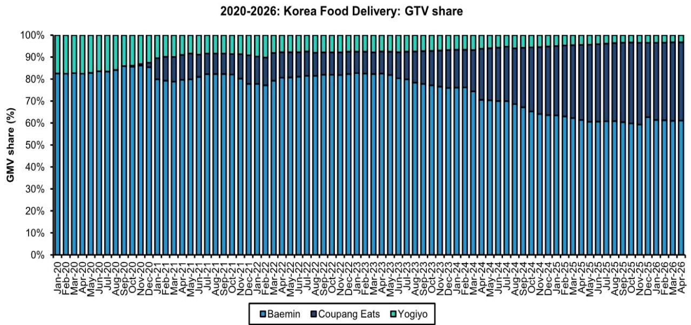
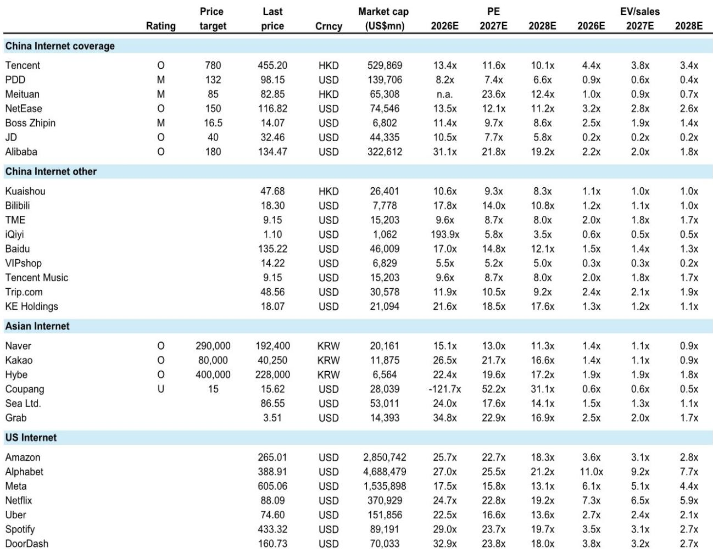

# 韩国外卖市场的稳定只是表象，真正的变局来自监管与所有权重构

韩国外卖市场正在经历一个看似平静但实则暗流涌动的阶段。经过数年的补贴大战与市场份额拉锯，Baemin与Coupang Eats的GTV份额稳定在65:35的格局。但这并非一个终局。某外资投行最新研报的核心判断是：当前的市场稳定建立在脆弱的平衡之上，真正的结构性变量——监管对Coupang的制约、Baemin所有权的潜在变动——才是决定未来三到五年竞争格局的关键。

这份报告的价值不在于复述“市场正在稳定”这一表层叙事，而在于它揭示了一个容易被忽略的事实：韩国外卖市场的利润池并非由需求决定，而是由竞争结构决定。当补贴退潮，真正考验的是平台能否将用户规模转化为可持续的议价权。而这一点，恰恰是当前市场尚未定价的风险。

## 1. 补贴退潮后的稳定是真实的，但利润修复的路径比想象中更窄

2025年底Coupang数据泄露事件后，外卖市场的竞争烈度显著下降。Coupang Eats的骑手补贴从峰值每单4000-10000韩元回落至2000-4000韩元，Wow会员对外卖订单的经济支持也在收缩。结果是，Baemin与Coupang Eats的GTV份额稳定在65:35。

从利润端看，Baemin的营业利润率从2023年3.3%的高点逐步下滑至2025年的2.9%，而Coupang Eats则从亏损状态改善至0.7%的正利润率。表面上看，这是一个双赢的修复——行业不再烧钱，两家都在向盈利靠拢。

但这里有一个关键问题：利润修复的来源是什么？报告显示，Coupang Eats的利润改善主要来自平台费用、配送费贡献和广告收入，而非来自规模效应或运营效率提升。这种修复的可持续性存疑——一旦竞争重新激化，这些利润项都可能被侵蚀。

对于投资者而言，这意味着当前市场的“稳定”并不等同于“护城河”。两家平台的利润池仍高度依赖于竞争烈度的维持，而非结构性优势的建立。

## 2. Coupang的监管风险是市场尚未充分定价的下行变量

报告明确指出，Coupang面临的主要下行风险来自监管。韩国公平交易委员会正在审查Coupang的Wow会员服务，怀疑其存在反竞争捆绑行为。Wow会员是Coupang生态的核心——它连接了产品电商、外卖、流媒体等多个服务，是用户留存和交叉销售的关键驱动力。

如果监管机构要求Coupang拆分Wow会员服务，或者对其定价施加限制，Coupang的生态系统协同效应将受到严重削弱。报告提到，Coupang可能通过为非Wow用户提供免费外卖配送来规避监管，但这一策略本身就会增加成本，压缩利润空间。

这里需要特别注意的是：监管风险并非一个遥远的可能，而是正在发生的现实。Coupang的股价自2024年高点已下跌约70%，部分反映了这一风险，但报告认为市场仍未充分定价监管对Coupang长期盈利能力的结构性影响。

对于持有Coupang的投资者来说，关键问题不是“监管是否会来”，而是“监管的力度有多大”。从韩国监管机构过往对科技巨头的态度看，罚款和业务调整的可能性并不低。

## 3. Baemin的所有权变动是当前最被低估的催化剂

报告中最引人注目的一个信号是：Naver正在评估提升竞争力的各种选项，包括收购Baemin的可能性。Naver目前持有约8万亿韩元的净现金，拥有足够的财务实力来推动战略动作。而Baemin的母公司Delivery Hero正在进行战略审查，可能出售部分资产。

如果Naver收购Baemin，韩国外卖市场的竞争格局将发生根本性变化。Naver拥有韩国最大的搜索引擎和支付系统，其生态系统与餐饮、本地生活服务的天然契合度远高于Coupang。一个由Naver支持的Baemin，将拥有更强的交叉销售能力和用户触达能力。

更重要的是，Naver的介入可能改变当前市场的定价逻辑。Coupang之所以能在外卖市场获得份额，很大程度上依赖其Wow会员体系的配送补贴。但如果Naver将Baemin与自己的搜索、地图、支付等业务深度整合，Coupang的竞争优势将受到直接挑战。

报告对此的表述非常克制，但隐含的判断是清晰的：Baemin所有权的变动，可能是未来12-18个月韩国外卖市场最重要的催化剂。这一事件的不确定性本身，就是投资者需要密切关注的风险变量。

## 4. 快速商超是下一轮增长的主战场，但赢家尚未明朗

当外卖配送的补贴战趋于理性，竞争的下一个自然延伸方向是快速商超。Baemin自疫情以来已在快速商超领域建立先发优势，目前约15%的收入（约7800亿韩元）来自这一业务。而Coupang正在通过与便利店运营商合作，推出24小时配送服务来追赶。

报告的数据显示，Baemin的快速商超业务增速已从2020年的330%放缓至2025年的5%。这并不意味着市场饱和，而是说明快速商超的增长动力正在从疫情驱动的“被动增长”转向“主动扩张”。在这个阶段，谁能在供应链效率、品类覆盖和用户习惯培养上取得突破，谁就能占据下一轮增长的主导权。

这里的关键变量是合作模式。报告提到，外卖平台与产品电商平台的合作可能成为快速商超增长的杠杆。这意味着，竞争将从单一的外卖配送扩展到整个本地生活服务的生态系统。Naver如果收购Baemin，将拥有搜索、支付、外卖、本地服务的一站式能力，这种生态优势是Coupang目前难以复制的。

对于投资者而言，快速商超的竞争格局尚未定型。Baemin的先发优势、Coupang的物流能力和Naver的生态潜力，三者之间的博弈将决定未来五年韩国本地生活市场的利润分配。

## 5. 政府补贴的短期影响不能简单外推为长期趋势

报告提到，韩国政府正在实施一项3.7万亿韩元的燃油补贴计划，以优惠券形式发放。由于这些优惠券可用于线下支付，Baemin将从中受益，而Coupang Eats则无法享受。这一政策将在5月至8月期间为Baemin带来GTV份额的短期提振。

这是一个典型的“政策扰动”案例。短期来看，它确实会改变市场份额的分配。但长期来看，这种补贴不具有可持续性，也不会改变竞争的根本逻辑。投资者需要警惕的是，不要将这种短期利好外推为长期趋势。

更重要的是，这一政策暴露了Coupang Eats在政府关系和政治影响力上的短板。在韩国这样一个政策敏感性较高的市场，企业的政治风险管理能力本身就是一种竞争优势。Coupang在这一领域的不足，可能在未来面临更多政策冲击时进一步放大。

## 6. 报告尚未完全回答的关键问题：竞争烈度的重新定价

尽管报告提供了丰富的分析框架和实证数据，但有一个核心问题尚未完全解答：当监管风险落地、所有权变动发生时，市场的竞争烈度会如何重新定价？

当前市场的稳定建立在双方都“打累了”的假设之上。但如果Naver收购Baemin，它是否愿意且有能力重新点燃补贴战？如果Coupang被迫拆分Wow会员，它是否还有动力维持外卖业务的战略地位？这些问题都没有明确的答案。

报告给出的估值表显示，Coupang的2026年预期P/E为-122.5倍，2027年为52.6倍，而Naver的P/E分别为15.6倍和13.4倍。这种估值差异本身就反映了市场对两家公司未来盈利能力的巨大分歧。但分歧并不等于确定性，真正的风险在于，市场的预期可能同时被高估和低估——高估了Coupang的监管风险，低估了Naver的竞争潜力。

对于决策者而言，与其试图精确预测最终结果，不如建立一个观察框架：关注监管进展、所有权变动信号、以及快速商超的竞争指标。这些变量将会在未来的6-12个月内逐步明朗，而每一次信息更新都可能引发市场定价的重新调整。

---

以上分析基于投行研报的核心逻辑，但完整的报告包含更多关于单位经济模型、竞争历史数据和估值对比的细节。这些细节对于理解韩国外卖市场的结构性特征至关重要，但受限于篇幅无法在此一一展开。

如果你对以下问题感兴趣：Coupang Eats的单位经济模型如何拆解？Baemin的快速商超业务增速放缓背后的结构性原因是什么？Naver收购Baemin的估值逻辑如何推演？欢迎来星球微信群里继续讨论，我们会基于完整报告进行更深度的拆解和推演。

Personal reading notes and learning share only. Not investment advice.

