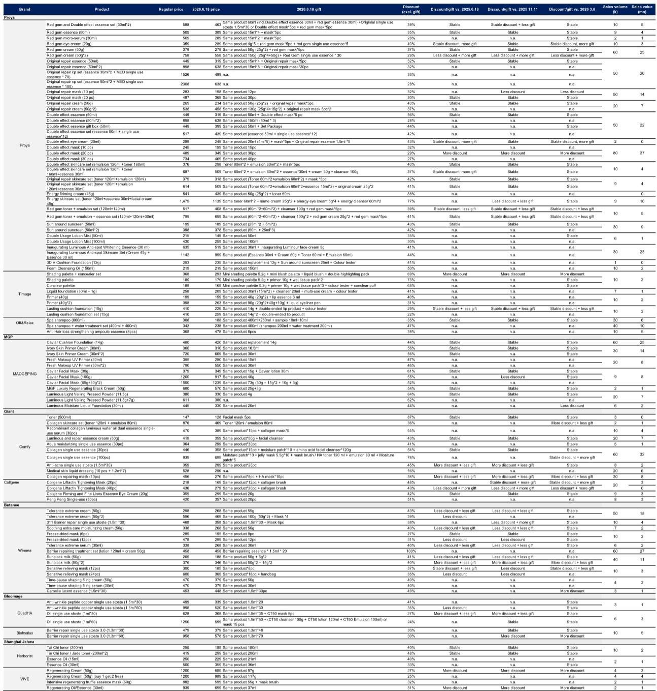
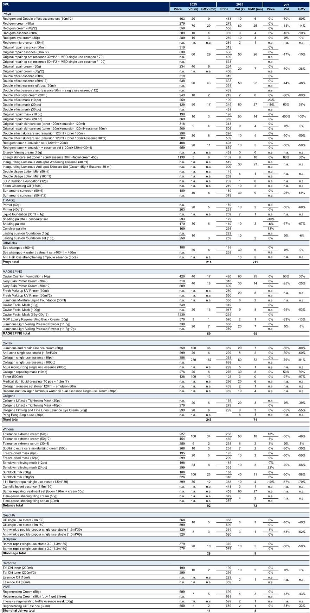
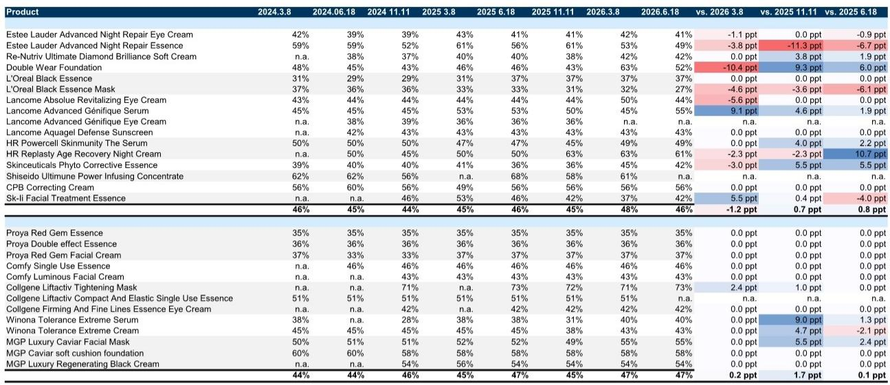

# The 618 Pulse Check Reveals a Market Fragmenting, Not Slowing: Why Selective Brand Strength Masks a Structural Shift

China’s 618 shopping festival has long served as the single most important barometer for the country’s cosmetics market. The event, spanning May and June, contributes approximately 21 percent of full-year online gross merchandise value for beauty brands. It is the moment when consumer sentiment, brand strategy, and platform dynamics converge into a clear signal. That signal, from the first day of top-tier key opinion leader livestreaming on May 21, is decidedly mixed. The headline numbers show improvement over the Women’s Day festival earlier this year, but the absolute growth rates remain underwhelming. This is not a simple story of a market cooling off. It is a story of structural fragmentation, where the rules of engagement have fundamentally changed, and only a minority of brands have adapted.

The temptation is to read the aggregate data and conclude that the sector is facing a demand-side slowdown. That would be a mistake. What the Day 1 livestreaming data reveals is a market that is bifurcating along three axes: brand power, channel strategy, and product innovation. The brands that are winning are not simply the ones with the biggest marketing budgets. They are the ones that have recalibrated their approach to the new retail reality, where the top-tier KOL livestreaming channel is no longer a guaranteed growth engine but a highly selective venue that rewards discipline and differentiation. The brands that are struggling are those that have not yet reconciled their legacy strategies with this new environment.

This analysis draws on granular data from the first day of top-tier KOL livestreaming during the 618 presale period, examining SKU listings, discounting behavior, and individual brand performance. The findings challenge the conventional narrative that the Chinese cosmetics market is simply maturing. Instead, they point to a more complex dynamic: the market is fragmenting into distinct competitive arenas, each with its own success factors. Understanding this fragmentation is the key to identifying which brands are positioned for sustainable outperformance and which are facing structural headwinds.

## The Platform-Level Shift Is Not Neutral: Shorter Windows and Tighter Discounts Favor Brands with Pricing Power and Audience Loyalty

The first and most consequential observation from the 618 data is that the promotional architecture itself has changed. Tmall’s discount structure remains stable at approximately 15 percent off, but the sales period has been shortened by 11 days for both Tmall and Douyin. JD has reduced its consumption coupon offering from a maximum of 17 percent off across two coupons to 10 percent off across four coupons. Douyin has similarly tightened its discount ceiling from 15 percent to 13 percent.

This is not a minor operational adjustment. It represents a deliberate shift by the platforms to reduce the intensity of price competition. The platforms are signaling that they no longer view deep, broad-based discounting as the optimal mechanism for driving gross merchandise value. The implications for brands are profound. In an environment where the window for promotion is shorter and the discount ceiling is lower, the ability to generate volume depends less on aggressive pricing and more on brand equity and audience engagement. Brands that have cultivated a loyal customer base that is willing to transact at relatively stable prices are advantaged. Brands that have relied on steep discounts to move inventory will find the new constraints limiting.

This platform-level shift also favors brands that have diversified their channel strategies. The data shows that some brands that underperformed in top-tier KOL livestreaming, such as Giant Biogene, have deliberately skewed their efforts toward self-operated stores and lower-tier KOLs. This is not a sign of weakness but a strategic response to the changing platform dynamics. The question for investors is whether this channel diversification will prove to be a temporary adjustment or a permanent structural change that redefines how brand value is created and captured in China’s cosmetics market.

## Mao Geping’s Dominance Is Not Just a Product Story; It Is a Proof of Concept for a New Brand-Building Model

The standout performer in the Day 1 livestreaming data is Mao Geping, which delivered over 10 percent year-on-year GMV growth. Its core product, the Caviar Cushion, grew by 50 percent year-on-year, and its newly launched Fresh Makeup UV Primer sold 20,000 units. This performance is remarkable not just for its absolute strength but for what it reveals about the underlying dynamics of the market.

Mao Geping’s success is often attributed to product quality and brand heritage, but the data suggests a more nuanced explanation. The brand introduced only five SKUs in the top-tier KOL livestreaming, two more than the previous year but still a highly curated selection. Its discount rates were stable, with the Caviar soft cushion foundation maintaining a consistent 58 percent discount level across multiple promotional periods. This discipline in both SKU selection and pricing stands in stark contrast to the approach of many competitors, who have expanded their SKU counts and introduced bundle sales to compensate for weaker individual product performance.

What Mao Geping has effectively demonstrated is that in a market where platform-driven discounting is becoming less aggressive, the path to growth lies in product innovation and brand authority rather than in promotional intensity. The brand’s ability to launch a new product, the UV primer, and achieve immediate volume success suggests that it has built a level of consumer trust that transcends the transactional nature of the livestreaming channel. This is a fundamentally different model from the one that dominated the Chinese cosmetics market in previous years, where rapid SKU expansion and aggressive discounting were the primary growth levers.

The strategic implication is clear: Mao Geping is not just winning; it is defining a new competitive template. The question that the report data raises but does not fully answer is whether this template is replicable. Can other domestic brands build the same level of consumer trust and product authority, or is Mao Geping’s success a function of unique founder-led brand equity that cannot be easily duplicated?

## The Divergence Between Domestic and Multinational Brands Is Not About Origin; It Is About Strategic Discipline

A conventional reading of the data might conclude that domestic brands are outperforming multinational brands, or vice versa. The actual picture is more complex. Among multinational brands, Estee Lauder saw greater discounts offset by fewer gifts, while Helena Rubinstein and Winona offered less discounting than the previous year. Among domestic brands, Proya recorded a 1 percent year-on-year decline, narrowing its decline from previous periods, while Botanee and Shanghai Jahwa saw declines of approximately 20 percent year-on-year.

The critical variable is not brand nationality but strategic discipline. Proya’s performance, for example, was driven in part by the introduction of more SKUs and bundle sales. The brand’s core products, such as the Red Gem and Double Effect essences, saw volume declines of 10 to 50 percent year-on-year, but the overall brand decline was limited to 1 percent because of the expanded product range. This is a volume-over-value strategy that can sustain growth in the short term but raises questions about long-term brand equity and margin sustainability.

Conversely, the brands that are struggling most dramatically, such as Bloomage with a 68 percent year-on-year decline and Giant Biogene with a 72 percent decline, are those that have not yet found a coherent response to the changing market conditions. Bloomage reduced its SKU count and introduced deeper discounts, a combination that suggests a reactive rather than strategic approach. Giant Biogene’s decline is partly attributable to a tough base effect, but the company’s strategic pivot toward self-operated channels indicates an acknowledgment that its previous model, heavily dependent on top-tier KOL livestreaming, is no longer viable at the same scale.

The pattern that emerges is one of strategic divergence. The brands that are performing best are those that have made clear choices about their channel mix, pricing strategy, and product portfolio. The brands that are underperforming are those that are caught between strategies, neither fully committing to the top-tier KOL channel nor successfully diversifying away from it. This divergence is likely to accelerate in the coming quarters, as the platform-level changes become more entrenched and the competitive dynamics of the market become more polarized.

## What the Report Does Not Fully Answer: Can the Livestreaming Channel Sustain Its Role as a Growth Engine, or Is It Becoming a Zero-Sum Game?

The Day 1 livestreaming data provides a valuable snapshot, but it also leaves several critical questions unanswered. The most important of these concerns the long-term trajectory of the top-tier KOL livestreaming channel itself. The report explicitly notes that the top-tier KOL livestreaming on Tmall may not represent the full picture of brand performance and that aggregating data from the full Tmall platform and Douyin is necessary for a better interpretation.

This caveat is more than a methodological note. It points to a fundamental uncertainty about the role of the livestreaming channel in the broader market structure. If the top-tier KOL channel is becoming less effective as a growth engine, then the strong performance of a brand like Mao Geping in this channel may be less indicative of overall market health than it appears. Conversely, if the channel is simply becoming more selective, rewarding only the strongest brands, then the weak performance of a brand like Bloomage may be a leading indicator of deeper structural challenges.

The data also does not fully address the question of consumer behavior. The 618 festival is a highly promotional event, and consumer purchasing during this period may not be representative of longer-term consumption patterns. The strong performance of Mao Geping’s new UV primer, for example, could reflect promotional impulse buying rather than sustained brand adoption. Similarly, the weak performance of some established brands could reflect consumer fatigue with the promotional format rather than a loss of brand appeal.

These open questions are not limitations of the analysis. They are the natural boundaries of any single data point in a complex and rapidly evolving market. They are also the questions that will determine which brands emerge as long-term winners and which are merely riding temporary trends.

## A Decision Framework for Investors: Evaluate Brands on Three Dimensions of Strategic Adaptation

For investors seeking to navigate this fragmenting market, the 618 data suggests a decision framework based on three dimensions of strategic adaptation.

The first dimension is channel strategy. Brands that are performing well in the current environment are those that have a clear and coherent approach to channel allocation. Mao Geping’s success in the top-tier KOL channel is not accidental; it reflects a deliberate decision to concentrate its efforts on a curated set of products and a stable pricing strategy. Proya’s performance, while more mixed, reflects a different but equally deliberate strategy of expanding its product range to capture volume across multiple price points. The brands that are struggling, such as Bloomage and Giant Biogene, are those that have not yet found a stable channel equilibrium.

The second dimension is product innovation. The data shows a clear correlation between new product introductions and growth. Mao Geping’s UV primer, Proya’s Red Gem micro serum, and the new SKUs introduced by Shanghai Jahwa’s Herborist and VIVE brands all contributed to performance. Conversely, brands that reduced their SKU counts, such as Bloomage’s QuadHA and Biohyalux, saw weaker results. This suggests that in a market where discounting is becoming less effective as a competitive tool, product innovation is becoming the primary driver of growth.

The third dimension is pricing discipline. The brands that maintained stable discount rates across promotional periods, such as Mao Geping and Proya for its core products, were better able to protect their brand equity and margin structure. The brands that increased their discounting, such as Estee Lauder for some products, may have gained short-term volume but at the cost of long-term brand value. The data suggests that the optimal strategy in the current environment is to maintain pricing discipline while investing in product innovation and channel diversification.

Applying this framework to the 618 data yields a clear set of implications. Mao Geping scores highly on all three dimensions and is likely to continue its outperformance. Proya scores well on product innovation and channel strategy but has some vulnerability on pricing discipline due to its increased reliance on bundle sales. Giant Biogene and Bloomage score poorly on all three dimensions and face significant structural challenges. The multinational brands present a more mixed picture, with individual product performance varying widely based on specific strategic choices.

## The Full Picture Requires Aggregation Across Platforms and Time Periods: Why the Day 1 Data Is a Starting Point, Not a Conclusion

The Day 1 top-tier KOL livestreaming data is an invaluable leading indicator, but it is not a complete picture. As the report itself notes, a full interpretation requires aggregating data from the entire Tmall platform and Douyin across the full 618 period. The top-tier KOL channel, while important, represents only one segment of a complex multi-channel market.

The strategic implication for investors is that the Day 1 data should be used as a hypothesis-generating tool rather than a conclusion. Brands that perform well on Day 1 are likely to have strong underlying fundamentals, but the reverse is not necessarily true. A brand that underperforms on Day 1 may still have a successful 618 if its strengths lie in other channels or if its marketing strategy is weighted toward later in the promotional period.

The data also raises important questions about the sustainability of the livestreaming model itself. The platform-level changes, including shorter promotional windows and tighter discount ceilings, suggest that the era of explosive growth through top-tier KOL livestreaming may be coming to an end. The brands that thrive in this new environment will be those that can build direct relationships with consumers, invest in product innovation, and maintain pricing discipline across all channels.

For those who want to move beyond the headlines and examine the original charts, the full report provides a detailed breakdown of SKU listings, discount rates, and individual brand performance. The data tells a story that is both more nuanced and more strategic than the aggregate numbers suggest.

Join the community to read the full report and review the original charts.

*This article is for learning and discussion only and does not constitute investment advice.*

Personal reading notes and learning share only. Not investment advice.

