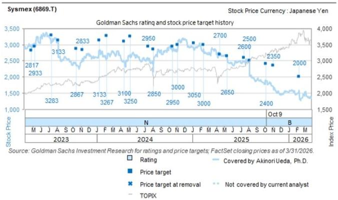
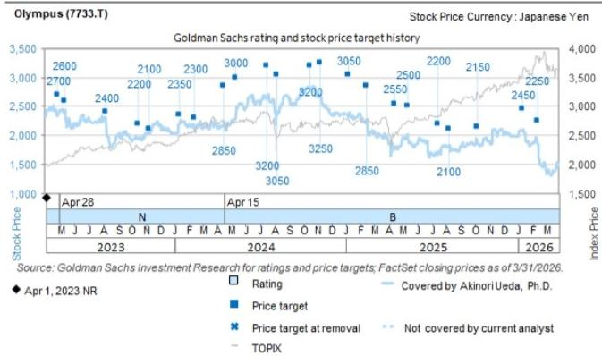

# Japan Healthcare: Medical Devices: China business climate for Medtech: Global company views from results briefings

We summarize comments from global medtech companies at their Jan-Mar 2026 results briefings regarding changes in the business environment in China. While the China businesses of medtech stocks are showing signs of recovery/bottoming out of impacts in some areas, the risk of a prolonged/worsening impact from healthcare cost-control policies remains, particularly in the in-vitro diagnostics (IVD) sector.

Regarding the China businesses of Japanese companies, we are particularly focused on progress in discussions on unifying test prices at Sysmex (link) and the contribution of locally manufactured products at Olympus.

Key points from medtech company comments

In China, while healthcare cost-control and Buy-China policies remain concerns, there is a mix of companies seeing a continued negative impact and those showing signs of recovery or seeing the impact of these policies bottoming out. This owes partly to differences in business portfolios.

Below, we outline key highlights from companies' commentary at their results briefings. We compiled commentary from Japanese companies and overseas companies relevant in terms of implications for our coverage.

# Japan

# Olympus (7733.T, May 12)

The business environment in China remains challenging, and 4Q sales for the Gastrointestinal Solutions (GIS) business in China were down $19\%$ yoy (1Q: $-16\%$ , 2Q: $-15\%$ , 3Q: $+6\%$ ). Olympus expects a recovery in FY3/27, partly due to growth for products manufactured locally in China. The three-year management strategy (FY3/27-FY3/29) aims for low- to mid-single-digit (\%) growth for the China business.

For our views on FY3/26 results, see the report at this link.

# Sysmex (6869.T, May 14)

In its China business, Sysmex is affected by healthcare cost-control policies and distributor inventory adjustments (mainly for reagents), and 4Q sales dropped a sharp $38.5\%$ yoy. FY3/27 guidance incorporates the possibility of unified test pricing

Akinori Ueda, Ph.D.

+81(3)4587-9910

akinori.ueda@gs.com

GS Japan Co., Ltd.

Tomo Taniguchi

+81(3)4587-1071

tomo.taniguchi@gs.com

GS Japan Co., Ltd.

being newly introduced, in addition to existing impacts from the minimum necessary principle, distributor inventory adjustments, and volume-based procurement (VBP). Sysmex sees uncertainty as to when and how the new pricing policy is implemented, and thinks it could be a source of earnings volatility. Medium- to long-term testing demand in China remains robust, and as the country looks to shift to a more sustainable healthcare system, the company believes the value of its testing solutions will be re-recognized. It plans to strengthen this business, including through a shift to direct sales.

For our views on FY3/26 results, see the report at this link.

# Terumo (4543.T, May 15)

In China, Terumo said VBP in the Neurovascular business of the C&V segment has led to a volume increase through sales channel expansion that has more than offset price declines.

For our views on FY3/26 results, see the report at this link.

# Asahi Intecc (7747.T, May 15, Not Covered)

The company thinks impact of guidewire price declines due to healthcare cost-control policies has largely run its course, except in Shanghai. The impact is also becoming apparent for products other than guidewires, but is generally within the company's assumptions. Mortality from cardiovascular diseases remains high in China, and the management expects an increase in volume to accompany the decline in unit prices.

# US and Europe

# Johnson & Johnson (JNJ, April 14, covered by Asad Haider)

JNJ management sees further VBP headwinds in China, expecting them to be more prominent in 2H26 than 1H. 1Q sales in the Surgery segment grew $1.2\%$ yoy, with negative impacts from VBP partially offsetting other growth. In 2H2026, JNJ expects VBP impact in Electrophysiology (EP) products as well.

For GS views on 1Q results, see the report at this link.

# Abbott Laboratories (ABT, April 16, covered by David Roman)

ABT views its flat yoy sales in China for the Core Lab business in 1Q as positive progress, considering the 15-30% yoy decline in sales every quarter in 2025. While the company cannot say for sure that the headwinds in the China market are over, its 1Q sales momentum was ahead of guidance for a single-digit (%) decline for the full year. ABT noted that about 80% of its China business portfolio is subject to VBP, and its share is limited in areas that could be newly targeted by the policy (fertility and cancer).

For GS views on 1Q results, see the report at this link.

# Boston Scientific Corp. (BSX, April 22, covered by David Roman)

BSX noted that China delivered strong double-digit sales growth while overcoming headwinds from VBP. VBP impacted the Urology unit's Stone Management (MedSurg) business and its Arterial business (Cardiovascular). VBP impact on the Arterial business in China is expected to taper off in the second quarter.

For GS views on 1Q results, see the report at this link.

# Roche (ROP.C.S, April 23, covered by James Quigley)

The Diagnostics business continues to be affected by healthcare cost-control policies in China, and sales in the region declined 14% yoy. Sales for the entire diagnostics business grew 3% yoy, but 5% excluding China. Within this, the Core Lab business sales increased 4%, and 8% excluding China. The impact of healthcare cost-control policies is expected to ease over 2026.

For GS views on 1Q results, see the report at this link.

# Revvity Inc. (RVTY, May 5, covered by Evie Koslosky)

RVTY will divest its Immunodiagnostics business in China (equivalent to about $6\%$ of total company sales) to concentrate resources in more profitable areas. Behind the divestment are continued headwinds in the diagnostics market, such as price pressure and changes in demand, reflecting impact from China's healthcare cost-control policies. The company will continue to focus on the life sciences business, which is expected to see strong market growth in China, and the reproductive health business, for which localization has been established.

For GS views on 1Q results, see the report at this link.

# China

# Mindray (300760.SZ, April 28, covered by Tianyi Yan)

Reflecting funding constraints in IVD business in China, attempts are being made to control reagent prices and usage through various means. In this environment, there is also an accelerating trend of domestic products replacing imported ones at Tier-3 hospitals. The company has set a goal of tapping into high-end customers from 1H2025, aiming to expand its market share in immunoassay, biochemistry, and coagulation from $10\%$ to $20\%$ within three years. The company is making steady progress toward its goal, with its share rising to $13\%$ as of 1Q.

For GS views on 1Q results, see the report at this link.

# Price Target Risks and Methodology - Sysmex

We are Buy rated. Our 12-month target price of ¥1,700 is based on the global medtech sector's FY3/28E EV/EBITDA average of 11.0X, to which we apply a 20% discount. Key downside risks include geopolitical risks and supply chain changes, healthcare system reforms including cost-containment policies globally, heightened competition (particularly the emergence of local makers in emerging markets and the subsequent risk of price declines), forex trends, greater inflationary pressures, and weaker capex trends.

# Price Target Risks and Methodology - Olympus

We are Buy-rated. Our 12-month target price of ¥2,050 is based on a 10% discount applied to the global medtech sector average FY3/28E EV/EBITDA of 11.0X. Key risks include regulatory changes in global markets, changes in the business environment in the China medtech market, risks associated with the spread of infectious diseases, greater-than-expected yen appreciation, inflation impacts, risks related to manufacturing/sales activities, risks associated with development, major changes in the competitive environment, and risks associated with growth investment.

# Price Target Risks and Methodology - Terumo

We are Neutral rated. Our 12-month target price of ¥2,400 is based on a FY3/28E EV/EBITDA multiple of 11.0X, derived from the global medtech sector average. Key risks include more drastic healthcare cost-cutting measures than expected, deviation in core product sales due to competition and changing needs of medical care providers, manufacturing and quality issues, the number of procedures being affected by a shortage of personnel at medical facilities, inflation impact, and greater-than-expected yen appreciation/depreciation.

# Disclosure Appendix

# Reg AC

I, Akinori Ueda, Ph.D., hereby certify that all of the views expressed in this report accurately reflect my personal views about the subject company or companies and its or their securities. I also certify that no part of my compensation was, is or will be, directly or indirectly, related to the specific recommendations or views expressed in this report.

Unless otherwise stated, the individuals listed on the cover page of this report are analysts in GS' Global Investment Research division.

Contributing Authors: Akinori Ueda, Ph.D. GS Japan Co., Ltd., Tomo Taniguchi GS Japan Co., Ltd..

Unless otherwise stated, the individuals listed in the Contributing Authors disclosure of this report are analysts in GS' Global Investment Research division.

# GS Factor Profile

The GS Factor Profile provides investment context for a stock by comparing key attributes to the market (i.e. our universe of rated stocks) and its sector peers. The four key attributes depicted are: Growth, Financial Returns, Multiple (e.g. valuation) and Integrated (a composite of Growth, Financial Returns and Multiple). Growth, Financial Returns and Multiple are calculated by using normalized ranks for specific metrics for each stock. The normalized ranks for the metrics are then averaged and converted into percentiles for the relevant attribute. The precise calculation of each metric may vary depending on the fiscal year, industry and region, but the standard approach is as follows:

Growth is based on a stock's forward-looking sales growth, EBITDA growth and EPS growth (for financial stocks, only EPS and sales growth), with a higher percentile indicating a higher growth company. Financial Returns is based on a stock's forward-looking ROE, ROCE and CROCI (for financial stocks, only ROE), with a higher percentile indicating a company with higher financial returns. Multiple is based on a stock's forward-looking P/E, P/B, price/dividend (P/D), EV/EBITDA, EV/FCF and EV/Debt Adjusted Cash Flow (DACF) (for financial stocks, only P/E, P/B and P/D), with a higher percentile indicating a stock trading at a higher multiple. The Integrated percentile is calculated as the average of the Growth percentile, Financial Returns percentile and (100% - Multiple percentile).

Financial Returns and Multiple use the GS analyst forecasts at the fiscal year-end at least three quarters in the future. Growth uses inputs for the fiscal year at least seven quarters in the future compared with the year at least three quarters in the future (on a per-share basis for all metrics).

For a more detailed description of how we calculate the GS Factor Profile, please contact your GS representative.

# M&A Rank

Across our global coverage, we examine stocks using an M&A framework, considering both qualitative factors and quantitative factors (which may vary across sectors and regions) to incorporate the potential that certain companies could be acquired. We then assign a M&A rank as a means of scoring companies under our rated coverage from 1 to 3, with 1 representing high (30%-50%) probability of the company becoming an acquisition target, 2 representing medium (15%-30%) probability and 3 representing low (0%-15%) probability. For companies ranked 1 or 2, in line with our standard departmental guidelines we incorporate an M&A component into our target price. M&A rank of 3 is considered immaterial and therefore does not factor into our price target, and may or may not be discussed in research.

# Quantum

Quantum is GS' proprietary database providing access to detailed financial statement histories, forecasts and ratios. It can be used for in-depth analysis of a single company, or to make comparisons between companies in different sectors and markets.

# Disclosures

The rating(s) for Olympus, Sysmex and Terumo is/are relative to the other companies in its/their coverage universe: Astellas Pharma, CUC, Chugai Pharmaceutical, Daiichi Sankyo, Eisai, JMDC, Kyowa Kirin, M3, Olympus, Ono Pharmaceutical, Otsuka HD, PeptiDream, Santen Pharmaceutical, Sawai Group HD, Shionogi, Sysmex, Takeda Pharmaceutical, Terumo

# Company-specific regulatory disclosures

The following disclosures relate to relationships between The GS Group, Inc. (with its affiliates, "GS") and companies covered by GS Global Investment Research and referred to in this research.

GS beneficially owned 1% or more of common equity (excluding positions managed by affiliates and business units not required to be aggregated under US securities law) as of the month end preceding this report: Olympus (¥1,848)

GS has received compensation for investment banking services in the past 12 months: Terumo (¥2,332)

GS expects to receive or intends to seek compensation for investment banking services in the next 3 months: Olympus (¥1,848), Sysmex (¥1,373) and Terumo (¥2,332)

GS had an investment banking services client relationship during the past 12 months with: Olympus (¥1,848), Sysmex (¥1,373) and Terumo (¥2,332)

GS had a non-investment banking securities-related services client relationship during the past 12 months with: Terumo (¥2,332)

GS had a non-securities services client relationship during the past 12 months with: Olympus (¥1,848), Sysmex (¥1,373) and Terumo (¥2,332)

# Distribution of ratings/investment banking relationships

GS Investment Research global Equity coverage universe

<table><tr><td rowspan="2"></td><td colspan="3">Rating Distribution</td><td colspan="3">Investment Banking Relationships</td></tr><tr><td>Buy</td><td>Hold</td><td>Sell</td><td>Buy</td><td>Hold</td><td>Sell</td></tr><tr><td>Global</td><td>50%</td><td>34%</td><td>16%</td><td>65%</td><td>60%</td><td>45%</td></tr></table>

As of April 1, 2026, GS Global Investment Research had investment ratings on 3,074 equity securities. GS assigns stocks as Buys and Sells on various regional Investment Lists; stocks not so assigned are deemed Neutral. Such assignments equate to Buy, Hold and Sell for the purposes of the above disclosure required by the FINRA Rules. See ‘Ratings, Coverage universe and related definitions’ below. The Investment Banking Relationships chart reflects the percentage of subject companies within each rating category for whom GS has provided investment banking services within the previous twelve months.

Price target and rating history chart(s)   

line

| Date       | Stock Price | Index Price | Rating | Price Target | Price Target at Removal | Not Covered by Current Analyst | TOPIX |
|------------|-------------|-------------|--------|--------------|--------------------------|-------------------------------|-------|
| Oct 9      | ~$2,800     | ~$2,500     | 2817   | 2933         | —                        | —                             | —     |
| 2023       | ~$3,000     | ~$2,700     | —      | —            | —                        | —                             | —     |
| 2024       | ~$3,200     | ~$2,800     | —      | —            | —                        | —                             | —     |
| 2025       | ~$2,500     | ~$2,400     | —      | —            | —                        | —                             | —     |
| 2026       | ~$2,000     | ~$2,300     | —      | —            | —                        | —                             | —     |

The price targets shown should be considered in the context of all prior published GS, which may or may not have included price targets, as well as developments relating to the company, its industry and financial markets.

  
The price targets shown should be considered in the context of all prior published GS, which may or may not have included price targets, as well as developments relating to the company, its industry and financial markets.

line

| Date       | Stock Price | Index Price | Rating | Price Target | Price Target at Removal | Not Covered by Current Analyst | TOPIX |
|------------|-------------|-------------|--------|--------------|--------------------------|-------------------------------|-------|
| Mar 2023   | 2075        | 2,100       | 2050   |              |                          |                               |       |
| Jun 2023   | 2325        | 2,300       | 2225   |              |                          |                               |       |
| Sep 2023   | 2125        | 2,100       | 2050   |              |                          |                               |       |
| Dec 2023   | 2325        | 2,300       | 2125   |              |                          |                               |       |
| Mar 2024   | 2850        | 2,500       | 2850   |              |                          |                               |       |
| Jun 2024   | 2900        | 2,700       | 2950   |              |                          |                               |       |
| Sep 2024   | 3100        | 3,100       | 3100   |              |                          |                               |       |
| Dec 2024   | 3000        | 3,000       | 3100   |              |                          |                               |       |
| Mar 2025   | 2850        | 2,800       | 2800   |              |                          |                               |       |
| Jun 2025   | 2650        | 2,900       | 2650   |              |                          |                               |       |
| Sep 2025   | 2850        | 3,100       | 2850   |              |                          |                               |       |
| Dec 2025   | 2850        | 3,300       | 2850   |              |                          |                               |       |
| Mar 2026   | 2400        | 3,500       | 2400   |              |                          |                               |       |
| May 2026   | 2550        | 3,400       | 2550   |              |                          |                               |       |
Source: GS Investment Research for ratings and price targets; FactSet closing prices as of 3/31/2026.

The price targets shown should be considered in the context of all prior published GS, which may or may not have included price targets, as well as developments relating to the company, its industry and financial markets.

Target price history table(s) 

<table><tr><td colspan="3">Terumo (4543.T)</td><td colspan="3">Sysmex (6869.T)</td></tr><tr><td>Date of report</td><td>Target price (¥)</td><td>Closing price (¥)</td><td>Date of report</td><td>Target price (¥)</td><td>Closing price (¥)</td></tr><tr><td>13-Feb-26</td><td>2,400</td><td>2,011</td><td>14-May-26</td><td>1,700</td><td>1,343</td></tr><tr><td>13-Jan-26</td><td>2,550</td><td>2,270</td><td>14-Apr-26</td><td>1,850</td><td>1,397</td></tr><tr><td>09-Oct-25</td><td>2,850</td><td>2,507</td><td>12-Feb-26</td><td>2,000</td><td>1,584</td></tr><tr><td>07-Aug-25</td><td>2,800</td><td>2,530</td><td>05-Nov-25</td><td>2,350</td><td>1,707</td></tr><tr><td>17-Jul-25</td><td>2,650</td><td>2,447</td><td>09-Oct-25</td><td>2,400</td><td>1,869</td></tr><tr><td>14-May-25</td><td>2,850</td><td>2,727</td><td>06-Aug-25</td><td>2,500</td><td>2,495</td></tr><tr><td>15-Apr-25</td><td>2,800</td><td>2,713</td><td>17-Jul-25</td><td>2,600</td><td>2,490</td></tr><tr><td>07-Nov-24</td><td>3,100</td><td>2,980</td><td>14-May-25</td><td>2,650</td><td>2,637</td></tr><tr><td>16-Oct-24</td><td>3,000</td><td>2,919</td><td>15-Apr-25</td><td>2,700</td><td>2,719</td></tr><tr><td>08-Aug-24</td><td>2,950</td><td>2,486</td><td>12-Feb-25</td><td>3,000</td><td>2,864</td></tr><tr><td>17-Jul-24</td><td>2,900</td><td>2,827</td><td>07-Jan-25</td><td>3,050</td><td>2,843</td></tr><tr><td>15-Apr-24</td><td>2,850</td><td>2,588</td><td>06-Nov-24</td><td>3,000</td><td>2,849</td></tr><tr><td>07-Feb-24</td><td>5,050</td><td>2,537</td><td>16-Oct-24</td><td>2,950</td><td>2,822</td></tr><tr><td>12-Jan-24</td><td>4,650</td><td>2,534</td><td>06-Aug-24</td><td>2,850</td><td>2,389</td></tr><tr><td>14-Nov-23</td><td>4,250</td><td>2,123</td><td>17-Jul-24</td><td>2,950</td><td>2,509</td></tr><tr><td>17-Oct-23</td><td>4,100</td><td>1,958</td><td>09-May-24</td><td>3,250</td><td>2,704</td></tr><tr><td>09-Aug-23</td><td>4,450</td><td>2,213</td><td>15-Apr-24</td><td>3,100</td><td>2,448</td></tr></table>

Terumo (4543.T) 

<table><tr><td>Date of report</td><td>Target price (¥)</td><td>Closing price (¥)</td></tr><tr><td>13-Jul-23</td><td>4,650</td><td>2,189</td></tr></table>

Sysmex (6869.T) 

<table><tr><td>Date of report</td><td>Target price (¥)</td><td>Closing price (¥)</td></tr><tr><td>09-Feb-24</td><td>9,800</td><td>2,571</td></tr><tr><td>12-Jan-24</td><td>9,400</td><td>2,837</td></tr><tr><td>08-Nov-23</td><td>8,500</td><td>2,499</td></tr><tr><td>17-Oct-23</td><td>8,600</td><td>2,382</td></tr><tr><td>08-Aug-23</td><td>9,400</td><td>3,085</td></tr><tr><td>13-Jul-23</td><td>9,850</td><td>3,117</td></tr></table>

Olympus (7733.T) 

<table><tr><td>Date of report</td><td>Target price (¥)</td><td>Closing price (¥)</td></tr><tr><td>12-May-26</td><td>2,050</td><td>1,541</td></tr><tr><td>14-Apr-26</td><td>1,950</td><td>1,585</td></tr><tr><td>13-Feb-26</td><td>2,250</td><td>1,853</td></tr><tr><td>13-Jan-26</td><td>2,450</td><td>2,072</td></tr><tr><td>09-Oct-25</td><td>2,150</td><td>1,879</td></tr><tr><td>08-Aug-25</td><td>2,100</td><td>1,825</td></tr><tr><td>17-Jul-25</td><td>2,200</td><td>1,719</td></tr><tr><td>13-May-25</td><td>2,500</td><td>2,017</td></tr><tr><td>15-Apr-25</td><td>2,550</td><td>1,794</td></tr><tr><td>14-Feb-25</td><td>2,850</td><td>2,275</td></tr><tr><td>07-Jan-25</td><td>3,050</td><td>2,344</td></tr><tr><td>08-Nov-24</td><td>3,250</td><td>2,660</td></tr><tr><td>16-Oct-24</td><td>3,200</td><td>2,801</td></tr><tr><td>07-Aug-24</td><td>3,050</td><td>2,424</td></tr><tr><td>17-Jul-24</td><td>3,200</td><td>2,683</td></tr><tr><td>11-May-24</td><td>3,000</td><td>2,289</td></tr><tr><td>15-Apr-24</td><td>2,850</td><td>2,189</td></tr><tr><td>14-Feb-24</td><td>2,300</td><td>2,100</td></tr><tr><td>12-Jan-24</td><td>2,350</td><td>2,217</td></tr><tr><td>09-Nov-23</td><td>2,100</td><td>2,086</td></tr><tr><td>17-Oct-23</td><td>2,200</td><td>1,953</td></tr><tr><td>09-Aug-23</td><td>2,400</td><td>2,251</td></tr></table>

Price targets shown in table(s) are unadjusted for corporate actions.

# Regulatory disclosures

# Disclosures required by United States laws and regulations

See company-specific regulatory disclosures above for any of the following disclosures required as to companies referred to in this report: manager or co-manager in a pending transaction; $1\%$ or other ownership; compensation for certain services; types of client relationships; managed/co-managed public offerings in prior periods; directorships; for equity securities, market making and/or specialist role. GS trades or may trade as a principal in debt securities (or in related derivatives) of issuers discussed in this report.

The following are additional required disclosures: Ownership and material conflicts of interest: GS policy prohibits its analysts, professionals reporting to analysts and members of their households from owning securities of any company in the analyst's area of coverage. Analyst compensation: Analysts are paid in part based on the profitability of GS, which includes investment banking revenues. Analyst as officer or director: GS policy generally prohibits its analysts, persons reporting to analysts or members of their households from serving as an officer, director or advisor of any company in the analyst's area of coverage. Non-U.S. Analysts: Non-U.S. analysts may not be associated persons of GS & Co. LLC and therefore may not be subject to FINRA Rule 2241 or FINRA Rule 2242 restrictions on communications with a subject company, public appearances and trading in securities covered by the analysts.

Distribution of ratings: See the distribution of ratings disclosure above. Price chart: See the price chart, with changes of ratings and price targets in prior periods, above, or, if electronic format or if with respect to multiple companies which are the subject of this report, on the GS website at https://www.gs.com/research/hedge.html.

# Additional disclosures required under the laws and regulations of jurisdictions other than the United States

The following disclosures are those required by the jurisdiction indicated, except to the extent already made above pursuant to United States laws and regulations. Australia: GS Australia Pty Ltd and its affiliates are not authorised deposit-taking institutions (as that term is defined in the Banking Act 1959 (Cth)) in Australia and do not provide banking services, nor carry on a banking business, in Australia. This research, and any access to it, is intended only for “wholesale clients” within the meaning of the Australian Corporations Act, unless otherwise agreed by GS. In producing research reports, members of Global Investment Research of GS Australia may attend site visits and other meetings hosted by the companies and other entities which are the subject of its research reports. In some instances the costs of such site visits or meetings may be met in part or in whole by the issuers concerned if GS Australia considers it is appropriate and reasonable in the specific circumstances relating to the site visit or meeting. To the extent that the contents of this document contains any financial product advice, it is general advice only and has been prepared by GS without taking into account a client’s objectives, financial situation or needs. A client should, before acting on any such advice, consider the appropriateness of the advice having regard to the client’s own objectives, financial situation and needs. A copy of certain GS Australia and New Zealand disclosure of interests and a copy of GS’ Australian Sell-Side Research Independence Policy Statement are available at: https://www.goldmansachs.com/disclosures/australia-new-zealand/index.html. Brazil: Disclosure information in relation to CVM Resolution n. 20 is available at https://www.gs.com/worldwide/brazil/area/gir/index.html. Where applicable, the Brazil-registered analyst primarily responsible for the content of this research report, as defined in Article 20 of CVM Resolution n. 20, is the first author named at the beginning of this report, unless indicated otherwise at the end of the text. Canada: This information is being provided to you for information purposes only and is not, and under no circumstances should be construed as, an advertisement, offering or solicitation by GS & Co. LLC for purchasers of securities in Canada to trade in any Canadian security. GS & Co. LLC is not registered as a dealer in any jurisdiction in Canada under applicable Canadian securities laws and generally is not permitted to trade in Canadian securities and may be prohibited from selling certain securities and products in certain jurisdictions in Canada. If you wish to trade in any Canadian securities or other products in Canada please contact GS Canada Inc., an affiliate of The GS Group Inc., or another registered Canadian dealer. Hong Kong: Further information on the securities of covered companies referred to in this research may be obtained on request from GS (Asia) L.L.C. India: Further information on the subject company or companies referred to in this research may be obtained from GS (India) Securities Private Limited, Research Analyst - SEBI Registration Number INH000001493, 10th Floor, Ascent-Worli, Sudam Kalu Ahire Marg, Worli, Mumbai-400 025, India, Corporate Identity Number U74140MH2006FTC160634, Phone +91 22 6616 9000, Fax +91 22 6616 9001. GS may beneficially own 1% or more of the securities (as such term is defined in clause 2 (h) the Indian Securities Contracts (Regulation) Act, 1956) of the subject company or companies referred to in this research report. Investment in securities market are subject to market risks. Read all the related documents carefully before investing. Registration granted by SEBI and certification from NISM in no way guarantee performance of the intermediary or provide any assurance of returns to investors. GS (India) Securities Private Limited compliance officer and investor grievance contact details can be found at: https://www.goldmansachs.com/worldwide/india/documents/Grievance-Redressal-and-Escalation-Matrix.pdf, and a copy of the annual audit compliance report can be found at this link: https://publishing.gs.com/content/site/india-annual-compliance-report.html. Japan: See below. Korea: This research, and any access to it, is intended only for “professional investors” within the meaning of the Financial Services and Capital Markets Act, unless otherwise agreed by GS. Further information on the subject company or companies referred to in this research may be obtained from GS (Asia) L.L.C., Seoul Branch. New Zealand: GS New Zealand Limited and its affiliates are neither “registered banks” nor “deposit takers” (as defined in the Reserve Bank of New Zealand Act 1989) in New Zealand. This research, and any access to it, is intended for “wholesale clients” (as defined in the Financial Advisers Act 2008) unless otherwise agreed by GS. A copy of certain GS Australia and New Zealand disclosure of interests is available at: https://www.goldmansachs.com/disclosures/australia-new-zealand/index.html. Russia: Research reports distributed in the Russian Federation are not advertising as defined in the Russian legislation, but are information and analysis not having product promotion as their main purpose and do not provide appraisal within the meaning of the Russian legislation on appraisal activity. Research reports do not constitute a personalized investment recommendation as defined in Russian laws and regulations, are not addressed to a specific client, and are prepared without analyzing the financial circumstances, investment profiles or risk profiles of clients. GS assumes no responsibility for any investment decisions that may be taken by a client or any other person based on this research report. Singapore: GS (Singapore) Pte. (Company Number: 198602165W), which is regulated by the Monetary Authority of Singapore, accepts legal responsibility for this research, and should be contacted with respect to any matters arising from, or in connection with, this research. Taiwan: This material is for reference only and must not be reprinted without permission. Investors should carefully consider their own investment risk. Investment results are the responsibility of the individual investor. United Kingdom: Persons who would be categorized as retail clients in the United Kingdom, as such term is defined in the rules of the Financial Conduct Authority, should read this research in conjunction with prior GS on the covered companies referred to herein and should refer to the risk warnings that have been sent to them by GS International. A copy of these risks warnings, and a glossary of certain financial terms used in this report, are available from GS International on request.

European Union and United Kingdom: Disclosure information in relation to Article 6 (2) of the European Commission Delegated Regulation (EU) (2016/958) supplementing Regulation (EU) No 596/2014 of the European Parliament and of the Council (including as that Delegated Regulation is implemented into United Kingdom domestic law and regulation following the United Kingdom's departure from the European Union and the European Economic Area) with regard to regulatory technical standards for the technical arrangements for objective presentation of investment recommendations or other information recommending or suggesting an investment strategy and for disclosure of particular interests or indications of conflicts of interest is available at https://www.gs.com/disclosures/europeanpolicy.html which states the European Policy for Managing Conflicts of Interest in Connection with Investment Research.

Japan: GS Japan Co., Ltd. is a Financial Instrument Dealer registered with the Kanto Financial Bureau under registration number Kinsho 69, and a member of Japan Securities Dealers Association, Financial Futures Association of Japan Type II Financial Instruments Firms Association, and Investment Management Association of Japan. Sales and purchase of equities are subject to commission pre-determined with clients plus consumption tax. See company-specific disclosures as to any applicable disclosures required by Japanese stock exchanges, the Japanese Securities Dealers Association or the Japanese Securities Finance Company.

# Ratings, coverage universe and related definitions

Buy (B), Neutral (N), Sell (S) Analysts recommend stocks as Buys or Sells for inclusion on various regional Investment Lists. Being assigned a Buy or Sell on an Investment List is determined by a stock's total return potential relative to its coverage universe. Any stock not assigned as a Buy or a Sell on an Investment List with an active rating (i.e., a stock that is not Rating Suspended, Not Rated, Early-Stage Biotech, Coverage Suspended or Not Covered), is deemed Neutral. Each region manages Regional Conviction Lists, which are selected from Buy rated stocks on the respective region's Investment Lists and represent investment recommendations focused on the size of the total return potential and/or the likelihood of the realization of the return across their respective areas of coverage. The addition or removal of stocks from such Conviction Lists are managed by the Investment Review Committee or other designated committee in each respective region and do not represent a change in the analysts' investment rating for such stocks.

Total return potential represents the upside or downside differential between the current share price and the price target, including all paid or anticipated dividends, expected during the time horizon associated with the price target. Price targets are required for all covered stocks. The total return potential, price target and associated time horizon are stated in each report adding or reiterating an Investment List membership.

Coverage Universe: A list of all stocks in each coverage universe is available by primary analyst, stock and coverage universe at https://www.gs.com/research/hedge.html.

Not Rated (NR). The investment rating, target price and earnings estimates (where relevant) are removed pursuant to GS policy when GS is acting in an advisory capacity in a merger or in a strategic transaction involving this company, when there are legal, regulatory or policy constraints due to GS' involvement in a transaction, and in certain other circumstances. Early-Stage Biotech (ES). An investment rating and a target price are not assigned pursuant to GS policy when this company has neither a drug, treatment or medical device that has passed a Phase II clinical trial nor a license to distribute a post-Phase II drug, treatment or medical device. Rating Suspended (RS). GS has suspended the investment rating and price target for this stock, because there is not a sufficient fundamental basis for determining an investment rating or target price. The previous investment rating and target price, if any, are no longer in effect for this stock and should not be relied upon. Coverage Suspended (CS). GS has suspended coverage of this company. Not Covered (NC). GS does not cover this company.

# Global product; distributing entities

GS Global Investment Research produces and distributes research products for clients of GS on a global basis. Analysts based in GS offices around the world produce research on industries and companies, and research on macroeconomics, currencies, commodities and portfolio strategy. This research is disseminated in Australia by GS Australia Pty Ltd (ABN 21 006 797 897); in Brazil by GS do Brasil Corretora de Títulos e Valores Mobiliários S.A.; Public Communication Channel GS Brazil: 0800 727 5764 and / or contatogoldmanbrasil@gs.com. Available Weekdays (except holidays), from 9am to 6pm. Canal de Comunicação com o Público GS Brasil: 0800 727 5764 e/ou contatogoldmanbrasil@gs.com. Horário de funcionamento: segunda-feira à sexta-feira (exceto feriados), das 9h às 18h; in Canada by GS & Co. LLC; in Hong Kong by GS (Asia) L.L.C.; in India by GS (India) Securities Private Ltd.; in Japan by GS Japan Co., Ltd.; in the Republic of Korea by GS (Asia) L.L.C., Seoul Branch; in New Zealand by GS New Zealand Limited; in Russia by OOO GS; in Singapore by GS (Singapore) Pte. (Company Number: 198602165W); and in the United States of America by GS & Co. LLC. GS International has approved this research in connection with its distribution in the United Kingdom.

GS International (“GSI”), authorised by the Prudential Regulation Authority (“PRA”) and regulated by the Financial Conduct Authority (“FCA”) and the PRA, has approved this research in connection with its distribution in the United Kingdom.

European Economic Area: GS Bank Europe SE (“GSBE”) is a credit institution incorporated in Germany and, within the Single Supervisory Mechanism, subject to direct prudential supervision by the European Central Bank and in other respects supervised by German Federal Financial Supervisory Authority (Bundesanstalt für Finanzdienstleistungsaufsicht, BaFin) and Deutsche Bundesbank and disseminates research within the European Economic Area.

# General disclosures

This research is for our clients only. Other than disclosures relating to GS, this research is based on current public information that we consider reliable, but we do not represent it is accurate or complete, and it should not be relied on as such. The information, opinions, estimates and forecasts contained herein are as of the date hereof and are subject to change without prior notification. We seek to update our research as appropriate, but various regulations may prevent us from doing so. Other than certain industry reports published on a periodic basis, the large majority of reports are published at irregular intervals as appropriate in the analyst's judgment.

GS conducts a global full-service, integrated investment banking, investment management, and brokerage business. We have investment banking and other business relationships with a substantial percentage of the companies covered by Global Investment Research. GS & Co. LLC, the United States broker dealer, is a member of SIPC (https://www.sipc.org).

Our salespeople, traders, and other professionals may provide oral or written market commentary or trading strategies to our clients and principal trading desks that reflect opinions that are contrary to the opinions expressed in this research. Our asset management area, principal trading desks and investing businesses may make investment decisions that are inconsistent with the recommendations or views expressed in this research.

The analysts named in this report may have from time to time discussed with our clients, including GS salespersons and traders, or may discuss in this report, trading strategies that reference catalysts or events that may have a near-term impact on the market price of the equity securities discussed in this report, which impact may be directionally counter to the analyst's published price target expectations for such stocks. Any such trading strategies are distinct from and do not affect the analyst's fundamental equity rating for such stocks, which rating reflects a stock's return potential relative to its coverage universe as described herein.

We and our affiliates, officers, directors, and employees will from time to time have long or short positions in, act as principal in, and buy or sell, the securities or derivatives, if any, referred to in this research, unless otherwise prohibited by regulation or GS policy.

The views attributed to third party presenters at GS arranged conferences, including individuals from other parts of GS, do not necessarily reflect those of Global Investment Research and are not an official view of GS.

Any third party referenced herein, including any salespeople, traders and other professionals or members of their household, may have positions in the products mentioned that are inconsistent with the views expressed by analysts named in this report.

This research is not an offer to sell or the solicitation of an offer to buy any security in any jurisdiction where such an offer or solicitation would be illegal. It does not constitute a personal recommendation or take into account the particular investment objectives, financial situations, or needs of individual clients. Clients should consider whether any advice or recommendation in this research is suitable for their particular circumstances and, if appropriate, seek professional advice, including tax advice. The price and value of investments referred to in this research and the income from them may fluctuate. Past performance is not a guide to future performance, future returns are not guaranteed, and a loss of original capital may occur. Fluctuations in exchange rates could have adverse effects on the value or price of, or income derived from, certain investments.

Certain transactions, including those involving futures, options, and other derivatives, give rise to substantial risk and are not suitable for all investors. Investors should review current options and futures disclosure documents which are available from GS sales representatives or at https://www.theocc.com/about/publications/character-risks.jsp and https://www.goldmansachs.com/disclosures/cftc\_fcm\_disclosures. Transaction costs may be significant in option strategies calling for multiple purchase and sales of options such as spreads. Supporting documentation will be supplied upon request.

Differing Levels of Service provided by Global Investment Research: The level and types of services provided to you by GS Global Investment Research may vary as compared to that provided to internal and other external clients of GS, depending on various factors including your individual preferences as to the frequency and manner of receiving communication, your risk profile and investment focus and perspective (e.g., marketwide, sector specific, long term, short term), the size and scope of your overall client relationship with GS, and legal and regulatory constraints. As an example, certain clients may request to receive notifications when research on specific securities is published, and certain clients may request that specific data underlying analysts' fundamental analysis available on our internal client websites be delivered to them electronically through data feeds or otherwise. No change to an analyst's fundamental research views (e.g., ratings, price targets, or material changes to earnings estimates for equity securities), will be communicated to any client prior to inclusion of such information in a research report broadly disseminated through electronic publication to our internal client websites or through other means, as necessary, to all clients who are entitled to receive such reports.

All research reports are disseminated and available to all clients simultaneously through electronic publication to our internal client websites. Not all research content is redistributed to our clients or available to third-party aggregators, nor is GS responsible for the redistribution of our research by third party aggregators. For research, models or other data related to one or more securities, markets or asset classes (including related services) that may be available to you, please contact your GS representative or go to https://research.gs.com.

Disclosure information is also available at https://www.gs.com/research/hedge.html or from Research Compliance, 200 West Street, New York, NY 10282.

# © 2026 GS.

You are permitted to store, display, analyze, modify, reformat, and print the information made available to you via this service only for your own use. You may not resell or reverse engineer this information to calculate or develop any index for disclosure and/or marketing or create any other derivative works or commercial product(s), data or offering(s) without the express written consent of GS. You are not permitted to publish, transmit, or otherwise reproduce this information, in whole or in part, in any format to any third party without the express written consent of GS. This foregoing restriction includes, without limitation, using, extracting, downloading or retrieving this information, in whole or in part, to train or

finetune a machine learning or artificial intelligence system, or to provide or reproduce this information, in whole or in part, as a prompt or input to any such system.