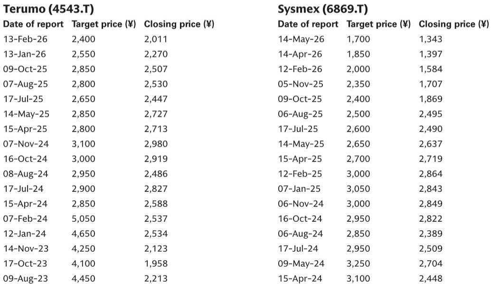
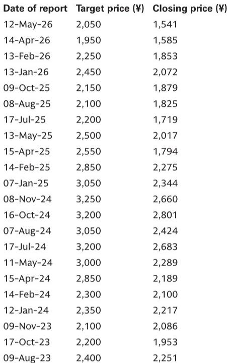
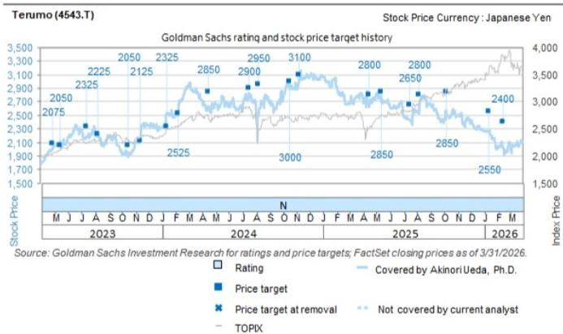

# 中国医疗设备市场的真实分化：部分触底，但IVD的定价风险才刚刚开始

过去两年，外资医疗设备企业在中国经历了一场“集体降温”。从集采扩面到国产替代加速，从耗材降价到试剂控费，几乎每个细分赛道都感受到政策寒意的渗透。但进入2026年第一季度，情况出现了微妙的分化——不是全面复苏，而是一种“结构性触底”的信号。

某外资投行最新发布的日本及全球医疗设备企业季报解析显示，中国市场的故事正在从“一刀切的政策冲击”演变为“按业务线、按产品、按定价模式的分化”。有的企业已经看到销量反弹，有的企业仍在深水区挣扎，而最值得警惕的信号，出现在体外诊断（IVD）这个此前被认为“相对安全”的领域。

这份报告的核心判断是：市场对IVD领域的定价重构风险严重估计不足，而对部分已触底赛道的复苏弹性可能也低估了。真正值得关注的，不是“中国医疗市场好不好”，而是“你的业务组合是否落在政策余震的路径上”。

## 1. 中国医疗设备市场的“触底”信号并非普适，而是高度依赖业务组合

从多家企业的季报表述来看，“触底”一词的出现频率在上升，但这并不意味着全行业的拐点。真正触底的企业，往往具备两个特征：一是产品线已经经历过一轮集采冲击，二是销量增长开始弥补价格下滑。

奥林巴斯在胃肠镜解决方案（GIS）业务上的表现就是一个典型案例。其中国业务在2025年第四季度同比下滑19%，但相比2025年第一季度的-16%、第二季度的-15%，下滑幅度并未显著恶化。更重要的是，管理层明确预期在2027财年实现复苏，部分驱动力来自本地化生产产品的增长。这暗示，对于已经完成本土化生产布局的企业，政策冲击的边际效应正在递减。

泰尔茂的神经血管业务则展示了另一种“触底”路径：集采导致价格下降，但通过销售渠道扩展实现了量增，且量增幅度超过了价格降幅。这种“以量补价”的模式，在集采政策稳定的前提下，理论上可以支撑收入恢复正增长。

但并非所有企业都适用这一逻辑。那些业务重心仍集中在高端进口产品、尚未完成本地化生产的企业，面临的依然是持续的下行压力。波士顿科学虽然整体中国业务实现了双位数增长，但泌尿外科的结石管理和动脉业务仍受到集采影响，只是管理层预计动脉业务的集采冲击将在2026年第二季度逐步消退。

这里的核心洞察是：触底不是时间问题，而是业务结构问题。企业的本地化程度、产品组合的集采暴露度、以及渠道覆盖的深度，决定了它是否站在复苏这一侧。

## 2. IVD领域的定价重构：一个尚未被市场充分定价的尾部风险

如果说上述企业的故事相对乐观，那么IVD领域则完全是另一幅图景。这份报告中最值得警惕的信号，来自希森美康（Sysmex），一家在血液分析、尿液分析等IVD细分领域占据全球领先地位的日本企业。

希森美康中国业务在2025年第四季度销售额同比暴跌38.5%，远超市场预期。下滑的原因不仅仅是集采或“国产替代”，而是一个更复杂的组合：医保控费政策、分销商库存调整（主要在试剂领域）、以及一个尚未正式落地但已引发市场预期的变量——“统一检验定价”政策。

所谓统一检验定价，是指监管部门可能对医院检验科的各项检测项目设定统一的收费标准和报销上限。如果这一政策全面推行，将直接冲击IVD企业的试剂和耗材定价体系，其影响范围远超此前的单品类集采。希森美康在财报中明确表示，2027财年的业绩指引已经包含了这一政策可能落地的影响，但管理层同时承认，政策实施的时间和方式存在高度不确定性，这可能成为未来盈利波动的主要来源。

对比来看，雅培的Core Lab业务在中国一季度销售额同比持平，虽然远好于2025年每季度15%-30%的下滑，但管理层仍表示“不能确定中国市场的逆风已经结束”。罗氏诊断的中国业务一季度更是同比下滑14%，剔除中国后其全球诊断业务增速从3%提升至5%，说明中国是拖累其诊断板块表现的最大单一因素。

更值得关注的是，美国公司Revvity选择直接出售其在中国的免疫诊断业务，这块业务约占公司总销售额的6%。管理层明确表示，出售的背景是“中国诊断市场持续面临价格压力和需求变化”。这不仅是业务调整，更是对IVD领域长期盈利前景的悲观信号。

综合来看，IVD领域正在经历一场比手术器械和影像设备更复杂的定价重构。集采在IVD领域的渗透率仍在上升，而统一检验定价这一新变量意味着，即便企业通过了集采，其试剂和耗材的终端价格仍可能被系统性压低。这一风险尚未在多数投资者的盈利模型中充分体现。

## 3. 国产替代正在从“边缘渗透”转向“高端突破”，但速度仍有争议

中国本土医疗设备企业的崛起，是这份报告的另一条隐含主线。迈瑞医疗的数据提供了一个关键标尺：其在一级医院（Tier-3 hospitals）的进口替代正在加速，免疫分析、生化、凝血三个细分领域的市场份额已从约10%提升至13%，并计划三年内达到20%。

13%到20%的跃升，意味着迈瑞正在从“基层替代”进入“高端替代”阶段。三级医院是外资企业利润最丰厚的客户群，一旦本土企业在此实现系统性的份额提升，外资企业的收入结构和利润率都将面临根本性挑战。

但这里有一个需要谨慎解读的问题：国产替代的速度是否被高估？奥林巴斯的本地化生产战略提供了一个观察视角。它的复苏预期部分建立在中国本地生产产品的增长之上，这意味着外资企业也在通过“以本土化对抗本土化”的方式参与竞争。如果外资企业能够在中国实现完整的本地化研发和生产，其产品在价格和性能上可能重新获得竞争力。

因此，国产替代的真实速度，取决于两个变量的博弈：一是本土企业在高端产品上的技术突破速度，二是外资企业本地化转型的深度。目前来看，迈瑞在免疫分析和凝血领域的进展表明本土企业正在逼近技术门槛，但奥林巴斯的案例也说明外资企业并非被动挨打。

## 4. 报告尚未完全回答的关键问题：统一检验定价的传导机制与二阶效应

这份报告的价值之一，在于它提出了一个关键但尚未被充分分析的问题：统一检验定价政策如果真的全面推行，其传导机制是怎样的？它对不同IVD企业的影响差异在哪里？

从希森美康的表述来看，这一政策的影响可能不是简单的“降价”，而是对整个检验价值链的重构。如果检验项目被统一定价，医院将失去通过高价检验项目获取利润的空间，进而可能压缩试剂采购成本，甚至调整检验科的外包策略。对于以试剂销售为主要收入来源的IVD企业，这意味着其收入模式本身可能面临挑战。

报告没有展开的二阶效应包括：第一，统一检验定价是否会加速医院检验科的自建或自营趋势，从而压缩第三方检验和IVD企业的市场空间？第二，在定价统一后，企业的竞争重心将从价格转向服务、仪器投放效率、以及数据管理能力，这将对企业的能力模型提出全新要求。第三，如果中国IVD市场利润率系统性下降，外资企业是否会效仿Revvity，选择出售或退出中国业务？这将如何改变竞争格局？

这些问题目前仍处于“假设”阶段，但它们恰恰是决定未来两年IVD领域投资逻辑的核心变量。

## 5. 一个更务实的观察框架：从“政策影响”转向“风险暴露度”

基于上述分析，投资者需要建立一个新的观察框架，来评估每一家医疗设备企业在中国的真实风险暴露度。这个框架应该包含四个维度：

第一，业务组合的集采暴露度。雅培管理层提到，其中国业务约80%的营收受到集采影响，这是一个极高的暴露度。相比之下，那些业务集中在未被集采覆盖的细分领域（如生育、肿瘤早筛）的企业，面临的政策风险相对有限。

第二，本地化生产程度。奥林巴斯的案例表明，本地化生产不仅有助于规避关税和供应链风险，更重要的是能够参与本地化采购目录，从而在政策博弈中获得更有利的位置。

第三，试剂与耗材的收入占比。IVD企业的高利润率很大程度上来自试剂耗材的持续销售。一旦统一检验定价政策落地，试剂价格可能被系统性压低，这将直接侵蚀企业的利润基础。相比之下，以设备销售为主的业务模式受影响较小。

第四，高端客户群的稳定性。迈瑞在三级医院的市场份额提升，意味着外资企业的高端客户群正在被侵蚀。那些在三级医院建立长期合作关系的企业，其客户粘性可能高于预期，但这也取决于本土替代产品的性能差距。

这个框架的价值在于，它帮助投资者从“中国医疗市场好不好”的宏观叙事，转向“这家企业在中国到底在卖什么、怎么卖、卖给谁”的微观分析。只有在这个粒度上，才能做出真正有区分度的判断。

## 结语：市场低估的不是需求，而是供给侧的再定价

中国医疗设备市场的长期需求没有改变。人口老龄化和慢性病发病率上升的趋势，决定了这是一个持续增长的赛道。但供给侧的定价逻辑正在经历根本性重构。集采、国产替代、统一检验定价，这三个变量叠加在一起，正在重塑每一家企业的盈利模型。

那些能够通过本地化生产、产品组合优化、以及渠道效率提升来对冲政策压力的企业，可能会在分化中胜出。而那些依赖进口产品溢价、高比例试剂收入、以及低端市场覆盖的企业，面临的挑战可能才刚刚开始。

统一检验定价政策何时落地、如何落地、对哪些细分领域影响最大，这些问题在公开报告中仍缺乏系统性的分析。我们将在后续的深度解读中进一步拆解这一政策的潜在路径，并讨论它如何改变IVD领域的竞争格局。欢迎来星球微信群里继续讨论这些尚未完全展开的问题，包括我们对关键假设的验证思路，以及不同场景下的投资框架调整。

Personal reading notes and learning share only. Not investment advice.

