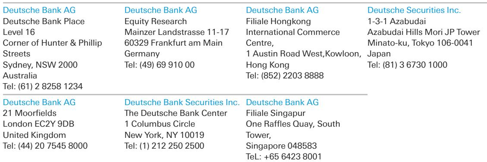

# China’s K-Shaped Reality: Why the Bull and Bear Cases Are Both Correct

The most important insight from a recent three-day investor trip across Beijing and Shanghai is this: China’s geopolitical situation is stabilizing faster than its domestic economy. The US-China relationship is on a more constructive footing, national confidence is being bolstered by rapid advancements in artificial intelligence, and the renminbi is appreciating. Yet beneath this improving external narrative, the domestic picture remains structurally challenged. Consumption is impaired, the property sector is in permanent retreat, and the labor market is weak. This is not a story of recovery versus decline. It is a story of two Chinas operating in parallel, and both the bull and bear cases are clearly visible from the same set of conversations.

The timing of this assessment matters. We are at a pivotal moment where the external tailwind of geopolitical de-escalation is colliding with the internal headwind of a consumption-constrained economy. The result is a market that rewards precision and punishes generalization. For investors, the question is no longer whether China is investable, but which China you are investing in. The answer determines everything about portfolio construction, risk management, and return expectations for the next several years.

This article distills the key strategic implications from the trip, organized around the most critical structural forces at work. It is not a summary. It is an argument about how to interpret what is happening and what it means for decision-makers.

## The Geopolitical Reset Is Real, but It Creates a New Set of Risks

The recent presidential summit achieved its intended purpose: it was a tone-setter, not a transactional deal. That distinction is crucial. Markets often expect immediate deliverables from high-level meetings, but the value here was in establishing a framework for ongoing dialogue. Three more high-level meetings are scheduled for 2026—APEC, the G20, and a potential visit by the Chinese president to Washington in September. These provide a calendar of engagement that did not exist a year ago.

What is underappreciated is the resumption of congressional re-engagement. Post-summit, interaction between both sides has improved notably at levels below the executive branch. This matters because trade policy, investment restrictions, and technology controls are not solely the domain of the White House. A functioning congressional channel reduces the risk of sudden, unilateral escalations that have characterized the relationship in recent years.

Yet the near-term risk is specific and measurable. The Section 301 tariffs are set to expire on July 24. The US administration has signaled its intent to extend the regime. This means effective tariff rates on Chinese goods could rise again, even as the diplomatic mood improves. The paradox is real: better relations do not automatically mean lower tariffs. Investors must hold both ideas simultaneously. The geopolitical floor is higher, but the trade ceiling may be lower than markets currently price.

The strategic implication is that the geopolitical premium in Chinese assets is now more about stability than about liberalization. The risk of a sharp deterioration is lower, but the probability of significant trade concessions is also low. This creates a narrow band of outcomes that rewards selective exposure rather than broad beta plays.

## The K-Shaped Economy Is Not a Transition Phase; It Is the New Structure

China is experiencing a pronounced K-shaped recovery, and this is not a temporary cyclical phenomenon. The "new economy"—tradeable goods, AI-linked equipment, capital goods, and new energy—is growing strongly. AI-related equipment exports alone are up nearly 100 percent year-on-year. Meanwhile, the "old economy" of consumption, property, services, and domestic investment remains structurally weak. April data confirmed this divergence with unusual clarity.

The critical insight is that the new economy's contribution to growth is currently offsetting the old economy's drag. This is what prevents a sharp slowdown. But it is also what masks the depth of the domestic challenge. The headline growth figure of around 5 percent in the first quarter of 2026 is expected to be the peak for the year, with moderation in the second quarter and beyond. Most speakers were confident China would hit its 4.5 to 5 percent growth target for the year, but they expected a managed deceleration to roughly 4 percent over the next decade as the country reaches high-income status.

The policy response reinforces this structural divergence. Fiscal policy remains the dominant growth lever, but near-term easing will be targeted, not broad-based. Policy rates will likely only be cut if growth falls meaningfully below the official target. The more impactful channel for stimulus will be quasi-fiscal, with policy bank lending serving as equity tranches for infrastructure projects. This approach favors the new economy—infrastructure, equipment, and export-oriented industries—while doing little to address the consumption and property weakness at the core of the old economy.

For investors, the K-shape means that sector selection overwhelms country selection. A China allocation that mirrors the broad index will capture both the strength and the weakness, producing mediocre results. The winners are concentrated in specific verticals tied to the new economy, and the losers are broad-based. This is not a market for passive conviction. It is a market for active differentiation.

## The Consumption Problem Is Structural, Not Cyclical, and AI Is Making It Worse

The most consistent message from every meeting was that China's consumption problem stems from a lack of confidence and income, not from a temporary preference for saving. Households have accumulated an estimated 50 to 60 trillion renminbi in deposits since 2021. They are not spending because they are worried about unemployment, weak nominal wage growth, and the severe wealth destruction caused by the property downturn.

A decisive consumption rebound is contingent on one thing: nominal wage growth. But the structural barriers to wage growth are deep. The labor market is weak, and the property sector, which historically absorbed a significant share of employment, is in permanent retreat. This is where the AI story becomes a double-edged sword. AI is displacing service-sector workers at the exact moment when traditional employment sectors have slowed their hiring. The technology that is boosting exports and productivity in the new economy is simultaneously suppressing domestic demand by reducing labor income in the old economy.

This creates a paradox that policymakers have not yet resolved. The same forces that make China globally competitive are undermining the domestic consumption base that would make the economy more balanced and resilient. Until nominal incomes recover, consumption cannot. And the drivers of income recovery—stronger wage growth, a functioning property market, and broad-based employment—are precisely the areas where structural headwinds are strongest.

The implication for investors is that domestic consumption themes remain a high-conviction short or underweight, despite the temptation to buy the dip. The conditions for a consumption recovery are not in place, and the structural impediments are deepening rather than easing. This is not a timing call. It is a structural call.

## Foreign Companies Are Not Leaving, But Their Role Is Changing

One of the most surprising findings from the trip was the resilience of foreign corporate commitment to China. Multinational companies are still profitable in China, but their margins are slimming. Yet they are not actively looking to exit. The reason is strategic, not sentimental.

As one veteran put it, "China is the world's fitness center—if you can win here, you can win anywhere." The competitive intensity, manufacturing scale, and R&D speed that exist nowhere else keep companies anchored, even as confidence slides. Multinationals are increasingly treating China as a learning and innovation hub rather than a pure growth market. This is a fundamental shift in the value proposition of China exposure.

For portfolio investors, this has two implications. First, the risk of a sudden, broad-based foreign exodus that would trigger a sharp de-rating of Chinese assets is low. The anchor is operational, not financial. Second, the nature of foreign investment is changing from growth-seeking to capability-seeking. This means that the premium that Chinese equities once commanded for their growth potential is eroding, while the premium for their innovation and supply chain integration is rising. The two are not the same, and they imply very different valuation frameworks.

## The Property Sector Is in a Permanent Regime Change, Not a Cyclical Downturn

The conclusion from every meeting was consistent: the government has no intention of using property as a primary growth lever again. Current policies are focused on risk control, not reflation. This is not a cyclical downturn that will reverse when conditions improve. It is a permanent regime change.

While the Tier-1 secondary market shows some stabilization in prices and improvement in sales, new home starts and sales remain low. An industry survey cited during the meetings found that over 70 percent of developers and investors expect no market stabilization before 2027. That said, in contrast to previous years, there is growing sentiment that the bottom is now visible, even if it remains distant.

The distinction between "visible bottom" and "near bottom" is critical. A visible bottom means the worst is behind, but the recovery timeline is measured in years, not quarters. The property sector will not contribute to growth for the foreseeable future. It will be a drag, but a diminishing one. For investors, this means that property-related exposures—developers, materials, and consumer durables tied to housing—remain uninvestable for a long-duration portfolio. The opportunity is not in the sector itself, but in the structural reallocation of capital away from property and into the new economy.

## What the Report Does Not Fully Answer: The Transmission Mechanism from PPI to Consumption

The report identifies a welcome but still insufficient shift in inflation dynamics. After 41 consecutive months of negative prints, the producer price index has finally turned positive. A commonly shared view is that "bad or imported inflation is better than deflation." The logic is that in a deflationary mindset, even a modest change in expectations could have an outsized effect on spending.

But the report leaves a critical question open: how does a PPI recovery transmit to household consumption? The historical transmission mechanism ran through corporate profits to wages to spending. That channel is broken. Corporate profits in the new economy are strong, but they are not translating into broad-based wage growth. The labor market is bifurcated, with high-skilled workers in AI and export sectors benefiting while the majority of service and manufacturing workers face stagnant or declining incomes.

For the PPI turn to have a meaningful impact on consumption, it needs to be accompanied by government demand-side support. The speakers were not optimistic about this prospect. The policy preference remains for supply-side measures and targeted fiscal interventions rather than broad-based income support. This means the transmission mechanism from PPI to consumption may remain impaired, limiting the macroeconomic impact of the inflation turn.

This is the key analytical gap that investors need to monitor. If the transmission mechanism remains broken, the PPI recovery will be a false signal for the domestic economy. If it begins to function, it could mark the beginning of a broader recovery. The data to watch is not the PPI level, but nominal wage growth and household income data.

## A Decision Framework for Investors

Based on the trip findings, a three-part decision framework emerges for constructing China exposure.

First, distinguish between the two economies. The new economy is investable. The old economy is not. This means overweighting AI-linked equipment, capital goods, new energy, and export-oriented manufacturing. It means underweighting or avoiding domestic consumption, property, services, and broad-based retail. The K-shape is not going to converge in the near term. It is going to persist.

Second, treat the renminbi as a strategic position, not a tactical trade. The clearest bullish signal from the trip was the consensus among every speaker that the renminbi is on a clear appreciation path, with a year-end forecast range of 6.50 to 6.70 against the dollar. This is driven by corporate settlement flows, as exporters convert a larger share of their trade surpluses into renminbi. The catalysts include greater confidence in export competitiveness, rising volatility in dollar-denominated financial assets, and geopolitical concerns about offshore capital deployment. The central bank appears comfortable with the direction, managing the pace rather than the trajectory. The key risk is a material slowdown in export growth, which would reduce corporate settlement flows and remove the main offset to a weak domestic economy.

Third, calibrate exposure to the geopolitical calendar. The three high-level meetings scheduled for 2026 create specific catalysts and risk events. The July 24 tariff expiry is the most immediate. Each meeting provides an opportunity for positive surprises, but also a risk of disappointment if expectations run ahead of what is diplomatically achievable. The optimal approach is to build positions ahead of meetings and reduce them into the events, capturing the premium for stability without overpaying for deals that may not materialize.

Join the community to read the full report and review the original charts.

*This article is for learning and discussion only and does not constitute investment advice.*

Personal reading notes and learning share only. Not investment advice.

