ASIA ECONOMICS ANALYST

# RMB Internationalization Revisited: Beyond Trade Settlement

# China in the Long Run

Explore >

text_image

Red background with financial chart elements including pie chart and bar graph, overlaid with yen symbols

# Xinquan Chen

+852-2978-2418

xinquan.chen@gs.com

GS (Asia) L.L.C.

RMB international use has improved but still trails China's global footprint, implying solid potential to grow in the future. RMB invoicing in goods imports among sample countries has roughly doubled since 2020 but remained only around $1.5\%$ in 2023; the RMB's share in global payments was around $3 - 4\%$ over the past two years; and the RMB accounted for around $2\%$ of global official reserves and $0.9\%$ of international debt securities by currency of denomination in 2025. The clearest progress is in China-linked trade settlement: RMB settlement in China's goods trade rose from $13\%$ in 2019 to $30\%$ in 2025. With policymakers placing more emphasis on RMB internationalization, we provide a progress check and discuss what it would take for RMB to move beyond China-linked trade settlement.   
Cross-border RMB use is becoming more investment-driven. Total cross-border RMB transactions rose sharply from RMB9tn in 2017 to RMB64tn in 2024, and capital- and financial-account transactions now account for around $75\%$ of the total. Bond investment is the largest single use case, accounting for $46\%$ of cross-border RMB payments in 2024, compared with $19\%$ for goods trade and $13\%$ for direct investment. This shift means the next phase will require more than settlement channels: foreign participants need RMB liquidity that is easier to fund, tools that are easier to hedge with, and RMB assets that are more attractive to hold.   
The next phase is likely to be offshore-led and Hong Kong-centered. Rather than relying first on broad capital-account liberalization, RMB internationalization is likely to proceed through gradual onshore opening and deeper offshore RMB markets. Offshore RMB liquidity has become cheaper and more stable, helped by RMB appreciation, policy support and official infrastructure such as PBOC swap lines and offshore clearing banks. Continued RMB appreciation should help keep onshore-offshore funding gaps narrow and stable.   
Risk-management tools and RMB asset supply remain key bottlenecks. FX hedging is relatively more developed: the RMB's share of global OTC FX derivatives turnover rose from $1.0\%$ in 2010 to $8.1\%$ in 2025. Rates hedging is

less complete: RMB's share of global OTC interest-rate derivatives turnover was only $0.8\%$ in 2025. IRS liquidity is concentrated in the front end and 5y. Offshore investors only have limited access to CGB futures. These factors constrain offshore investors' capacity to hedge longer-dated duration risks.

On the asset side, broader RMB asset use would require wider onshore market access, such as Connect programs covering onshore REITs and commodity products, and deeper offshore RMB markets, including a more liquid offshore RMB bond yield curve, a larger dim sum bond market, and a potential Hong Kong commodity ecosystem with more RMB-denominated products.

# RMB Internationalization Revisited: Beyond Trade Settlement

Recent developments have brought RMB internationalization back into focus. Policy communication has become more supportive, with the 15th Five-Year Plan calling for further RMB internationalization, deeper capital account opening, and a more resilient and self-reliant RMB cross-border payment system. Average daily RMB transaction value through the Cross-Border Interbank Payment System (CIPS) reached a record high In March (Exhibit 1). Against this backdrop, discussions around the “petroyuan” have resurfaced amid the Middle East conflict. Meanwhile, market conditions have turned more favorable for RMB assets: the RMB has appreciated around 3% year-to-date, more than offsetting the roughly 2.5% annualized cost of holding RMB assets implied by US-China interest rate differentials. Separately, dim sum bond (offshore RMB-denominated bonds) issuance has rebounded strongly this year (Exhibit 2).

Exhibit 1: Average daily RMB transaction volume of CIPS spiked in March   
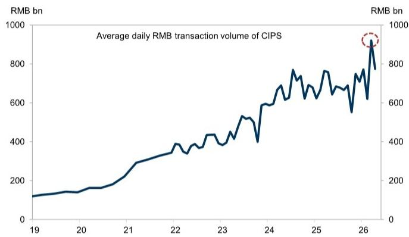

line

Average daily RMB transaction volume of CIPS
| Year | Transaction Volume (RMB bn) |
|---|---|
| 19 | 130 |
| 20 | 150 |
| 21 | 280 |
| 22 | 380 |
| 23 | 420 |
| 24 | 580 |
| 25 | 750 |
| 26 | 950 |

Source: CIPS, Data compiled by GS Global Investment Research

Exhibit 2: Dim sum bond issuance nearly doubled from a year ago in Jan-Apr 2026   
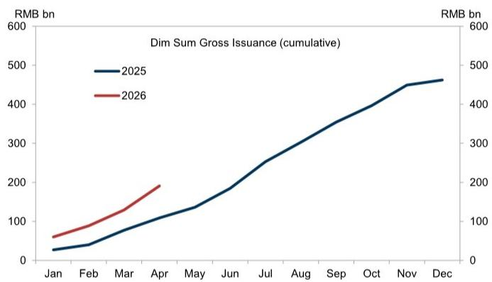

line

Dim Sum Gross Issuance (cumulative)
| Month | 2025 (RMB bn) | 2026 (RMB bn) |
|---|---|---|
| Jan | 30 | 60 |
| Feb | 40 | 80 |
| Mar | 70 | 120 |
| Apr | 110 | 190 |
| May | 140 | - |
| Jun | 180 | - |
| Jul | 250 | - |
| Aug | 300 | - |
| Sep | 350 | - |
| Oct | 400 | - |
| Nov | 450 | - |
| Dec | 460 | - |

Source: Bloomberg, GS Global Investment Research

In this context, clients have increasingly asked what these developments mean for RMB internationalization and what could drive the next phase. In this Asia Economics Analyst, we assess the progress in RMB internationalization across the three functions of an international currency – unit of account, medium of exchange and store of value – and argue that the progress remains uneven and largely concentrated in China-linked trade settlement. We discuss the market foundations needed for broader foreign participation: more stable offshore RMB liquidity, better RMB risk management tools and a broader RMB asset pool.

# Where RMB internationalization stands?

To assess where RMB internationalization stands, we look at both the RMB's role across the three functions of an international currency and the composition of cross-border RMB transactions.

# 1. Uneven progress led by China-related settlement

We start with the standard framework for an international currency: unit of account, medium of exchange and store of value (see our previous notes on the progress of RMB internationalization in 2023 and 2025). In practice, this means looking at the extent to which the RMB is used in invoicing and pricing, settlement and payments, and reserve or asset holdings. We measure these roles using the RMB's share in trade invoicing,

international payments, official reserve assets and international debt market.

RMB international use has improved across functions but still has significant room to grow, especially compared to China's global share of GDP and trade (Exhibit 3). On unit of account, invoicing data are limited, but Boz et. al. (2025) suggest that the average RMB invoicing share in goods imports among sample countries remained only around $1.5\%$ in 2023. On medium of exchange, the RMB's share in global payments has risen, but has remained at around $3 - 4\%$ over the past two years. Both remain low compared with China's $19\%$ share of global GDP in 2024 and $12\%$ share of global trade in 2025. On store of value, the RMB accounted for around $2\%$ of global official reserves and $0.9\%$ of international debt by currency of denomination in 2025. Taken together, these indicators point to continued progress, but also significant room for further RMB internationalization.

Zooming in on the relatively more advanced medium-of-exchange and unit-of-account roles, progress is still mostly China-linked RMB transactions (Exhibit 4). The share of RMB settlement in China's goods trade has risen from $13\%$ in 2019 to $30\%$ in 2025, while the share of RMB invoicing in goods trade with China remains below $10\%$ . Both are much higher than the RMB's shares in global trade invoicing and international payments. Further progress would require continued growth in RMB invoicing and settlement in China-linked trade, as well as broader RMB use in third-party invoicing and settlement.

Exhibit 3: RMB international use has improved, but still trails China's global GDP and trade shares   
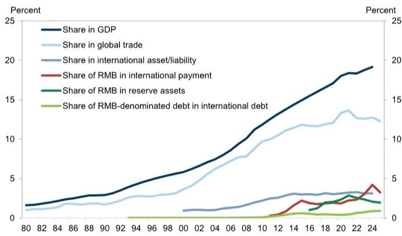

line

| Year | Share in GDP (%) | Share in global trade (%) | Share in international asset/liability (%) | Share of RMB in international payment (%) | Share of RMB in reserve assets (%) | Share of RMB-denominated debt in international debt (%) |
|---|---|---|---|---|---|---|
| 80 | 1.5 | 1.0 | 0.5 | 0.0 | 0.0 | 0.0 |
| 82 | 1.8 | 1.2 | 0.6 | 0.0 | 0.0 | 0.0 |
| 84 | 2.2 | 1.5 | 0.7 | 0.0 | 0.0 | 0.0 |
| 86 | 2.5 | 1.8 | 0.8 | 0.0 | 0.0 | 0.0 |
| 88 | 2.8 | 2.0 | 0.9 | 0.0 | 0.0 | 0.0 |
| 90 | 3.2 | 2.3 | 1.0 | 0.0 | 0.0 | 0.0 |
| 92 | 3.8 | 2.6 | 1.2 | 0.0 | 0.0 | 0.0 |
| 94 | 4.5 | 3.0 | 1.5 | 0.0 | 0.0 | 0.0 |
| 96 | 5.2 | 3.5 | 1.8 | 0.0 | 0.0 | 0.0 |
| 98 | 6.0 | 4.2 | 2.2 | 0.0 | 0.0 | 0.0 |
| 00 | 7.0 | 5.5 | 2.5 | 0.5 | 0.5 | 0.5 |
| 02 | 8.5 | 7.5 | 3.5 | 1.5 | 1.5 | 1.5 |
| 04 | 9.5 | 9.5 | 4.5 | 2.5 | 2.5 | 2.5 |
| 06 | 11.5 | 11.5 | 5.5 | 3.5 | 3.5 | 3.5 |
| 08 | 13.5 | 13.5 | 6.5 | 4.5 | 4.5 | 4.5 |
| 10 | 15.5 | 15.5 | 7.5 | 5.5 | 5.5 | 5.5 |
| 12 | - | - | - | - | - | - |
| 14 | - | - | - | - | - | - |
| 16 | - | - | - | - | - | - |
| 18 | - | - | - | - | - | - |
| 20 | - | - | - | - | - | - |
| 22 | - | - | - | - | - | - |
| 24 | - | - | - | - | - | - |
The chart displays a line graph with markers for each metric: 'Share in GDP (%)' (dark blue), 'Share in global trade (%)' (light blue), 'Share in international asset/liability (%)' (gray), 'Share of RMB in international payment (%)' (red), 'Share of RMB in reserve assets (%)' (green), and 'Share of RMB-denominated debt in international debt (%)' (light green). The data is presented as a table above by Statistic and English labels.

Source: BIS, Lane & Milesi-Ferretti (2018), Haver Analytics, Wind, GS Global Investment Research

Exhibit 4: RMB settlement leads invoicing, especially in China-related trade   
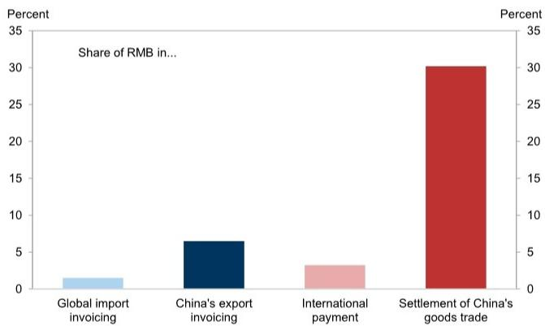

bar

Share of RMB in...
| Category | Percent (%) |
|---|---|
| Global import invoicing | 1.5 |
| China's export invoicing | 6.5 |
| International payment | 3.0 |
| Settlement of China's goods trade | 30.0 |

RMB invoicing shares are as of 2023; RMB settlement/payment shares are as of 2025.   
Source: Boz et. al. (2025), Wind, GS Global Investment Research

# 2. Financial flows dominate cross-border RMB transactions

We next look at China's cross-border RMB transactions. After falling in 2015-2017 amid RMB depreciation pressure after the 2015 FX reform and tighter management of cross-border flows, total cross-border RMB transactions rose sharply from 2017 onward, reaching RMB 64 trillion in 2024, up from RMB 9 trillion in 2017 (Exhibit 5). The composition has also shifted meaningfully. The current-account share fell sharply after 2015 and has stayed around $25\%$ in recent years, while capital and financial account transactions now account for the other $75\%$ of China's cross-border RMB transactions.

Bond investment is now the largest use case for cross-border RMB transactions, including Bond Connect and direct access to China Interbank Bond Market (CIBM Direct). In 2024, it accounted for $46\%$ of cross-border RMB transactions, compared with

19% for goods trade and 13% for direct investment (Exhibit 6). The Qualified Foreign Investor (QFI) program accounted for another 7%, while Stock Connect accounted for 4%. This breakdown suggests that RMB cross-border use has become increasingly driven by investment flows. Therefore, the next phase of RMB internationalization will require more than trade settlement channels: foreign participants will also need more stable offshore liquidity, better risk management tools and a deeper RMB asset pool.

Exhibit 5: Financial flows have become the main driver of cross-border RMB transactions   
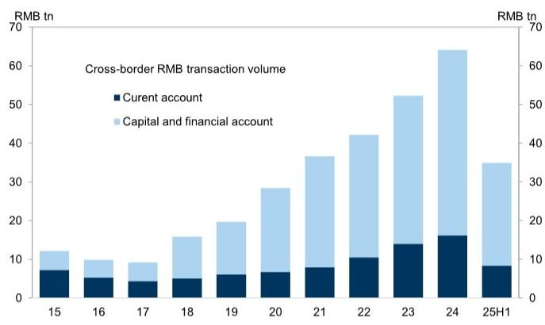

bar_stacked

Cross-border RMB transaction volume
| Year | Current account (RMB tn) | Capital and financial account (RMB tn) |
|---|---|---|
| 15 | 7 | 4 |
| 16 | 5 | 4 |
| 17 | 4 | 3 |
| 18 | 5 | 10 |
| 19 | 6 | 13 |
| 20 | 7 | 22 |
| 21 | 8 | 29 |
| 22 | 10 | 34 |
| 23 | 14 | 40 |
| 24 | 16 | 48 |
| 25H1 | 8 | 34 |

Source: PBOC, Wind, GS Global Investment Research

Exhibit 6: Bond investment accounted for nearly half of cross-border RMB transactions in 2024   
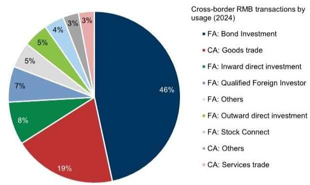

pie

Cross-border RMB transactions by usage (2024)
| Category | Transaction Type (%) |
|---|---|
| FA: Bond Investment | 46 |
| CA: Goods trade | 19 |
| FA: Inward direct investment | 8 |
| FA: Qualified Foreign Investor | 7 |
| FA: Others | 5 |
| FA: Outward direct investment | 5 |
| FA: Stock Connect | 4 |
| CA: Others | 3 |
| CA: Services trade | 3 |

Source: Wind, GS Global Investment Research

# What would it take for the RMB to move beyond China-linked trade settlement?

The next phase of RMB internationalization is likely to rely on gradual onshore opening and deeper offshore RMB markets. Hong Kong can function as a policy sandbox, where broader capital-account opening remains gradual and controlled, while offshore RMB funding, trading, and hedging channels continue to expand.

Exhibit 7 shows how offshore RMB liquidity circulates through Hong Kong. The left block captures medium-to-long term RMB supply from retail flows, trade, investment, and cross-border lending. The top block captures official backstop, including HKMA RMB liquidity facilities, which are ultimately supported by the PBOC-HKMA standing swap line. These channels feed into Hong Kong's RMB liquidity pool, mainly deposits and certificates of deposits, which are then deployed into offshore RMB lending, dim sum bonds, RMB derivatives and onshore assets through various connect programs.

Exhibit 7: A framework for offshore RMB liquidity in Hong Kong   
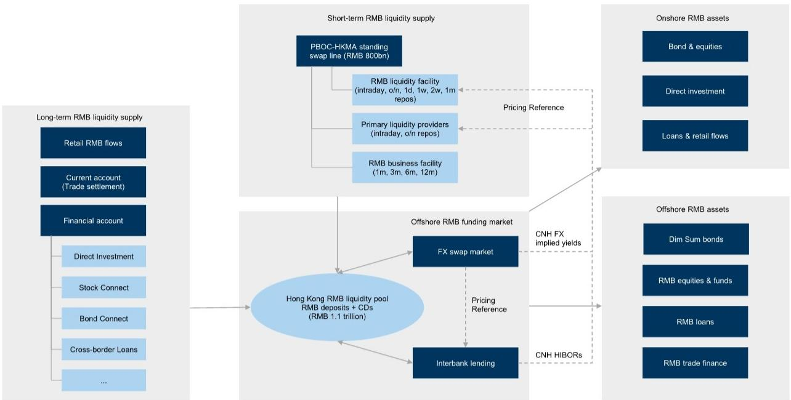

flowchart

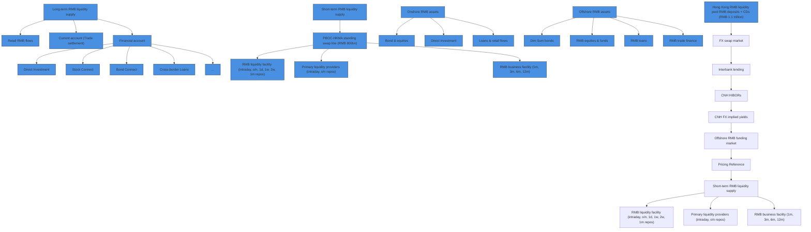

Source: HKMA, GS Global Investment Research

The framework highlights a key point: offshore RMB market development is not only about accumulating RMB deposits or settling China-linked trade. It requires an ecosystem in which RMB can be funded, invested, hedged and redeployed. To move beyond China-linked trade settlement, the RMB therefore needs to become easier to fund, more convenient to hedge and more attractive to hold. We focus on three market foundations: offshore RMB liquidity, risk management tools and a broader RMB asset pool.

# 1. More stable offshore RMB liquidity

Offshore RMB liquidity has become cheaper and more stable, partly helped by recent RMB appreciation against the Dollar. Funding cost matters because it determines how easily RMB can be used for investment, lending and bond issuance offshore. In the past, investors had to factor in volatile onshore-offshore funding gaps when trading offshore RMB assets. Short-term offshore RMB funding rates in Hong Kong could be around 2pp higher than onshore RMB funding rates in 2023-24, nearly doubling the costs when onshore funding rates were around $2\%$ . The funding gaps are closely linked to RMB exchange rates. When RMB depreciation pressure rises, CNH often weakens faster than CNY against the USD, causing CNH to trade at a discount to CNY and pushing offshore RMB liquidity back onshore. In addition, PBOC FX management may also tighten offshore RMB liquidity by raising front-end CNH funding costs to discourage CNH shorts. Together, these forces pushed up CNH funding levels and volatility in 2022-24. More recently, these frictions have eased: the spread between 3-month CNH HIBOR and

3-month SHIBOR has narrowed to around 15-25bp since April 2026, compared with 100-200bp and much higher volatility previously (Exhibit 8). Hong Kong RMB deposits also tend to rise during RMB appreciation cycles, as CNH often appreciates more than CNY (Exhibit 9). $^{3}$ We expect USD/CNY to reach 6.50 in 12 months, supported by policy intention, export strength and significant FX undervaluation. Continued RMB appreciation should help keep onshore-offshore funding gaps narrow and stable.

Exhibit 8: CNH-CNY funding spreads have narrowed and stabilized since April 2025   

line

| Year | USD/CNH spot vs. USD/CNY spot | CNH HIBOR vs. CNY SHIBOR |
|------|-------------------------------|---------------------------|
| 15   | -100                          | -100                      |
| 16   | 300                           | 400                       |
| 17   | 100                           | 300                       |
| 18   | 0                             | 200                       |
| 19   | 100                           | 300                       |
| 20   | 0                             | 100                       |
| 21   | 0                             | 0                         |
| 22   | 0                             | 100                       |
| 23   | 0                             | 200                       |
| 24   | 0                             | 300                       |
| 25   | 0                             | 200                       |
| 26   | 0                             | 0                         |

Source: GS FICC and Equities, Bloomberg, CEIC

Exhibit 9: Hong Kong RMB deposits tend to rise during RMB appreciation cycles   
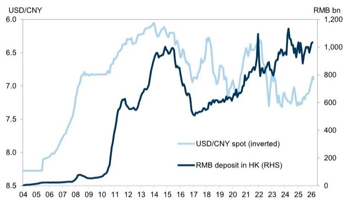

line

| Year | USD/CNY spot (inverted) | RMB deposit in HK (RHS) |
|------|--------------------------|--------------------------|
| 04   | 8.5                      | 0                        |
| 05   | 8.5                      | 0                        |
| 06   | 8.5                      | 0                        |
| 07   | 8.5                      | 0                        |
| 08   | 8.5                      | 0                        |
| 09   | 8.5                      | 0                        |
| 10   | 8.5                      | 0                        |
| 11   | 8.5                      | 0                        |
| 12   | 8.5                      | 0                        |
| 13   | 8.5                      | 0                        |
| 14   | 8.5                      | 0                        |
| 15   | 8.5                      | 0                        |
| 16   | 8.5                      | 0                        |
| 17   | 8.5                      | 0                        |
| 18   | 8.5                      | 0                        |
| 19   | 8.5                      | 0                        |
| 20   | 8.5                      | 0                        |
| 21   | 8.5                      | 0                        |
| 22   | 8.5                      | 0                        |
| 23   | 8.5                      | 0                        |
| 24   | 8.5                      | 0                        |
| 25   | 8.5                      | 0                        |
| 26   | 8.5                      | 0                        |

Source: Haver Analytics, Wind

The source of offshore RMB liquidity in Hong Kong has also changed. Since the launch of RMB cross-border trade settlement between mainland China and HK in July 2009, trade settlement was an important source of RMB liquidity in HK until 2019. More recently, trade-related RMB remittances have increasingly flowed from Hong Kong back to mainland China (vs. RMB300-400bn trade-related remittances into Hong Kong in 2017-19). This suggests that Hong Kong's RMB liquidity pool has become more dependent on financial flows, such as cross-border financing, direct investment, portfolio investment and the PBOC-HKMA RMB swap line.

Recent policy measures continue to support cross-border RMB financial flows. In February 2025, the HKMA launched the RMB Business Facility to support RMB trade financing in Hong Kong, priced with reference to onshore RMB funding costs. In September 2025, the launch of cross-boundary bond repo business allowed foreign investors to participate in the onshore repo market and remit the RMB liquidity obtained for offshore use. In February 2026, the PBOC eased cross-border RMB interbank financing rules by moving from separate business-specific quotas to a unified net lending quota for onshore financial institutions, giving banks more flexibility to provide RMB funding offshore. Together with the offshore RMB bond repo business launched in February 2025, these measures should help make offshore RMB liquidity more stable and less costly.

Official infrastructure also matters. Offshore RMB clearing banks and PBOC swap lines provide the operational infrastructure and emergency liquidity support for offshore RMB use. Clearing banks help offshore banks and companies to settle RMB payments locally, without routing every transaction back through mainland China. This network has expanded from the first offshore RMB clearing bank in Hong Kong in 2003 to 35 clearing banks in 33 economies by June 2025. Economies covered by offshore RMB clearing bank arrangements accounted for about $64\%$ of China's goods trade in 2025, based on our estimates. PBOC swap lines are an official RMB liquidity backstop: a foreign central bank can obtain RMB from the PBOC and provide it to local banks when needed. $^{4}$ Swap line capacity has expanded rapidly since 2009, but actual drawings remain relatively low (around $2 - 3\%$ of total capacity; Exhibit 10). PBOC RMB swap line partners accounted for around $60\%$ of China's goods trade in 2025. Unlike the Fed's dollar swap network, which mainly addresses dollar funding stress, PBOC swap lines have broader goals of supporting bilateral trade, investment and RMB international use. As discussed above, Hong Kong's RMB liquidity shows how swap lines can support offshore RMB funding. Perez-Saiz and Zhang (2023) find that swap lines and offshore RMB clearing banks have helped boost RMB use in cross-border payments with China, partly by easing offshore RMB liquidity constraints under China's capital controls.

Exhibit 10: PBOC RMB swap lines have expanded in coverage and capacity, while utilization remains low   
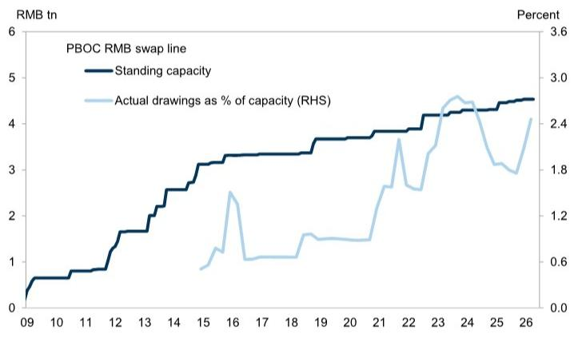

line

| Year | Standing capacity (RMB tn) | Actual drawings as % of capacity (RHS) |
|------|-----------------------------|----------------------------------------|
| 09   | 0.5                         | 0.0                                    |
| 10   | 0.7                         | 0.0                                    |
| 11   | 0.8                         | 0.0                                    |
| 12   | 1.5                         | 0.0                                    |
| 13   | 2.0                         | 0.0                                    |
| 14   | 2.5                         | 0.0                                    |
| 15   | 3.0                         | 0.6                                    |
| 16   | 3.2                         | 1.8                                    |
| 17   | 3.3                         | 0.6                                    |
| 18   | 3.4                         | 0.6                                    |
| 19   | 3.5                         | 1.0                                    |
| 20   | 3.6                         | 1.0                                    |
| 21   | 3.7                         | 1.8                                    |
| 22   | 3.8                         | 2.4                                    |
| 23   | 4.0                         | 2.8                                    |
| 24   | 4.2                         | 2.6                                    |
| 25   | 4.3                         | 1.8                                    |
| 26   | 4.5                         | 2.4                                    |

Source: PBOC, Wind, Data compiled by GS Global Investment Research

# 2. Better risk management tools

Foreign investors need tools to manage FX, rates and credit risks if they are to hold RMB assets, raising RMB funds or doing business in RMB. FX hedging manages currency moves; rates hedging manages benchmark interest-rate risk and funding costs; and credit hedging manages credit-spread risk in RMB credit exposure. RMB risk-management tools have developed unevenly across markets. The RMB's footprint in global derivatives markets is much larger in FX than in rates: according to the BIS Triennial Survey, the RMB's share of global OTC FX derivatives (such as FX swaps) turnover rose from 1.0% in 2010 to 8.1% in 2025, while its share of global OTC interest-rate derivatives turnover increased only from 0.1% to 0.8% over the same period and has changed little since reaching around 0.6% in 2013 (Exhibit 11). $^{5}$ The

slower development of RMB rates derivatives partly reflects China's gradual interest-rate liberalization, evolving benchmark rate framework and the late relaunch of CGB futures in 2013. $^{6}$ FX hedging is therefore the more developed part of the RMB toolkit, though CNY/CNH basis risk remains an important consideration for offshore investors (Exhibit 12). $^{7}$ For example, in 2023-24, hedging RMB depreciation risk in the offshore market could earn around 2pp per year from the hedge, compared with around 4pp per year in the onshore market.

Exhibit 11: RMB's footprint in global derivatives markets is much larger in FX than in rates   
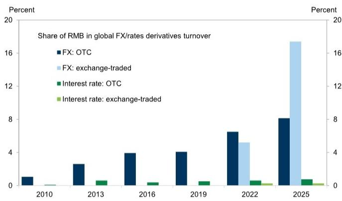

bar

Share of RMB in global FX/rates derivatives turnover
| Year | FX: OTC (%) | FX: exchange-traded (%) | Interest rate: OTC (%) | Interest rate: exchange-traded (%) |
|---|---|---|---|---|
| 2010 | 1 | 0 | 0 | 0 |
| 2013 | 3 | 0 | 1 | 0 |
| 2016 | 4 | 0 | 1 | 0 |
| 2019 | 4 | 0 | 1 | 0 |
| 2022 | 7 | 5 | 1 | 0 |
| 2025 | 8 | 17 | 1 | 0 |

Exchange-traded RMB FX and interest rate derivatives data are available only for the 2022 and 2025 survey years.   
Source: BIS, GS Global Investment Research

Exhibit 12: The onshore-offshore spread of FX forward points remains significant, while the basis risk for FX spot is limited   
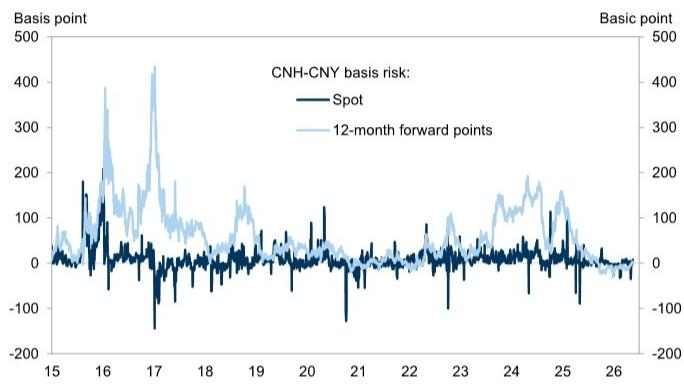

line

| Year | Spot | 12-month forward points |
|------|------|--------------------------|
| 15   | ~0   | ~0                       |
| 16   | ~150 | ~350                     |
| 17   | ~-150| ~450                     |
| 18   | ~0   | ~100                     |
| 19   | ~0   | ~150                     |
| 20   | ~0   | ~100                     |
| 21   | ~-150| ~50                      |
| 22   | ~0   | ~0                       |
| 23   | ~0   | ~100                     |
| 24   | ~0   | ~200                     |
| 25   | ~-100| ~150                     |
| 26   | ~0   | ~0                       |

We calculate offshore price minus onshore price as basis points of USD/CNY spot.   
Source: GS FICC and Equities

# Box: RMB FX hedging: swaps dominate, futures complement

RMB FX derivatives are the more developed part of the RMB hedging toolkit. The RMB's share of global OTC FX derivatives turnover rose from 1.0% in 2010 to 8.1% in 2025, far above its 0.8% share in global OTC interest-rate derivatives turnover. RMB FX derivatives are highly concentrated: around 96% is traded against the USD, and FX swaps account for around 68% of turnover. $^{8}$ More than 90% of offshore RMB trading takes place in four centres — Hong Kong, Singapore, the UK and the US. Hong Kong remains the largest offshore RMB trading hub, accounting for more than 40% of OTC RMB FX derivatives turnover

# bond futures.

outside mainland China. Robbert, Sushko, and Westermann (2026) find that this geographical concentration increasingly reflects financial links with China, including cross-border banking exposure to China and Qualified Foreign Investors (QFI) access.

Exchange-traded RMB FX products (such as FX futures) remain a much smaller market compared with OTC derivatives (such as FX swaps). Globally, exchange-traded FX derivatives turnover has been only around $3\%$ of OTC FX derivatives turnover over the past decade. For RMB, exchange-traded FX derivatives reached $7\%$ of OTC turnover in 2025, up from $2\%$ in 2022. Hong Kong's USD/CNH futures market illustrates the point. Turnover remained limited for much of the period after launch in 2012, but rose notably after market-maker incentives improved liquidity provision from 2023 (Exhibit 13).

Exhibit 13: Market-maker incentives helped lift USD/CNH futures turnover in Hong Kong   
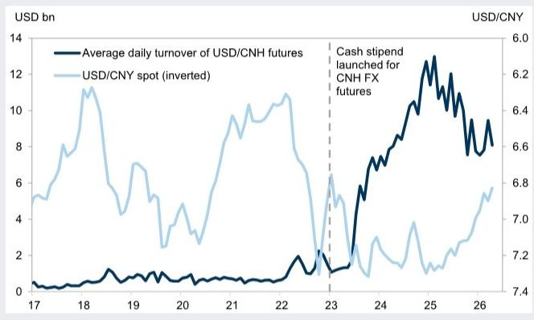

line

| Year | Average daily turnover of USD/CNH futures (USD bn) | USD/CNY spot (inverted) (USD bn) |
|------|--------------------------------------------------|----------------------------------|
| 17   | ~0.5                                             | ~5.0                             |
| 18   | ~0.8                                             | ~11.0                            |
| 19   | ~0.7                                             | ~4.5                             |
| 20   | ~0.6                                             | ~3.0                             |
| 21   | ~0.7                                             | ~9.0                             |
| 22   | ~1.0                                             | ~10.5                            |
| 23   | ~1.5                                             | ~6.0                             |
| 24   | ~6.5                                             | ~7.0                             |
| 25   | ~13.0                                            | ~6.8                             |
| 26   | ~8.0                                             | ~7.5                             |

Source: CEIC, Haver Analytics

RMB FX futures are unlikely to replace OTC FX swaps, but they can complement the market by broadening access and improving price discovery. OTC products remain better suited for large, customized hedging needs; futures offer standardized contracts, transparent pricing, centralized clearing and settlement, and easier operational access for some investors and corporates. Recent policy discussion on developing onshore RMB FX futures points in the same direction.

The bigger gap is long-duration rates hedging for foreign investors. The main tools are interest rate swaps (IRS), which are OTC products, and Chinese government bond (CGB) futures, which are exchange-traded products. IRS is available both onshore and offshore, while CGB futures currently trade only onshore. Note that offshore IRS refers to non-deliverable interest rate swaps (NDIRS), which are settled in USD on a net cash basis without exchanging RMB. IRS and CGB futures hedge different risks: IRS is linked to funding rate expectations, while CGB futures are more directly linked to government bond yield curve. Onshore IRS liquidity is concentrated in the front-end and 5y, while liquidity beyond 5y is limited. By contrast, onshore CGB futures are mostly traded at longer tenors, with 30y and 10y contracts accounting for 37% and 25% of turnover, respectively (Exhibit 14). Hedge effectiveness points in the same direction. Exhibit 15 shows that CGB futures have tended to provide a closer hedge for long-end CGBs than IRS or NDIRS over the past few years. $^{9}$ IRS can still track long-end CGB yields well

because both reflect domestic funding conditions and/or monetary policy expectations.

Exhibit 14: CGB futures trading is concentrated in 10y and 30y tenors, while IRS trading is mostly at the frond end   
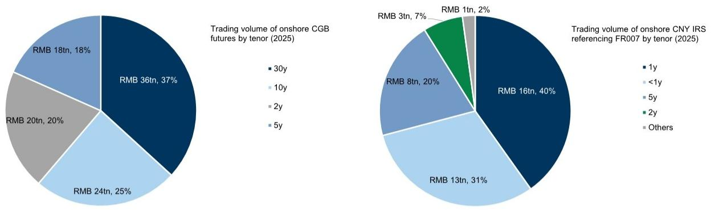

pie

Trading volume of onshore CGB futures by tenor (2025)
| Tenor | Trading volume (RMB) | Percentage (%) |
| :--- | :--- | :--- |
| 2025 | RMB 36tn | 37 |
| 2025 | RMB 24tn | 25 |
| 2025 | RMB 20tn | 20 |
| 2025 | RMB 18tn | 18 |
| 2025 | 30y | |
| 2025 | 10y | |
| 2025 | 2y | |
| 2025 | 5y | |
| 2025 | RMB 16tn | 40 |
| 2025 | RMB 13tn | 31 |
| 2025 | RMB 8tn | 20 |
| 2025 | RMB 3tn | 7 |
| 2025 | RMB 1tn | 2 |
Trading volume of onshore CNY IRS referencing FR007 by tenor (2025)

Source: CEIC, GS Global Investment Research

Exhibit 15: Longer-dated CGB futures provide a better hedge for long-end CGBs   

line

| Year | IRS: 5y | NDIRS: 5y | CGB futures: 10y | CGB futures: 30y |
|------|---------|-----------|------------------|------------------|
| 17   | ~0.5    | ~0.4      | ~0.3             | ~0.3             |
| 18   | ~0.5    | ~0.4      | ~0.3             | ~0.3             |
| 19   | ~0.5    | ~0.4      | ~0.3             | ~0.3             |
| 20   | ~0.7    | ~0.6      | ~0.7             | ~0.7             |
| 21   | ~0.7    | ~0.6      | ~0.7             | ~0.7             |
| 22   | ~0.7    | ~0.6      | ~0.7             | ~0.7             |
| 23   | ~0.7    | ~0.6      | ~0.7             | ~0.7             |
| 24   | ~0.7    | ~0.6      | ~0.7             | ~0.7             |
| 25   | ~0.7    | ~0.6      | ~0.7             | ~0.7             |
| 26   | ~0.6    | ~0.4      | ~0.6             | ~0.6             |

Source: GS FICC and Equities, CEIC, GS Global Investment Research

Policy has started to address these gaps. Since 2020, foreign investors in China's interbank bond market have been allowed to use onshore FX derivatives to hedge FX risks from bond investment, and the extension of CFETS FX trading hours to 3am Beijing time has made onshore trading more accessible across global time zones. Swap Connect, launched in 2023, gave offshore investors access to onshore IRS, which narrowed the spread between IRS and NDIRS rates. In April 2026, qualified foreign investors were allowed to trade onshore CGB futures for hedging purposes. Hong Kong is also preparing an offshore CGB futures market. These steps will provide a broader toolkit that can better support long-duration hedging for foreign investors. Credit risk hedging is a further gap. Market feedback suggests that defaults in onshore credit bonds and insufficient risk-mitigation tools remain concerns for overseas investors. For foreign investors to expand beyond CGBs and policy bank bonds, they would need improved credit rating systems and more developed credit-risk mitigation tools.

# 3. Broader RMB asset pool

A broader RMB asset pool requires both smoother access to onshore assets and deeper offshore RMB-denominated assets. The issue is not simply the size of China's domestic markets. China's onshore equity and bond markets are already large and continue to

expand, with A-share market capitalization at around RMB120trillion (or US\$17tn), and bond market custody balance close to RMB200trillion (or US\$28tn). Yet foreign participation has not risen mechanically. Foreign investors have reduced RMB bond holdings while increasing RMB equity holdings in recent years, and their overall share of domestic assets has declined (Exhibit 16). This partly reflects unfavorable interest rate differentials between China and major developed markets. Further enhancement of Connect programs would help encourage investment in RMB assets. For example, Swap Connect program currently only supports northbound trading; adding southbound trading could help onshore investors manage offshore RMB rates exposure, encourage more Southbound allocation to offshore RMB assets and add depth to Hong Kong's offshore RMB liquidity pool. Expanding Connect programs to a broader set of assets, such as real-estate investment trusts (REITs), private funds and commodity futures, could also broaden the investable RMB universe, and thus potentially raise RMB international use.

Exhibit 16: Foreign investors have increased their holdings of RMB equities but reduced holdings of RMB bonds over the past few months   
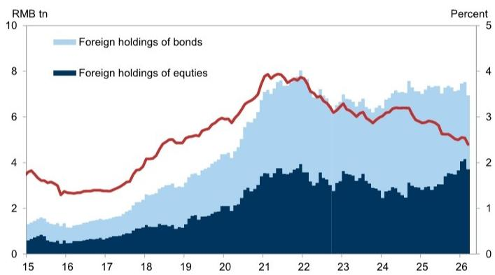

bar_line

| Year | Foreign holdings of bonds (RMB tn) | Foreign holdings of equities (Percent) |
|------|-------------------------------------|----------------------------------------|
| 15   | ~1.5                                | ~0.5                                   |
| 16   | ~1.8                                | ~0.6                                   |
| 17   | ~2.0                                | ~0.7                                   |
| 18   | ~2.5                                | ~0.9                                   |
| 19   | ~3.0                                | ~1.1                                   |
| 20   | ~4.0                                | ~1.5                                   |
| 21   | ~6.0                                | ~2.0                                   |
| 22   | ~7.5                                | ~2.5                                   |
| 23   | ~6.5                                | ~2.0                                   |
| 24   | ~7.0                                | ~1.8                                   |
| 25   | ~7.5                                | ~1.5                                   |
| 26   | ~7.0                                | ~1.8                                   |

Source: PBOC, Wind, Data compiled by GS Global Investment Research

Offshore RMB-denominated assets also need to deepen. The offshore market still lacks a liquid CGB yield curve. Dim sum bonds account for only a small share of the international debt securities market, and the outstanding amount was only around RMB1.4trillion as of April 2026. Further growth would require a broader issuer base, better secondary-market liquidity and longer-dated issuance. There has been some progress: some China tech companies (such as JD and Tencent) have issued dim sum bonds over the past two years. Foreign financial institutions have also become more active, issuing longer-dated bonds. More offshore RMB government bond issuance in Hong Kong could help establish a more liquid yield curve. Hong Kong's plan to develop a commodity trading ecosystem could also help over time, especially if more RMB-denominated products are introduced.

# Xinquan Chen

The China Economics Team

# Andrew Tilton

+852-2978-1802

andrew.tilton@gs.com

GS (Asia) L.L.C.

# Hui Shan

+852-2978-6634

hui.shan@gs.com

GS (Asia) L.L.C.

# Lisheng Wang

+852-3966-4004

lisheng.wang@gs.com

GS (Asia) L.L.C.

# Xinquan Chen

+852-2978-2418

xinquan.chen@gs.com

GS (Asia) L.L.C.

# Yuting Yang

+852-2978-7283

yuting.y.yang@gs.com

GS (Asia) L.L.C.

# Chelsea Song

+852-2978-0106

chelsea.song@gs.com

GS (Asia) L.L.C.

# Disclosure Appendix

# Reg AC

I, Xinquan Chen, hereby certify that all of the views expressed in this report accurately reflect my personal views, which have not been influenced by considerations of the firm's business or client relationships.

Unless otherwise stated, the individuals listed on the cover page of this report are analysts in GS' Global Investment Research division.

Contributing Authors: Xinquan Chen GS (Asia) L.L.C..

Unless otherwise stated, the individuals listed in the Contributing Authors disclosure of this report are analysts in GS' Global Investment Research division.

# Disclosures

# Regulatory disclosures

# Disclosures required by United States laws and regulations

See company-specific regulatory disclosures above for any of the following disclosures required as to companies referred to in this report: manager or co-manager in a pending transaction; $1\%$ or other ownership; compensation for certain services; types of client relationships; managed/co-managed public offerings in prior periods; directorships; for equity securities, market making and/or specialist role. GS trades or may trade as a principal in debt securities (or in related derivatives) of issuers discussed in this report.

The following are additional required disclosures: Ownership and material conflicts of interest: GS policy prohibits its analysts, professionals reporting to analysts and members of their households from owning securities of any company in the analyst's area of coverage. Analyst compensation: Analysts are paid in part based on the profitability of GS, which includes investment banking revenues. Analyst as officer or director: GS policy generally prohibits its analysts, persons reporting to analysts or members of their households from serving as an officer, director or advisor of any company in the analyst's area of coverage. Non-U.S. Analysts: Non-U.S. analysts may not be associated persons of GS & Co. LLC and therefore may not be subject to FINRA Rule 2241 or FINRA Rule 2242 restrictions on communications with a subject company, public appearances and trading in securities covered by the analysts.

# Additional disclosures required under the laws and regulations of jurisdictions other than the United States

The following disclosures are those required by the jurisdiction indicated, except to the extent already made above pursuant to United States laws and regulations. Australia: GS Australia Pty Ltd and its affiliates are not authorised deposit-taking institutions (as that term is defined in the Banking Act 1959 (Cth)) in Australia and do not provide banking services, nor carry on a banking business, in Australia. This research, and any access to it, is intended only for “wholesale clients” within the meaning of the Australian Corporations Act, unless otherwise agreed by GS. In producing research reports, members of Global Investment Research of GS Australia may attend site visits and other meetings hosted by the companies and other entities which are the subject of its research reports. In some instances the costs of such site visits or meetings may be met in part or in whole by the issuers concerned if GS Australia considers it is appropriate and reasonable in the specific circumstances relating to the site visit or meeting. To the extent that the contents of this document contains any financial product advice, it is general advice only and has been prepared by GS without taking into account a client’s objectives, financial situation or needs. A client should, before acting on any such advice, consider the appropriateness of the advice having regard to the client’s own objectives, financial situation and needs. A copy of certain GS Australia and New Zealand disclosure of interests and a copy of GS’ Australian Sell-Side Research Independence Policy Statement are available at: https://www.goldmansachs.com/disclosures/australia-new-zealand/index.html. Brazil: Disclosure information in relation to CVM Resolution n. 20 is available at https://www.gs.com/worldwide/brazil/area/gir/index.html. Where applicable, the Brazil-registered analyst primarily responsible for the content of this research report, as defined in Article 20 of CVM Resolution n. 20, is the first author named at the beginning of this report, unless indicated otherwise at the end of the text. Canada: This information is being provided to you for information purposes only and is not, and under no circumstances should be construed as, an advertisement, offering or solicitation by GS & Co. LLC for purchasers of securities in Canada to trade in any Canadian security. GS & Co. LLC is not registered as a dealer in any jurisdiction in Canada under applicable Canadian securities laws and generally is not permitted to trade in Canadian securities and may be prohibited from selling certain securities and products in certain jurisdictions in Canada. If you wish to trade in any Canadian securities or other products in Canada please contact GS Canada Inc., an affiliate of The GS Group Inc., or another registered Canadian dealer. Hong Kong: Further information on the securities of covered companies referred to in this research may be obtained on request from GS (Asia) L.L.C. India: Further information on the subject company or companies referred to in this research may be obtained from GS (India) Securities Private Limited, Research Analyst - SEBI Registration Number INH000001493, 10th Floor, Ascent-Worli, Sudam Kalu Ahire Marg, Worli, Mumbai-400 025, India, Corporate Identity Number U74140MH2006FTC160634, Phone +91 22 6616 9000, Fax +91 22 6616 9001. GS may beneficially own 1% or more of the securities (as such term is defined in clause 2 (h) the Indian Securities Contracts (Regulation) Act, 1956) of the subject company or companies referred to in this research report. Investment in securities market are subject to market risks. Read all the related documents carefully before investing. Registration granted by SEBI and certification from NISM in no way guarantee performance of the intermediary or provide any assurance of returns to investors. GS (India) Securities Private Limited compliance officer and investor grievance contact details can be found at: https://www.goldmansachs.com/worldwide/india/documents/Grievance-Redressal-and-Escalation-Matrix.pdf, and a copy of the annual audit compliance report can be found at this link: https://publishing.gs.com/content/site/india-annual-compliance-report.html. Japan: See below. Korea: This research, and any access to it, is intended only for “professional investors” within the meaning of the Financial Services and Capital Markets Act, unless otherwise agreed by GS. Further information on the subject company or companies referred to in this research may be obtained from GS (Asia) L.L.C., Seoul Branch. New Zealand: GS New Zealand Limited and its affiliates are neither “registered banks” nor “deposit takers” (as defined in the Reserve Bank of New Zealand Act 1989) in New Zealand. This research, and any access to it, is intended for “wholesale clients” (as defined in the Financial Advisers Act 2008) unless otherwise agreed by GS. A copy of certain GS Australia and New Zealand disclosure of interests is available at: https://www.goldmansachs.com/disclosures/australia-new-zealand/index.html. Russia: Research reports distributed in the Russian Federation are not advertising as defined in the Russian legislation, but are information and analysis not having product promotion as their main purpose and do not provide appraisal within the meaning of the Russian legislation on appraisal activity. Research reports do not constitute a personalized investment recommendation as defined in Russian laws and regulations, are not addressed to a specific client, and are prepared without analyzing the financial circumstances, investment profiles or risk profiles of clients. GS assumes no responsibility for any investment decisions that may be taken by a client or any other person based on this research report. Singapore: GS (Singapore) Pte. (Company Number: 198602165W), which is regulated by the Monetary Authority of Singapore, accepts legal responsibility for this research, and should be contacted with respect to any matters arising from, or in connection with, this research. Taiwan: This material is for reference only and must not be reprinted without permission. Investors should carefully consider their own investment risk. Investment results are the responsibility of the individual investor. United Kingdom: Persons who would be categorized as retail clients in the United Kingdom, as such term is defined in the rules of the Financial Conduct Authority, should read this research in conjunction with prior GS on the covered

companies referred to herein and should refer to the risk warnings that have been sent to them by GS International. A copy of these risks warnings, and a glossary of certain financial terms used in this report, are available from GS International on request.

European Union and United Kingdom: Disclosure information in relation to Article 6 (2) of the European Commission Delegated Regulation (EU) (2016/958) supplementing Regulation (EU) No 596/2014 of the European Parliament and of the Council (including as that Delegated Regulation is implemented into United Kingdom domestic law and regulation following the United Kingdom's departure from the European Union and the European Economic Area) with regard to regulatory technical standards for the technical arrangements for objective presentation of investment recommendations or other information recommending or suggesting an investment strategy and for disclosure of particular interests or indications of conflicts of interest is available at https://www.gs.com/disclosures/europeanpolicy.html which states the European Policy for Managing Conflicts of Interest in Connection with Investment Research.

Japan: GS Japan Co., Ltd. is a Financial Instrument Dealer registered with the Kanto Financial Bureau under registration number Kinsho 69, and a member of Japan Securities Dealers Association, Financial Futures Association of Japan Type II Financial Instruments Firms Association, and Investment Management Association of Japan. Sales and purchase of equities are subject to commission pre-determined with clients plus consumption tax. See company-specific disclosures as to any applicable disclosures required by Japanese stock exchanges, the Japanese Securities Dealers Association or the Japanese Securities Finance Company.

# Global product; distributing entities

GS Global Investment Research produces and distributes research products for clients of GS on a global basis. Analysts based in GS offices around the world produce research on industries and companies, and research on macroeconomics, currencies, commodities and portfolio strategy. This research is disseminated in Australia by GS Australia Pty Ltd (ABN 21 006 797 897); in Brazil by GS do Brasil Corretora de Títulos e Valores Mobiliários S.A.; Public Communication Channel GS Brazil: 0800 727 5764 and / or contatogoldmanbrasil@gs.com. Available Weekdays (except holidays), from 9am to 6pm. Canal de Comunicação com o Público GS Brasil: 0800 727 5764 e/ou contatogoldmanbrasil@gs.com. Horário de funcionamento: segunda-feira à sexta-feira (exceto feriados), das 9h às 18h; in Canada by GS & Co. LLC; in Hong Kong by GS (Asia) L.L.C.; in India by GS (India) Securities Private Ltd.; in Japan by GS Japan Co., Ltd.; in the Republic of Korea by GS (Asia) L.L.C., Seoul Branch; in New Zealand by GS New Zealand Limited; in Russia by OOO GS; in Singapore by GS (Singapore) Pte. (Company Number: 198602165W); and in the United States of America by GS & Co. LLC. GS International has approved this research in connection with its distribution in the United Kingdom.

GS International (“GSI”), authorised by the Prudential Regulation Authority (“PRA”) and regulated by the Financial Conduct Authority (“FCA”) and the PRA, has approved this research in connection with its distribution in the United Kingdom.

European Economic Area: GS Bank Europe SE (“GSBE”) is a credit institution incorporated in Germany and, within the Single Supervisory Mechanism, subject to direct prudential supervision by the European Central Bank and in other respects supervised by German Federal Financial Supervisory Authority (Bundesanstalt für Finanzdienstleistungsaufsicht, BaFin) and Deutsche Bundesbank and disseminates research within the European Economic Area.

# General disclosures

This research is for our clients only. Other than disclosures relating to GS, this research is based on current public information that we consider reliable, but we do not represent it is accurate or complete, and it should not be relied on as such. The information, opinions, estimates and forecasts contained herein are as of the date hereof and are subject to change without prior notification. We seek to update our research as appropriate, but various regulations may prevent us from doing so. Other than certain industry reports published on a periodic basis, the large majority of reports are published at irregular intervals as appropriate in the analyst's judgment.

GS conducts a global full-service, integrated investment banking, investment management, and brokerage business. We have investment banking and other business relationships with a substantial percentage of the companies covered by Global Investment Research. GS & Co. LLC, the United States broker dealer, is a member of SIPC (https://www.sipc.org).

Our salespeople, traders, and other professionals may provide oral or written market commentary or trading strategies to our clients and principal trading desks that reflect opinions that are contrary to the opinions expressed in this research. Our asset management area, principal trading desks and investing businesses may make investment decisions that are inconsistent with the recommendations or views expressed in this research.

We and our affiliates, officers, directors, and employees will from time to time have long or short positions in, act as principal in, and buy or sell, the securities or derivatives, if any, referred to in this research, unless otherwise prohibited by regulation or GS policy.

The views attributed to third party presenters at GS arranged conferences, including individuals from other parts of GS, do not necessarily reflect those of Global Investment Research and are not an official view of GS.

Any third party referenced herein, including any salespeople, traders and other professionals or members of their household, may have positions in the products mentioned that are inconsistent with the views expressed by analysts named in this report.

This research is focused on investment themes across markets, industries and sectors. It does not attempt to distinguish between the prospects or performance of, or provide analysis of, individual companies within any industry or sector we describe.

Any trading recommendation in this research relating to an equity or credit security or securities within an industry or sector is reflective of the investment theme being discussed and is not a recommendation of any such security in isolation.

This research is not an offer to sell or the solicitation of an offer to buy any security in any jurisdiction where such an offer or solicitation would be illegal. It does not constitute a personal recommendation or take into account the particular investment objectives, financial situations, or needs of individual clients. Clients should consider whether any advice or recommendation in this research is suitable for their particular circumstances and, if appropriate, seek professional advice, including tax advice. The price and value of investments referred to in this research and the income from them may fluctuate. Past performance is not a guide to future performance, future returns are not guaranteed, and a loss of original capital may occur. Fluctuations in exchange rates could have adverse effects on the value or price of, or income derived from, certain investments.

Certain transactions, including those involving futures, options, and other derivatives, give rise to substantial risk and are not suitable for all investors. Investors should review current options and futures disclosure documents which are available from GS sales representatives or at https://www.theocc.com/about/publications/character-risks.jsp and https://www.goldmansachs.com/disclosures/cftc\_fcm\_disclosures. Transaction costs may be significant in option strategies calling for multiple purchase and sales of options such as spreads. Supporting documentation will be supplied upon request.

Differing Levels of Service provided by Global Investment Research: The level and types of services provided to you by GS Global Investment Research may vary as compared to that provided to internal and other external clients of GS, depending on various factors including your individual preferences as to the frequency and manner of receiving communication, your risk profile and investment focus and perspective (e.g.,

marketwide, sector specific, long term, short term), the size and scope of your overall client relationship with GS, and legal and regulatory constraints. As an example, certain clients may request to receive notifications when research on specific securities is published, and certain clients may request that specific data underlying analysts' fundamental analysis available on our internal client websites be delivered to them electronically through data feeds or otherwise. No change to an analyst's fundamental research views (e.g., ratings, price targets, or material changes to earnings estimates for equity securities), will be communicated to any client prior to inclusion of such information in a research report broadly disseminated through electronic publication to our internal client websites or through other means, as necessary, to all clients who are entitled to receive such reports.

All research reports are disseminated and available to all clients simultaneously through electronic publication to our internal client websites. Not all research content is redistributed to our clients or available to third-party aggregators, nor is GS responsible for the redistribution of our research by third party aggregators. For research, models or other data related to one or more securities, markets or asset classes (including related services) that may be available to you, please contact your GS representative or go to https://research.gs.com.

Disclosure information is also available at https://www.gs.com/research/hedge.html or from Research Compliance, 200 West Street, New York, NY 10282.

# © 2026 GS.

You are permitted to store, display, analyze, modify, reformat, and print the information made available to you via this service only for your own use. You may not resell or reverse engineer this information to calculate or develop any index for disclosure and/or marketing or create any other derivative works or commercial product(s), data or offering(s) without the express written consent of GS. You are not permitted to publish, transmit, or otherwise reproduce this information, in whole or in part, in any format to any third party without the express written consent of GS. This foregoing restriction includes, without limitation, using, extracting, downloading or retrieving this information, in whole or in part, to train or finetune a machine learning or artificial intelligence system, or to provide or reproduce this information, in whole or in part, as a prompt or input to any such system.