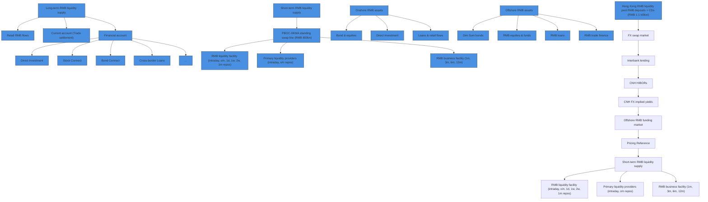

You are a senior financial newsletter editor with a consulting-style strategy lens. You turn research-report material into a long-form English article that is structured, insightful, and suitable for a serious business audience.

Objective:
- Write an English Markdown article based on the report parsing below.
- Target length: around 2200 words, plus or minus 15%.
- Tone: serious, analytical, strategic, and readable.
- The article should not feel like a summary. It should make an argument.
- You may extend the report's logic into reasonable second-order implications, but do not invent data, company actions, or quotes.
- Do not disclose every detail. Leave several meaningful open questions that make readers want the full report.

McKinsey-style writing principles:
1. Answer first: open with the controlling idea, not background.
2. Governing thought: every section must support the main answer.
3. Mutually exclusive, collectively exhaustive logic: avoid overlapping sections.
4. So what: every section must explain why the point matters.
5. Synthesis over summary: do not list facts; interpret what the pattern means.
6. Action titles: section headings must be complete, insight-bearing sentences. Do not use generic headings such as "Key Takeaways", "Market Background", "Core View", or "Reader Implications".
7. Natural hooks: if you want readers to join the community or read the full report, the hook should emerge from unresolved analytical questions, not from promotional language.

Required Markdown structure:
- `# Title`: make it a direct argument, not a topic label.
- Opening: 4-6 short paragraphs that state the main thesis and why now matters.
- 4-6 `##` sections. Each `##` heading must be an action title: a sentence that tells the reader the insight.
- One section should identify what the report does not fully answer yet.
- One section should translate the report into a decision framework for readers.
- Final section: naturally invite readers to join the community or read the full report using this CTA: Join the community to read the full report and review the original charts.
- End with: `*This article is for learning and discussion only and does not constitute investment advice.*`

Content boundaries:
- Do not mention specific investment bank names such as GS. Use "a global investment bank report" if needed.
- Do not use emoji.
- Do not write like a viral post.
- Do not output your reasoning process.
- Do not generate image Markdown; the system will insert original MinerU images afterward.

Report parsing:
"""
ASIA ECONOMICS ANALYST

# RMB Internationalization Revisited: Beyond Trade Settlement

# China in the Long Run

Explore >

text_image

Red background with financial chart elements including pie chart and bar graph, overlaid with yen symbols

# Xinquan Chen

+852-2978-2418

xinquan.chen@gs.com

GS (Asia) L.L.C.

RMB international use has improved but still trails China's global footprint, implying solid potential to grow in the future. RMB invoicing in goods imports among sample countries has roughly doubled since 2020 but remained only around $1.5\%$ in 2023; the RMB's share in global payments was around $3 - 4\%$ over the past two years; and the RMB accounted for around $2\%$ of global official reserves and $0.9\%$ of international debt securities by currency of denomination in 2025. The clearest progress is in China-linked trade settlement: RMB settlement in China's goods trade rose from $13\%$ in 2019 to $30\%$ in 2025. With policymakers placing more emphasis on RMB internationalization, we provide a progress check and discuss what it would take for RMB to move beyond China-linked trade settlement.   
Cross-border RMB use is becoming more investment-driven. Total cross-border RMB transactions rose sharply from RMB9tn in 2017 to RMB64tn in 2024, and capital- and financial-account transactions now account for around $75\%$ of the total. Bond investment is the largest single use case, accounting for $46\%$ of cross-border RMB payments in 2024, compared with $19\%$ for goods trade and $13\%$ for direct investment. This shift means the next phase will require more than settlement channels: foreign participants need RMB liquidity that is easier to fund, tools that are easier to hedge with, and RMB assets that are more attractive to hold.   
The next phase is likely to be offshore-led and Hong Kong-centered. Rather than relying first on broad capital-account liberalization, RMB internationalization is likely to proceed through gradual onshore opening and deeper offshore RMB markets. Offshore RMB liquidity has become cheaper and more stable, helped by RMB appreciation, policy support and official infrastructure such as PBOC swap lines and offshore clearing banks. Continued RMB appreciation should help keep onshore-offshore funding gaps narrow and stable.   
Risk-management tools and RMB asset supply remain key bottlenecks. FX hedging is relatively more developed: the RMB's share of global OTC FX derivatives turnover rose from $1.0\%$ in 2010 to $8.1\%$ in 2025. Rates hedging is

less complete: RMB's share of global OTC interest-rate derivatives turnover was only $0.8\%$ in 2025. IRS liquidity is concentrated in the front end and 5y. Offshore investors only have limited access to CGB futures. These factors constrain offshore investors' capacity to hedge longer-dated duration risks.

On the asset side, broader RMB asset use would require wider onshore market access, such as Connect programs covering onshore REITs and commodity products, and deeper offshore RMB markets, including a more liquid offshore RMB bond yield curve, a larger dim sum bond market, and a potential Hong Kong commodity ecosystem with more RMB-denominated products.

# RMB Internationalization Revisited: Beyond Trade Settlement

Recent developments have brought RMB internationalization back into focus. Policy communication has become more supportive, with the 15th Five-Year Plan calling for further RMB internationalization, deeper capital account opening, and a more resilient and self-reliant RMB cross-border payment system. Average daily RMB transaction value through the Cross-Border Interbank Payment System (CIPS) reached a record high In March (Exhibit 1). Against this backdrop, discussions around the “petroyuan” have resurfaced amid the Middle East conflict. Meanwhile, market conditions have turned more favorable for RMB assets: the RMB has appreciated around 3% year-to-date, more than offsetting the roughly 2.5% annualized cost of holding RMB assets implied by US-China interest rate differentials. Separately, dim sum bond (offshore RMB-denominated bonds) issuance has rebounded strongly this year (Exhibit 2).

Exhibit 1: Average daily RMB transaction volume of CIPS spiked in March   

line

Average daily RMB transaction volume of CIPS
| Year | Transaction Volume (RMB bn) |
|---|---|
| 19 | 130 |
| 20 | 150 |
| 21 | 280 |
| 22 | 380 |
| 23 | 420 |
| 24 | 580 |
| 25 | 750 |
| 26 | 950 |

Source: CIPS, Data compiled by GS Global Investment Research

Exhibit 2: Dim sum bond issuance nearly doubled from a year ago in Jan-Apr 2026   

line

Dim Sum Gross Issuance (cumulative)
| Month | 2025 (RMB bn) | 2026 (RMB bn) |
|---|---|---|
| Jan | 30 | 60 |
| Feb | 40 | 80 |
| Mar | 70 | 120 |
| Apr | 110 | 190 |
| May | 140 | - |
| Jun | 180 | - |
| Jul | 250 | - |
| Aug | 300 | - |
| Sep | 350 | - |
| Oct | 400 | - |
| Nov | 450 | - |
| Dec | 460 | - |

Source: Bloomberg, GS Global Investment Research

In this context, clients have increasingly asked what these developments mean for RMB internationalization and what could drive the next phase. In this Asia Economics Analyst, we assess the progress in RMB internationalization across the three functions of an international currency – unit of account, medium of exchange and store of value – and argue that the progress remains uneven and largely concentrated in China-linked trade settlement. We discuss the market foundations needed for broader foreign participation: more stable offshore RMB liquidity, better RMB risk management tools and a broader RMB asset pool.

# Where RMB internationalization stands?

To assess where RMB internationalization stands, we look at both the RMB's role across the three functions of an international currency and the composition of cross-border RMB transactions.

# 1. Uneven progress led by China-related settlement

We start with the standard framework for an international currency: unit of account, medium of exchange and store of value (see our previous notes on the progress of RMB internationalization in 2023 and 2025). In practice, this means looking at the extent to which the RMB is used in invoicing and pricing, settlement and payments, and reserve or asset holdings. We measure these roles using the RMB's share in trade invoicing,

international payments, official reserve assets and international debt market.

RMB international use has improved across functions but still has significant room to grow, especially compared to China's global share of GDP and trade (Exhibit 3). On unit of account, invoicing data are limited, but Boz et. al. (2025) suggest that the average RMB invoicing share in goods imports among sample countries remained only around $1.5\%$ in 2023. On medium of exchange, the RMB's share in global payments has risen, but has remained at around $3 - 4\%$ over the past two years. Both remain low compared with China's $19\%$ share of global GDP in 2024 and $12\%$ share of global trade in 2025. On store of value, the RMB accounted for around $2\%$ of global official reserves and $0.9\%$ of international debt by currency of denomination in 2025. Taken together, these indicators point to continued progress, but also significant room for further RMB internationalization.

Zooming in on the relatively more advanced medium-of-exchange and unit-of-account roles, progress is still mostly China-linked RMB transactions (Exhibit 4). The share of RMB settlement in China's goods trade has risen from $13\%$ in 2019 to $30\%$ in 2025, while the share of RMB invoicing in goods trade with China remains below $10\%$ . Both are much higher than the RMB's shares in global trade invoicing and international payments. Further progress would require continued growth in RMB invoicing and settlement in China-linked trade, as well as broader RMB use in third-party invoicing and settlement.

Exhibit 3: RMB international use has improved, but still trails China's global GDP and trade shares   

line

| Year | Share in GDP (%) | Share in global trade (%) | Share in international asset/liability (%) | Share of RMB in international payment (%) | Share of RMB in reserve assets (%) | Share of RMB-denominated debt in international debt (%) |
|---|---|---|---|---|---|---|
| 80 | 1.5 | 1.0 | 0.5 | 0.0 | 0.0 | 0.0 |
| 82 | 1.8 | 1.2 | 0.6 | 0.0 | 0.0 | 0.0 |
| 84 | 2.2 | 1.5 | 0.7 | 0.0 | 0.0 | 0.0 |
| 86 | 2.5 | 1.8 | 0.8 | 0.0 | 0.0 | 0.0 |
| 88 | 2.8 | 2.0 | 0.9 | 0.0 | 0.0 | 0.0 |
| 90 | 3.2 | 2.3 | 1.0 | 0.0 | 0.0 | 0.0 |
| 92 | 3.8 | 2.6 | 1.2 | 0.0 | 0.0 | 0.0 |
| 94 | 4.5 | 3.0 | 1.5 | 0.0 | 0.0 | 0.0 |
| 96 | 5.2 | 3.5 | 1.8 | 0.0 | 0.0 | 0.0 |
| 98 | 6.0 | 4.2 | 2.2 | 0.0 | 0.0 | 0.0 |
| 00 | 7.0 | 5.5 | 2.5 | 0.5 | 0.5 | 0.5 |
| 02 | 8.5 | 7.5 | 3.5 | 1.5 | 1.5 | 1.5 |
| 04 | 9.5 | 9.5 | 4.5 | 2.5 | 2.5 | 2.5 |
| 06 | 11.5 | 11.5 | 5.5 | 3.5 | 3.5 | 3.5 |
| 08 | 13.5 | 13.5 | 6.5 | 4.5 | 4.5 | 4.5 |
| 10 | 15.5 | 15.5 | 7.5 | 5.5 | 5.5 | 5.5 |
| 12 | - | - | - | - | - | - |
| 14 | - | - | - | - | - | - |
| 16 | - | - | - | - | - | - |
| 18 | - | - | - | - | - | - |
| 20 | - | - | - | - | - | - |
| 22 | - | - | - | - | - | - |
| 24 | - | - | - | - | - | - |
The chart displays a line graph with markers for each metric: 'Share in GDP (%)' (dark blue), 'Share in global trade (%)' (light blue), 'Share in international asset/liability (%)' (gray), 'Share of RMB in international payment (%)' (red), 'Share of RMB in reserve assets (%)' (green), and 'Share of RMB-denominated debt in international debt (%)' (light green). The data is presented as a table above by Statistic and English labels.

Source: BIS, Lane & Milesi-Ferretti (2018), Haver Analytics, Wind, GS Global Investment Research

Exhibit 4: RMB settlement leads invoicing, especially in China-related trade   

bar

Share of RMB in...
| Category | Percent (%) |
|---|---|
| Global import invoicing | 1.5 |
| China's export invoicing | 6.5 |
| International payment | 3.0 |
| Settlement of China's goods trade | 30.0 |

RMB invoicing shares are as of 2023; RMB settlement/payment shares are as of 2025.   
Source: Boz et. al. (2025), Wind, GS Global Investment Research

# 2. Financial flows dominate cross-border RMB transactions

We next look at China's cross-border RMB transactions. After falling in 2015-2017 amid RMB depreciation pressure after the 2015 FX reform and tighter management of cross-border flows, total cross-border RMB transactions rose sharply from 2017 onward, reaching RMB 64 trillion in 2024, up from RMB 9 trillion in 2017 (Exhibit 5). The composition has also shifted meaningfully. The current-account share fell sharply after 2015 and has stayed around $25\%$ in recent years, while capital and financial account transactions now account for the other $75\%$ of China's cross-border RMB transactions.

Bond investment is now the largest use case for cross-border RMB transactions, including Bond Connect and direct access to China Interbank Bond Market (CIBM Direct). In 2024, it accounted for $46\%$ of cross-border RMB transactions, compared with

19% for goods trade and 13% for direct investment (Exhibit 6). The Qualified Foreign Investor (QFI) program accounted for another 7%, while Stock Connect accounted for 4%. This breakdown suggests that RMB cross-border use has become increasingly driven by investment flows. Therefore, the next phase of RMB internationalization will require more than trade settlement channels: foreign participants will also need more stable offshore liquidity, better risk management tools and a deeper RMB asset pool.

Exhibit 5: Financial flows have become the main driver of cross-border RMB transactions   

bar_stacked

Cross-border RMB transaction volume
| Year | Current account (RMB tn) | Capital and financial account (RMB tn) |
|---|---|---|
| 15 | 7 | 4 |
| 16 | 5 | 4 |
| 17 | 4 | 3 |
| 18 | 5 | 10 |
| 19 | 6 | 13 |
| 20 | 7 | 22 |
| 21 | 8 | 29 |
| 22 | 10 | 34 |
| 23 | 14 | 40 |
| 24 | 16 | 48 |
| 25H1 | 8 | 34 |

Source: PBOC, Wind, GS Global Investment Research

Exhibit 6: Bond investment accounted for nearly half of cross-border RMB transactions in 2024   

pie

Cross-border RMB transactions by usage (2024)
| Category | Transaction Type (%) |
|---|---|
| FA: Bond Investment | 46 |
| CA: Goods trade | 19 |
| FA: Inward direct investment | 8 |
| FA: Qualified Foreign Investor | 7 |
| FA: Others | 5 |
| FA: Outward direct investment | 5 |
| FA: Stock Connect | 4 |
| CA: Others | 3 |
| CA: Services trade | 3 |

Source: Wind, GS Global Investment Research

# What would it take for the RMB to move beyond China-linked trade settlement?

The next phase of RMB internationalization is likely to rely on gradual onshore opening and deeper offshore RMB markets. Hong Kong can function as a policy sandbox, where broader capital-account opening remains gradual and controlled, while offshore RMB funding, trading, and hedging channels continue to expand.

Exhibit 7 shows how offshore RMB liquidity circulates through Hong Kong. The left block captures medium-to-long term RMB supply from retail flows, trade, investment, and cross-border lending. The top block captures official backstop, including HKMA RMB liquidity facilities, which are ultimately supported by the PBOC-HKMA standing swap line. These channels feed into Hong Kong's RMB liquidity pool, mainly deposits and certificates of deposits, which are then deployed into offshore RMB lending, dim sum bonds, RMB derivatives and onshore assets through various connect programs.

Exhibit 7: A framework for offshore RMB liquidity in Hong Kong   

flowchart

Source: HKMA, GS Global Investment Research

The framework highlights a key point: offshore RMB market development is not only about accumulating RMB deposits or settling China-linked trade. It requires an ecosystem in which RMB can be funded, invested, hedged and redeployed. To move beyond China-linked trade settlement, the RMB therefore needs to become easier to fund, more convenient to hedge and more attractive to hold. We focus on three market foundations: offshore RMB liquidity, risk management tools and a broader RMB asset pool.

# 1. More stable offshore RMB liquidity

Offshore RMB liquidity has become cheaper and more stable, partly helped by recent RMB appreciation against the Dollar. Funding cost matters because it determines how easily RMB can be used for investment, lending and bond issuance offshore. In the past, investors had to factor in volatile onshore-offshore funding gaps when trading offshore RMB assets. Short-term offshore RMB funding rates in Hong Kong could be around 2pp higher than onshore RMB funding rates in 2023-24, nearly doubling the costs when onshore funding rates were around $2\%$ . The funding gaps are closely linked to RMB exchange rates. When RMB depreciation pressure rises, CNH often weakens faster than CNY against the USD, causing CNH to trade at a discount to CNY and pushing offshore RMB liquidity back onshore. In addition, PBOC FX management may also tighten offshore RMB liquidity by raising front-end CNH funding costs to discourage CNH shorts. Together, these forces pushed up CNH funding levels and volatility in 2022-24. More recently, these frictions have eased: the spread between 3-month CNH HIBOR and

3-month SHIBOR has narrowed to around 15-25bp since April 2026, compared with 100-200bp and much higher volatility previously (E

[中间内容因长度限制已省略]

e have long or short positions in, act as principal in, and buy or sell, the securities or derivatives, if any, referred to in this research, unless otherwise prohibited by regulation or GS policy.

The views attributed to third party presenters at GS arranged conferences, including individuals from other parts of GS, do not necessarily reflect those of Global Investment Research and are not an official view of GS.

Any third party referenced herein, including any salespeople, traders and other professionals or members of their household, may have positions in the products mentioned that are inconsistent with the views expressed by analysts named in this report.

This research is focused on investment themes across markets, industries and sectors. It does not attempt to distinguish between the prospects or performance of, or provide analysis of, individual companies within any industry or sector we describe.

Any trading recommendation in this research relating to an equity or credit security or securities within an industry or sector is reflective of the investment theme being discussed and is not a recommendation of any such security in isolation.

This research is not an offer to sell or the solicitation of an offer to buy any security in any jurisdiction where such an offer or solicitation would be illegal. It does not constitute a personal recommendation or take into account the particular investment objectives, financial situations, or needs of individual clients. Clients should consider whether any advice or recommendation in this research is suitable for their particular circumstances and, if appropriate, seek professional advice, including tax advice. The price and value of investments referred to in this research and the income from them may fluctuate. Past performance is not a guide to future performance, future returns are not guaranteed, and a loss of original capital may occur. Fluctuations in exchange rates could have adverse effects on the value or price of, or income derived from, certain investments.

Certain transactions, including those involving futures, options, and other derivatives, give rise to substantial risk and are not suitable for all investors. Investors should review current options and futures disclosure documents which are available from GS sales representatives or at https://www.theocc.com/about/publications/character-risks.jsp and https://www.goldmansachs.com/disclosures/cftc\_fcm\_disclosures. Transaction costs may be significant in option strategies calling for multiple purchase and sales of options such as spreads. Supporting documentation will be supplied upon request.

Differing Levels of Service provided by Global Investment Research: The level and types of services provided to you by GS Global Investment Research may vary as compared to that provided to internal and other external clients of GS, depending on various factors including your individual preferences as to the frequency and manner of receiving communication, your risk profile and investment focus and perspective (e.g.,

marketwide, sector specific, long term, short term), the size and scope of your overall client relationship with GS, and legal and regulatory constraints. As an example, certain clients may request to receive notifications when research on specific securities is published, and certain clients may request that specific data underlying analysts' fundamental analysis available on our internal client websites be delivered to them electronically through data feeds or otherwise. No change to an analyst's fundamental research views (e.g., ratings, price targets, or material changes to earnings estimates for equity securities), will be communicated to any client prior to inclusion of such information in a research report broadly disseminated through electronic publication to our internal client websites or through other means, as necessary, to all clients who are entitled to receive such reports.

All research reports are disseminated and available to all clients simultaneously through electronic publication to our internal client websites. Not all research content is redistributed to our clients or available to third-party aggregators, nor is GS responsible for the redistribution of our research by third party aggregators. For research, models or other data related to one or more securities, markets or asset classes (including related services) that may be available to you, please contact your GS representative or go to https://research.gs.com.

Disclosure information is also available at https://www.gs.com/research/hedge.html or from Research Compliance, 200 West Street, New York, NY 10282.

# © 2026 GS.

You are permitted to store, display, analyze, modify, reformat, and print the information made available to you via this service only for your own use. You may not resell or reverse engineer this information to calculate or develop any index for disclosure and/or marketing or create any other derivative works or commercial product(s), data or offering(s) without the express written consent of GS. You are not permitted to publish, transmit, or otherwise reproduce this information, in whole or in part, in any format to any third party without the express written consent of GS. This foregoing restriction includes, without limitation, using, extracting, downloading or retrieving this information, in whole or in part, to train or finetune a machine learning or artificial intelligence system, or to provide or reproduce this information, in whole or in part, as a prompt or input to any such system.
"""
