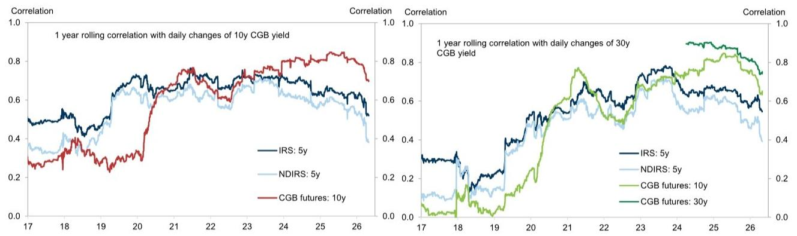
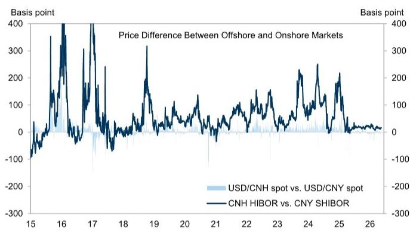

# 人民币国际化真正的瓶颈不在贸易结算，而在资产端的深度

人民币国际化的话题每隔几年就会重新升温。这一次的催化剂看起来颇为密集：政策表述进一步明确，CIPS日均交易量在3月创下历史新高，“石油人民币”的讨论在地缘冲突背景下重新浮现，离岸人民币债券发行在2026年前四个月几乎翻倍。人民币对美元年内已升值约3%，足以覆盖中美利差所隐含的持有成本。

但这些信号叠加在一起，是否意味着人民币国际化已经进入一个新阶段？某外资投行最新发布的研报给出了一个值得认真对待的判断：进步确实存在，但高度不均衡，而且几乎全部集中在与中国相关的贸易结算领域。真正决定下一阶段走向的，不是结算通道还能扩多大，而是境外参与者能否方便地获得人民币流动性、有效地对冲风险、以及找到足够多有吸引力的资产。

这个判断的底层逻辑是清晰的。人民币跨境交易的结构已经发生了根本性变化——资本和金融账户交易占比已达75%，债券投资是最大的单一用途，占比46%。这意味着，推动人民币国际化的主要动力已经从贸易结算转向了投资驱动。而投资驱动的逻辑与贸易结算完全不同：它要求的是一个能够自我循环的生态系统，而不是一条单向的结算管道。

以下是我们从这份研报中提炼出的几个关键层次。

## 1. 人民币的跨境使用已经跨越了“贸易结算”阶段，但资产端的配套远远落后于交易量的增长

从总量看，人民币跨境交易从2017年的9万亿元跃升至2024年的64万亿元，这个数字本身是惊人的。但更值得关注的是结构：货物贸易在跨境人民币交易中的占比已降至19%，而债券投资占比高达46%，直接投资的13%和合格境外投资者(QFI)的7%紧随其后。

这一结构变化意味着，境外参与者持有和使用人民币的原因正在发生根本性转变。过去，企业用人民币结算是为了降低汇率风险和交易成本，这是一种“被动选择”。现在，投资者用人民币购买债券、股票和进行直接投资，是一种“主动配置”。主动配置的前提是：人民币资产必须具有足够的吸引力——收益、流动性、可对冲性缺一不可。

但问题恰恰出在这里。人民币在全球官方储备中的占比约为2%，在国际债务证券中的占比仅为0.9%。这两个数字与中国的GDP占比(19%)和贸易占比(12%)之间存在巨大落差。资产端的深度不足，正在成为制约人民币国际化的核心瓶颈。

## 2. 离岸人民币流动性已经变得更便宜、更稳定，但这一改善高度依赖汇率环境

境外参与者使用人民币的第一个前提是：能够以合理的成本获得人民币资金。过去几年，离岸人民币融资成本一直存在两个问题：一是绝对水平偏高，二是波动性大。2023至2024年，香港离岸人民币短期融资利率比在岸高出约200个基点，这意味着当在岸融资成本在2%左右时，离岸的实际成本接近翻倍。

这种融资成本的扭曲与人民币汇率高度相关。当人民币贬值压力上升时，离岸人民币(CNH)往往比在岸人民币(CNY)贬值更快，导致CNH相对CNY出现折价，离岸人民币流动性因此回流在岸。同时，央行为了抑制离岸做空行为，也会主动收紧离岸流动性。这些因素共同推高了离岸融资成本和波动率。

但最近情况明显改善。2026年4月以来，3个月CNH HIBOR与3个月SHIBOR的利差已收窄至15至25个基点，远低于此前的100至200个基点。报告认为，这一改善得益于人民币升值、政策支持以及央行货币互换等官方基础设施的完善。

这里的关键含义是：离岸流动性的稳定性目前仍高度依赖于人民币的升值趋势。如果汇率环境逆转，融资条件的改善能否持续，仍是一个需要验证的问题。报告对此没有给出明确结论，但提出了一个值得关注的观察框架：当离岸融资成本与在岸趋于一致时，境外参与者的行为模式会发生什么变化。

## 3. 风险对冲工具的不完整，是限制境外投资者深度参与的结构性短板

如果说流动性是“入场券”，那么风险对冲工具就是“长期居留许可”。没有足够的对冲工具，境外投资者就无法管理利率和汇率风险，也就无法大规模、长期持有人民币资产。

报告在这方面的分析提供了一个清晰的对比。人民币在全球场外外汇衍生品交易中的占比已从2010年的1.0%上升至2025年的8.1%，外汇对冲工具的发展相对充分。但利率对冲工具的发展明显滞后：人民币在全球场外利率衍生品交易中的占比仅为0.8%，利率互换(IRS)的流动性集中在前端和5年期，境外投资者参与中国国债期货的渠道仍然有限。

这意味着，持有中长期人民币债券的境外投资者，很难找到有效的工具来对冲久期风险。对于一个以债券投资为主要驱动力的国际化进程来说，这是一个结构性的制约。报告没有进一步量化这一制约对境外投资者行为的具体影响，但逻辑上可以推断：如果对冲成本过高或工具不足，境外投资者的持有期限会偏短，配置规模会受到限制。

## 4. 下一阶段的突破口可能不在资本账户全面开放，而在离岸市场的深度建设

报告提出了一个值得注意的判断：下一阶段的人民币国际化很可能是“离岸主导、香港中心”的模式，而不是依赖于全面的资本账户开放。这意味着，政策路径的选择将更加务实——在保持对在岸资本流动可控的前提下，通过深化香港离岸人民币市场来创造“政策沙盒”。

在这一框架下，关键变量有三个：更宽的资产准入、更深的离岸债券收益率曲线、以及更丰富的产品生态。报告具体提到了几个方向：在岸REITs和大宗商品产品的互联互通、更大规模的离岸人民币债券(点心债)市场、以及香港可能发展的大宗商品生态系统。

这些方向指向同一个核心问题：人民币资产池的“广度”和“深度”能否支撑起一个自我强化的离岸循环。目前，香港的人民币流动性池(存款加存单)约为1.1万亿元，这个规模对于一个需要支撑起全球配置需求的货币来说，仍然偏小。离岸人民币债券收益率曲线虽然有所延长，但流动性分布仍集中在短期。

## 5. 报告没有完全回答的一个关键问题：资产端深度提升的路径依赖是什么

这是整份报告最值得追问的地方。报告指出了瓶颈，也指出了方向，但对于“如何从现状到达目标状态”的路径，留出了大量需要进一步讨论的空间。

具体来说，有几个问题尚未得到充分解答。第一，离岸人民币资产的需求端是否已经足够多元化。目前债券投资是最大的跨境用途，但债券投资者主要是配置型机构，他们的行为模式与交易型投资者不同，对流动性和对冲工具的要求也不同。第二，离岸人民币收益率曲线的完善，需要发行端的持续供给和交易端的流动性做市，这两者之间存在鸡生蛋蛋生鸡的问题。第三，大宗商品人民币定价的推进，除了需要香港的生态系统建设，还需要全球大宗商品贸易商的配合，这涉及更复杂的利益格局。

这些问题不是报告的缺陷，而是报告的价值所在——它清晰地划出了已知与未知的边界。

## 6. 一个可供决策者参考的观察框架

基于报告的框架，我们可以提炼出一个简单的判断矩阵，用于跟踪人民币国际化下一阶段的进展。

第一层看“流动性”：离岸融资成本是否持续保持在合理水平，且与在岸的利差是否稳定。如果利差重新扩大，说明离岸流动性的改善是脆弱的。

第二层看“对冲”：利率衍生品市场的流动性是否在向更长期限延伸，境外投资者参与中国国债期货的渠道是否有实质性开放。这是判断境外投资者能否真正“留下来”的关键指标。

第三层看“资产”：离岸人民币债券收益率曲线是否变得更完整，在岸REITs和大宗商品互联互通是否落地，以及点心债市场是否出现持续扩大的趋势。这是判断人民币资产池深度是否在改善的直接证据。

这三个层次相互独立，但共同支撑同一个判断：人民币国际化能否从“贸易结算主导”走向“投资驱动主导”。

---

这份研报提供的数据和分析，足以支撑一个谨慎乐观的判断——方向是对的，但距离真正的突破还有很长的路。最值得持续跟踪的，不是CIPS的交易量，也不是离岸债券的发行规模，而是那个更根本的问题：境外参与者是否真的愿意、也有能力把人民币资产作为长期配置的一部分。

报告在风险对冲工具和资产端深度这两个关键环节上的分析，提供了清晰的瓶颈识别。但这些瓶颈的突破路径、时间表和前提条件，报告并没有完全展开。这些恰恰是后续讨论中最有价值的部分。

如果你对人民币国际化的资产端瓶颈、离岸收益率曲线建设、或者大宗商品人民币定价的推进逻辑有进一步兴趣，欢迎来我们的星球微信群里继续讨论。我们会围绕这份报告未完全展开的几个关键问题，做更深入的拆解和推演。

Personal reading notes and learning share only. Not investment advice.

