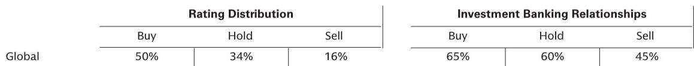

# 市场真正低估的不是需求，而是供给侧的再定价

过去几周，30年期美债收益率突破5%，全球利率波动重新成为市场焦点。但如果你只把注意力放在利率上，可能错过了这份研报中最值得关注的信号：市场正在经历一次供给侧的结构性再定价，而这轮再定价的驱动力，远比需求端的波动更持久、更深刻。

某外资投行本周发布的跨资产研究汇总，表面上是每周例行的工作梳理，但仔细拆解后会发现，它揭示了一个正在加速形成的核心判断——**全球资产定价的锚点正在从需求侧转向供给侧，而这将重塑从AI投资到能源资本开支、从利率传导到行业竞争格局的几乎所有关键变量。**

这不是一个短期交易机会，而是一个可能持续数年的结构性变化。以下是我们从这份研报中提炼出的五个关键洞察，以及它们对投资决策的含义。

## 1. 利率波动暴露了旧框架的失效，防御股不再防御是第一个信号

研报明确指出，股票与债券收益率的相关性已经转为负值——当美债收益率上升时，股市反而创出新高。这在历史上并不常见。更值得警惕的是，传统的防御性板块已经不再具备防御属性。

这意味着什么？过去几十年形成的“利率上升买防御、利率下降买成长”的简单框架正在失效。彼得·奥本海默在报告中提到，他多年来第一次看到成长板块中出现了价值洼地，而价值板块中也出现了成长机会。这是一个对选股者极为有趣、但也极为复杂的背景。

这里的核心含义是：**利率本身不再是单一的风险因子，它正在通过供给侧渠道（而非传统的需求渠道）重新传导到资产价格中。** 如果你还在用旧框架判断利率对组合的影响，可能已经落后于市场。

## 2. AI投资的真正瓶颈不是技术，而是欧洲的电网和数据中心供给

研报透露了一个重要信号：本周举行的欧洲公用事业和清洁能源会议、以及EMEA基础设施会议上，数据中心和AI投资成为绝对焦点。关键瓶颈不是芯片算力，而是电力和电网。

欧洲需要大量投资数据中心以确保供应安全，而电网基础设施的不足正在成为最大的制约因素。研报特别点名了受益标的：Enel、Naturgy（均在Conviction List上）、以及Siemens Energy。同时，英飞凌作为AI受益者也被提及。

这背后是一个更大的判断：**AI投资的下一个阶段，将从“算力竞赛”转向“能源基础设施竞赛”。** 欧洲的数据中心投资才刚刚开始，而电力基础设施的资本开支周期可能持续数年。这一判断对公用事业、工业设备和能源相关标的具有直接的定价含义。

但报告同时也抛出了一个尚未解答的关键问题：AI的使用方式是否可持续？詹姆斯·科维罗上月的研究指出，目前大多数企业通过AI实现亏损，这种模式的可持续性存疑。这里存在一个核心分歧——token增长的速度是否意味着AI使用的“无差别扩张”，还是市场最终会走向更自律、更有效率的使用方式？这个问题的答案，将决定AI投资周期的长度和深度。

## 3. 石油资本开支周期已经触底，地震勘探是第一个先行指标

研报提供了一组极具说服力的数据：欧洲和美国石油公司在财报电话会议中提及“地震勘探、勘探、发现、区块”的次数已经开始急剧增加。而地震勘探通常是资本开支周期中最早出现的环节。

更关键的是供给侧的结构性变化：活跃的地震勘探船数量从2013年的约60艘下降到目前的17-30艘，自2017年以来没有新造船，且船队正在老化。与此同时，行业经历了大规模整合（TGS收购PGS）。研报认为，这正在创造一个定价上行周期。

米歇尔·德拉·维格纳对TGS给出了买入评级，认为它正处于一个重大勘探上行周期的起点。**这里的关键洞察是：石油资本开支的复苏不是需求驱动的，而是供给侧的长期投资不足和行业整合共同推动的。** 这意味着即使需求增长放缓，资本开支也可能保持韧性——因为补课的需求是刚性的。

## 4. 行业集中度正在推高利润率，但AI可能同时加剧和削弱这一趋势

研报中引用了一份美国经济学研究，其结论值得深思：自2000年以来，行业集中度的上升解释了约三分之一的企业利润率增长。但AI的出现可能同时产生两种相反的效果——一方面，它可能通过侵蚀现有巨头的优势来加剧竞争；另一方面，它也可能让最成功的AI采用者远远领先，从而减少竞争。

这一双重性意味着：**我们正处在一个竞争格局的“分水岭时刻”。** 对于投资者而言，单纯看行业集中度可能已经不够，需要进一步拆解哪些企业的AI采用效率真正能转化为持续的竞争优势，哪些只是被动的跟随者。

研报还提供了一个有趣的观察：共同基金正在从软件转向半导体，六大最受欢迎的共同基金增持标的都来自GS AI数据中心篮子。这反映了市场对AI硬件投资的偏好正在强化，但同时也暗示了潜在的拥挤风险。

## 5. 企业债市场的韧性来自供给侧，但利率传导路径已经改变

阿曼达·莱纳姆的两份信用研究报告提供了另一个供给侧视角：企业债信用利差的极度紧缩，直接源于养老金和保险公司这些“收益率导向型买家”的深度需求。截至2025年四季度，美国保险公司和养老金持有总计6.4万亿美元的企业债投资。

这意味着：**企业债市场的定价已经不再主要由发行人的信用质量驱动，而是由买方的资产配置需求驱动。** 这使得信用利差对利率变化的敏感度降低——只要这些长期买家继续需要收益率，利差就可能保持紧缩。

但这也带来了新的风险：如果利率波动导致这些买家的负债端出现变化（比如久期匹配需求改变），或者监管政策调整影响其资产配置行为，企业债市场可能面临一次供给侧驱动的重新定价。这一点报告没有完全展开，但值得密切关注。

---

以上五个洞察，都指向同一个方向：**市场正在经历一次从需求侧定价到供给侧定价的范式转换。** 利率不再是简单的宏观变量，AI投资的核心瓶颈正在从算力转向能源，石油资本开支周期由供给不足而非需求驱动，企业债的韧性来自买方的结构性需求——所有这些都意味着，我们需要用新的框架来理解资产价格。

但这份研报也留下了一些尚未回答的关键问题：AI使用效率的拐点何时到来？欧洲电网投资能否真正落地？企业债市场的供给侧结构是否可持续？这些问题，正是我们需要继续深入讨论的方向。

欢迎来星球微信群里继续讨论，我们一起拆解这份研报中更多未被充分讨论的图表和数据，以及它们对具体标的的含义。

Personal reading notes and learning share only. Not investment advice.

