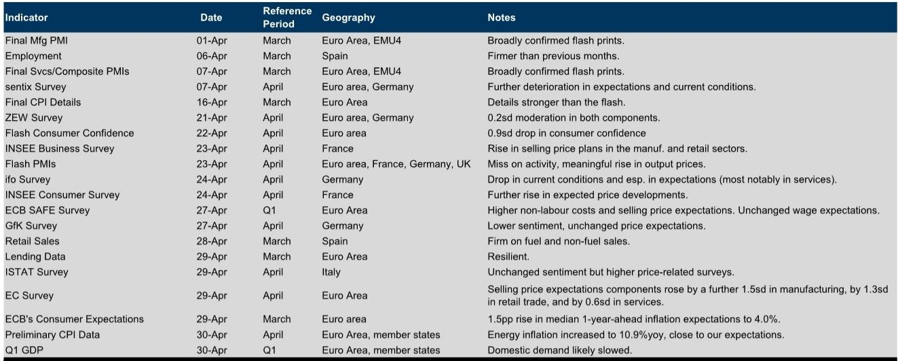
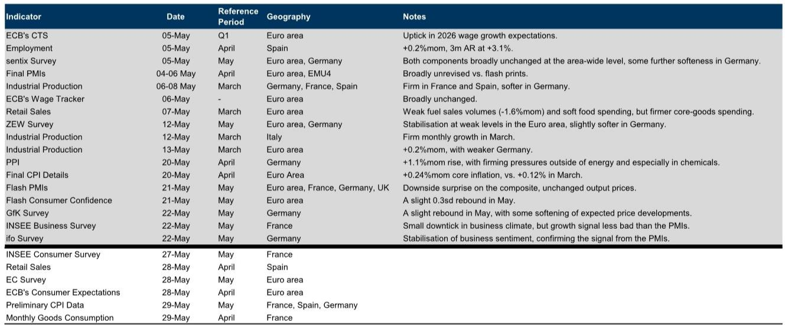
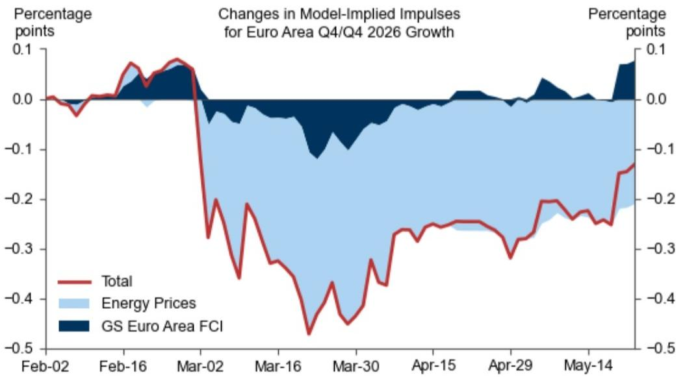

# 市场真正低估的不是地缘风险，而是欧洲通胀的二次定价

过去两个月，中东局势的升级让全球投资者的目光再次聚焦欧洲。然而，市场上大多数讨论仍停留在“冲突会持续多久”或“能源价格还会涨多少”这类短期博弈层面。一份来自某外资投行的最新研报，通过其高频追踪模型和金融条件指数，提供了一个截然不同的判断框架：

**当前冲击对欧洲经济的真正威胁，并非2022年乌克兰危机式的增长断崖，而是一次更持久、更难消退的供给侧通胀重定价。**

这份报告的核心结论是：欧洲天然气市场的反应比2022年温和得多，但石油和成品油价格的预期路径却显示出更强的粘性。与此同时，消费者信心和企业调查的跌幅仅为2022年的一半左右，但价格预期相关指标却出现了显著攀升。这意味着，欧洲央行面临的“增长 vs 通胀”权衡，正在从“先救增长”转向“被迫接受更高通胀更久”。

以下是我们基于该报告数据与逻辑的深度解读，共五个层次。

## 1. 天然气冲击已大幅缓和，但石油端的溢价正在从“脉冲”变为“平台”

2022年3月，欧洲TTF天然气期货在冲突爆发当天飙升至约230欧元/兆瓦时，远期曲线极度陡峭。而本轮冲突中，TTF现货价格在105欧元附近触顶，远期合约价格在95欧元左右，两者均显著低于2022年峰值。更关键的是，该投行的基线预测显示，TTF将在未来12个月内逐步回落至85欧元附近，与远期曲线基本吻合。

这意味着，市场并不认为本轮冲突会造成类似2022年的天然气供应危机。欧洲的储气设施、LNG进口能力和需求侧管理机制，已经为“中度紧张”情景做好了准备。

但石油端的信号恰恰相反。报告中的Exhibit 2显示，汽油和柴油的现货价格自冲突以来持续攀升，且远期曲线并未像天然气那样快速下行。柴油价格在2026年5月的远期合约甚至高于当前水平，达到2.2欧元/升。这反映出一个结构性变化：**全球炼油产能瓶颈叠加欧洲对俄罗斯成品油禁运的长期影响，正在让石油端的溢价从“地缘脉冲”转变为“成本平台”。**

对投资者的含义：天然气相关的欧洲公用事业和工业板块，可能已经消化了大部分风险；但化工、航空、物流等石油下游行业，其成本压力可能比市场预期的更持久。

## 2. 消费者信心并未崩溃，但“价格预期”才是真正的先行指标

2022年3月，欧洲消费者信心指数暴跌至-3个标准差以下。而本轮冲突中，该指数从-2.5左右回升至-2.2，跌幅仅为2022年的一半。Morning Consult的高频数据也显示，消费者信心在5月已经企稳。

乍看之下，这是一个乐观信号：欧洲家庭似乎对地缘冲击更具韧性。但报告同时揭示了一个更令人担忧的现象：**欧洲委员会的调查显示，制造业和零售业的“销售价格预期”分别飙升了1.5和1.3个标准差，服务业也上升了0.6个标准差。**

这正是“滞胀”的经典前兆：消费者信心没有崩，是因为就业市场依然健康，但企业已经开始将成本转嫁给终端价格。如果这一趋势持续，通胀预期将自我实现，迫使欧洲央行在增长放缓的环境下仍维持紧缩立场。

所以呢：对于欧洲消费类股票，投资者不能只看“信心指数”的修复，更需要关注企业定价能力的持续性。那些能够成功转嫁成本的公司，可能反而受益于通胀环境；而那些依赖价格战获取份额的公司，将面临利润率和需求的双重挤压。

## 3. 金融条件收紧幅度不大，但“能源-金融”的负反馈循环尚未被定价

该投行的欧元区金融条件指数（GS FCI）显示，自冲突以来，金融条件仅收紧约15个基点，远低于2022年3月约40个基点的收紧幅度。报告还指出，近期金融条件已出现小幅宽松，部分缓解了增长压力。

然而，这里有一个尚未被充分讨论的风险：**能源价格对金融条件的二阶传导。** 2022年的经验表明，能源冲击首先推高通胀，然后通过央行加息预期传导至利率和信贷条件，最终压制经济活动。当前，虽然FCI整体收紧幅度有限，但能源价格对FCI的贡献已经转负，意味着能源通胀正在主动拖累金融条件。

如果石油价格在未来6个月维持在当前水平，欧洲的FCI可能进一步收紧30-50个基点，而市场目前并未在资产定价中反映这一情景。对于欧洲银行股和利率敏感型资产，这可能是一个尚未计入的尾部风险。

## 4. 报告尚未完全回答的关键问题：增长下调的“二阶效应”到底有多大？

报告显示，该投行已将2026年欧元区GDP增速预测从1.4%下调至0.5%，下调幅度达0.9个百分点。同期，英国增速预测也从1.5%下调至1.3%，下调幅度较小。通胀方面，欧元区2026年底通胀预测从1.5%上调至3.4%，上调幅度达1.9个百分点。

这里存在一个明显的“不对称”：增长预测的下调幅度已经很大，但通胀预测的上调幅度更大。这意味着，该投行的模型假设是“供给冲击主导”，即能源成本上升直接推高通胀，而需求侧的回调相对温和。

但报告并没有完全展开以下问题：如果通胀持续高于预期，欧洲央行被迫在2026年继续加息，那么增长的下行风险将远大于模型中的基准情景。换句话说，**当前预测中“滞”的部分可能被低估了，因为模型尚未充分纳入“胀”对“滞”的反馈循环。**

这正是我们加入社群后需要持续跟踪的核心变量：欧洲央行5月会议后的政策路径、工资谈判数据，以及企业定价行为的持续性。

## 5. 给产业决策者的观察框架：三个关键数据节点

基于报告的逻辑和数据，我们认为以下三个指标将在未来3-6个月决定欧洲经济的真实走向：

**第一，欧洲央行消费者预期调查中的“1年期通胀预期”。** 报告显示，3月份该指标已升至4.0%，较前值上升1.5个百分点。如果5月数据继续攀升至4.5%以上，将触发欧洲央行更激进的加息路径，直接冲击债券和股票估值。

**第二，德国IFO调查中的“价格预期”分项。** 报告指出，IFO调查显示德国服务业的价格预期显著上升。作为欧洲经济引擎，德国企业的定价行为具有强烈的信号意义。如果IFO价格预期在5-6月继续走高，意味着“成本转嫁”正在从能源密集型行业向更广泛的经济部门扩散。

**第三，欧洲成品油远期曲线与天然气远期曲线的“价差”。** 当前，天然气远期曲线已趋于平坦，而成品油曲线仍保持陡峭。如果这一价差在未来两个月收窄，可能意味着石油溢价正在消退，欧洲的供给侧压力将整体缓和；如果价差反而扩大，则表明炼油瓶颈正在深化，通胀的持续性将超出预期。

这三个数据节点，将决定我们是否应该将当前情景从“中度滞胀”升级为“深度滞胀”。

---

这份研报的价值，不在于它给出了一个精确的预测数字，而在于它提供了一套“高频-低频”、“金融-实体”交叉验证的分析框架。报告中大量使用了日度消费者信心、周度金融条件指数、月度企业调查等数据，这些数据点本身并不难获取，但如何将它们组合成一个有逻辑的叙事，才是专业投资者与普通观察者之间的分水岭。

例如，报告中的Exhibit 10对比了本轮冲突与2022年乌克兰危机对消费者信心、ZEW预期和EC调查的冲击路径。数据显示，本轮冲击的初始幅度确实小于2022年，但价格相关指标的反弹速度更快。这一差异背后，反映了欧洲经济结构的根本变化：2022年，欧洲面临的是“天然气断供”的物理风险；2026年，欧洲面临的是“全球炼油能力不足”带来的持续成本压力。两种冲击的传导机制不同，对应的政策应对和资产定价逻辑也应完全不同。

我们已经在星球微信群里围绕这些未解问题展开了讨论：欧洲央行的反应函数是否已经改变？哪些行业在“高油价+高利率”组合下仍有定价权？如果成品油溢价持续，欧洲的绿色转型是否会加速？欢迎加入，一起跟踪这些数据的演变。

Personal reading notes and learning share only. Not investment advice.

