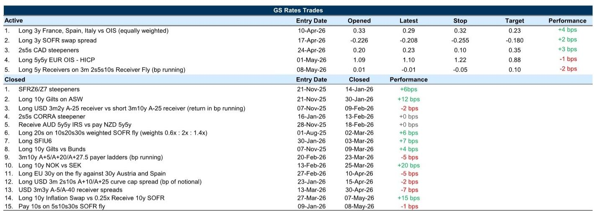
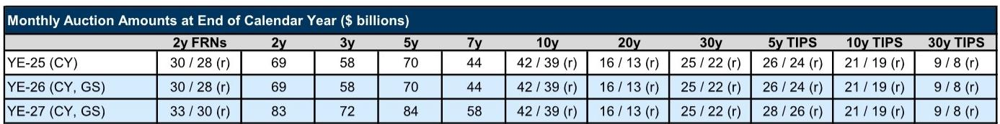
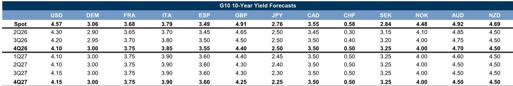

# Long-End Yields Are Stabilizing, But the Fundamental Case for a Sustained Rally Remains Absent Without a Macro Catalyst

The sharp selloff in long-end US Treasury yields that pushed 30-year notes to cycle highs has given way to a period of stabilization. Lower energy prices, supportive headlines from the UK and Japan, and a modest retreat in the most acute phase of the selloff have provided some breathing room. Yet this is a pause, not a pivot. The underlying forces that drove yields higher—persistent inflation risks, supply dynamics, and the lingering effects of an energy shock—remain firmly in place. For rates markets, the question is not whether yields have peaked, but what it would take for a deeper and more durable reversal to materialize.

The answer, as the data and positioning analysis make clear, is not yet visible in valuations. Longer-term US Treasury forwards are only modestly cheap relative to macro-implied fair value. That is not the kind of stretched positioning that historically precedes a significant rally. Without a genuine shift in the macro risk landscape—a sustained decline in energy prices, a dovish surprise in inflation or labor data, or a material challenge to risk assets from elevated yield levels—the path of least resistance for long-end rates remains higher. The stabilization we are seeing is tactical, not structural.

This assessment carries important implications across developed market rates. European duration continues to outperform, supported by front-footed central bank action that has anchored longer-term yields even as front-end rates remain elevated. UK Gilts are showing a growing valuation case for longs, but political risk premium is likely to compress only gradually. In Japan, the moderation in long-end JGB yields is tied to supply-demand dynamics and comments from the central bank, but without inflation moderation or fiscal restraint, only policy rate outcomes can deliver lasting stability. And in Australia, the relief rally following a softer labor market print may prove premature if inflation data next week reignites hawkish repricing.

The pattern across markets is consistent: yields have come off their peaks, but the fundamental architecture that drove them higher has not changed. Investors should treat the current calm as an opportunity to reassess positioning, not as an all-clear signal.

## European Rates Are Outperforming Because Front-Footed Central Bank Action Has Anchored Long-End Yields, and This Dynamic Should Continue

The relative resilience of European rates during the global selloff is not an accident. It reflects a structural advantage that is likely to persist. As the report's spillover framework illustrates, Bunds have been a net receiver of bullish shocks across G4 rates markets, not a source of bearish contagion. This is because the European Central Bank's willingness to act decisively on the front end has insulated longer-duration exposure from the worst of the repricing pressure.

The logic is straightforward. When a central bank signals that it will respond aggressively to inflation risks, the front end of the curve bears the brunt of the adjustment. Longer-term yields, by contrast, are anchored by the expectation that policy will eventually bring inflation under control. This is precisely what we have seen in EUR rates. The market has repriced inflation risk stemming from the energy shock, but the 5-year forward 5-year yield has outperformed its US and UK counterparts. The report recommends maintaining long positions in 5y5y EUR real rates, and the rationale is compelling: as long as the ECB remains front-footed, European duration offers a degree of protection that is absent in markets where central bank credibility is more contested.

The implication for investors is clear. If you are looking for duration exposure in a world where long-end yields remain vulnerable to macro shocks, European rates offer a more favorable risk-reward profile than US Treasuries. The report's analysis suggests that even in a scenario where the Strait of Hormuz closure becomes protracted, European rates would move higher on the front end, leading to curve flattening and inversion, rather than a broad-based selloff across maturities. This is a nuanced but important distinction: the pain would be concentrated where investors can more easily manage it, not in the long end where duration risk is most punishing.

## US Long-End Yields Are Not Cheap Enough to Justify a Rally Without a Macro Catalyst, and the Amplifying Role of Convexity Dynamics Should Diminish From Here

The most important analytical takeaway from the US rates discussion is that valuations are not yet supportive of a sustained rally. The report's exhibit on longer-term US Treasury forwards versus macro-implied fair value shows that yields are only modestly above the model's estimate. They are within one standard deviation of fair value. Historically, meaningful reversals in long-end yields have required either a significant macro surprise or a period of valuation stretch that creates its own gravitational pull. Neither condition is present today.

This does not mean yields cannot move lower from here. A genuine de-escalation in the energy conflict, a softer inflation print, or a deterioration in labor market conditions could all provide the necessary catalyst. But the report is careful to note that these are not the base case. The baseline expectation for lower yields over time rests on a combination of energy flow resumption and dovish macro data—both of which remain uncertain.

The discussion of convexity dynamics adds an important tactical dimension. The selloff that pushed 10-year and 30-year yields above 4.5% and 5.0% respectively raised questions about whether negative convexity and mortgage hedging amplified the move. The report's analysis suggests that while these dynamics may have played a role, they were not the primary driver. Implied volatility responded mildly relative to the magnitude of the yield shift, and the hedging behavior of GSEs remains opaque given their apparent tolerance for larger duration gaps. More importantly, the potential magnitude of any hedging-driven amplification should diminish from here. Further selloffs would bring less extension risk, while rallies would help undo any accumulated duration gap. This is a constructive observation for those worried about a self-reinforcing selloff.

## The Report Does Not Fully Answer How Quickly the Structural Shift in the US Treasury Market's Sensitivity to Supply Could Reassert Itself

One of the most analytically challenging questions raised by the current environment is whether the US Treasury market has undergone a structural change in its sensitivity to supply. The report notes that a backdrop of global pressures, supply shock damage to duration's portfolio value, and a more debt-financed investment cycle can raise the sensitivity of yields to debt supply and skew longer-term yields higher relative to model fair value. This is a critical observation, but it is not fully resolved.

The report's valuation framework suggests that current yields are only modestly above fair value. But if the structural sensitivity to supply has permanently increased, then the model's estimate of fair value may itself be too low. In other words, the market may be pricing in a new equilibrium where term premium is structurally higher, and the modest cheapness we see today could be the new normal rather than a trading opportunity.

The report does not provide a definitive answer to this question, and it would be unreasonable to expect one. The data on supply sensitivity is inherently backward-looking, and the current environment is unprecedented in several dimensions. But for investors trying to position for the next phase of the cycle, this is the most important unresolved question. If supply sensitivity has permanently increased, then long-end yields will remain elevated even if inflation moderates. If it has not, then the current cheapness represents a genuine opportunity to add duration at attractive levels.

This ambiguity is precisely why the report's recommendation to focus on European rates and selective Gilt longs makes sense. These markets offer more identifiable catalysts and less structural uncertainty.

## The Decision Framework for Rates Investors Should Prioritize Central Bank Credibility and Valuation Stretch, Not Yield Levels Alone

The natural temptation in a market that has sold off sharply is to look for entry points based on yield levels alone. This report provides a clear argument for why that approach is insufficient. A more robust decision framework would incorporate three dimensions: central bank credibility, valuation relative to macro fundamentals, and the presence or absence of a near-term catalyst.

On central bank credibility, the report's analysis is unambiguous. Markets where the central bank has demonstrated a willingness to act on the front end—Europe and Australia, for example—offer better risk-reward for duration exposure. Markets where central bank credibility is more contested, or where the policy response is constrained by other objectives, offer less protection.

On valuation, the report's framework is equally clear. Valuation matters, but only at the extremes. US long-end yields are modestly cheap, not stretched. UK 5y5y yields, by contrast, are high relative to the report's valuation framework, which supports the case for long Gilts. European 5y5y real yields offer a favorable combination of valuation and central bank support.

On catalysts, the report identifies three potential paths to lower yields: energy price relief, dovish macro data, and a challenge to risk assets from elevated yield levels. None of these are currently in play. Until they are, the most prudent approach is to be selective about duration exposure and to favor markets where the structural dynamics are supportive.

## Join the Community to Read the Full Report and Review the Original Charts

The analysis summarized here draws on a detailed report that includes proprietary valuation models, spillover frameworks, and positioning data that are essential for a complete understanding of the current rates landscape. The exhibits on US Treasury forwards versus fair value, the spillover decomposition for G4 yields, and the sensitivity of European sovereign spreads to oil prices are particularly valuable for investors trying to calibrate their own views. The full report also includes a more granular discussion of repo market dynamics, Canadian rate positioning, and the Australian inflation outlook that could not be fully covered here. To access the complete analysis and the original charts, join the community and review the report in full.

*This article is for learning and discussion only and does not constitute investment advice.*

Personal reading notes and learning share only. Not investment advice.

