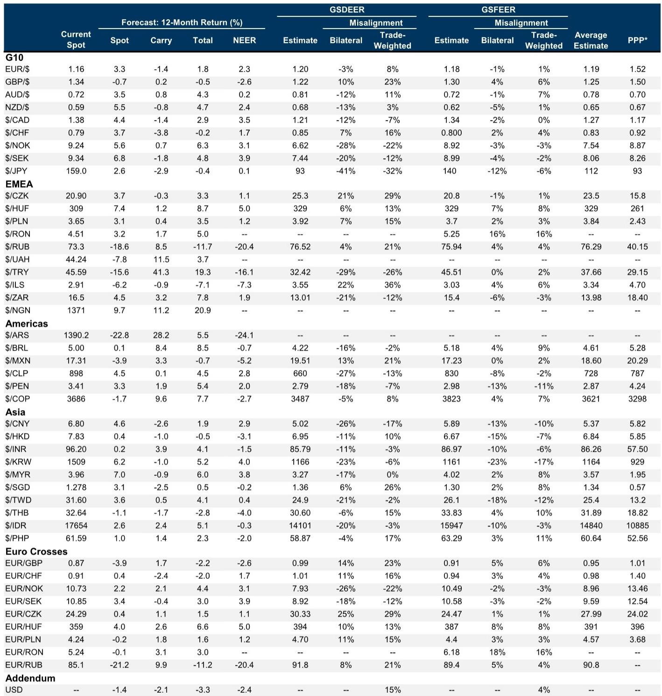
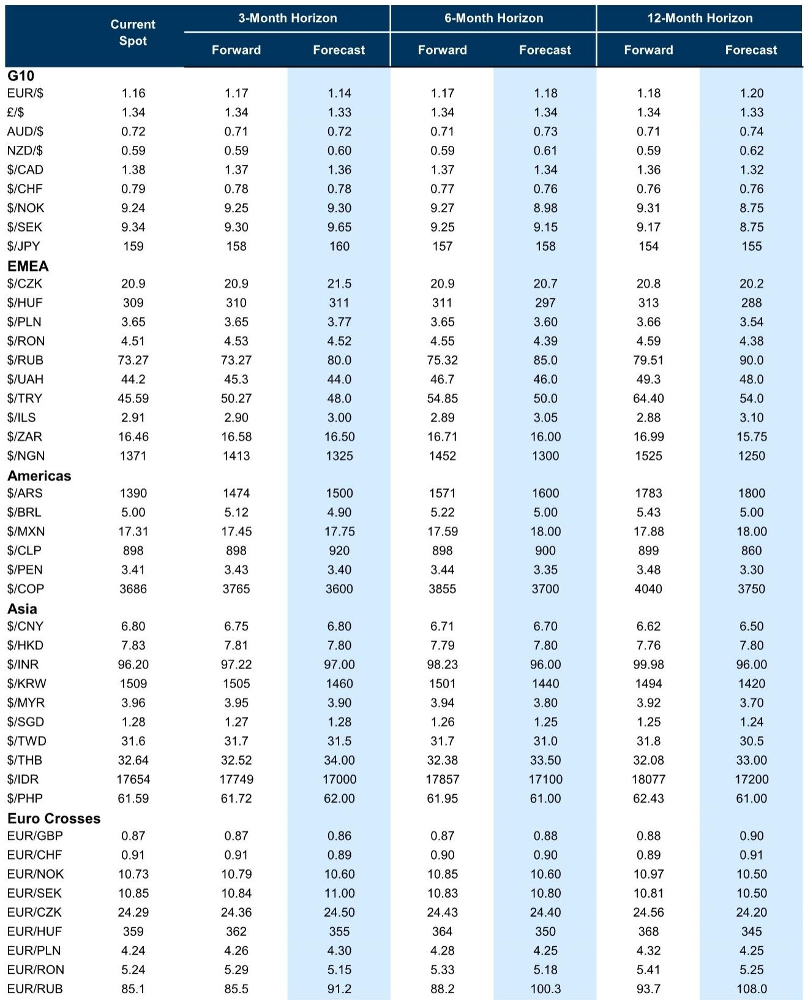
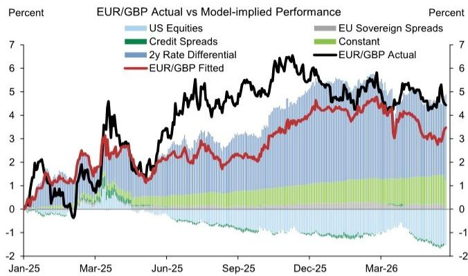

# The Dollar's Structural Resurgence Is Not a Tactical Move — It Is a Regime Shift in Global FX

The foreign exchange market has entered a phase where divergence is no longer a subplot but the main narrative. For months, the dominant framework for understanding currency returns has been built around shifting terms of trade, energy price dislocations, and the relative resilience of domestic demand. That framework is now being validated by hard data. The sharp downside surprise in China's April activity data, the deceleration in Europe's May flash PMIs, and the persistence of restricted energy flows have collectively confirmed what many analysts suspected but few were willing to assert: the US Dollar is on firmer footing, and this is not a short-lived correction.

The critical insight is not that the Dollar is strengthening in isolation. It is that the nature of Dollar strength has changed. Earlier this year, the prevailing view held that less exceptional US economic performance would gradually erode the Dollar's premium. That argument assumed a convergence narrative — that other economies would catch up, that the US advantage would narrow, and that the Dollar would weaken in an orderly fashion. That narrative has broken down. The combination of the artificial intelligence boom and higher-for-longer energy prices has reshuffled the global growth hierarchy. The US now looks like a relative outperformer once again, not because its own data are spectacular, but because the rest of the world is slowing more sharply than expected.

This matters for every portfolio with international exposure. The Dollar's appreciation pressure is building and broadening. It is no longer confined to shifts in relative value pairs or to specific currency crosses. It is increasingly reflected in the Dollar Index itself. And while there is still room for the Dollar to sell off on risk relief or renewed tech sector concerns, the structural tailwind from restricted energy flows is durable. Each day that commodity flows remain constrained is incrementally positive for the Dollar. Investors who treat this as a tactical move risk being caught on the wrong side of a regime shift.

## The Terms of Trade Shock Has Become a Growth Divergence Shock, and That Changes Everything

The most important analytical shift in recent weeks is the translation of terms of trade dislocations into observable growth outcomes. For much of the first half of the year, the FX market was dominated by relative price adjustments — currencies of energy importers weakening, currencies of energy exporters strengthening — but these moves remained largely contained within cross rates. The surface-level action in DXY was relatively muted. That has changed.

The data now show that the growth consequences of the energy shock are materializing unevenly. Europe's flash PMIs for May came in below expectations, signaling that the region's industrial base is feeling the strain of higher input costs and disrupted supply chains. China's activity data disappointed sharply, raising questions about the sustainability of its export-led recovery. In contrast, US activity data, while not uniformly strong, have held up better than most peers. The net effect is a growth divergence that reinforces the Dollar's appeal.

This is not merely a cyclical story. The AI boom has given the US a structural advantage that is independent of the energy shock. The US is the primary beneficiary of AI-related capital inflows, technology exports, and productivity gains. When combined with the energy tailwind — the US is a net energy exporter, unlike most of its developed-market peers — the result is a currency that benefits from both the old economy (energy) and the new economy (technology). This dual engine is rare and powerful.

The implication for investors is clear: the Dollar's strength is not a function of a single factor that can be easily reversed. It is the product of two structural forces that reinforce each other. Any investment thesis that relies on a rapid Dollar decline must account for both the energy channel and the technology channel. Ignoring either one leaves the analysis incomplete.

## Sterling's Risk Premium Is a Bout, Not a Trend, but the Macro Tailwinds Are Building Against It

The recent price action in EUR/GBP tells a more nuanced story about how political risk interacts with macro fundamentals in currency markets. Over the past two weeks, Sterling experienced a large round-trip in its risk premium. The currency weakened sharply, then recovered, all without a clear change in the underlying data. The cyclical GSBEER model, which tracks the relationship between exchange rates and fundamentals like rate differentials and credit spreads, shows that the move lower in EUR/GBP came despite a series of disappointing UK data releases and shifts in rate differentials that should have pointed to Sterling underperformance.

This gap between actual and model-implied exchange rates is best interpreted as a relaxation in the Sterling risk premium. The UK political backdrop remains complex and uncertain, but recent developments — including the apparent commitment of prospective leadership contenders to existing fiscal rules — have helped stabilize bond markets and reduce the premium investors demand for holding Sterling. The pattern is consistent with the 2025 experience: fiscal and political premia weigh on Sterling in bouts, not as a steady accumulating trend.

The key strategic question is whether this bout of premium relaxation is an opportunity to position for further Sterling weakness, or whether it signals that the worst is over. The evidence suggests the former. Chasing further increases in EUR/GBP spot and volatility has rarely been profitable when the Sterling premium has already risen sharply. Instead, the best risk-reward for topside EUR/GBP exposure has historically come after relaxations in premium — exactly the current environment.

More importantly, the macro trends are aligning against Sterling. The UK's structural overvaluation, elevated Bank of England hike pricing, and exposure to the energy shock through higher borrowing costs create a precarious starting position. When fiscal policy uncertainty is priced on top of an already fragile macro backdrop, the downside risk is asymmetric. The cleanest way to express this view is through EUR/GBP, but crosses like GBP/AUD and GBP/USD, which also capture diverging energy terms of trade impulses, may offer better medium-term downside exposure.

## Emerging Market FX Is Not a Monolith — The US Yield Speed Limit Separates Winners from Losers

The conventional wisdom that higher US yields are uniformly bad for emerging market currencies is too simplistic. The relationship is conditional on the pace of the move and the cyclical context. When US 10-year yields rise in a pro-cyclical rotation — as they did in early May, alongside rising equities and improving growth expectations — EM currencies can digest the increase relatively well. The problem arises when yields rise too fast.

The evidence points to a speed limit of approximately 20 to 30 basis points per month for US 10-year yields. Beyond that threshold, EM currencies come under pressure regardless of the cyclical backdrop. This is what happened in mid-May. The acceleration in long-end yields overwhelmed the positive signal from equities and commodities, and EM currencies depreciated across the board. Yet even within this sell-off, there were important divergences. Most EM currencies outperformed what a simple model based on rates, equities, and commodities would have predicted. The depreciation was real, but it was not as severe as the macro inputs suggested.

This distinction is critical for portfolio construction. The currencies that are most sensitive to US real yields — the South African rand, the Colombian peso, the Polish zloty, and the Hungarian forint — are also the ones that move the most during yield-driven sell-offs. But sensitivity is not static. The Mexican peso, for example, screens as more resilient to US long-end yield moves now than it has historically, thanks to its specific cyclical exposure to the US economy. This makes the peso a candidate for holding long in an EM carry basket, even when US yields are rising.

Conversely, the Chilean peso and the Thai baht screen as attractive funding currencies that can increase the resilience of an EM carry basket to US yield moves. By pairing high-carry currencies with low-beta funders, investors can construct a portfolio that is more robust to the inevitable episodes of US yield acceleration. The key is to recognize that the relationship between US yields and EM FX is nonlinear and context-dependent. A blanket short on EM FX is not the right response to higher US yields. A selective, beta-aware approach is.

## What the Report Does Not Fully Answer: The Sustainability of Asia's Rate Defense Strategy

The most open analytical question in the current environment concerns the sustainability of Asia's monetary policy response to the energy shock. Central banks in the Philippines, Indonesia, and potentially South Korea, India, and Taiwan have begun or are expected to begin hiking rates to defend their currencies and contain inflation. The logic is straightforward: with energy prices remaining elevated and no clear path to normalization of flows through the Strait of Hormuz, central banks cannot afford to "look through" the conflict on hopes of an oil price normalization. They must act.

But the report leaves several important questions unanswered. First, how much tightening is enough? The Philippines is expected to deliver an off-cycle hike followed by 75 basis points of further tightening to reach a terminal rate of 5.50%. Indonesia surprised with a 50 basis point hike. South Korea and India are each expected to deliver two hikes. But these projections assume that energy prices do not spike further and that the conflict does not escalate. If either assumption proves wrong, the required tightening could be significantly larger, with correspondingly greater damage to domestic demand.

Second, can rate hikes alone stabilize currencies when the terms of trade shock is so large? The report acknowledges that despite hawkish policy responses, the negative terms of trade shock is expected to dominate price action, leading to further underperformance of energy-exposed currencies like the Philippine peso, the Indian rupee, the Indonesian rupiah, and the Thai baht. If rate hikes cannot stem the depreciation, then central banks face a difficult choice: either hike more aggressively, risking a sharper slowdown, or accept currency weakness, risking imported inflation and financial instability.

Third, what happens if the equity outflows that have weighed on the Korean won — despite strong tech exports and a relatively resilient currency — continue or accelerate? The won has weakened as much as the most energy-exposed currencies, driven by large portfolio outflows that more than offset the widening trade balance. This suggests that the traditional relationship between trade flows and currency strength has broken down in the current environment. If portfolio flows remain the dominant driver, then even well-positioned economies may see their currencies weaken, regardless of their trade dynamics.

These are not trivial questions. They point to a deeper uncertainty about the transmission mechanism of monetary policy in an environment of supply-driven inflation and geopolitical risk. Investors should be cautious about assuming that the current rate defense strategies will succeed, or that the terminal rates currently projected will be sufficient.

## A Decision Framework for Navigating the Divergence Regime

The insights from this analysis can be synthesized into a practical decision framework for currency exposure in the current environment. The framework rests on three dimensions: the direction of the terms of trade shock, the sensitivity to US yield dynamics, and the sustainability of the domestic policy response.

First, identify whether a currency belongs to an energy exporter or an energy importer. This is the most important distinction. Energy exporters — Norway, Canada, Australia, and to a lesser extent the United States — benefit from higher-for-longer energy prices. Their currencies have a structural tailwind that is independent of other macro factors. Energy importers — most of Europe, much of Asia, and several Latin American economies — face a structural headwind that will persist as long as energy flows remain restricted. Within this group, the degree of exposure varies. The Philippines, India, Indonesia, and Thailand are among the most exposed, while China is a partial exception due to its status as a manufacturing exporter.

Second, assess the currency's beta to US real yields. Currencies with high beta — the rand, the peso, the zloty, the forint, and the Chilean peso — will be more volatile during episodes of US yield acceleration. They offer higher carry but require active management. Currencies with low beta — the Mexican peso, the Thai baht, and the Chinese yuan — are more resilient to US yield moves and can serve as portfolio stabilizers. The optimal portfolio combines high-carry currencies with low-beta funders to reduce overall volatility.

Third, evaluate the credibility and sustainability of the domestic policy response. Currencies whose central banks are actively hiking to defend the currency — the Philippine peso, the Indonesian rupiah, and potentially the Korean won and Indian rupee — may offer tactical opportunities if the hikes succeed in stabilizing expectations. But the risk is that the hikes prove insufficient, leading to a second wave of depreciation. Currencies whose central banks are on hold — the Malaysian ringgit and the Thai baht — face the risk of a delayed but more aggressive adjustment if energy prices remain elevated.

The final step is to recognize that no framework is static. The divergence regime is characterized by rapid shifts in the relative importance of these factors. A currency that is an energy exporter today could become an energy importer tomorrow if the conflict expands. A currency with low beta to US yields could develop high beta if its domestic fundamentals deteriorate. The framework is a guide, not a rule. Active monitoring and periodic reassessment are essential.

## The Unresolved Question That Should Drive Your Next Move

The most provocative finding in this analysis is the asymmetry between what the models predict and what the markets deliver. EM currencies depreciated in mid-May, but most outperformed what shifts in rates, equities, and commodities would have implied. Sterling weakened, but not as much as the macro data suggested it should. The Dollar strengthened, but the move was concentrated in specific crosses rather than uniformly across the board.

This pattern of outperformance relative to model predictions raises a critical question: are the models wrong, or is the market pricing something that the models do not capture? If the models are wrong — if the sensitivity of currencies to rates, equities, and commodities has changed — then the current level of many currencies may be more attractive or more vulnerable than it appears. If the market is pricing something the models miss — a geopolitical risk premium, a liquidity premium, or a regime change in central bank behavior — then the models will eventually catch up, and the current divergence between model and market will close.

This is the kind of question that cannot be answered with a single data point or a single report. It requires ongoing analysis, a willingness to challenge assumptions, and access to the full set of data and charts that underpin the research. The original report contains detailed exhibits on the relationship between US yields and EM FX, the GSBEER model for Sterling, and the energy beta for the Norwegian krone that are essential for forming a complete view.

Join the community to read the full report and review the original charts.

*This article is for learning and discussion only and does not constitute investment advice.*

Personal reading notes and learning share only. Not investment advice.

