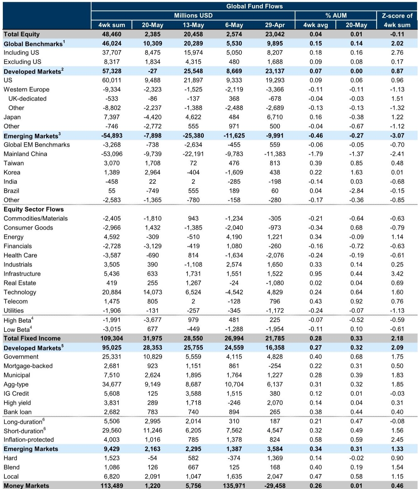
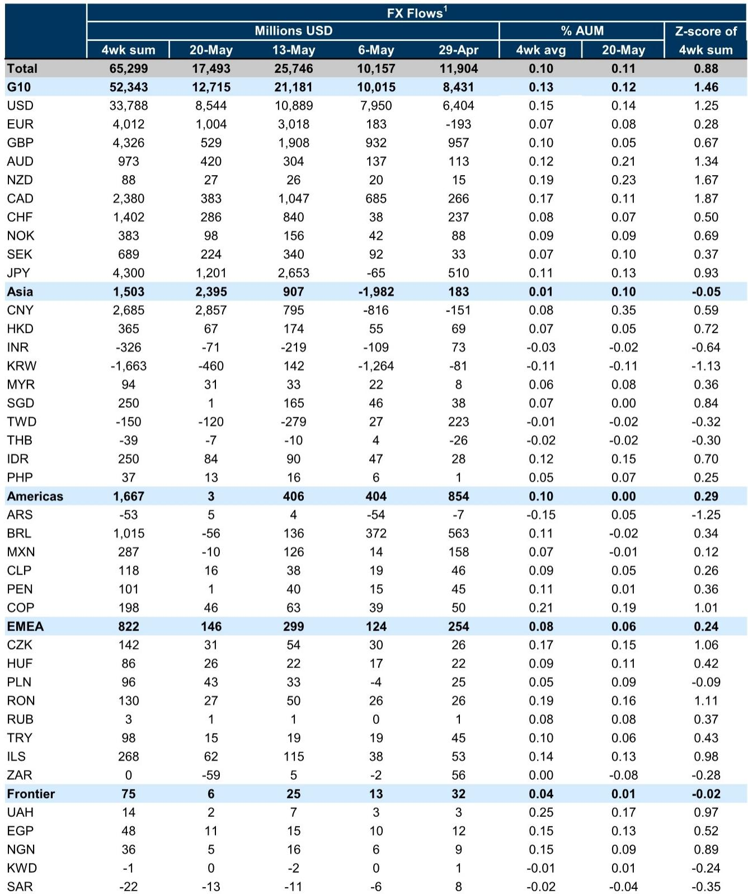
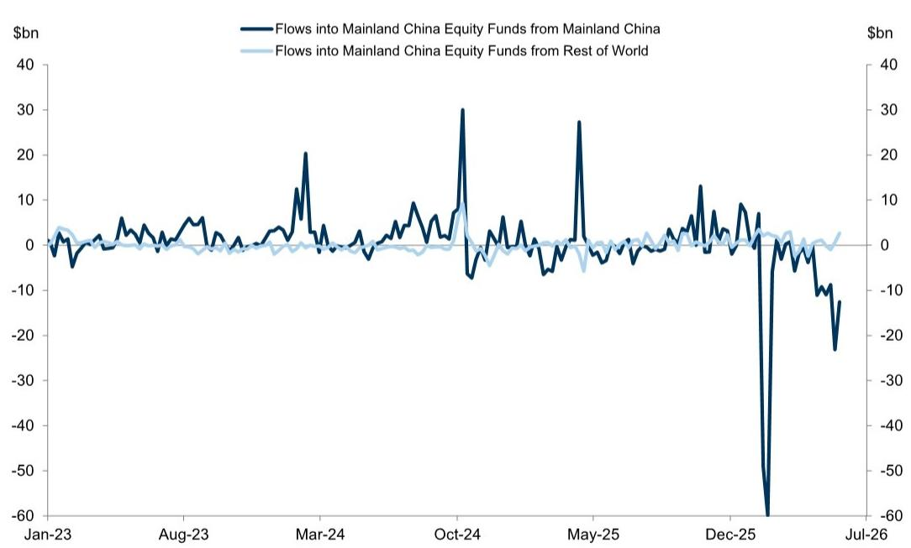

# European Capital Is Reshaping Global Yield Markets, and the Dollar's Range-Bound Era May Be the Key

The most consequential capital flow pattern of the current cycle is not the volume of money moving into US assets. It is the *origin* of that money. For the week ending May 20, global fund flow data reveals a striking and underappreciated dynamic: European investors are buying US fixed income at a pace that has reshaped cross-border flow patterns, while Asian investors are simultaneously reducing their exposure to US Treasuries. This divergence is not a temporary blip. It is a structural signal about how different regions are managing currency risk, energy price shocks, and portfolio rebalancing in a world where the dollar has become unusually range-bound.

The headline numbers tell a straightforward story. Global equity funds saw net inflows of $2 billion for the week, a sharp deceleration from the $20 billion recorded the prior week. Fixed income flows remained robust at nearly $32 billion, driven by government and aggregate-bond funds. Money market assets rose modestly by $1 billion. But the strategic insight lies beneath these aggregates. The cumulative flow data from the Euro Area into US Treasury funds has accelerated since the start of the year, while cumulative flows from Asia have turned negative. This is happening against a backdrop of a dollar that, despite the energy shock, has remained more contained than many strategists expected.

Why now? The answer lies in the interplay between foreign exchange management, yield differentials, and regional risk appetite. The Euro Area, facing its own growth challenges and a European Central Bank that has been slower to tighten than the Federal Reserve, is finding relative safety and yield in US government bonds. Asia, by contrast, is managing a different set of constraints. Several Asian central banks have been intervening in currency markets to manage depreciation pressures, and the data suggests that this intervention is being funded, in part, by reducing US Treasury holdings. The result is a bifurcated flow pattern that carries implications for global liquidity, cross-border funding costs, and the relative attractiveness of different asset classes.

This is not merely a story about where money is going. It is a story about why certain regions are making different trade-offs, and what those trade-offs mean for investors who need to position portfolios for the next twelve months. The conventional wisdom that "global capital flows to the US" is too simplistic. The real question is: which global capital, and at what cost?

---

## The Euro Area's Fixed Income Buying Spree Is a Strategic Hedge, Not a Simple Yield Chase

When European investors buy US Treasuries, the instinct is to attribute the move to yield differentials. US rates have been higher than German bund yields for much of the past two years, and the gap has widened at certain points during the energy shock. But the cumulative flow data tells a more nuanced story. The chart tracking cumulative Euro Area flows into US Treasury funds shows a steady, almost linear increase since the start of the year, accelerating sharply in the most recent weeks. This is not a reactive trade. It is a structural allocation shift.

The strategic rationale is twofold. First, European institutional investors are managing a currency environment where the euro has been under intermittent pressure due to the energy price shock and the region's dependence on imported natural gas. Buying US Treasuries is, in part, a way to maintain dollar exposure without taking on the outright currency risk of a weaker euro. Second, the ECB's rate path has created a situation where short-duration European bonds offer limited real yield. By moving into the US curve, European investors are extending duration and capturing a term premium that is simply not available in their home market.

The implication for global fixed income markets is clear. The Euro Area has become a structural buyer of US Treasuries at a time when the Federal Reserve is reducing its own balance sheet. This private-sector demand is helping to absorb supply that might otherwise put upward pressure on yields. But it also creates a dependency. If the euro were to strengthen significantly, or if European growth were to surprise to the upside, this flow could reverse abruptly. Investors should be monitoring European economic data and ECB policy signals as leading indicators for US Treasury demand.

---

## Asia's Treasury Sell-Off Reveals a Coordinated Currency Defense Strategy

The contrast with Asia could not be starker. While the Euro Area has been accumulating US Treasuries, Asia has been a net seller. The cumulative flow data shows a steady decline in Asian holdings of US Treasury funds since the beginning of the year, with the pace of selling accelerating in recent weeks. This is not a coincidence. It is the visible footprint of currency intervention.

Several Asian central banks, including those in China and other export-dependent economies, have been managing their exchange rates against a dollar that has been stronger than their domestic fundamentals would warrant. To defend their currencies, they need dollars. The most liquid source of dollars on their balance sheets is their holdings of US Treasuries. Selling Treasuries to raise cash, then using that cash to buy their own currencies, is the textbook playbook for managed depreciation. The data suggests this is exactly what is happening.

The strategic implication is that Asian Treasury selling is a function of currency pressure, not a fundamental reassessment of US creditworthiness. If the dollar were to weaken, this selling pressure would likely abate. But if the dollar remains range-bound or strengthens further, Asian central banks may need to continue selling. This creates a feedback loop: Asian selling puts upward pressure on US yields, which attracts European buyers, which helps support the dollar. The net effect is a stable but fragile equilibrium.

For investors, the key question is whether this pattern can persist. Asian central banks have finite Treasury holdings. At the current pace of selling, some of the largest holders may begin to approach levels that trigger policy or political constraints. The moment when Asian selling slows or stops could be a significant inflection point for US rates.

---

## Technology Sector Flows Are Masking a Broader Rotation Out of Financials and Into Cyclicals

The equity flow data for the week ending May 20 shows a familiar pattern at the sector level: technology funds saw the largest net inflows, while financials funds saw the largest net outflows. This appears to be a continuation of the growth-versus-value trade that has defined much of the past 18 months. But the cumulative year-to-date data reveals something more interesting.

When looking at cumulative global equity flows by sector as a percentage of assets under management, the leaders are not technology. They are industrials, energy, infrastructure, and commodities and materials. Technology sits in the middle of the pack. Financials are in negative territory. This suggests that the weekly headline of "technology inflows" is being driven by a concentrated burst of activity, while the broader, more patient allocation of capital is moving into real assets and cyclical sectors.

The strategic logic is compelling. The energy shock and the subsequent restructuring of global supply chains have created a structural demand for industrial capacity, energy infrastructure, and commodity production. Investors are not just trading a cyclical rebound. They are positioning for a multi-year period of capital expenditure and physical investment. Technology, by contrast, remains a sector where valuation compression has not fully corrected, and where the regulatory and competitive landscape is uncertain.

The implication is that the rotation out of financials and into cyclicals is likely to continue. Financials are facing headwinds from a flatter yield curve, tighter regulation, and slower loan growth. Cyclicals, particularly those tied to energy and infrastructure, are benefiting from fiscal spending programs and the reshoring of industrial production. The week-to-week noise of technology inflows should not distract from the underlying trend.

---

## What the Report Does Not Fully Answer: The Missing Link Between FX Hedging and Flow Durability

The report provides detailed data on unhedged cross-border flows, but it does not offer a complete picture of how much of the European buying of US Treasuries is hedged or unhedged. This distinction is critical for understanding the durability of the flow pattern.

If European investors are buying US Treasuries and simultaneously hedging their currency exposure back to euros, then the flow is essentially a pure yield trade. It is sensitive to changes in the interest rate differential between the US and the Euro Area. If that differential narrows, the trade becomes less attractive. If European investors are buying US Treasuries without hedging, then they are making a directional bet on the dollar. In that case, the flow is sensitive to changes in the exchange rate, not just the yield differential.

The data on net unhedged foreign flows into US equity funds shows significant volatility, with recent weeks showing a sharp reversal from inflows to outflows. This suggests that a portion of the capital flowing into US assets is indeed unhedged and sensitive to currency movements. But the report does not break down the fixed income flows by hedging status. Without that data, it is difficult to assess how much of the European buying is a strategic allocation versus a tactical trade.

The second unanswered question is the role of Asian official institutions. The cumulative flow data shows Asian selling of US Treasuries, but it does not distinguish between private-sector and official-sector flows. If the selling is primarily from central banks conducting currency intervention, then it is a policy-driven flow that could stop abruptly if the currency pressure eases. If the selling is from private Asian asset managers reallocating away from US assets, then it is a more fundamental shift that could persist even if the dollar weakens.

These are not minor analytical gaps. They are the difference between understanding a flow as temporary or structural. Investors who rely solely on the aggregate data may be caught off guard if the underlying motivation shifts.

---

## A Decision Framework for Positioning Across Regions and Sectors

For readers who need to translate this analysis into portfolio decisions, the following framework may be useful. It is based on three variables: the direction of the dollar, the trajectory of European growth, and the pace of Asian currency intervention.

First, if the dollar remains range-bound and European growth stabilizes, the current flow pattern is likely to persist. European buying of US Treasuries will continue to support the long end of the US curve, while Asian selling will put modest upward pressure on yields. In this scenario, the optimal fixed income position is to be long the belly of the US curve, where European demand is concentrated, and to avoid the short end, where Fed policy uncertainty is highest. For equities, the bias should be toward US cyclicals, particularly industrials and energy, which benefit from the capex cycle and are less exposed to the valuation compression affecting technology.

Second, if the dollar weakens significantly, the flow pattern would reverse. Asian central banks would have less need to sell Treasuries, and European investors might reduce their US exposure as the currency hedge becomes less attractive. In this scenario, US fixed income could underperform, and the rotation out of US assets into European and Asian markets would accelerate. The equity positioning would shift toward European exporters and Asian domestic-demand plays.

Third, if Asian currency intervention intensifies to the point where central banks begin to exhaust their Treasury holdings, the market could face a sudden reduction in demand for US bonds. This is the tail risk scenario. In that case, US yields would spike, and the dollar would likely strengthen initially as a safe haven, before eventually weakening as the loss of a major buyer undermines confidence in the Treasury market. The portfolio response would be to reduce duration and increase cash allocations, while waiting for the dislocation to create buying opportunities.

The framework is not predictive. It is a way to organize thinking around the key variables that will determine whether the current flow patterns are sustained or disrupted. The most important monitoring tool is the weekly data on cumulative Euro Area versus Asia flows into US Treasuries. As long as that divergence continues, the current regime is intact. The moment it converges, the regime is changing.

---

## The Community Question: What Comes After the Divergence?

The data in this report raises a question that the available information cannot fully answer. The divergence between European buying and Asian selling of US Treasuries has been one of the most consistent patterns of the past six months. But every divergence eventually converges. The question is not whether this one will end, but how.

Will it end with a weaker dollar that reduces Asian selling pressure and makes US Treasuries less attractive to European buyers? Will it end with a European recession that forces European investors to repatriate capital? Will it end with an Asian policy shift that allows currencies to depreciate more freely, reducing the need for Treasury sales? Each scenario has different implications for global asset allocation, and each requires a different set of portfolio adjustments.

The full report includes the original charts that show the cumulative flow data in greater detail, including the breakdown by region and the time series of net unhedged flows. For readers who want to analyze the data themselves and draw their own conclusions about the durability of the current flow pattern, the charts are essential. They reveal the inflection points that the summary numbers conceal.

Join the community to read the full report and review the original charts.

*This article is for learning and discussion only and does not constitute investment advice.*

Personal reading notes and learning share only. Not investment advice.

