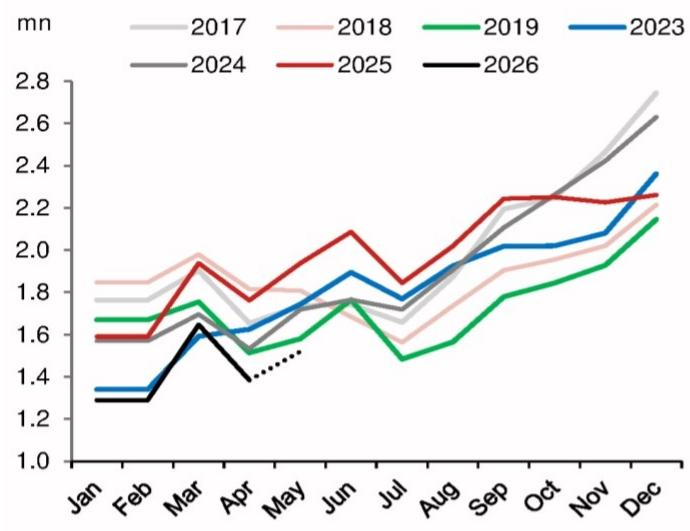

# China's Auto Market Is Fracturing: Domestic Weakness and Export Surge Are Two Sides of a Structural Crisis That Will Define 2026

The conventional narrative that China's auto industry is a single, unified growth story is no longer tenable. In May, domestic passenger car retail sales volume growth is estimated to have fallen to -21.6% year-on-year, deepening from -20.0% in April and -17.0% in the first quarter. Meanwhile, auto exports are accelerating at a pace that defies easy comparison: April export volume surged 84.1% year-on-year, up from 60.7% in Q1. These two trajectories are not merely diverging; they represent a structural fracture in the world's largest automotive market. The implications extend far beyond monthly sales figures. This is a story about the limits of policy stimulus, the unintended consequences of industrial transformation, and the strategic reorientation of a sector that accounts for approximately 3.2% of China's GDP.

The current moment matters because the forces driving this split are not cyclical. The payback effects from the scaled-back trade-in program and the increase in the EV purchase tax from 0% to 5% are policy headwinds that will not reverse quickly. At the same time, the global energy disruption, particularly the rise in oil and gas prices, is creating a structural tailwind for Chinese EV exports that is unlikely to dissipate in the near term. The result is a market where the domestic and external segments are governed by fundamentally different dynamics. For investors, corporate strategists, and policymakers, understanding this fracture is no longer optional. It is the central analytical challenge of the year ahead.

## The Policy Hangover Is More Than a Blip: Domestic Demand Is Entering a Structural Soft Patch

The May domestic sales decline is not a one-off correction. It represents the third consecutive month of accelerating contraction, and the underlying causes are deeply embedded in the policy architecture that has shaped China's auto market over the past three years. The trade-in program, which provided generous subsidies for consumers to replace older vehicles, was a powerful short-term stimulus. Its scaling back has created a classic payback effect: sales that were pulled forward into 2024 and early 2025 are now absent from the current period. This is not a demand problem that will correct itself in one or two quarters. The payback cycle typically lasts six to twelve months, and the magnitude of the prior stimulus suggests the drag will persist well into the second half of 2026.

The EV purchase tax increase from 0% to 5% compounds the problem. This is a direct price increase for the segment that has been the primary driver of China's domestic auto growth. For years, the zero-tax regime acted as a powerful subsidy, effectively lowering the total cost of ownership for EVs relative to internal combustion engine vehicles. Removing that advantage, even partially, changes the calculus for price-sensitive consumers. The timing is particularly unfortunate: the EV market is already facing margin compression from intense competition, and manufacturers have limited room to absorb the tax increase through price cuts. The result is a demand-side shock that will disproportionately affect the mass-market EV segment.

The evidence from the CPCA's early estimates is unambiguous. The year-on-year growth rate for domestic passenger car retail sales has been negative for three consecutive months, and the trend is worsening. The monthly data series shows a clear pattern: after a relatively stable performance in late 2024 and early 2025, the decline has become sharper and more sustained. This is not a seasonal pattern. It is a structural shift in domestic demand that will require more than a minor policy adjustment to reverse.

## Export Growth Is Not an Escape Valve: The Structural Asymmetry Between Domestic and External Markets Is Widening

The export story is genuinely impressive. April's 84.1% year-on-year volume growth represents an acceleration from an already robust 60.7% in Q1. The primary driver is the global energy disruption. Rising oil and gas prices are making the operating cost advantage of EVs more compelling for consumers in markets where fuel costs are a significant household expense. Chinese EV manufacturers, who have achieved cost leadership through scale and vertical integration, are uniquely positioned to capture this demand. The energy crisis has inadvertently provided them with a pricing and value proposition advantage that would have taken years to build under normal market conditions.

However, the export surge must be placed in proper context. Exports accounted for only 19% of China's total auto market by volume and 15% by value in 2025. Even at the current accelerated pace, exports cannot fully compensate for the domestic weakness. The math is straightforward: if domestic sales are contracting at 20% and exports are growing at 80%, but exports represent only one-fifth of the total, the net effect is still a contraction in overall market size. The export growth is a powerful counterweight, but it is not a replacement for the domestic market.

More importantly, the two markets are structurally different. The domestic market is driven by policy, consumer sentiment, and the replacement cycle. The export market is driven by global energy prices, trade policy, and competitive positioning. These are independent variables, and there is no reason to expect them to move in sync. The current data suggests they are moving in opposite directions, and the divergence is likely to widen. The report's conclusion that the widening divide between external and domestic demand will persist throughout 2026 is not merely a forecast. It is a recognition that the two segments are now governed by fundamentally different economic logics.

## The GDP Linkage Is a Double-Edged Sword: What the 3.2% Figure Really Means for Broader Economic Strategy

The auto sector's 3.2% contribution to GDP is a frequently cited statistic, but it understates the sector's systemic importance. The auto industry is deeply integrated into China's manufacturing supply chain, from steel and chemicals to electronics and software. A sustained decline in domestic auto sales does not just affect automakers and dealers. It ripples through the entire industrial ecosystem, affecting employment, investment, and local government revenues in key manufacturing regions.

The export surge provides a partial offset, but the composition of export-driven GDP is different. Export-oriented production tends to be more capital-intensive and less labor-intensive than domestic-oriented production. A million vehicles sold domestically supports a different mix of jobs and local economic activity than a million vehicles exported. The shift from domestic to export markets, while positive for overall output, may not fully compensate for the employment and income effects of the domestic contraction.

This creates a strategic dilemma for policymakers. The traditional response to a domestic demand shortfall would be to introduce new stimulus measures, such as expanded trade-in subsidies or a reversal of the EV tax increase. However, such measures would be expensive and would risk exacerbating the structural overcapacity that already plagues the industry. The alternative is to let the domestic market adjust, accepting the short-term pain in exchange for a more sustainable long-term structure. The report's data suggests that the latter path is the one currently being taken, whether by design or by default.

## What the Report Does Not Fully Answer: The Unresolved Questions About Trade Policy, Overcapacity, and the Competitive Dynamics of the Export Surge

The report provides a clear diagnosis of the current state, but it leaves several critical questions unanswered. First, the sustainability of the export surge depends heavily on trade policy. Chinese auto exports are already facing increased scrutiny in key markets, including the European Union, which has launched an anti-subsidy investigation into Chinese EVs. The 84.1% growth rate is impressive, but it is also a target. If major markets impose tariffs or quotas, the export trajectory could change dramatically. The report does not model this risk, and it is a significant gap.

Second, the report does not address the overcapacity issue in any detail. China's auto industry, particularly the EV segment, has been characterized by massive investment and overcapacity. The domestic demand contraction will exacerbate this problem, creating pressure for consolidation. The export surge may provide a temporary outlet for excess capacity, but it is not a permanent solution. The industry is likely to face a period of painful restructuring, and the report does not provide a framework for assessing which players are best positioned to survive.

Third, the report does not disaggregate the export data by destination or by manufacturer. Are the exports concentrated in a few markets or broadly diversified? Are they driven by a handful of large manufacturers or by a wider group of players? The answers to these questions would significantly affect the strategic implications. A concentrated export structure is more vulnerable to trade policy shocks. A diversified structure is more resilient but also requires more complex supply chain and distribution capabilities.

## A Decision Framework for Investors and Strategists: How to Navigate the Divided Market

The fracture between domestic and export markets requires a fundamental rethinking of how to analyze China's auto sector. The old framework, which treated the industry as a single entity driven by domestic demand and policy, is no longer adequate. Here is a three-part framework for making sense of the current environment.

First, assess exposure to the domestic market. Companies with high domestic sales exposure are facing a structural headwind that will persist through 2026. The key question is not whether the domestic market will recover, but when and at what level. The current data suggests that recovery is unlikely before late 2026 at the earliest, and the new equilibrium may be at a lower volume level than the pre-2024 peak. Investors should focus on companies with strong balance sheets and cost advantages that can weather a prolonged period of weak domestic demand.

Second, evaluate the quality and sustainability of export growth. Not all export growth is equal. Companies that are exporting to diversified markets with strong underlying demand fundamentals are in a better position than those relying on a single market or a temporary price advantage. The energy disruption is a powerful tailwind, but it is also a variable that can reverse. Companies with genuine cost and technology advantages are more likely to sustain their export momentum than those benefiting primarily from the current energy price environment.

Third, consider the consolidation implications. The domestic contraction and export expansion are likely to accelerate the shakeout in China's auto industry. Smaller, weaker players will struggle to survive. Larger players with strong export positions will have the opportunity to gain market share both at home and abroad. The key strategic question is which companies are best positioned to emerge as winners from the consolidation process. This requires a detailed analysis of cost structures, technology capabilities, and balance sheet strength that goes beyond the aggregate data.

## Join the Community to Read the Full Report and Review the Original Charts

The data and analysis presented here are derived from a detailed research report that includes the original charts and monthly data series. The full report provides a more granular view of the trends, including the month-to-month trajectory of domestic sales and the acceleration pattern in exports. It also includes the specific estimates and assumptions underlying the May 2026 forecast. For a complete understanding of the dynamics shaping China's auto market, the original charts and data are essential. Join the community to read the full report and review the original charts.

*This article is for learning and discussion only and does not constitute investment advice.*

Personal reading notes and learning share only. Not investment advice.

