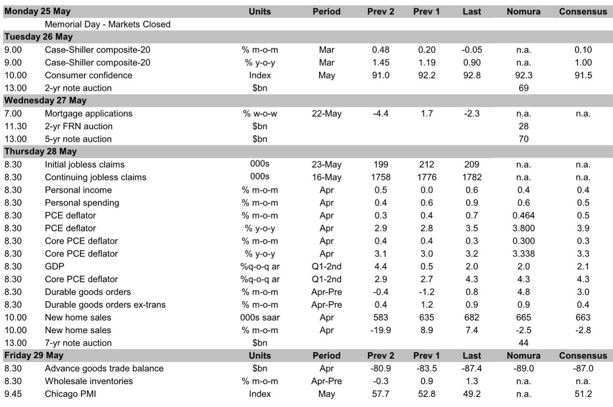
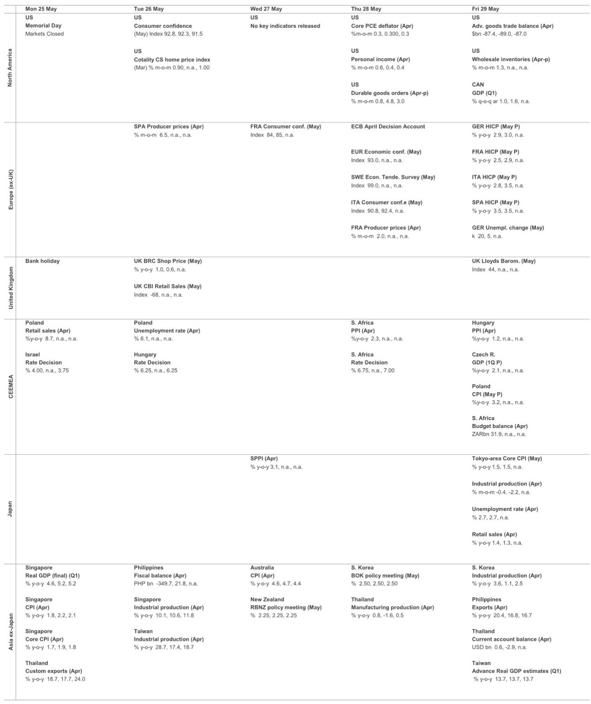
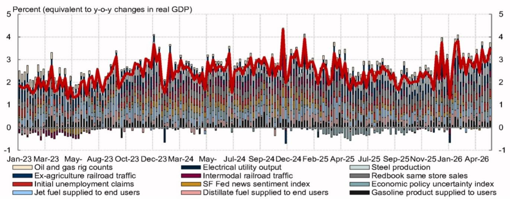

# 市场真正低估的不是降息时点，而是美联储“无限期按兵不动”的定价

过去几个月，市场参与者始终在争论美联储会在9月还是12月降息。但某外资投行最新发布的研报做出了一个更为激进的判断：美联储将无限期维持利率不变。这不是一个关于降息时点推迟的判断，而是一个关于政策框架切换的判断。如果这一情景成立，当前资产定价中隐含的降息预期将面临系统性重估。

报告的核心逻辑并不复杂，但支撑这一判断的数据信号和内部博弈细节，值得每一位关注宏观资产配置的读者仔细拆解。我们接下来将逐一展开。

## 1. 政治压力退潮后，美联储内部的鹰派共识正在加速形成

市场此前对降息的期待，很大程度上建立在一个假设之上：新上任的美联储主席Kevin Warsh倾向于宽松，而特朗普政府会持续施压。但报告揭示了两个关键变化。

第一个变化来自白宫。根据《财富》杂志本周一刊发的专访，特朗普对短期内降息的态度已明显软化。他的原话是：“在战争结束之前，你无法真正看数据。”更值得注意的是，他明确表示不会给新任美联储主席施压，称“我打算让他做他想做的事”。这意味着，过去一年多来支撑市场降息预期的政治压力正在系统性消退。

第二个变化更为关键：美联储内部，即便是此前被认为偏鸽派的官员，也不再主张降息或保留宽松倾向。Governor Waller在近期讲话中明确表示，降息的可能性并不高于加息。他甚至呼吁从政策声明中移除所有关于宽松倾向的措辞。Philadelphia联储主席Paulson则直接表态，市场当前定价的“长时间暂停甚至加息”是健康的。

这种从“鸽派官员仍在呼吁降息”到“鸽派官员也开始转向”的转变，是判断政策框架切换的核心信号。报告特别对比了1月、3月和4月三次FOMC会议的会议纪要措辞：支持保留宽松倾向的官员从“多数”退回到“几位”，而多数官员已开始讨论“如果通胀持续高于2%，则需要加息”。这种措辞的逆转，在近十年的美联储历史上都极为罕见。

这意味着，即便Warsh本人有意推动降息，他面临的内部阻力已经显著大于上任之初。报告对此的判断是：支持降息在FOMC内部已不再构成多数。

## 2. 增长数据持续超预期，正在剥夺降息的“经济必要性”

如果经济数据走弱，即便政治压力消退，美联储仍有理由降息。但报告呈现的数据恰恰相反：几乎所有主要增长指标都在加速。

制造业PMI初值升至多年新高。企业资本开支不仅在加速，而且正在从AI/科技领域向更广泛的行业扩散。资本品发货量和进口量同步走强。报告预计4月耐用品订单环比增长4.8%，即使剔除波动较大的运输项，核心资本品订单也有望增长0.9%，核心资本品发货量增长1.0%。

住房市场同样展现出韧性。尽管抵押贷款利率处于高位，成屋签约销售指数在3月环比上修至1.7%后，4月再次超预期增长1.4%。NAHB调查中，建筑商对未来六个月的销售预期和买家看房流量均有所回升。

劳动力市场的数据更加直接。ADP周度数据显示，截至5月2日的四周内，私人部门周均新增就业达到4.25万人，创下该调查有史以来的最高水平。初请失业金人数则维持在低位，考虑到近年来夏季初请人数往往季节性上升，当前的平稳本身就是一个积极信号。

将这些数据合并在一起，结论非常清晰：当前的经济增长速度并不支持降息。报告对二季度GDP的追踪估计为2.6%（环比年化），而衡量国内私人部门实际最终销售的指标稳定在2.9%。这不是一个需要政策刺激的经济体。

## 3. 通胀压力正在从“关税脉冲”切换为“结构性能源与芯片冲击”

市场此前对通胀的判断大致是：关税带来的价格上涨是一次性的，随着关税效应消退，通胀将自然回落。但报告指出了两个正在形成的新压力源，且它们都具有结构性特征。

第一个是伊朗战争带来的能源价格传导。报告没有详细展开这一链条，但逻辑是清晰的：油价上涨会通过运输成本、化工原料等渠道向核心通胀传导，且这种传导往往具有滞后性和持久性。

第二个压力源更值得关注：全球存储芯片短缺。报告提到，这一短缺将直接推高电子产品价格。考虑到计算机软件及配件价格已经连续五个月上涨，而芯片短缺的缓解需要新的产能投产，这一压力至少在未来两个季度内不会消退。

调查数据也在印证这一判断。S&P制造业PMI的投入价格指数在5月从68.4飙升至79.5，创下该调查有史以来的最大单月涨幅。纽约联储服务业价格指数同样持续上行，指向PCE核心服务通胀（即所谓的“超级核心通胀”）将保持韧性。

报告预计4月核心PCE通胀环比上涨0.300%，较3月的0.293%进一步加速，同比将从3.2%升至3.3%。而更关键的信号是前瞻性的：航空票价正在加速上涨，金融服务价格在强劲股市的带动下有望在5月反弹。这意味着，即便4月数据本身没有大幅超预期，后续几个月的通胀读数仍面临上行风险。

## 4. 报告尚未完全回答的关键问题：这一判断的“反身性”风险在哪里

任何宏观判断都需要考虑其自身的反身性。如果市场广泛接受了“美联储无限期按兵不动”这一情景，那么利率预期上升、金融条件收紧本身就会对经济产生抑制作用。报告对此没有展开讨论，而这一点恰恰是理解这一判断是否可持续的核心。

具体来说，有两个问题值得持续跟踪。

第一个是金融条件的传导时滞。如果长期利率持续走高，企业融资成本上升，资本开支计划是否会开始放缓？报告当前看到的数据是资本开支仍在加速，但这一加速是否已经包含了此前宽松预期的滞后效应？如果加息预期进一步固化，资本开支的拐点可能在何时出现？

第二个是劳动力市场的结构性变化。ADP周度数据创下历史新高，但这一数据的统计口径和样本代表性是否足够可靠？报告没有对此展开讨论。更关键的是，如果劳动力市场的强劲是暂时的（比如受季节性因素或特定行业补库驱动），那么当这些因素消退后，失业金申请数据可能会出现超预期上升。而一旦劳动力市场出现明显走弱，美联储的内部平衡就会再次发生变化。

这两个问题，报告都没有给出确定的答案。而这恰恰是当前判断中最值得持续跟踪的变量。

## 5. 对投资者的观察框架：三个需要持续盯住的信号

基于报告的逻辑，我们可以建立一个简洁的观察框架，帮助判断“无限期按兵不动”这一情景是否在持续强化。

第一个信号是FOMC会议纪要中的措辞变化。如果后续纪要中，支持加息的官员数量继续增加，或者支持降息的措辞完全消失，那么当前判断的置信度将进一步上升。反之，如果鸽派声音重新抬头，则需要重新评估。

第二个信号是核心PCE通胀的环比走势。报告预计4月环比0.300%，如果后续几个月持续高于0.25%甚至0.30%，那么通胀的粘性将得到确认。如果出现连续低于0.20%的数据，则需要警惕通胀压力正在消退。

第三个信号是初请失业金人数的季节性模式。报告指出，当前失业金人数保持平稳，是增量积极信号。但如果夏季季节性上升的幅度超出预期，或者持续申请人数开始明显积累，劳动力市场的韧性就会受到质疑。

这三个信号，构成了验证当前判断的核心观测点。

## 6. 顺着这些未解问题，继续读完整报告

以上是我们对这份研报核心逻辑的拆解。报告还包含了对本周即将公布的一系列经济数据的详细预测，包括消费者信心指数、个人收入与支出、PCE通胀、GDP二季度修正值、耐用品订单、新屋销售和商品贸易逆差。这些数据的实际读数，将为上述判断提供第一轮验证。

但正如我们在第4部分指出的，报告最值得深入讨论的部分，恰恰是那些它没有完全展开的问题：金融条件收紧的滞后效应、劳动力数据统计口径的可靠性、以及芯片短缺对通胀的持续性影响。这些问题的答案，无法从一份周度报告中获得，需要持续跟踪和交叉验证。

我们已经在星球微信群里开始讨论这些问题。如果你也在思考当前的宏观资产配置框架，欢迎来继续交流。我们将基于本周的数据发布，持续更新对这一判断的验证进度。

Personal reading notes and learning share only. Not investment advice.

