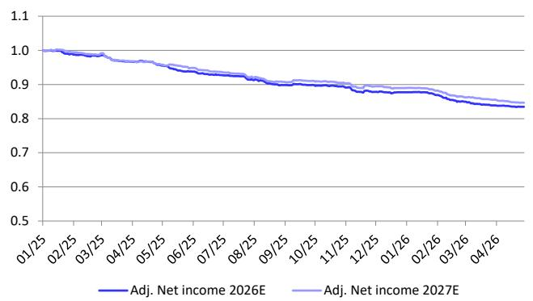
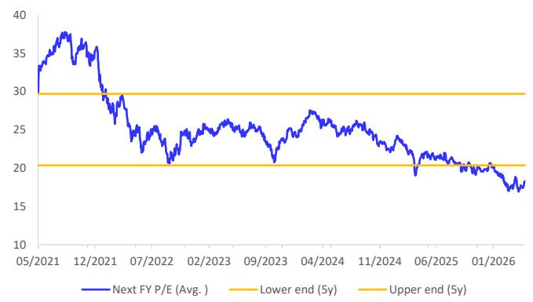
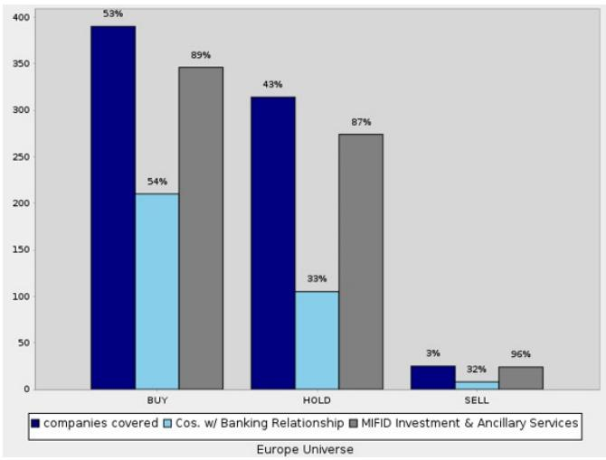
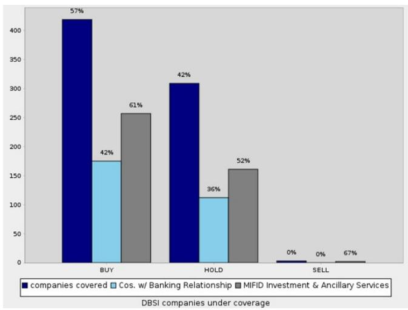

Europe

Healthcare

Medical Technologies & Services

Industry

# European MedTech & Life Sciences

Date

22 May 2026

Industry Update

# Q1 Sector Recap: The Bar Is Low for a Recovery

# Takeaway Summary

The Q1 earnings season was mixed for the European MedTech & Life Sciences sectors, and investor interest remains largely subdued based on our discussions. Most companies delivered revenue growth that was in line with or slightly below expectations. While adjusted EPS was often better than forecast, this was frequently aided by non-operational items such as lower interest expenses and taxes. Despite these quarterly beats, aggregate full-year consensus adjusted EPS estimates for 2026 and 2027 continued to decline across our coverage, and sector valuation levels remain depressed.

Given the low expectations and light investor positioning, it would likely take only small improvements in consensus earnings to spark a recovery. This makes us hopeful that the trough in valuations may have been reached, though we note that a continuation of the conflict in the Middle East and any resulting increase in inflation would undoubtedly create another headwind. We also believe investors will likely require more than one quarter of stabilization before meaningfully re-engaging. Following the reporting season, our top picks in the sector are, in alphabetical order, Fresenius SE, Lonza, Ottobock and Sartorius.

Falko Friedrichs

Research Analyst

+49-69-910-36270

Jan Koch, CFA

Research Analyst

+49-69-910-47428

Fynn Scherzler

Research Analyst

+49-69-910-40764

Sachin Gadilingappa

Research Associate

Figure 1: DB EU MedTech & Life Sciences coverage BBG earnings revisions (indexed)   

line

| Date   | Adj. Net income 2026E | Adj. Net income 2027E |
|--------|------------------------|------------------------|
| 01/25  | 1.0                    | 1.0                    |
| 02/25  | 0.99                   | 0.99                   |
| 03/25  | 0.98                   | 0.98                   |
| 04/25  | 0.97                   | 0.97                   |
| 05/25  | 0.96                   | 0.96                   |
| 06/25  | 0.95                   | 0.95                   |
| 07/25  | 0.94                   | 0.94                   |
| 08/25  | 0.93                   | 0.93                   |
| 09/25  | 0.92                   | 0.92                   |
| 10/25  | 0.91                   | 0.91                   |
| 11/25  | 0.90                   | 0.90                   |
| 12/25  | 0.89                   | 0.89                   |
| 01/26  | 0.88                   | 0.88                   |
| 02/26  | 0.87                   | 0.87                   |
| 03/26  | 0.86                   | 0.86                   |
| 04/26  | 0.85                   | 0.85                   |

Source : DB estimates, Company data, Bloomberg Finance LP

Figure 2: DB EU MedTech & Life Sciences next FY P/E estimates   

line

| Date     | Next FY P/E (Avg.) |
| -------- | ------------------ |
| 05/2021  | 35                 |
| 12/2021  | 38                 |
| 07/2022  | 25                 |
| 02/2023  | 26                 |
| 09/2023  | 21                 |
| 04/2024  | 27                 |
| 11/2024  | 24                 |
| 06/2025  | 20                 |
| 01/2026  | 18                 |

Source : Bloomberg Finance LP

# DB AG

IMPORTANT RESEARCH DISCLOSURES AND ANALYST CERTIFICATIONS LOCATED IN APPENDIX 1. DB does and seeks to do business with companies covered in its research reports. Thus, investors should be aware that the firm may have a conflict of interest that could affect the objectivity of this report. Investors should consider this report as only a single factor in making their investment decision.

# Top Picks

# Large caps

Fresenius SE: Operational momentum remains positive across both the Helios and Kabi segments, and the company has again provided conservative guidance for 2026 that we believe is achievable and potentially beatable. Furthermore, we believe concerns around German healthcare reform are more than priced into the stock, with the potential headwind likely to be much smaller than initially feared. Despite this strong fundamental outlook, the shares trade at only 10x our 2027 P/E estimate. In our view, this valuation fails to properly account for the company's attractive prospects, which include high-single-digit EPS growth in defensive end markets, a healthy balance sheet, improving cash flow, and a rising return on invested capital (ROIC).

Lonza: As a global CDMO leader, Lonza is well-positioned to continue its strong operational performance in 2026, building on the double-digit top- and bottom-line growth it delivered in 2025 and having successfully re-established a track record of reliable execution. The company benefits from robust end markets that are largely insulated from geopolitical headwinds and tariffs, and its recent qualitative Q1 update pointed to a continuation of these strong operational trends. Despite this attractive fundamental set-up—which also includes a strong balance sheet and improving cash flow and returns—the shares trade at only 22x our 2027 P/E estimate. In our view, this valuation, which is below the stock's historical range of 25-38x, presents an attractive buying opportunity.

Sartorius: Global leader in bioprocessing equipment and consumables used for the production of biological drugs (and other modalities) that is benefitting from normalizing end markets following post-pandemic destocking and returning to sustainable double-digit adjusted EPS growth. The Q1 results were solid and put the company on track to deliver on its guidance for 2026, and we expect the upcoming Q2 results to be good, too. While the valuation does not look cheap on paper at 33x 2027E P/E (although this being at the low end of the historical 33-55x range), we believe it is more than justified as we believe the company should reliably deliver and compound at least mid-teens adjusted EPS growth over the next years in largely defensive and structurally growing end-markets.

# SMID caps

Ottobock: As a global leader in the prosthetics and orthotics industry, Ottobock is set to continue its strong operational momentum in 2026, despite an anticipated slower start to the year. We expect to see accelerating growth and margins in the coming quarters, and the company's conservative initial guidance creates the potential for a "beat-and-raise" story to unfold. Combined with a strong balance sheet, promising upcoming product launches, and potential tailwinds from geopolitical conflicts, we view the current valuation as attractive. The shares trade at just 15x our 2027 P/E estimate, which we believe does not adequately reflect our expectation for continued double-digit earnings growth.

# Q1 Performance Recap

# Key Observations from the Recent Quarter

While Q1 delivery was again mixed across the sector, the overall picture skewed modestly positive at the bottom line. The majority of companies delivered EPS beats (average +7.0%, median +6.5%), although this was often supported by lower-than-expected interest expenses and taxes. By contrast, revenue performance remained broadly in line to slightly softer (average miss of 0.6%, median beat of 0.3%), pointing to continued mixed demand trends. The picture for full-year 2026 guidance was more balanced this time; while most companies (13) confirmed their outlooks, revisions skewed negative (5 downgrades vs. 3 upgrades). For those companies that did revise, the median change was modest on sales but somewhat larger on earnings, underlining a still-cautious stance on the outlook.

Figure 3: Sector Q1'26 consensus deviation overview 

<table><tr><td rowspan="2">Reporting date</td><td>RDC6-May</td><td>DOCM16-Apr</td><td>SRT323-Apr</td><td>BIM23-Apr</td><td>COLOB23-Apr</td><td>QIA27-Apr</td><td>STMN29-Apr</td><td>FME5-May</td><td>DEMANT5-May</td><td>ALC5-May</td><td>FRE6-May</td><td>PHIA6-May</td><td>OBCK6-May</td><td>EVT6-May</td><td>SHL7-May</td><td>DIA8-May</td><td>SBS11-May</td><td>AFX12-May</td><td>MRK13-May</td><td>1SXP13-May</td><td>SOON12-Mar</td></tr><tr><td>Q1</td><td>Q1</td><td>Q1</td><td>Q1</td><td>Q1 prelim</td><td>Q1 prelim</td><td>Q1</td><td>Q1</td><td>Q1</td><td>Q1</td><td>Q1</td><td>Q1</td><td>Q1</td><td>Q1</td><td>Q2</td><td>Q1</td><td>Q1</td><td>Q2</td><td>Q1</td><td>Q2</td><td>2H</td></tr><tr><td>Revenue</td><td>3.0%</td><td>0.3%</td><td>-0.1%</td><td>-5.2%</td><td>-0.1%</td><td>-1.7%</td><td>0.5%</td><td>0.6%</td><td>2.7%</td><td>0.0%</td><td>-1.1%</td><td>0.7%</td><td>0.8%</td><td>-12.5%</td><td>-1.5%</td><td>-1.5%</td><td>2.9%</td><td>-1.7%</td><td>0.6%</td><td>0.6%</td><td>0.3%</td></tr><tr><td>EBIT</td><td></td><td></td><td></td><td></td><td>-3.7%</td><td>-3.1%</td><td></td><td>0.2%</td><td></td><td>2.5%</td><td>-0.5%</td><td></td><td></td><td></td><td>-3.7%</td><td></td><td>-33.4%</td><td></td><td></td><td></td><td></td></tr><tr><td>EBITA</td><td></td><td></td><td></td><td></td><td></td><td></td><td></td><td></td><td></td><td></td><td></td><td>8.6%</td><td></td><td></td><td></td><td></td><td></td><td>7.5%</td><td></td><td></td><td>0.4%</td></tr><tr><td>EBITDA</td><td></td><td></td><td>-1.1%</td><td></td><td></td><td></td><td></td><td></td><td></td><td></td><td></td><td></td><td>1.0%</td><td></td><td></td><td>2.6%</td><td></td><td></td><td>4.6%</td><td>-0.8%</td><td></td></tr><tr><td>EPS</td><td></td><td></td><td></td><td></td><td></td><td>0.0%</td><td></td><td>7.5%</td><td></td><td>4.8%</td><td>6.5%</td><td>21.1%</td><td></td><td></td><td>4.4%</td><td>6.9%</td><td></td><td>22.1%</td><td>7.7%</td><td>-4.5%</td><td>1.0%</td></tr><tr><td>FY26 sales guide</td><td></td><td></td><td></td><td>-2.2%</td><td>-0.8%</td><td>-6.0%</td><td></td><td></td><td>0.6%</td><td></td><td></td><td></td><td></td><td></td><td>-0.9%</td><td></td><td></td><td>-1.3%</td><td>-0.1%</td><td></td><td>-0.2%</td></tr><tr><td>FY26 earnings guide</td><td></td><td></td><td></td><td>-6.1%</td><td>0.6%</td><td>-3.2%</td><td></td><td></td><td>0.7%</td><td>1.7%</td><td></td><td></td><td></td><td></td><td>-1.3%</td><td></td><td></td><td>-16.4%</td><td>0.9%</td><td></td><td></td></tr><tr><td>FY26 guide conf/revised Mid-term guidance</td><td>conf</td><td>conf</td><td>conf</td><td>down</td><td>down</td><td>down</td><td>conf</td><td>conf</td><td>upper half</td><td>up</td><td>conf</td><td>conf</td><td>conf</td><td>conf</td><td>down</td><td>conf</td><td>conf</td><td>down</td><td>up</td><td>conf in line</td><td>conf</td></tr></table>

<table><tr><td colspan="2">4Q25 Revenue</td><td colspan="2">4Q25 Operating profit</td><td colspan="2">4Q25 EPS</td><td colspan="2">FY26 Sales guide</td><td colspan="2">FY26 Earnings guide</td></tr><tr><td>AVG</td><td>-0.6%</td><td>AVG</td><td>-1.3%</td><td>AVG</td><td>7.0%</td><td>AVG</td><td>-1.4%</td><td>AVG</td><td>-2.9%</td></tr><tr><td>Median</td><td>0.3%</td><td>Median</td><td>0.2%</td><td>Median</td><td>6.5%</td><td>Median</td><td>-0.9%</td><td>Median</td><td>-0.4%</td></tr><tr><td>MIN</td><td>-12.5%</td><td>MIN</td><td>-33.4%</td><td>MIN</td><td>-4.5%</td><td>MIN</td><td>-6.0%</td><td>MIN</td><td>-16.4%</td></tr><tr><td>MAX</td><td>3.0%</td><td>MAX</td><td>8.6%</td><td>MAX</td><td>22.1%</td><td>MAX</td><td>0.6%</td><td>MAX</td><td>1.7%</td></tr></table>

Source : DB estimates, Company data, Vara, Bloomberg Finance LP; \*conf = confirmed, susp = suspended

# Sub-Sector Performance

# Life Sciences Tools & Diagnostics

# Contract Development and Manufacturing Organizations (CDMO)

Companies under coverage: Bachem (Buy), EuroAPI (Sell), Evotec (Hold), Lonza (Buy, top pick), Siegfried (Buy)

The CDMO end markets remained robust in calendar Q1, a trend we expect to continue through 2026, yet stocks in the sector have continued to de-rate. We see a constructive backdrop for the industry, as it is largely insulated from geopolitical turmoil and tariffs, has limited exposure to China, and stands to benefit from the anticipated multi-year tailwind of pharmaceutical production reshoring in the US. Furthermore, energy costs are mostly hedged for 2026, and CDMOs typically have the ability to pass on price increases to customers. We view Lonza, Siegfried, and Bachem as well-positioned to capitalize on these trends. Our clear preference is for Lonza, which we name as a top pick, as we believe its industry-leading growth and margins are not properly reflected in its current valuation. In contrast, Siegfried's performance will likely depend on regaining investor trust following a disappointing 2026 outlook; a firm order confirmation from a key customer, which has so far been delayed, would be a critical catalyst for the stock.

# Life Sciences Tools

Companies under coverage: Merck KGaA (Hold), Sartorius (Buy, top pick), Tecan Group (Hold)

The life sciences tools sector showed a continued normalization in Q1 2026. Bioprocessing consumables demand has stabilized and now appears to be firmly back in a growth phase, supported by improving biopharma utilization rates. Both Merck KGaA and Sartorius reported strong consumables performance alongside robust order intake, pointing to a broad-based recovery in underlying activity. In contrast, equipment demand is only gradually improving from depressed levels. While order trends are stabilizing, customers remain cautious on larger capital expenditures, particularly for laboratory instrumentation. China remains a headwind, although demand there is recovering from low levels. Looking ahead, we expect consumables growth to remain solid through 2026 while the equipment recovery proceeds more slowly. This supports a selective stance focused on companies with strong consumables exposure, positive order momentum, and limited reliance on the Chinese lab equipment market.

# Diagnostics

Companies under coverage: bioMérieux (Hold), Diasorin (Hold), Qiagen (Buy), Stratec (Hold)

The diagnostics sector has had a challenging start to the year, with nearly every company reporting disappointing Q1 results. The underwhelming operational performance was driven by a broad range of factors, including a weak respiratory season, lower capex demand from hospitals, reduced immigration testing volumes, the ongoing weakness in the Life Sciences investment environment, structural market changes in China, and supply chain disruptions related to the conflict in the Middle East. While several companies have already cut their 2026 guidance, most outlooks still imply a meaningful H2 improvement, a set-up we view as unfavorable. Within our coverage, we believe Qiagen is the best-positioned name in the sector. In contrast, we see the highest downside risk at Diasorin, which now also trades at a 15-30% premium to its closest peers, bioMérieux and Qiagen.

# Medical Technologies & Services

# Chronic care

Companies under coverage: Coloplast (Hold)

The chronic care sector continued to face a challenging environment in Q1 2026, with persistent regulatory uncertainty and operational headwinds now potentially compounded by an uptick in inflationary pressures. Coloplast, in particular, continues to face regulatory uncertainty stemming from a nationwide competitive bidding mandate by the US Centers for Medicare and Medicaid Services for ostomy, continence care, and urology products. This mandate, effective January 2028, is expected to affect approximately half of its US sales. Moreover, the acquired Kerecis wound care business continues to disappoint following Medicare reimbursement changes, leading Coloplast to reduce the outlook for Kerecis twice in the last two quarters. Despite the stock's depressed valuation, we remain on the sidelines as we await a strategy update from the new CEO, particularly regarding the mid-term targets, which look increasingly ambitious.

# Dental Care

Companies under coverage: Straumann (Buy)

Although the dental care market remained soft, Straumann continued to outperform with further market share gains, particularly in the large US market. We expect this trend to continue as end markets stabilize and gradually recover throughout 2026. This improving backdrop should provide a tailwind for the company, which impressively maintained strong high-single-digit growth throughout 2025 despite the challenging market. We expect Straumann's industry-leading innovation to fuel continued share gains in 2026. However, a key factor to monitor will be any potential increase in inflation, as the company's performance is dependent on resilient consumer spending for dental implants.

# Eye Care

Companies under coverage: Alcon (Buy), Carl Zeiss Meditec (Hold), EssilorLuxottica (Hold).

The eye care market showed improving trends in Q1 2026, supported by innovation-driven demand, although underlying cataract volumes remain somewhat soft. Alcon reported 6% organic growth, with strength across both segments and a pickup in equipment sales driven by new product cycles like the Unity platform. While its consumables business reflected the softer cataract dynamics, its implantables benefited from the PanOptix Pro launch despite ongoing competitive pressure. Within the space, we have a clear preference for Alcon, which we expect to deliver accelerating growth and improving margins, supported by an achievable 2026 guidance. In contrast, Carl Zeiss Meditec faces idiosyncratic headwinds in both its Chinese and US businesses, reinforcing our preference for Alcon. For EssilorLuxottica, on which we recently initiated coverage, Q1 market trends remained solid. However, we remain on the sidelines, as rising inflation could become a headwind and we view consensus expectations for its AI glasses as demanding in light of emerging competition.

# Healthcare Services

Companies under coverage: Fresenius (Buy), Fresenius Medical Care (Hold)

The healthcare services sector delivered a solid but bifurcated start to 2026. Fresenius SE reported a good Q1 with 5% organic growth, supported by continued strength at Kabi and resilient activity and pricing at Helios. However, its share price has been pressured in recent months by uncertainty around German hospital reform, despite our view that the ultimate earnings impact should be manageable. In contrast, the dialysis sub-sector continues to face structural challenges. Fresenius Medical Care is still seeing weak underlying dynamics, particularly in US same-market treatment volumes, as temporary reimbursement benefits begin to roll off. Looking ahead, we expect this divergence to persist; Fresenius SE should remain supported by its diversified portfolio, while Fresenius Medical Care is likely to continue facing volume and reimbursement headwinds into the second half of 2026 and beyond.

# Hearing Care

Companies under coverage: Demant (Hold), Sonova (Hold)

The hearing care end markets, while still challenging and growing below historical rates, showed an uptick in Q1. This was evident in company-specific performance, as Sonova continues to execute well and outgrow the market, while Demant has seen strong momentum from its Oticon Zeal platform, driving market share gains and a positive product mix. However, we view this strength as largely product-cycle-driven rather than indicative of a broader market recovery. At the same time, the competitive environment remains dynamic with further platform launches expected, and macro risks persist given the sensitivity of demand to consumer spending. Against this backdrop of a still-soft market and increasing competitive intensity, we remain cautious on the space and maintain our Hold ratings on both hearing aid names under our coverage.

# Medical Imaging & Radiotherapy

Companies under coverage: Elekta (Hold), Philips (Hold), Siemens Healthineers (Hold)

The end markets for Imaging and radiotherapy remained broadly solid in Q1 2026, with continued strength in the US and supportive demand trends. This was reflected in Siemens Healthineers' results, which showed mid-single-digit organic growth in both Imaging and Precision Therapy, supported by strong momentum in the Americas and EMEA, while China showed mixed trends. At the same time, the sector is facing emerging headwinds from higher input costs, including those linked to the Middle East conflict, as well as ongoing tariff and FX effects. Despite this generally constructive market backdrop, we do not recommend buying any of the stocks under our coverage due to company-specific issues. For Elekta, we await the new CEO's strategic update at the Capital Markets Day in June before potentially becoming more constructive. For Philips, while its recent CMD was a positive step, we need more evidence that its ambitious medium-term targets are achievable, especially in light of growing competition from China. Finally, Siemens Healthineers' stock remains burdened by the significant overhang from Siemens AG's lengthy and, in our view, shareholder-unfriendly process of divesting its majority stake.

# Pharmacies

Companies under coverage: DocMorris (Hold), Galenica (Hold), Redcare Pharmacy (Buy)

The Q1 reporting season has been a relief for the online pharmacies, as a good start to the year puts both Redcare and DocMorris in a position to likely upgrade their 2026 guidance. The regulatory environment is also improving, with the German Federal Ministry of Health reportedly reversing its plans for more stringent temperature control regulations. Furthermore, planned increases in prescription-based pharmacy remuneration should provide a boost to profitability. Against this backdrop, we maintain our constructive stance on Redcare, driven by its strong expected earnings growth. However, we remain cautious on DocMorris due to funding uncertainties. For Galenica, we stay on the sidelines given its rich valuation, despite its poor year-to-date share price performance.

# Pharmaceutical Packaging & Drug Delivery Devices

Companies under coverage: Gerresheimer (Hold), Schott Pharma (Hold), Ypsomed (Hold)

The last few months have been challenging for the packaging stocks under our coverage, and we remain cautious and on the sidelines heading into the calendar Q2 results. The sector is grappling with several issues, including more volatile end markets, uncertainty around the long-term reliance on GLP-1 drugs, and the realization that customer concentration is a greater risk than previously assumed, as single-customer losses can have a profound financial impact. These broader issues are compounded by company-specific challenges. Gerresheimer faces an accounting investigation in Germany, is struggling with growth, and has leverage approaching a concerning level of 5x net debt to adjusted EBITDA. Meanwhile, Schott Pharma needs to recover from several guidance disappointments since its IPO; following a more muted recent quarter, an acceleration is required in the second half, and we believe it will take more than one good quarter to fully regain investor trust.

# Prosthetics & Orthotics

Companies under coverage: Ottobock (Buy, top pick)

The end markets for prosthetics and orthotics remained healthy in calendar Q1. Ottobock reported the anticipated slower start to the year, with organic sales growth coming in at the lower end of its 5-8% guidance range. However, we expect an acceleration from Q2 onwards and continue to view the full-year guidance as highly achievable. Ottobock remains well-positioned to capitalize on its growth opportunities, driven by its industry-leading innovation (backed by many product launches across different categories this year) and sound strategy. Tragically, the continuation of the war in Ukraine and escalating conflicts in the Middle East are also likely to create additional demand for the company's prosthetic solutions. Given the company's strong positioning and currently depressed valuation, we believe investors should use the current share price level to build their positions in Ottobock.

Figure 4: Peer table for the European Medical Technologies and Services market 

<table><tr><td rowspan="2">Company</td><td rowspan="2">Market Cap(in EUR m)</td><td rowspan="2">Local Currency</td><td rowspan="2">Last Price</td><td rowspan="2">TP</td><td rowspan="2">Rec</td><td rowspan="2">Org SalesFY26</td><td colspan="2">EBITDA Margin</td><td colspan="2">CAGRs 2025-28E</td><td colspan="2">EV/EBITDA</td><td colspan="2">P/E</td><td rowspan="2">Div. YieldFY27</td><td rowspan="2">FCF YieldFY27</td><td rowspan="2">LeverageFY26</td><td rowspan="2">ADV20d EURm</td></tr><tr><td>FY26</td><td>FY27</td><td>Sales</td><td>Adj. EPS</td><td>FY26</td><td>FY27</td><td>FY26</td><td>FY27</td></tr><tr><td colspan="19">MedTech &amp; Services</td></tr><tr><td>Chronic Care</td><td></td><td></td><td></td><td></td><td></td><td></td><td></td><td></td><td></td><td></td><td></td><td></td><td></td><td></td><td></td><td></td><td></td><td></td></tr><tr><td>Coloplast A/S</td><td>12,603</td><td>DKK</td><td>413.6</td><td>460</td><td>Hold</td><td>5.8%</td><td>31.5%</td><td>31.6%</td><td>5.6%</td><td>17.6%</td><td>12.8</td><td>12.1</td><td>16.9</td><td>15.6</td><td>5.4%</td><td>5.8%</td><td>1.7</td><td>21.0</td></tr><tr><td>Convatec Group PLC</td><td>4,523</td><td>GBp</td><td>203.0</td><td>315</td><td>Buy</td><td>4.0%</td><td>28.2%</td><td>29.3%</td><td>6.1%</td><td>12.9%</td><td>9.6</td><td>8.8</td><td>13.5</td><td>11.9</td><td>3.3%</td><td>8.7%</td><td>1.5</td><td>14.4</td></tr><tr><td>Avg. Chronic Care</td><td></td><td></td><td></td><td></td><td></td><td>4.9%</td><td>29.9%</td><td>30.5%</td><td>5.8%</td><td>15.3%</td><td>11.2</td><td>10.5</td><td>15.2</td><td>13.7</td><td>4.3%</td><td>7.3%</td><td>1.6</td><td></td></tr><tr><td>Dental Care</td><td></td><td></td><td></td><td></td><td></td><td></td><td></td><td></td><td></td><td></td><td></td><td></td><td></td><td></td><td></td><td></td><td></td><td></td></tr><tr><td>Straumann Holding AG</td><td>15,570</td><td>CHF</td><td>89.7</td><td>110</td><td>Buy</td><td>6.6%</td><td>28.7%</td><td>30.0%</td><td>7.0%</td><td>10.9%</td><td>17.3</td><td>15.5</td><td>29.0</td><td>24.7</td><td>1.3%</td><td>3.5%</td><td>-0.4</td><td>38.0</td></tr><tr><td>Avg. Dental Care</td><td></td><td></td><td></td><td></td><td></td><td>6.6%</td><td>28.7%</td><td>30.0%</td><td>7.0%</td><td>10.9%</td><td>17.3</td><td>15.5</td><td>29.0</td><td>24.7</td><td>1.3%</td><td>3.5%</td><td>-0.4</td><td></td></tr><tr><td>Eye Care</td><td></td><td></td><td></td><td></td><td></td><td></td><td></td><td></td><td></td><td></td><td></td><td></td><td></td><td></td><td></td><td></td><td></td><td></td></tr><tr><td>Alcon AG</td><td>28,968</td><td>CHF</td><td>53.4</td><td>70</td><td>Buy</td><td>5.6%</td><td>26.1%</td><td>27.5%</td><td>5.6%</td><td>14.1%</td><td>13.0</td><td>11.7</td><td>19.7</td><td>17.1</td><td>0.6%</td><td>7.2%</td><td>1.0</td><td>110.1</td></tr><tr><td>Carl Zeiss Meditec AG</td><td>2,317</td><td>EUR</td><td>26.0</td><td>30</td><td>Hold</td><td>1.3%</td><td>12.2%</td><td>16.2%</td><td>3.7%</td><td>8.8%</td><td>9.1</td><td>8.2</td><td>18.5</td><td>14.8</td><td>2.2%</td><td>5.5%</td><td>1.5</td><td>6.6</td></tr><tr><td>EssilorLuxottica SA</td><td>81,261</td><td>EUR</td><td>176.0</td><td>183</td><td>Hold</td><td>9.1%</td><td>26.4%</td><td>26.5%</td><td>7.8%</td><td>8.0%</td><td>13.0</td><td>11.5</td><td>23.9</td><td>21.0</td><td>2.6%</td><td>4.4%</td><td>0.7</td><td>138.6</td></tr><tr><td>Avg. Eye Care</td><td></td><td></td><td></td><td></td><td></td><td>5.3%</td><td>21.6%</td><td>23.4%</td><td>5.7%</td><td>10.3%</td><td>11.7</td><td>10.5</td><td>20.7</td><td>17.6</td><td>1.8%</td><td>5.7%</td><td>1.1</td><td></td></tr><tr><td>Healthcare Services</td><td></td><td></td><td></td><td></td><td></td><td></td><td></td><td></td><td></td><td></td><td></td><td></td><td></td><td></td><td></td><td></td><td></td><td></td></tr><tr><td>Fresenius Medical Care AG</td><td>11,434</td><td>EUR</td><td>39.0</td><td>40</td><td>Hold</td><td>2.1%</td><td>18.6%</td><td>19.3%</td><td>2.1%</td><td>5.1%</td><td>6.3</td><td>5.9</td><td>9.8</td><td>8.9</td><td>4.0%</td><td>15.2%</td><td>2.5</td><td>30.7</td></tr><tr><td>Fresenius SE &amp; Co KGaA</td><td>22,591</td><td>EUR</td><td>40.1</td><td>55</td><td>Buy</td><td>4.9%</td><td>16.0%</td><td>15.8%</td><td>4.2%</td><td>5.0%</td><td>8.4</td><td>7.9</td><td>11.1</td><td>10.2</td><td>3.1%</td><td>8.3%</td><td>2.9</td><td>53.8</td></tr><tr><td>Avg. Healthcare Services</td><td></td><td></td><td></td><td></td><td></td><td>3.5%</td><td>17.3%</td><td>17.5%</td><td>3.2%</td><td>5.0%</td><td>7.4</td><td>6.9</td><td>10.4</td><td>9.5</td><td>3.5%</td><td>11.7%</td><td>2.7</td><td></td></tr><tr><td>Hearing Care</td><td></td><td></td><td></td><td></td><td></td><td></td><td></td><td></td><td></td><td></td><td></td><td></td><td></td><td></td><td></td><td></td><td></td><td></td></tr><tr><td>Demant A/S</td><td>6,812</td><td>DKK</td><td>240.4</td><td>226</td><td>Hold</td><td>5.6%</td><td>23.7%</td><td>23.9%</td><td>8.6%</td><td>12.1%</td><td>11.7</td><td>10.5</td><td>18.8</td><td>15.8</td><td>0.0%</td><td>6.5%</td><td>2.5</td><td>13.6</td></tr><tr><td>GN Store Nord AS</td><td>1,891</td><td>DKK</td><td>94.0</td><td>NR</td><td>NR</td><td></td><td>11.7%</td><td>14.2%</td><td>-0.9%</td><td>6.3%</td><td>12.6</td><td>10.4</td><td>22.0</td><td>13.0</td><td>1.3%</td><td>7.3%</td><td>3.6</td><td>9.8</td></tr><tr><td>Sonova Holding AG</td><td>13,356</td><td>CHF</td><td>205.2</td><td>188</td><td>Hold</td><td>4.8%</td><td>27.6%</td><td>27.9%</td><td>1.4%</td><td>1.1%</td><td>14.4</td><td>12.8</td><td>21.2</td><td>19.3</td><td>2.3%</td><td>5.8%</td><td>0.8</td><td>33.0</td></tr><tr><td>Avg. Hearing Care</td><td></td><td></td><td></td><td></td><td></td><td>5.2%</td><td>21.0%</td><td>22.0%</td><td>3.0%</td><td>6.5%</td><td>12.9</td><td>11.2</td><td>20.7</td><td>16.1</td><td>1.2%</td><td>6.5%</td><td>2.3</td><td></td></tr><tr><td>Imaging &amp; Radiotherapy</td><td></td><td></td><td></td><td></td><td></td><td></td><td></td><td></td><td></td><td></td><td></td><td></td><td></td><td></td><td></td><td></td><td></td><td></td></tr><tr><td>Elekta AB</td><td>3,085</td><td>SEK</td><td>59.8</td><td>60</td><td>Hold</td><td>5.4%</td><td>18.8%</td><td>20.9%</td><td>0.8%</td><td>15.0%</td><td>9.5</td><td>7.8</td><td>18.1</td><td>15.3</td><td>4.2%</td><td>7.2%</td><td>1.2</td><td>5.2</td></tr><tr><td>Koninklijke Philips NV</td><td>22,407</td><td>EUR</td><td>23.2</td><td>25</td><td>Hold</td><td>3.6%</td><td>17.0%</td><td>17.8%</td><td>2.6%</td><td>5.9%</td><td>8.8</td><td>8.1</td><td>14.9</td><td>13.3</td><td>3.9%</td><td>6.7%</td><td>2.9</td><td>45.0</td></tr><tr><td>Siemens Healthineers AG</td><td>39,029</td><td>EUR</td><td>34.6</td><td>38</td><td>Hold</td><td>4.2%</td><td>19.4%</td><td>20.3%</td><td>3.9%</td><td>5.3%</td><td>11.2</td><td>10.2</td><td>15.4</td><td>13.8</td><td>3.3%</td><td>7.0%</td><td>2.5</td><td>43.7</td></tr><tr><td>Avg. Imaging &amp; Radiotherapy</td><td></td><td></td><td></td><td></td><td></td><td>4.4%</td><td>18.4%</td><td>19.7%</td><td>2.4%</td><td>8.8%</td><td>9.8</td><td>8.7</td><td>16.2</td><td>14.1</td><td>3.8%</td><td>7.0%</td><td>2.2</td><td></td></tr><tr><td>Pharmacies</td><td></td><td></td><td></td><td></td><td></td><td></td><td></td><td></td><td></td><td></td><td></td><td></td><td></td><td></td><td></td><td></td><td></td><td></td></tr><tr><td>Apotea AB</td><td>1,087</td><td>SEK</td><td>77.2</td><td>NR</td><td>NR</td><td></td><td>7.1%</td><td>7.6%</td><td>11.3%</td><td>-</td><td>14.5</td><td>12.1</td><td>29.8</td><td>22.2</td><td>1.9%</td><td>6.6%</td><td>0.4</td><td>2.6</td></tr><tr><td>DocMorris AG</td><td>376</td><td>CHF</td><td>6.7</td><td>5.5</td><td>Hold</td><td>7.6%</td><td>-1.5%</td><td>1.4%</td><td>10.0%</td><td>-</td><td>-</td><td>57.5</td><td>-</td><td>-</td><td>0.0%</td><td>-11.3%</td><td>-11.5</td><td>2.0</td></tr><tr><td>Galenica AG</td><td>4,539</td><td>CHF</td><td>83.7</td><td>85</td><td>Hold</td><td>3.0%</td><td>7.1%</td><td>7.3%</td><td>4.5%</td><td>7.3%</td><td>14.6</td><td>13.3</td><td>21.9</td><td>19.7</td><td>3.2%</td><td>5.8%</td><td>3.1</td><td>8.7</td></tr><tr><td>Redcare Pharmacy NV</td><td>933</td><td>EUR</td><td>45.4</td><td>99</td><td>Buy</td><td>13.7%</td><td>2.5%</td><td>3.5%</td><td>12.8%</td><td>-</td><td>14.3</td><td>9.5</td><td>-</td><td>68.0</td><td>0.0%</td><td>4.0%</td><td>2.9</td><td>6.4</td></tr><tr><td>Avg. Pharmacies</td><td></td><td></td><td></td><td></td><td></td><td>8.1%</td><td>3.8%</td><td>4.9%</td><td>9.7%</td><td>7.3%</td><td>14.5</td><td>23.1</td><td>25.9</td><td>36.6</td><td>1.3%</td><td>1.3%</td><td>-1.3</td><td></td></tr><tr><td>Pharma Packaging</td><td></td><td></td><td></td><td></td><td></td><td></td><td></td><td></td><td></td><td></td><td></td><td></td><td></td><td></td><td></td><td></td><td></td><td></td></tr><tr><td>Gerresheimer AG</td><td>928</td><td>EUR</td><td>27.3</td><td>22</td><td>Hold</td><td>2.7%</td><td>18.4%</td><td>19.4%</td><td>3.6%</td><td>-</td><td>7.1</td><td>6.5</td><td>11.5</td><td>8.3</td><td>2.5%</td><td>7.0%</td><td>4.3</td><td>7.0</td></tr><tr><td>Schott Pharma AG &amp; Co KGaA</td><td>2,503</td><td>EUR</td><td>16.5</td><td>16</td><td>Hold</td><td>3.7%</td><td>27.0%</td><td>27.7%</td><td>4.3%</td><td>5.8%</td><td>9.4</td><td>8.5</td><td>17.7</td><td>15.7</td><td>1.2%</td><td>3.5%</td><td>-0.3</td><td>1.3</td></tr><tr><td>Ypsomed Holding AG</td><td>4,981</td><td>CHF</td><td>332.0</td><td>345</td><td>Hold</td><td>5.4%</td><td>38.2%</td><td>43.7%</td><td>1.2%</td><td>30.3%</td><td>14.3</td><td>14.8</td><td>24.7</td><td>25.2</td><td>1.2%</td><td>0.6%</td><td>0.5</td><td>6.6</td></tr><tr><td>Avg. Pharma Packaging</td><td></td><td></td><td></td><td></td><td></td><td>3.9%</td><td>27.9%</td><td>30.3%</td><td>3.0%</td><td>18.0%</td><td>10.3</td><td>9.9</td><td>18.0</td><td>16.4</td><td>1.6%</td><td>3.7%</td><td>1.5</td><td></td></tr><tr><td>Prosthetics &amp; Orthotics</td><td></td><td></td><td></td><td></td><td></td><td></td><td></td><td></td><td></td><td></td><td></td><td></td><td></td><td></td><td></td><td></td><td></td><td></td></tr><tr><td>Embla Medical HF</td><td>1,506</td><td>DKK</td><td>26.4</td><td>NR</td><td>NR</td><td></td><td>20.5%</td><td>21.0%</td><td>8.8%</td><td>12.6%</td><td>10.5</td><td>9.5</td><td>17.6</td><td>14.8</td><td>0.0%</td><td>1.2%</td><td>2.1</td><td>0.5</td></tr><tr><td>Ottobock SE &amp; Co KGaA</td><td>3,475</td><td>EUR</td><td>54.9</td><td>83</td><td>Buy</td><td>6.5%</td><td>26.2%</td><td>27.7%</td><td>6.2%</td><td>15.3%</td><td>9.7</td><td>8.7</td><td>18.3</td><td>15.1</td><td>2.4%</td><td>8.5%</td><td>1.5</td><td>1.9</td></tr><tr><td>Avg. Prosthetics &amp; Orthotics</td><td></td><td></td><td></td><td></td><td></td><td>6.5%</td><td>23.3%</td><td>24.3%</td><td>7.5%</td><td>14.0%</td><td>10.1</td><td>9.1</td><td>17.9</td><td>15.0</td><td>1.2%</td><td>4.8%</td><td>1.8</td><td></td></tr><tr><td>Avg. MedTech &amp; Services</td><td></td><td></td><td></td><td></td><td></td><td>5.3%</td><td>19.6%</td><td>20.9%</td><td>5.3%</td><td>10.5%</td><td>11.5</td><td>12.3</td><td>18.8</td><td>18.3</td><td>2.2%</td><td>5.4%</td><td>1.2</td><td></td></tr><tr><td>Avg. ALL</td><td></td><td></td><td></td><td></td><td></td><td>5.2%</td><td>20.5%</td><td>22.1%</td><td>6.0%</td><td>10.6%</td><td>12.7</td><td>11.6</td><td>21.5</td><td>19.0</td><td>1.8%</td><td>4.5%</td><td>1.4</td><td></td></tr></table>

Source : DB estimates for companies covered by DB; Bloomberg estimates for companies not covered by DB (in italic); all valuation multiples from Bloomberg; NR = not covered and rated by DB; Leverage = Net debt to EBITDA

Figure 5: Peer table for the European Life Sciences and Diagnostics market 

<table><tr><td rowspan="2">Company</td><td rowspan="2">Market Cap(in EUR m)</td><td rowspan="2">Local Currency</td><td rowspan="2">Last Price</td><td rowspan="2">TP</td><td rowspan="2">Rec</td><td rowspan="2">Org SalesFY26</td><td colspan="2">EBITDA Margin</td><td colspan="2">CAGRs 2025-28E</td><td colspan="2">EV/EBITDA</td><td colspan="2">P/E</td><td rowspan="2">Div. YieldFY27</td><td rowspan="2">FCF YieldFY27</td><td rowspan="2">LeverageFY26</td><td rowspan="2">ADV20d EURm</td></tr><tr><td>FY26</td><td>FY27</td><td>Sales</td><td>Adj. EPS</td><td>FY26</td><td>FY27</td><td>FY26</td><td>FY27</td></tr><tr><td colspan="19">Life Sciences &amp; Diagnostics</td></tr><tr><td>CDMOs</td><td></td><td></td><td></td><td></td><td></td><td></td><td></td><td></td><td></td><td></td><td></td><td></td><td></td><td></td><td></td><td></td><td></td><td></td></tr><tr><td>Bachem Holding AG</td><td>6,416</td><td>CHF</td><td>78.3</td><td>80</td><td>Buy</td><td>40.1%</td><td>30.3%</td><td>30.5%</td><td>22.8%</td><td>22.8%</td><td>20.6</td><td>16.5</td><td>32.3</td><td>25.9</td><td>1.4%</td><td>-3.0%</td><td>1.6</td><td>11.2</td></tr><tr><td>Euroapi SA</td><td>137</td><td>EUR</td><td>1.4</td><td>1</td><td>Sell</td><td>-10.0%</td><td>7.8%</td><td>9.3%</td><td>1.1%</td><td>-</td><td>1.5</td><td>1.2</td><td>-</td><td>-</td><td>0.0%</td><td>0.1%</td><td>-0.7</td><td>0.3</td></tr><tr><td>Evotec SE</td><td>897</td><td>EUR</td><td>5.0</td><td>4.5</td><td>Hold</td><td>-7.3%</td><td>2.7%</td><td>12.1%</td><td>3.0%</td><td>-</td><td>44.8</td><td>8.5</td><td>-</td><td>-</td><td>0.0%</td><td>-1.4%</td><td>5.7</td><td>4.3</td></tr><tr><td>Lonza Group AG</td><td>37,986</td><td>CHF</td><td>497.6</td><td>656</td><td>Buy</td><td>11.0%</td><td>32.1%</td><td>32.9%</td><td>10.6%</td><td>13.7%</td><td>16.4</td><td>14.3</td><td>27.9</td><td>23.2</td><td>1.3%</td><td>1.8%</td><td>1.5</td><td>94.7</td></tr><tr><td>PolyPeptide Group AG</td><td>1,378</td><td>CHF</td><td>38.7</td><td>NR</td><td>NR</td><td></td><td>15.8%</td><td>20.5%</td><td>17.1%</td><td>-</td><td>19.2</td><td>12.8</td><td>71.2</td><td>33.9</td><td>0.1%</td><td>-3.0%</td><td>2.1</td><td>3.0</td></tr><tr><td>Siegfried Holding AG</td><td>4,015</td><td>CHF</td><td>81.3</td><td>109</td><td>Buy</td><td>2.5%</td><td>24.0%</td><td>24.4%</td><td>7.5%</td><td>11.0%</td><td>12.0</td><td>10.9</td><td>20.4</td><td>17.8</td><td>0.6%</td><td>2.7%</td><td>1.8</td><td>6.5</td></tr><tr><td>Avg. CDMOs</td><td></td><td></td><td></td><td></td><td></td><td>7.3%</td><td>18.8%</td><td>21.6%</td><td>10.4%</td><td>15.8%</td><td>19.1</td><td>10.7</td><td>37.9</td><td>25.2</td><td>0.6%</td><td>-0.4%</td><td>2.0</td><td></td></tr><tr><td>Diagnostics</td><td></td><td></td><td></td><td></td><td></td><td></td><td></td><td></td><td></td><td></td><td></td><td></td><td></td><td></td><td></td><td></td><td></td><td></td></tr><tr><td>BioMerieux</td><td>8,652</td><td>EUR</td><td>73.1</td><td>81</td><td>Hold</td><td>3.7%</td><td>23.4%</td><td>24.2%</td><td>4.8%</td><td>6.0%</td><td>8.5</td><td>7.7</td><td>16.3</td><td>14.6</td><td>1.8%</td><td>5.4%</td><td>-0.3</td><td>20.1</td></tr><tr><td>DiaSorin SpA</td><td>3,800</td><td>EUR</td><td>67.7</td><td>62</td><td>Hold</td><td>3.5%</td><td>31.5%</td><td>32.5%</td><td>4.9%</td><td>5.5%</td><td>11.0</td><td>10.1</td><td>18.0</td><td>15.8</td><td>2.1%</td><td>5.5%</td><td>2.2</td><td>24.0</td></tr><tr><td>QIAGEN NV</td><td>6,186</td><td>USD</td><td>35.1</td><td>43</td><td>Buy</td><td>-0.4%</td><td>35.5%</td><td>36.0%</td><td>4.8%</td><td>6.5%</td><td>10.4</td><td>9.6</td><td>14.4</td><td>13.0</td><td>0.9%</td><td>7.1%</td><td>1.5</td><td>78.4</td></tr><tr><td>STRATEC SE</td><td>206</td><td>EUR</td><td>16.8</td><td>21</td><td>Hold</td><td>6.5%</td><td>11.3%</td><td>16.8%</td><td>6.3%</td><td>18.7%</td><td>7.3</td><td>6.3</td><td>11.2</td><td>9.3</td><td>4.0%</td><td>7.3%</td><td>3.7</td><td>0.2</td></tr><tr><td>Avg. Diagnostics</td><td></td><td></td><td></td><td></td><td></td><td>3.3%</td><td>25.4%</td><td>27.4%</td><td>5.2%</td><td>9.2%</td><td>9.3</td><td>8.4</td><td>15.0</td><td>13.2</td><td>2.2%</td><td>6.3%</td><td>1.8</td><td></td></tr><tr><td>Life Sciences Tools</td><td></td><td></td><td></td><td></td><td></td><td></td><td></td><td></td><td></td><td></td><td></td><td></td><td></td><td></td><td></td><td></td><td></td><td></td></tr><tr><td>Merck KGaA</td><td>53,739</td><td>EUR</td><td>124.9</td><td>125</td><td>Hold</td><td>1.6%</td><td>28.0%</td><td>27.6%</td><td>2.4%</td><td>1.0%</td><td>10.7</td><td>10.1</td><td>16.0</td><td>14.8</td><td>1.9%</td><td>5.8%</td><td>1.1</td><td>42.6</td></tr><tr><td>Sartorius AG</td><td>15,388</td><td>EUR</td><td>231.7</td><td>284</td><td>Buy</td><td>6.9%</td><td>30.1%</td><td>30.7%</td><td>7.5%</td><td>13.0%</td><td>18.0</td><td>16.0</td><td>42.1</td><td>35.2</td><td>0.5%</td><td>4.0%</td><td>3.0</td><td>23.7</td></tr><tr><td>Tecan Group AG</td><td>2,038</td><td>CHF</td><td>146.9</td><td>138</td><td>Hold</td><td>2.1%</td><td>15.5%</td><td>16.8%</td><td>2.9%</td><td>9.3%</td><td>13.2</td><td>11.4</td><td>24.3</td><td>19.8</td><td>2.0%</td><td>3.8%</td><td>-0.5</td><td>8.5</td></tr><tr><td>Avg. Life Sciences Tools</td><td></td><td></td><td></td><td></td><td></td><td>3.5%</td><td>24.5%</td><td>25.0%</td><td>4.3%</td><td>7.8%</td><td>14.0</td><td>12.5</td><td>27.5</td><td>23.3</td><td>1.5%</td><td>4.5%</td><td>1.2</td><td></td></tr><tr><td>Avg. Life Sciences &amp; Diagnostics</td><td></td><td></td><td></td><td></td><td></td><td>4.6%</td><td>20.6%</td><td>22.5%</td><td>6.8%</td><td>9.8%</td><td>13.8</td><td>9.7</td><td>24.5</td><td>18.6</td><td>1.2%</td><td>2.6%</td><td>1.6</td><td></td></tr></table>

Source : DB estimates for companies covered by DB; Bloomberg estimates for companies not covered by DB (in italic); all valuation multiples from Bloomberg; NR = not covered and rated by DB; Leverage = Net debt to EBITDA

# Appendix 1

# Important Disclosures

\*Other information available upon request

\*Prices are current as of the end of the previous trading session unless otherwise indicated and are sourced from local exchanges via Reuters, Bloomberg and other vendors. Other information is sourced from DB, subject companies, and other sources. For disclosures pertaining to recommendations or estimates made on securities other than the primary subject of this research, please see the most recently published company report or visit our global disclosure look-up page on our website at https://research.db.com/Research/Disclosures/EquityResearchDisclosures. Aside from within this report, important risk and conflict disclosures can also be found at https://research.db.com/Research/Disclosures/Disclaimer. Investors are strongly encouraged to review this information before investing.

# Analyst Certification

The views expressed in this report accurately reflect the personal views of the undersigned lead analyst about the subject issuers and the securities of those issuers. In addition, the undersigned lead analyst has not and will not receive any compensation for providing a specific recommendation or view in this report. Falko Friedrichs, Jan Koch, Fynn Scherzler.

Equity rating dispersion and banking relationships   

bar

| Category | companies covered (%) | Cos. w/ Banking Relationship (%) | MIFID Investment & Ancillary Services (%) |
| :--- | :--- | :--- | :--- |
| BUY | 53 | 54 | 89 |
| HOLD | 43 | 33 | 87 |
| SELL | 3 | 2 | 96 |
Europe Universe

bar

DBSI companies under coverage
| Category | companies covered (%) | Cos. w/ Banking Relationship (%) | MIFID Investment & Ancillary Services (%) |
| :--- | :--- | :--- | :--- |
| BUY | 57 | 42 | 61 |
| HOLD | 42 | 36 | 52 |
| SELL | 0 | 0 | 67 |

# Equity Rating and Dispersion Key

The Equity Rating Dispersion Chart depicts the following:

The proportion of recommendations that are rated "buy", "sell" and "hold" over the previous 12 months. This is shown for securities issued in the stated region e.g. "Europe Universe". See rating definitions below. This is represented by the "Companies Covered" bars in the chart. The percentage value displayed above the bar is the proportion as a percentage. E.g. 50% above the "buy" / "Companies Covered" bar means that 50% of DB's equity research covered companies over the past 12 months have a "buy" rating.

Next to each of the three respective bars showing the proportion of "buy", "sell" and "hold" recommendations we provide two additional bars to show:

\- The proportion of "buy", "sell" or "hold recommendations where DB and or/Affiliates provided MIFID Investment or Ancillary Services in the past 12 months. This is represented in the "MIFID Investment and Ancillary Services" bar. The percentage value displayed above the bar shows the proportion of Companies Covered with the given rating where DB has also provided MIFID Investment and Ancillary Services in the past 12 months. E.g. 50% above the "Cos. w/ MIFID Investment and Ancillary Services" bar means 50% of the Companies Covered with the rating stated have also received MIFID Investment and Ancillary Services from DB.

\- The proportion of "buy" (or "sell" or "hold") recommendations where DB and or/Affiliates has provided Investment Banking services in the past 12 months for which it has received compensation. The percentage value displayed above the bar shows the proportion of Companies Covered with the stated rating where DB has also provided Investment Banking services in the past 12 months. E.g. 50% above the "Cos. w/ Investment Banking relationship" bar means 50% of the Companies Covered with the rating stated also have an Investment Banking Relationship with DB.

Buy: Based on a current 12-month view of TSR, we recommend that investors buy the stock.

Sell: Based on a current 12-month view of TSR, we recommend that investors sell the stock.

Hold: We take a neutral view on the stock 12-months out and, based on this time horizon, do not recommend either a Buy or Sell.

TSR = Total Shareholder Return. Percentage change in share price from current price to projected target price plus projected dividend yield

Newly issued research recommendations and target prices supersede previously published research.

# Additional Information

The information and opinions in this report were prepared by DB AG or one of its affiliates (collectively 'DB'). Though the information herein is believed to be reliable and has been obtained from public sources believed to be reliable, DB makes no representation as to its accuracy or completeness. Hyperlinks to third-party websites in this report are provided for reader convenience only. DB neither endorses the content nor is responsible for the accuracy or security controls of those websites.

If you use the services of DB in connection with a purchase or sale of a security that is discussed in this report, or is included or discussed in another communication (oral or written) from a DB analyst, DB may act as principal for its own account or as agent for another person.

DB may consider this report in deciding to trade as principal. It may also engage in transactions, for its own account or with customers, in a manner inconsistent with the views taken in this research report. Others within DB, including strategists, sales staff and other analysts, may take views that are inconsistent with those taken in this research report. DB issues a variety of research products, including fundamental analysis, equity-linked analysis, quantitative analysis and trade ideas. Recommendations contained in one type of communication may differ from recommendations contained in others, whether as a result of differing time horizons, methodologies, perspectives or otherwise. DB and/or its affiliates may also be holding debt or equity securities of the issuers it writes on. Analysts are paid in part based on the profitability of DB AG and its affiliates, which includes investment banking, trading and principal trading revenues.

Opinions, estimates and projections constitute the current judgment of the author as of the date of this report. They do not necessarily reflect the opinions of DB and are subject to change without notice. DB provides liquidity for buyers and sellers of securities issued by the companies it covers. DB analysts sometimes have shorter-term trade ideas that may be inconsistent with DB's existing longer-term ratings. Some trade ideas for equities are listed as Catalyst Calls on the Research Website (https://research.db.com/Research/), and can be found on the general coverage list and also on the covered company's page. A Catalyst Call represents a high-conviction belief by an analyst that a stock will outperform or underperform the market and/or a specified sector over a time frame of no less than two weeks and no more than three months. In addition to Catalyst Calls, analysts may occasionally discuss with our clients, and with DB salespersons and traders, trading strategies or ideas that reference catalysts or events that may have a near-term or medium-term impact on the market price of the securities discussed in this report, which impact may be directionally counter to the analysts' current 12-month view of total return or investment return as described herein. DB has no obligation to update, modify or amend this report or to otherwise notify a recipient thereof if an opinion, forecast or estimate changes or becomes inaccurate. Coverage and the frequency of changes in market conditions and in both general and company-specific economic prospects make it difficult to update research at defined intervals. Updates are at the sole discretion of the coverage analyst or of the Research Department Management, and the majority of reports are published at irregular intervals. This report is provided for informational purposes only and does not take into account the particular investment objectives, financial situations, or needs of individual clients. It is not an offer or a solicitation of an offer to buy or sell any financial instruments or to participate in any particular trading strategy. Target prices are inherently imprecise and a product of the analyst's judgment. The financial instruments discussed in this report may not be suitable for all investors, and investors must make their own informed investment decisions. Prices and availability of financial instruments are subject to change without notice, and investment transactions can lead to losses as a result of price fluctuations and other factors. If a financial instrument is denominated in a currency other than an investor's currency, a change in exchange rates may adversely affect the investment. Past performance is not necessarily indicative of future results. Performance calculations exclude transaction costs, unless otherwise indicated. Unless otherwise indicated, prices are current as of the end of the previous trading session and are sourced from local exchanges via Reuters, Bloomberg and other vendors. Data is also sourced from DB, subject companies, and other parties. Artificial intelligence tools may be used in the preparation of this material, including but not limited to assist in fact-finding, data analysis, pattern recognition, content drafting and editorial corrections pertaining to research material.

The DB Department is independent of other business divisions of the Bank. Details regarding our organizational arrangements and information barriers we have to prevent and avoid conflicts of interest with respect to our research are available on our website (https://research.db.com/Research/) under Disclaimer.

Macroeconomic fluctuations often account for most of the risks associated with exposures to instruments that promise to pay fixed or variable interest rates. For an investor who is long fixed-rate instruments (thus receiving these cash flows), increases in interest rates naturally lift the discount factors applied to the expected cash flows and thus cause a loss. The longer the maturity of a certain cash flow and the higher the move in the discount factor, the higher will be the loss. Upside surprises in inflation, fiscal funding needs, and FX depreciation rates are among the most common adverse macroeconomic shocks to receivers. But counterparty exposure, issuer creditworthiness, client segmentation, regulation (including changes in assets holding limits for different types of investors), changes in tax policies, currency convertibility (which may constrain currency conversion, repatriation of profits and/or liquidation of positions), and settlement issues related to local clearing houses are also important risk factors. The sensitivity of fixed-income instruments to macroeconomic shocks may be mitigated by indexing the contracted cash flows to inflation, to FX depreciation, or to specified interest rates - these are common in emerging markets. The index fixings may - by construction - lag or mis-measure the actual move in the underlying variables they are intended to track. The choice of the proper fixing (or metric) is particularly important in swaps markets, where floating coupon rates (i.e., coupons indexed to a typically short-dated interest rate reference index) are exchanged for fixed coupons. Funding in a currency that differs from the currency in which coupons are denominated carries FX risk. Options on swaps (swaptions) the risks typical to options in addition to the risks related to rates movements.

Derivative transactions involve numerous risks including market, counterparty default and illiquidity risk. The appropriateness of these products for use by investors depends on the investors' own circumstances, including their tax position, their regulatory environment and the nature of their other assets and liabilities; as such, investors should take expert legal and financial advice before entering into any transaction similar to or inspired by the contents of this publication. The risk of loss in futures trading and options, foreign or domestic, can be substantial. As a result of the high degree of leverage obtainable in futures and options trading, losses may be incurred that are greater than the amount of funds initially deposited - up to theoretically unlimited losses. Trading in options involves risk and is not suitable for all investors. Prior to buying or selling an option, investors must review the 'Characteristics and Risks of Standardized Options", at https://www.theocc.com/company-information/documents-and-archives/options-disclosure-document. If you are unable to access the website, please contact your DB representative for a copy of this important document.

Participants in foreign exchange transactions may incur risks arising from several factors, including the following: (i) exchange rates can be volatile and are subject to large fluctuations; (ii) the value of currencies may be affected by numerous market factors, including world and national economic, political and regulatory events, events in equity and debt markets and changes in interest rates; and (iii) currencies may be subject to devaluation or government-imposed exchange controls, which could affect the value of the currency. Investors in securities such as ADRs, whose values are affected by the currency of an underlying security, effectively assume currency risk.

Unless governing law provides otherwise, all transactions should be executed through the DB entity in the investor's home jurisdiction. Aside from within this report, important conflict disclosures can also be found at https://research.db.com/Research/ on each company's research page or under the 'Disclosures' tab. Investors are strongly encouraged to review this information before investing.

DB (which includes DB AG, its branches and affiliated companies) is not acting as a financial adviser, consultant or fiduciary to you or any of your agents (collectively, "You" or "Your") with respect to any information provided in this report. DB does not provide investment, legal, tax or accounting advice, DB is not acting as your impartial adviser, and does not express any opinion or recommendation whatsoever as to any strategies, products or any other information presented in the materials. Information contained herein is being provided solely on the basis that the recipient will make an independent assessment of the merits of any investment decision, and it does not constitute a recommendation of, or express an opinion on, any product or service or any trading strategy.

The information presented is general in nature and is not directed to retirement accounts or any specific person or account type, and is therefore provided to You on the express basis that it is not advice, and You may not rely upon it in making Your decision. The information we provide is being directed only to persons we believe to be financially sophisticated, who are capable of evaluating investment risks independently, both in general and with regard to particular transactions and investment strategies, and who understand that DB has financial interests in the offering of its products and services. If this is not the case, or if You are an IRA or other retail investor receiving this directly from us, we ask that you inform us immediately.

In July 2018, DB revised its rating system for short term ideas whereby the branding has been changed to Catalyst Calls ("CC") from SOLAR ideas; the rating categories for Catalyst Calls originated in the Americas region have been made consistent with the categories used by Analysts globally; and the effective time period for CCs has been reduced from a maximum of 180 days to 90 days.

United States: Approved and/or distributed by DB Securities Incorporated, a member of FINRA and SIPC. Analysts located outside of the United States are employed by non-US affiliates and are not registered/qualified as research analysts with FINRA.

European Economic Area (exc. United Kingdom): Approved and/or distributed by DB AG, a joint stock corporation with limited liability incorporated in the Federal Republic of Germany with its principal office in Frankfurt am Main. DB AG is authorized under German Banking Law and is subject to supervision by the European Central Bank and by BaFin, Germany's Federal Financial Supervisory Authority.

United Kingdom: Approved and/or distributed by DB AG acting through its London Branch at 21 Moorfields, London EC2Y 9DB. DB AG in the United Kingdom is authorised by the Prudential Regulation Authority and is subject to limited regulation by the Prudential Regulation Authority and Financial Conduct Authority. Details about the extent of our authorisation and regulation are available on request.

Hong Kong SAR: Distributed by DB AG, Hong Kong Branch except for any research content relating to futures contracts within the meaning of the Hong Kong Securities and Futures Ordinance Cap. 571. Research reports on such futures contracts are not intended for access by persons who are located, incorporated, constituted or resident in Hong Kong. The author(s) of a research report may not be licensed to carry on regulated activities in Hong Kong and, if not licensed, do not hold themselves out as being able to do so. The provisions set out above in the 'Additional Information' section shall apply to the fullest extent permissible by local laws and regulations, including without limitation the Code of Conduct for Persons Licensed or Registered with the Securities and Futures Commission. This report is intended for distribution only to 'professional investors' as defined in Part 1 of Schedule of the SFO. This document must not be acted or relied on by persons who are not professional investors. Any investment or investment activity to which this document relates is only available to professional investors and will be engaged only with professional investors.

India: Prepared by Deutsche Equities India Private Limited (DEIPL) having CIN: U65990MH2002PTC137431 and registered office at 14th Floor, The Capital, C-70, G Block, Bandra Kurla Complex, Mumbai (India) 400051. Tel: +91 22 7180 4444. It is registered by the Securities and Exchange Board of India (SEBI) as a Stock broker bearing registration no.: INZ000252437; Merchant Banker bearing SEBI Registration no.: INM000010833 and Research Analyst bearing SEBI Registration no.: INH000001741. DEIPL's Compliance / Grievance officer is Ms. Rashmi Poddar (Tel: +91 22 7180 4929 email ID: complaints.deipl@db.com). Registration granted by SEBI and certification from NISM in no way guarantee performance of DEIPL or provide any assurance of returns to investors. Investment in securities market are subject to market risks. Read all the related documents carefully before investing. DEIPL may have received administrative warnings from the SEBI for breaches of Indian regulations. DB and/or its affiliate(s) may have debt holdings or positions in the subject company. With regard to information on associates, please refer to the "Shareholdings" section in the Annual Report at: https://www.db.com/ir/en/annual-reports.htm. For latest India research audit report, refer https://country.db.com/india/deutsche-equities-india/index?language\_id=1.

Japan: Approved and/or distributed by Deutsche Securities Inc.(DSI). Registration number - Registered as a financial instruments dealer by the Head of the Kanto Local Finance Bureau (Kinsho) No. 117. Member of associations: JSDA, Type II Financial Instruments Firms Association and The Financial Futures Association of Japan. Commissions and risks involved in stock transactions - for stock transactions, we charge stock commissions and consumption tax by multiplying the transaction amount by the commission rate agreed with each customer. Stock transactions can lead to losses as a result of share price fluctuations and other factors. Transactions in foreign stocks can lead to additional losses stemming from foreign exchange fluctuations. We may also charge commissions and fees for certain categories of investment advice, products and services. Recommended investment strategies, products and services carry the risk of losses to principal and other losses as a result of changes in market and/or economic trends, and/or fluctuations in market value. Before deciding on the purchase of financial products and/or services, customers should carefully read the relevant disclosures, prospectuses and other documentation. 'Moody's', 'Standard Poor's', and 'Fitch' mentioned in this report are not registered credit rating agencies in Japan unless Japan or 'Nippon' is specifically designated in the name of the entity. Reports on Japanese listed companies not written by analysts of DSI are written by DB Group's analysts with the coverage companies specified by DSI. Some of the foreign securities stated on this report are not disclosed according to the Financial Instruments and Exchange Law of Japan. Target prices set by DB's equity analysts are based on a 12-month forecast period.

Korea: Distributed by Deutsche Securities Korea Co.

South Africa: DB AG Johannesburg is incorporated in the Federal Republic of Germany (Branch Register Number in South Africa: 1998/003298/10).

Singapore: This report is issued by DB AG, Singapore Branch (One Raffles Quay #18-00 South Tower Singapore 048583, 65 6423 8001), which may be contacted in respect of any matters arising from, or in connection with, this report. Where this report is issued or promulgated by DB in Singapore to a person who is not an accredited investor, expert investor or institutional investor (as defined in the applicable Singapore laws and regulations), they accept legal responsibility to such person for its contents.

Taiwan: Information on securities/investments that trade in Taiwan is for your reference only. Readers should independently evaluate investment risks and are solely responsible for their investment decisions. DB may not be distributed to the Taiwan public media or quoted or used by the Taiwan public media without written consent. Information on securities/instruments that do not trade in Taiwan is for informational purposes only and is not to be construed as a recommendation to trade in such securities/instruments.

Qatar: DB AG in the Qatar Financial Centre (registered no. 00032) is regulated by the Qatar Financial Centre Regulatory Authority. DB AG - QFC Branch may undertake only the financial services activities that fall within the scope of its existing QFCRA license. Its principal place of business in the QFC: Qatar Financial Centre, Tower, West Bay, Level 5, PO Box 14928, Doha, Qatar. This information has been distributed by DB AG. Related financial products or services are only available only to Business Customers, as defined by the Qatar Financial Centre Regulatory Authority.

Russia: The information, interpretation and opinions submitted herein are not in the context of, and do not constitute, any appraisal or evaluation activity requiring a license in the Russian Federation.

Kingdom of Saudi Arabia: Deutsche Securities Saudi Arabia (DSSA) is a closed joint stock company authorized by the Capital Market Authority of the Kingdom of Saudi Arabia with a license number (No. 37-07073) to conduct the following business activities: Dealing, Arranging, Advising, and Custody activities. DSSA registered office is Faisaliah Tower, 17th Floor, King Fahad Road - Al Olaya District Riyadh, Kingdom of Saudi Arabia P.O. Box 301806.

United Arab Emirates: DB AG in the Dubai International Financial Centre (registered no. 00045) is regulated by the Dubai Financial Services Authority. DB AG - DIFC Branch may only undertake the financial services activities that fall within the scope of its existing DFSA license. Principal place of business in the DIFC: Dubai International Financial Centre, The Gate Village, Building 5, PO Box 504902, Dubai, U.A.E. This information has been distributed by DB AG. Related financial products or services are available only to Professional Clients, as defined by the Dubai Financial Services Authority.

Australia and New Zealand: This research is intended only for 'wholesale clients' within the meaning of the Australian Corporations Act and New Zealand Financial Advisors Act, respectively. Please refer to Australia-specific research disclosures and related information at https://www.dbresearch.com/PROD/RPS\_EN-PROD/PROD0000000000521304.xhtml. Where research refers to any particular financial product recipients of the research should consider any product disclosure statement, prospectus or other applicable disclosure document before making any decision about whether to acquire the product. In preparing this report, the primary analyst or an individual who assisted in the preparation of this report has likely been in contact with the company that is the subject of this research for confirmation/clarification of data, facts, statements, permission to use company-sourced material in the report, and/or site-visit attendance. Without prior approval from Research Management, analysts may not accept from current or potential Banking clients the costs of travel, accommodations, or other expenses incurred by analysts attending site visits, conferences, social events, and the like. Similarly, without prior approval from Research Management and Anti-Bribery and Corruption ("ABC") team, analysts may not accept perks or other items of value for their personal use from issuers they cover.

Additional information relative to securities, other financial products or issuers discussed in this report is available upon request. This report may not be reproduced, distributed or published without DB's prior written consent.

Backtested, hypothetical or simulated performance results have inherent limitations. Unlike an actual performance record based on trading actual client portfolios, simulated results are achieved by means of the retroactive application of a backtested model itself designed with the benefit of hindsight. Taking into account historical events the backtesting of performance also differs from actual account performance because an actual investment strategy may be adjusted any time, for any reason, including a response to material, economic or market factors. The backtested performance includes hypothetical results that do not reflect the reinvestment of dividends and other earnings or the deduction of advisory fees, brokerage or other commissions, and any other expenses that a client would have paid or actually paid. No representation is made that any trading strategy or account will or is likely to achieve profits or losses similar to those shown. Alternative modeling techniques or assumptions might produce significantly different results and prove to be more appropriate. Past hypothetical backtest results are neither an indicator nor guarantee of future returns. Actual results will vary, perhaps materially, from the analysis.

The method for computing individual E,S,G and composite ESG scores set forth herein is a novel method developed by the Research department within DB AG, computed using a systematic approach without human intervention. Different data providers, market sectors and geographies approach ESG analysis and incorporate the findings in a variety of ways. As such, the ESG scores referred to herein may differ from equivalent ratings developed and implemented by other ESG data providers in the market and may also differ from equivalent ratings developed and implemented by other divisions within the DB Group. Such ESG scores also differ from other ratings and rankings that have historically been applied in research reports published by DB AG. Further, such ESG scores do not represent a formal or official view of DB AG. It should be noted that the decision to incorporate ESG factors into any investment strategy may inhibit the ability to participate in certain investment opportunities that otherwise would be consistent with your investment objective and other principal investment strategies. The returns on a portfolio consisting primarily of sustainable investments may be lower or higher than portfolios where ESG factors, exclusions, or other sustainability issues are not considered, and the investment opportunities available to such portfolios may differ. Companies may not necessarily meet high performance standards on all aspects of ESG or sustainable investing issues; there is also no guarantee that any company will meet expectations in connection with corporate responsibility, sustainability, and/or impact performance.

Copyright © 2026 DB AG

# David Folkerts-Landau

Group Chief Economist and Global Head of Research

Pam Finelli
Global Chief Operating Officer
Research

Steve Pollard
Global Head of Company
Research and Sales

Jim Reid
Global Head of
Macro and Thematic Research

Tim Rokossa
Head of Germany
Research

Gerry Gallagher
Head of European
Company Research

Matthew Barnard
Head of Americas
Company Research

Peter Milliken
Head of APAC
Company Research

Debbie Jones
Global Head of Sustainability
and Data Innovation, Research

Sameer Goel
Global Head of EM & APAC
Research

Francis Yared
Global Head of Rates Research

George Saravelos
Global Head of FX Research

Peter Hooper
Vice-Chair of Research

International Production Locations 

<table><tr><td>DB AG</td><td>DB AG</td><td>DB AG</td><td>Deutsche Securities Inc.</td></tr><tr><td>DB Place</td><td>Equity Research</td><td>Filiale Hongkong</td><td>1-3-1 Azabudai</td></tr><tr><td>Level 16</td><td>Mainzer Landstrasse 11-17</td><td>International Commerce</td><td>Azabudai Hills Mori JP Tower</td></tr><tr><td>Corner of Hunter &amp; Phillip</td><td>60329 Frankfurt am Main</td><td>Centre,</td><td>Minato-ku, Tokyo 106-0041</td></tr><tr><td>Streets</td><td>Germany</td><td>1 Austin Road West,Kowloon,</td><td>Japan</td></tr><tr><td>Sydney, NSW 2000</td><td>Tel: (49) 69 910 00</td><td>Hong Kong</td><td>Tel: (81) 3 6730 1000</td></tr><tr><td>Australia</td><td></td><td>Tel: (852) 2203 8888</td><td></td></tr><tr><td>Tel: (61) 2 8258 1234</td><td></td><td></td><td></td></tr><tr><td>DB AG</td><td>DB Securities Inc.</td><td>DB AG</td><td></td></tr><tr><td>21 Moorfields</td><td>The DB Center</td><td>Filiale Singapur</td><td></td></tr><tr><td>London EC2Y 9DB</td><td>1 Columbus Circle</td><td>One Raffles Quay, South</td><td></td></tr><tr><td>United Kingdom</td><td>New York, NY 10019</td><td>Tower,</td><td></td></tr><tr><td>Tel: (44) 20 7545 8000</td><td>Tel: (1) 212 250 2500</td><td>Singapore 048583</td><td></td></tr><tr><td></td><td></td><td>Tel: +65 6423 8001</td><td></td></tr></table>