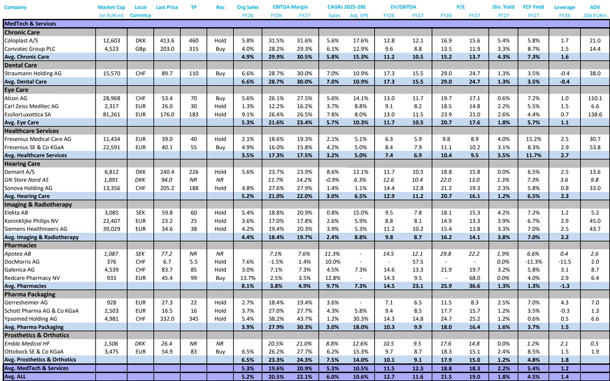
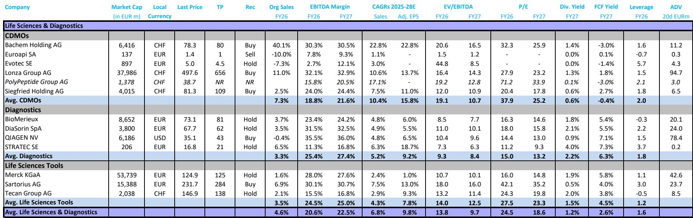
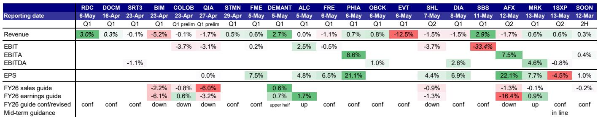

# 欧洲医疗科技板块的估值底部已经出现，但市场需要的不只是一个好季度

过去一个季度，欧洲医疗科技与生命科学板块的财报表现可以用一个词概括：勉强及格。营收大致符合预期，调整后每股收益多数超预期，但这背后有大量非经营性项目的功劳——更低的利息支出和税率在帮忙。与此同时，2026年和2027年的全年盈利预测仍在被下调，板块估值持续承压。

但某外资投行最新发布的行业更新报告，提出了一个值得认真对待的判断：正因为预期已经低到极致、投资者持仓极轻，任何一点盈利修正的上行，都可能触发一轮估值修复。报告认为，板块估值可能已经触及本轮周期的底部。

这不是一个激进的看多信号，而是一个基于概率和结构的判断。它不依赖需求端的强劲复苏，而是建立在“利空已基本定价、边际改善足以改变叙事”的逻辑上。对于关注欧洲医疗科技资产的投资者来说，这份报告提供了一个关键的观察框架：市场真正在等待的，不是奇迹，而是几个季度的稳定。

## 1. 盈利预期持续下修，但下修速度正在收窄，这本身就是信号

报告中最直观的一张图，是覆盖范围内公司2026年和2027年调整后净利润预期的走势。自2025年初以来，两条曲线几乎同步、持续地向下倾斜，没有出现过一次像样的反弹。到2026年4月，预期水平已较2025年初下降了约15%。

这种持续下修，反映了过去一年多重压力的叠加：后疫情时代的去库存、中国市场的结构性放缓、中东冲突带来的供应链扰动，以及美国医保报销政策的调整。每一轮财报季后，分析师都在下调数字。

但报告隐含了一个重要观察：下修的斜率正在变缓。从2025年下半年的快速下调，到2026年第一季度末的趋稳，预期调整的节奏本身在发生变化。对于经验丰富的投资者来说，盈利预测从“加速下修”转为“减速下修”，往往是估值筑底的前奏。不是因为基本面变好了，而是因为坏消息的增量在减少。

这意味着，板块的定价已经不再需要更低的预期来匹配。市场下一步需要回答的问题是：预期还能更差吗？如果答案是否定的，那么当前的低估值就具备了均值回归的潜力。

## 2. 估值已经回到历史低位，但低估值本身不是买入理由

报告显示，板块的远期市盈率在2026年1月已降至约18倍，而2021年峰值时曾超过38倍。从2024年中的27倍到现在的18倍，估值收缩的速度和幅度都相当显著。

但低估值从来不是充分的买入理由。真正重要的是：这个低估值反映了什么，以及它是否过度反映了负面因素。

从报告的分析来看，当前估值中已经包含了相当多的悲观预期。以报告中的几个重点推荐标的为例：Fresenius SE的交易价格仅为2027年预期市盈率的10倍，而报告认为其具备高个位数盈利增长、防御性终端市场、健康的资产负债表和改善的资本回报率。Lonza的交易价格约为22倍，低于其历史25-38倍的区间。Ottobock仅为15倍，而报告预期其将继续实现双位数盈利增长。

这些估值水平，隐含了市场对这些公司未来一到两年盈利增长的低预期，甚至是对某些结构性风险的过度定价。比如Fresenius SE面临的德国医疗改革不确定性，报告认为“潜在影响可能远小于最初担忧的程度”。如果这一判断成立，那么当前的估值就提供了安全边际。

但问题在于，低估值何时才能被纠正？这取决于催化剂。而催化剂，恰恰是这份报告花了大量篇幅分析、但尚未给出明确答案的部分。

## 3. Q1财报季的核心矛盾：利润超预期，但收入没有跟上

报告对刚刚结束的Q1财报季做了细致的量化分析。营收方面，覆盖公司的平均偏差为-0.6%，中位数为+0.3%，整体呈现“大致符合预期但略偏软”的状态。而调整后每股收益的平均偏差为+7.0%，中位数为+6.5%。

这种“利润超预期、收入未超预期”的组合，本身就值得警惕。报告明确指出，利润超预期“经常得到低于预期的利息支出和税率的支持”。换句话说，这些超额利润不是来自运营改善，而是来自财务层面的“运气”。

更深层的问题是：收入端的疲软意味着终端需求仍然不温不火。如果收入不能加速增长，利润的超预期就难以持续。这也是为什么尽管Q1财报季大部分公司实现了EPS超预期，但全年盈利指引的修订方向仍然偏向下行——5家公司下调指引，仅3家上调。

报告将这种局面总结为“预期已经很低，但市场需要看到不止一个季度的稳定才会重新参与”。这是一个审慎的判断。它意味着，即使Q1的EPS超预期是真实的运营改善，市场也需要至少两个季度的连续验证才会改变对板块的整体看法。

## 4. 子行业分化明显：CDMO和生命科学工具相对清晰，诊断和慢性护理仍在迷雾中

报告对几个子行业的分析，揭示了板块内部显著的分化格局，这为投资者的选股提供了重要线索。

CDMO（合同开发与生产组织）是报告最看好的子行业之一。核心逻辑是：该板块很大程度上不受地缘政治和关税影响，对中国敞口有限，且有望受益于美国制药生产回流这一多年趋势。此外，2026年的能源成本大多已对冲，CDMO通常有能力将成本上涨转嫁给客户。报告明确推荐Lonza、Siegfried和Bachem，其中Lonza是首要选择。

生命科学工具板块也呈现积极信号。生物工艺耗材需求已稳定并重回增长，受益于生物制药产能利用率的改善。但设备需求仅从低谷缓慢回升，客户对大型资本支出仍持谨慎态度。这意味着，具有强耗材敞口、订单动能积极、对中国实验室设备依赖度低的公司，将处于更有利的位置。

相比之下，诊断板块面临的是一个“困难的开始”。几乎每家公司的Q1业绩都令人失望，原因包括呼吸道检测季节疲弱、医院资本支出减少、移民检测量下降、中国结构性变化以及中东冲突导致的供应链中断。虽然多家公司已下调2026年指引，但大多数指引仍暗示下半年将出现显著改善——报告认为这种设定“不太有利”。

慢性护理领域同样承压。Coloplast面临的美国CMS全国性竞争招标政策，预计2028年1月生效，将影响其约一半的美国销售。收购的Kerecis伤口护理业务在Medicare报销政策变化后持续令人失望。报告选择“在场外观望”，等待新任CEO的战略更新。

这种分化意味着，板块整体的估值修复并非必然，它更可能以“强者恒强”的方式展开。那些终端市场清晰、结构性增长动力明确、且估值没有过度膨胀的子行业和公司，将率先吸引资金回流。

## 5. 报告尚未完全回答的关键问题：通胀和地缘政治风险如何演化

这份报告在给出积极判断的同时，也坦诚地列出了几个悬而未决的问题。其中最关键的两个是：中东冲突的持续及其可能引发的通胀上升，以及通胀对消费者支出和医疗设备采购的传导效应。

报告指出，如果中东冲突导致通胀再次抬头，将“无疑创造另一个逆风”。对于依赖消费者支出的牙科和眼科护理领域，通胀上升尤其危险。Straumann的增长依赖消费者在牙科植入上的弹性支出，EssilorLuxottica的AI眼镜预期也面临竞争加剧和消费疲软的双重压力。

另一个未被完全回答的问题是：美国医保政策的变化到底会带来多大影响？Coloplast面临的CMS竞争招标政策是一个具体案例，但这一政策是否会扩展到其他领域？报告没有给出明确判断，这需要后续政策进展来验证。

此外，诊断板块“下半年显著改善”的指引是否可信？报告对此持怀疑态度，但并未给出替代情景。这是一个值得持续跟踪的关键假设。

这些未解问题，恰恰是深入阅读完整报告、持续追踪行业动态的价值所在。它们不是报告的缺陷，而是市场定价中尚未被充分反映的不确定性。对于希望在这个板块中建立头寸的投资者来说，理解这些不确定性并形成自己的判断，比简单地接受一个看多或看空结论更为重要。

## 6. 投资者的观察框架：三个维度判断估值修复的时机

基于报告的分析，我们可以提炼出一个简洁的观察框架，用于判断欧洲医疗科技板块估值修复的时机和路径。

第一个维度是盈利预期的方向。如果2026年Q2财报季后，全年盈利预期的下修趋势能够停止，甚至出现个别公司的上调，那么“预期已经见底”的判断将得到初步验证。投资者应重点关注那些指引保守、具有“beat-and-raise”潜力的公司，如报告提到的Ottobock。

第二个维度是收入增长的动能。利润超预期可以靠非经营性项目支撑，但收入增长必须来自真实的终端需求改善。投资者应追踪每个子行业的收入增速变化，特别是CDMO和生命科学工具板块的订单趋势。如果收入增长能够加速，板块的估值修复将具备更坚实的基础。

第三个维度是地缘政治和通胀的路径。这是最大的外部变量。如果中东冲突升级导致能源价格和通胀预期再次上升，那么板块的估值修复可能被推迟甚至逆转。反之，如果地缘风险缓解，通胀继续温和回落，那么当前的低估值将吸引更多资金流入。

这三个维度交织在一起，决定了板块的短期走势。当前，我们可能正处于一个“利空已定价、利好尚未兑现”的窗口期。这个窗口期的长度和走向，取决于未来几个季度的实际数据。

---

这份报告的核心价值，不在于给出了一个明确的买入信号，而在于提供了一个分析框架：在预期极低、估值极低、投资者持仓极轻的背景下，哪些变量是关键的，哪些风险是尚未定价的。对于希望在这个板块中寻找机会的投资者来说，理解这个框架，比获取一份股票清单更为重要。

报告中的完整分析还包括对每家重点覆盖公司的详细财务模型、估值对比和风险情景分析。这些内容无法在一篇导读中完全展开，但正是深入理解板块机会与风险的关键。

欢迎来星球微信群里继续讨论：Q2财报季即将到来，哪些信号会验证或推翻“估值底部”的判断？哪些公司的指引调整值得特别关注？我们会在群内持续跟踪这些动态，并分享更完整的原始报告解读与数据图表。

Personal reading notes and learning share only. Not investment advice.

