# US WEEKLY KICKSTART

# Hedge funds and mutual funds continue their rotations from Software to Semiconductors

This week we published our Hedge Fund Trend Monitor and Mutual Fundamentals reports, which analyze \$9 trillion of equity positions at the start of Q2 2026.   
Only $30\%$ of large-cap mutual funds have outperformed their benchmarks YTD compared with the average of $37\%$ since 2007. Hedge funds have benefited from the Q2 market rebound and returned $7\%$ YTD, according to data from GS Prime Services.   
Mutual funds have increased cash allocations amid the rise in geopolitical tensions. Hedge funds cut net leverage initially but have since lifted net exposure to a one-year high. Hedge fund gross leverage remains elevated relative to history and the median S&P 500 stocks carries short interest equal to $3\%$ of market cap, the highest level since 2011.   
Funds agree on most sectors, with Industrials ranking as one of the most overweight sectors and Info Tech as the most underweight sector. The exception to the consensus are Financials, where mutual funds are overweight but hedge funds are underweight, and Consumer Discretionary, where hedge funds are overweight but mutual funds are underweight.   
Hedge funds and mutual funds have continued their recent portfolio rotations away from Software and toward Semis. The weight of Semis in the hedge fund long portfolio is the highest on record while the weight of Software is the lowest since 2019. Mutual funds carry the widest underweight in Software ex. MSFT since 2012. Both mutual funds and hedge funds reduced positions on net in MSFT during Q2. Among Semis stocks, hedge funds added to LRCX, AMAT, and ASML on net while mutual funds added to INTC and SITM.   
There are four “shared favorites” this quarter that register as popular holdings in both hedge fund and mutual fund portfolios: BA, MA, MRVL, V. These stocks have returned 10% YTD, outperforming the equal-weight S&P 500 by 3 pp.

# Ben Snider

+1(212)357-1744 | ben.snider@gs.com
GS & Co. LLC

# Ryan Hammond

+1(212)902-5625 | ryan.hammond@gs.com GS & Co. LLC

# Jenny Ma

+1(212)357-5775 | jenny.ma@gs.com
GS & Co. LLC

# Daniel Chavez

+1(212)357-7657 | daniel.chavez@gs.com GS & Co. LLC

# Kartik Jayachandran

+1(212)855-7744 |  
kartik.jayachandran@gs.com  
GS & Co. LLC

# Christophe Sung

+1(212)902-3841 | christophe.sung@gs.com GS & Co. LLC

# Comparing hedge fund and mutual fund positioning

This week we published our Hedge Fund Trend Monitor and Mutual Fundamentals reports, which analyze holdings at the start of Q2 2026. Our analyses cover 1,059 hedge funds with \$4.6 trillion of gross equity positions (\$3.1 trillion long, \$1.5 trillion short) and 509 large-cap active mutual funds with \$3.9 trillion in equity assets.

US equity hedge funds have ridden the recent wave of Momentum outperformance to deliver solid YTD absolute returns while most mutual funds have struggled to keep pace with rising benchmarks. According to estimates from GS Prime Services, US equity long/short funds have returned $7 \%$ YTD, supported by beta and long alpha. Our basket of Hedge Fund popular long positions (GSTHHVIP) has returned $13 \%$ compared with $7 \%$ for the equal- weight S&P 500 and $27 \%$ for a basket of stocks with concentrated short interest. The average large-cap mutual fund has returned $7 \%$ YTD, but only $30 \%$ of funds are outperforming their benchmarks, below the historical average of $37 \%$ .

Exhibit 1: Equity hedge funds have returned $7\%$ YTD   
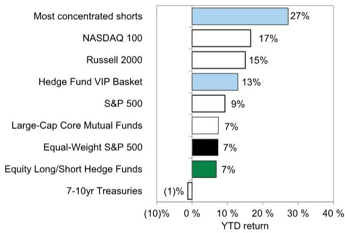

bar

| Category | YTD return (%) |
|---|---|
| Most concentrated shorts | 27 |
| NASDAQ 100 | 17 |
| Russell 2000 | 15 |
| Hedge Fund VIP Basket | 13 |
| S&P 500 | 9 |
| Large-Cap Core Mutual Funds | 7 |
| Equal-Weight S&P 500 | 7 |
| Equity Long/Short Hedge Funds | 7 |
| 7-10yr Treasuries | (1) |

Source: FactSet, GS Global Investment Research

Exhibit 2: $30\%$ of large-cap mutual funds have outperformed benchmarks   
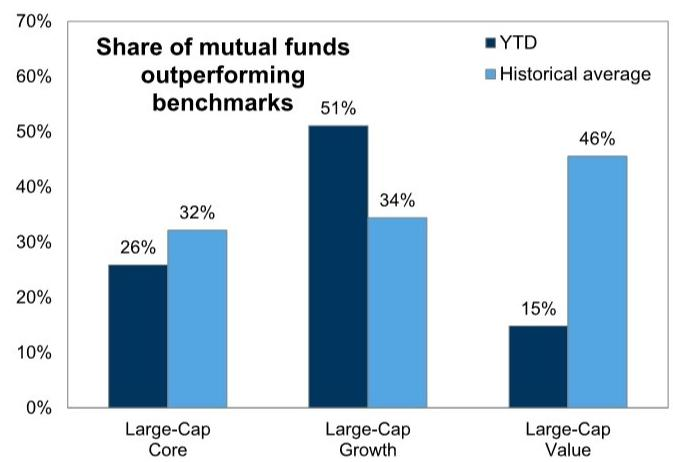

bar

Share of mutual funds outperforming benchmarks
| Category | YTD (%) | Historical average (%) |
|---|---|---|
| Large-Cap Core | 26 | 32 |
| Large-Cap Growth | 51 | 34 |
| Large-Cap Value | 15 | 46 |

Source: FactSet, GS Global Investment Research

Hedge funds and mutual funds each carry above-average equity market exposures. Hedge funds and mutual funds initially reduced exposure to US equities at the onset of geopolitical tensions in March but hedge funds have since lifted net leverage to the 85th percentile relative to the last five years. Although mutual funds lifted cash allocations from a record low of $1.1\%$ at the start of 2026 to $1.4\%$ at the start of April, cash balances as a share of assets still remain extremely low relative to history.

Exhibit 3: Hedge fund and mutual fund exposure to equities   
hedge fund data as of May 21, 2026; mutual fund data as of March 31, 2026   
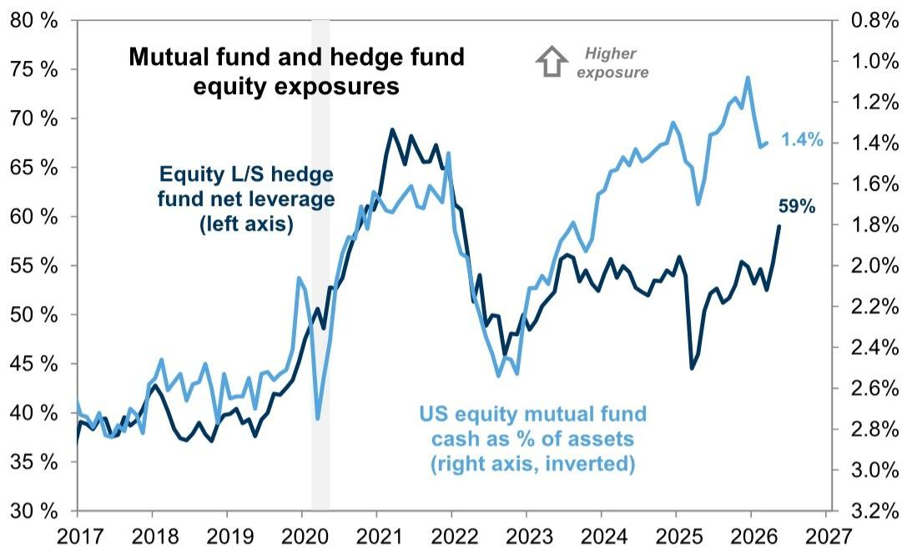

line

| Year | US equity mutual fund cash as % of assets (right axis, inverted) | Equity L/S hedge fund net leverage (left axis) |
|------|------------------------------------------------------------------------|-----------------------------------------------|
| 2027 | 59%                                                                    | 1.4%                                          |

Source: ICI, GS Prime Services, GS Global Investment Research

The most recent positioning filings show that funds agree on most sectors, with the exceptions of Consumer Discretionary and Financials. Consumer Discretionary is a mutual fund underweight relative to benchmarks but a hedge fund overweight relative to the Russell 3000, while Financials is a mutual fund overweight but a hedge fund underweight.

Hedge funds and mutual funds are both overweight Industrials and underweight Info Tech but have moved in opposite directions. Hedge funds increased net tilts to Info Tech by +853 bp during Q1, the sector's largest change on record, and reduced net tilts to Industrials by -297 bp. In contrast, mutual funds increased exposure to Industrials (+24 bp) while cutting Info Tech (-20 bp).

Exhibit 4: Hedge fund vs. mutual fund sector positions   
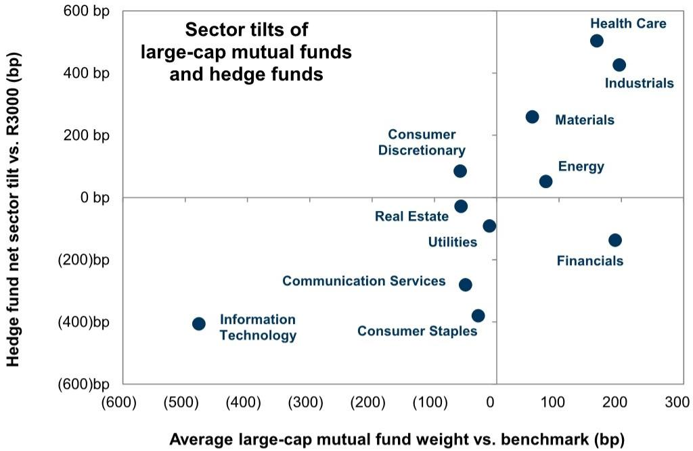

scatter

Sector tilts of large-cap mutual funds and hedge funds
| Sector | Average large-cap mutual fund weight (bp) | Hedge fund net sector tilt vs. R3000 (bp) |
| :--- | :--- | :--- |
| Health Care | 170 | 500 |
| Industrials | 210 | 420 |
| Materials | 70 | 250 |
| Energy | 90 | 50 |
| Financials | 200 | -100 |
| Consumer Discretionary | 130 | 80 |
| Real Estate | 130 | -20 |
| Utilities | 0 | -80 |
| Communication Services | -60 | -250 |
| Consumer Staples | -40 | -400 |
| Information Technology | -550 | -400 |

Source: FactSet, GS Global Investment Research

Within the Info Tech sector, hedge fund and mutual fund positioning has mirrored the broader market shift away from Software and toward Semiconductors. Mutual funds entered Q2 carrying their lowest exposure to Software since at least 2012.

Excluding the mega-caps, the mutual fund tilt in Semis vs. Software is the largest since 2012. Similarly, hedge funds entered Q2 with Software registering its smallest weight in the hedge fund long portfolio since 2019 and the weight of Semis at a record high.

At the stock level, MSFT ranked as one of the largest reductions on a net shares basis among both hedge funds and mutual funds last quarter. Mutual funds also reduced ownership in each of the other Magnificent 7 stocks. Hedge funds reduced positions in most of the Magnificent 7 but increased ownership on net in META and AAPL. Within Semis, Hedge funds added to LRCX, AMAT, and ASML while mutual funds added to INTC and SITM.

Exhibit 5: Mutual funds and hedge funds have rotated from Software to Semis   
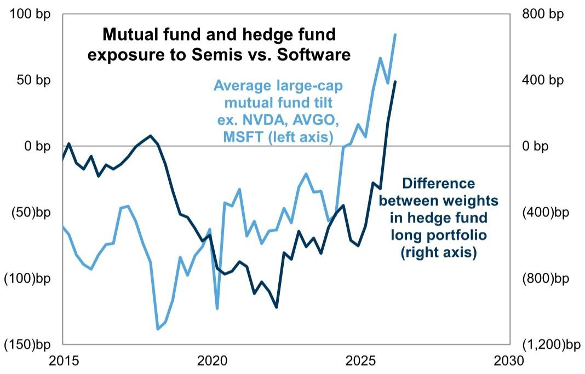

line

| Year | Average large-cap mutual fund tilt ex. NVDA, AVGO, MSFT (left axis) | Difference between weights in hedge fund long portfolio (right axis) |
|------|------------------------------------------------------------------------|------------------------------------------------------------------|
| 2015 | ~0 bp                                                                 | ~(400) bp                                                                       |
| 2020 | ~-50 bp                                                                | ~(-800) bp                                                                      |
| 2025 | ~50 bp                                                                 | ~(800) bp                                                                       |
| 2030 | ~100 bp                                                                | ~(1,200) bp                                                                      |

Source: FactSet, GS Global Investment Research

There are four “shared favorites” this quarter: BA, MA, MRVL, V. Shared favorites are constituents of both Hedge Fund VIP (GSTHHVIP) and Mutual Fund Overweights (GSTHMFOW). MRVL entered the list this quarter while C and VRT dropped out. Each of the Magnificent 7 constituents screen as a Hedge Fund VIP but also as a Mutual Fund Underweight.

Exhibit 6: Overlap between our mutual fund and hedge fund baskets   
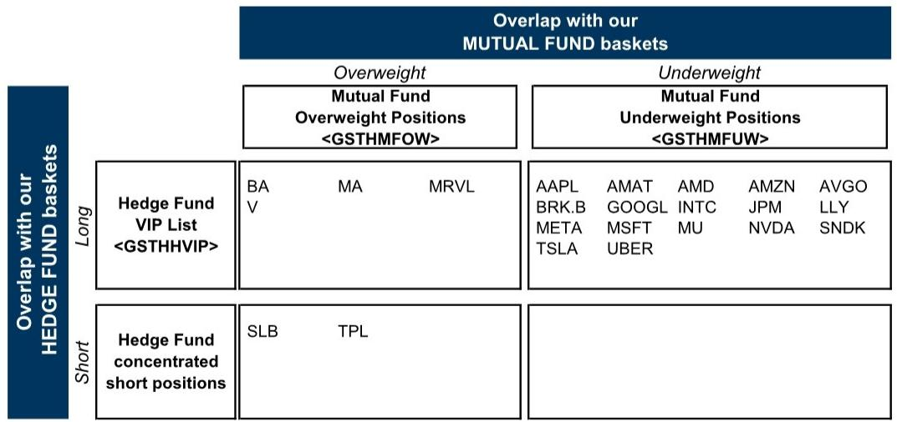

flowchart

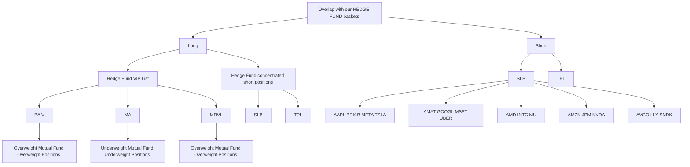
```mermaid
graph TD
    A["Overlap with our HEDGE FUND baskets"] --> B["Long"]
    A --> C["Short"]
    B --> D["Hedge Fund VIP List <GSTHHVIP>"]
    B --> E["Hedge Fund concentrated short positions"]
    C --> F["SLB"]
    C --> G["TPL"]
    D --> H["BA V"]
    D --> I["MA"]
    D --> J["MRVL"]
    E --> K["SLB"]
    E --> L["TPL"]
    F --> M["AAPL BRK.B META TSLA"]
    F --> N["AMAT GOOGL MSFT UBER"]
    F --> O["AMD INTC MU"]
    F --> P["AMZN JPM NVDA"]
    F --> Q["AVGO LLY SNDK"]
    H --> R["Overweight Mutual Fund Overweight Positions <GSTHMFOW>"]
    I --> S["Underweight Mutual Fund Underweight Positions <GSTHMFUW>"]
    J --> T["Overweight Mutual Fund Overweight Positions <GSTHMFOW>"]
```

Source: GS Global Investment Research

Shared favorites have returned 10% YTD, outperforming the equal-weight S&P 500 by 3 pp. The stocks that are both hedge fund and mutual fund favorites have a track record of outperformance but at the expense of higher volatility. Since 2013, shared favorites have delivered an annual return of 16% with a standard deviation of 22%. The median shared favorite stock trades at a substantial P/E premium to the median S&P 500

stock (34x vs. 18x).

Exhibit 7: Mutual fund and hedge fund “shared favorites” have returned 10% YTD   
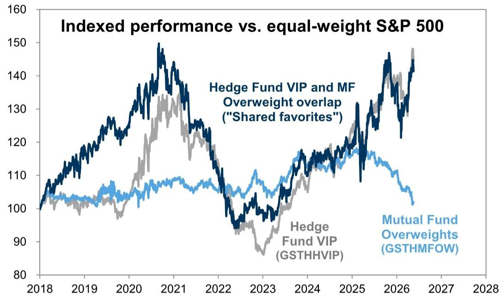

line

| Year | Hedge Fund VIP and MF Overweight overlap ("Shared favorites") | Hedge Fund VIP (GSTHHVIP) | Mutual Fund Overweights (GSTHMFOW) |
|------|------------------------------------------------------------------------|---------------------------|------------------------------------|
| 2018 | 100                                                                    | 100                       | 100                                |
| 2019 | ~115                                                                   | ~105                      | ~105                               |
| 2020 | ~130                                                                   | ~110                      | ~108                               |
| 2021 | ~145                                                                   | ~135                      | ~110                               |
| 2022 | ~105                                                                   | ~105                      | ~105                               |
| 2023 | ~95                                                                    | ~90                       | ~100                               |
| 2024 | ~115                                                                   | ~110                      | ~115                               |
| 2025 | ~130                                                                   | ~125                      | ~118                               |
| 2026 | ~145                                                                   | ~140                      | ~115                               |
| 2027 | ~148                                                                   | ~145                      | ~105                               |
| 2028 | ~150                                                                   | ~148                      | ~100                               |

Source: FactSet, GS Global Investment Research

Exhibit 8: S&P 500 Q1 2026 earnings results

as of May 22, 2026

<table><tr><td colspan="13">S&amp;P 500 EQUAL-WEIGHTED</td></tr><tr><td rowspan="3"></td><td rowspan="2" colspan="3">Number of Companies</td><td colspan="6">EARNINGS</td><td colspan="3">REVENUE</td></tr><tr><td colspan="3">Std Dev Surprises</td><td colspan="2">Absolute Surprises</td><td rowspan="2">Avg 1Q Surprise</td><td colspan="2">Std Dev Surprises</td><td rowspan="2">Avg 1Q Surprise</td></tr><tr><td>Reported</td><td>Total</td><td>% of Co&#x27;s</td><td>Positive</td><td>Negative</td><td>In-Line</td><td>Positive</td><td>Negative</td><td>Positive</td><td>Negative</td></tr><tr><td>Information Technology</td><td>62</td><td>73</td><td>85%</td><td>77 %</td><td>0 %</td><td>21 %</td><td>100 %</td><td>0 %</td><td>10 %</td><td>79 %</td><td>2 %</td><td>3 %</td></tr><tr><td>Consumer Staples</td><td>28</td><td>36</td><td>78</td><td>75</td><td>4</td><td>21</td><td>89</td><td>7</td><td>14</td><td>68</td><td>4</td><td>2</td></tr><tr><td>Health Care</td><td>55</td><td>59</td><td>93</td><td>71</td><td>5</td><td>24</td><td>84</td><td>15</td><td>8</td><td>65</td><td>11</td><td>3</td></tr><tr><td>Materials</td><td>26</td><td>26</td><td>100</td><td>69</td><td>4</td><td>27</td><td>73</td><td>23</td><td>18</td><td>62</td><td>0</td><td>4</td></tr><tr><td>Real Estate</td><td>31</td><td>31</td><td>100</td><td>68</td><td>6</td><td>26</td><td>77</td><td>23</td><td>57</td><td>23</td><td>3</td><td>4</td></tr><tr><td>Industrials</td><td>79</td><td>79</td><td>100</td><td>67</td><td>4</td><td>29</td><td>82</td><td>9</td><td>7</td><td>61</td><td>5</td><td>3</td></tr><tr><td>Consumer Discretionary</td><td>45</td><td>48</td><td>94</td><td>60</td><td>7</td><td>33</td><td>80</td><td>16</td><td>16</td><td>40</td><td>16</td><td>1</td></tr><tr><td>Financials</td><td>76</td><td>76</td><td>100</td><td>57</td><td>5</td><td>36</td><td>82</td><td>14</td><td>5</td><td>37</td><td>21</td><td>1</td></tr><tr><td>Communication Services</td><td>20</td><td>20</td><td>100</td><td>55</td><td>20</td><td>25</td><td>70</td><td>30</td><td>0</td><td>60</td><td>0</td><td>2</td></tr><tr><td>Utilities</td><td>31</td><td>31</td><td>100</td><td>39</td><td>6</td><td>55</td><td>71</td><td>23</td><td>9</td><td>32</td><td>3</td><td>5</td></tr><tr><td>Energy</td><td>21</td><td>21</td><td>100</td><td>38</td><td>10</td><td>52</td><td>71</td><td>24</td><td>21</td><td>24</td><td>5</td><td>4</td></tr><tr><td>S&amp;P 500</td><td>474</td><td>500</td><td>95%</td><td>64 %</td><td>5 %</td><td>31 %</td><td>82 %</td><td>14 %</td><td>13 %</td><td>52 %</td><td>8 %</td><td>3 %</td></tr><tr><td colspan="13">Comparative Data (full earnings season)</td></tr><tr><td>4Q 2025</td><td></td><td></td><td></td><td>55 %</td><td>12 %</td><td>33 %</td><td>73 %</td><td>23 %</td><td>11 %</td><td>51 %</td><td>13 %</td><td>2 %</td></tr><tr><td>3Q 2025</td><td></td><td></td><td></td><td>66</td><td>8</td><td>26</td><td>82</td><td>15</td><td>10</td><td>52</td><td>9</td><td>2</td></tr><tr><td>2Q 2025</td><td></td><td></td><td></td><td>60</td><td>9</td><td>31</td><td>78</td><td>17</td><td>9</td><td>53</td><td>7</td><td>2</td></tr><tr><td>1Q 2025</td><td></td><td></td><td></td><td>54</td><td>11</td><td>35</td><td>73</td><td>22</td><td>7</td><td>36</td><td>15</td><td>1</td></tr><tr><td colspan="13">S&amp;P 500 CAP-WEIGHTED</td></tr><tr><td rowspan="3"></td><td rowspan="2" colspan="3">Weight of Companies</td><td colspan="6">EARNINGS</td><td colspan="3">REVENUE</td></tr><tr><td colspan="3">Std Dev Surprises</td><td colspan="2">Absolute Surprises</td><td rowspan="2">Avg 1Q Surprise</td><td colspan="2">Std Dev Surprises</td><td rowspan="2">Avg 1Q Surprise</td></tr><tr><td>Reported</td><td>Total</td><td>% of Co&#x27;s</td><td>Positive</td><td>Negative</td><td>In-Line</td><td>Positive</td><td>Negative</td><td>Positive</td><td>Negative</td></tr><tr><td>Communication Services</td><td>11</td><td>11</td><td>100%</td><td>96 %</td><td>2 %</td><td>2 %</td><td>97 %</td><td>3 %</td><td>68 %</td><td>94 %</td><td>0 %</td><td>2 %</td></tr><tr><td>Information Technology</td><td>33</td><td>37</td><td>88</td><td>95</td><td>0</td><td>5</td><td>100</td><td>0</td><td>8</td><td>94</td><td>0</td><td>4</td></tr><tr><td>Materials</td><td>2</td><td>2</td><td>100</td><td>78</td><td>1</td><td>21</td><td>84</td><td>11</td><td>15</td><td>78</td><td>0</td><td>4</td></tr><tr><td>Health Care</td><td>8</td><td>8</td><td>97</td><td>72</td><td>3</td><td>24</td><td>91</td><td>6</td><td>9</td><td>65</td><td>8</td><td>4</td></tr><tr><td>Industrials</td><td>8</td><td>8</td><td>100</td><td>71</td><td>3</td><td>26</td><td>87</td><td>6</td><td>10</td><td>56</td><td>6</td><td>3</td></tr><tr><td>Consumer Discretionary</td><td>10</td><td>10</td><td>99</td><td>67</td><td>1</td><td>32</td><td>97</td><td>2</td><td>36</td><td>55</td><td>3</td><td>1</td></tr><tr><td>Financials</td><td>12</td><td>12</td><td>100</td><td>64</td><td>2</td><td>33</td><td>81</td><td>17</td><td>6</td><td>65</td><td>13</td><td>2</td></tr><tr><td>Consumer Staples</td><td>5</td><td>5</td><td>96</td><td>61</td><td>1</td><td>38</td><td>98</td><td>1</td><td>6</td><td>78</td><td>1</td><td>2</td></tr><tr><td>Real Estate</td><td>2</td><td>2</td><td>100</td><td>49</td><td>7</td><td>44</td><td>74</td><td>26</td><td>28</td><td>33</td><td>9</td><td>4</td></tr><tr><td>Utilities</td><td>2</td><td>2</td><td>100</td><td>41</td><td>5</td><td>54</td><td>76</td><td>18</td><td>10</td><td>33</td><td>4</td><td>5</td></tr><tr><td>Energy</td><td>3</td><td>3</td><td>100</td><td>18</td><td>5</td><td>76</td><td>53</td><td>44</td><td>11</td><td>11</td><td>3</td><td>2</td></tr><tr><td>S&amp;P 500</td><td>95</td><td>100</td><td>95%</td><td>78 %</td><td>2 %</td><td>21 %</td><td>92 %</td><td>6 %</td><td>18 %</td><td>74 %</td><td>3 %</td><td>3 %</td></tr></table>

Source: FactSet, GS Global Investment Research

Pricing as of May 21, 2026, unless otherwise noted.

Exhibit 9: GS top-down S&P 500 forecasts   
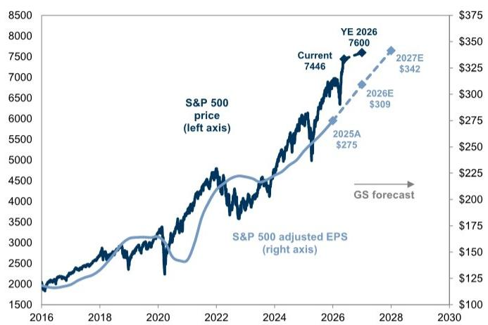

line

| Year | S&P 500 price (left axis) | S&P 500 adjusted EPS |
|------|---------------------------|----------------------|
| 2025A | 275 | - |
| 2026E | 309 | - |
| YE 2026 | 7600 | - |
| 2027E | - | $342 |

Source: FactSet, GS Global Investment Research

Exhibit 10: GS and consensus forecasts for S&P 500 earnings and returns 

<table><tr><td></td><td>GS forecast</td><td>Bottom-up analyst consensus</td><td>Top-down strategist consensus</td></tr><tr><td colspan="4">S&amp;P 500 EPS</td></tr><tr><td>2025</td><td>$275</td><td>$275</td><td>$275</td></tr><tr><td>Y/Y growth</td><td>12 %</td><td>12 %</td><td>12 %</td></tr><tr><td>2026</td><td>$309</td><td>$339</td><td>$320</td></tr><tr><td>Y/Y growth</td><td>12 %</td><td>23 %</td><td>16 %</td></tr><tr><td>2027</td><td>$342</td><td>$392</td><td>$363</td></tr><tr><td>Y/Y growth</td><td>10 %</td><td>16 %</td><td>13 %</td></tr><tr><td colspan="4">S&amp;P 500 P/E</td></tr><tr><td>Current on NTM EPS</td><td>23x</td><td>21x</td><td>22x</td></tr><tr><td colspan="4">S&amp;P 500 price target</td></tr><tr><td>YE 2026</td><td>7600</td><td rowspan="2">NA</td><td>7600</td></tr><tr><td>Return to target</td><td>2 %</td><td>2 %</td></tr></table>

Source: Bloomberg, FactSet, GS Global Investment Research

# Biggest stock movers this week

Exhibit 11: S&P 500 stocks with the largest moves this week as of May 22, 2026 

<table><tr><td rowspan="2">Company</td><td rowspan="2">Ticker</td><td rowspan="2">Industry group</td><td colspan="4">Total return</td><td rowspan="2">Market cap (bn)</td><td rowspan="2">Consensus 2026 EPS growth</td><td rowspan="2">Fwd 12m P/E</td></tr><tr><td>This week</td><td>3m</td><td>6m</td><td>12m</td></tr><tr><td colspan="10">Top 10 returns this week</td></tr><tr><td>Dell Technologies</td><td>DELL</td><td>Tech Hardware &amp; Equipment</td><td>22 %</td><td>112 %</td><td>87 %</td><td>127 %</td><td>$165</td><td>23 %</td><td>23x</td></tr><tr><td>HP Inc.</td><td>HPQ</td><td>Tech Hardware &amp; Equipment</td><td>22</td><td>10</td><td>(13)</td><td>(24)</td><td>20</td><td>(17)</td><td>9</td></tr><tr><td>Skyworks Solutions</td><td>SWKS</td><td>Semiconductors &amp; Semi Equip</td><td>19</td><td>9</td><td>3</td><td>(3)</td><td>11</td><td>(17)</td><td>17</td></tr><tr><td>QUALCOMM Inc.</td><td>QCOM</td><td>Semiconductors &amp; Semi Equip</td><td>18</td><td>43</td><td>16</td><td>34</td><td>225</td><td>(19)</td><td>24</td></tr><tr><td>DexCom Inc.</td><td>DXCM</td><td>Health Care Equipment &amp; Svcs</td><td>17</td><td>(17)</td><td>(0)</td><td>(33)</td><td>28</td><td>36</td><td>27</td></tr><tr><td>NetApp Inc.</td><td>NTAP</td><td>Tech Hardware &amp; Equipment</td><td>17</td><td>18</td><td>11</td><td>23</td><td>24</td><td>9</td><td>17</td></tr><tr><td>International Bus. Machines</td><td>IBM</td><td>Software &amp; Services</td><td>16</td><td>(16)</td><td>(28)</td><td>(13)</td><td>238</td><td>7</td><td>20</td></tr><tr><td>Ralph Lauren Corp.</td><td>RL</td><td>Consumer Durables &amp; Apparel</td><td>16</td><td>(9)</td><td>1</td><td>25</td><td>23</td><td>9</td><td>21</td></tr><tr><td>Williams-Sonoma</td><td>WSM</td><td>Consumer Discretionary Retail</td><td>14</td><td>(19)</td><td>(4)</td><td>3</td><td>23</td><td>3</td><td>20</td></tr><tr><td>Super Micro Computer</td><td>SMCI</td><td>Tech Hardware &amp; Equipment</td><td>14</td><td>8</td><td>(9)</td><td>(27)</td><td>20</td><td>66</td><td>12</td></tr><tr><td colspan="10">Bottom 10 returns this week</td></tr><tr><td>Intuit Inc.</td><td>INTU</td><td>Software &amp; Services</td><td>(19)%</td><td>(5)%</td><td>(43)%</td><td>(42)%</td><td>$84</td><td>12 %</td><td>12x</td></tr><tr><td>Vertiv Holdings</td><td>VRT</td><td>Capital Goods</td><td>(12)</td><td>60</td><td>120</td><td>244</td><td>124</td><td>54</td><td>48</td></tr><tr><td>EchoStar Corp.</td><td>SATS</td><td>Media &amp; Entertainment</td><td>(9)</td><td>19</td><td>100</td><td>493</td><td>37</td><td>NM</td><td>368</td></tr><tr><td>Regeneron Pharmaceuticals</td><td>REGN</td><td>Pharma Biotech &amp; Life Sciences</td><td>(9)</td><td>(11)</td><td>3</td><td>25</td><td>67</td><td>4</td><td>13</td></tr><tr><td>Walmart Inc.</td><td>WMT</td><td>Consumer Staples Retail</td><td>(9)</td><td>(1)</td><td>30</td><td>38</td><td>967</td><td>10</td><td>40</td></tr><tr><td>Comfort Systems USA</td><td>FIX</td><td>Capital Goods</td><td>(8)</td><td>53</td><td>125</td><td>338</td><td>65</td><td>49</td><td>42</td></tr><tr><td>Cummins Inc.</td><td>CMI</td><td>Capital Goods</td><td>(8)</td><td>20</td><td>56</td><td>119</td><td>88</td><td>31</td><td>21</td></tr><tr><td>Hasbro Inc.</td><td>HAS</td><td>Consumer Durables &amp; Apparel</td><td>(8)</td><td>(6)</td><td>25</td><td>52</td><td>13</td><td>6</td><td>15</td></tr><tr><td>Dow Inc.</td><td>DOW</td><td>Materials</td><td>(7)</td><td>21</td><td>74</td><td>37</td><td>26</td><td>NM</td><td>10</td></tr><tr><td>LyondellBasell Industries</td><td>LYB</td><td>Materials</td><td>(7)</td><td>29</td><td>68</td><td>35</td><td>23</td><td>475</td><td>6</td></tr><tr><td>Median S&amp;P 500 stock</td><td></td><td></td><td>3 %</td><td>(3)%</td><td>5 %</td><td>12 %</td><td>$42</td><td>10 %</td><td>18x</td></tr><tr><td>S&amp;P 500 Index</td><td></td><td></td><td>1</td><td>10</td><td>12</td><td>29</td><td>67,139</td><td>22</td><td>21</td></tr></table>

Source: FactSet, GS Global Investment Research

# YTD absolute and risk-adjusted returns

Exhibit 12: YTD asset returns and return/volatility ratios   
Total return (%)   
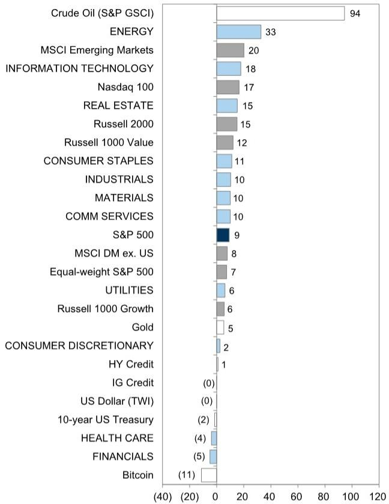

bar

| Category | Value |
|---|---|
| Crude Oil (S&P GSCI) | 94 |
| ENERGY | 33 |
| MSCI Emerging Markets | 20 |
| INFORMATION TECHNOLOGY | 18 |
| Nasdaq 100 | 17 |
| REAL ESTATE | 15 |
| Russell 2000 | 15 |
| Russell 1000 Value | 12 |
| CONSUMER STAPLES | 11 |
| INDUSTRIALS | 10 |
| MATERIALS | 10 |
| COMM SERVICES | 10 |
| S&P 500 | 9 |
| MSCI DM ex. US | 8 |
| Equal-weight S&P 500 | 7 |
| UTILITIES | 6 |
| Russell 1000 Growth | 6 |
| Gold | 5 |
| CONSUMER DISCRETIONARY | 2 |
| HY Credit | 1 |
| IG Credit | (0) |
| US Dollar (TWI) | (0) |
| 10-year US Treasury | (2) |
| HEALTH CARE | (4) |
| FINANCIALS | (5) |
| Bitcoin | (11) |

Risk-adjusted return (Return/realized volatility)   
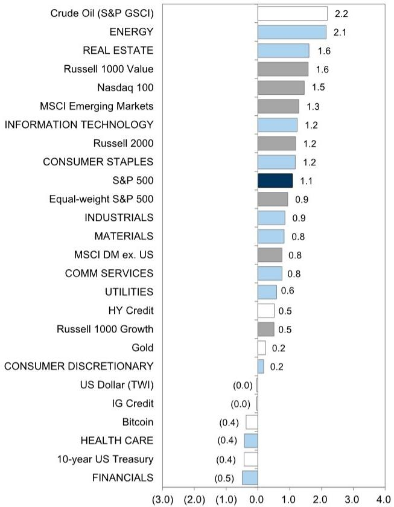

bar

| Category | Value |
|---|---|
| Crude Oil (S&P GSCI) | 2.2 |
| ENERGY | 2.1 |
| REAL ESTATE | 1.6 |
| Russell 1000 Value | 1.6 |
| Nasdaq 100 | 1.5 |
| MSCI Emerging Markets | 1.3 |
| INFORMATION TECHNOLOGY | 1.2 |
| Russell 2000 | 1.2 |
| CONSUMER STAPLES | 1.2 |
| S&P 500 | 1.1 |
| Equal-weight S&P 500 | 0.9 |
| INDUSTRIALS | 0.9 |
| MATERIALS | 0.8 |
| MSCI DM ex. US | 0.8 |
| COMM SERVICES | 0.8 |
| UTILITIES | 0.6 |
| HY Credit | 0.5 |
| Russell 1000 Growth | 0.5 |
| Gold | 0.2 |
| CONSUMER DISCRETIONARY | 0.2 |
| US Dollar (TWI) | (0.0) |
| IG Credit | (0.0) |
| Bitcoin | (0.4) |
| HEALTH CARE | (0.4) |
| 10-year US Treasury | (0.4) |
| FINANCIALS | (0.5) |

Crude oil represents S&P GSCI Crude Oil Index.   
Source: FactSet, Haver Analytics, GS Global Investment Research

Exhibit 13: GS US Equity Sentiment Indicator of investor positioning   
as of May 22, 2026   
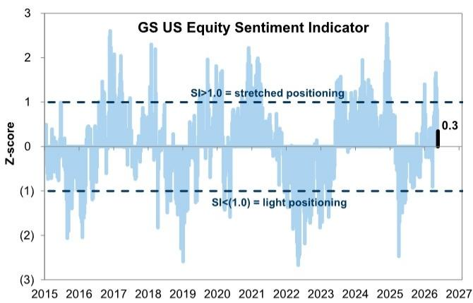

line

| Year | Z-score |
|------|---------|
| 2026 | 0.3     |

The Sentiment Indicator combines 9 measures of positioning across institutional, retail, and foreign investors and has historically been a statistically significant signal for near-term S&P 500 returns.   
Source: GS Global Investment Research

Exhibit 14: Recent mutual fund and ETF flows   
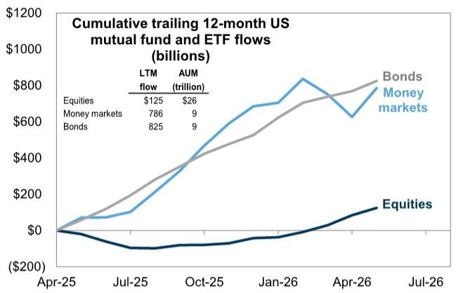

line

| Date   | Bonds (billion) | Money markets (billion) | Equities (billion) |
|--------|-----------------|--------------------------|--------------------|
| Apr-25 | $125            | $786                     | 825                |
| Jul-25 | $26             | $9                       |                    |
| Oct-25 |                 |                          |                    |
| Jan-26 |                 |                          |                    |
| Apr-26 |                 |                          |                    |
| Jul-26 |                 |                          |                    |

Source: EPFR, GS Global Investment Research

# Economic growth

Exhibit 15: US equity market internal pricing of economic growth   
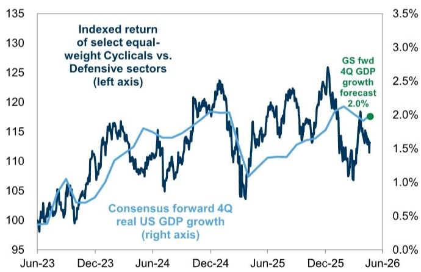

line

| Date    | Indexed return of select equal-weight Cyclicals vs. Defensive sectors (left axis) | Consensus forward 4Q real US GDP growth (right axis) |
|---------|------------------------------------------------------------------------|-----------------------------------------------------|
| Jun-23  | 100.0                                                                  | 0.0%                                                |
| Dec-23  | 115.0                                                                  | 1.0%                                                |
| Jun-24  | 118.0                                                                  | 1.5%                                                |
| Dec-24  | 122.0                                                                  | 1.8%                                                |
| Jun-25  | 115.0                                                                  | 1.5%                                                |
| Dec-25  | 125.0                                                                  | 2.0%                                                |
| Jun-26  | 118.0                                                                  | 2.0%                                                |

Source: Bloomberg, GS Global Investment Research

Exhibit 16: GS and consensus forecasts for US real GDP growth   
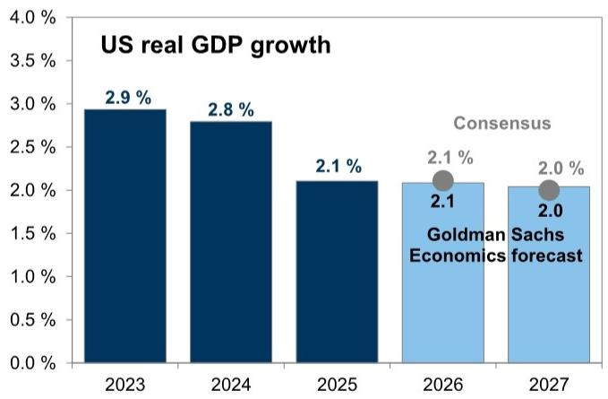

bar

US real GDP growth
| Year | Growth Rate (%) |
| :--- | :--- |
| 2023 | 2.9 |
| 2024 | 2.8 |
| 2025 | 2.1 |
| 2026 | 2.1 |
| 2027 | 2.0 |
Consensus: GS Economics forecast

Source: Bloomberg, GS Global Investment Research

# Interest rates and financial conditions

Exhibit 17: Market pricing of near-term and long-term interest rate outlook   
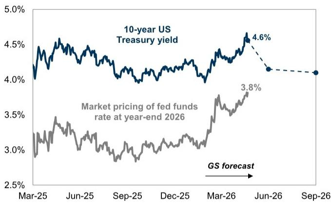

line

| Date    | 10-year US Treasury yield | Market pricing of fed funds rate at year-end 2026 |
|---------|---------------------------|--------------------------------------------------|
| Jun-26  | 4.6%                      | 3.8%                                             |

Source: GS Global Investment Research

Exhibit 18: GS Financial Conditions Index   
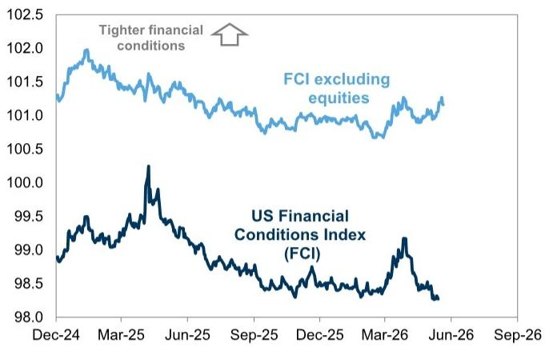

line

| Date    | FCI excluding equities | US Financial Conditions Index (FCI) |
|---------|------------------------|-------------------------------------|
| Dec-24  | ~101.3                 | ~98.9                               |
| Mar-25  | ~101.8                 | ~100.2                              |
| Jun-25  | ~101.4                 | ~99.0                               |
| Sep-25  | ~100.9                 | ~98.5                               |
| Dec-25  | ~100.7                 | ~98.3                               |
| Mar-26  | ~101.0                 | ~99.2                               |
| Jun-26  | ~101.2                 | ~98.2                               |

Source: GS Global Investment Research

# Market breadth and concentration

Exhibit 19: S&P 500 52-week market breadth   
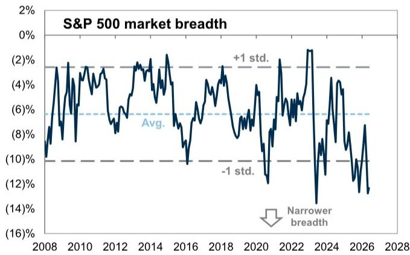

line

| Year | Value     |
|------|-----------|
| 2008 | -10%      |
| 2010 | -2%       |
| 2012 | -6%       |
| 2014 | -2%       |
| 2016 | -10%      |
| 2018 | -6%       |
| 2020 | -1%       |
| 2022 | -2%       |
| 2024 | -14%      |
| 2026 | -10%      |

Market breadth calculated as the difference between the distance of the aggregate S&P 500 Index from its 52-week high and the distance of the median S&P 500 constituent from its 52-week high. When the aggregate index is much closer to its 52-week high than is the median stock, market breadth is narrow.

Exhibit 20: Concentration of S&P 500 market cap and earnings in the 10 largest index constituents   
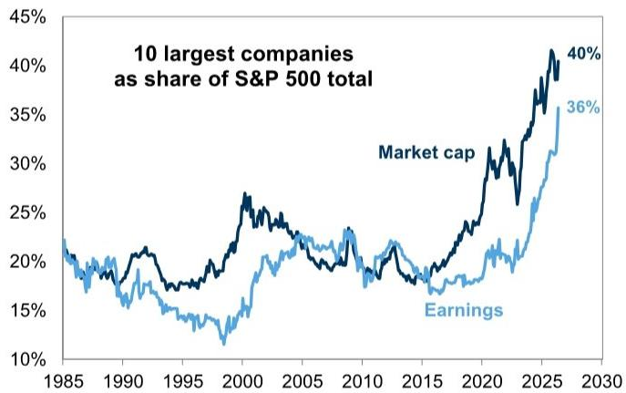

line

| Year | Market cap | Earnings |
|------|------------|----------|
| 2025 | 40%        | 36%      |

Earnings reflect consensus forward 12-month estimates.   
Source: Compustat, IBES, FactSet, GS Global Investment Research   
Source: GS Global Investment Research

# Correlation and volatility

Exhibit 21: S&P 500 realized average stock correlation   
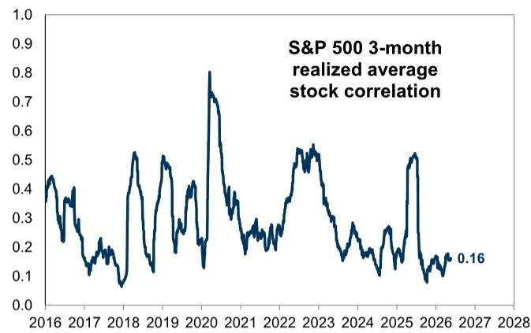

line

| Year | S&P 500 3-month realized average stock correlation |
| ---- | -------------------------------------------------- |
| 2028 | 0.16                                               |

Source: GS Global Investment Research

Exhibit 22: S&P 500 implied volatility   
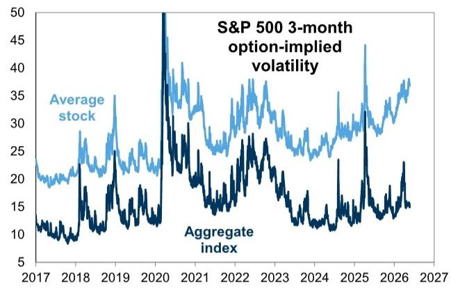

line

| Year | Average stock | Aggregate index |
|------|---------------|-----------------|
| 2017 | ~20           | ~10             |
| 2018 | ~25           | ~15             |
| 2019 | ~35           | ~20             |
| 2020 | ~50           | ~15             |
| 2021 | ~30           | ~25             |
| 2022 | ~35           | ~20             |
| 2023 | ~30           | ~15             |
| 2024 | ~25           | ~10             |
| 2025 | ~45           | ~15             |
| 2026 | ~35           | ~20             |
| 2027 | ~38           | ~15             |

Source: GS Global Investment Research

# IPO Barometer and mutual fund performance

Exhibit 23: GS IPO Barometer   
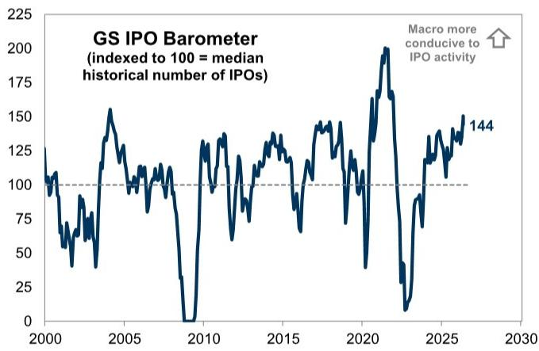

line

| Year | Value |
|------|-------|
| 2030 | 144   |

The GS IPO Barometer combines five indicators that gauge the conduciveness of the macro environment to IPO activity.

Exhibit 24: US equity mutual fund returns relative to benchmarks 

<table><tr><td>Mutual fund style</td><td>Average YTD return</td><td>% outperforming benchmarks YTD</td></tr><tr><td>Large-cap core</td><td>7%</td><td>26%</td></tr><tr><td>Large-cap growth</td><td>6</td><td>50</td></tr><tr><td>Large-cap value</td><td>8</td><td>15</td></tr><tr><td>Large-cap total</td><td>7%</td><td>30%</td></tr><tr><td>Small-cap core</td><td>12%</td><td>24%</td></tr></table>

Source: FactSet, GS Global Investment Research   
Source: GS Global Investment Research

Exhibit 25: Realized and consensus EPS growth for select US equity indices   
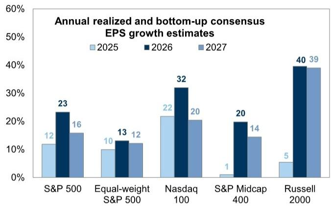

bar

Annual realized and bottom-up consensus EPS growth estimates
| Index | 2025 (%) | 2026 (%) | 2027 (%) |
|---|---|---|---|
| S&P 500 | 12 | 23 | 16 |
| Equal-weight S&P 500 | 10 | 13 | 12 |
| Nasdaq 100 | 22 | 32 | 20 |
| S&P Midcap 400 | 1 | 20 | 14 |
| Russell 2000 | 5 | 40 | 39 |

Source: FactSet, GS Global Investment Research

Exhibit 26: Realized and consensus year/year S&P 500 EPS growth   
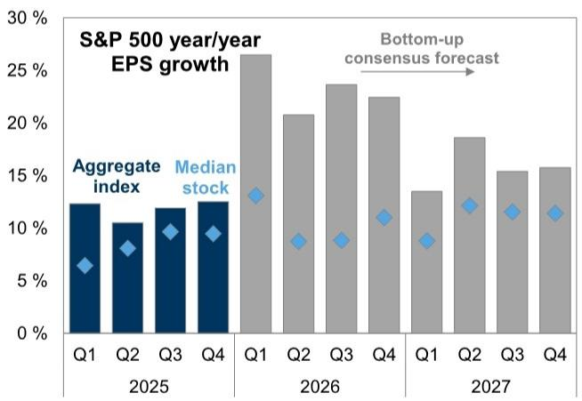

bar

| Quarter | Aggregate index | Median stock |
| ------- | --------------- | ------------ |
| Q1 2025 | 12%             | 6%           |
| Q2 2025 | 10%             | 8%           |
| Q3 2025 | 12%             | 9%           |
| Q4 2025 | 13%             | 9%           |
| Q1 2026 | 27%             | 13%          |
| Q2 2026 | 21%             | 9%           |
| Q3 2026 | 24%             | 9%           |
| Q4 2026 | 23%             | 11%          |
| Q1 2027 | 13%             | 9%           |
| Q2 2027 | 19%             | 12%          |
| Q3 2027 | 15%             | 11%          |
| Q4 2027 | 16%             | 11%          |

Source: FactSet, GS Global Investment Research

Exhibit 27: S&P 500 FY2 earnings revision breadth   
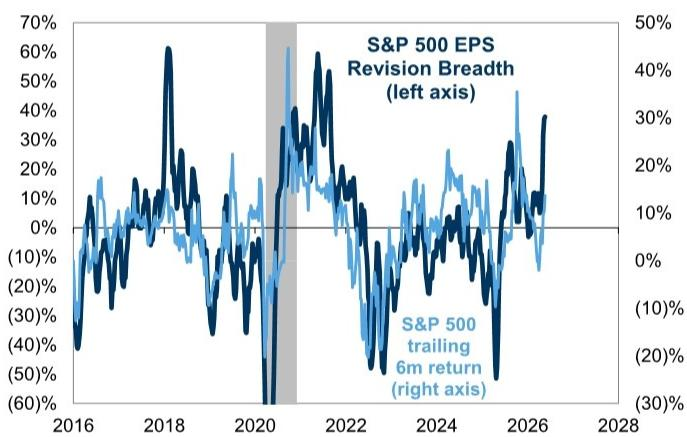

line

| Year | S&P 500 EPS Revision Breadth (left axis) | S&P 500 trailing 6m return (right axis) |
|------|------------------------------------------|------------------------------------------|
| 2016 | ~10%                                     | ~-10%                                    |
| 2018 | ~60%                                     | ~-30%                                    |
| 2020 | ~-60%                                    | ~-40%                                    |
| 2022 | ~60%                                     | ~-20%                                    |
| 2024 | ~30%                                     | ~-10%                                    |
| 2026 | ~45%                                     | ~-5%                                     |
| 2028 | ~35%                                     | ~-10%                                    |

Revision breadth calculated as [(# of companies with positive EPS revisions)-(# of companies with negative revisions)]/(total # of companies). Revisions reflect FY2 EPS estimate changes during a rolling 1-month window.   
Source: FactSet, GS Global Investment Research

Exhibit 28: US equity index P/E valuations vs. history   
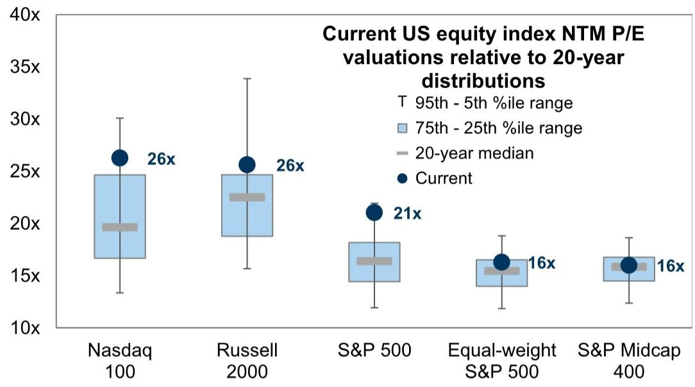

boxplot

| Index / Category       | Current NTM P/E Valuation (x) |
| ---------------------- | ----------------------------- |
| Nasdaq 100             | 26                            |
| Russell 2000           | 26                            |
| S&P 500                | 21                            |
| Equal-weight S&P 500    | 16                            |
| S&P Midcap 400         | 16                            |

Source: Compustat, FactSet, IBES, GS Global Investment Research

Exhibit 29: S&P 500 consensus forward 12-month P/E   
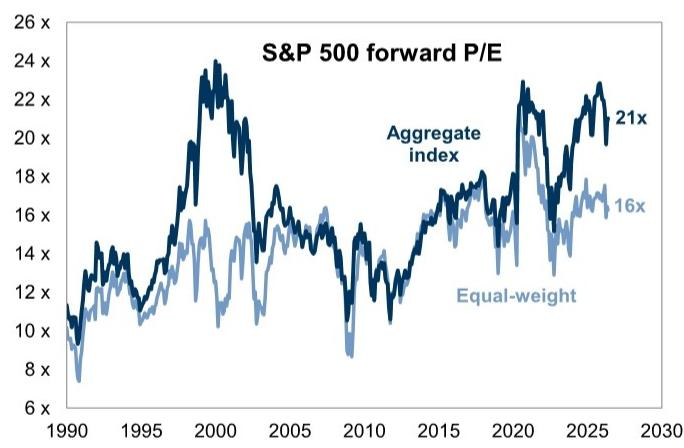

line

| Year | Aggregate index | Equal-weight |
|------|-----------------|--------------|
| 2030 | 21x             | 16x          |

Source: Compustat, FactSet, IBES, GS Global Investment Research

Exhibit 30: S&P 500 valuation relative to US Treasury yields   
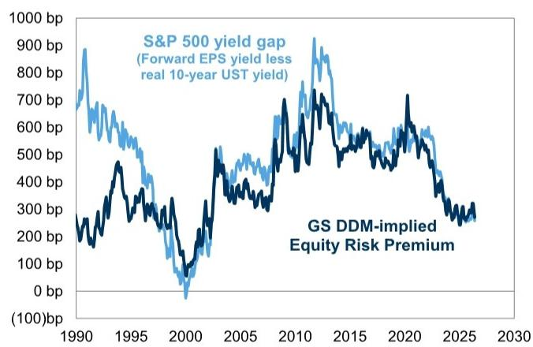

line

| Year | S&P 500 yield gap (Forward EPS yield less real 10-year UST yield) | GS DDM-implied Equity Risk Premium |
|------|------------------------------------------------------------------------|-------------------------------------|
| 1990 | ~900 bp                                                              | ~200 bp                             |
| 1995 | ~600 bp                                                              | ~400 bp                             |
| 2000 | ~100 bp                                                              | ~100 bp                             |
| 2005 | ~500 bp                                                              | ~300 bp                             |
| 2010 | ~700 bp                                                              | ~600 bp                             |
| 2015 | ~800 bp                                                              | ~500 bp                             |
| 2020 | ~600 bp                                                              | ~400 bp                             |
| 2025 | ~300 bp                                                              | ~250 bp                             |
| 2030 | ~250 bp                                                              | ~250 bp                             |

Equity risk premium calculated by solving for the discount rate that equates the fair value of our multi-stage S&P 500 dividend discount model to the current market price and subtracting the 10-year US Treasury yield.   
Source: GS Global Investment Research

# Sector returns, earnings, and valuations

Exhibit 31: Sector and industry group returns 

<table><tr><td rowspan="3" colspan="2">S&amp;P 500</td><td rowspan="2">Index weight</td><td rowspan="2">1 Week</td><td colspan="4">Top quartile</td><td rowspan="3">GS allocation</td></tr><tr><td>1 Month</td><td>3 Months</td><td>Last 12 Mo</td><td>YTD</td></tr><tr><td>100 %</td><td>(0.7)%</td><td>6 %</td><td>8 %</td><td>29 %</td><td>9 %</td></tr><tr><td rowspan="11">SECTOR</td><td>Energy</td><td>3 %</td><td>1.9 %</td><td>6 %</td><td>8 %</td><td>49 %</td><td>33 %</td><td rowspan="10">OW</td></tr><tr><td>Real Estate</td><td>2</td><td>1.4</td><td>2</td><td>4</td><td>17</td><td>15</td></tr><tr><td>Health Care</td><td>8</td><td>1.0</td><td>2</td><td>(5)</td><td>15</td><td>(4)</td></tr><tr><td>Financials</td><td>12</td><td>0.9</td><td>(1)</td><td>(1)</td><td>5</td><td>(5)</td></tr><tr><td>Utilities</td><td>2</td><td>0.2</td><td>0</td><td>(2)</td><td>14</td><td>6</td></tr><tr><td>Consumer Discretionary</td><td>10</td><td>(0.1)</td><td>2</td><td>6</td><td>17</td><td>2</td></tr><tr><td>Information Technology</td><td>37</td><td>(1.1)</td><td>13</td><td>22</td><td>50</td><td>18</td></tr><tr><td>Consumer Staples</td><td>5</td><td>(1.2)</td><td>3</td><td>(2)</td><td>8</td><td>11</td></tr><tr><td>Communication Services</td><td>11</td><td>(2.2)</td><td>6</td><td>10</td><td>44</td><td>10</td></tr><tr><td>Industrials</td><td>8</td><td>(2.3)</td><td>(1)</td><td>(4)</td><td>22</td><td>10</td></tr><tr><td>Materials</td><td>2</td><td>(3.0)</td><td>(3)</td><td>(5)</td><td>18</td><td>10</td><td>OW</td></tr><tr><td rowspan="24">I N D U S T R Y G R O U P</td><td>Consumer Durables &amp; Apparel</td><td>0 %</td><td>4.4 %</td><td>(9)%</td><td>(18)%</td><td>(3)%</td><td>(9)%</td><td rowspan="24"></td></tr><tr><td>Software &amp; Services</td><td>9</td><td>3.1</td><td>2</td><td>8</td><td>(9)</td><td>(14)</td></tr><tr><td>Commercial &amp; Professional Svcs</td><td>1</td><td>3.0</td><td>(2)</td><td>(7)</td><td>(26)</td><td>(13)</td></tr><tr><td>Insurance</td><td>2</td><td>2.6</td><td>(1)</td><td>(1)</td><td>(6)</td><td>(3)</td></tr><tr><td>Consumer Services</td><td>2</td><td>2.0</td><td>(7)</td><td>(6)</td><td>(1)</td><td>(6)</td></tr><tr><td>Telecommunication Services</td><td>1</td><td>2.0</td><td>(2)</td><td>(8)</td><td>(3)</td><td>6</td></tr><tr><td>Energy</td><td>3</td><td>1.9</td><td>6</td><td>8</td><td>49</td><td>33</td></tr><tr><td>Banks</td><td>3</td><td>1.8</td><td>(4)</td><td>(4)</td><td>24</td><td>(4)</td></tr><tr><td>Technology Hardware &amp; Equipment</td><td>10</td><td>1.6</td><td>15</td><td>22</td><td>68</td><td>25</td></tr><tr><td>Pharma Biotech &amp; Life Sciences</td><td>5</td><td>1.5</td><td>2</td><td>(5)</td><td>30</td><td>(1)</td></tr><tr><td>Real Estate Investment Trusts (REITs)</td><td>2</td><td>1.4</td><td>2</td><td>4</td><td>17</td><td>15</td></tr><tr><td>Consumer Discretionary Retail</td><td>6</td><td>1.0</td><td>3</td><td>14</td><td>22</td><td>10</td></tr><tr><td>Household &amp; Personal Products</td><td>1</td><td>0.8</td><td>3</td><td>(10)</td><td>(11)</td><td>2</td></tr><tr><td>Transportation</td><td>1</td><td>0.8</td><td>1</td><td>(1)</td><td>23</td><td>9</td></tr><tr><td>Health Care Equipment &amp; Services</td><td>3</td><td>0.3</td><td>1</td><td>(6)</td><td>(5)</td><td>(8)</td></tr><tr><td>Utilities</td><td>2</td><td>0.2</td><td>0</td><td>(2)</td><td>14</td><td>6</td></tr><tr><td>Financial Services</td><td>7</td><td>0.2</td><td>1</td><td>1</td><td>(0)</td><td>(6)</td></tr><tr><td>Food Beverage &amp; Tobacco</td><td>2</td><td>0.1</td><td>9</td><td>(0)</td><td>12</td><td>13</td></tr><tr><td>Media &amp; Entertainment</td><td>10</td><td>(2.5)</td><td>7</td><td>12</td><td>49</td><td>10</td></tr><tr><td>Materials</td><td>2</td><td>(3.0)</td><td>(3)</td><td>(5)</td><td>18</td><td>10</td></tr><tr><td>Consumer Staples Retail</td><td>2</td><td>(3.4)</td><td>(2)</td><td>1</td><td>15</td><td>14</td></tr><tr><td>Capital Goods</td><td>6</td><td>(3.4)</td><td>(1)</td><td>(4)</td><td>33</td><td>14</td></tr><tr><td>Semiconductors &amp; Semi Equipment</td><td>18</td><td>(4.6)</td><td>17</td><td>30</td><td>104</td><td>38</td></tr><tr><td>Automobiles &amp; Components</td><td>2</td><td>(5.5)</td><td>7</td><td>1</td><td>26</td><td>(7)</td></tr></table>

Source: FactSet, GS Global Investment Research

Exhibit 32: Earnings contributions and growth by S&P 500 sector 

<table><tr><td rowspan="3">Sector</td><td colspan="5">GS top-down</td><td colspan="4">Consensus bottom-up</td></tr><tr><td colspan="3">Contribution</td><td colspan="2">EPS growth</td><td colspan="2">Contribution</td><td colspan="2">EPS growth</td></tr><tr><td>2025</td><td>2026</td><td>2027</td><td>2026</td><td>2027</td><td>2026</td><td>2027</td><td>2026</td><td>2027</td></tr><tr><td>Info Tech</td><td>$70</td><td>$92</td><td>$109</td><td>31 %</td><td>19 %</td><td>$106</td><td>$135</td><td>50 %</td><td>27 %</td></tr><tr><td>Financials</td><td>52</td><td>55</td><td>59</td><td>6</td><td>6</td><td>56</td><td>62</td><td>8</td><td>11</td></tr><tr><td>Health Care</td><td>33</td><td>35</td><td>37</td><td>5</td><td>6</td><td>34</td><td>40</td><td>1</td><td>18</td></tr><tr><td>Comm Services</td><td>29</td><td>31</td><td>35</td><td>7</td><td>13</td><td>37</td><td>39</td><td>26</td><td>6</td></tr><tr><td>Cons Discretionary</td><td>23</td><td>23</td><td>25</td><td>4</td><td>5</td><td>26</td><td>29</td><td>14</td><td>15</td></tr><tr><td>Industrials</td><td>21</td><td>23</td><td>25</td><td>7</td><td>9</td><td>23</td><td>28</td><td>9</td><td>19</td></tr><tr><td>Consumer Staples</td><td>15</td><td>15</td><td>16</td><td>3</td><td>4</td><td>15</td><td>17</td><td>4</td><td>8</td></tr><tr><td>Energy</td><td>12</td><td>13</td><td>13</td><td>10</td><td>2</td><td>18</td><td>17</td><td>57</td><td>(6)</td></tr><tr><td>Utilities</td><td>8</td><td>8</td><td>9</td><td>6</td><td>7</td><td>9</td><td>10</td><td>14</td><td>9</td></tr><tr><td>Materials</td><td>5</td><td>7</td><td>7</td><td>24</td><td>8</td><td>8</td><td>8</td><td>40</td><td>9</td></tr><tr><td>Real Estate</td><td>6</td><td>7</td><td>7</td><td>5</td><td>7</td><td>7</td><td>8</td><td>15</td><td>8</td></tr><tr><td>S&amp;P 500</td><td>$275</td><td>$309</td><td>$342</td><td>12 %</td><td>10 %</td><td>$339</td><td>$392</td><td>23 %</td><td>16 %</td></tr></table>

Source: FactSet, GS Global Investment Research

Exhibit 33: S&P 500 sector P/E valuations relative to history 

<table><tr><td rowspan="3"></td><td colspan="5">Consensus forward 12-month P/E valuation</td></tr><tr><td rowspan="2">Current P/E</td><td colspan="2">Absolute P/E %ile rank vs. history</td><td colspan="2">P/E vs. S&amp;P 500 %ile rank vs. history</td></tr><tr><td>10-year</td><td>30-year</td><td>10-year</td><td>30-year</td></tr><tr><td>Consumer Discretionary</td><td>27x</td><td>58%</td><td>85%</td><td>31%</td><td>74%</td></tr><tr><td>Industrials</td><td>24</td><td>84</td><td>95</td><td>97</td><td>99</td></tr><tr><td>Information Technology</td><td>24</td><td>61</td><td>66</td><td>54</td><td>43</td></tr><tr><td>Consumer Staples</td><td>22</td><td>87</td><td>87</td><td>53</td><td>31</td></tr><tr><td>Communication Services</td><td>21</td><td>69</td><td>71</td><td>44</td><td>17</td></tr><tr><td>S&amp;P 500</td><td>21</td><td>64</td><td>81</td><td></td><td></td></tr><tr><td>Real Estate</td><td>19</td><td>62</td><td>79</td><td>34</td><td>32</td></tr><tr><td>Utilities</td><td>18</td><td>62</td><td>87</td><td>70</td><td>72</td></tr><tr><td>Materials</td><td>17</td><td>39</td><td>60</td><td>18</td><td>11</td></tr><tr><td>Health Care</td><td>17</td><td>61</td><td>56</td><td>29</td><td>13</td></tr><tr><td>Financials</td><td>15</td><td>37</td><td>65</td><td>2</td><td>4</td></tr><tr><td>Energy</td><td>14</td><td>37</td><td>53</td><td>42</td><td>21</td></tr></table>

Source: Compustat, FactSet, IBES, GS Global Investment Research

Exhibit 34: Recent performance of select GS baskets

basket returns expressed relative to the equal-weight S&P 500 except for long/short basket pairs as noted

<table><tr><td rowspan="6"></td><td colspan="6">Top quartile</td></tr><tr><td colspan="6">Bottom quartile</td></tr><tr><td rowspan="2">Basket / Index</td><td rowspan="2">Ticker (GSTH_)</td><td rowspan="2">1 Wk</td><td colspan="3">Total returns</td></tr><tr><td>3 Mo</td><td>12 Mo</td><td>YTD</td></tr><tr><td>S&amp;P 500</td><td>SPX</td><td>(0.7)%</td><td>8%</td><td>29%</td><td>9%</td></tr><tr><td>Equal-weight S&amp;P 500</td><td>SPW</td><td>0.5</td><td>1</td><td>19</td><td>7</td></tr><tr><td rowspan="4">Macro- economic</td><td>High vs. Low Tax Rate</td><td>HTAX / LTAX</td><td>2.6%</td><td>(0)%</td><td>(1)%</td><td>3%</td></tr><tr><td>Interest Rate Sensitive</td><td>USTY</td><td>(0.0)</td><td>19</td><td>27</td><td>17</td></tr><tr><td>Dual Beta</td><td>BETA</td><td>(0.6)</td><td>23</td><td>82</td><td>36</td></tr><tr><td>Low vs. High Labor Cost</td><td>LLAB / HLAB</td><td>(1.7)</td><td>3</td><td>19</td><td>12</td></tr><tr><td rowspan="4">Geographic sales</td><td>US Sales</td><td>AINT</td><td>2.2%</td><td>4%</td><td>(14)%</td><td>(5)%</td></tr><tr><td>Western Europe Sales</td><td>WEUR</td><td>0.2</td><td>8</td><td>13</td><td>6</td></tr><tr><td>International Sales</td><td>INTL</td><td>(0.9)</td><td>20</td><td>48</td><td>29</td></tr><tr><td>EM Sales</td><td>BRIC</td><td>(1.1)</td><td>29</td><td>80</td><td>45</td></tr><tr><td rowspan="6">Fundamental</td><td>Long vs. Short Duration</td><td>LDUR / SDUR</td><td>1.4%</td><td>8%</td><td>(22)%</td><td>(11)%</td></tr><tr><td>Stable Growers</td><td>STGR</td><td>1.3</td><td>(0)</td><td>(18)</td><td>(7)</td></tr><tr><td>High vs. Low Operating Leverage</td><td>OPHI / OPLO</td><td>1.0</td><td>4</td><td>(10)</td><td>(6)</td></tr><tr><td>High Quality</td><td>QUAL</td><td>(0.0)</td><td>(3)</td><td>(15)</td><td>(8)</td></tr><tr><td>Strong vs. Weak Balance Sheet</td><td>SBAL / WBAL</td><td>(1.0)</td><td>3</td><td>(21)</td><td>(8)</td></tr><tr><td>ROE Growth</td><td>GROE</td><td>(1.7)</td><td>16</td><td>42</td><td>28</td></tr><tr><td rowspan="6">Uses of cash</td><td>Dividend Growth</td><td>DIVG</td><td>1.9%</td><td>6%</td><td>15%</td><td>5%</td></tr><tr><td>Total Cash Return</td><td>CASH</td><td>1.7</td><td>9</td><td>11</td><td>3</td></tr><tr><td>Buybacks</td><td>REPO</td><td>1.1</td><td>8</td><td>3</td><td>0</td></tr><tr><td>Debt Reducers vs. Issuers</td><td>DRED / DISS</td><td>1.0</td><td>11</td><td>31</td><td>15</td></tr><tr><td>Capex and R&amp;D</td><td>CAPX</td><td>0.1</td><td>22</td><td>56</td><td>29</td></tr><tr><td>High Growth Investment</td><td>HGIR</td><td>(1.0)</td><td>22</td><td>43</td><td>25</td></tr><tr><td rowspan="4">Ownership, risk &amp; liquidity</td><td>High Sharpe Ratio</td><td>SHRP</td><td>2.3%</td><td>(4)%</td><td>(15)%</td><td>(8)%</td></tr><tr><td>Low vs. High Liquidity</td><td>LLIQ / HLIQ</td><td>0.6</td><td>(15)</td><td>(18)</td><td>(14)</td></tr><tr><td>Hedge Fund VIP</td><td>HVIP</td><td>(1.4)</td><td>9</td><td>18</td><td>7</td></tr><tr><td>Mutual Fund Over- vs. Underweights</td><td>MFOW / MFUW</td><td>(1.7)</td><td>(22)</td><td>(34)</td><td>(25)</td></tr><tr><td rowspan="4">Equity research</td><td>M&amp;A Candidates</td><td>GSRHACQN</td><td>1.2%</td><td>10%</td><td>23%</td><td>(5)%</td></tr><tr><td>Oil Input Cost</td><td>GSRHOILX</td><td>(0.4)</td><td>(11)</td><td>(13)</td><td>(3)</td></tr><tr><td>SMB Exposure</td><td>GSRHSMBX</td><td>(1.3)</td><td>1</td><td>(20)</td><td>(11)</td></tr><tr><td>Gov&#x27;t Exposure</td><td>GSRHGOVT</td><td>(1.9)</td><td>(2)</td><td>22</td><td>(2)</td></tr></table>

Basket returns and constituents can be accessed via GS Marquee or Bloomberg using the indicated tickers.   
Source: GS Global Investment Research

Exhibit 35: Indexed return of select equity factors   
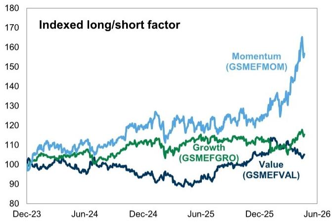

line

| Date   | Momentum (GSMEFMOM) | Growth (GSMEFGRO) | Value (GSMEFVAL) |
|--------|---------------------|-------------------|------------------|
| Jun-26 | 170                 | 115               | 105              |

Factor performance and constituents can be viewed on GS Marquee or Bloomberg using the tickers indicated on the chart.

Exhibit 36: Equity factor valuations relative to history   
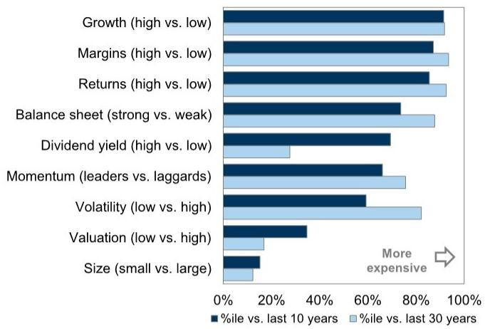

bar

| Metric | %ile vs. last 10 years (%) | %ile vs. last 30 years (%) |
|---|---|---|
| Growth (high vs. low) | 92 | 91 |
| Margins (high vs. low) | 89 | 94 |
| Returns (high vs. low) | 87 | 93 |
| Balance sheet (strong vs. weak) | 75 | 90 |
| Dividend yield (high vs. low) | 70 | 28 |
| Momentum (leaders vs. laggards) | 66 | 77 |
| Volatility (low vs. high) | 60 | 82 |
| Valuation (low vs. high) | 35 | 17 |
| Size (small vs. large) | 16 | 12 |
More expensive

Source: GS Global Investment Research   
Source: GS Global Investment Research

# GS global macro research cross-asset forecasts

Exhibit 37: GS macro research asset forecasts   
GS Global Macro Forecasts 

<table><tr><td></td><td>units</td><td>Current</td><td>3m</td><td>6m</td><td>12m</td><td>Change to 12m target</td></tr><tr><td colspan="7">Equities</td></tr><tr><td>MXAPJ</td><td>level</td><td>863</td><td>900</td><td>940</td><td>990</td><td>15 %</td></tr><tr><td>TOPIX</td><td>level</td><td>3854</td><td>3800</td><td>4000</td><td>4200</td><td>9</td></tr><tr><td>S&amp;P 500</td><td>level</td><td>7446</td><td>7200</td><td>7400</td><td>7600</td><td>2</td></tr><tr><td>STOXX Europe 600</td><td>level</td><td>621</td><td>605</td><td>615</td><td>625</td><td>1</td></tr><tr><td colspan="7">10-year rates</td></tr><tr><td>Euro Area (Germany)</td><td>%</td><td>2.5</td><td>3.0</td><td>3.0</td><td>3.0</td><td>55 bp</td></tr><tr><td>Japan</td><td>%</td><td>2.8</td><td>2.5</td><td>2.5</td><td>2.5</td><td>(27)</td></tr><tr><td>US</td><td>%</td><td>4.6</td><td>4.2</td><td>4.1</td><td>4.1</td><td>(46)</td></tr><tr><td colspan="7">Corporate bonds</td></tr><tr><td>High yield</td><td>bp</td><td>264</td><td>335</td><td>325</td><td>NA</td><td>NA</td></tr><tr><td>Investment grade</td><td>bp</td><td>79</td><td>95</td><td>92</td><td>NA</td><td>NA</td></tr><tr><td colspan="7">Currencies</td></tr><tr><td>Euro / US dollar</td><td>EUR/$</td><td>1.16</td><td>1.14</td><td>1.18</td><td>1.20</td><td>4 %</td></tr><tr><td>Sterling / US dollar</td><td>£/$</td><td>1.34</td><td>1.33</td><td>1.34</td><td>1.33</td><td>(1)</td></tr><tr><td>US dollar / Yen</td><td>$/¥</td><td>159</td><td>160</td><td>158</td><td>155</td><td>(3)</td></tr><tr><td colspan="7">Commodities</td></tr><tr><td>COMEX gold</td><td>$/troy oz</td><td>4543</td><td>4805</td><td>4990</td><td>5445</td><td>20 %</td></tr><tr><td>NYMEX nat. gas</td><td>$/mmBtu</td><td>3</td><td>3.50</td><td>3.50</td><td>3.50</td><td>16</td></tr><tr><td>LME copper</td><td>$/mt</td><td>13427</td><td>12635</td><td>12535</td><td>12265</td><td>(9)</td></tr><tr><td>Brent crude oil</td><td>$/bbl</td><td>103</td><td>94</td><td>91</td><td>86</td><td>(16)</td></tr></table>

Source: FactSet, GS Global Investment Research

# Disclosure Appendix

# Reg AC

We, Ben Snider, Ryan Hammond, Jenny Ma, Daniel Chavez, Kartik Jayachandran and Christophe Sung, hereby certify that all of the views expressed in this report accurately reflect our personal views, which have not been influenced by considerations of the firm's business or client relationships.

Unless otherwise stated, the individuals listed on the cover page of this report are analysts in GS' Global Investment Research division.

Contributing Authors: Ben Snider GS & Co. LLC, Ryan Hammond GS & Co. LLC, Jenny Ma GS & Co. LLC, Daniel Chavez GS & Co. LLC, Kartik Jayachandran GS & Co. LLC, Christophe Sung GS & Co. LLC.

Unless otherwise stated, the individuals listed in the Contributing Authors disclosure of this report are analysts in GS' Global Investment Research division.

# Disclosures

# Basket disclosure

The ability to trade the basket(s) in this report will depend upon market conditions, including liquidity and borrow constraints at the time of trade.

# Regulatory disclosures

# Disclosures required by United States laws and regulations

See company-specific regulatory disclosures above for any of the following disclosures required as to companies referred to in this report: manager or co-manager in a pending transaction; $1\%$ or other ownership; compensation for certain services; types of client relationships; managed/co-managed public offerings in prior periods; directorships; for equity securities, market making and/or specialist role. GS trades or may trade as a principal in debt securities (or in related derivatives) of issuers discussed in this report.

The following are additional required disclosures: Ownership and material conflicts of interest: GS policy prohibits its analysts, professionals reporting to analysts and members of their households from owning securities of any company in the analyst's area of coverage. Analyst compensation: Analysts are paid in part based on the profitability of GS, which includes investment banking revenues. Analyst as officer or director: GS policy generally prohibits its analysts, persons reporting to analysts or members of their households from serving as an officer, director or advisor of any company in the analyst's area of coverage. Non-U.S. Analysts: Non-U.S. analysts may not be associated persons of GS & Co. LLC and therefore may not be subject to FINRA Rule 2241 or FINRA Rule 2242 restrictions on communications with a subject company, public appearances and trading in securities covered by the analysts.

# Additional disclosures required under the laws and regulations of jurisdictions other than the United States

The following disclosures are those required by the jurisdiction indicated, except to the extent already made above pursuant to United States laws and regulations. Australia: GS Australia Pty Ltd and its affiliates are not authorised deposit-taking institutions (as that term is defined in the Banking Act 1959 (Cth)) in Australia and do not provide banking services, nor carry on a banking business, in Australia. This research, and any access to it, is intended only for “wholesale clients” within the meaning of the Australian Corporations Act, unless otherwise agreed by GS. In producing research reports, members of Global Investment Research of GS Australia may attend site visits and other meetings hosted by the companies and other entities which are the subject of its research reports. In some instances the costs of such site visits or meetings may be met in part or in whole by the issuers concerned if GS Australia considers it is appropriate and reasonable in the specific circumstances relating to the site visit or meeting. To the extent that the contents of this document contains any financial product advice, it is general advice only and has been prepared by GS without taking into account a client’s objectives, financial situation or needs. A client should, before acting on any such advice, consider the appropriateness of the advice having regard to the client’s own objectives, financial situation and needs. A copy of certain GS Australia and New Zealand disclosure of interests and a copy of GS’ Australian Sell-Side Research Independence Policy Statement are available at: https://www.goldmansachs.com/disclosures/australia-new-zealand/index.html. Brazil: Disclosure information in relation to CVM Resolution n. 20 is available at https://www.gs.com/worldwide/brazil/area/gir/index.html. Where applicable, the Brazil-registered analyst primarily responsible for the content of this research report, as defined in Article 20 of CVM Resolution n. 20, is the first author named at the beginning of this report, unless indicated otherwise at the end of the text. Canada: This information is being provided to you for information purposes only and is not, and under no circumstances should be construed as, an advertisement, offering or solicitation by GS & Co. LLC for purchasers of securities in Canada to trade in any Canadian security. GS & Co. LLC is not registered as a dealer in any jurisdiction in Canada under applicable Canadian securities laws and generally is not permitted to trade in Canadian securities and may be prohibited from selling certain securities and products in certain jurisdictions in Canada. If you wish to trade in any Canadian securities or other products in Canada please contact GS Canada Inc., an affiliate of The GS Group Inc., or another registered Canadian dealer. Hong Kong: Further information on the securities of covered companies referred to in this research may be obtained on request from GS (Asia) L.L.C. India: Further information on the subject company or companies referred to in this research may be obtained from GS (India) Securities Private Limited, Research Analyst - SEBI Registration Number INH000001493, 10th Floor, Ascent-Worli, Sudam Kalu Ahire Marg, Worli, Mumbai-400 025, India, Corporate Identity Number U74140MH2006FTC160634, Phone +91 22 6616 9000, Fax +91 22 6616 9001. GS may beneficially own 1% or more of the securities (as such term is defined in clause 2 (h) the Indian Securities Contracts (Regulation) Act, 1956) of the subject company or companies referred to in this research report. Investment in securities market are subject to market risks. Read all the related documents carefully before investing. Registration granted by SEBI and certification from NISM in no way guarantee performance of the intermediary or provide any assurance of returns to investors. GS (India) Securities Private Limited compliance officer and investor grievance contact details can be found at: https://www.goldmansachs.com/worldwide/india/documents/Grievance-Redressal-and-Escalation-Matrix.pdf, and a copy of the annual audit compliance report can be found at this link: https://publishing.gs.com/content/site/india-annual-compliance-report.html. Japan: See below. Korea: This research, and any access to it, is intended only for “professional investors” within the meaning of the Financial Services and Capital Markets Act, unless otherwise agreed by GS. Further information on the subject company or companies referred to in this research may be obtained from GS (Asia) L.L.C., Seoul Branch. New Zealand: GS New Zealand Limited and its affiliates are neither “registered banks” nor “deposit takers” (as defined in the Reserve Bank of New Zealand Act 1989) in New Zealand. This research, and any access to it, is intended for “wholesale clients” (as defined in the Financial Advisers Act 2008) unless otherwise agreed by GS. A copy of certain GS Australia and New Zealand disclosure of interests is available at: https://www.goldmansachs.com/disclosures/australia-new-zealand/index.html. Russia: Research reports distributed in the Russian Federation are not advertising as defined in the Russian legislation, but are information and analysis not having product promotion as their main purpose and do not provide appraisal within the meaning of the Russian legislation on appraisal activity. Research reports do not constitute a personalized investment recommendation as defined in Russian laws and regulations, are not addressed to a specific client, and are prepared without analyzing the financial circumstances, investment profiles or risk profiles of clients. GS assumes no responsibility for any investment decisions that may be taken by a client or any other person based on this research report. Singapore: GS (Singapore) Pte. (Company Number: 198602165W), which is regulated by the Monetary Authority of Singapore, accepts legal responsibility for this

research, and should be contacted with respect to any matters arising from, or in connection with, this research. Taiwan: This material is for reference only and must not be reprinted without permission. Investors should carefully consider their own investment risk. Investment results are the responsibility of the individual investor. United Kingdom: Persons who would be categorized as retail clients in the United Kingdom, as such term is defined in the rules of the Financial Conduct Authority, should read this research in conjunction with prior GS on the covered companies referred to herein and should refer to the risk warnings that have been sent to them by GS International. A copy of these risks warnings, and a glossary of certain financial terms used in this report, are available from GS International on request.

European Union and United Kingdom: Disclosure information in relation to Article 6 (2) of the European Commission Delegated Regulation (EU) (2016/958) supplementing Regulation (EU) No 596/2014 of the European Parliament and of the Council (including as that Delegated Regulation is implemented into United Kingdom domestic law and regulation following the United Kingdom's departure from the European Union and the European Economic Area) with regard to regulatory technical standards for the technical arrangements for objective presentation of investment recommendations or other information recommending or suggesting an investment strategy and for disclosure of particular interests or indications of conflicts of interest is available at https://www.gs.com/disclosures/europeanpolicy.html which states the European Policy for Managing Conflicts of Interest in Connection with Investment Research.

Japan: GS Japan Co., Ltd. is a Financial Instrument Dealer registered with the Kanto Financial Bureau under registration number Kinsho 69, and a member of Japan Securities Dealers Association, Financial Futures Association of Japan Type II Financial Instruments Firms Association, and Investment Management Association of Japan. Sales and purchase of equities are subject to commission pre-determined with clients plus consumption tax. See company-specific disclosures as to any applicable disclosures required by Japanese stock exchanges, the Japanese Securities Dealers Association or the Japanese Securities Finance Company.

# Global product; distributing entities

GS Global Investment Research produces and distributes research products for clients of GS on a global basis. Analysts based in GS offices around the world produce research on industries and companies, and research on macroeconomics, currencies, commodities and portfolio strategy. This research is disseminated in Australia by GS Australia Pty Ltd (ABN 21 006 797 897); in Brazil by GS do Brasil Corretora de Títulos e Valores Mobiliários S.A.; Public Communication Channel GS Brazil: 0800 727 5764 and / or contatogoldmanbrasil@gs.com. Available Weekdays (except holidays), from 9am to 6pm. Canal de Comunicação com o Público GS Brasil: 0800 727 5764 e/ou contatogoldmanbrasil@gs.com. Horário de funcionamento: segunda-feira à sexta-feira (exceto feriados), das 9h às 18h; in Canada by GS & Co. LLC; in Hong Kong by GS (Asia) L.L.C.; in India by GS (India) Securities Private Ltd.; in Japan by GS Japan Co., Ltd.; in the Republic of Korea by GS (Asia) L.L.C., Seoul Branch; in New Zealand by GS New Zealand Limited; in Russia by OOO GS; in Singapore by GS (Singapore) Pte. (Company Number: 198602165W); and in the United States of America by GS & Co. LLC. GS International has approved this research in connection with its distribution in the United Kingdom.

GS International (“GSI”), authorised by the Prudential Regulation Authority (“PRA”) and regulated by the Financial Conduct Authority (“FCA”) and the PRA, has approved this research in connection with its distribution in the United Kingdom.

European Economic Area: GS Bank Europe SE (“GSBE”) is a credit institution incorporated in Germany and, within the Single Supervisory Mechanism, subject to direct prudential supervision by the European Central Bank and in other respects supervised by German Federal Financial Supervisory Authority (Bundesanstalt für Finanzdienstleistungsaufsicht, BaFin) and Deutsche Bundesbank and disseminates research within the European Economic Area.

# General disclosures

This research is for our clients only. Other than disclosures relating to GS, this research is based on current public information that we consider reliable, but we do not represent it is accurate or complete, and it should not be relied on as such. The information, opinions, estimates and forecasts contained herein are as of the date hereof and are subject to change without prior notification. We seek to update our research as appropriate, but various regulations may prevent us from doing so. Other than certain industry reports published on a periodic basis, the large majority of reports are published at irregular intervals as appropriate in the analyst's judgment.

GS conducts a global full-service, integrated investment banking, investment management, and brokerage business. We have investment banking and other business relationships with a substantial percentage of the companies covered by Global Investment Research. GS & Co. LLC, the United States broker dealer, is a member of SIPC (https://www.sipc.org).

Our salespeople, traders, and other professionals may provide oral or written market commentary or trading strategies to our clients and principal trading desks that reflect opinions that are contrary to the opinions expressed in this research. Our asset management area, principal trading desks and investing businesses may make investment decisions that are inconsistent with the recommendations or views expressed in this research.

We and our affiliates, officers, directors, and employees will from time to time have long or short positions in, act as principal in, and buy or sell, the securities or derivatives, if any, referred to in this research, unless otherwise prohibited by regulation or GS policy.

The views attributed to third party presenters at GS arranged conferences, including individuals from other parts of GS, do not necessarily reflect those of Global Investment Research and are not an official view of GS.

Any third party referenced herein, including any salespeople, traders and other professionals or members of their household, may have positions in the products mentioned that are inconsistent with the views expressed by analysts named in this report.

This research is focused on investment themes across markets, industries and sectors. It does not attempt to distinguish between the prospects or performance of, or provide analysis of, individual companies within any industry or sector we describe.

Any trading recommendation in this research relating to an equity or credit security or securities within an industry or sector is reflective of the investment theme being discussed and is not a recommendation of any such security in isolation.

This research is not an offer to sell or the solicitation of an offer to buy any security in any jurisdiction where such an offer or solicitation would be illegal. It does not constitute a personal recommendation or take into account the particular investment objectives, financial situations, or needs of individual clients. Clients should consider whether any advice or recommendation in this research is suitable for their particular circumstances and, if appropriate, seek professional advice, including tax advice. The price and value of investments referred to in this research and the income from them may fluctuate. Past performance is not a guide to future performance, future returns are not guaranteed, and a loss of original capital may occur. Fluctuations in exchange rates could have adverse effects on the value or price of, or income derived from, certain investments.

Certain transactions, including those involving futures, options, and other derivatives, give rise to substantial risk and are not suitable for all investors. Investors should review current options and futures disclosure documents which are available from GS sales representatives or at https://www.theocc.com/about/publications/character-risks.jsp and https://www.goldmansachs.com/disclosures/cftc\_fcm\_disclosures. Transaction costs may be significant in option strategies calling for multiple purchase and sales of options such as spreads. Supporting documentation will be

supplied upon request.

Differing Levels of Service provided by Global Investment Research: The level and types of services provided to you by GS Global Investment Research may vary as compared to that provided to internal and other external clients of GS, depending on various factors including your individual preferences as to the frequency and manner of receiving communication, your risk profile and investment focus and perspective (e.g., marketwide, sector specific, long term, short term), the size and scope of your overall client relationship with GS, and legal and regulatory constraints. As an example, certain clients may request to receive notifications when research on specific securities is published, and certain clients may request that specific data underlying analysts' fundamental analysis available on our internal client websites be delivered to them electronically through data feeds or otherwise. No change to an analyst's fundamental research views (e.g., ratings, price targets, or material changes to earnings estimates for equity securities), will be communicated to any client prior to inclusion of such information in a research report broadly disseminated through electronic publication to our internal client websites or through other means, as necessary, to all clients who are entitled to receive such reports.

All research reports are disseminated and available to all clients simultaneously through electronic publication to our internal client websites. Not all research content is redistributed to our clients or available to third-party aggregators, nor is GS responsible for the redistribution of our research by third party aggregators. For research, models or other data related to one or more securities, markets or asset classes (including related services) that may be available to you, please contact your GS representative or go to https://research.gs.com.

Disclosure information is also available at https://www.gs.com/research/hedge.html or from Research Compliance, 200 West Street, New York, NY 10282.

# © 2026 GS.

You are permitted to store, display, analyze, modify, reformat, and print the information made available to you via this service only for your own use. You may not resell or reverse engineer this information to calculate or develop any index for disclosure and/or marketing or create any other derivative works or commercial product(s), data or offering(s) without the express written consent of GS. You are not permitted to publish, transmit, or otherwise reproduce this information, in whole or in part, in any format to any third party without the express written consent of GS. This foregoing restriction includes, without limitation, using, extracting, downloading or retrieving this information, in whole or in part, to train or finetune a machine learning or artificial intelligence system, or to provide or reproduce this information, in whole or in part, as a prompt or input to any such system.