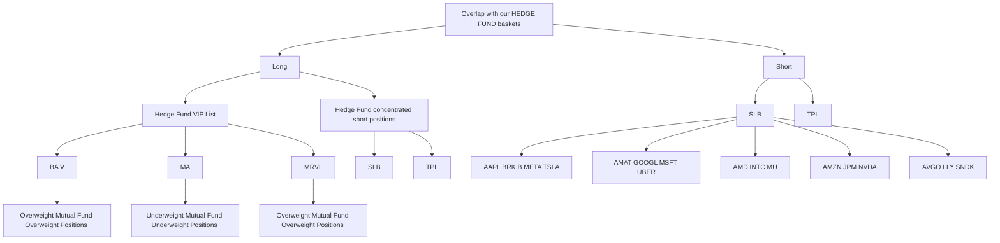

你是闲鱼资料类商品文案编辑，擅长把一份投研/行业/公司研报改写成适合闲鱼发布的商品说明。

【目标】
- 基于下面研报解析内容，生成一份可以复制到闲鱼商品详情里的中文文案。
- 风格参考用户提供的闲鱼对标笔记：标题直给、信息密度高、用途明确、适合人群明确、交付方式清楚。
- 语言要自然，像真实卖家发布，不要像公众号文章、小红书笔记或 AI 摘要。
- 不要使用太夸张的营销词，不要承诺收益，不要说“稳赚”“内幕”“必涨”。
- 可以适度口语化，但不要低俗。

【必须输出结构】
1. `闲鱼标题：` 一行，控制在 30 字以内，适合商品标题。
2. `商品描述：` 正文，适合直接粘贴到闲鱼详情页。
3. `Hashtag：` 一行，给 6-10 个平台可用标签，用 `#` 开头，空格分隔。

【严禁输出】
- 不要输出 `建议价格：`。
- 不要输出 `搜索关键词：`。
- 不要输出“搜索词”“关键词”“搜索关键词”等栏目。
- 不要给具体价格区间、成交承诺或价格建议。

【商品描述写法】
- 第一段：直接说明这是什么报告，页数/语言/主题/公司或行业。如果页数、日期、语言不确定，就不要编。
- 第二段：说明适合谁，比如投研、券商面试、PE/VC、行业研究、学习参考、写报告等。
- 第三段：用 3-5 个亮点 bullet，风格参考：
  ✅ 三大情景框架：DCF、P/ARR、EV/Sales
  ✅ 关键变量分析
  ✅ 估值逻辑、假设、终值占比等核心内容覆盖
  ✅ 适合准备 AI 相关面试、研究 AI 估值的同学
- 第四段：交付说明，参考：`资料为电子版 PDF，拍下后 24 小时内发网盘链接或邮箱。`
- 第五段：虚拟商品说明，参考：`电子类资料一经发货不退不换，有问题可以提前咨询。`
- 可以补一句：`需要其他报告也可以私聊，支持一站式咨询。`

【Hashtag 写法】
- 只输出平台相对安全、偏学习和资料属性的标签。
- 推荐从这些里选择：`#学习资料` `#研究笔记` `#学习笔记` `#行业研究` `#研报资料` `#资料整理` `#报告学习` `#案例研究`。
- 不要输出 `#财经` `#投资` `#股票` `#基金` `#理财` `#暴富` `#内幕` 等敏感标签。

【平台发布合规要求】
- 不要出现“投资建议”“买入”“卖出”“强烈推荐”“稳赚”“保本”“必涨”“抄底”“上车”“内幕”“翻倍”等金融操作或收益承诺表达。
- “投资”相关词尽量改成“投研”“研究”“观察”“学习参考”；如果必须保留，也要保持中性。
- 不要出现“独家”“原版”“内部”“无水印”“全网最低”“最全”“最强”“必看”等高风险或极限词。
- 不要写“关注”“点赞”“求关注”“评论区留言”等直接互动诱导。
- 不要承诺资料一定可用于获利、就业、通过面试或获得收益。

【合规与避坑】
- 默认避免出现具体投行品牌名，比如“GS”“GS”“MS”，统一写作“投行研报”或“投行研报”。
- 不要承诺研究或交易结果。
- 不要伪造页数、日期、作者、公司覆盖范围。研报未给出时就不写。
- 不要输出解释说明，只输出闲鱼文案本身。

【研报解析内容】
"""
# US WEEKLY KICKSTART

# Hedge funds and mutual funds continue their rotations from Software to Semiconductors

This week we published our Hedge Fund Trend Monitor and Mutual Fundamentals reports, which analyze \$9 trillion of equity positions at the start of Q2 2026.   
Only $30\%$ of large-cap mutual funds have outperformed their benchmarks YTD compared with the average of $37\%$ since 2007. Hedge funds have benefited from the Q2 market rebound and returned $7\%$ YTD, according to data from GS Prime Services.   
Mutual funds have increased cash allocations amid the rise in geopolitical tensions. Hedge funds cut net leverage initially but have since lifted net exposure to a one-year high. Hedge fund gross leverage remains elevated relative to history and the median S&P 500 stocks carries short interest equal to $3\%$ of market cap, the highest level since 2011.   
Funds agree on most sectors, with Industrials ranking as one of the most overweight sectors and Info Tech as the most underweight sector. The exception to the consensus are Financials, where mutual funds are overweight but hedge funds are underweight, and Consumer Discretionary, where hedge funds are overweight but mutual funds are underweight.   
Hedge funds and mutual funds have continued their recent portfolio rotations away from Software and toward Semis. The weight of Semis in the hedge fund long portfolio is the highest on record while the weight of Software is the lowest since 2019. Mutual funds carry the widest underweight in Software ex. MSFT since 2012. Both mutual funds and hedge funds reduced positions on net in MSFT during Q2. Among Semis stocks, hedge funds added to LRCX, AMAT, and ASML on net while mutual funds added to INTC and SITM.   
There are four “shared favorites” this quarter that register as popular holdings in both hedge fund and mutual fund portfolios: BA, MA, MRVL, V. These stocks have returned 10% YTD, outperforming the equal-weight S&P 500 by 3 pp.

# Ben Snider

+1(212)357-1744 | ben.snider@gs.com
GS & Co. LLC

# Ryan Hammond

+1(212)902-5625 | ryan.hammond@gs.com GS & Co. LLC

# Jenny Ma

+1(212)357-5775 | jenny.ma@gs.com
GS & Co. LLC

# Daniel Chavez

+1(212)357-7657 | daniel.chavez@gs.com GS & Co. LLC

# Kartik Jayachandran

+1(212)855-7744 |  
kartik.jayachandran@gs.com  
GS & Co. LLC

# Christophe Sung

+1(212)902-3841 | christophe.sung@gs.com GS & Co. LLC

# Comparing hedge fund and mutual fund positioning

This week we published our Hedge Fund Trend Monitor and Mutual Fundamentals reports, which analyze holdings at the start of Q2 2026. Our analyses cover 1,059 hedge funds with \$4.6 trillion of gross equity positions (\$3.1 trillion long, \$1.5 trillion short) and 509 large-cap active mutual funds with \$3.9 trillion in equity assets.

US equity hedge funds have ridden the recent wave of Momentum outperformance to deliver solid YTD absolute returns while most mutual funds have struggled to keep pace with rising benchmarks. According to estimates from GS Prime Services, US equity long/short funds have returned $7 \%$ YTD, supported by beta and long alpha. Our basket of Hedge Fund popular long positions (GSTHHVIP) has returned $13 \%$ compared with $7 \%$ for the equal- weight S&P 500 and $27 \%$ for a basket of stocks with concentrated short interest. The average large-cap mutual fund has returned $7 \%$ YTD, but only $30 \%$ of funds are outperforming their benchmarks, below the historical average of $37 \%$ .

Exhibit 1: Equity hedge funds have returned $7\%$ YTD   

bar

| Category | YTD return (%) |
|---|---|
| Most concentrated shorts | 27 |
| NASDAQ 100 | 17 |
| Russell 2000 | 15 |
| Hedge Fund VIP Basket | 13 |
| S&P 500 | 9 |
| Large-Cap Core Mutual Funds | 7 |
| Equal-Weight S&P 500 | 7 |
| Equity Long/Short Hedge Funds | 7 |
| 7-10yr Treasuries | (1) |

Source: FactSet, GS Global Investment Research

Exhibit 2: $30\%$ of large-cap mutual funds have outperformed benchmarks   

bar

Share of mutual funds outperforming benchmarks
| Category | YTD (%) | Historical average (%) |
|---|---|---|
| Large-Cap Core | 26 | 32 |
| Large-Cap Growth | 51 | 34 |
| Large-Cap Value | 15 | 46 |

Source: FactSet, GS Global Investment Research

Hedge funds and mutual funds each carry above-average equity market exposures. Hedge funds and mutual funds initially reduced exposure to US equities at the onset of geopolitical tensions in March but hedge funds have since lifted net leverage to the 85th percentile relative to the last five years. Although mutual funds lifted cash allocations from a record low of $1.1\%$ at the start of 2026 to $1.4\%$ at the start of April, cash balances as a share of assets still remain extremely low relative to history.

Exhibit 3: Hedge fund and mutual fund exposure to equities   
hedge fund data as of May 21, 2026; mutual fund data as of March 31, 2026   

line

| Year | US equity mutual fund cash as % of assets (right axis, inverted) | Equity L/S hedge fund net leverage (left axis) |
|------|------------------------------------------------------------------------|-----------------------------------------------|
| 2027 | 59%                                                                    | 1.4%                                          |

Source: ICI, GS Prime Services, GS Global Investment Research

The most recent positioning filings show that funds agree on most sectors, with the exceptions of Consumer Discretionary and Financials. Consumer Discretionary is a mutual fund underweight relative to benchmarks but a hedge fund overweight relative to the Russell 3000, while Financials is a mutual fund overweight but a hedge fund underweight.

Hedge funds and mutual funds are both overweight Industrials and underweight Info Tech but have moved in opposite directions. Hedge funds increased net tilts to Info Tech by +853 bp during Q1, the sector's largest change on record, and reduced net tilts to Industrials by -297 bp. In contrast, mutual funds increased exposure to Industrials (+24 bp) while cutting Info Tech (-20 bp).

Exhibit 4: Hedge fund vs. mutual fund sector positions   

scatter

Sector tilts of large-cap mutual funds and hedge funds
| Sector | Average large-cap mutual fund weight (bp) | Hedge fund net sector tilt vs. R3000 (bp) |
| :--- | :--- | :--- |
| Health Care | 170 | 500 |
| Industrials | 210 | 420 |
| Materials | 70 | 250 |
| Energy | 90 | 50 |
| Financials | 200 | -100 |
| Consumer Discretionary | 130 | 80 |
| Real Estate | 130 | -20 |
| Utilities | 0 | -80 |
| Communication Services | -60 | -250 |
| Consumer Staples | -40 | -400 |
| Information Technology | -550 | -400 |

Source: FactSet, GS Global Investment Research

Within the Info Tech sector, hedge fund and mutual fund positioning has mirrored the broader market shift away from Software and toward Semiconductors. Mutual funds entered Q2 carrying their lowest exposure to Software since at least 2012.

Excluding the mega-caps, the mutual fund tilt in Semis vs. Software is the largest since 2012. Similarly, hedge funds entered Q2 with Software registering its smallest weight in the hedge fund long portfolio since 2019 and the weight of Semis at a record high.

At the stock level, MSFT ranked as one of the largest reductions on a net shares basis among both hedge funds and mutual funds last quarter. Mutual funds also reduced ownership in each of the other Magnificent 7 stocks. Hedge funds reduced positions in most of the Magnificent 7 but increased ownership on net in META and AAPL. Within Semis, Hedge funds added to LRCX, AMAT, and ASML while mutual funds added to INTC and SITM.

Exhibit 5: Mutual funds and hedge funds have rotated from Software to Semis   

line

| Year | Average large-cap mutual fund tilt ex. NVDA, AVGO, MSFT (left axis) | Difference between weights in hedge fund long portfolio (right axis) |
|------|------------------------------------------------------------------------|------------------------------------------------------------------|
| 2015 | ~0 bp                                                                 | ~(400) bp                                                                       |
| 2020 | ~-50 bp                                                                | ~(-800) bp                                                                      |
| 2025 | ~50 bp                                                                 | ~(800) bp                                                                       |
| 2030 | ~100 bp                                                                | ~(1,200) bp                                                                      |

Source: FactSet, GS Global Investment Research

There are four “shared favorites” this quarter: BA, MA, MRVL, V. Shared favorites are constituents of both Hedge Fund VIP (GSTHHVIP) and Mutual Fund Overweights (GSTHMFOW). MRVL entered the list this quarter while C and VRT dropped out. Each of the Magnificent 7 constituents screen as a Hedge Fund VIP but also as a Mutual Fund Underweight.

Exhibit 6: Overlap between our mutual fund and hedge fund baskets   

flowchart

Source: GS Global Investment Research

Shared favorites have returned 10% YTD, outperforming the equal-weight S&P 500 by 3 pp. The stocks that are both hedge fund and mutual fund favorites have a track record of outperformance but at the expense of higher volatility. Since 2013, shared favorites have delivered an annual return of 16% with a standard deviation of 22%. The median shared favorite stock trades at a substantial P/E premium to the median S&P 500

stock (34x vs. 18x).

Exhibit 7: Mutual fund and hedge fund “shared favorites” have returned 10% YTD   

line

| Year | Hedge Fund VIP and MF Overweight overlap ("Shared favorites") | Hedge Fund VIP (GSTHHVIP) | Mutual Fund Overweights (GSTHMFOW) |
|------|------------------------------------------------------------------------|---------------------------|------------------------------------|
| 2018 | 100                                                                    | 100                       | 100                                |
| 2019 | ~115                                                                   | ~105                      | ~105                               |
| 2020 | ~130                                                                   | ~110                      | ~108                               |
| 2021 | ~145                                                                   | ~135                      | ~110                               |
| 2022 | ~105                                                                   | ~105                      | ~105                               |
| 2023 | ~95                                                                    | ~90                       | ~100                               |
| 2024 | ~115                                                                   | ~110                      | ~115                               |
| 2025 | ~130                                                                   | ~125                      | ~118                               |
| 2026 | ~145                                                                   | ~140                      | ~115                               |
| 2027 | ~148                                                                   | ~145                      | ~105                               |
| 2028 | ~150                                                                   | ~148                      | ~100                               |

Source: FactSet, GS Global Investment Research

Exhibit 8: S&P 500 Q1 2026 earnings results

as of May 22, 2026

<table><tr><td colspan="13">S&amp;P 500 EQUAL-WEIGHTED</td></tr><tr><td rowspan="3"></td><td rowspan="2" colspan="3">Number of Companies</td><td colspan="6">EARNINGS</td><td colspan="3">REVENUE</td></tr><tr><td colspan="3">Std Dev Surprises</td><td colspan="2">Absolute Surprises</td><td rowspan="2">Avg 1Q Surprise</td><td colspan="2">Std Dev Surprises</td><td rowspan="2">Avg 1Q Surprise</td></tr><tr><td>Reported</td><td>Total</td><td>% of Co&#x27;s</td><td>Positive</td><td>Negative</td><td>In-Line</td><td>Positive</td><td>Negative</td><td>Positive</td><td>Negative</td></tr><tr><td>Information Technology</td><td>62</td><td>73</td><td>85%</td><td>77 %</td><td>0 %</td><td>21 %</td><td>100 %</td><td>0 %</td><td>10 %</td><td>79 %</td><td>2 %</td><td>3 %</td></tr><tr><td>Consumer Staples</td><td>28</td><td>36</td><td>78</td><td>75</td><td>4</td><td>21</td><td>89</td><td>7</td><td>14</td><td>68</td><td>4</td><td>2</td></tr><tr><td>Health Care</td><td>55</td><td>59</td><td>93</td><td>71</td><td>5</td><td>24</td><td>84</td><td>15</td><td>8</td><td>65</td><td>11</td><td>3</td></tr><tr><td>Materials</td><td>26</td><td>26</td><td>100</td><td>69</td><td>4</td><td>27</td><td>73</td><td>23</td><td>18</td><td>62</td><td>0</td><td>4</td></tr><tr><td>Real Estate</td><td>31</td><td>31</td><td>100</td><td>68</td><td>6</td><td>26</td><td>77</td><td>23</td><td>57</td><td>23</td><td>3</td><td>4</td></tr><tr><td>Industrials</td><td>79</td><td>79</td><td>100</td><td>67</td><td>4</td><td>29</td><td>82</td><td>9</td><td>7</td><td>61</td><td>5</td><td>3</td></tr><tr><td>Consumer Discretionary</td><td>45</td><td>48</td><td>94</td><td>60</td><td>7</td><td>33</td><td>80</td><td>16</td><td>16</td><td>40</td><td>16</td><td>1</td></tr><tr><td>Financials</td><td>76</td><td>76</td><td>100</td><td>57</td><td>5</td><td>36</td><td>82</td><td>14</td><td>5</td><td>37</td><td>21</td><td>1</td></tr><tr><td>Communication Services</td><td>20</td><td>20</td><td>100</td><td>55</td><td>20</td><td>25</td><td>70</td><td>30</td><td>0</td><td>60</td><td>0</td><td>2</td></tr><tr><td>Utilities</td><td>31</td><td>31</td><td>100</td><td>39</td><td>6</td><td>55</td><td>71</td><td>23</td><td>9</td><td>32</td><td>3</td><td>5</td></tr><tr><td>Energy</td><td>21</td><td>21</td><td>100</td><td>38</td><td>10</td><td>52</td><td>71</td><td>24</td><td>21</td><td>24</td><td>5</td><td>4</td></tr><tr><td>S&amp;P 500</td><td>474</td><td>500</td><td>95%</td><td>64 %</td><td>5 %</td><td>31 %</td><td>82 %</td><td>14 %</td><td>13 %</td><td>52 %</td><td>8 %</td><td>3 %</td></tr><tr><td colspan="13">Co

[中间内容因长度限制已省略]

attempt to distinguish between the prospects or performance of, or provide analysis of, individual companies within any industry or sector we describe.

Any trading recommendation in this research relating to an equity or credit security or securities within an industry or sector is reflective of the investment theme being discussed and is not a recommendation of any such security in isolation.

This research is not an offer to sell or the solicitation of an offer to buy any security in any jurisdiction where such an offer or solicitation would be illegal. It does not constitute a personal recommendation or take into account the particular investment objectives, financial situations, or needs of individual clients. Clients should consider whether any advice or recommendation in this research is suitable for their particular circumstances and, if appropriate, seek professional advice, including tax advice. The price and value of investments referred to in this research and the income from them may fluctuate. Past performance is not a guide to future performance, future returns are not guaranteed, and a loss of original capital may occur. Fluctuations in exchange rates could have adverse effects on the value or price of, or income derived from, certain investments.

Certain transactions, including those involving futures, options, and other derivatives, give rise to substantial risk and are not suitable for all investors. Investors should review current options and futures disclosure documents which are available from GS sales representatives or at https://www.theocc.com/about/publications/character-risks.jsp and https://www.goldmansachs.com/disclosures/cftc\_fcm\_disclosures. Transaction costs may be significant in option strategies calling for multiple purchase and sales of options such as spreads. Supporting documentation will be

supplied upon request.

Differing Levels of Service provided by Global Investment Research: The level and types of services provided to you by GS Global Investment Research may vary as compared to that provided to internal and other external clients of GS, depending on various factors including your individual preferences as to the frequency and manner of receiving communication, your risk profile and investment focus and perspective (e.g., marketwide, sector specific, long term, short term), the size and scope of your overall client relationship with GS, and legal and regulatory constraints. As an example, certain clients may request to receive notifications when research on specific securities is published, and certain clients may request that specific data underlying analysts' fundamental analysis available on our internal client websites be delivered to them electronically through data feeds or otherwise. No change to an analyst's fundamental research views (e.g., ratings, price targets, or material changes to earnings estimates for equity securities), will be communicated to any client prior to inclusion of such information in a research report broadly disseminated through electronic publication to our internal client websites or through other means, as necessary, to all clients who are entitled to receive such reports.

All research reports are disseminated and available to all clients simultaneously through electronic publication to our internal client websites. Not all research content is redistributed to our clients or available to third-party aggregators, nor is GS responsible for the redistribution of our research by third party aggregators. For research, models or other data related to one or more securities, markets or asset classes (including related services) that may be available to you, please contact your GS representative or go to https://research.gs.com.

Disclosure information is also available at https://www.gs.com/research/hedge.html or from Research Compliance, 200 West Street, New York, NY 10282.

# © 2026 GS.

You are permitted to store, display, analyze, modify, reformat, and print the information made available to you via this service only for your own use. You may not resell or reverse engineer this information to calculate or develop any index for disclosure and/or marketing or create any other derivative works or commercial product(s), data or offering(s) without the express written consent of GS. You are not permitted to publish, transmit, or otherwise reproduce this information, in whole or in part, in any format to any third party without the express written consent of GS. This foregoing restriction includes, without limitation, using, extracting, downloading or retrieving this information, in whole or in part, to train or finetune a machine learning or artificial intelligence system, or to provide or reproduce this information, in whole or in part, as a prompt or input to any such system.
"""
