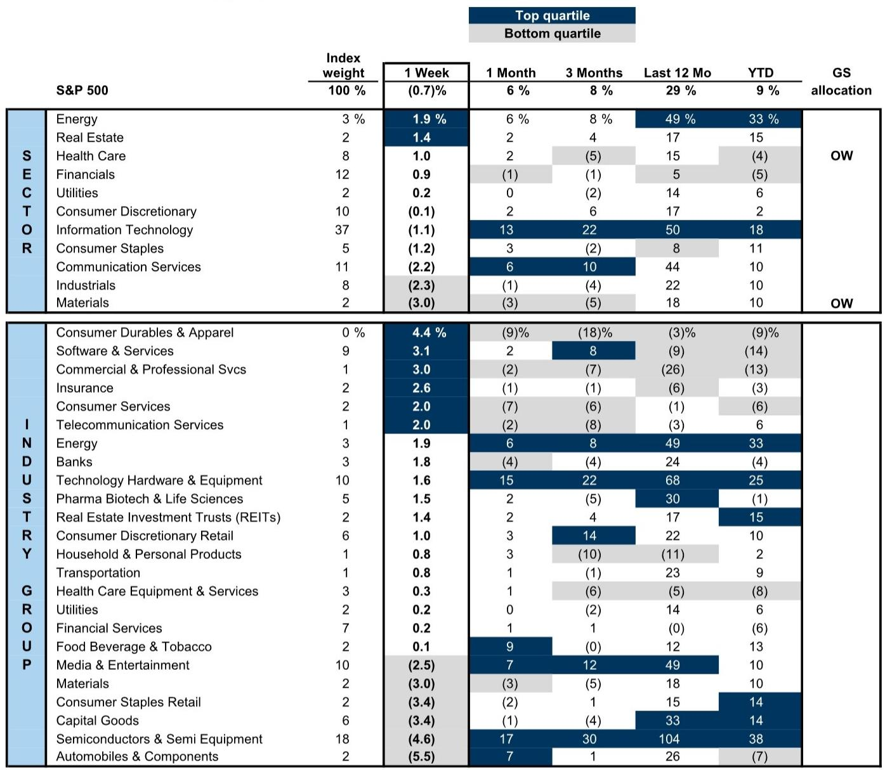
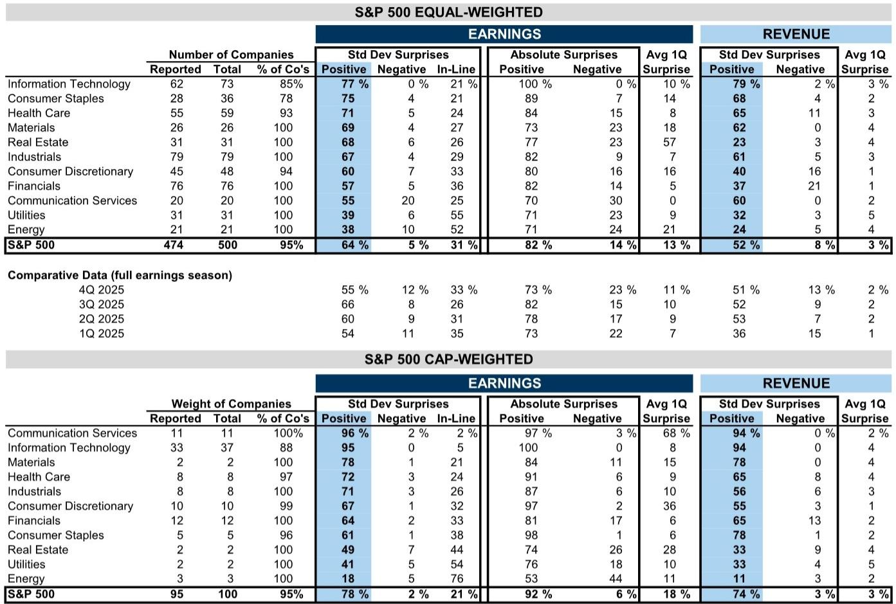
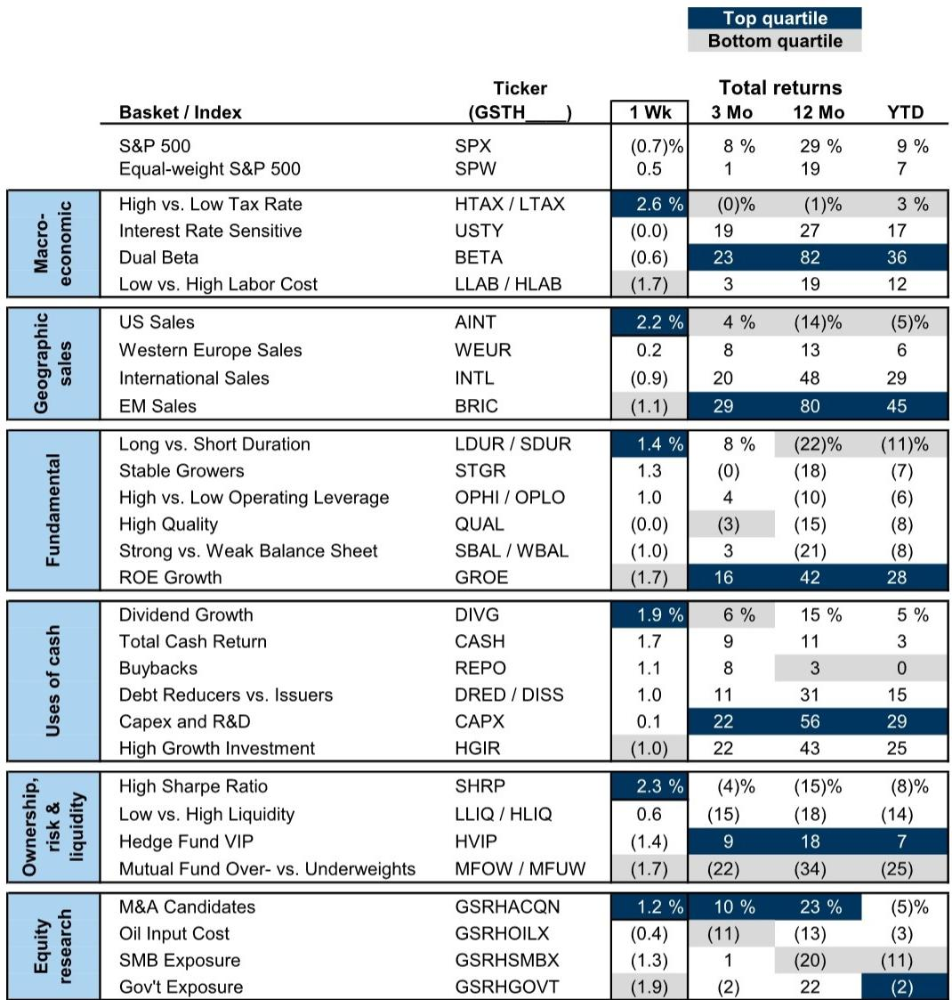

# Institutional Money Is Making a Decisive Bet Against Software and Into Semiconductors — And That Signal Is More Powerful Than Any Single Earnings Beat

The most important portfolio rotation happening in institutional equity markets today is not a tactical hedge. It is a structural reallocation. Hedge funds and mutual funds, which together oversee nearly $9 trillion in equity positions, have spent the first half of 2026 systematically reducing exposure to Software and pouring capital into Semiconductors. This is not a minor sector tilt. The weight of Semiconductors in the hedge fund long portfolio is now at an all-time high. The weight of Software is at its lowest since 2019. Mutual funds, for their part, are carrying the widest underweight in Software excluding Microsoft since at least 2012.

These are not coincidental moves by a few outlier managers. They represent a broad consensus among two of the most influential investor groups in the world. And they arrive at a moment when the relationship between fund performance and benchmark outperformance is under unusual strain. Only 30% of large-cap mutual funds have beaten their benchmarks year-to-date, well below the historical average of 37%. Hedge funds have fared better, returning 7% year-to-date, but that performance has been heavily dependent on beta and a narrow set of crowded long positions. The divergence in returns is not the whole story. The divergence in positioning is.

The rotation from Software to Semiconductors is the clearest signal that institutional investors are reordering their portfolios around a new set of assumptions about where value creation will concentrate in the next phase of the technology cycle. The question for any serious investor is whether this consensus is already priced in, or whether it is the beginning of a much longer-term repricing.

## The Rotational Signal Is Unusually Strong Because Both Hedge Funds and Mutual Funds Are Moving in the Same Direction — and Away From Consensus Sectors

When hedge funds and mutual funds disagree, the market often reflects a healthy diversity of views. When they agree, the signal is worth paying attention to. In the current environment, they agree on most sectors. Both groups are overweight Industrials and underweight Information Technology as a whole. But the agreement breaks down in two notable places: Financials and Consumer Discretionary. Mutual funds are overweight Financials while hedge funds are underweight. Hedge funds are overweight Consumer Discretionary while mutual funds are underweight. These are important divergences, but they are not the main event.

The main event is the intra-sector rotation within Information Technology. Both fund types are reducing Software and adding Semiconductors. That dual alignment is rare. It suggests that the move is not driven by a single investment style or time horizon. Hedge funds, which tend to be more nimble and momentum-driven, and mutual funds, which are typically more benchmark-aware and longer-term, have arrived at the same conclusion from different starting points. Hedge funds increased their net tilt to Information Technology by 853 basis points during Q1, the largest sector change on record. Mutual funds, by contrast, cut their Information Technology exposure by 20 basis points. But the direction within the sector is identical.

This is not a passive rebalancing. It is an active bet that the software business model, which has enjoyed years of premium valuations and recurring revenue narratives, is facing headwinds that semiconductors, despite their cyclical reputation, are better positioned to weather. The data supports this interpretation. Mutual funds entered Q2 with their lowest exposure to Software since at least 2012. The tilt between Semis and Software, excluding mega-caps, is the widest it has been in over a decade.

The implication is clear: institutional money is voting with conviction that the next leg of technology returns will come from the physical layer of the stack, not the application layer.

## The Rotation Reflects a Deeper Reassessment of Earnings Quality and Cash Flow Visibility, Not Just a Momentum Chase

It would be easy to dismiss this rotation as a simple momentum trade. Hedge funds have ridden the wave of Momentum outperformance this year, and semiconductors have been among the strongest performers. But that interpretation misses the structural logic underneath the surface.

The earnings data from Q1 2026 tells a more nuanced story. In the S&P 500 equal-weight universe, Information Technology companies reported the highest proportion of positive earnings surprises of any sector, at 77%. The absolute surprise rate was 100%, meaning every company that reported beat expectations. Revenue surprises were similarly strong, with 79% of companies reporting positive surprises. These are exceptional numbers. But they are aggregate figures. What matters for the rotation is the composition.

Software companies, particularly those outside the mega-cap names, have been grappling with slowing revenue growth, rising customer acquisition costs, and a more discerning enterprise spending environment. The era of double-digit subscription growth fueled by digital transformation budgets is maturing. Semiconductors, by contrast, are benefiting from a structural demand cycle driven by artificial intelligence infrastructure, data center buildouts, and the electrification of industrial and automotive end markets. The earnings beats in Semis are not just about a cyclical upswing. They reflect a multi-year investment cycle that is still in its early innings.

This is why the rotation is not merely a sector preference. It is a bet on the durability of earnings growth. Hedge funds and mutual funds are effectively saying that the cash flow visibility in Semiconductors, supported by long-term capital expenditure commitments from hyperscalers and governments, is more reliable than the recurring revenue visibility in Software, which is increasingly subject to competitive churn and pricing pressure.

## The "Shared Favorites" List Reveals Where the Market Is Willing to Pay a Premium for Quality, but It Also Raises Questions About Concentration Risk

Every quarter, the overlap between hedge fund VIP positions and mutual fund overweight positions produces a short list of "shared favorites." This quarter, there are four: BA, MA, MRVL, and V. MRVL enters the list for the first time, while C and VRT drop out. These stocks have returned 10% year-to-date, outperforming the equal-weight S&P 500 by 3 percentage points. Since 2013, shared favorites have delivered an annual return of 16% with a standard deviation of 22%. The median shared favorite stock trades at a P/E of 34x, nearly double the median S&P 500 multiple of 18x.

The performance track record is compelling. But the valuation premium is worth interrogating. These stocks are not cheap. They are quality compounders that the market is willing to pay up for, and historically that has been rewarded. But the concentration of institutional capital in a shrinking list of names introduces a different kind of risk. When both hedge funds and mutual funds are overweight the same stocks, the exit door becomes narrower. A shared favorite that disappoints on earnings or guidance can suffer outsized drawdowns because there is no natural buyer on the other side.

The absence of any Magnificent 7 stocks from the shared favorites list is also notable. Every Magnificent 7 constituent screens as a hedge fund VIP but also as a mutual fund underweight. This means that while hedge funds are still leaning into mega-cap tech, mutual funds are actively reducing exposure. The divergence between the two groups on these names suggests that the consensus on mega-cap tech is fraying. For investors who rely on these stocks as portfolio anchors, the message is clear: the institutional support is no longer as uniform as it once was.

## What the Report Does Not Fully Answer: Whether the Rotation Is a Leading Indicator of Broader Factor Regime Change or a Late-Cycle Positioning Trap

For all the clarity the positioning data provides, it leaves several critical questions unanswered. The most important is whether this rotation from Software to Semiconductors is a leading indicator of a broader factor regime change, or whether it is a late-cycle positioning trap that will reverse as quickly as it emerged.

The report documents the rotation with precision, but it does not and cannot answer whether the catalysts for the rotation are sustainable. The semiconductor cycle has historically been volatile. Capacity additions take years to come online, and when they do, they often overshoot demand. The current enthusiasm for Semis is built on an assumption that the AI-driven demand cycle is structurally different from previous cycles. That may be true. But it is an assumption, not a certainty.

Similarly, the underweight in Software assumes that the headwinds facing the sector are structural rather than cyclical. If enterprise software spending reaccelerates, or if a new wave of innovation emerges from within the software ecosystem, the positioning could look very crowded on the wrong side. The report does not provide a framework for distinguishing between these scenarios.

There is also the question of what happens when the current consensus breaks. Both hedge funds and mutual funds are now heavily positioned in the same direction within Technology. If a negative catalyst emerges — a geopolitical disruption affecting semiconductor supply chains, a regulatory crackdown on AI infrastructure spending, or a sharp downturn in enterprise IT budgets — the unwind could be violent. The report notes that hedge fund gross leverage remains elevated relative to history and that short interest in the median S&P 500 stock is at its highest since 2011. That combination of high leverage and high short interest is a recipe for sudden dislocations.

## A Decision Framework for Investors: How to Interpret the Institutional Positioning Signal Without Blindly Following It

The value of institutional positioning data is not that it tells you what to buy. It is that it reveals where the smartest money in the market is placing its bets, and more importantly, where it is not. The framework for using this data should be structured around three questions.

First, is the consensus positioning consistent with the fundamental outlook? In the case of Semiconductors, the answer is yes, but with caveats. The demand outlook for AI-related chips is strong, but the supply response is accelerating. Investors should distinguish between companies that have pricing power and those that are capacity-constrained. The report shows that hedge funds added to LRCX, AMAT, and ASML, while mutual funds added to INTC and SITM. These are different bets within the same sector. The former are capital equipment and lithography plays, benefiting from the buildout of fabrication capacity. The latter are more direct chip plays, subject to end-market demand volatility.

Second, what is the market not pricing? The rotation out of Software suggests that the market is pricing in a prolonged period of underperformance for that sector. But the report also shows that hedge funds and mutual funds reduced positions in Microsoft during Q2. That is a significant data point. Microsoft is not just any software company. It is the largest holding in many institutional portfolios and a bellwether for enterprise software spending. If both fund types are reducing exposure to Microsoft, it signals a broader skepticism about the near-term outlook for the entire software ecosystem.

Third, what is the risk of crowding? The shared favorites list is small, and the valuation premium is high. Investors who are already exposed to these names should assess whether they have adequate diversification. The same logic applies to the broader Semiconductor positioning. When a sector reaches an all-time high in institutional portfolio weight, incremental returns are likely to be lower and drawdown risk higher. The best time to add exposure was when the rotation was just beginning, not when it is being widely reported.

## The Full Report Contains the Charts and Data That Make These Trends Actionable

The positioning data discussed here is drawn from the most recent Hedge Fund Trend Monitor and Mutual Fundamentals reports, which analyze $9 trillion in equity positions as of the start of Q2 2026. The full report includes detailed exhibits on sector tilts, stock-level additions and reductions, the performance of shared favorites over time, and a comprehensive breakdown of Q1 2026 earnings surprises by sector. These charts are not decorative. They are the raw material for building a conviction-based investment strategy.

For investors who want to move beyond headlines and into the granular data that drives institutional decision-making, the full report is essential reading. The charts reveal patterns that are invisible in summary statistics. They show the magnitude of the rotation, the speed of the change, and the names that are driving it. Without this data, it is impossible to know whether your portfolio is positioned with or against the institutional consensus.

Join the community to read the full report and review the original charts.

*This article is for learning and discussion only and does not constitute investment advice.*

Personal reading notes and learning share only. Not investment advice.

