# EUROPEAN ECONOMICS ANALYST

# Spain – Structural Resilience Beyond the Energy Shock

Although the energy shock is taking its toll on the Spanish economy, we still expect economic growth to outperform the rest of the Euro area. With growth running strongly above trend and the primary fiscal balance at the highest level since 2007, Spanish sovereign spreads are well-supported, relatively tight and resilient.   
The fiscal mix in Spain differs from other EMU4 countries. The government has decided not to prioritise defence spending and, even though the Spanish economy is less exposed to the conflict in the Middle East given its lower energy intensity, its fiscal response to the surge in energy prices is the most aggressive within the EMU4.   
■ Strong job growth has coincided with strong immigration and a shift in the workforce towards higher value-added service sectors—especially professional services, finance, and information technology—continuing to signal structural progress in the Spanish economy. Since 2021, Spain has recorded the highest productivity growth, per employee and per hour, within the EMU4.   
Investment growth remains resilient and broad-based. Spain's total capital expenditure is back to the level before the sovereign debt crisis and investment as a percent of GDP is set to overtake the Euro area, US and UK in 2026. The composition of the investment recovery also looks promising. The construction sector has consolidated its growth momentum and the surge in residential real estate prices due to net migration should attract additional investment in the sector. The key support from the European Recovery Fund comes to an end this year. However, we estimate that its effect will extend further.   
Against this macro backdrop, investors are constructive on Spanish government bonds. Our analysis finds no pricing of domestic risk: Spanish sovereign spreads have widened only in combination with flatter yield curves across Europe, pointing to rising inflation and slowing global growth as the sole factors responsible for the recent widening.   
We see two main risks that could potentially challenge this constructive outlook. As we move into the Summer, we estimate that an unresolved energy crisis feeding into air travel costs could lower GDP by $0.3\%$ for every $10\%$ reduction in tourist arrivals by air. Looking ahead to the 2027 election, any shift in opinion polls pointing to another split parliament or an increased likelihood of a minority

# Filippo Taddei

+44(20)7774-5458

filippo.taddei@gs.com

GS International

government would reduce investors' confidence in extended gains on the economic front.

# Spain – Structural Resilience Beyond the Energy Shock

Spain's macro outperformance remains visible both in economic activity and in sovereign debt pricing. Economic activity has continued to run ahead of the Euro area and the US since the middle of last year, while sovereign spreads have remained comparatively tight, indicating investors' confidence in the outlook for Spain. That said, the Spanish economy is set to slow down because of the energy shock, although it is still outperforming the Euro area (Exhibit 1).

Exhibit 1: Growth Outperformance Keeps Spreads Tight   
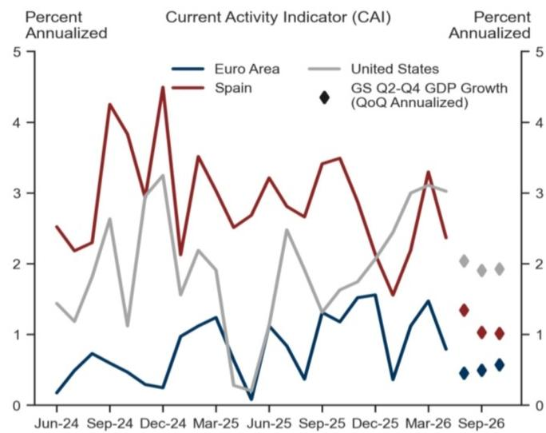

line

| Date    | Euro Area | United States | Spain | GS Q2-Q4 GDP Growth (QoQ Annualized) |
|---------|-----------|---------------|-------|--------------------------------------|
| Jun-24  | 0.2       | 1.5           | 2.5   | -                                    |
| Sep-24  | 0.7       | 2.7           | 4.3   | -                                    |
| Dec-24  | 0.3       | 3.2           | 4.5   | -                                    |
| Mar-25  | 1.2       | 2.0           | 3.5   | -                                    |
| Jun-25  | 0.1       | 0.3           | 2.8   | -                                    |
| Sep-25  | 1.0       | 2.5           | 3.5   | -                                    |
| Dec-25  | 1.5       | 1.8           | 3.0   | -                                    |
| Mar-26  | 1.6       | 3.0           | 3.3   | -                                    |
| Sep-26  | 0.8       | 3.0           | 2.5   | 1.0                                  |

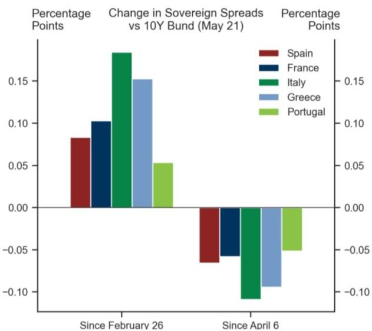

bar

Change in Sovereign Spreads vs 10Y Bund (May 21)
| Country | Change in Sovereign Spreads (%) |
| :--- | :--- |
| Spain | 0.085 |
| France | 0.102 |
| Italy | 0.175 |
| Greece | 0.152 |
| Portugal | 0.053 |
| Since February 26 | -0.065 |
| Since April 6 | -0.055 |
| Percentage Points | Change in Sovereign Spreads vs 10Y Bund (May 21) |
| Percentage Points | Change in Sovereign Spreads vs 10Y Bund (May 21) |
| Spain | -0.065 |
| France | -0.055 |
| Italy | -0.105 |
| Greece | -0.095 |
| Portugal | -0.045 |

Source: GS Global Investment Research, Haver Analytics

Current macroeconomic performance compares favourably from an historical standpoint. Spain entered this energy crisis from a relatively robust macro position. Even accounting for the upcoming slowdown, we forecast real GDP growth in 2026 at or above the long-run average, while the primary fiscal balance compares favourably with historical precedents and is the third-highest in the last 19 years (Exhibit 2).

Exhibit 2: Primary Balance and Real Growth are Close or Above the Historical Average   
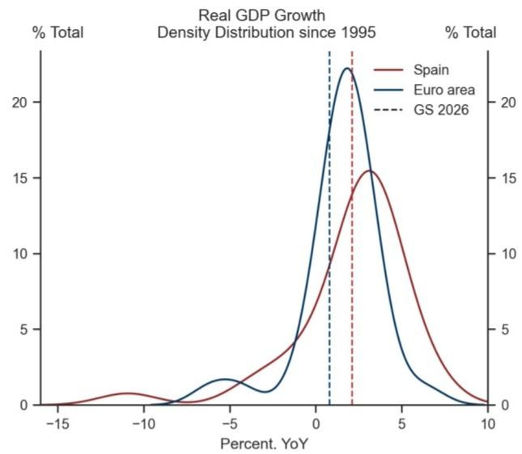

line

| Percent. YoY | Spain | Euro area | GS 2026 |
| ------------ | ----- | --------- | ------- |
| -15          | 0     | 0         | 0       |
| -10          | 1     | 0         | 0       |
| -5           | 2     | 2         | 0       |
| 0            | 8     | 18        | 0       |
| 5            | 15    | 10        | 0       |
| 10           | 0     | 0         | 0       |

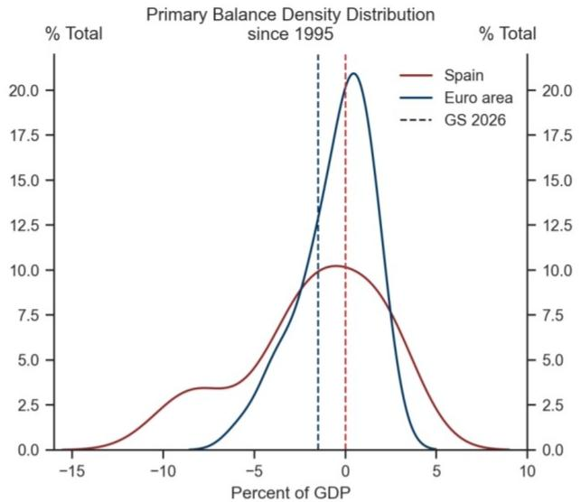

line

| Percent of GDP | Spain | Euro area | GS 2026 |
| -------------- | ----- | --------- | ------- |
| -15            | 0.0   | 0.0       | 0.0     |
| -10            | 3.0   | 0.0       | 0.0     |
| -5             | 5.0   | 5.0       | 0.0     |
| 0              | 10.0  | 20.0      | 17.5    |
| 5              | 5.0   | 0.0       | 0.0     |
| 10             | 0.0   | 0.0       | 0.0     |

Source: GS Global Investment Research, Haver Analytics

# A Relatively Strong Fiscal Response to the Energy Crisis Leaves the Fiscal Balance in a Good Place

Spain's lower energy intensity helps contain the direct hit to growth, while fiscal risks remain manageable despite a relatively significant policy response. Since the 2022 energy crisis, Spain has been the least exposed in the EMU4 to the surge in energy prices. The fiscal cost of the most common measures used to shield consumers also sit at the lower end of the distribution in Spain, with the notable exception of tax cuts for petrol and diesel (Exhibit 3).

Exhibit 3: Lower Energy Exposure, Limited Fiscal Risk   
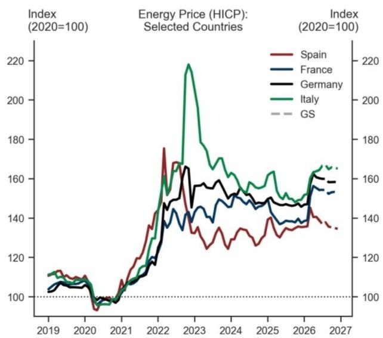

line

| Year | Spain | France | Germany | Italy | GS |
|------|-------|--------|---------|-------|----|
| 2019 | 110   | 105    | 108     | 112   | 100 |
| 2020 | 105   | 102    | 104     | 106   | 100 |
| 2021 | 108   | 106    | 107     | 109   | 100 |
| 2022 | 175   | 145    | 148     | 165   | 140 |
| 2023 | 165   | 155    | 160     | 220   | 160 |
| 2024 | 155   | 150    | 152     | 170   | 155 |
| 2025 | 145   | 148    | 149     | 165   | 150 |
| 2026 | 140   | 155    | 158     | 168   | 155 |
| 2027 | 135   | 158    | 160     | 170   | 160 |

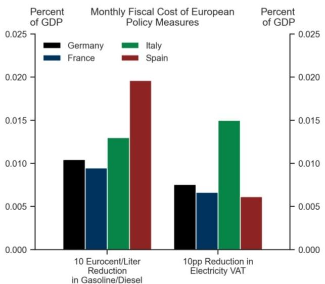

bar

Monthly Fiscal Cost of European Policy Measures
| Country | 10 Eurocent/Liter Reduction in Gasoline/Diesel (Percent of GDP) | 10pp Reduction in Electricity VAT (Percent of GDP) |
| :--- | :--- | :--- |
| Germany | 0.0105 | 0.0075 |
| France | 0.0095 | 0.0065 |
| Italy | 0.013 | 0.015 |
| Spain | 0.0195 | 0.006 |

Source: GS Global Investment Research, Haver Analytics

However, Spain has delivered one of the most forceful energy-related fiscal responses in the region. Its decision not to prioritise defence spending and its relative insulation from the shock has allowed policymakers to provide support without materially undermining the broader fiscal position. While the increase in support has been the largest in the

EMU4, the fiscal balance remains among the most constructive in the Euro area. Spain's policy mix has been relatively expansionary, but it has not damaged its credibility from a sovereign perspective as Spain remains the only EMU4 country where we expect the debt-to-GDP ratio to be lower over the next three years (Exhibit 4).

Exhibit 4: Larger Energy Support, Strong Fiscal Position   
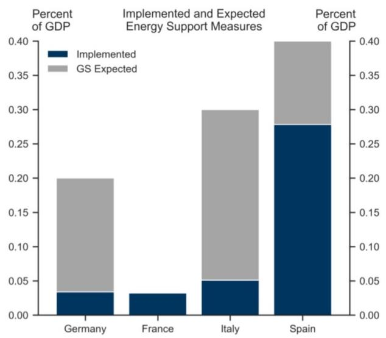  
EMU3 includes Germany, France and Italy.

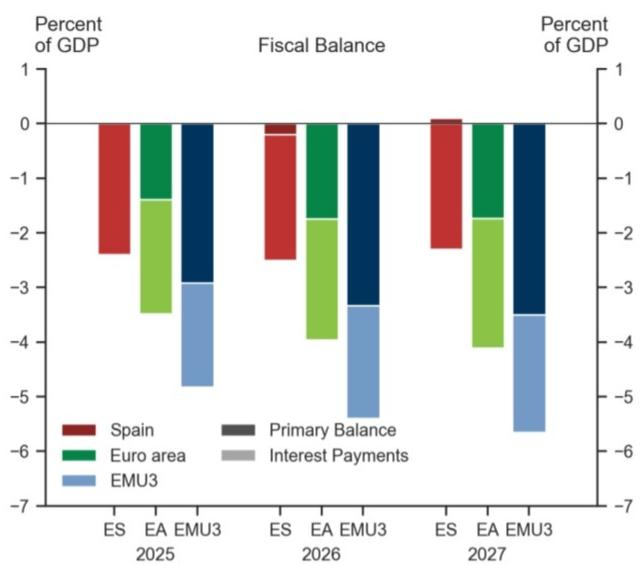

bar_stacked

| Year | Category | Spain (%) | Euro area (%) | EMU3 (%) | Primary Balance (%) | Interest Payments (%) |
|---|---|---|---|---|---|---|
| 2025 | ES | -2.5 | -1.5 | -3.0 | -0.5 | -4.5 |
| 2026 | ES | -2.5 | -1.8 | -3.5 | -0.5 | -5.0 |
| 2027 | ES | -2.3 | -1.8 | -3.8 | -0.5 | -5.5 |
Percent of GDP (top) (ES/EA/EMU3) = 0; Percent of GDP (bottom) = 1. The chart displays the contribution of each component to GDP over time. Legend indicates: Spain (red), Euro area (green), EMU3 (blue), Primary Balance (dark gray), Interest Payments (light gray).

Source: GS Global Investment Research, Haver Analytics, Bruegel

# Continuing Evidence of Structural Productivity Improvements

The employment rate is the highest it has ever been and the unemployment rate is the lowest since 2008. The Spanish labour market remains cyclically stable, accommodating large net migration flows, and employment gains have increasingly been concentrated in higher-value-added service sectors (professional services, finance and ICT). This job reallocation, a specific feature of the Spanish economy in the European landscape, appears to be feeding through into stronger productivity performance. Spain's recent outperformance likely reflects a gradual improvement in the quality—not only the quantity—of labour demand (Exhibit 5).

Exhibit 5: Labour Reallocation Supports Productivity   
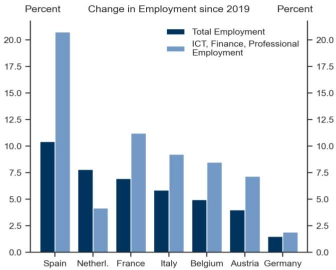

bar

| Country | Total Employment (%) | ICT, Finance, Professional Employment (%) |
| :--- | :--- | :--- |
| Spain | 10.4 | 20.6 |
| Netherl. | 7.8 | 4.2 |
| France | 6.9 | 11.3 |
| Italy | 5.8 | 9.3 |
| Belgium | 5.0 | 8.5 |
| Austria | 4.0 | 7.2 |
| Germany | 1.5 | 2.0 |

GVA stands for Gross Value Added.

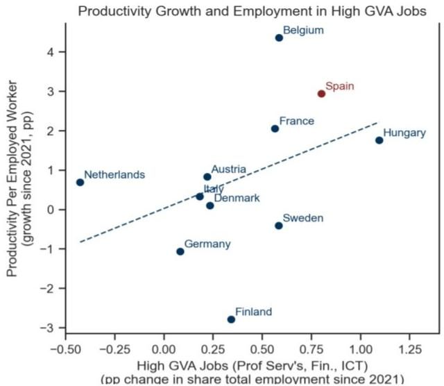

scatter

| Country     | High GVA Jobs (Prof Serv's, Fin., ICT) | Productivity Per Employed Worker (growth since 2021, pp) |
| ----------- | -------------------------------------- | -------------------------------------------------------- |
| Belgium     | 0.6                                    | 4.5                                                      |
| Spain       | 0.8                                    | 3.0                                                      |
| France      | 0.6                                    | 2.0                                                      |
| Hungary     | 1.1                                    | 1.8                                                      |
| Netherlands | -0.3                                   | 0.7                                                      |
| Austria     | 0.2                                    | 0.9                                                      |
| Italy       | 0.2                                    | 0.4                                                      |
| Denmark     | 0.3                                    | 0.1                                                      |
| Germany     | 0.1                                    | -1.0                                                     |
| Sweden      | 0.6                                    | -0.5                                                     |
| Finland     | 0.4                                    | -3.0                                                     |

Source: GS Global Investment Research, Haver Analytics

Capital accumulation has also been an engine for growth. The investment recovery in Spain is both resilient and broad. Capital expenditure has regained ground relative to past cycles and is set to close the investment gap with the Euro area, US and UK this year. The composition of the investment recovery looks especially promising, with capital expenditure on machinery and intellectual property products the highest in 25 years. A durable investment momentum is typically associated with an extended expansion (Exhibit 6).

Exhibit 6: Investment Recovery Gains Traction   
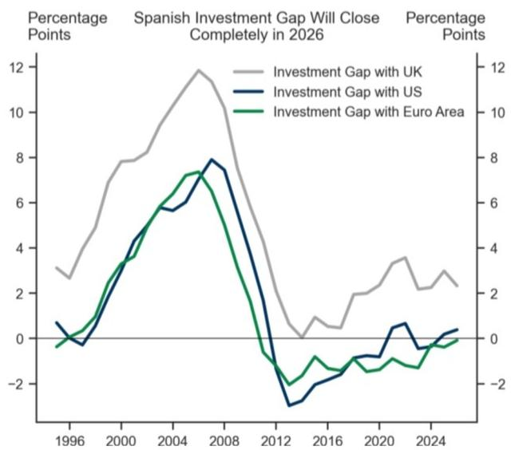

line

| Year | Investment Gap with UK | Investment Gap with US | Investment Gap with Euro Area |
|------|------------------------|------------------------|-------------------------------|
| 1996 | ~3                     | ~0.5                   | ~0                            |
| 2000 | ~8                     | ~4                     | ~3                            |
| 2004 | ~10                    | ~6                     | ~7                            |
| 2008 | ~12                    | ~8                     | ~7                            |
| 2012 | ~0                     | ~-3                    | ~-1                           |
| 2016 | ~1                     | ~-1                    | ~-1                           |
| 2020 | ~3                     | ~0                     | ~-1                           |
| 2024 | ~2                     | ~0.5                   | ~-1                           |

Source: GS Global Investment Research, Haver Analytics

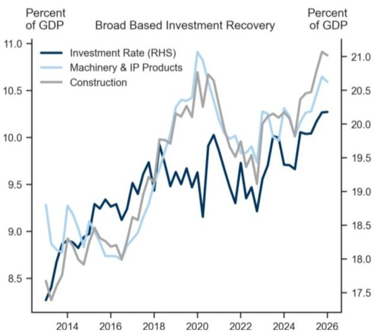

line

| Year | Investment Rate (RHS) | Machinery & IP Products | Construction |
|------|------------------------|--------------------------|--------------|
| 2014 | 8.5                    | 9.3                      | 8.7          |
| 2016 | 9.0                    | 8.8                      | 8.9          |
| 2018 | 9.5                    | 9.7                      | 9.8          |
| 2020 | 10.0                   | 10.8                     | 10.7         |
| 2022 | 9.5                    | 10.2                     | 10.3         |
| 2024 | 10.0                   | 10.5                     | 10.6         |
| 2026 | 10.3                   | 10.7                     | 10.9         |

The construction sector has consolidated its growth momentum. Net migration into Spain in particular has been elevated since 2023 and a key factor supporting economic growth. But demographic pressure has also tightened the housing market, raising sharply residential real estate prices by almost $20\%$ over the last two years. While house prices have risen, supply has struggled to keep pace and we estimate that housing

investment needs to double in order to normalize residential real estate appreciation. We expect this factor, along with the surge in residential real estate prices due to net migration, to attract additional investment in the sector (Exhibit 7).

Exhibit 7: Net Migration and Demographics Lift Housing Prices   
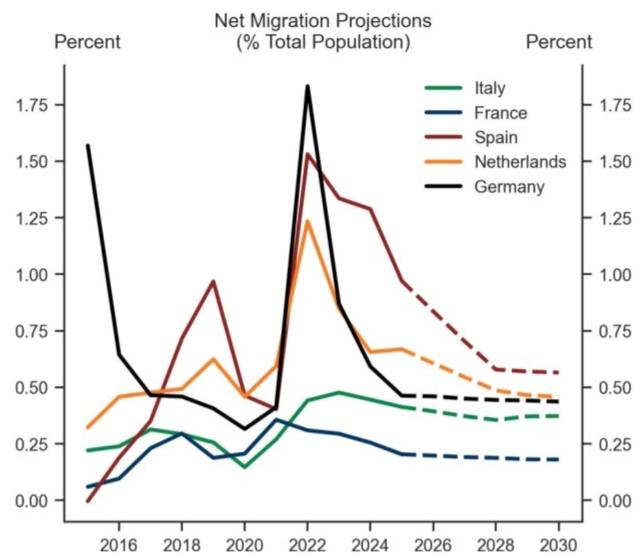

line

| Year | Italy | France | Spain | Netherlands | Germany |
|------|-------|--------|-------|-------------|---------|
| 2016 | 0.25  | 0.10   | 0.05  | 0.40        | 1.60    |
| 2018 | 0.30  | 0.25   | 0.75  | 0.50        | 0.45    |
| 2020 | 0.15  | 0.20   | 0.45  | 0.55        | 0.35    |
| 2022 | 0.45  | 0.30   | 1.55  | 1.25        | 1.85    |
| 2024 | 0.40  | 0.25   | 1.30  | 0.70        | 0.85    |
| 2026 | 0.35  | 0.20   | 1.00  | 0.65        | 0.45    |
| 2028 | 0.35  | 0.20   | 0.60  | 0.55        | 0.45    |
| 2030 | 0.35  | 0.20   | 0.60  | 0.45        | 0.45    |

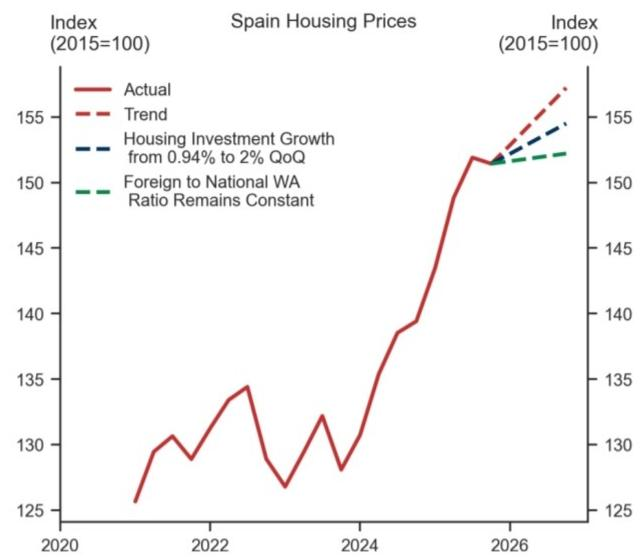

line

| Year | Actual | Trend | Housing Investment Growth from 0.94% to 2% QoQ | Foreign to National WA Ratio Remains Constant |
|------|--------|-------|-----------------------------------------------|---------------------------------------------|
| 2020 | 125    | -     | -                                             | -                                           |
| 2022 | 135    | -     | -                                             | -                                           |
| 2024 | 130    | -     | -                                             | -                                           |
| 2026 | 155    | 155   | 155                                           | 150                                         |

Source: GS Global Investment Research, Haver Analytics

The government has also set up a specific policy tool to support developments in the housing sector. By establishing the España crece (Spain Grows) fund, the government plans to mobilise EUR 60bn through the Official Credit Institute (ICO) to reach a total investment of around EUR 120 billion (9% of GDP), combining public and private capital. Endowed with a capital injection of EUR10.5bn from the European Recovery Plan, the fund explicitly targets private leverage to augment investment in residential developments.

The fund was also part of a broader strategy of the Spanish government to extend the impact of the European Recovery Fund beyond the end of the programme in 2026. The Recovery Fund has been a key factor supporting investment growth and comes to an end this year. Since a large share of investment projects will only be completed in the first half of next year and with the España crece fund in place, we estimate that the support of the European Recovery Fund will extend beyond the end of 2026, suggesting a moderation rather than collapse of fiscal support for investment, and reducing the risk of an abrupt halt in capex momentum (Exhibit 8).

Exhibit 8: Recovery Fund Support Fades Gradually   
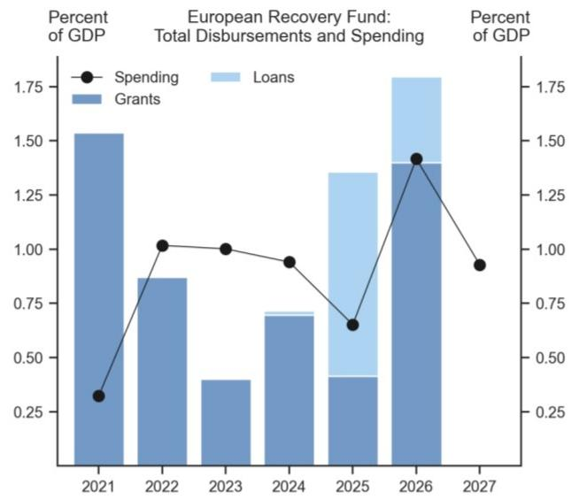

bar_line

European Recovery Fund: Total Disbursements and Spending
| Year | Spending (%) | Loans (%) | Grants (%) |
|---|---|---|---|
| 2021 | 0.3 | - | 1.5 |
| 2022 | 1.0 | - | 0.85 |
| 2023 | 1.0 | - | 0.4 |
| 2024 | 0.95 | 0.15 | 0.7 |
| 2025 | 0.65 | 0.45 | 0.4 |
| 2026 | 1.45 | 0.75 | 1.4 |
| 2027 | 0.95 | - | - |

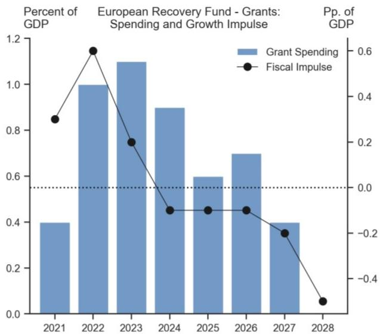

bar_line

European Recovery Fund - Grants: Spending and Growth Impulse
| Year | Grant Spending (%) | Fiscal Impulse ($) |
|---|---|---|
| 2021 | 0.4 | 0.3 |
| 2022 | 1.0 | 0.6 |
| 2023 | 1.1 | 0.2 |
| 2024 | 0.9 | -0.1 |
| 2025 | 0.6 | -0.1 |
| 2026 | 0.7 | -0.1 |
| 2027 | 0.4 | -0.2 |
| 2028 | | -0.5 |

Source: GS Global Investment Research, Haver Analytics

# A Constructive Outlook for Spanish Debt

Investors are constructive on Spanish bonds as weakening momentum due to the energy crisis seems to have been unaffected by country-specific risks. In line with previous work, we use a simple structural vector autoregression (SVAR) model with “sign restrictions” to disentangle the underlying macro drivers of sovereign debt pricing. To do so, we define the drivers as follows:

1. Euro Area Shock: when both the Spanish and German sovereign yield curve flatten (10y-2y Bonos and 10y-2y Bund) and the Spanish sovereign spread (10y Bonos-Bund) widens.   
2. Domestic Shock: when only the Spanish sovereign yield curve flattens and the Spanish sovereign spread widens at the same time.   
3. Long-End Rates Sell-off: when both the Spanish and German sovereign yield curves steepen and the Spanish sovereign spread widens.

In this simple way, it is possible to assess whether the market pricing of Spanish sovereign spreads is more likely to be due to external macro factors – e.g., a deteriorated growth outlook or inflation surging in the region, with rates selling off – or to risk factors specific to the Spanish landscape that push up the yield curve and widen the sovereign spread at the same time. We find that domestic risk (a flatter Spanish curve and wider spread) has remained contained throughout the energy shock so far, while spread widening has been combined with flatter yield curves across Europe. This points to rising inflation and growth concerns beyond the idiosyncratic risks for the Spanish economy and is consistent with the view that investors are currently attaching a negligible Spain-specific risk premium (Exhibit 9).

Exhibit 9: Spreads Price European, Not Domestic, Risk   

line

| Year | 10y Bonos-Bund Spread | 10y-2y Bund | 10y-2y Bonos |
|------|------------------------|-------------|--------------|
| 2008 | ~0.5                   | ~0.0        | ~1.0         |
| 2012 | ~6.0                   | ~2.5        | ~3.5         |
| 2016 | ~1.5                   | ~1.0        | ~2.0         |
| 2020 | ~1.0                   | ~0.5        | ~1.5         |
| 2024 | ~0.5                   | ~0.0        | ~1.0         |

line

| Date    | Spread | Euro Area Shock | Domestic Shock | Rates Sell-off |
|---------|--------|-----------------|----------------|----------------|
| Mar-16  |        |                 |                |                |
| Mar-17  |        |                 |                |                |
| Mar-18  |        |                 |                |                |
| Mar-19  |        |                 |                |                |
| Mar-20  |        |                 |                |                |
| Mar-21  |        |                 |                |                |
| Mar-22  |        |                 |                |                |
| Mar-23  |        |                 |                |                |
| Mar-24  |        |                 |                |                |
| Mar-25  |        |                 |                |                |
| Mar-26  |        |                 |                |                |

The sovereign spread depicted in the right chart shows the deviation of the spread form the sample average.   
Source: GS Global Investment Research, Haver Analytics

# Two Risks To Watch: Energy Hit on the Tourism Sector and Prolonged Political Uncertainty

We see two main risks that could potentially derail the otherwise constructive outlook for the Spanish economy.

The first is the potential impact of the energy crisis on the tourism sector in Spain specifically, and Southern Europe more broadly. As the Summer approaches, an unresolved energy crisis could feed into air travel costs. Tourist arrivals by air matter disproportionately for Spain's growth outlook. They not only represent almost $90\%$ of total international tourist arrivals in Spain but they also display a higher propensity to spend. An energy-driven increase in travel costs would not only reduce arrivals, but could also weigh more heavily on the highest-value segment of external demand (Exhibit 10).

Exhibit 10: Air Travel Brings Higher-Spending Tourists   
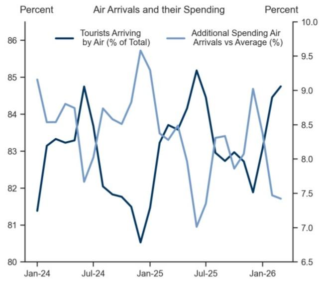

line

| Date   | Tourists Arriving by Air (% of Total) | Additional Spending Air Arrivals vs Average (%) |
|--------|----------------------------------------|--------------------------------------------------|
| Jan-24 | 81.5                                   | 9.0                                              |
| Jul-24 | 84.8                                   | 8.2                                              |
| Jan-25 | 80.5                                   | 9.5                                              |
| Jul-25 | 85.2                                   | 7.0                                              |
| Jan-26 | 84.5                                   | 7.5                                              |

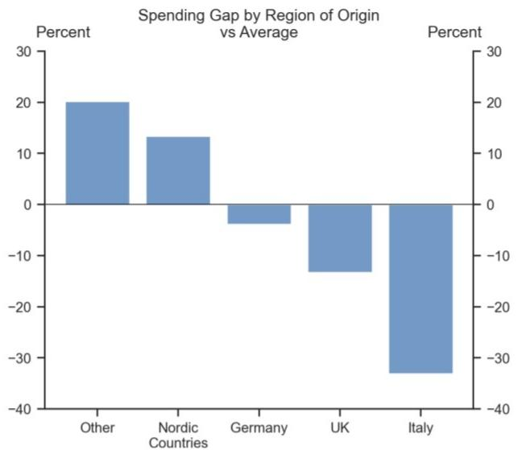

bar

Spending Gap by Region of Origin vs Average
| Region | Percentage (%) |
| :--- | :--- |
| Other | 20 |
| Nordic Countries | 13 |
| Germany | -4 |
| UK | -13 |
| Italy | -35 |

Source: GS Global Investment Research, Haver Analytics

The size of the tourism sector is not easy to measure because of the multiple spillovers in related sectors, such as trade and cultural services. However, available estimates place the sector in the range of 10–15% of Spanish GDP. The National Statistical Institute (INE) estimates that tourism contributes 12.6% of GDP. With this magnitude in mind, and taking into account the relevance of the summer season (June–September) and the share of international tourist arrivals by air in total spending, we find that every 10% reduction in tourist arrivals by air could lower GDP by about 0.3% (Exhibit 11).

Exhibit 11: Tourism is Large Share Spanish GDP and Tourist Arrivals by Air is Key Component   
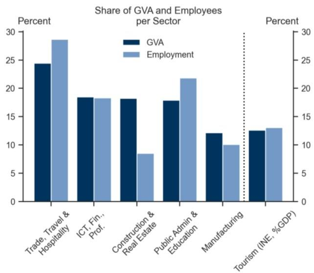

bar

Share of GVA and Employees per Sector
| Sector | GVA (%) | Employment (%) |
| :--- | :--- | :--- |
| Trade, Travel & Hospitality | 24.5 | 28.7 |
| ICT, Fin., Prof. | 18.5 | 18.3 |
| Construction & Real Estate | 18.2 | 8.4 |
| Public Admin & Education | 17.9 | 21.8 |
| Manufacturing | 12.1 | 10.0 |
| Tourism (INE, %GDP) | 12.6 | 13.0 |

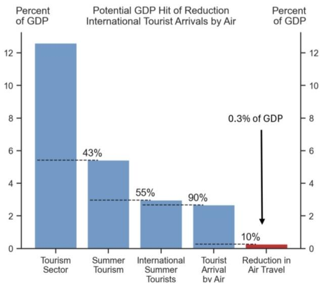

bar

| Category | Percent of GDP (%) |
| :--- | :--- |
| Tourism Sector | 12.5 |
| Summer Tourism | 5.4 |
| International Summer Tourists | 2.8 |
| Tourist Arrival by Air | 2.6 |
| Reduction in Air Travel | 0.3 |

Source: GS Global Investment Research, INE, Haver Analytics

The second risk for the Spanish outlook is prolonged political uncertainty. PM Sanchez has been in office since 2018, but since the 2023 snap election he has led a minority government unable to approve a fully fledged annual budget. This limited ability to shape fiscal policy has not impeded the reduction of Spain's fiscal deficit, but the support of the European Recovery Fund has been key in securing investment growth despite political fragmentation.

With the European programme coming to an end this year, the need for a government able to approve the annual budget will become more urgent. Current opinion polls suggest a steady shift in support from PM Sanchez's centre-left party (PSOE) to the alternative centre-right and fiscally conservative People's Party (PP), although they also point to a non-negligible likelihood that the 2027 election will deliver another divided parliament unable to form a clear and stable majority (Exhibit 12).

Exhibit 12: Polls Point to Likely Change of Ruling Coalition in 2027, But Risk of Political Fragmentation Remains   
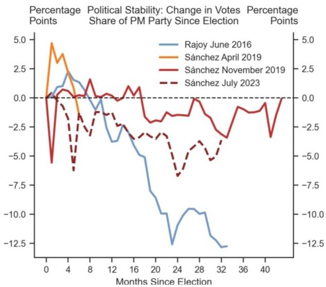

line

| Months Since Election | Rajoy June 2016 | Sánchez April 2019 | Sánchez November 2019 | Sánchez July 2023 |
| --------------------- | --------------- | ------------------ | --------------------- | ----------------- |
| 0                     | 0.0             | 5.0                | 0.0                   | 0.0               |
| 4                     | 2.5             | 3.0                | 1.0                   | -1.0              |
| 8                     | 1.0             | 0.0                | 0.0                   | -2.0              |
| 12                    | -3.0            | -1.0               | -1.0                  | -3.0              |
| 16                    | -5.0            | -2.0               | -2.0                  | -4.0              |
| 20                    | -7.5            | -3.0               | -3.0                  | -5.0              |
| 24                    | -12.5           | -4.0               | -4.0                  | -6.0              |
| 28                    | -10.0           | -5.0               | -5.0                  | -7.0              |
| 32                    | -12.5           | -6.0               | -6.0                  | -8.0              |
| 36                    | -12.5           | -7.0               | -7.0                  | -9.0              |
| 40                    | -12.5           | -8.0               | -8.0                  | -10.0             |
| 44                    | -12.5           | -9.0               | -9.0                  | -11.0             |

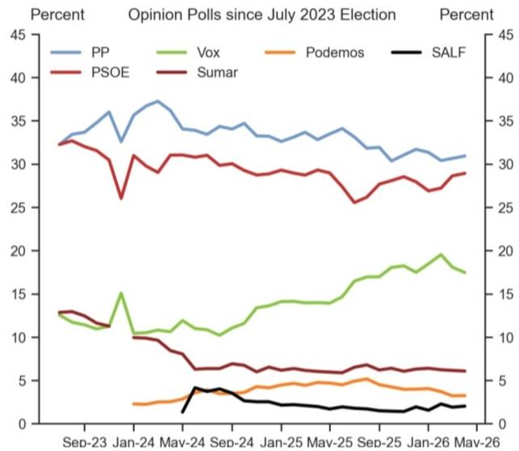

line

| Date     | PP   | PSOE | Vox  | Sumar | Podemos | SALF |
|----------|------|------|------|-------|---------|------|
| Sep-23   | 33   | 32   | 12   | 13    | 2       | 1    |
| Jan-24   | 37   | 26   | 15   | 10    | 3       | 2    |
| May-24   | 34   | 31   | 11   | 7     | 4       | 4    |
| Sep-24   | 35   | 30   | 13   | 6     | 5       | 3    |
| Jan-25   | 34   | 29   | 14   | 6     | 5       | 3    |
| May-25   | 35   | 28   | 15   | 6     | 5       | 3    |
| Sep-25   | 32   | 26   | 17   | 6     | 5       | 2    |
| Jan-26   | 31   | 28   | 19   | 6     | 4       | 2    |
| May-26   | 31   | 29   | 18   | 6     | 3       | 2    |

Source: GS Global Investment Research, Politico

Looking ahead to the 2027 election, investors are likely to focus on the likelihood of another parliament without a clear majority and the possibility of a minority government. Prolonged political uncertainty would likely reduce investors' confidence in the continuing transformation of the Spanish economy and weaken the case for our constructive outlook.

# Filippo Taddei

# Fausto Martin\*

\* Fausto is an intern with the European Economics Team

# The European Economics Team

# Sven Jari Stehn

+44(20)7774-8061

jari.stehn@gs.com

GS International

# Filippo Taddei

+44(20)7774-5458

filippo.taddei@gs.com

GS International

# Alexandre Stott

+33(1)4212-1108

alexandre.stott@gs.com

GS Bank Europe SE - Paris

Branch

# James Moberly

+44(20)7774-9444

james.r.moberly@gs.com

GS International

# Niklas Garnadt

+49(69)7532-1537

niklas.garnadt@gs.com

GS Bank Europe SE

# Katya Vashkinskaya

+44(20)7774-4833

katya.vashkinskaya@gs.com

GS International

# Giovanni Pierdomenico

+44(20)7051-6807

giovanni.pierdomenico@gs.com

GS International

# Disclosure Appendix

# Reg AC

I, Filippo Taddei, hereby certify that all of the views expressed in this report accurately reflect my personal views, which have not been influenced by considerations of the firm's business or client relationships.

Unless otherwise stated, the individuals listed on the cover page of this report are analysts in GS' Global Investment Research division.

Contributing Authors: Filippo Taddei GS International.

Unless otherwise stated, the individuals listed in the Contributing Authors disclosure of this report are analysts in GS' Global Investment Research division.

# Disclosures

# Regulatory disclosures

# Disclosures required by United States laws and regulations

See company-specific regulatory disclosures above for any of the following disclosures required as to companies referred to in this report: manager or co-manager in a pending transaction; $1\%$ or other ownership; compensation for certain services; types of client relationships; managed/co-managed public offerings in prior periods; directorships; for equity securities, market making and/or specialist role. GS trades or may trade as a principal in debt securities (or in related derivatives) of issuers discussed in this report.

The following are additional required disclosures: Ownership and material conflicts of interest: GS policy prohibits its analysts, professionals reporting to analysts and members of their households from owning securities of any company in the analyst's area of coverage. Analyst compensation: Analysts are paid in part based on the profitability of GS, which includes investment banking revenues. Analyst as officer or director: GS policy generally prohibits its analysts, persons reporting to analysts or members of their households from serving as an officer, director or advisor of any company in the analyst's area of coverage. Non-U.S. Analysts: Non-U.S. analysts may not be associated persons of GS & Co. LLC and therefore may not be subject to FINRA Rule 2241 or FINRA Rule 2242 restrictions on communications with a subject company, public appearances and trading in securities covered by the analysts.

# Additional disclosures required under the laws and regulations of jurisdictions other than the United States

The following disclosures are those required by the jurisdiction indicated, except to the extent already made above pursuant to United States laws and regulations. Australia: GS Australia Pty Ltd and its affiliates are not authorised deposit-taking institutions (as that term is defined in the Banking Act 1959 (Cth)) in Australia and do not provide banking services, nor carry on a banking business, in Australia. This research, and any access to it, is intended only for “wholesale clients” within the meaning of the Australian Corporations Act, unless otherwise agreed by GS. In producing research reports, members of Global Investment Research of GS Australia may attend site visits and other meetings hosted by the companies and other entities which are the subject of its research reports. In some instances the costs of such site visits or meetings may be met in part or in whole by the issuers concerned if GS Australia considers it is appropriate and reasonable in the specific circumstances relating to the site visit or meeting. To the extent that the contents of this document contains any financial product advice, it is general advice only and has been prepared by GS without taking into account a client’s objectives, financial situation or needs. A client should, before acting on any such advice, consider the appropriateness of the advice having regard to the client’s own objectives, financial situation and needs. A copy of certain GS Australia and New Zealand disclosure of interests and a copy of GS’ Australian Sell-Side Research Independence Policy Statement are available at: https://www.goldmansachs.com/disclosures/australia-new-zealand/index.html. Brazil: Disclosure information in relation to CVM Resolution n. 20 is available at https://www.gs.com/worldwide/brazil/area/gir/index.html. Where applicable, the Brazil-registered analyst primarily responsible for the content of this research report, as defined in Article 20 of CVM Resolution n. 20, is the first author named at the beginning of this report, unless indicated otherwise at the end of the text. Canada: This information is being provided to you for information purposes only and is not, and under no circumstances should be construed as, an advertisement, offering or solicitation by GS & Co. LLC for purchasers of securities in Canada to trade in any Canadian security. GS & Co. LLC is not registered as a dealer in any jurisdiction in Canada under applicable Canadian securities laws and generally is not permitted to trade in Canadian securities and may be prohibited from selling certain securities and products in certain jurisdictions in Canada. If you wish to trade in any Canadian securities or other products in Canada please contact GS Canada Inc., an affiliate of The GS Group Inc., or another registered Canadian dealer. Hong Kong: Further information on the securities of covered companies referred to in this research may be obtained on request from GS (Asia) L.L.C. India: Further information on the subject company or companies referred to in this research may be obtained from GS (India) Securities Private Limited, Research Analyst - SEBI Registration Number INH000001493, 10th Floor, Ascent-Worli, Sudam Kalu Ahire Marg, Worli, Mumbai-400 025, India, Corporate Identity Number U74140MH2006FTC160634, Phone +91 22 6616 9000, Fax +91 22 6616 9001. GS may beneficially own 1% or more of the securities (as such term is defined in clause 2 (h) the Indian Securities Contracts (Regulation) Act, 1956) of the subject company or companies referred to in this research report. Investment in securities market are subject to market risks. Read all the related documents carefully before investing. Registration granted by SEBI and certification from NISM in no way guarantee performance of the intermediary or provide any assurance of returns to investors. GS (India) Securities Private Limited compliance officer and investor grievance contact details can be found at: https://www.goldmansachs.com/worldwide/india/documents/Grievance-Redressal-and-Escalation-Matrix.pdf, and a copy of the annual audit compliance report can be found at this link: https://publishing.gs.com/content/site/india-annual-compliance-report.html. Japan: See below. Korea: This research, and any access to it, is intended only for “professional investors” within the meaning of the Financial Services and Capital Markets Act, unless otherwise agreed by GS. Further information on the subject company or companies referred to in this research may be obtained from GS (Asia) L.L.C., Seoul Branch. New Zealand: GS New Zealand Limited and its affiliates are neither “registered banks” nor “deposit takers” (as defined in the Reserve Bank of New Zealand Act 1989) in New Zealand. This research, and any access to it, is intended for “wholesale clients” (as defined in the Financial Advisers Act 2008) unless otherwise agreed by GS. A copy of certain GS Australia and New Zealand disclosure of interests is available at: https://www.goldmansachs.com/disclosures/australia-new-zealand/index.html. Russia: Research reports distributed in the Russian Federation are not advertising as defined in the Russian legislation, but are information and analysis not having product promotion as their main purpose and do not provide appraisal within the meaning of the Russian legislation on appraisal activity. Research reports do not constitute a personalized investment recommendation as defined in Russian laws and regulations, are not addressed to a specific client, and are prepared without analyzing the financial circumstances, investment profiles or risk profiles of clients. GS assumes no responsibility for any investment decisions that may be taken by a client or any other person based on this research report. Singapore: GS (Singapore) Pte. (Company Number: 198602165W), which is regulated by the Monetary Authority of Singapore, accepts legal responsibility for this research, and should be contacted with respect to any matters arising from, or in connection with, this research. Taiwan: This material is for reference only and must not be reprinted without permission. Investors should carefully consider their own investment risk. Investment results are the responsibility of the individual investor. United Kingdom: Persons who would be categorized as retail clients in the United Kingdom, as such term is defined in the rules of the Financial Conduct Authority, should read this research in conjunction with prior GS on the covered

companies referred to herein and should refer to the risk warnings that have been sent to them by GS International. A copy of these risks warnings, and a glossary of certain financial terms used in this report, are available from GS International on request.

European Union and United Kingdom: Disclosure information in relation to Article 6 (2) of the European Commission Delegated Regulation (EU) (2016/958) supplementing Regulation (EU) No 596/2014 of the European Parliament and of the Council (including as that Delegated Regulation is implemented into United Kingdom domestic law and regulation following the United Kingdom's departure from the European Union and the European Economic Area) with regard to regulatory technical standards for the technical arrangements for objective presentation of investment recommendations or other information recommending or suggesting an investment strategy and for disclosure of particular interests or indications of conflicts of interest is available at https://www.gs.com/disclosures/europeanpolicy.html which states the European Policy for Managing Conflicts of Interest in Connection with Investment Research.

Japan: GS Japan Co., Ltd. is a Financial Instrument Dealer registered with the Kanto Financial Bureau under registration number Kinsho 69, and a member of Japan Securities Dealers Association, Financial Futures Association of Japan Type II Financial Instruments Firms Association, and Investment Management Association of Japan. Sales and purchase of equities are subject to commission pre-determined with clients plus consumption tax. See company-specific disclosures as to any applicable disclosures required by Japanese stock exchanges, the Japanese Securities Dealers Association or the Japanese Securities Finance Company.

# Global product; distributing entities

GS Global Investment Research produces and distributes research products for clients of GS on a global basis. Analysts based in GS offices around the world produce research on industries and companies, and research on macroeconomics, currencies, commodities and portfolio strategy. This research is disseminated in Australia by GS Australia Pty Ltd (ABN 21 006 797 897); in Brazil by GS do Brasil Corretora de Títulos e Valores Mobiliários S.A.; Public Communication Channel GS Brazil: 0800 727 5764 and / or contatogoldmanbrasil@gs.com. Available Weekdays (except holidays), from 9am to 6pm. Canal de Comunicação com o Público GS Brasil: 0800 727 5764 e/ou contatogoldmanbrasil@gs.com. Horário de funcionamento: segunda-feira à sexta-feira (exceto feriados), das 9h às 18h; in Canada by GS & Co. LLC; in Hong Kong by GS (Asia) L.L.C.; in India by GS (India) Securities Private Ltd.; in Japan by GS Japan Co., Ltd.; in the Republic of Korea by GS (Asia) L.L.C., Seoul Branch; in New Zealand by GS New Zealand Limited; in Russia by OOO GS; in Singapore by GS (Singapore) Pte. (Company Number: 198602165W); and in the United States of America by GS & Co. LLC. GS International has approved this research in connection with its distribution in the United Kingdom.

GS International (“GSI”), authorised by the Prudential Regulation Authority (“PRA”) and regulated by the Financial Conduct Authority (“FCA”) and the PRA, has approved this research in connection with its distribution in the United Kingdom.

European Economic Area: GS Bank Europe SE (“GSBE”) is a credit institution incorporated in Germany and, within the Single Supervisory Mechanism, subject to direct prudential supervision by the European Central Bank and in other respects supervised by German Federal Financial Supervisory Authority (Bundesanstalt für Finanzdienstleistungsaufsicht, BaFin) and Deutsche Bundesbank and disseminates research within the European Economic Area.

# General disclosures

This research is for our clients only. Other than disclosures relating to GS, this research is based on current public information that we consider reliable, but we do not represent it is accurate or complete, and it should not be relied on as such. The information, opinions, estimates and forecasts contained herein are as of the date hereof and are subject to change without prior notification. We seek to update our research as appropriate, but various regulations may prevent us from doing so. Other than certain industry reports published on a periodic basis, the large majority of reports are published at irregular intervals as appropriate in the analyst's judgment.

GS conducts a global full-service, integrated investment banking, investment management, and brokerage business. We have investment banking and other business relationships with a substantial percentage of the companies covered by Global Investment Research. GS & Co. LLC, the United States broker dealer, is a member of SIPC (https://www.sipc.org).

Our salespeople, traders, and other professionals may provide oral or written market commentary or trading strategies to our clients and principal trading desks that reflect opinions that are contrary to the opinions expressed in this research. Our asset management area, principal trading desks and investing businesses may make investment decisions that are inconsistent with the recommendations or views expressed in this research.

We and our affiliates, officers, directors, and employees will from time to time have long or short positions in, act as principal in, and buy or sell, the securities or derivatives, if any, referred to in this research, unless otherwise prohibited by regulation or GS policy.

The views attributed to third party presenters at GS arranged conferences, including individuals from other parts of GS, do not necessarily reflect those of Global Investment Research and are not an official view of GS.

Any third party referenced herein, including any salespeople, traders and other professionals or members of their household, may have positions in the products mentioned that are inconsistent with the views expressed by analysts named in this report.

This research is focused on investment themes across markets, industries and sectors. It does not attempt to distinguish between the prospects or performance of, or provide analysis of, individual companies within any industry or sector we describe.

Any trading recommendation in this research relating to an equity or credit security or securities within an industry or sector is reflective of the investment theme being discussed and is not a recommendation of any such security in isolation.

This research is not an offer to sell or the solicitation of an offer to buy any security in any jurisdiction where such an offer or solicitation would be illegal. It does not constitute a personal recommendation or take into account the particular investment objectives, financial situations, or needs of individual clients. Clients should consider whether any advice or recommendation in this research is suitable for their particular circumstances and, if appropriate, seek professional advice, including tax advice. The price and value of investments referred to in this research and the income from them may fluctuate. Past performance is not a guide to future performance, future returns are not guaranteed, and a loss of original capital may occur. Fluctuations in exchange rates could have adverse effects on the value or price of, or income derived from, certain investments.

Certain transactions, including those involving futures, options, and other derivatives, give rise to substantial risk and are not suitable for all investors. Investors should review current options and futures disclosure documents which are available from GS sales representatives or at https://www.theocc.com/about/publications/character-risks.jsp and https://www.goldmansachs.com/disclosures/cftc\_fcm\_disclosures. Transaction costs may be significant in option strategies calling for multiple purchase and sales of options such as spreads. Supporting documentation will be supplied upon request.

Differing Levels of Service provided by Global Investment Research: The level and types of services provided to you by GS Global Investment Research may vary as compared to that provided to internal and other external clients of GS, depending on various factors including your individual preferences as to the frequency and manner of receiving communication, your risk profile and investment focus and perspective (e.g.,

marketwide, sector specific, long term, short term), the size and scope of your overall client relationship with GS, and legal and regulatory constraints. As an example, certain clients may request to receive notifications when research on specific securities is published, and certain clients may request that specific data underlying analysts' fundamental analysis available on our internal client websites be delivered to them electronically through data feeds or otherwise. No change to an analyst's fundamental research views (e.g., ratings, price targets, or material changes to earnings estimates for equity securities), will be communicated to any client prior to inclusion of such information in a research report broadly disseminated through electronic publication to our internal client websites or through other means, as necessary, to all clients who are entitled to receive such reports.

All research reports are disseminated and available to all clients simultaneously through electronic publication to our internal client websites. Not all research content is redistributed to our clients or available to third-party aggregators, nor is GS responsible for the redistribution of our research by third party aggregators. For research, models or other data related to one or more securities, markets or asset classes (including related services) that may be available to you, please contact your GS representative or go to https://research.gs.com.

Disclosure information is also available at https://www.gs.com/research/hedge.html or from Research Compliance, 200 West Street, New York, NY 10282.

# © 2026 GS.

You are permitted to store, display, analyze, modify, reformat, and print the information made available to you via this service only for your own use. You may not resell or reverse engineer this information to calculate or develop any index for disclosure and/or marketing or create any other derivative works or commercial product(s), data or offering(s) without the express written consent of GS. You are not permitted to publish, transmit, or otherwise reproduce this information, in whole or in part, in any format to any third party without the express written consent of GS. This foregoing restriction includes, without limitation, using, extracting, downloading or retrieving this information, in whole or in part, to train or finetune a machine learning or artificial intelligence system, or to provide or reproduce this information, in whole or in part, as a prompt or input to any such system.