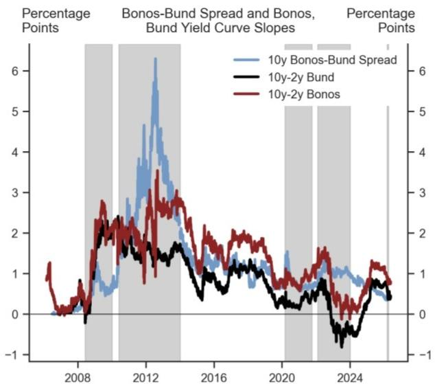
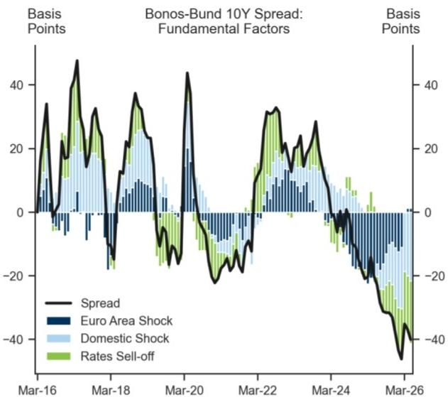

# Spain’s Structural Resilience Is Not Priced In — And That Creates Both Opportunity and Risk

Spain is outperforming the Euro area on growth, fiscal discipline, and productivity transformation, yet its sovereign spreads remain compressed as if none of these structural shifts matter. The market is pricing Spanish debt as though the only forces at work are global inflation and slowing growth, not the country’s own improving fundamentals. This disconnect between economic reality and pricing is the central strategic question for investors: are spreads too tight because they ignore domestic risk, or are they appropriately tight because domestic risk has genuinely diminished? The answer determines whether Spanish bonds offer a compelling carry trade or a trap for the complacent.

The evidence for structural improvement is substantial and often overlooked. Since 2021, Spain has recorded the highest productivity growth per employee and per hour within the four largest Euro area economies. Its labour market is reallocating workers toward higher-value-added service sectors — professional services, finance, and information technology — at a pace unmatched in the region. Investment as a share of GDP is set to overtake the Euro area, the United States, and the United Kingdom by 2026. And the primary fiscal balance is the strongest it has been since 2007, even after one of the most aggressive energy-related fiscal responses in Europe.

Yet the same report that lays out this bullish case also identifies two specific risks that could upend the narrative: an unresolved energy crisis feeding into tourism costs before the summer, and the 2027 general election. These are not hypothetical tail risks. They are near-term, identifiable, and asymmetric. The constructive case for Spain rests on the assumption that the structural improvements are durable and that the political cycle will not reverse them. That is a bet worth examining carefully.

The following analysis unpacks the logic behind Spain’s outperformance, identifies the gaps in the current market pricing, and provides a decision framework for investors who need to position for both the upside and the downside.

## The Market Is Not Pricing Domestic Risk — But That Does Not Mean It Is Wrong

The most striking finding in the report is that Spanish sovereign spreads have widened only in conjunction with flatter yield curves across Europe. This means the recent spread widening is entirely attributable to rising inflation expectations and slowing global growth, not to any deterioration in Spain-specific creditworthiness. Investors have not demanded a premium for domestic political risk, fiscal slippage, or structural vulnerability.

This is either a sign of market maturity or a warning of complacency. On the one hand, it suggests that Spain has successfully graduated from the “peripheral” category where idiosyncratic risk dominates pricing. The market now treats Spanish debt as a core European asset, whose spread is a function of systemic factors rather than local ones. That is a remarkable achievement for a country that, only a decade ago, was at the epicentre of the sovereign debt crisis.

On the other hand, the absence of any domestic risk premium means that if a Spain-specific shock does materialise — a political crisis, a tourism collapse, or a reversal of fiscal discipline — the repricing could be sudden and severe. There is no cushion. The spread is already as tight as the market will allow without a catalyst. Investors who are long Spanish bonds are implicitly betting that no such catalyst will emerge.

The report does not resolve this tension. It presents both the structural case and the risk factors, but it does not assign probabilities or weight them against each other. That analytical gap is precisely where strategic judgment is required. The market is not pricing domestic risk, but that could be rational if the probability of a domestic shock is genuinely low. The question is whether investors share that probability assessment.

## Labour Reallocation and Productivity Growth Are the Real Story, Not Tourism

For decades, the narrative on Spain was dominated by its reliance on tourism and construction, two sectors that are highly cyclical and vulnerable to external shocks. That narrative is now outdated. The report shows that employment gains since 2021 have been concentrated in professional services, finance, and information technology — sectors that generate higher gross value added per worker and are less exposed to energy prices and geopolitical disruptions.

This shift is not marginal. Spain has seen the largest increase in high-value-added employment among major European economies, and the correlation with productivity growth is clear. Countries that have reallocated labour toward these sectors have experienced stronger productivity gains since 2021; those that have not, like Germany, have seen productivity stagnate or decline.

The implication is that Spain’s growth model is becoming more resilient. Even if tourism takes a hit from higher air travel costs or geopolitical instability, the broader economy is now more diversified. The tourism sector remains important, but it is no longer the sole engine. Investors who continue to view Spain through the lens of its historical vulnerabilities are missing the structural transformation underway.

That said, the report does not fully quantify how much of the recent productivity improvement is cyclical versus structural. Some of the gains may reflect a post-pandemic catch-up effect, as underutilised workers returned to higher-productivity roles. The durability of this reallocation will only be tested in the next downturn. If Spain can maintain its productivity edge through a cyclical slowdown, the structural case will be confirmed.

## Fiscal Credibility Is the Unsung Anchor of the Bull Case

Spain’s fiscal position is stronger than the headline numbers suggest. The primary fiscal balance — which excludes interest payments — is at its highest level since 2007. The debt-to-GDP ratio is expected to decline over the next three years, making Spain the only one of the four largest Euro area economies where this is the case. And this has been achieved despite one of the most aggressive energy-related fiscal responses in Europe.

The reason is that Spain chose not to prioritise defence spending, freeing up fiscal space for energy support without blowing out the deficit. This was a strategic choice, not an accident. It reflects a political calculation that the energy crisis required immediate relief, while defence spending could be deferred. Whether that calculation proves correct depends on the evolution of European security threats, but for now, it has preserved fiscal credibility.

The report also highlights the establishment of the España Crece fund, which aims to mobilise EUR 120 billion — roughly 9 percent of GDP — for investment, using a combination of public capital from the European Recovery Fund and private leverage. This is an explicit attempt to extend the impact of the Recovery Fund beyond its formal end in 2026. If successful, it could sustain the investment recovery even after the European stimulus fades.

But there is a risk here that the report does not fully explore: the Recovery Fund has been a key driver of investment growth, and its expiry creates a cliff edge. The España Crece fund is designed to bridge that gap, but its success depends on private sector appetite for co-investment. If private capital is not forthcoming — perhaps because of political uncertainty ahead of the 2027 election — the investment recovery could stall. Investors should watch the uptake of the fund closely as a leading indicator.

## The Energy Shock and Tourism Risk Are Real but Manageable

The report identifies an unresolved energy crisis feeding into air travel costs as a key risk. The estimate is stark: every 10 percent reduction in tourist arrivals by air could lower GDP by 0.3 percentage points. Given that tourism accounts for a significant share of Spanish GDP, this is not a trivial risk.

However, the report also notes that Spain’s lower energy intensity relative to other European economies provides a buffer. The direct hit to growth from higher energy prices is smaller in Spain than in Germany, France, or Italy. And the tourism sector has shown remarkable resilience in recent years, rebounding strongly after the pandemic. The question is whether the current energy shock is different in kind or only in degree.

The report does not model a scenario where both the energy shock and the tourism risk materialise simultaneously, which would be the worst case. It also does not address the possibility that higher air travel costs could shift tourism toward domestic or European destinations, rather than reducing overall travel. That substitution effect could partially offset the GDP impact. Investors should stress-test their own assumptions about the elasticity of tourism demand to energy costs.

## The 2027 Election Is the Wild Card That the Report Cannot Resolve

The report flags the 2027 general election as a potential risk, noting that any shift in opinion polls pointing to another split parliament or an increased likelihood of a minority government would reduce investor confidence. This is the most difficult risk to assess because it is inherently political and path-dependent.

Spain has a history of political fragmentation, and the current government is already a coalition. A further shift toward fragmentation could make it difficult to sustain the fiscal discipline and structural reforms that underpin the bull case. On the other hand, the market has so far shown remarkable indifference to political noise, suggesting that investors believe the economic fundamentals are strong enough to withstand political turbulence.

The report does not offer a framework for assessing election risk. It does not model different electoral outcomes or their likely impact on fiscal policy, investment, or sovereign spreads. This is a gap that investors must fill themselves. One approach is to monitor polling trends and bond market reactions in real time, treating any widening of spreads that is not accompanied by a flatter yield curve as a signal that domestic risk is being repriced.

## A Decision Framework for Investors

For investors trying to position in Spanish sovereign debt, the following framework may help structure the decision:

First, assess the baseline scenario. If the structural improvements in productivity, labour reallocation, and fiscal discipline continue, and if the energy shock and political risks remain contained, then Spanish bonds offer a compelling carry trade with limited downside. The market is not pricing domestic risk, which means investors are being compensated for systemic factors only. That is an attractive proposition if you believe the structural case.

Second, identify the triggers that would break the baseline. The most important are: a sustained spike in energy prices that feeds into tourism cancellations, a deterioration in polling data ahead of the 2027 election, and a failure of the España Crece fund to attract private capital. Any of these would introduce a Spain-specific risk premium that is currently absent.

Third, decide on your time horizon. The structural case is a multi-year story. The risks are near-term. If you are a long-term investor with the ability to hold through volatility, the baseline scenario is probably the right bet. If you are a tactical trader, the lack of a domestic risk premium means you are exposed to sudden repricing events. In that case, hedging through options or duration management may be appropriate.

Fourth, accept that the report leaves unresolved questions. It does not quantify the probability of a tourism shock, does not model election scenarios, and does not stress-test the investment recovery without the Recovery Fund. These are not flaws in the report; they are the limits of any analytical exercise. The best investors will use the report as a starting point, not an endpoint.

## Join the Community to Read the Full Report and Review the Original Charts

The analysis above is based on a detailed report that includes charts on growth outperformance, fiscal balances, labour reallocation, investment recovery, and housing market dynamics. These visuals are essential for understanding the magnitude and trajectory of the structural changes underway in Spain. The report also contains the full data series and the analysts' detailed assumptions, which cannot be fully captured in a summary.

Join the community to read the full report and review the original charts.

*This article is for learning and discussion only and does not constitute investment advice.*

Personal reading notes and learning share only. Not investment advice.

