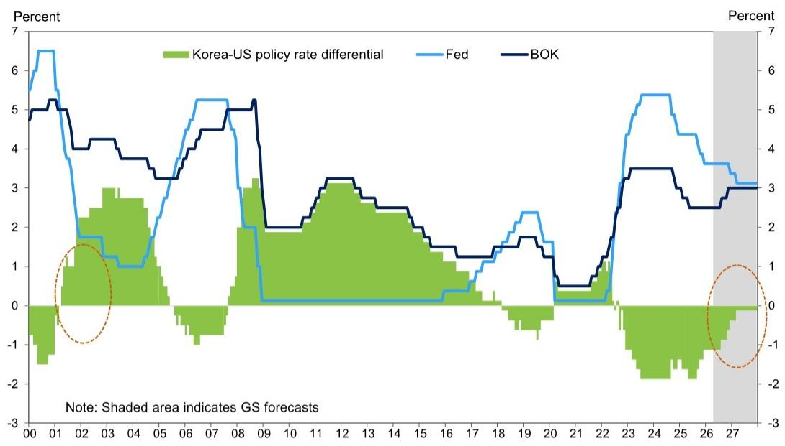
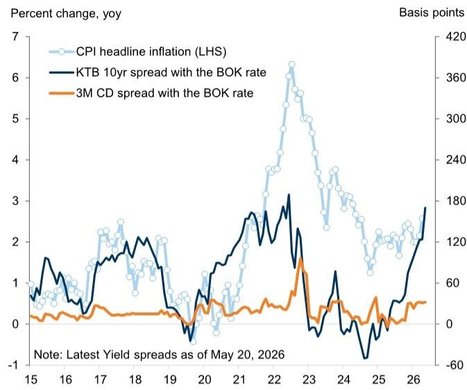
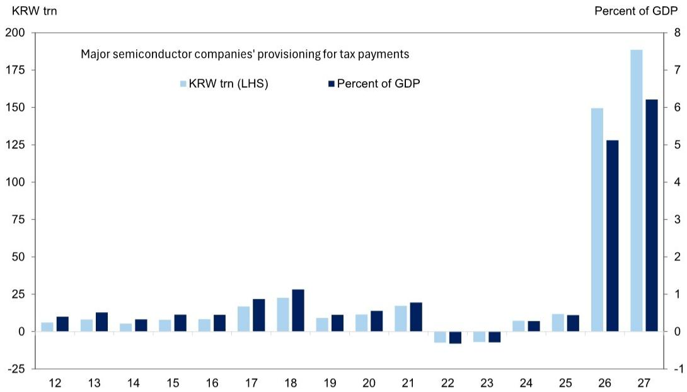

# The Bank of Korea Is About to Sound Hawkish, But the Real Story Is a Fiscal Revolution No One Is Talking About

The Bank of Korea is about to deliver a carefully calibrated hawkish message at its May meeting under new Governor Shin Hyun-song. The reasons are well understood: Middle East energy disruptions are pushing up headline inflation, Seoul housing prices are reaccelerating, and first-quarter GDP surprised to the upside. Any analyst can see these forces. What is far less appreciated, however, is that the real macroeconomic story in Korea this year is not about monetary policy at all. It is about a structural fiscal transformation driven by the AI semiconductor super-cycle that could fundamentally reshape the policy landscape, the bond market, and the currency over the next 18 months.

The typical framing of the May MPC meeting is that the BOK faces a standard trade-off between growth and inflation. That framing is incomplete. The more strategic question is whether the Bank is tightening into a recovery that is dangerously narrow, or whether it is setting the stage for a policy regime shift in which fiscal dominance gives way to a surplus-driven stability that Korea has not experienced in decades. The answer has profound implications for how investors should position across Korean rates, equities, and the won.

The report we are drawing on, produced by a global investment bank's Korea economics team, provides the analytical architecture for this debate. But the report's most important insights are not in its near-term rate call. They are in the structural implications that emerge when you connect the AI-driven tax windfall, the housing market dynamics, the WGBI inclusion flows, and the changing nature of capital flows. This article synthesizes those connections into a strategic framework for serious investors.

## The BOK's hawkish shift is real but measured, and the market may be overpricing the terminal rate

The central argument of the report is that the BOK will raise its growth and inflation forecasts for 2026, shift its forward guidance incrementally hawkish, and deliver two 25-basis-point rate hikes in July and October, bringing the terminal rate to 3.00% by year-end. This is below both the 3.5% peak of the previous hiking cycle and the current market pricing of 4.25%. The report sees risks to its own rate view as broadly balanced, with the energy price path and the fiscal treatment of excess tax revenues as the two main swing factors.

This is a measured call, and it is important to understand why. The BOK is not reacting to a broad-based demand-driven overheating. It is reacting to supply-side inflation from energy and a narrow, tech-led growth surge that has not yet spread to the rest of the economy. The divergence between tech and non-tech production is stark: tech output surged 11% quarter-on-quarter in Q1, while non-tech output was broadly flat. Tech exports continued their momentum into April, rising 7.4% month-on-month, while non-tech exports fell 4.0%. Domestic demand, meanwhile, remains soft. Credit card spending pulled back in April despite the government's cash handout program, which was only one-third the size of last year's.

The BOK cannot ignore the headline inflation print of 2.6% year-on-year in April, driven by oil-related goods and services. But it also cannot ignore that high-frequency data already points to stabilizing inflation momentum in May, that one-year-ahead inflation expectations fell to 2.8%, and that base wage growth for regular workers continues to moderate. The Bank is walking a tightrope between credible inflation control and the risk of tightening into a recovery that is too narrow to sustain rate hikes.

The market pricing of a 4.25% terminal rate implies a much more aggressive tightening cycle than the report expects. The gap between market pricing and the report's forecast is the single most important tactical question for fixed-income investors. If the report is right, the front end of the Korean curve offers significant value. If the market is right, the BOK is about to embark on a cycle that will crush domestic demand and expose the fragility of the non-tech economy. The resolution of this gap will depend on two factors: how persistent the energy shock proves to be, and how the government handles the fiscal windfall from the semiconductor sector.

## The AI-driven tax windfall is not just a fiscal story; it is a monetary and FX story that the market has not fully priced

The most striking data point in the entire report is the estimate that tax provisioning by Korea's two largest chipmakers could jump from KRW 12 trillion in 2025 to as much as KRW 150 trillion in 2026. That is a twelve-fold increase, and it represents roughly 5% of GDP. The immediate implication is fiscal: these interim excess tax payments, estimated at KRW 60 trillion by end-August, are more than sufficient to cover the planned consolidated general government budget deficit of KRW 52.7 trillion for 2026. Korea's fiscal position is about to swing dramatically from deficit to surplus, driven entirely by the AI semiconductor cycle.

The second-order implications are what matter for investors. A fiscal surplus of this magnitude reduces the government's need to issue debt, which is supportive for Korean bonds at a time when global yields are rising. It also reduces the structural imbalance in the FX market. For years, financial outflows from pension funds and retail investors have been a major source of depreciation pressure on the won. The report argues that the scale and persistence of the improving current account, driven by semiconductor exports and now reinforced by these tax-related capital flows, can more than offset those depreciation pressures.

This is a structural argument about the won that goes against the prevailing bearish consensus. The won has weakened sharply, moving back above 1,500 against the dollar, driven by record foreign equity outflows of some USD 30 billion in May. But the report offers a contrarian perspective: more than 90% of year-to-date foreign selling has been concentrated on the two major memory makers, and this selling is largely driven by portfolio rebalancing and diversification rules rather than deteriorating corporate fundamentals. Foreign ownership in Korea's semiconductor sector is now at a 10-year low despite a strong earnings outlook. The selling may be largely done.

The implication is that the won's depreciation is a liquidity event driven by mechanical portfolio adjustments, not a structural reflection of Korea's external position. As the current account surplus widens and the fiscal surplus reduces the need for foreign capital, the fundamental support for the won should reassert itself. Investors who are short the won on the assumption of persistent weakness may be underestimating the scale of the structural shift underway.

## The housing market is the BOK's real concern, and the link to the tech cycle is more dangerous than it appears

The report notes that Seoul housing prices have resumed rising since mid-March, with the pace of gains now the fastest since last October when the government introduced comprehensive real estate measures. This rebound has occurred despite renewed government efforts to curb speculation, including stricter real estate taxes and the reinstatement of heavier capital gains taxes on multi-home owners. The government has also indicated that an upcoming tax package in July could include broader property tax increases.

The BOK is watching this closely, and for good reason. The report shows a historical correlation between tech cycles and Seoul housing prices. When semiconductor exports boom, housing prices in the metropolitan area tend to follow. This is not a mechanical relationship; it reflects the fact that the wealth generated by the tech sector, particularly through equity appreciation and bonus payments, flows into real estate in the most desirable districts. The current cycle is no exception. The outsized equity rally in Korean memory stocks is generating capital gains that are supporting housing demand in high-end metropolitan areas.

This creates a dangerous feedback loop for the BOK. Higher housing prices feed into inflation expectations and household debt concerns, which argue for tighter policy. But tightening policy to cool housing risks choking off the narrow tech-led recovery that is generating the fiscal surplus and the current account improvement. The BOK cannot solve the housing problem with interest rates alone, because the root cause is a structural wealth effect from the tech sector that monetary policy cannot easily address.

The report's analysis suggests that the BOK will need to rely on macroprudential measures and fiscal policy to address housing, while using interest rates primarily to manage inflation expectations. But this is an uncomfortable position. If housing continues to accelerate, the BOK may be forced to hike more aggressively than its current guidance suggests, even if the rest of the economy does not warrant it. The housing market is the single biggest upside risk to the report's terminal rate forecast.

## The bond market is caught between global yield pressure and local structural support, creating a unique opportunity for active managers

The Korean yield curve has steepened sharply in recent weeks. The 10-year KTB yield rose above 4.2% in mid-May, in line with higher global yields amid ongoing Middle East disruptions and rising concerns around inflation and fiscal expansion. The 10-year spread over the policy rate has widened to its highest level since late 2022. At the same time, the 30-year KTB yield rose sharply, driven by positioning adjustments by domestic insurers who have been unwinding long-duration bond forward positions totaling KRW 88 trillion, or 3.3% of GDP.

The report identifies two opposing forces. On the one hand, global factors are putting upward pressure on Korean yields, and the domestic insurance sector's deleveraging is adding to long-end volatility. On the other hand, the AI-driven fiscal surplus and WGBI inclusion flows provide significant structural support. The report estimates that WGBI-related flows could total roughly KRW 55 trillion cumulatively this year, while the fiscal surplus reduces net issuance.

The net effect is that Korean bonds are being pulled in two directions, and the resolution of this tension will determine whether the curve bull-steepens or bear-steepens over the next six months. If the global yield environment stabilizes and the fiscal surplus materializes as expected, Korean bonds could offer significant relative value, particularly at the front end where the BOK's measured hiking cycle should cap yields. If global yields continue to rise and the fiscal surplus is used for spending rather than debt reduction, the bearish forces will dominate.

The report does not fully answer this question, and it leaves several meaningful open issues for investors to analyze. How will the government use the excess tax revenues? Will it reduce debt, increase spending, or cut taxes? The report mentions that policy uncertainty remains over how the government will use these revenues, and this is the most important unresolved variable for the bond market. A fiscal expansion that channels the semiconductor windfall into consumption or transfers would be inflationary and bearish for bonds. A fiscal consolidation that uses the windfall to reduce debt would be disinflationary and bullish. The government's decision in the upcoming tax package in July will be the single most important signal for the direction of Korean rates.

## The report's most important insight is what it does not fully answer: how the government will use the semiconductor windfall

The report is explicit about the scale of the tax windfall but deliberately cautious about its implications. It notes that policy uncertainty remains over how the government will use sizable excess tax revenues estimated at more than 5% of GDP. This is not a minor detail; it is the central strategic question for investors in Korean assets.

There are three possible paths. The first is fiscal consolidation: the government uses the windfall to reduce debt, which would be supportive for bonds and the won but could slow growth. The second is fiscal expansion: the government increases spending or cuts taxes, which would boost growth and inflation but be negative for bonds and potentially positive for equities. The third is a hybrid: the government uses part of the windfall to fund structural investments in areas like AI infrastructure, energy transition, or social welfare, which would have mixed implications depending on the specifics.

The report does not take a strong view on which path the government will choose, and this is appropriate given the uncertainty. But it does provide the analytical framework for investors to make their own assessment. The government's upcoming tax package in July will be the first major signal. If the package includes broad property tax increases as hinted, it would suggest a consolidation bias. If it includes new spending programs or tax cuts, it would suggest an expansionary bias.

This is the kind of question that serious investors need to analyze in real time, and it is precisely the kind of analysis that the full report enables. The charts and data in the original document provide the foundation for this analysis, but the strategic interpretation depends on the investor's own judgment about Korean political economy.

## Join the community to read the full report and review the original charts

The analysis above synthesizes the core arguments of the report and extends them into their second-order implications for investors. But the report itself contains a wealth of data and charts that are essential for anyone making active investment decisions in Korean markets. The exhibits on the divergence between tech and non-tech production, the high-frequency inflation tracking, the housing price dynamics, the tax provisioning estimates, and the capital flow analysis are all critical inputs for building a robust investment thesis.

Reading the original report allows you to see the data for yourself, assess the assumptions behind the forecasts, and make your own judgments about the key uncertainties. The report's authors have done the hard work of assembling and analyzing the data. The strategic interpretation is now up to you.

Join the community to read the full report and review the original charts.

*This article is for learning and discussion only and does not constitute investment advice.*

Personal reading notes and learning share only. Not investment advice.

