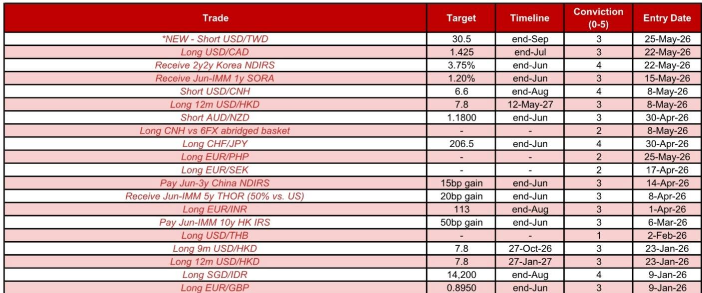

# A US-Iran Deal Is Now a Core Scenario for FX Markets, and the Portfolio Response Must Be Differentiated by Currency

The probability of a US-Iran agreement that reopens the Strait of Hormuz has increased materially over the past week. This is not a marginal shift in geopolitical noise. It is a structural change in the risk-reward landscape for foreign exchange and rates markets, particularly in Asia. The immediate implication is clear: a deal would remove the single largest energy supply shock since the conflict began, lower oil prices, and trigger a broad repositioning away from safe-haven dollar demand and into currencies that have been punished by the war. But the real strategic question for investors is not whether to bet on a deal. It is which currencies will benefit most, which will lag, and where the residual risks remain large enough to justify staying short.

The weekend statements from both US and Iranian officials signal a narrowing of differences that was absent just weeks ago. President Trump indicated that a peace deal has been "largely negotiated" and that an announcement to reopen the Strait could come shortly. Iran's foreign ministry acknowledged a "memorandum of understanding" as a first phase, with a broader agreement possible within 30 to 60 days. These are not vague diplomatic gestures. They are concrete signals that both sides see a path to de-escalation. Yet the market is not fully pricing this outcome. The asymmetry is exactly where opportunity lies.

The report on which this article is based makes a series of conviction-level adjustments to reflect this shift. But the logic behind those trades is more important than the trades themselves. Understanding why the portfolio is being repositioned in this way reveals a framework that applies well beyond this specific event.

## The Dollar-Renminbi Trade Has the Highest Conviction Because the Asymmetry in Sensitivity Is Extreme

The most compelling trade in the current environment is a short USD/CNH position, now raised to a conviction level of 4 out of 5. The reasoning is not simply that a weaker dollar helps the renminbi. It is that the relationship between USD/CNH and DXY is profoundly asymmetric. Since the Iran war began on 28 February, DXY has risen by 1.4 percent. Yet USD/CNH has actually fallen by 1.2 percent. The sensitivity of USD/CNH to upward moves in DXY has been only about 24 percent. But the sensitivity to downward moves in DXY has been about 54 percent. That is a two-to-one asymmetry. If a deal materializes and the dollar softens, the renminbi should rally much more than it would weaken if the dollar strengthens.

This asymmetry is reinforced by several structural factors. The USD/CNY daily fixing continues to drift lower, with the fixing reaching a new low of 6.8318, a level not seen since February 2023. The positive error remains stable at around 448 pips, indicating that the fixing is being used as a tool to guide expectations lower. Onshore corporates are likely to continue repatriating dollar holdings, supported by strong export growth and local expectations for renminbi appreciation. A constructive backdrop for US-China relations provides a conducive environment for capital inflows. And perhaps most importantly, the renminbi remains substantially undervalued. Based on four FX valuation models, the RMB is undervalued by an average of 9.5 percent, with its productivity-adjusted real effective exchange rate undervalued by 19.3 percent.

The implication is that even if a US-Iran deal is delayed or partially fails, the structural case for renminbi appreciation remains intact. The deal is a catalyst, not a prerequisite.

## The Taiwan Dollar Benefits from a Dual Tailwind That Most Asian Currencies Lack

A short USD/TWD position, initiated at a modest conviction level of 3 out of 5, is another trade that reflects the same logic but with a different risk profile. The Taiwan dollar has already outperformed within Asia ex-Japan since the onset of the Iran war, despite being highly exposed to the energy shock. The reason is the extraordinary strength of Taiwan's tech sector. Global AI demand shows no signs of slowing. US hyperscalers have raised their fiscal year 2026 capex guidance by approximately 55 billion dollars in their first-quarter earnings calls. Locally, TSMC's capex of roughly 70 billion dollars in 2027 and its local sourcing plan are positive catalysts for the domestic semiconductor supply chain.

A US-Iran deal would add a second tailwind. If energy prices ease from currently elevated levels, TWD should enjoy a further boost. Conversely, if the stalemate continues, the currency is unlikely to depreciate much because the tech story provides a floor. This asymmetry is similar to the renminbi case, though less extreme.

There is also a less discussed factor. The US Treasury released joint FX statements with several key Asian central banks in November 2025, including Taiwan's central bank, emphasizing a commitment not to target exchange rates for competitive advantage. This may limit the central bank's inclination to buy dollars aggressively. A softer dollar environment could also offer Taiwan's life insurers and exporters an opportunity to increase their FX hedging ratios or reduce their dollar hoarding, especially if swap points are in premium.

The risk here is that the trade is more dependent on the deal's success than the renminbi trade. If negotiations collapse, the energy shock could resume, and TWD would be vulnerable. But the reward-to-risk ratio is attractive because the downside is capped by the tech cycle.

## The Indonesian Rupiah Remains a Structural Underperformer Even If the External Environment Improves

The most counterintuitive trade in the current portfolio is the long SGD/IDR position, maintained at a high conviction level of 4 out of 5. One might assume that a US-Iran deal, which lowers oil prices and reduces risk aversion, would be positive for the rupiah. That assumption would be wrong. Even if the external front improves, there are multiple domestic reasons why the rupiah should continue to underperform.

President Prabowo's plan to centralise exports of natural resources through a new state agency named Danantara Sumberdaya Indonesia has created significant uncertainty for key players in Indonesia's commodity markets. Details remain vague, but the direction of travel is clear. This policy shift carries significant medium-term risks, including the potential for foreign investors to pull out their investments. S&P has raised concerns about this, increasing the risk of a negative rating outlook shift in June or July. Indonesia's fiscal developments remain dire. Bank Indonesia's comments have been dovish, despite a larger-than-expected 50-basis-point hike on 20 May. There are growing concerns over BI's mandate and independence, with the government discussing the expansion of BI's mandate to include a focus on the economy and authorising parliament to recommend the dismissal of board members. Seasonality suggests a weaker current account balance in the second quarter, and further measures by MSCI and FTSE Russell to adjust the weightings of Indonesia stocks could maintain foreign portfolio outflow pressures.

Against this backdrop, the Singapore dollar offers a compelling counterpart. Singapore's final first-quarter GDP growth was revised up sharply to 6.0 percent year-on-year from the advance estimate of 4.6 percent. Inflationary pressures are rising. The Monetary Authority of Singapore continues to highlight upside risks to inflation. The strong macro backdrop should lead to another slight appreciation of the S$NEER policy band in July. The combination of a structurally weak rupiah and a structurally strong Singapore dollar makes this trade resilient to a wide range of outcomes.

## The Euro and the Swiss Franc Offer G10 Exposure to the Same Theme, but the Logic Is Different

In G10 currencies, the highest conviction trade remains long CHF/JPY at a conviction level of 4 out of 5. The logic here is not directly about a US-Iran deal. It is about limiting exposure to the energy theme while still benefiting from an easing of tensions. European currencies in general gain on potentially lower energy prices. The fact that USD/JPY has edged away from its recent highs limits the risk of near-term intervention by the Ministry of Finance to strengthen the yen. For the Swiss franc, notable FX purchases by the Swiss National Bank are still some distance away. Seasonal flow pressures should remain positive for the franc in the weeks ahead.

The long EUR/GBP position, maintained at a conviction level of 3 out of 5, reflects a different calculus. If the focus on the Middle East starts to fade, local cyclical stories should become more important again. There is a risk that the Bank of England decides not to hike, given the soft local labour market and recent inflation data, while the European Central Bank still seems committed to hiking. UK political risks also justify a higher euro-sterling exchange rate.

The take-profit on long EUR/SEK reflects the view that the Swedish krona will receive more near-term positivity than the euro, even though the Riksbank can remain more dovish than the ECB. The maintained long USD/CAD position is interesting because it has recently had a positive beta to oil prices. But the persistent improvement in the US economic outlook relative to Canada's should favour a move higher in rates spreads as Bank of Canada rate hike expectations decline. If recent US hawkishness were to fade on lower oil prices, the trade could be shifted to long EUR/CAD.

## What the Report Does Not Fully Answer: The Sequencing Risk That Could Derail the Entire Thesis

For all the conviction expressed in the trade recommendations, the report leaves one critical question unresolved. The clear positive is that both the US and Iran have signalled a narrowing of differences. But it is still unclear whether the US will demand concessions on tolls and enriched uranium before reopening the Strait, or whether those issues will be pushed to a later stage. If the US pushes these issues out, the path is clear for a rally in risk assets and a softening of the dollar. If the US demands any of these before a reopening, Iran would likely continue to hold out, and the deal would fail.

This sequencing risk is the single most important variable that the market is not pricing. The report acknowledges it but does not resolve it. Investors need to form their own view on whether the US administration will accept a phased approach or insist on immediate concessions. The difference between these two outcomes is the difference between a sustained rally in emerging market currencies and a sharp reversal back to safe-haven positioning.

A related question is how oil prices would behave in each scenario. A full deal that reopens the Strait would likely send oil prices sharply lower, but not back to pre-war levels. A partial deal or a continued stalemate would keep prices elevated, with significant second-order effects on inflation expectations and central bank policy in Asia. The report's rate strategy recommendations, particularly the receive 2-year forward 2-year Korea NDIRS position, implicitly assume that rate hike premia will come off. But if oil prices remain high, those premia could expand further.

## A Decision Framework for Investors: Three Questions to Determine Your Own Positioning

Rather than simply replicating the trades in the report, investors should use the following framework to calibrate their own exposure. The framework is designed to be mutually exclusive and collectively exhaustive, covering the three dimensions that matter most.

First, what is your view on the probability of a deal within the next 30 days? If you assign a probability above 60 percent, the trades with the highest conviction are short USD/CNH and short USD/TWD. If you assign a probability below 40 percent, the long CHF/JPY and long SGD/IDR trades offer better protection because they are less dependent on the deal's success. The report's own conviction levels provide a guide, but they are based on the analyst's view. Your view may differ.

Second, how do you assess the domestic policy risk in Indonesia? This is the most idiosyncratic factor in the entire portfolio. Even if a deal materializes, the rupiah could continue to underperform because of Danantara, fiscal concerns, and central bank independence issues. If you believe these risks are overstated, the long SGD/IDR trade is less attractive. If you believe they are underappreciated, it is one of the best risk-reward trades available.

Third, what is your view on the renminbi fixing trajectory? The short USD/CNH trade relies on the fixing continuing to drift lower. If the People's Bank of China decides to hold the fixing stable or even guide it higher, the trade loses its primary catalyst. The report notes that the fixing has reached a new low and the positive error is stable. But the fixing is a policy tool, and policy can change. Monitoring the fixing on a daily basis is the single most important input for this trade.

## Join the Community to Read the Full Report and Review the Original Charts

The analysis above is based on a detailed strategy report that includes conviction levels, entry points, targets, and stop-losses for each trade. The report also contains charts showing the sensitivity of USD/CNH to DXY, the trajectory of the renminbi fixing, and the positioning of various central banks. These charts are essential for understanding the timing and magnitude of the recommended trades. Join the community to read the full report and review the original charts.

*This article is for learning and discussion only and does not constitute investment advice.*

Personal reading notes and learning share only. Not investment advice.

