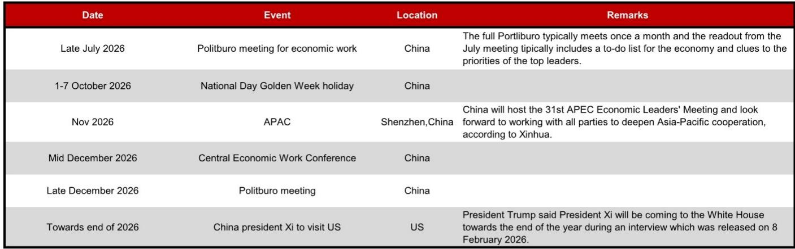
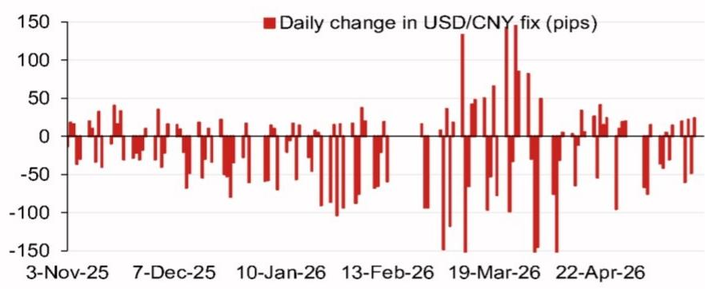
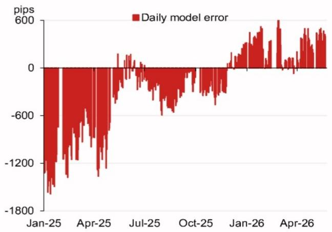

# The PBOC’s Fix Model Is Signaling a Strategic Shift, Not Just a Technical Adjustment

The People’s Bank of China’s daily USD/CNY fixing is the single most consequential price signal in emerging market FX, yet it is routinely misunderstood as a mere administrative ritual. A global investment bank’s latest model projection, which estimates a central parity of 6.7870 against a previous fix of 6.8373, represents a 503-pip downward revision from the prior model output and a 77-pip decline from the previous official spot close. This is not noise. This is a deliberate and meaningful signal from Beijing about its tolerance for renminbi depreciation and its broader strategic calculus heading into a dense calendar of political and economic events.

The timing of this shift is what makes it strategically significant. The model projection, even after incorporating the counter-cyclical factor at 6.8048, suggests the authorities are willing to allow a stronger renminbi bias to emerge. This runs counter to the prevailing narrative that China would use a weaker currency to offset tariff pressures and support export competitiveness. The data tells a different story: the top four weighted overnight contributors to the projected change—the Korean won, Australian dollar, Thai baht, and euro—are all pulling in directions that suggest a broad-based, not bilateral, recalibration of the fix framework.

The argument here is straightforward but non-obvious: the PBOC is using its fix mechanism to pre-position for a period of heightened geopolitical and economic uncertainty, not to react to it. The model’s error history shows a pattern of large negative errors in early 2025, followed by a gradual convergence and then positive errors more recently. This is the fingerprint of a central bank that has learned from past missteps and is now adjusting its tool kit proactively. The question for investors is not whether the fix will move, but what the movement reveals about the PBOC’s evolving strategy.

The implications extend far beyond the onshore CNY market. A stronger fix bias, if sustained, would compress the offshore CNH premium, alter the hedging calculus for multinational corporations, and force a reassessment of carry trade strategies across Asia. It would also signal to other Asian central banks that China is no longer willing to absorb the full weight of competitive depreciation. The region’s FX dynamics are about to become more complex, and the fix model is the early warning system.

This article unpacks what the model is really saying, why the counter-cyclical factor matters more than the headline number, and how investors can build a decision framework around the PBOC’s signal. It ends with the open questions that the report does not fully answer—questions that should drive the next phase of research for anyone serious about Asia FX.

## The 503-Pip Swing in the Model Projection Is a Deliberate Policy Signal, Not a Mechanical Error Correction

The most arresting number in the report is the 503-pip decline in the model projection from the previous reading. This is not a rounding error or a data glitch. It is a structural shift in the inputs that the PBOC’s fix model weights most heavily. The previous projection of 6.8373 implied a certain expectation about the renminbi’s fair value based on the overnight basket. The new projection of 6.7870 implies a fundamentally different assessment of where the currency should be trading.

What makes this swing particularly telling is the composition of the overnight contributions. The Korean won contributed a positive 7 pips, while the Australian dollar contributed negative 9 pips, the Thai baht negative 10 pips, and the euro a substantial negative 30 pips. The euro’s outsized negative contribution is the most revealing element. It suggests that the model is picking up a strengthening European currency dynamic, which, when translated into the fix framework, pulls the USD/CNY midpoint lower. This is a global, not local, signal.

The so-what is clear: the PBOC is not fighting the market; it is using the market to achieve its own objectives. By allowing the fix to reflect a stronger renminbi bias driven by euro and Asian currency movements, the authorities are signaling that they are comfortable with a more flexible exchange rate regime—provided it does not destabilize expectations. The 503-pip swing is a statement of intent. Investors who dismiss it as model volatility are missing the strategic forest for the technical trees.

## The Counter-Cyclical Factor Reveals the PBOC’s Tolerance Band Is Narrower Than the Market Assumes

The model projection with the counter-cyclical factor stands at 6.8048, which is 325 pips lower than the previous fix. This is a critical nuance. The counter-cyclical factor is the PBOC’s discretionary tool to lean against the wind. When the model suggests a fix that the authorities deem too extreme, the counter-cyclical factor dampens the adjustment. In this case, the factor added roughly 178 pips back to the model projection (6.8048 minus 6.7870), indicating that the PBOC wanted to slow the pace of renminbi appreciation, not reverse it.

This is a classic PBOC playbook: allow the fix to move in the direction of market forces, but at a controlled pace. The counter-cyclical factor is not a signal of resistance; it is a signal of pacing. The authorities are telling the market that they are willing to let the renminbi strengthen, but they do not want a one-way bet that could lead to disruptive capital flows or excessive volatility.

The strategic implication for investors is that the PBOC’s tolerance band for USD/CNY is likely narrower than many assume. The consensus view has been that China would tolerate a weaker renminbi to support exports. The fix model suggests the opposite: the authorities are actively managing the currency toward a stronger equilibrium, even if that means sacrificing some short-term export competitiveness. This is a bet on structural rebalancing, not cyclical support.

## The Model Error History Shows the PBOC Has Learned to Lead, Not Lag, the Market

The report includes a chart of daily model errors—the difference between the model’s projection and the actual fix—dating back to early 2025. The pattern is instructive. In January 2025, the model error was roughly negative 1,800 pips, meaning the model was projecting a much weaker fix than what was actually set. By April 2025, the error had narrowed to negative 1,200 pips. By July 2025, it was near zero. Then, in early 2026, the errors turned positive, reaching around 600 pips in January 2026 and 400 pips in April 2026.

This trajectory tells a story of learning and adaptation. In early 2025, the PBOC was actively resisting the model’s depreciation signal, using the counter-cyclical factor and other tools to keep the fix stronger than the model implied. As the year progressed, the authorities allowed the fix to converge with the model, reducing the error. By early 2026, the model was actually projecting a stronger fix than what was set, suggesting the PBOC was now leaning against appreciation pressure.

The so-what is profound: the PBOC has moved from a defensive posture to a proactive one. The large negative errors of early 2025 reflected a central bank that was behind the curve, trying to hold back depreciation forces that eventually proved too strong. The positive errors of early 2026 reflect a central bank that is now ahead of the curve, managing appreciation pressure before it becomes destabilizing. This is a regime change in policy behavior.

## The Fix Model’s Signal Must Be Interpreted Against a Dense Calendar of Political and Economic Events

The report includes a calendar of upcoming events that provides the strategic context for the fix signal. In late July 2026, the Politburo will meet to set economic priorities. In November 2026, China will host the APEC Economic Leaders’ Meeting in Shenzhen. In mid-December, the Central Economic Work Conference will outline policy for the following year. And towards the end of 2026, President Xi is scheduled to visit the US.

Each of these events carries implications for the renminbi. The Politburo meeting in July will likely signal the leadership’s priorities for the second half of the year, including whether they prioritize growth, stability, or reform. The APEC meeting is a diplomatic showcase that could influence trade and investment flows. The Central Economic Work Conference will set the tone for 2027 policy. And the Xi-Trump meeting is the most consequential bilateral event on the calendar.

The fix model’s signal of a stronger renminbi bias is consistent with a strategy of pre-positioning before these events. A stronger currency reduces the risk of capital flight, signals confidence to foreign investors, and provides diplomatic leverage. The PBOC is not reacting to events; it is shaping the environment in which those events will unfold. Investors who ignore this temporal dimension are missing the most important layer of analysis.

## What the Report Does Not Fully Answer: The Sustainability and Transmission of the Fix Signal

The report provides an extraordinarily detailed snapshot of the fix model at a single point in time, but it leaves several critical questions unanswered. First, how persistent is this signal? Is the 503-pip swing a one-off adjustment driven by a specific overnight basket composition, or does it represent a sustained shift in the model’s underlying parameters? The report does not provide a time series of model projections, so we cannot assess the trend.

Second, how does the fix signal transmit to the broader FX market? The report focuses on the fix itself, but the real question for investors is whether the fix will be validated by spot market trading. If the PBOC sets a fix at 6.7870 but spot trades weaker, the signal loses credibility. The report does not address the conditions under which the fix signal is likely to be absorbed or rejected by the market.

Third, what is the role of the counter-cyclical factor in a world where the model errors have turned positive? The factor was designed to dampen depreciation pressure, but it is now being used to slow appreciation. Does this represent a permanent expansion of the tool’s mandate, or is it a temporary adjustment? The report does not provide a framework for answering this question.

These are not criticisms of the report; they are the natural boundaries of any single-piece analysis. The report gives investors the raw material to ask better questions, but it does not provide the answers. That is where the real analytical work begins.

## A Decision Framework for Interpreting Future Fix Signals

For investors who want to use the fix model as a strategic input, the following framework can help translate the technical data into actionable insights.

First, focus on the direction of the model projection relative to the previous fix, not the absolute level. A large swing like 503 pips is a signal of regime change. A small swing of 50 pips is noise. The magnitude of the change tells you how much the PBOC is willing to move.

Second, compare the model projection with and without the counter-cyclical factor. The gap between the two numbers reveals the PBOC’s discomfort level. A large gap means the authorities are trying to slow the adjustment. A small gap means they are comfortable with the market’s direction.

Third, track the model error history over a rolling 12-month period. If the errors are consistently positive, the PBOC is leaning against appreciation. If they are consistently negative, the PBOC is leaning against depreciation. The sign of the error is more important than the magnitude.

Fourth, calibrate the fix signal against the political calendar. A strong fix signal ahead of a major event like APEC or the Xi-Trump meeting is more significant than a signal during a quiet period. The PBOC is a political actor, and its FX policy is always nested within a broader strategic context.

Fifth, do not trade the fix; trade the reaction to the fix. The market’s response to the PBOC’s signal is more important than the signal itself. If the fix is set stronger than expected and spot follows, the signal is validated. If spot diverges, the signal is rejected, and the PBOC will likely have to adjust its stance.

## The Open Questions That Should Drive the Next Phase of Research

The fix model raises more questions than it answers, and that is precisely why it deserves serious attention. The most important open question is whether the PBOC has permanently shifted its exchange rate regime toward greater flexibility, or whether this is a tactical move that will be reversed once the political calendar passes.

A second open question is how other Asian central banks will respond. If the PBOC allows a stronger renminbi, will the Bank of Korea, the Bank of Thailand, and the Reserve Bank of Australia follow suit, or will they resist? The overnight contributions in the fix model suggest a coordinated movement, but coordination is never guaranteed.

A third open question is the role of capital flows. A stronger fix bias could attract portfolio inflows into Chinese bonds and equities, which would reinforce the renminbi’s strength. But it could also trigger profit-taking by foreign investors who have been betting on depreciation. The net effect is uncertain.

These questions are not answerable from a single report. They require ongoing analysis, cross-asset correlation studies, and a deep understanding of China’s political economy. For investors who want to stay ahead of the curve, the fix model is not a destination; it is a starting point.

Join the community to read the full report and review the original charts.

*This article is for learning and discussion only and does not constitute investment advice.*

Personal reading notes and learning share only. Not investment advice.

