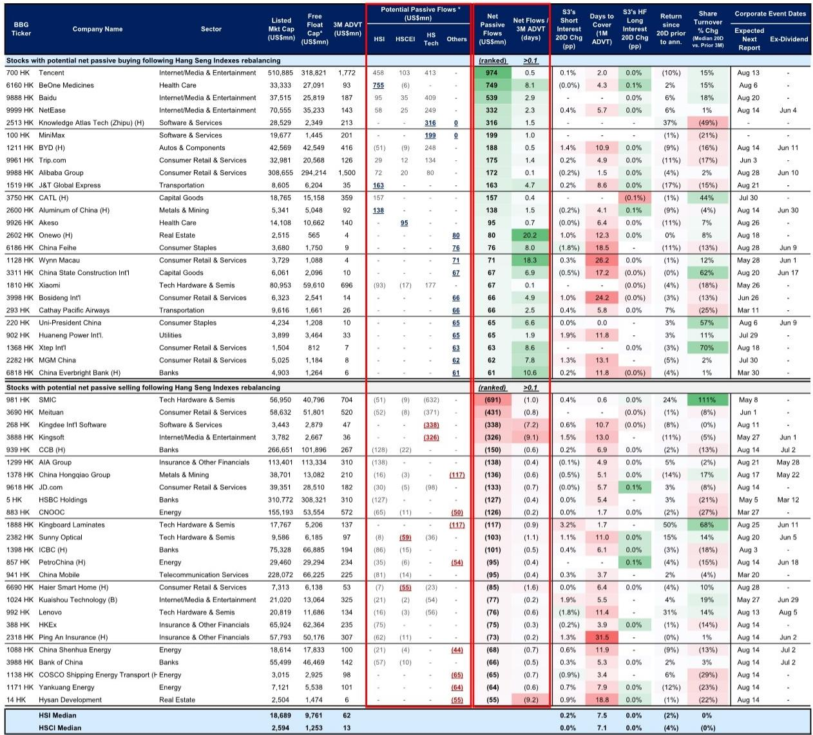
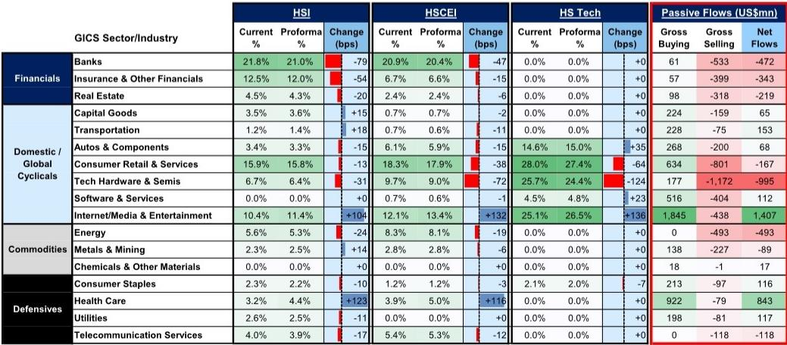
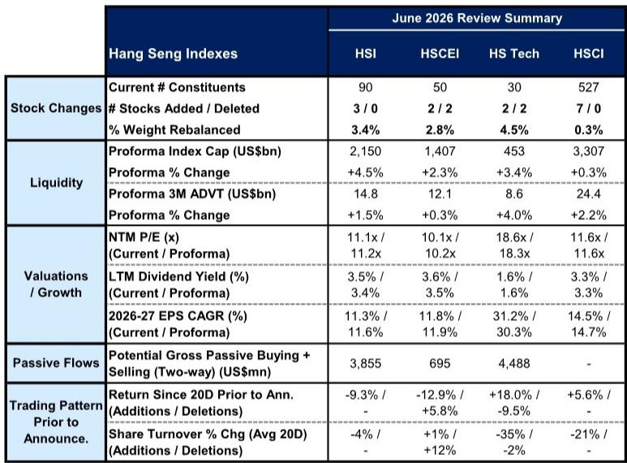

# The Hang Seng Rebalancing Is Not a Mechanical Event — It Is a Strategic Signal for Sector Rotation

The June 2026 Hang Seng Indexes rebalancing, announced on May 22, is not merely a technical adjustment to index composition. It is a deliberate restructuring that reveals where capital is being directed and where it is being withdrawn. With nearly US$11 billion in gross two-way passive flows expected, this rebalancing carries implications that extend far beyond the effective date of June 6.

Three stocks will join the Hang Seng Index itself: BeOne Medicines, Aluminum Corp. of China, and J&T Global Express. The Hang Seng China Enterprises Index will see two additions and two deletions. The Hang Seng TECH Index will replace Kingsoft and Kingdee with MiniMax and Knowledge Atlas Tech. These changes are not random — they reflect a structural tilt away from traditional hardware and financial cyclicals and toward healthcare, internet and media, and emerging AI-driven software platforms.

The magnitude of the shift is substantial. Internet and media & entertainment sectors are expected to see the largest passive buying, with net inflows of approximately US$1.4 billion. Healthcare follows closely with roughly US$850 million in net inflows. On the other side, technology hardware and semiconductors face net outflows of about US$1.0 billion, while energy, banks, and insurance & financial services each face between US$350 million and US$500 million in net selling. This is not a marginal adjustment — it is a reallocation of capital at scale.

The timing matters. This rebalancing occurs against a backdrop where the HSI forward P/E is projected to move from 11.1x to 11.2x, with 2026-27 EPS CAGR improving from 11.3% to 11.6%. The HSTECH index, despite a slight P/E compression from 18.6x to 18.3x, still carries a 30.3% EPS growth expectation. The market is being reshaped to favor growth at a reasonable price, but with a clear preference for companies that sit at the intersection of technology, healthcare, and consumer internet.

For investors who treat index rebalancing as a passive event to be hedged or ignored, this cycle presents a risk of being on the wrong side of a structural shift. For those who read the signal, it offers a roadmap for sector allocation over the next 12 to 18 months.

---

## The Rebalancing Is Not Neutral — It Is a Bet on Healthcare and AI Software Over Hardware and Financials

The most striking feature of this rebalancing is the sector-level asymmetry. The data shows that healthcare, internet/media & entertainment, and software & services are the clear beneficiaries, while tech hardware, banks, energy, and insurance are the clear losers. This is not a random distribution of weight adjustments — it is a directional statement by the index committee about which industries are gaining strategic importance in the Hong Kong market.

Consider the flows. Internet/media & entertainment receives US$1.4 billion in net passive buying. Healthcare receives US$843 million. Software & services, though smaller in absolute terms, receives US$112 million. In contrast, tech hardware & semiconductors sees nearly US$1.0 billion in net outflows. Energy loses US$493 million. Banks lose US$472 million. Insurance and other financials lose US$343 million.

The proforma sector weight changes reinforce this narrative. In the HSI, healthcare weight increases by 123 basis points. Internet/media & entertainment increases by 104 basis points. Meanwhile, banks decline by 79 basis points, insurance by 54 basis points, and tech hardware by 31 basis points. In the HSCEI, the pattern is even more pronounced: internet/media & entertainment gains 132 basis points, healthcare gains 116 basis points, while tech hardware loses 72 basis points.

The implication is clear. The index is becoming less dependent on the traditional pillars of Hong Kong's financial and industrial economy — banks, insurers, and commodity producers — and more exposed to the growth sectors that define the next cycle: biotechnology, AI software, and digital platforms. This is a long-term structural shift, not a quarterly adjustment.

---

## The Largest Stock-Level Flows Reveal a Concentration of Conviction — and Risk

At the individual stock level, the rebalancing creates clear winners and losers. Tencent is expected to see the largest net passive buying, with inflows of approximately US$974 million, driven by a higher re-capping. BeOne Medicines, newly added to the HSI, should receive US$749 million. Baidu and NetEase, benefiting from higher free-float factors, are projected to see US$539 million and US$332 million in net inflows, respectively. The two new HSTECH additions, Knowledge Atlas Tech (Zhipu) and MiniMax, are expected to receive US$316 million and US$199 million.

On the selling side, SMIC is projected to see the largest net outflow at US$691 million, driven by a lower re-capping and removal from index weighting. Meituan faces US$435 million in outflows. Kingdee and Kingsoft, removed from HSTECH, are expected to lose US$318 million and US$273 million, respectively. China Construction Bank and AIA face mechanical weight adjustments of US$294 million and US$268 million.

The concentration is notable. The top six stocks in net buying account for over US$3.1 billion in inflows, while the top six in net selling account for over US$2.2 billion in outflows. This means that a small number of names are absorbing a disproportionate share of the passive flow impact. For active managers, this creates both opportunity and risk — the opportunity to front-run or fade these flows, and the risk of being caught in a liquidity squeeze if the market moves against the passive flow direction.

The data also reveals that several of the largest inflow stocks have significant short interest or days-to-cover metrics. BeOne Medicines has 8.1 days to cover. J&T Global Express has 4.7 days. This suggests that some of the buying may be met with selling pressure from short sellers, creating a more complex trading dynamic than a simple passive flow model would imply.

---

## Historical Patterns Suggest Timing Matters — But the Signal Differs by Index

The report provides historical context on how additions and deletions have performed around previous rebalancing announcements. The pattern is not uniform across indexes.

For the HSI and HSCEI, additions have underperformed deletions in the 20 days prior to the announcement. Historically, these additions tend to outperform moderately in the period immediately following the announcement, but the outperformance reverses around the effective date. This suggests that for blue-chip index additions, the rebalancing effect is largely priced in by the time the change is implemented, and the post-effective date period may see mean reversion.

For the HSTECH and the broader HSCI, the pattern is different. Additions have sharply outperformed deletions pre-announcement, and the outperformance typically extends through to the effective date. This implies that for technology and small-cap additions, the rebalancing effect is less fully anticipated, and the passive flow impact continues to drive price action until the change is implemented.

The strategic implication is clear. For investors considering positions in HSI additions like BeOne Medicines or Aluminum Corp. of China, the historical data suggests that the window for alpha from the rebalancing itself may be closing. For HSTECH additions like MiniMax and Zhipu, the pattern suggests that there may still be upside through the effective date, though the post-implementation path is less certain.

---

## What the Report Does Not Fully Answer: The Second-Order Effects on Liquidity, Short Interest, and Southbound Flows

The report provides detailed estimates of passive flows, sector weights, and historical trading patterns. But it leaves several important questions unresolved.

First, the liquidity impact. The report notes that several stocks with large expected inflows have days-to-cover ratios above 5 or even 8. This suggests that the market may not have enough natural liquidity to absorb the passive buying without significant price impact, especially if short sellers or active managers choose to lean against the flow. The report does not model the price impact of these flows under different liquidity scenarios, which is a critical gap for any investor trying to size a position.

Second, the short interest dynamics. The data shows that several stocks with large expected outflows, such as SMIC and Kingdee, have seen significant short interest increases in the 20 days prior to the announcement. The report does not analyze whether these short positions are likely to be covered or increased as the effective date approaches. If short sellers are using the rebalancing as a liquidity event to exit, the selling pressure may be less than the passive flow estimates suggest. If they are adding to positions, the selling could be amplified.

Third, the Southbound flow implications. The report notes that HSCI constituent changes affect Southbound eligibility, and that historically, Southbound ownership rises by approximately 1 percentage point within two days of inclusion becoming effective, followed by 5 percentage points over three months. But the report does not quantify the interaction between passive index flows and Southbound flows for the specific stocks being added or deleted. For stocks like BeOne Medicines or J&T Global Express, which are new to the HSI and may also become Southbound-eligible, the combined flow effect could be significantly larger than the passive flows alone.

These are not minor analytical gaps. For investors trying to build a trading strategy around this rebalancing, the interaction between passive flows, short interest, and Southbound participation is the difference between a mechanical trade and a strategic position.

---

## A Decision Framework for Navigating the Rebalancing

For portfolio managers and analysts, the Hang Seng rebalancing should be approached not as a single event but as a multi-dimensional signal. The following framework can help structure the decision process.

**Dimension 1: Sector Direction.** The rebalancing is clear in its sector bias. Investors should consider whether their current portfolio weights in tech hardware, energy, banks, and insurance are aligned with the direction of passive capital. If they are overweight these sectors, the rebalancing represents a headwind that may persist beyond the effective date as index funds continue to adjust. Conversely, being underweight healthcare and internet/media & entertainment represents a tailwind that should be captured.

**Dimension 2: Stock-Level Flow Magnitude Relative to Liquidity.** The raw flow estimates are less important than the flow-to-liquidity ratio. Stocks like BeOne Medicines, with an expected inflow of US$749 million but only US$93 million in average daily volume, face a flow-to-liquidity ratio of over 8 days. This means that even a small deviation in actual flows could cause significant price dislocation. Investors should size positions accordingly and consider using limit orders or algorithmic execution to avoid adverse selection.

**Dimension 3: Historical Timing Patterns.** The historical data suggests that for HSI and HSCEI additions, the post-announcement window is narrow. For HSTECH additions, the window extends through the effective date. Investors should calibrate their entry and exit timing based on which index the stock belongs to, not just the stock itself.

**Dimension 4: Second-Order Flow Interactions.** Stocks that are both index additions and Southbound-eligible may see a compounded flow effect that is not captured by passive flow estimates alone. Investors should cross-reference the index changes with the Southbound eligibility criteria and monitor for additional buying from mainland Chinese investors in the weeks following the effective date.

**Dimension 5: Risk Management.** The rebalancing creates a known event with estimated flows, but the actual flows depend on the precise weights and free-float factors at the close on June 6. Investors should have a contingency plan for scenarios where the actual flows deviate from estimates by 20% or more, which is within the historical range of error for such estimates.

---

## Join the community to read the full report and review the original charts

The analysis above draws on a detailed report from a global investment bank that provides exhibit-level data on sector flows, stock-level estimates, and historical trading patterns. For investors who want to build their own models, verify the assumptions, or explore the second-order effects that this article has identified, the full report contains the original exhibits and supporting data. The charts on sector weight changes, passive flow estimates, and historical performance patterns are essential for any serious investor navigating this rebalancing.

*This article is for learning and discussion only and does not constitute investment advice.*

Personal reading notes and learning share only. Not investment advice.

