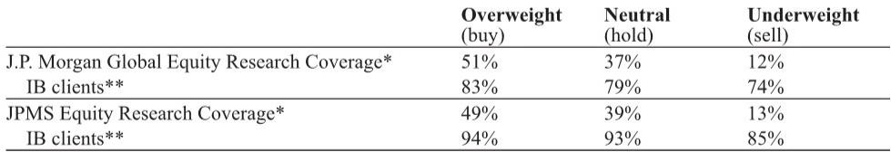

# 中国燃气行业：市场真正低估的不是需求，而是成本端的不对称风险

某外资投行在最新发布的全球中国峰会纪要对中国燃气板块给出了明确且一致的评价：谨慎。这一判断并非源于对需求端的悲观，而是基于一个被市场长期低估的结构性隐患——成本端的不对称风险。

报告显示，2026年前四个月，昆仑能源与华润燃气的零售气量几乎持平，同比增速分别为零增长和下降0.5%。这一数据本身并不令人意外，因为暖冬与消费疲软已被市场广泛预期。真正值得关注的，是隐藏在平淡数据背后的三个信号：第一，工业气量的回暖在4月才真正显现，且驱动因素并非内需复苏，而是东南亚能源扰动带来的订单回流；第二，单位毛差虽在年初有所改善，但4月新合同年开启后成本压力已开始抬头；第三，LNG现货价格的高企正在压低接收站利用率，而这恰恰是过去两年市场认为的“第二增长曲线”。

这份报告的核心洞察在于：中国燃气行业当前面临的根本问题不是需求不足，而是供给侧的成本传导机制正在被重新定价。以下五个层次的分析将揭示这一判断背后的逻辑。

## 1. 工业气量的回暖具有“假性复苏”特征，其可持续性取决于外部扰动而非内生动力

报告中最值得拆解的数据是工业气量的结构分化。两家公司均显示，4月工业气量出现了环比改善：昆仑能源的工业气量实现了低单位数增长，华润燃气则从一季度的约0.6%提升至4月累计的约2.4%。但驱动因素并非市场期待的“内需触底反弹”，而是两个结构性因素：钢铁行业的强势表现，以及东南亚能源中断引发的订单回流。

钢铁需求的回暖本身具有政策驱动属性，与地产相关的玻璃和建材用气仍持续疲弱。这意味着工业气量的改善高度集中在少数特定行业，而非全局性复苏。更关键的是，东南亚订单的回流是否可持续？这一因素本质上取决于外部能源格局的扰动时长，而非中国本土经济的韧性。一旦东南亚能源供应恢复，这部分增量气量可能迅速消退。

从投资含义看，市场若将4月工业气量的改善线性外推至全年，将面临两个风险：一是高估了内需复苏的广度，二是低估了外部因素的不确定性。对于关注中国燃气板块的投资者而言，真正的观察点不应是月度环比数据，而是工业气量改善的行业宽度是否能够从钢铁、出口相关领域扩展到建筑材料和化工等传统用气大户。

## 2. 单位毛差的稳定是“假象”，新合同年的成本压力尚未完全反映在利润表中

报告披露，华润燃气4月累计零售单位毛差为0.48元/立方米，同比提升1-2分钱，昆仑能源则基本持平。乍看之下，毛差表现似乎优于市场预期。但报告的深层含义恰恰相反：这种稳定是暂时的，甚至具有误导性。

关键线索在于管理层的一句话：成本压力可能尚未完全体现，如果LNG价格持续高企。4月是新合同年的开始，上游气源成本的调整通常存在时滞。当前毛差的改善更多来自2025年较低气价合同的余波，而2026年新合同的高成本将在后续月份逐步计入。这意味着，上半年看似稳定的毛差，可能在进入三季度后出现明显收窄。

对于理解中国燃气行业的盈利模型而言，这一点至关重要。市场过去习惯于用“气量增长+毛差稳定”的框架来估值，但当前的环境正在打破这一线性关系：气量增长乏力，而毛差则面临成本端的上行风险。两者同时承压，意味着行业盈利的底部可能尚未到来。

## 3. 新接驳业务的萎缩正在改变燃气公司的估值逻辑，从“增长型公用事业”向“纯公用事业”切换

报告中最具结构性含义的数据来自新接驳业务。昆仑能源前四个月新增接驳约20万户，全年目标为60-70万户；华润燃气接驳量同比下降20%，全年指引隐含20-30%的同比降幅。这组数据指向一个不可逆的趋势：中国城市燃气市场的增量空间正在快速收窄。

新接驳业务在过去十年中不仅是燃气公司的收入来源，更是其估值溢价的核心支撑。它赋予了燃气公司“增长型公用事业”的属性，使其能够享受高于传统公用事业的估值倍数。但当接驳量进入持续下降通道，这一估值逻辑的基础正在瓦解。

更值得关注的是，新接驳的萎缩并非周期性波动，而是结构性拐点。中国城镇化率已接近70%，城市燃气普及率也已处于高位，新增接驳的潜力空间有限。这一背景下，燃气公司必须回答一个根本问题：当“跑马圈地”的时代结束后，增长从哪里来？华润燃气的综合服务和综合能源业务给出了一个方向，但报告显示，这两项业务前四个月均仅实现高单位数增长，低于全年双位数增长指引。

## 4. 报告尚未完全回答的关键问题：LNG接收站的利用率能否在旺季恢复？

报告提到，昆仑能源的LNG接收站前四个月处理量同比下降了低两位数，原因是中石油在LNG现货价格高企的背景下减少了现货采购。管理层仍预期旺季存在恢复空间，但前提是LNG价格回落。

这一问题之所以关键，是因为LNG接收站被认为是燃气公司多元化收入的重要来源，也是市场给予估值溢价的另一理由。但当前的高价环境正在考验这一逻辑的韧性。如果LNG价格持续高企，接收站的利用率不仅无法恢复，还可能进一步下降。更值得追问的是，即便旺季利用率有所回升，其盈利贡献是否足以对冲新接驳业务的萎缩和毛差的下行？

报告对此没有给出明确答案，这也正是投资者需要持续跟踪的核心变量。LNG接收站的利用率与LNG现货价格高度负相关，而后者又受到全球能源格局的深刻影响。这是一个典型的“无法预测、只能应对”的风险因子。

## 5. 投资者的观察框架应从“量价齐升”切换到“成本传导效率与多元化收入的兑现度”

基于以上分析，评估中国燃气公司的框架需要系统性调整。传统的“气量增长+毛差稳定性”模型在当前环境下已经失效。新的观察框架应聚焦于三个维度：

第一，成本传导效率。在气源成本上升的环境中，燃气公司能否及时将成本转嫁给下游用户？这取决于其定价能力、合同结构以及所在区域的市场化程度。不同公司之间的差异将显著拉大。

第二，多元化收入的兑现度。综合服务和综合能源业务是否能够真正成为第二增长曲线？华润燃气给出了双位数增长指引，但前四个月的实际表现低于这一目标。关键在于，这些业务的增长是否具有可持续性，还是仅仅依赖于低基数效应。

第三，新接驳业务下滑的速度与节奏。这是影响公司自由现金流和估值倍数的最直接变量。如果接驳量下降的速度快于市场预期，将倒逼公司加速转型，而转型期的盈利能力通常会承压。

这三个维度构成了评估中国燃气公司价值的新三角。那些在成本传导效率上具有优势、多元化收入兑现度高、且接驳业务下滑节奏可控的公司，将能够在行业调整期实现相对收益。

---

报告还留下了一个悬而未决的深层问题：如果LNG价格持续高企，昆仑能源的LNG接收站业务将面临怎样的盈利压力？而华润燃气的综合服务和综合能源业务能否在全年实现双位数增长，还是会被宏观背景拖累？这些问题的答案，将决定中国燃气板块在2026年下半年的投资方向。

这些问题在报告的图表和附注中有更详细的拆解，包括各公司的月度气量结构、成本传导的时间线、以及不同LNG价格情景下的盈利敏感性分析。欢迎来星球微信群里继续讨论，获取完整报告解读与原始图表。

Personal reading notes and learning share only. Not investment advice.

