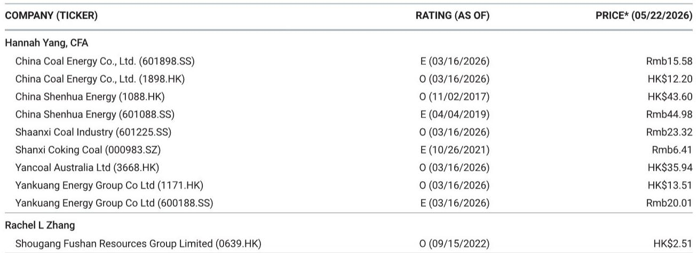
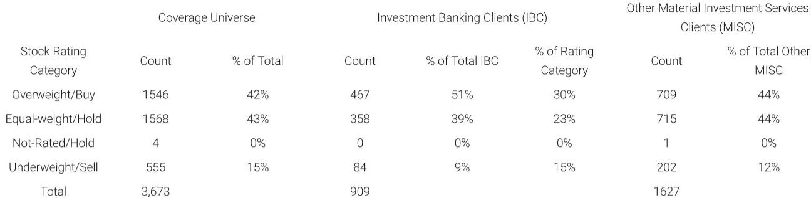

# 市场低估的不是需求，而是安全冲击对供给侧的再定价能力

本周五晚间山西某煤矿发生重大爆炸事故，导致约90人遇难。事件发生后，沁源县全部25座在产煤矿立即停产自查，涉及年产能2740万吨，且均为炼焦煤。随后，陕西、内蒙古、河南以及山西临汾、吕梁等地相继要求辖区内煤矿开展安全自查。根据投行研报的测算，本轮停产自查波及的产能可能超过8000万吨/年。

这不是一次普通的安全生产事件。在六月至七月传统用煤淡季，这一冲击发生的时间点看似“不利”，但恰恰因为淡季库存本就不高、市场对供给弹性缺乏预期，反而使得价格对供给收缩的反应比旺季更为敏感。更值得关注的是，这场事故可能引发中央层面新一轮更严格的安全检查，进而影响动力煤供给——这才是市场尚未充分定价的变量。

该投行在研报中明确指出，事故已引发市场对中央层面更严格检查的担忧，这可能导致动力煤供给趋紧，叠加迎峰度夏旺季，电厂可能加速补库，从而推动动力煤价格短期上行。但我们要追问的是：这仅仅是一次短期脉冲，还是可能触发行业定价范式的结构性变化？

以下是我们从这份研报中提炼出的五个关键层次，它们共同指向一个判断——市场真正需要重新定价的，不是需求侧的复苏节奏，而是安全冲击对供给侧的长期约束力。

## 1. 事故的冲击半径远超单一省份，8000万吨产能停摆只是起点

本次事故的直接后果是沁源县全部煤矿停产。但研报数据显示，更关键的信号在于跨省扩散：陕西、内蒙古、河南以及山西的临汾、吕梁均已要求辖区内煤矿开展安全自查。这五个区域的在产煤矿合计产能超过8000万吨/年，且以炼焦煤为主。

这意味着什么？8000万吨听起来是一个数字，但考虑到炼焦煤在总产能中的占比本就低于动力煤，这一规模的炼焦煤产能停摆，对焦煤市场的边际影响可能远超数字本身。更关键的是，自查不等于复产。根据过往经验，自查阶段通常需要一到两周，而一旦发现隐患，整改周期可能延长至一个月以上。在此期间，供给缺口将持续存在。

从历史规律看，重大事故后的安全检查往往不是一次性的。2019年某次类似事件后，全国煤矿安全检查持续了三个月，期间产能利用率下降了约5个百分点。如果本次事故也触发类似力度的全国性检查，那么8000万吨可能只是第一轮冲击。研报虽然未给出后续检查力度的时间表，但“中央层面更严格检查”这一表述本身，就暗示了升级风险。

## 2. 淡季不淡：炼焦煤价格在消费淡季获得意外支撑，这正是市场最该关注的信号

六月至七月通常是炼焦煤的消费淡季。钢铁行业进入检修期，焦化厂开工率下降，炼焦煤需求本应走弱。但研报指出，本轮停产自查“尽管处于消费淡季，仍支撑了炼焦煤价格”。

这一判断的隐含含义值得深挖：淡季供给收缩对价格的支撑效果，可能比旺季更强。原因在于，淡季时市场对供给冲击的预期更低，库存缓冲也更薄。当意外停摆发生时，下游企业没有足够的备货来平滑冲击，只能通过提价来争夺剩余资源。

反过来说，如果这一事故发生在需求旺季（如九月至十月），虽然绝对价格涨幅可能更大，但市场的定价逻辑反而更清晰——那是“供需双旺下的供给约束”，是市场已经部分预期到的逻辑。而淡季中的供给冲击，才真正测试了供给侧的定价弹性。

目前炼焦煤价格已经出现企稳反弹迹象。如果后续安全检查升级，炼焦煤价格可能获得更持续的支撑。但投资者需要区分的是：这究竟是事件驱动的短期脉冲，还是安全检查常态化的结构性溢价？研报对此没有给出明确答案，但提出了一个值得跟踪的观察点——中央层面的检查力度是否超出市场预期。

## 3. 动力煤才是真正的“灰犀牛”：安全检查的溢出效应可能改写旺季定价

如果说炼焦煤的供给冲击是直接后果，那么动力煤面临的则是间接但可能更大的风险。研报明确提到，事故已引发市场对中央层面更严格检查的担忧，这可能导致动力煤供给趋紧。

动力煤的逻辑链条比炼焦煤更长，但确定性可能更高：第一，全国性安全检查不会区分煤种，动力煤矿井同样面临停产自查压力；第二，当前正处迎峰度夏旺季，电厂日耗处于高位，库存本就在下降通道中；第三，安全检查可能加速电厂补库行为——即使实际供给尚未收缩，预期层面的补库也会推升价格。

这三重因素叠加，意味着动力煤价格在短期内有较强的上行支撑。研报对此的判断是“推动动力煤价格短期上行”，但我们需要进一步思考：这个“短期”有多长？如果安全检查持续到八月甚至九月，那么整个夏季用电高峰期的动力煤价格中枢都可能被抬高。

值得注意的是，该投行对中国煤炭行业的整体观点是“Cautious”（谨慎）。这意味着，即使短期价格有支撑，中期供需格局仍面临压力——比如新能源替代、进口煤竞争、需求增速放缓等。安全检查带来的供给约束，能否在中期维度上对抗这些结构性压力，是投资者需要持续跟踪的核心问题。

## 4. 报告尚未完全回答的关键问题：安全检查会常态化吗？以及，谁在真正受益？

研报提供了清晰的事件驱动分析，但有两个关键问题没有完全展开。

第一个问题是：本次安全检查是否会从“运动式”转向“常态化”？中国煤矿安全监管历史上，重大事故后通常会有为期一到三个月的集中整治，但之后往往回归常态。如果本次事故推动的是制度层面的长期安全标准提升（如强制退出低产能矿井、提高安全投入要求），那么供给侧的约束将是结构性的，而非周期性的。这将对煤价的中枢产生持续影响。但研报对此没有给出明确判断，这需要后续政策动向的验证。

第二个问题是：在安全检查升级的背景下，哪些企业真正受益？直观来看，拥有大型、现代化、安全记录良好的煤矿的企业可能受益——它们不仅不会因检查而停产，反而可能因竞争对手减产而获得市场份额和定价权。但研报的股票评级显示，不同煤种、不同区域的公司评级存在差异：中国神华A股和H股评级不同，兖矿能源A股和H股评级也不同。这种差异背后的逻辑是什么？是流动性差异、估值差异，还是对安全检查影响的暴露度不同？研报没有展开，但这是投资者最需要理解的部分。

此外，研报还提到MS在多家煤炭公司中持有1%以上的普通股，且未来三个月可能寻求投行业务收入。这些利益冲突信息提示读者，在参考研报观点时需保持独立判断。

## 5. 投资者需要建立一个新的观察框架：从“需求跟踪”转向“供给弹性定价”

传统上，煤炭投资的核心变量是需求——基建投资、房地产开工、制造业景气度等。但本次事故提示我们，在产能周期已经大幅收缩的背景下，供给弹性可能成为更重要的定价因子。

过去几年，中国煤炭行业经历了剧烈的产能出清。根据公开数据，全国煤矿数量从2015年的一万座左右下降至目前的约四千座，产能集中度大幅提升。这意味着，任何一个区域性的供给冲击，都可能对全国市场产生不成比例的影响。安全检查、环保督察、资源税改革等政策变量，正在从“扰动因素”升级为“定价核心因素”。

投资者可以建立这样一个观察框架：第一，跟踪安全检查的扩散范围和持续时间——这是短期价格的核心驱动；第二，关注政策层面是否出现制度性安全标准提升的信号——这是中期价格中枢的关键变量；第三，区分不同煤种、不同区域、不同企业规模对检查的敏感度——这是选股的核心逻辑；第四，不要忽视进口煤的替代弹性——如果国内价格快速上涨，进口煤可能填补缺口，从而抑制涨幅。

在这个框架下，本次事故可能不是终点，而是一个新的起点——它提醒市场，在供给弹性极低的当下，任何一个“意外”都可能被定价放大。

---

以上是基于投行研报的核心判断和逻辑推演。但正如我们前面所讨论的，安全检查是否常态化、不同企业的受益程度差异、以及进口煤的替代空间，都是研报尚未完全回答的关键问题。这些问题恰恰是决定投资决策的核心变量。

如果你对这些未解问题感兴趣，欢迎来我们的星球微信群里继续讨论。我们会在群内分享完整的研报原文、历史安全检查案例的复盘数据，以及我们对后续政策走向的持续跟踪。这些内容在公开渠道很难找到系统性的梳理，但正是做出独立判断所需要的底层材料。

Personal reading notes and learning share only. Not investment advice.

