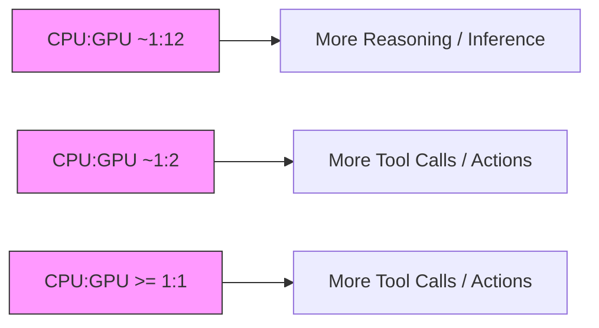

你是麦肯锡/投研风格的微信公众号财经文章主笔，擅长用金字塔原理把研报内容转化为“有主张、有层次、有洞察、但仍保留完整报告阅读欲望”的长文。

【目标】
- 基于下面的研报解析内容，写一篇微信公众号文章 Markdown。
- 风格：稳重、专业、克制、有洞察，像咨询公司合伙人写给高净值读者/产业决策者的研报导读。
- 长度：约 3000 字，允许上下浮动 15%。
- 不要使用 emoji。
- 可以基于报告内容做适度发散，但必须是从原文逻辑推出的判断，不要编造数据、公司动作或引用。
- 不要把研报所有正文内容讲完，要留下明确但自然的伏笔，让读者愿意加入社群阅读完整报告。

【金字塔原理写作原则】
1. 结论先行：文章开头先回答“这份报告最值得看的判断是什么”，而不是介绍背景。
2. 统领思想：全文只能服务一个主判断，避免变成摘要合集。
3. 纵向回答：每一层都要回答上一层提出的“为什么”或“所以呢”。
4. 横向 MECE：每个一级小节必须彼此独立、共同支撑主判断，避免重叠。
5. Synthesis over summary：不要复述报告段落，要提炼“这些事实合在一起意味着什么”。
6. So what：每个小节末尾必须落到对行业、公司、竞争格局、资产定价或读者观察框架的含义。
7. Action title：所有 `##` 小标题必须是“直接讲述洞察的完整句子”，不能是目录标签。

【标题与小标题硬性要求】
- `# 标题` 必须直接表达一个判断，例如“市场真正低估的不是需求，而是供给侧的再定价”。
- 禁止使用以下机械标题：
  - 一、核心判断
  - 二、真正重要的是结构性变量
  - 三、报告没有说透
  - 四、对读者的启发
  - 关键变化
  - 投资启示
  - 总结
- 所有 `##` 标题都要像麦肯锡报告里的 action title：读完标题就知道这一节结论。
- 小标题可以带序号，但序号后必须是一句洞察，例如：`## 1. 这轮变化真正考验的是企业能否把规模转化为议价权`。

【建议结构，但不要机械照抄标题】
1. `# 标题`：一句主判断，不超过 32 字。
2. 开头 4-6 段：直接给出主判断、为什么现在重要、报告提供了什么新信号。
3. 4-6 个 `##` 小节：每个小节标题都是洞察句，不是栏目名。
4. 至少一个小节讨论“报告尚未完全回答的关键问题”，但标题也要是洞察句。
5. 至少一个小节给出读者的观察框架，但不要命名为“对读者的启发”。
6. 文末自然承接未解问题，引导读者加入社群/微信群继续讨论。不要照抄固定话术，请基于本文未解问题每次重新写一段自然 CTA；语义可以参考：欢迎来星球微信群里继续讨论。
7. 在免责声明前，单独插入这张图片链接：``
8. 结尾只输出英文灰色免责声明：`
Personal reading notes and learning share only. Not investment advice.
`

【hook 要求】
- 不要硬插“加入社群”。
- hook 应该来自正文自然出现的未解问题，比如：关键假设尚未验证、竞争优势仍需拆解、图表背后的二阶影响没有展开。
- 文末 CTA 要像“顺着这些未解问题继续读完整报告/继续讨论”，不是广告口吻。
- CTA 必须每篇重新写，不能固定输出“加入社群，领取完整研报解读与原始图表”。可以类似“欢迎来星球微信群里继续讨论”。

【图片要求】
- 不要主动生成 MinerU 图片 markdown；系统会在文章生成后自动插入 MinerU 原始图片。
- 但文末免责声明前必须保留知识星球图片：``。

【内容边界】
- 只能基于研报原文和解析结果推导，不要编造数据、公司动作、引用。
- 遇到不确定内容，要用“这里仍需验证”“报告没有完全展开”等表达。
- 避免“震惊”“爆款”“一文看懂”等浮夸表达。
- 不要出现小红书话题标签。
- 不要出现 emoji。
- 默认避免出现具体投行品牌名，比如“GS”“GS”，统一写作“投行研报”。
- 不要解释你的思考过程，不要输出多余说明。

【研报解析内容】
"""
Investor Presentation | Asia Pacific

# Greater China Semis: AI Packaging Innovation: CoWoS, CPO and WoW

MS TAIWAN LIMITED+

Daniel Yen, CFA

Equity Analyst

Daniel.Yen@morganstanley.com +886 2 2730-2863

Charlie Chan

Equity Analyst

Charlie.Chan@morganstanley.com +886 2 2730-1725

# GREATER CHINA TECHNOLOGY SEMICONDUCTORS

Asia Pacific

Industry View Attractive

MS does and seeks to do business with companies covered in MS. As a result, investors should be aware that the firm may have a conflict of interest that could affect the objectivity of MS. Investors should consider MS as only a single factor in making their investment decision.

For analyst certification and other important disclosures, refer to the Disclosure Section, located at the end of this report.

+= Analysts employed by non-U.S. affiliates are not registered with FINRA, may not be associated persons of the member and may not be subject to FINRA restrictions on communications with a subject company, public appearances and trading securities held by a research analyst account.

# Global Semi Industry Market Could Reach US\$1.5tn by 2030, with AI Semis Contributing Half

Our supply chain data-driven bull case assumes cloud Al Semi TAM could grow to US\$485bn in 2026e   

other

| Category | Value |
| -------- | ----- |
| Cloud capex | US$796bn |
| AI server capex | ~US$600bn |
| AI Semi (mainly NV's AI GPU) | US$485bn |
| Cloud AI ASIC & Non-NV GPUs | ~US$90bn |

We expect AI semi TAM to reach \~US\$753bn by 2030   

bar_stacked

AI semi revenue breakdown by application
| Year | Cloud (US$ mn) | Automotive (US$ mn) | Consumer (US$ mn) | PC (US$ mn) | Smartphone (US$ mn) | Others (US$ mn) |
|---|---|---|---|---|---|---|
| 2021 | 15,00 | 0 | 0 | 0 | 10,00 | 0 |
| 2022 | 20,00 | 0 | 0 | 0 | 15,00 | 0 |
| 2023 | 40,00 | 0 | 0 | 0 | 20,00 | 0 |
| 2024 | 110,00 | 10,00 | 5,00 | 5,00 | 30,00 | 0 |
| 2025e | 180,00 | 15,00 | 10,00 | 10,00 | 45,00 | 0 |
| 2026e | 310,00 | 25,00 | 15,00 | 15,00 | 65,00 | 0 |
| 2027e | 420,00 | 35,00 | 25,00 | 25,00 | 85,00 | 0 |
| 2028e | 500,00 | 45,00 | 35,00 | 35,00 | 115,00 | 0 |
| 2029e | 545,00 | 55,00 | 45,00 | 45,00 | 135,00 | 5,56 |
| 2030e | 615,00 | 65,00 | 55,00 | 55,00 | 165,00 | 13,66 |
23-30e CAGR: 30%

Source: Nvidia, MS. e = MS estimates.

# Cloud Capex Remains Robust Among Major CSPs

MS cloud capex tracker estimates nearly US\$811bn of cloud capex spending in 2026 (Top 11 listed global CSPs; no sovereign AI)   

bar

Cloud Capex Spending ($ Billions)
| Year | Cloud Capex Spending ($ Billions) |
| :--- | :--- |
| 2013 | 32 |
| 2014 | 40 |
| 2015 | 44 |
| 2016 | 53 |
| 2017 | 64 |
| 2018 | 94 |
| 2019 | 92 |
| 2020 | 119 |
| 2021 | 156 |
| 2022 | 181 |
| 2023 | 174 |
| 2024 | 281 |
| 2025 | 467 |
| 2026 | 796 |
| 2027 | 814 |
| MS '26E | 861 |
MSe for CY26 cloud cash capex is now 8% above Consensus estimates.

Global Cloud Capex vs. TSMC capex   

line

| Year | Global Cloud Capex (LHS) (US$bn) | TSMC Capex (RHS) (US$bn) |
|---|---|---|
| 2013 | 30 | 10 |
| 2014 | 40 | 9 |
| 2015 | 45 | 8 |
| 2016 | 55 | 10 |
| 2017 | 65 | 11 |
| 2018 | 90 | 12 |
| 2019 | 85 | 16 |
| 2020 | 110 | 19 |
| 2021 | 150 | 33 |
| 2022 | 180 | 41 |
| 2023 | 170 | 34 |
| 2024 | 280 | 30 |
| 2025 | 460 | 41 |
| 2026e | 800 | 59 |
| 2027e | 815 | 67 |
| Next year (e) | - | 70 |

Source: FactSet, company data, MS. E = MS estimates. Note: Estimates are top-down and from our US tech team.

# Agentic AI - Growing CPU Opportunities

# Cluster-level CPU: GPU intensity rises as AI moves from reasoning to action

flowchart

Source: MS (e) estimates

We lift our base case Orchestration CPU TAM to \$79bn (prior \$60bn)... 

<table><tr><td>TAM 2030 ($bn)</td><td>Orch.</td><td>Host + cloud</td><td>Total</td></tr><tr><td>Bear Case</td><td>32</td><td>45</td><td>77</td></tr><tr><td>Base (current) model</td><td>60</td><td>45</td><td>105</td></tr><tr><td>Base (new) Bottom-Up model</td><td>79</td><td>45</td><td>125</td></tr><tr><td>Bull Top-Down model</td><td>238</td><td>45</td><td>283</td></tr></table>

... and our bull case implies a \$238bn CPU orchestration TAM   

bar_stacked

| Case | CPUs - Agentic orchestration ($bn) | CPUs - Host ($bn) | CPUs - Cloud ($bn) |
| :--- | :--- | :--- | :--- |
| Base Case | 79,245 | 30,000 | 15,000 |
| Bull Case | 237,603 | 30,000 | 15,000 |
$125bn
$283bn

# TSMC AI Semis Revenue 2024-29e CAGR Could Reach 60%

TSMC – AI semis revenue could account for >30% of 2026e revenue   

bar_line

TSMC AI Revenue vs. Non-AI
| Year | Server AI revenue (US$ bn) | Non-AI revenue (US$ bn) | Server AI % of TSMC revenue (%) |
|---|---|---|---|
| 2021 | 5 | 48 | 2 |
| 2022 | 6 | 73 | 3 |
| 2023 | 8 | 68 | 5 |
| 2024e | 11 | 89 | 10 |
| 2025e | 21 | 119 | 15 |
| 2026e | 51 | 163 | 25 |
| 2027e | 76 | 199 | 35 |
| 2028e | 96 | 248 | 38 |
| 2029e | 116 | 273 | 42 |

TSMC – margin expansion   

bar_line

| Year | Depreciation and amort (US$ mn) | Gross margin (US$ mn) | EBITDA margin (%) |
|---|---|---|---|
| 2001 | 1000 | 16000 | 30 |
| 2002 | 1000 | 18000 | 35 |
| 2003 | 1000 | 20000 | 40 |
| 2004 | 1000 | 22000 | 45 |
| 2005 | 1000 | 24000 | 50 |
| 2006 | 1000 | 26000 | 55 |
| 2007 | 1000 | 25000 | 55 |
| 2008 | 1000 | 24000 | 55 |
| 2009 | 1000 | 25000 | 55 |
| 2010 | 1500 | 26000 | 60 |
| 2011 | 2500 | 27000 | 65 |
| 2012 | 3500 | 28000 | 65 |
| 2013 | 4500 | 29000 | 70 |
| 2014 | 6500 | 30000 | 75 |
| 2015 | 7500 | 31000 | 75 |
| 2016 | 8500 | 32000 | 75 |
| 2017 | 9500 | 33000 | 75 |
| 2018 | 11500 | 34000 | 75 |
| 2019 | 13500 | 35000 | 75 |
| 2020 | 16500 | 36000 | 75 |
| 2021 | 19500 | 38000 | 75 |
| 2022 | 23500 | 41553 | 75 |
| 2023 | 28500 | 44553 | 75 |
| 2024e | 34567 | 48553 | 75 |
| 2025e | - | - | - |
| 2026e | - | - | - |
| 2027e | - | - | - |
| 2028e | - | - | - |
Depreciation and amort (US$ mn) + Gross margin (US$ mn) + EBITDA margin (US$ mn) (US$ mn) (US$ mn) (US$ mn) (US$ mn) (US$ mn) (US$ mn) (US$ mn) (US$ mn) (US$ mn) (US$ mn) (US$ mn) (US$ mn) (US$ mn) (US$ mn) (US$ mn) (US$ mn) (US$ mn) (US$ mn) (US$ mn) (US$ mn),

Source: Company data, MS (e) estimates

TSMC – AI semis revenue breakdown   

bar_stacked

TSMC AI revenue breakdown
| Year | General-purpose AI (US$ bn) | Custom AI chips (ASICs) (US$ bn) | CoWoS/wafer test (US$ bn) | AI server CPU (US$ bn) |
|---|---|---|---|---|
| 2021 | 0 | 0 | 1 | 0 |
| 2022 | 0 | 0 | 1 | 0 |
| 2023 | 1 | 1 | 2 | 0 |
| 2024e | 3 | 3 | 5 | 0 |
| 2025e | 6 | 7 | 10 | 0 |
| 2026e | 18 | 10 | 25 | 0 |
| 2027e | 23 | 15 | 35 | 0 |
| 2028e | 30 | 25 | 45 | 0 |
| 2029e | 38 | 30 | 45 | 0 |
2024-2029e CAGR 60%

TSMC – 2026e revenue breakdown by customer   

pie

| Company | Share (%) |
| :--- | :--- |
| Apple | 15 |
| MediaTek | 4 |
| AMD | 9 |
| Qualcomm | 6 |
| NVIDIA | 21 |
| Broadcom | 11 |
| Intel | 5 |
| Novatek | 0 |
| Realtek | 0 |
| Others | 29 |

# TSMC Could Expand CoWoS Capacity to 165kwpm by 2027 Given Continued Strong AI Demand

Global CoWoS capacity expansion by vendor   

bar_stacked

CoWoS Supply Capacity Breakdown (By Year End)
| Year | Non-TSMC (Amkor/UMC/ASE) (kwpm) | TSMC (kwpm) |
|---|---|---|
| 2022 | 2 | 10 |
| 2023 | 5 | 13 |
| 2024 | 6 | 32 |
| 2025 | 23 | 70 |
| 2026e | 50 | 120 |
| 2027e | 80 | 165 |

Global CoWoS consumption, by customer   

bar_stacked

| Year | NVIDIA (k wafers) | Broadcom (k wafers) | AMD (k wafers) | Xilinx (k wafers) | AWS/Annapurna (k wafers) | AWS/Alchip (k wafers) | Marvell (k wafers) | GUC (k wafers) | MediaTek (k wafers) | Others (k wafers) |
|---|---|---|---|---|---|---|---|---|---|---|
| 2023 | 50 | 10 | 5 | 5 | 5 | 5 | 0 | 0 | 0 | 0 |
| 2024 | 180 | 70 | 40 | 10 | 10 | 5 | 10 | 0 | 0 | 0 |
| 2025e | 420 | 80 | 60 | 10 | 10 | 5 | 20 | 0 | 0 | 0 |
| 2026e | 870 | 250 | 120 | 10 | 40 | 5 | 30 | 30 | 30 | 10 |

Source: Company data, MS. $E =$ MS estimates.

# SolC Expansion Will Be a Key Focus Area for TSMC in the Coming Years

TSMC SolC Supply Capacity Breakdown (by year-end)   

bar

| Year | TSMC SolC Capacity (kwpm) | TSMC SolC Production (kwpm) |
|---|---|---|
| 2023 | 1.5 | - |
| 2024 | 3.0 | - |
| 2025 | 6.6 | 5 |
| 2026e | 14 | 10 |
| 2027e | 45 | 30 |
| 2028e | 78 | 60 |

SolC demand breakdown, by customer   

bar_stacked

| Year | NVIDIA (k wafers) | AMD (k wafers) | Apple (k wafers) | Others (e.g. Qualcomm, Broadcom) (k wafers) |
| :--- | :--- | :--- | :--- | :--- |
| 2026e | ~5 | ~40 | ~30 | ~40 |
| 2027e | ~120 | ~50 | ~60 | ~100 |

Source: Company data, MS. $E =$ MS estimates.

# TSMC Likely Doubled CoWoS and SolC Capacity in 2025, and We Expect this to Continue into 2026

Key changes in 2026e CoWoS allocation in a chart   

bar

| Company | 2026e (new) (k wafers) | 2026e (old) (k wafers) |
| :--- | :--- | :--- |
| NVIDIA | 875 | 875 |
| Broadcom | 290 | 280 |
| AMD | 110 | 110 |
| Xilinx | 10 | 10 |
| MediaTek | 30 | 30 |
| AWS/Annapurna | 50 | 50 |
| AWS/Aitchip | 30 | 30 |
| Marvell | 37 | 37 |
| GUC | 14 | 14 |

Key changes in 2026 CoWoS allocation in a table (see numbers marked in red) 

<table><tr><td>(k wafer)</td><td>2023</td><td>2024</td><td>2025e</td><td>2026e</td><td>2023</td><td>2024</td><td>2025e</td><td>2026e</td></tr><tr><td>NVIDIA</td><td>53</td><td>200</td><td>425</td><td>875</td><td>45%</td><td>54%</td><td>62%</td><td>60%</td></tr><tr><td>TSMC</td><td></td><td></td><td>390</td><td>680</td><td></td><td></td><td></td><td></td></tr><tr><td>CoWoS-L</td><td></td><td></td><td>390</td><td>650</td><td></td><td></td><td></td><td></td></tr><tr><td>CoWoS-S</td><td></td><td></td><td>0</td><td>20</td><td></td><td></td><td></td><td></td></tr><tr><td>CoWoS-R</td><td></td><td></td><td>0</td><td>10</td><td></td><td></td><td></td><td></td></tr><tr><td>Non-TSMC</td><td></td><td></td><td>35</td><td>165</td><td></td><td></td><td></td><td></td></tr><tr><td>Amkor</td><td></td><td></td><td>35</td><td>135</td><td></td><td></td><td></td><td></td></tr><tr><td>CoWoS-S</td><td></td><td></td><td>20</td><td>75</td><td></td><td></td><td></td><td></td></tr><tr><td>CoWoS-R</td><td></td><td></td><td>15</td><td>60</td><td></td><td></td><td></td><td></td></tr><tr><td>ASE/SPIL</td><td></td><td></td><td>0</td><td>30</td><td></td><td></td><td></td><td></td></tr><tr><td>CoWoS-S</td><td></td><td></td><td>0</td><td>0</td><td></td><td></td><td></td><td></td></tr><tr><td>CoWoS-R</td><td></td><td></td><td>0</td><td>30</td><td></td><td></td><td></td><td></td></tr><tr><td>Broadcom</td><td>23</td><td>68</td><td>85</td><td>290</td><td>20%</td><td>18%</td><td>12%</td><td>20%</td></tr><tr><td>TSMC</td><td></td><td></td><td>83</td><td>230</td><td></td><td></td><td></td><td></td></tr><tr><td>CoWoS-L</td><td></td><td></td><td>0</td><td>15</td><td></td><td></td><td></td><td></td></tr><tr><td>CoWoS-S</td><td></td><td></td><td>83</td><td>215</td><td></td><td></td><td></td><td></td></tr><tr><td>ASE/SPIL</td><td></td><td></td><td>2</td><td>30</td><td></td><td></td><td></td><td></td></tr><tr><td>CoWoS-L</td><td></td><td></td><td>0</td><td>0</td><td></td><td></td><td></td><td></td></tr><tr><td>CoWoS-S</td><td></td><td></td><td>2</td><td>30</td><td></td><td></td><td></td><td></td></tr><tr><td>Amkor</td><td></td><td></td><td></td><td>30</td><td></td><td></td><td></td><td></td></tr><tr><td>CoWoS-L</td><td></td><td></td><td></td><td>30</td><td></td><td></td><td></td><td></td></tr><tr><td>AMD</td><td>7</td><td>40</td><td>60</td><td>110</td><td>6%</td><td>11%</td><td>9%</td><td>8%</td></tr><tr><td>TSMC</td><td></td><td></td><td>60</td><td>80</td><td></td><td></td><td></td><td></td></tr><tr><td>CoWoS-L</td><td></td><td></td><td>0</td><td>70</td><td></td><td></td><td></td><td></td></tr><tr><td>CoWoS-S</td><td></td><td></td><td>60</td><td>10</td><td></td><td></td><td></td><td></td></tr><tr><td>ASE/SPIL</td><td></td><td></td><td>0</td><td>30</td><td></td><td></td><td></td><td></td></tr><tr><td>CoWoS-L</td><td></td><td></td><td>0</td><td>30</td><td></td><td></td><td></td><td></td></tr><tr><td>CoWoS-S</td><td></td><td></td><td>0</td><td>0</td><td></td><td></td><td></td><td></td></tr></table>

# What About the Competition Between TSMC CoWoS and Intel EMIB?

TSMC CoWoS can support up to 9.5x reticles, or four chips per wafer   

other

| Interposer Type | Area Efficiency | Cost Decrease |
| --------------- | --------------- | ------------- |
| 300mm wafer     | 7               | -45%          |
| 300x300mm² panel | 16             | -81%          |
| 600x600mm² Panel | 64            | -81%          |

YOLE

www.yolegroup.com | ©Yole Group 2025

Source: Intel, Yole, MS

TSMC's CoWoS-S (silicon interposer) packaging architecture   

text_image

Optional HBM
DRAM Dies
HBM DRAM Die
TSV
HBM DRAM Die
HBM DRAM Die
HBM DRAM Die
μBumps
Base Die
PHY
C4 Cu Bumps
Standard
Package Trace
Package
Balls
Package Substrate
Circuit Board
Short Wires
Silicon interposer
Optional multiple
logic dies
PHY Compute Logic

# What About the Competition Between TSMC CoWoS and Intel EMIB?

Intel's EMIB can easily support larger chips with more reticles (>12) if its supply chain executes well

text_image

EMIB Scalability to Support AI Demand
2023
-4x
Package size
8
H-BP%
12
EHBs
2026
-8x
Package size
-120x120
H-BP%
12
H-BS
×20
EHBs
2028
-12x
Package size
×120x180
H-BP%
×24
H-BS
×38
EHBs
All product and service plans, loadings, and performance estimates are subject to change without notice. Projections about future node performance and other metrics are difficulty uncertain.

EMIB architecture   

text_image

eMIM-T
>2.5 µF/mm²
CoaxMIL
2.5-5.0 nF/mm²
>10 A/mm²
eDTC
>2.5 µF/mm²
HBM
XPU
HBM
eDTC
eDTC
IVR
IVR

Source: Intel, Yole, MS

# Larger Package Size is Emerging as a Key Industry Trend

TSMC's roadmap for interposer size   

bar_stacked

| Year | CoWoS-L/R (9.7-reticle) | CoWoS-L/R (5.5-reticle) | CoWoS-S (3.3-reticle) | CoWoS-S (2-reticle) | CoWoS-S (1.5-reticle) | CoWoS-R (1.4-reticle) |
|---|---|---|---|---|---|---|
| '16 | | | | | | |
| '20 | | | | | | |
| '23 | | | | | | |
| '24 | | | | | | |
| '25 | | | | | | |
| '26 | | | | | | |
| '27 | | | | | | |
1 reticle~830mm²
SoIC
SoIC
SoIC
SoIC
SoIC
SoIC

We expect the testing equipment market to grow at $35\%$ CAGR during 2024-27e   

bar

Global Test Equipment Sales
| Year | Global Test Equipment Sales |
| :--- | :--- |
| 18 | 3800 |
| 19 | 3500 |
| 20 | 4300 |
| 21 | 5500 |
| 22 | 5400 |
| 23 | 4600 |
| 24 | 5600 |
| 25 | 8200 |
| 26e | 11500 |
| 27e | 13700 |
2024-2027e CAGR: 35%

Source: Company data, MS estimates

Chip testing time continues to trend up   

bar

AI GPU Chip Testing Time
| Hardware | Testing Time (second) |
| :--- | :--- |
| Hopper | 350 |
| Blackwell | 700-1,000 |
| Rubin | 1,200-1,400 |
| Next Generation GPU | 1,800-2,000? |

AI/HPC test socket requires higher pin counts vs. traditional consumer tech applications   

bar

Test Socket Pin Count Trend
| Category | Pin count (pin) |
|---|---|
| Smartphone/PC | 1,500 |
| AI/HPC | 6,000 |
| Next Generation AI/HPC | 10,000+ |

# Optics integration has evolved to CPO

Evolution of fiber optics integration   

other

| Component | Top View | Side View | Package |
|-----------|----------|-----------|---------|
| ASIC Transceiver Optics | - | - | QSFP |
| On

[中间内容因长度限制已省略]

)</td><td>NT$5,140.00</td></tr><tr><td>GlobalWafers Co Ltd (6488.TWO)</td><td>E (05/19/2026)</td><td>NT$717.00</td></tr><tr><td>Gudeng Precision (3680.TWO)</td><td>O (11/25/2025)</td><td>NT$568.00</td></tr><tr><td>Hua Hong Semiconductor Ltd (1347.HK)</td><td>E (03/12/2026)</td><td>HK$128.00</td></tr><tr><td>Iluvatar CoreX Semiconductor Co., Ltd. (9903.HK)</td><td>O (04/27/2026)</td><td>HK$444.20</td></tr><tr><td>King Yuan Electronics Co Ltd (2449.TW)</td><td>O (03/03/2023)</td><td>NT$296.00</td></tr><tr><td>Maxscend Microelectronics Co Ltd (300782.SZ)</td><td>U (01/11/2021)</td><td>Rmb125.51</td></tr><tr><td>MediaTek (2454.TW)</td><td>O (11/28/2025)</td><td>NT$3,860.00</td></tr><tr><td>MetaX Integrated Circuits (688802.SS)</td><td>E (04/27/2026)</td><td>Rmb728.45</td></tr><tr><td>Nanya Technology Corp. (2408.TW)</td><td>E (03/20/2026)</td><td>NT$310.50</td></tr><tr><td>NAURA Technology Group Co Ltd (002371.SZ)</td><td>O (11/06/2023)</td><td>Rmb669.00</td></tr><tr><td>OmniVision Integrated Circuits Group Inc (603501.SS)</td><td>E (11/17/2025)</td><td>Rmb104.25</td></tr><tr><td>Phison Electronics Corp (8299.TWO)</td><td>E (02/25/2026)</td><td>NT$2,430.00</td></tr><tr><td>SG Micro Corp. (300661.SZ)</td><td>E (11/03/2025)</td><td>Rmb111.01</td></tr><tr><td>Silergy Corp. (6415.TW)</td><td>U (05/19/2026)</td><td>NT$562.00</td></tr><tr><td>SMIC (0981.HK)</td><td>O (10/21/2025)</td><td>HK$74.20</td></tr><tr><td>TSMC (2330.TW)</td><td>O (02/07/2022)</td><td>NT$2,255.00</td></tr><tr><td>UMC (2303.TW)</td><td>O (05/19/2026)</td><td>NT$114.00</td></tr><tr><td>Vanguard International Semiconductor (5347.TWO)</td><td>E (01/14/2026)</td><td>NT$162.00</td></tr><tr><td>WIN Semiconductors Corp (3105.TWO)</td><td>U (07/14/2025)</td><td>NT$531.00</td></tr><tr><td>Daisy Dai, CFA</td><td></td><td></td></tr><tr><td>ASMPT Ltd (0522.HK)</td><td>O (07/24/2025)</td><td>HK$174.90</td></tr><tr><td>China Resources Microelectronics Limited (688396.SS)</td><td>U (03/02/2026)</td><td>Rmb62.40</td></tr><tr><td>Elan Microelectronics Corp (2458.TW)</td><td>O (10/03/2025)</td><td>NT$162.00</td></tr><tr><td>Empyrean Technology Co Ltd (301269.SZ)</td><td>E (01/17/2025)</td><td>Rmb108.69</td></tr><tr><td>Hangzhou Silan Microelectronics Co. Ltd. (600460.SS)</td><td>U (08/25/2025)</td><td>Rmb32.16</td></tr><tr><td>Innoscience (2577.HK)</td><td>E (10/13/2025)</td><td>HK$65.25</td></tr><tr><td>JCET Group Co Ltd (600584.SS)</td><td>E (01/16/2026)</td><td>Rmb72.88</td></tr><tr><td>Shanghai Fudan Microelectronics (1385.HK)</td><td>O (03/07/2025)</td><td>HK$36.32</td></tr><tr><td>SICC Co Ltd (688234.SS)</td><td>O (03/20/2026)</td><td>Rmb153.74</td></tr><tr><td>StarPower Semiconductor Ltd (603290.SS)</td><td>E (05/14/2026)</td><td>Rmb131.75</td></tr><tr><td>Unigroup Guoxin Microelectronics Co Ltd (002049.SZ)</td><td>U (01/10/2023)</td><td>Rmb79.73</td></tr><tr><td>Universal Scientific Ind. (Shanghai) (601231.SS)</td><td>O (11/05/2025)</td><td>Rmb39.45</td></tr><tr><td>Yangjie Technology (300373.SZ)</td><td>O (06/10/2022)</td><td>Rmb86.38</td></tr><tr><td colspan="3">Daniel Yen, CFA</td></tr><tr><td>AP Memory Technology Corp (6531.TW)</td><td>O (07/11/2025)</td><td>NT$963.00</td></tr><tr><td>ASMedia Technology Inc (5269.TW)</td><td>U (10/03/2025)</td><td>NT$1,480.00</td></tr><tr><td>Aspeed Technology (5274.TWO)</td><td>O (06/09/2025)</td><td>NT$17,780.00</td></tr><tr><td>Egis Technology Inc (6462.TWO)</td><td>E (01/28/2026)</td><td>NT$144.50</td></tr><tr><td>Espressif Systems (688018.SS)</td><td>O (05/15/2023)</td><td>Rmb183.00</td></tr><tr><td>GigaDevice Semiconductor Beijing Inc (603986.SS)</td><td>O (05/15/2025)</td><td>Rmb468.74</td></tr><tr><td>Macronix International Co Ltd (2337.TW)</td><td>O (09/18/2025)</td><td>NT$149.50</td></tr><tr><td>Montage Technology Co Ltd (6809.HK)</td><td>O (03/18/2026)</td><td>HK$446.20</td></tr><tr><td>Montage Technology Co Ltd (688008.SS)</td><td>O (03/18/2026)</td><td>Rmb271.83</td></tr><tr><td>Novatek (3034.TW)</td><td>U (02/04/2026)</td><td>NT$485.50</td></tr><tr><td>Nuvoton Technology Corporation (4919.TW)</td><td>U (11/10/2025)</td><td>NT$199.50</td></tr><tr><td>Parade Technologies Ltd (4966.TWO)</td><td>E (01/30/2026)</td><td>NT$795.00</td></tr><tr><td>Powerchip Semiconductor Manufacturing Co (6770.TW)</td><td>O (10/27/2025)</td><td>NT$63.80</td></tr><tr><td>Realtek Semiconductor (2379.TW)</td><td>E (01/30/2026)</td><td>NT$578.00</td></tr><tr><td>Shenzhen Goodix Technology Co Ltd (603160.SS)</td><td>U (07/14/2025)</td><td>Rmb64.60</td></tr><tr><td>Winbond Electronics Corp (2344.TW)</td><td>E (03/20/2026)</td><td>NT$125.00</td></tr><tr><td>WPG Holdings (3702.TW)</td><td>O (03/16/2026)</td><td>NT$118.00</td></tr><tr><td>WT Microelectronics Co. Ltd. (3036.TW)</td><td>O (01/27/2026)</td><td>NT$289.00</td></tr><tr><td colspan="3">Duan Liu</td></tr><tr><td>Dosilicon Co Ltd (688110.SS)</td><td>U (09/06/2024)</td><td>Rmb138.83</td></tr><tr><td>Shenzhen Longsys Electronics Co Ltd (301308.SZ)</td><td>E (02/25/2026)</td><td>Rmb549.50</td></tr><tr><td colspan="3">Tiffany Yeh</td></tr><tr><td>AllRing Tech Co. (6187.TWO)</td><td>O (09/23/2025)</td><td>NT$1,140.00</td></tr><tr><td>FOCI Fiber Optic Communications Inc (3363.TWO)</td><td>O (01/15/2025)</td><td>NT$852.00</td></tr><tr><td>Himax Technologies Inc (HIMX.O)</td><td>E (02/04/2026)</td><td>US$19.89</td></tr><tr><td>Hon Precision (7769.TW)</td><td>O (04/17/2026)</td><td>NT$7,730.00</td></tr><tr><td>MPI Corporation (6223.TWO)</td><td>O (04/17/2026)</td><td>NT$6,035.00</td></tr><tr><td>Silicon Motion (SIMO.O)</td><td>O (05/06/2024)</td><td>US$263.51</td></tr><tr><td>WinWay Technology Co Ltd (6515.TW)</td><td>O (04/17/2026)</td><td>NT$8,700.00</td></tr></table>

© 2026 MS
"""
