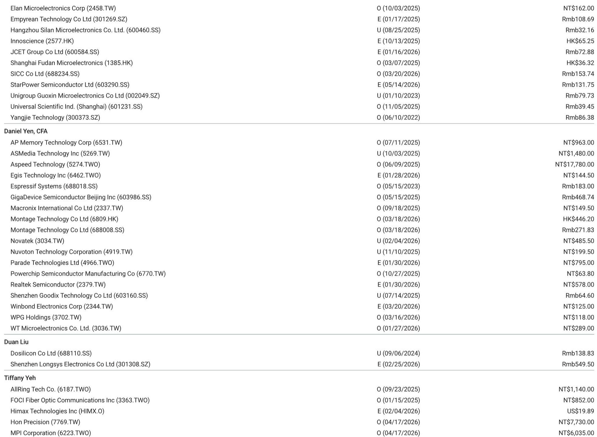
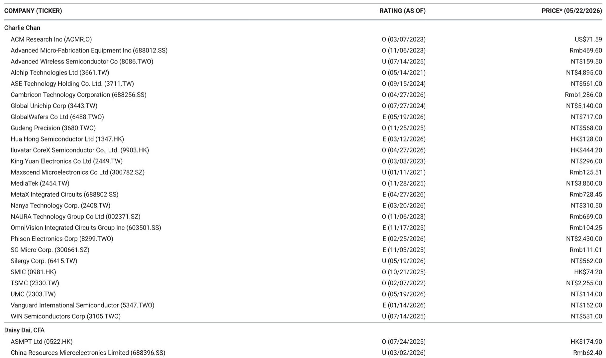

# The Next Frontier in Semiconductors Is Not Shrinking Transistors—It’s How You Connect Them

The semiconductor industry is entering a phase where the physics of transistor scaling no longer dictates the pace of innovation. For decades, the industry’s narrative was defined by ever-smaller nodes: 7nm, 5nm, 3nm. That story is not over, but it is no longer the most consequential one. What now determines the economic value of a chip is not just how many transistors you can pack onto a die, but how you assemble multiple dies into a single, high-performance system. The shift from monolithic integration to advanced packaging—specifically CoWoS, SoIC, and CPO—represents a structural change in how value is created and captured across the semiconductor supply chain.

A recent investor presentation from a leading Asia-Pacific research team makes this case with remarkable specificity. The report projects the global semiconductor market could reach $1.5 trillion by 2030, with AI semiconductors contributing roughly half of that total. More striking than the headline number is the argument underpinning it: the industry’s growth is no longer a function of demand for more chips, but demand for more sophisticated chip *interconnections*. This is not a cyclical upturn. It is a re-engineering of the silicon stack.

What follows is an analysis of the report’s core insights, extended into their strategic implications for investors, technology executives, and supply chain analysts. The focus is not on summarizing data, but on interpreting what the data signals about the future structure of the industry.

## The AI Semiconductor TAM Is Not a Forecast—It Is a Commitment

The report estimates that AI semiconductor total addressable market could reach approximately $753 billion by 2030, up from roughly $60 billion in 2023. That is a compound annual growth rate of about 30 percent. But numbers like these are often read as projections of future demand. They are more accurately read as commitments to future capital expenditure.

Cloud capital expenditure among the top eleven global cloud service providers is estimated to reach nearly $800 billion in 2026, a figure that is 8 percent above consensus estimates. This is not speculation about consumer adoption of AI. This is a concrete, multi-year deployment of infrastructure by the largest buyers of compute in the world. These companies are not waiting for demand to materialize; they are building the capacity to generate it.

The implication is straightforward: the supply chain for AI semiconductors is being shaped by the procurement strategies of a handful of hyperscalers. Their decisions about architecture, packaging, and interconnect technology will determine which suppliers thrive and which are marginalized. The report’s data on CoWoS capacity allocation by customer makes this concentration explicit. One company alone is projected to consume over 60 percent of TSMC’s CoWoS capacity by 2026.

## The Shift from Chip Design to Chip Assembly Creates a New Bottleneck

The most important insight in the report is not about revenue growth. It is about the changing nature of the bottleneck in semiconductor production. For the past two decades, the bottleneck was lithography—the ability to print smaller features. Today, the bottleneck is shifting to packaging and testing.

Consider the data on chip testing time. A Hopper-era GPU required about 350 seconds of testing. A Blackwell GPU requires 700 to 1,000 seconds. The Rubin generation is expected to require 1,200 to 1,400 seconds. And the next-generation GPU after that may require 1,800 to 2,000 seconds. Testing time is not scaling linearly with compute performance; it is accelerating faster. The reason is that as chips become more complex assemblies of multiple dies, the number of interconnections that must be verified grows exponentially.

The report projects that the global test equipment market will grow at a 35 percent compound annual rate from 2024 to 2027. That is faster than the growth rate of the semiconductor market itself. The bottleneck is moving from the fab to the test floor.

For investors, this means that the value chain is being reweighted. Companies that provide test sockets, probe cards, and thermal management solutions for advanced packaging are gaining pricing power. The report’s data on test socket pin counts is telling: traditional smartphone and PC applications require about 1,500 pins. AI and HPC applications already require 6,000 pins. Next-generation AI chips will require over 10,000 pins. Each pin represents a potential failure point and a testing requirement.

## CoWoS Is Not a Technology—It Is a Capacity Constraint

The report provides a detailed breakdown of global CoWoS capacity expansion. TSMC’s CoWoS capacity is projected to grow from roughly 32,000 wafers per month in 2024 to 165,000 wafers per month by 2027. Non-TSMC suppliers, including Amkor and ASE, are expected to add another 80,000 wafers per month over the same period.

But the critical point is not the absolute numbers. It is the allocation. The report shows that one customer—NVIDIA—is expected to consume 875,000 wafers of CoWoS capacity in 2026 alone. Broadcom is projected to consume 290,000. AMD is at 110,000. The rest of the market, including AWS, Marvell, and MediaTek, accounts for the remainder.

This concentration creates a structural dependency. If CoWoS capacity is constrained—and the report suggests it will remain tight through at least 2027—then the ability to ship high-end AI chips is determined not by fab capacity, but by packaging capacity. The foundry that controls the packaging technology controls the supply of AI compute.

The report also highlights the emergence of SoIC (System-on-Integrated-Chips) as a complementary technology. TSMC’s SoIC capacity is projected to grow from 3,000 wafers per month in 2024 to 78,000 by 2028. SoIC enables vertical stacking of logic dies, which is essential for reducing the physical footprint and power consumption of AI accelerators. But SoIC also introduces new thermal and mechanical challenges that the industry is only beginning to understand.

## The Competition Between CoWoS and EMIB Is a Proxy for a Larger Strategic Contest

The report devotes significant attention to the competition between TSMC’s CoWoS and Intel’s EMIB packaging technologies. This is not a technical footnote. It is a strategic question about whether the foundry model or the integrated device manufacturer model will dominate the next era of chip production.

TSMC’s CoWoS can currently support up to 9.5x reticles, or roughly four chips per wafer. Intel’s EMIB architecture is designed to scale to larger package sizes, potentially exceeding 12 reticles. The report’s roadmap for interposer size shows TSMC moving from 1.5-reticle designs in 2016 to 9.7-reticle designs by 2027. Both companies are racing to increase package size because larger packages enable more compute per system.

But the competition is not symmetric. TSMC benefits from its position as a pure-play foundry that serves multiple customers. Intel’s EMIB is being developed primarily for its own products, with limited foundry adoption. The question is whether the market will converge on a single packaging standard or fragment across multiple approaches.

The report does not answer this question definitively, and that is appropriate. The data suggests that both technologies will coexist for the next several years, but the long-term winner will be determined by which ecosystem attracts the most design wins. Right now, TSMC’s CoWoS has the lead, but Intel’s EMIB has the scalability advantage.

## What the Report Does Not Fully Answer: The Economics of CPO and the Role of Optics

One of the most intriguing sections of the report deals with co-packaged optics. The evolution from pluggable transceivers to on-board optics to co-packaged optics represents a fundamental shift in how data moves between chips. The report shows that CPO is expected to move from proof-of-concept to volume production by 2027.

But the economics of CPO remain opaque. The report provides capacity projections and customer allocations for CoWoS and SoIC, but it does not provide equivalent detail for CPO. This is not a flaw in the report; it reflects the early stage of the technology. The question that investors should be asking is whether CPO will follow the same trajectory as CoWoS—rapid adoption driven by a single dominant customer—or whether it will develop more slowly due to the need for industry-wide standards.

The report also does not fully address the thermal implications of CPO. Integrating optics directly onto the chip package reduces signal loss but increases heat density. The testing equipment data suggests that thermal management will become a binding constraint for next-generation AI chips. If CPO exacerbates thermal challenges, its adoption may be slower than the roadmap suggests.

## A Decision Framework for Investors and Strategists

Based on the report’s data and logic, a decision framework for evaluating opportunities in the AI semiconductor supply chain should focus on three variables:

First, identify which technologies are capacity-constrained. CoWoS is capacity-constrained today. SoIC will become capacity-constrained within the next two years. CPO is not yet capacity-constrained, but it will be if adoption accelerates. Companies that provide equipment, materials, or services to these constrained segments will have pricing power.

Second, assess customer concentration. The report makes clear that a small number of customers drive the majority of demand for advanced packaging. Any supplier that is heavily exposed to a single customer faces significant risk if that customer changes its architecture. Diversification across customers and across packaging technologies is a hedge.

Third, evaluate the testing and validation bottleneck. The report’s data on testing time and pin counts suggests that testing will become an increasingly large share of total chip cost. Companies that can reduce testing time or increase testing throughput will capture value. This is particularly true for test socket and probe card suppliers, which are directly exposed to the trend toward higher pin counts.

## The Unresolved Questions That Make the Full Report Worth Reading

The report leaves several important questions open. One is the role of non-TSMC packaging suppliers. The data shows that Amkor and ASE are expected to capture meaningful CoWoS market share by 2026, but the report does not fully explore whether these suppliers can match TSMC’s quality and yield. If they cannot, the capacity constraint will be even tighter than projected.

Another open question is the impact of agentic AI on CPU demand. The report raises its base case for orchestration CPU TAM from $60 billion to $79 billion, but the bull case implies a $238 billion TAM. The difference between these scenarios depends on how quickly AI moves from inference to action—a transition that is technologically feasible but commercially unproven.

Finally, the report does not address the geopolitical dimension. The concentration of advanced packaging capacity in Taiwan creates a single point of failure for the global AI supply chain. The report’s data on capacity expansion assumes that TSMC will continue to invest without interruption. Any disruption to that assumption would have consequences that the report’s model cannot capture.

For readers who want to examine the original charts and data that support these conclusions, the full report provides granular detail on customer allocations, capacity roadmaps, and revenue breakdowns that are essential for making informed investment decisions.

Join the community to read the full report and review the original charts.

*This article is for learning and discussion only and does not constitute investment advice.*

Personal reading notes and learning share only. Not investment advice.

