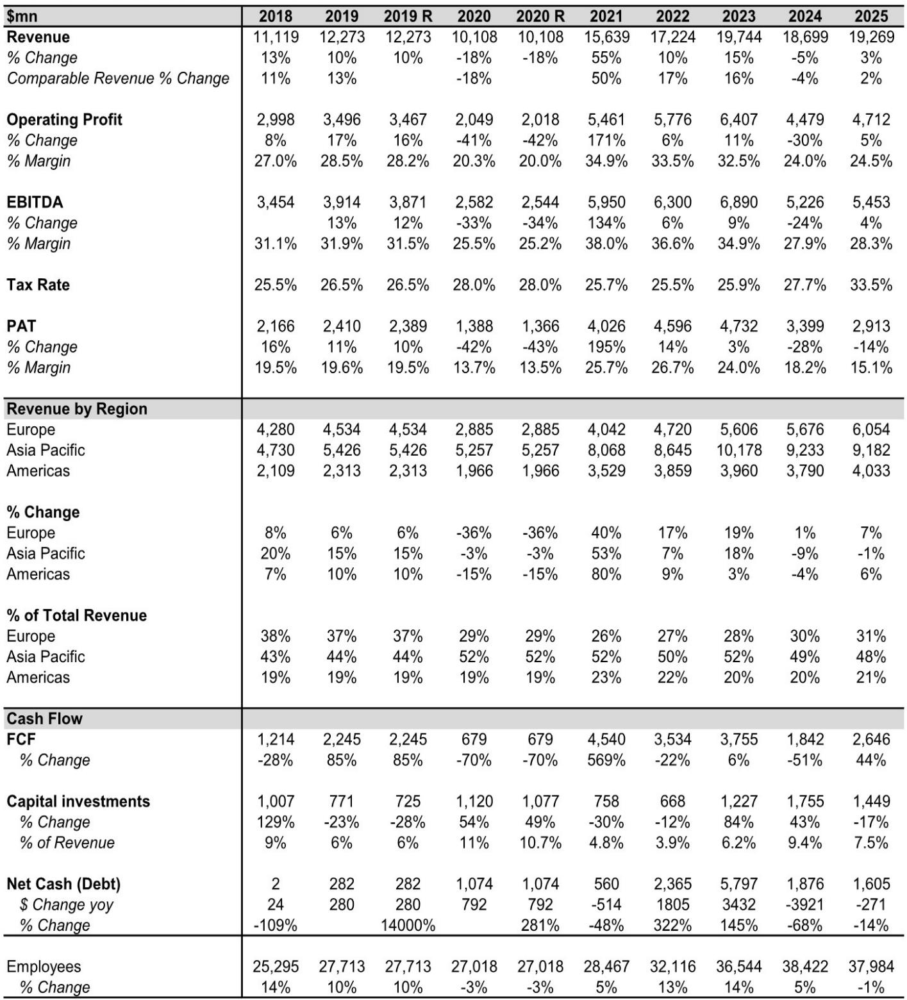
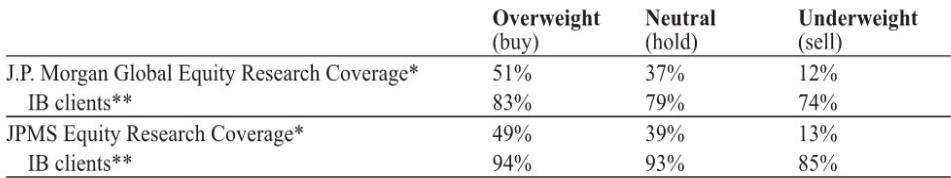

# Chanel’s Turnaround Is Real, But the Recovery Is Not What It Seems

The luxury industry has spent the past eighteen months bracing for a reckoning. Demand normalization after the post-pandemic boom, a sluggish recovery in China, and rising investment costs have compressed margins across the sector. Against this backdrop, Chanel’s full-year FY25 results, released overnight, offer a rare piece of constructive news: group sales returned to growth, EBIT margins improved, and free cash flow rebounded sharply. At first glance, the numbers suggest that one of the world’s most valuable private luxury houses has successfully navigated the downturn and is now re-accelerating. The surface story is encouraging. The deeper story is far more strategic, and far less comfortable for competitors.

Chanel reported FY25 revenue of $19.3 billion, up 2% on an organic basis and 3% reported. EBIT margin rose 50 basis points to 24.5%, and free cash flow surged 44% year-on-year to $2.6 billion. The headline is that the company has stopped the bleeding. But a careful reading of the results, combined with high-frequency tracking data and management commentary, reveals something more consequential: Chanel is not merely recovering; it is repositioning itself as a structurally tougher competitor in soft luxury for 2026 and beyond. The margin recovery is real but incomplete. The investment cycle is deliberate, not defensive. And the brand momentum, which accelerated in the second half of FY25 and into the first quarter of FY26, is now being amplified by a series of structural moves that competitors will find hard to match.

This article unpacks the FY25 results through a strategic lens. It argues that Chanel’s current trajectory reflects a deliberate trade-off between near-term profitability and long-term competitive advantage. The report raises a set of unresolved questions that will determine whether this recovery is sustainable or simply a cyclical bounce. And it offers a decision framework for investors and executives trying to assess what Chanel’s resurgence means for the broader luxury landscape.

## Chanel’s Return to Growth Is Driven by the US and a Structural Rebound in Fashion, Not by China

The most important single data point in the FY25 release is not the group-level revenue number. It is the regional breakdown. The Americas grew 7% organically, reaching a record high of over $4 billion in sales. This marks a sharp reversal from FY24, when the region contracted 4% on an organic basis. Europe grew 2.5%, also sequentially improving from the prior year. Asia Pacific remained slightly negative at -1% organic, but this represents a significant improvement from -7% in FY24, and the region turned positive by year-end.

The implication is clear: Chanel’s recovery is not dependent on a Chinese consumer rebound. It is being led by the US market, where the brand has invested heavily in clienteling, store experiences, and marketing. The Asia Pacific trajectory is improving, but the region is still below its FY23 peak of over $10 billion in sales. For investors who have been conditioned to view luxury demand as primarily China-driven, this is a useful corrective. Chanel’s brand equity and pricing power are sufficiently strong to generate growth in markets where consumer confidence is recovering, even while the Chinese consumer remains cautious.

The product-level detail reinforces this reading. Fashion, led by ready-to-wear and the new Chanel 25 handbag campaign, posted positive performance. Fragrance and beauty were driven by fragrance growth, notably the Chance Eau Splendid launch. Watches and jewellery continued to grow, with the Coco Crush range singled out as a driver. The watch and jewellery division received the longest description in the release, which is itself a signal: Chanel is investing disproportionately in high-margin, high-aspiration categories that deepen its luxury credentials. The launch of the J12 Bleu, the first high jewellery collection venture in Kyoto, the Première Galon bracelet watch, and new dedicated boutiques in Sydney, Bangkok, and Hong Kong all point to a deliberate strategy of elevating the brand beyond its traditional fashion and handbag core.

The so-what is straightforward: Chanel is not just selling more; it is selling more in the categories and regions that matter most for long-term brand equity. The US recovery is structural, not cyclical. The fashion division is regaining momentum. And the watch and jewellery push is a long-term bet on higher spending per client. These are not accidental outcomes. They are the result of multi-year investment decisions that are now beginning to pay off.

## Margins Are Improving, But the Gap to Historical Peers Reveals a Deliberate Investment Strategy

The 50-basis-point improvement in EBIT margin to 24.5% is welcome, but it must be contextualized. Chanel’s pre-Covid average margin was approximately 28%. During the post-pandemic boom years of 2021 to 2023, margins averaged around 33%. The current level is still nearly 900 basis points below that peak. The margin recovery is real, but it is incomplete, and it is incomplete by design.

Management commentary makes clear that FY25 was another year of heavy investment. Marketing, store renovations, and clienteling programs all received significant spending. The number of employees declined by 1% year-on-year, the first reduction in a decade outside of the Covid year. This is not a cost-cutting story. It is a reallocation story. Chanel is spending less on headcount and more on brand-building infrastructure. The employee reduction is marginal, but the symbolic signal is important: the company is willing to trim operational fat to fund strategic investment.

Capex as a percentage of sales normalised to 7.5% in FY25, down from 9.4% in FY24 but broadly in line with the historical average of around 7%. However, the composition of that capex is more telling than the absolute level. Over $700 million, nearly half of the total capex budget, was invested in manufacturing, specifically in leather goods and watches and fine jewellery expertise. Chanel now controls nearly 75 of its suppliers. This is a vertical integration strategy that goes far beyond what most luxury peers have attempted. The new fragrance manufacturing facility in France, which opened in February 2026, is just one visible manifestation of a much deeper supply chain transformation.

The strategic logic is clear: by owning more of its supply chain, Chanel gains flexibility, agility, and quality control. It can respond faster to shifts in demand, protect its margins from supplier pricing power, and ensure that the craftsmanship narrative remains authentic. This is not a short-term margin play. It is a long-term competitive moat. The margin gap to historical levels is the price Chanel is paying to build that moat. The question for investors is whether that price is worth it.

## The High-Frequency Data Suggests Chanel’s Momentum Is Accelerating, Turning It Into a Tougher Competitor in 2026

The most provocative insight in the report is not in the financial statements. It is in the observation that high-frequency data, tracked by the analysts, shows steadily accelerating momentum since Chanel’s recent designer shows, particularly throughout the first quarter of FY26. Management itself noted that brand momentum started to improve in the second half of FY25, with sales running at high single-digit percentage growth, ahead of the new designer’s collections. The data now suggests that the acceleration has continued and possibly strengthened.

This is significant for several reasons. First, it implies that the new creative direction is resonating with consumers faster than expected. Second, it suggests that the investment in marketing and store experiences is amplifying the creative impact. Third, and most importantly for competitors, it means that Chanel is entering 2026 with genuine momentum, not just a base-effect recovery. For brands like Hermès, LVMH’s fashion houses, and Kering’s soft luxury portfolio, Chanel’s resurgence represents a direct competitive threat. If Chanel is gaining share in the US and stabilizing in Asia, rivals will have to work harder to defend their positions.

The high-frequency data is not publicly available in the report, but the directional claim is credible. Luxury demand is notoriously difficult to track in real time, but footfall, search trends, and social media engagement all point to a brand that is gaining cultural relevance. The combination of a new designer, a successful handbag campaign, and sustained investment in clienteling creates a virtuous cycle: more interest drives more traffic, which drives more sales, which funds more investment. Chanel appears to be in the early stages of that cycle.

The unresolved question is whether this momentum is sustainable. New designer enthusiasm typically has a honeymoon period. The risk is that the acceleration fades once the novelty wears off, especially if the macroeconomic environment deteriorates. But the data through Q1 FY26 is encouraging, and the structural investments in supply chain and vertical integration provide a buffer that most peers do not have.

## What the Report Does Not Fully Answer: The Sustainability of the Cash Flow Recovery and the China Trajectory

For all the positive signals in the FY25 results, there are two critical areas where the report raises more questions than it answers. The first is cash flow. Free cash flow rebounded 44% to $2.6 billion, but this is still nearly 30% below the levels achieved in FY22 and FY23. The improvement is real, but the absolute level remains depressed relative to the post-pandemic peak. Moreover, the company’s net cash position declined from $1.9 billion to $1.6 billion, a 14% drop. Chanel is still generating cash, but it is also spending heavily. The question is whether the investment cycle will begin to moderate in FY26, allowing free cash flow to recover further, or whether the capex intensity will persist as the company continues to build out its supply chain and retail network.

The second unresolved question is the China trajectory. Asia Pacific sales improved sequentially, but the region is still below FY23 levels. The report notes that the region turned positive by year-end, but it does not provide enough granularity to assess whether this is a sustainable recovery or a temporary bounce driven by pent-up demand. China’s luxury consumer has been cautious, and the macroeconomic headwinds are not abating. Chanel’s relative strength in the US is a positive, but if Asia Pacific remains weak, the group-level growth rate will be capped. The report leaves open the question of whether Chanel’s brand positioning is sufficiently differentiated to outperform in a still-challenging Chinese market.

These are not weaknesses in the analysis. They are honest uncertainties. Any investor or executive trying to assess Chanel’s trajectory must grapple with them. The margin recovery is real but incomplete. The cash flow recovery is real but fragile. The China recovery is real but unproven. The strategic direction is clear, but the timing of the payoff is not.

## A Decision Framework for Evaluating Chanel’s Strategic Position

For readers who want to translate the report’s insights into actionable analysis, the following framework may be useful. It is designed to help investors and executives assess whether Chanel’s current trajectory is likely to continue or whether it will hit a ceiling.

First, evaluate the momentum sustainability. The key leading indicators are not the financial statements but the high-frequency data: footfall in flagship stores, search volume for new collections, and social media engagement around the designer shows. If these indicators continue to improve through the first half of FY26, the revenue acceleration is likely to persist. If they plateau, the recovery may have already peaked.

Second, assess the margin trajectory relative to the investment cycle. The margin gap to historical levels is the cost of Chanel’s strategic investments. The question is whether those investments are generating a sufficient return. The vertical integration strategy should eventually improve gross margins, but it requires upfront capital. The marketing and store investments should eventually drive higher revenue per square foot, but they take time to mature. The margin recovery will accelerate only when the investment intensity begins to moderate. The report does not provide a timeline for that moderation, but it is the single most important variable for earnings quality.

Third, monitor the competitive response. Chanel’s momentum is a threat to other soft luxury brands, particularly those that are more exposed to the US market and less vertically integrated. If competitors respond by increasing their own marketing spend or accelerating their own supply chain investments, the industry-wide cost base could rise, compressing margins for everyone. Chanel’s advantage is that it is privately held and can afford to take a longer-term view. Publicly traded competitors do not have that luxury.

Fourth, track the China trajectory with more granularity. The regional data in the report is too aggregated to draw firm conclusions. Investors should seek out store-level data, tourist spending patterns, and local market commentary to assess whether the year-end improvement in Asia Pacific is broad-based or concentrated in a few markets. If China is genuinely recovering, Chanel’s growth story becomes much more compelling. If it is not, the US will have to carry the weight.

## The Full Report Contains Charts and Data That Cannot Be Summarized Here

The analysis above is based on the public release of Chanel’s FY25 results and the accompanying analyst commentary. But the full report, which is available to subscribers, contains a wealth of additional detail that cannot be captured in a single article. It includes high-frequency data tracking, historical margin decomposition, regional revenue trends by quarter, and a comparison of Chanel’s investment intensity relative to its peer group. The charts alone are worth the read.

Join the community to read the full report and review the original charts.

*This article is for learning and discussion only and does not constitute investment advice.*

Personal reading notes and learning share only. Not investment advice.

