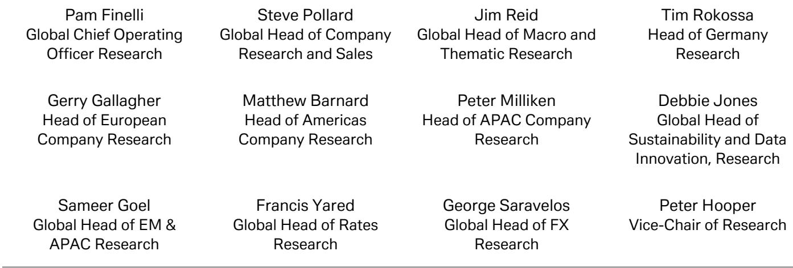

# The Fed's Next Move Is No Longer a Cut — It May Be a Hike, and Markets Are Not Pricing That In

The consensus that central bank policy rates have peaked and will only move lower from here is now the most dangerous assumption in global macro. A single data point from a single Fed official should not normally shift the entire policy horizon, but the combination of Fed Governor Waller's hawkish shift, the Michigan survey's alarming jump in long-term inflation expectations, and the persistent strength in US economic data has created a configuration that the market has not yet fully absorbed. The question is no longer whether the next move is a cut, but whether the next move is a hike — and if so, what that means for asset prices that have been built on the opposite premise.

A global investment bank report published in late May 2026 lays out the evidence with unusual clarity. Waller, who has been one of the most dovish members of the Federal Open Market Committee, stated publicly that he can "no longer rule out rate hikes further down the road if inflation does not abate soon." He also declared that a rate cut is "no more likely than a hike" as the Fed's next move. For a policymaker who has consistently leaned toward accommodation, this is not a minor shift in tone. It is a structural re-evaluation of the risk landscape.

The implications extend well beyond the next FOMC meeting. If the Fed's own internal hawks are now rethinking the direction of policy, then the entire yield curve, the dollar, and risk assets are sitting on a foundation that may be about to crack. This article argues that the market is underappreciating the probability of a 2026 rate hike, that the Fed's own policy framework may have become overinsured against labor market risks, and that investors need to rethink their base case for duration, inflation breakevens, and currency positioning.

## The Fed's Dovish Pivot Was an Insurance Policy That May Now Be Expensive to Maintain

The most analytically useful frame for understanding the current moment is not whether the Fed made a mistake in cutting rates, but whether it over-insured against the wrong risk. The report's US economist, Matt Luzzetti, provides a critical historical perspective. The Fed delivered 175 basis points of rate cuts even as inflation remained well above target. Relative to standard policy rules, the first round of cuts in 2024 was defensible. But after the second round of cuts last year, and given the recent acceleration in inflation, the federal funds rate is now significantly below the level implied by almost any policy rule.

This is the crux of the argument. The Fed's rate cuts were framed as insurance against downside risks to the labor market. That was a reasonable posture when the economy appeared fragile. But the economy has since proven resilient, and inflation has reaccelerated. The insurance policy is now generating a liability. The Fed is holding an instrument that is too accommodative for the current economic reality, and the longer it stays there, the more it risks embedding higher inflation expectations into the system.

The implications for investors are direct. If the Fed needs to reverse some of its insurance — by hiking rates — then the front end of the curve is too low. The market is currently pricing a path that assumes the next move is a cut. If that assumption breaks, the repricing will be sharp. Short-duration Treasuries, which have been the safe haven of choice for cautious allocators, would face principal losses. The dollar would likely strengthen, not weaken, as the market reprices a higher terminal rate. And risk assets that have been buoyed by the prospect of easier monetary policy would face a headwind.

The open question is how much insurance the Fed will decide to unwind. The report does not provide a clear answer, and that ambiguity is itself a risk. Investors should ask themselves: if the Fed hikes once, what is the second-order effect on credit spreads, on emerging market debt, and on equity valuations that are already near record highs?

## Inflation Expectations Are No Longer Anchored, and That Changes the Fed's Reaction Function

The University of Michigan survey for May delivered a shock that has not yet been fully priced into financial markets. Consumer sentiment fell to 44.8, a historic low. But the more troubling data points were in the inflation expectations component. One-year ahead inflation expectations rose to 4.8%, up from 3.4% in February, before the Iran shock. The five-to-ten-year ahead measure jumped to 3.9%, a level that is inconsistent with the Fed's 2% target and that signals a dangerous de-anchoring of long-term expectations.

This is not a flash in the pan. The report notes that the spike in these measures is "consistent with other signs that US inflation expectations are tracking higher." When consumers expect 4% inflation over the next five to ten years, they change their behavior. They demand higher wages. They accelerate purchases to beat future price increases. They shift their savings strategies. Those behavioral changes feed back into actual inflation, creating a self-fulfilling cycle that monetary policy must break.

For the Fed, this changes the reaction function dramatically. When inflation expectations are anchored, the central bank can afford to be patient. It can wait for supply-side fixes or for transitory factors to fade. But when expectations become unanchored, patience becomes a liability. The Fed must act preemptively to restore credibility, even if that means hiking into an economy that is already slowing.

The report's decomposition of the recent rise in US yields provides a critical insight here. The selloff in US rates since late April has occurred mostly during New York morning hours, and the correlation between 10-year yields and data surprise indices has strengthened. This is not a technical selloff driven by investor flows or positioning. It is a macroeconomic repricing. The market is already beginning to price in the implications of stronger data and higher inflation. But the question is whether it has gone far enough.

If the Fed is forced to hike to re-anchor expectations, the 10-year yield could move significantly higher from current levels. That would have implications for mortgage rates, for corporate borrowing costs, and for the valuation of growth stocks that are sensitive to the discount rate. Investors who are positioned for a benign outcome — a soft landing with falling rates — may be exposed to a regime shift they have not prepared for.

## The Fed's Hawkish Pivot Has Global Spillovers That Are Already Visible in Currency and Bond Markets

The implications of a potential Fed hike are not confined to the United States. The report's analysis of UK and Australian data provides a window into how global monetary policy interacts with domestic conditions. The British are leaving for Australia in record numbers. The population of British nationals aged 20 to 29 resident in Australia grew by 40% between June 2021 and June 2025. Over 79,000 Brits were granted Australian Working Holiday Maker visas in the year ending June 2025, up from around 20,000 the prior year.

This is not just a demographic curiosity. It is a signal about relative economic opportunity. The report's UK economist argues that this exodus reflects a stagnation in UK living standards. But the deeper point is that monetary policy divergence drives capital flows, and capital flows drive currency movements. If the Fed is forced to hike while the Bank of England is cutting or holding, the dollar strengthens against sterling. That makes UK assets less attractive to foreign investors and exacerbates the UK's inflation problem by making imports more expensive.

The same logic applies to the euro area. The report notes that Germany's general government deficit might be around 4.1% of GDP in 2026, reflecting structural increases in federal spending and a weaker growth outlook. A stronger dollar and higher US rates would put pressure on the euro, forcing the ECB to choose between defending the currency and supporting growth. That is not a comfortable choice for a region with already weak demand.

For investors, the takeaway is that a Fed hike would not be a US-only event. It would tighten global financial conditions. Emerging markets that have benefited from a weak dollar and low US rates would face capital outflows and currency depreciation. The carry trade would unwind. The report does not fully explore these second-order effects, but they are the logical consequence of the primary argument.

The open question is whether other central banks will follow the Fed or diverge. If the Fed hikes and the ECB holds, the euro weakens, and European inflation rises. That creates a dilemma for the ECB. If the Fed hikes and the Bank of Japan holds, the yen weakens further, which is exactly what Japanese policymakers do not want given the recent volatility in the yen. The global monetary policy coordination that characterized the post-COVID period is breaking down, and the breakdown will create winners and losers.

## What the Report Does Not Fully Answer: The Threshold for a Hike and the Role of Political Pressure

For all its analytical rigor, the report leaves several critical questions unanswered. The first is the threshold. Waller said he can "no longer rule out" hikes, but he did not specify what data would trigger one. Would one more month of elevated core PCE be enough? Would it require a sustained trend? Would the Fed need to see wage growth accelerate? The report provides no clear answer, and that uncertainty is itself a risk.

The second unanswered question is the role of political pressure. The 2026 US political calendar is not irrelevant. If the economy is slowing and inflation is still high, the Fed faces pressure from both sides. Fiscal policymakers who are running large deficits do not want higher rates. Labor groups do not want a recession. But the Fed's mandate is price stability, and if it fails to act, it risks a loss of credibility that would take years to restore.

The third gap is the interaction between Fed policy and the banking system. The regional banking stress of 2023 demonstrated that higher rates can create financial stability risks. If the Fed hikes again, will the banking system absorb it? The report does not address this directly, but it is a crucial consideration for any investor assessing the probability of a hike.

These gaps are not weaknesses in the report. They are honest acknowledgments of the limits of forecasting. But they do mean that investors need to build their own frameworks for assessing the probability of a hike and the implications for their portfolios.

## A Decision Framework for Investors: How to Position for the Asymmetric Risk of a Fed Hike

Given the analysis above, investors need a decision framework that accounts for the asymmetric risk of a Fed hike. The base case should no longer be that the next move is a cut. The probability of a hike is higher than the market is pricing, and the consequences of being wrong about that are severe.

The first step is to reassess duration exposure. If the Fed hikes, short-duration Treasuries will not provide the safe haven they have in recent years. The front end will reprice higher, and the curve will likely steepen as long-term inflation expectations remain elevated. Investors should consider reducing duration or hedging with rate caps or swaptions.

The second step is to reassess currency exposure. A Fed hike would strengthen the dollar, particularly against currencies where central banks are dovish. Sterling and the euro are vulnerable. The yen is more complicated, given the Bank of Japan's gradual normalization, but a stronger dollar would still put pressure on the yen. Emerging market currencies that are dependent on carry trade flows are the most exposed.

The third step is to reassess equity sector exposure. Growth stocks, particularly in the technology sector, are sensitive to discount rates. If the Fed hikes, the valuation multiple compresses. Value stocks, particularly in the energy and materials sectors, may benefit from higher inflation and stronger nominal GDP growth. Financials may benefit from a steeper yield curve, but only if credit quality holds up.

The fourth step is to reassess inflation hedging. If the Fed is hiking because inflation expectations are de-anchoring, then breakeven inflation rates may have more room to rise. TIPS and commodity exposure may be warranted, even if they seem expensive relative to history.

The final step is to recognize that the most dangerous position is the consensus position. If the market is pricing no hike and the Fed delivers one, the moves will be violent. Investors who are positioned for the consensus will be forced to adjust under duress. The time to prepare is now, not after the data confirms the shift.

## Join the Community to Read the Full Report and Review the Original Charts

The analysis above is based on a single day's report from a global investment bank, but the implications extend to the entire macro landscape for the remainder of 2026. The full report contains detailed charts on the time zone decomposition of the US yield selloff, the evolution of Michigan inflation expectations, and the policy rule comparisons that underpin the over-insurance argument. These charts are essential for any investor who wants to understand the data behind the argument, not just the argument itself.

The report also includes a week-ahead calendar that highlights the key data releases — US core PCE, European flash CPI, Tokyo CPI, and the RBNZ decision — that will test the market's current assumptions. For investors who want to stay ahead of the curve, not just react to it, the full report is an indispensable resource.

Join the community to read the full report and review the original charts. The data is there. The question is whether you are willing to challenge your own assumptions before the market does it for you.

*This article is for learning and discussion only and does not constitute investment advice.*

Personal reading notes and learning share only. Not investment advice.

