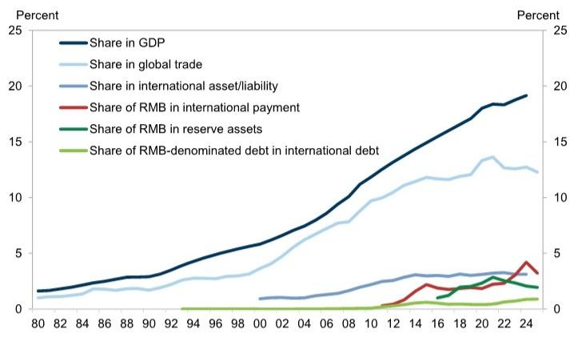
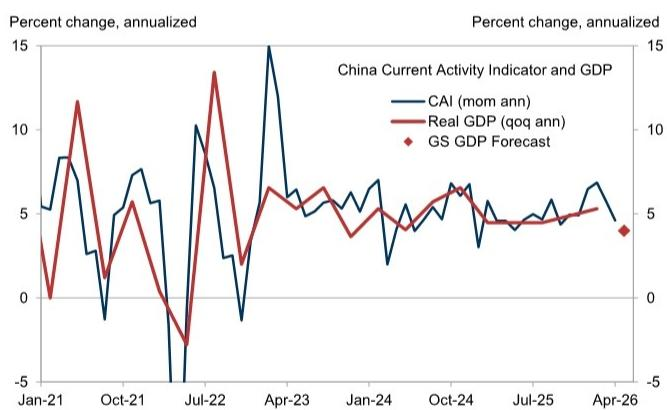

# China's Growth Story Is Splitting: Export Strength Masks a Domestic Slowdown That Requires a New Policy Response

The April data from China delivered a clear and sobering message: the economic recovery is not yet synchronized, and the risks are tilted to the downside. Industrial production grew at just 4.1% year-on-year, retail sales barely rose at 0.2%, and fixed asset investment contracted by 8% year-on-year. This was not a routine monthly wobble. According to a proprietary macro surprise score, this was the most negative data miss since May 2023. The headline numbers are bad enough, but the real story lies in the divergence beneath them. Exports remain robust, but domestic demand is weakening. The economy is effectively operating on two tracks, and the gap between them is widening.

This divergence matters because it forces a fundamental reassessment of what is driving Chinese growth and what policy levers will actually work. The strong export performance is a tailwind, but it is also a distraction. It masks the underlying fragility in consumption, investment, and fiscal momentum. The market's focus on headline GDP growth figures risks underestimating the structural shift taking place. The question is no longer whether China can grow, but whether it can grow in a balanced way that supports corporate earnings, consumer confidence, and capital market stability.

The encouraging property market data offers a glimmer of hope, but it is too early to declare a turning point. April FX inflows of USD 37 billion and continued policy support for RMB internationalization add another layer of complexity. The Chinese economy is sending mixed signals, and investors need a framework to separate the signal from the noise. The April data miss is not a reason to panic, but it is a reason to think harder about where the real vulnerabilities lie and what a credible policy response would look like.

## The April Data Miss Was Not Just a Blip; It Reveals a Structural Shift in Domestic Demand Dynamics

The weakness in the April data was broad-based, but it was not random. The sharp decline in industrial production was partly driven by technical factors, including a slowdown in fiscal spending and specific headwinds from the global energy supply shock. Chemical and refined oil production fell sharply. This is not a demand collapse across the board; it is a shift in the composition of activity. The economy is rebalancing away from energy-intensive manufacturing, and the transition is proving disruptive.

The retail sales figure of 0.2% year-on-year growth is particularly concerning. It suggests that household consumption is stalling. This is not a temporary pandemic hangover; it reflects deeper structural issues around income expectations, housing wealth effects, and precautionary saving. The property market stabilization, if it holds, could help rebuild household confidence, but the link between property prices and consumer spending is not automatic. It takes time for rising asset values to translate into higher consumption.

Fixed asset investment falling 8% year-on-year is the most alarming data point. This is not just about real estate. Infrastructure and manufacturing investment are also under pressure. The slowdown in fiscal spending is a key factor. When the government pulls back on spending, the private sector often follows. The sequential real GDP growth forecast of 4.0% in the second quarter, down from 5.3% in the first quarter, reflects this reality. The economy is decelerating, and the deceleration is concentrated in the domestic sectors that are most sensitive to policy and confidence.

## The Property Market Stabilization Is Real but Fragile, and It Will Not Automatically Reboot the Broader Economy

The high-frequency data on property sales is genuinely encouraging. Sales volumes for both new and existing homes have stabilized. The official 70-city indices show that sequential price declines have eased, and prices in tier-1 cities actually rose for both new and existing homes. This is a meaningful shift after a prolonged downturn. It suggests that policy measures, including lower mortgage rates and relaxed purchase restrictions, are having some effect.

But stabilization is not the same as recovery. The property market remains fragile. Transaction volumes are still well below historical averages. Developer balance sheets are still stressed. The risk of further price declines in lower-tier cities remains significant. The tier-1 city price increases may be a leading indicator, but they could also be a misleading one if they reflect a concentration of demand rather than a broad-based improvement.

The real question is whether property market stabilization can spill over into the broader economy. In theory, rising property prices increase household wealth, which supports consumption. In practice, the transmission mechanism is weak in the current environment. Households are still deleveraging. The labor market is uncertain. The willingness to spend a housing windfall is low. The property market improvement is a necessary condition for a broader recovery, but it is not sufficient. It needs to be accompanied by a recovery in income growth and consumer confidence.

## FX Inflows and RMB Internationalization Are Progressing, but the Gap Between Ambition and Reality Remains Wide

The April FX inflow of USD 37 billion is a positive data point. It suggests that capital flows are not as negative as some feared. The policy push for RMB internationalization is real and sustained. The research report takes a deep dive into this topic, and the conclusion is clear: progress has been made, but the RMB's share of global financial markets remains small.

The data on RMB usage across various metrics is striking. The RMB's share in global trade is modest, its share in international payments is even smaller, and its share in reserve assets is minimal. The gap between China's economic weight and the RMB's financial weight is enormous. Closing this gap will require more than just trade settlement. It will require improvements in financial infrastructure, deeper liquidity in offshore markets, better risk-management tools, and a greater supply of RMB-denominated assets.

This is a long-term story, not a near-term catalyst. The policy direction is clear, but the pace of change is slow. Investors should not expect RMB internationalization to drive significant capital flows or currency appreciation in the near term. The real payoff will come over years, not quarters. The April FX inflow is a reminder that China can attract capital, but it is also a reminder that the RMB's role in the global financial system is still marginal.

## What the Report Does Not Fully Answer: The Interaction Between Fiscal Policy and Consumer Confidence

The report identifies the slowdown in fiscal spending as a technical factor behind the April data miss, but it does not fully explore the implications. Fiscal policy is the most direct tool the government has to support domestic demand. If fiscal spending is slowing, it suggests that the government is either constrained by revenue shortfalls or deliberately choosing to restrain spending. Either explanation has significant consequences for the growth outlook.

The report also does not fully address the consumer confidence puzzle. Retail sales growth of 0.2% is a flashing red light. The property market stabilization should, in theory, support confidence, but the data suggests it is not happening. What would it take to restore consumer confidence? Lower interest rates? More aggressive fiscal transfers? A sustained recovery in the labor market? The report leaves these questions open, and they are the most important ones for investors to monitor.

The interaction between fiscal policy and consumer confidence is the missing piece of the puzzle. Without a recovery in consumer spending, the export-led growth model will become increasingly unbalanced. The government has the tools to act, but it has been reluctant to use them aggressively. The April data miss may force a recalibration. The next few months of policy announcements will be critical.

## A Decision Framework for Investors: How to Position for a Diverging Chinese Economy

The key insight from the April data is that the Chinese economy is not a single story. It is a story of two tracks: a strong export sector and a weak domestic sector. Investors need to position accordingly. Here is a simple framework for thinking about the implications.

First, monitor the property market data closely. The high-frequency sales data is the most reliable leading indicator. If sales volumes continue to stabilize and broaden to lower-tier cities, it will support a more constructive view on domestic demand. If sales volumes weaken again, the domestic outlook will deteriorate further.

Second, watch fiscal policy announcements. The government's willingness to increase spending is the most important policy variable. If fiscal spending accelerates, it will support infrastructure and manufacturing investment. If it remains subdued, the domestic demand weakness will persist.

Third, assess the RMB internationalization story realistically. It is a long-term positive, but it is not a near-term driver of capital flows or currency appreciation. Investors should not overweigh it in their near-term positioning.

Fourth, focus on sectors that are levered to exports and global demand. These sectors are likely to outperform domestic-oriented sectors in the near term. The export strength is real and durable, driven by global demand and supply chain diversification. Domestic-oriented sectors, including consumer discretionary and real estate, will remain under pressure until there is clear evidence of a domestic demand recovery.

Finally, be patient on the consumer recovery. The April retail sales data is a reminder that consumer confidence is fragile. It will take time and policy support to rebuild it. Investors should not rush to buy consumer stocks based on a single month of property market improvement.

## Join the Community to Read the Full Report and Review the Original Charts

The April data miss is a critical inflection point, but it is only one piece of a larger puzzle. The full report includes detailed charts on the property market tracker, FX flows, and RMB internationalization metrics that provide the granularity needed to make informed decisions. The proprietary macro surprise score and the sequential GDP growth forecasts are essential tools for understanding the trajectory of the economy. Join the community to access the complete analysis and the original data visualizations that support these conclusions. The full report also includes a deeper dive into the policy implications and a scenario analysis that is not covered in this article.

*This article is for learning and discussion only and does not constitute investment advice.*

Personal reading notes and learning share only. Not investment advice.

