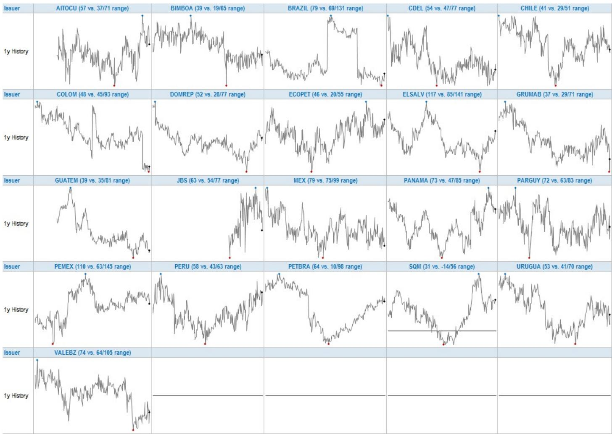
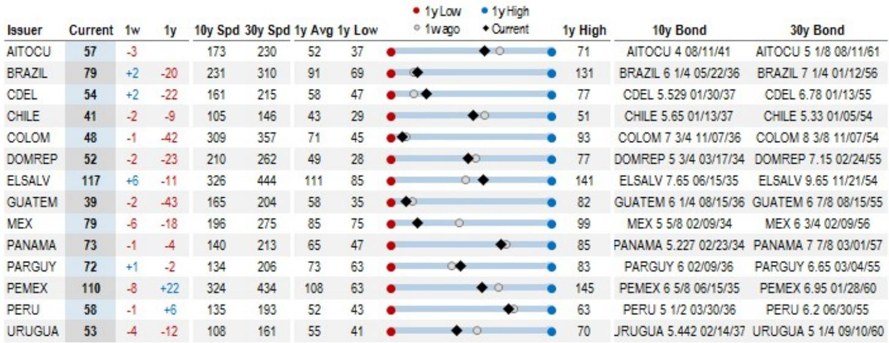
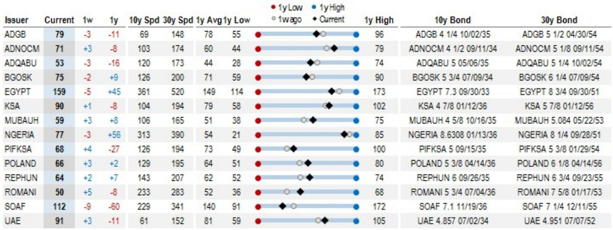

# EM信用债曲线正在传递一个被低估的信号

这份某外资投行在2026年5月22日收盘后发布的EM USD 10s30s Spread Curve报告，表面上是一份常规的每周曲线更新，但数据叠加后的信号并不寻常。EM Aggregate 10s30s利差曲线当前报68个基点，较一周前缩窄2个基点，较一年前收窄7个基点。这些数字本身并不惊人，真正值得关注的是这些数据点背后的结构性含义——新兴市场信用债的期限溢价正在发生系统性重定价，而这种重定价的驱动力、可持续性以及对不同类别发行人的差异化影响，可能被市场参与者低估了。

报告提供了从主权债到公司债、从投资级到高收益、从亚洲到拉美的完整曲线数据切片。把这些切片放在一起看，能得出一个更清晰的判断：当前EM信用曲线的形态变化，反映的不是简单的风险偏好回升，而是全球资本对新兴市场长期信用风险的评估框架正在发生根本性调整。

## 1. 曲线趋平不是短期波动，而是持续了一年的结构性趋势

EM Aggregate 10s30s在2021年5月曾达到约100个基点的水平，2022年5月因美联储激进加息和EM资金外流，曲线一度深度倒挂至约-80个基点。此后曲线逐步恢复正斜率，但恢复的速度和形态在2024年后发生了质变。

从2024年5月到2025年5月，EM Aggregate 10s30s从约70个基点降至约60个基点，再到当前约68个基点。表面上看，过去一年曲线在60-70个基点区间窄幅震荡，似乎没有明确方向。但结合更长时间维度和不同细分指数的数据，趋势就清晰了：曲线的中枢正在下移。2021年EM Aggregate 10s30s的1年均值约为68个基点，而当前水平已低于2024年同期的75个基点左右。

更关键的是，这种趋平并非均匀发生。EM IG的10s30s从一年前的约73个基点降至当前61个基点，收窄幅度达11个基点。而EM HY的10s30s反而从一年前的约81个基点小幅上升至83个基点。投资级与高收益的曲线走势出现明显分化——这意味着市场对两类资产的长期信用评估逻辑正在分开定价，而非统一的风险偏好波动。

这种分化指向一个更深层的含义：EM信用曲线的定价权正在从宏观情绪驱动转向微观信用质量驱动。对于投资级发行人，市场愿意接受更低的期限溢价，因为其长期信用风险被重新评估为更为可控；而对于高收益发行人，长期风险溢价不仅没有下降，反而在上升。

## 2. 区域分化揭示市场正在对“谁真正安全”进行再定价

报告按区域拆分了EMBIG和CEMBI的曲线数据，区域间的差异比整体数据所显示的更为显著。

EMBIG Asia的10s30s当前仅35个基点，较一周前下降6个基点，较一年前大幅收窄24个基点。这是所有区域中曲线最平、收窄幅度最大的。EMBIG LatAm为66个基点，较一年前收窄16个基点。而EMBIG CEEMEA却逆势走陡至81个基点，较一年前走阔10个基点。

这意味着什么？市场正在对不同区域的长期信用风险进行差异化定价。亚洲EM主权债的期限溢价被压缩到接近美国投资级公司债的水平——US High Grade 10s30s当前仅为15个基点。亚洲EM主权债的长期风险溢价正在向成熟市场信用债靠拢，这背后反映的是市场对亚洲EM经济体长期增长韧性、政策纪律和外部脆弱性的重新评估。

相反，CEEMEA区域的主权债曲线在走陡。81个基点的10s30s意味着投资者要求更高的长期风险补偿。报告没有展开具体国别分析，但结合地缘政治环境和外部融资条件的变化，这种走陡很可能反映了市场对部分CEEMEA国家长期偿债能力的担忧在上升。

拉美的情况介于两者之间。66个基点的曲线水平虽然较一年前收窄，但绝对水平仍显著高于亚洲。拉美EM主权债的信用曲线定价，更像是在“安全”和“风险”之间寻找新的均衡点。

这种区域分化对投资者的含义是明确的：在EM信用债配置中，不能再把“新兴市场”作为一个同质化资产类别来对待。区域间的曲线差异已经大到足以影响组合的久期和信用风险暴露结构。

## 3. 公司债曲线比主权债曲线更平，反映的是企业信用质量的相对改善

CEMBI（EM公司债指数）的10s30s当前为55个基点，显著低于EMBIG（EM主权债指数）的71个基点。CEMBI IG为56个基点，CEMBI HY为52个基点。值得注意的是，CEMBI HY的曲线甚至比CEMBI IG更平——52个基点vs 56个基点。

这组数据打破了“高收益意味着更陡曲线”的传统直觉。通常来说，信用质量越低的发行人，其长期债券的期限溢价应该越高，因为投资者需要更多的补偿来持有更长期的信用风险敞口。但当前EM公司债市场呈现的却是HY曲线比IG曲线更平。

报告没有直接解释这一现象，但数据本身提供了线索。CEMBI HY的10年期利差当前为335个基点，30年期利差为387个基点。虽然绝对利差水平很高，但10s30s曲线仅为52个基点。这意味着市场认为，对于CEMBI HY发行人而言，10年期和30年期债券的风险差异并不大——或者说，市场的关注焦点不在期限溢价，而在当前高利差本身是否足以覆盖违约风险。

另一种可能的解释是：CEMBI HY的发行主体集中在特定行业或国别，其长期信用风险具有某种“尾部相关性”，使得市场不愿意为更长期限支付额外溢价。报告没有提供足够细颗粒度的行业或国别数据来验证这一假设，这恰恰是完整报告值得深入阅读的部分。

相比之下，US High Grade 10s30s仅为15个基点，而EM Aggregate为68个基点。EM公司债相对于美国投资级公司债的期限溢价溢价仍然显著，但差距在收窄。一年前这一差距约为52个基点（EM Aggregate 68 vs US HG 16），当前为53个基点（68 vs 15），变化不大。但考虑到EM Aggregate包含了主权债，如果单看CEMBI与US HG的比较，差距从40个基点（56 vs 16）收窄至40个基点（55 vs 15）——几乎持平。EM公司债与美国投资级公司债的期限溢价差距已经稳定在一个相对较窄的水平。

## 4. 报告尚未完全回答的关键问题：曲线趋平能否持续

尽管当前EM信用曲线的形态变化提供了丰富的解读空间，但报告本身留下了一些关键问题没有回答。

第一个问题是：EM Aggregate 10s30s在68个基点的水平上，是否已经充分反映了长期信用风险的改善？历史数据显示，2021年5月该指标在100个基点左右，2024年5月在70个基点左右。当前水平已经接近2024年的低点。如果进一步趋平，需要新的催化剂——要么是全球利率环境的进一步宽松，要么是EM基本面出现超预期的改善。报告没有给出明确的预测，但数据暗示，从历史分位数来看，曲线进一步大幅趋平的空间可能有限。

第二个问题是：CEMBI HY曲线比CEMBI IG更平的现象，是否反映了市场对高收益公司债的定价错误？如果经济下行压力加大，高收益发行人的长期违约风险可能被低估，届时曲线可能从当前的反常形态迅速修正为更陡峭。报告没有讨论这一风险，但对于持有CEMBI HY长期债券的投资者来说，这是一个需要密切关注的问题。

第三个问题是：区域分化的趋势是否会持续？亚洲EM主权债曲线已经压缩到35个基点，接近美国投资级公司债的水平。如果亚洲EM的经济增长放缓或外部条件恶化，这种低期限溢价是否还能维持？CEEMEA区域曲线走陡的趋势是否会进一步加剧？这些问题的答案取决于一系列宏观变量的演变，报告没有提供情景分析。

这些未解问题恰恰是完整报告最有价值的部分——它提供了数据框架和观察视角，但最终的判断需要投资者结合自己的宏观观点和风险偏好来做出。

## 5. 投资者的观察框架：从曲线形态中提取信号

基于报告提供的数据框架，投资者可以建立一套系统性的观察方法，从EM信用曲线中提取交易信号。

第一，关注曲线变化的驱动力。每周的曲线变化数据（Figure 4）显示，过去一周EM Aggregate 10s30s缩窄2个基点，但不同发行人的变化幅度差异巨大。INDON缩窄14个基点，GRUMAB缩窄9个基点，SOAF缩窄9个基点，PEMEX缩窄8个基点；而ELSALV走陡6个基点，ROMANI走陡5个基点，PIFKSA走陡4个基点。这种离散度远高于整体均值的变化幅度。投资者应该关注这些极端变化背后的驱动力——是信用评级调整、特定事件冲击，还是流动性因素？只有理解了驱动力，才能判断变化是暂时的还是趋势性的。

第二，将曲线变化与利差水平结合起来看。报告中的散点图（Figure 6）展示了不同指数的10s30s曲线与10年期利差的关系。一个有用的观察框架是：当曲线趋平而利差收窄时，通常意味着市场对长期信用风险的评估改善；当曲线趋平而利差走阔时，可能意味着市场在压缩期限溢价的同时，对短期信用风险反而更加担忧。当前EM Aggregate的情况是：10年期利差约178个基点，30年期利差约246个基点，10s30s曲线68个基点。与一年前相比，10年期利差和30年期利差均有所收窄，曲线也同步收窄，属于较为健康的组合。

第三，关注曲线与美债收益率曲线的联动。UST 10s30s当前约为51个基点，较一年前的约60个基点有所收窄。EM信用曲线与美债收益率曲线之间存在一定的联动关系，但并非完全同步。当美债曲线趋平而EM曲线趋陡时，可能意味着EM信用风险溢价在独立上升；反之亦然。当前两者都在趋平，但EM曲线趋平的速度更快，这暗示EM信用风险溢价的改善可能部分来自全球利率环境的支撑。

第四，关注极端值的分布。报告列出了当前曲线最陡和最平的前10个发行人。埃及（159个基点）、萨尔瓦多（117个基点）、南非（112个基点）位居最陡前三；印尼（20个基点）、SQM（31个基点）、EXIMBK（34个基点）位居最平前三。这些极端值往往是市场定价分歧最大的地方，也是潜在的交易机会所在。但需要特别注意的是，极端值可能反映的是流动性溢价而非信用风险——对于流动性较差的债券，曲线形态可能被扭曲。

## 6. 完整报告值得深入阅读的三个方向

以上分析基于这份每周数据报告的核心表格和图表。但完整报告还包含了更多层次的细节，对于认真研究EM信用市场的投资者来说，至少有三个方向值得进一步深入。

第一个方向是曲线与信用评级的交叉分析。报告专门有一节讨论“Slope versus Credit Rating Relationship”，但数据摘要中未能完全呈现。信用评级是影响曲线形态的核心变量之一，不同评级档次的发行人在曲线定价上的差异，能够揭示市场对评级迁移风险的定价方式。完整报告中的这一分析，对于理解评级上调/下调对债券价格的影响机制至关重要。

第二个方向是区域内部的国别和行业细分。报告按亚洲、CEEMEA、拉美三个区域提供了10s30s曲线的详细数据，但每个区域内部的国别差异可能比区域间的差异更大。例如，亚洲区域中，印尼主权债的曲线仅为20个基点，而部分亚洲公司债的曲线可能高达60个基点以上。这种国别和行业层面的异质性，是构建精细化信用组合的基础。

第三个方向是历史可比时期的分析。报告提供了从2021年至今的完整历史数据，但摘要中只展示了部分时间序列。2022年EM曲线深度倒挂时期（-80个基点）与当前正斜率时期（68个基点）之间的转换过程，包含了大量关于市场情绪转变和资金流动的信息。完整报告中的历史对比分析，能够帮助投资者判断当前曲线水平在历史周期中的位置。

这些内容在每周的数据更新中可能只是一些数字和图表，但放在一起，它们构成了一个完整的分析框架。对于希望深入理解EM信用市场定价逻辑的投资者来说，完整报告的价值不仅在于数据本身，更在于其系统性的分析方法和跨资产、跨区域的比较视角。

欢迎来星球微信群里继续讨论。这份报告中的区域分化、曲线形态与信用评级的交叉关系、以及极端值的交易含义，都是值得深入探讨的话题。在群里，我们可以进一步拆解报告中的关键图表，分享各自对EM信用曲线未来走势的判断，以及如何将这些分析框架应用到实际投资决策中。

Personal reading notes and learning share only. Not investment advice.

